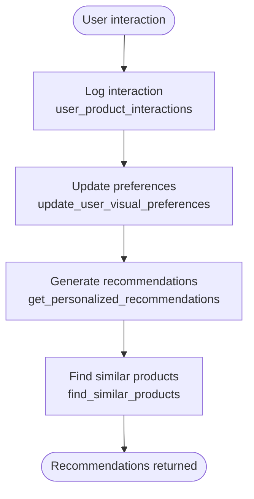

# Relationship & Mapping Tables

<cite>
**Referenced Files in This Document**
- [20260126000000_add_designer_approval_and_follows.sql](file://supabase/migrations/20260126000000_add_designer_approval_and_follows.sql)
- [20260127230305_create_portfolio_tables.sql](file://supabase/migrations/20260127230305_create_portfolio_tables.sql)
- [20260127230400_deprecate_collections.sql](file://supabase/migrations/20260127230400_deprecate_collections.sql)
- [20260127240000_product_authenticity_system.sql](file://supabase/migrations/20260127240000_product_authenticity_system.sql)
- [20260127250000_visual_similarity_engine.sql](file://supabase/migrations/20260127250000_visual_similarity_engine.sql)
- [20260127020000_teams_full_backend.sql](file://supabase/migrations/20260127020000_teams_full_backend.sql)
- [20260214000000_add_designer_to_collections.sql](file://supabase/migrations/20260214000000_add_designer_to_collections.sql)
- [types.ts](file://src/integrations/supabase/types.ts)
- [client.ts](file://src/integrations/supabase/client.ts)
- [admin-client.ts](file://src/integrations/supabase/admin-client.ts)
- [useGlobalSearch.tsx](file://src/hooks/useGlobalSearch.tsx)
- [ShopCollections.tsx](file://src/pages/shop/ShopCollections.tsx)
- [ShopDesignerProfile.tsx](file://src/pages/shop/ShopDesignerProfile.tsx)
</cite>

## Table of Contents
1. [Introduction](#introduction)
2. [Project Structure](#project-structure)
3. [Core Components](#core-components)
4. [Architecture Overview](#architecture-overview)
5. [Detailed Component Analysis](#detailed-component-analysis)
6. [Dependency Analysis](#dependency-analysis)
7. [Performance Considerations](#performance-considerations)
8. [Troubleshooting Guide](#troubleshooting-guide)
9. [Conclusion](#conclusion)

## Introduction
This document explains the relationship and mapping tables that connect core entities across designers, collections, products, portfolios, teams, and authenticity systems. It covers many-to-many relationships, junction tables, association patterns, follow relationships, approval workflows, authenticity verification tables, and collection mappings. It also documents how referential integrity is maintained, how complex queries are supported, and how the schema evolved from legacy collection submissions to modern portfolio-centric structures. Practical join patterns and common relationship queries are included, along with performance implications and optimization techniques.

## Project Structure
The relationship and mapping logic is primarily defined in PostgreSQL migrations and surfaced to the frontend via Supabase client typing and hooks. The frontend demonstrates usage of these relationships in search, follow/unfollow, and collection/product queries.

**Diagram sources**
- [20260126000000_add_designer_approval_and_follows.sql](file://supabase/migrations/20260126000000_add_designer_approval_and_follows.sql#L4-L136)
- [20260127230305_create_portfolio_tables.sql](file://supabase/migrations/20260127230305_create_portfolio_tables.sql#L6-L86)
- [20260127230400_deprecate_collections.sql](file://supabase/migrations/20260127230400_deprecate_collections.sql#L6-L121)
- [20260127240000_product_authenticity_system.sql](file://supabase/migrations/20260127240000_product_authenticity_system.sql#L4-L238)
- [20260127250000_visual_similarity_engine.sql](file://supabase/migrations/20260127250000_visual_similarity_engine.sql#L6-L289)
- [20260127020000_teams_full_backend.sql](file://supabase/migrations/20260127020000_teams_full_backend.sql#L5-L213)
- [20260214000000_add_designer_to_collections.sql](file://supabase/migrations/20260214000000_add_designer_to_collections.sql#L7-L38)
- [types.ts](file://src/integrations/supabase/types.ts#L1039-L1172)
- [useGlobalSearch.tsx](file://src/hooks/useGlobalSearch.tsx#L14-L103)
- [ShopCollections.tsx](file://src/pages/shop/ShopCollections.tsx#L34-L66)
- [ShopDesignerProfile.tsx](file://src/pages/shop/ShopDesignerProfile.tsx#L20-L112)

**Section sources**
- [types.ts](file://src/integrations/supabase/types.ts#L1039-L1172)
- [client.ts](file://src/integrations/supabase/client.ts#L1-L17)
- [admin-client.ts](file://src/integrations/supabase/admin-client.ts#L1-L28)

## Core Components
- Designer follow system: Many-to-many between users and designers via a dedicated junction table with row-level security and computed follower counts.
- Portfolio system: Projects and assets mapped under portfolios; collection submissions were migrated into this structure.
- Collections and products: Junction table linking collections to products; collections now optionally link to a specific designer.
- Authenticity and IP: Digital certificates per product and per order item; IP registry and linkage tables for designer protection.
- Visual similarity engine: Product visual attributes, precomputed similarity matches, user preferences, and interaction logs.
- Teams: Invitation and join-request workflows with membership and challenge tracking.

**Section sources**
- [20260126000000_add_designer_approval_and_follows.sql](file://supabase/migrations/20260126000000_add_designer_approval_and_follows.sql#L4-L136)
- [20260127230305_create_portfolio_tables.sql](file://supabase/migrations/20260127230305_create_portfolio_tables.sql#L6-L86)
- [20260127230400_deprecate_collections.sql](file://supabase/migrations/20260127230400_deprecate_collections.sql#L6-L121)
- [20260214000000_add_designer_to_collections.sql](file://supabase/migrations/20260214000000_add_designer_to_collections.sql#L7-L38)
- [20260127240000_product_authenticity_system.sql](file://supabase/migrations/20260127240000_product_authenticity_system.sql#L4-L238)
- [20260127250000_visual_similarity_engine.sql](file://supabase/migrations/20260127250000_visual_similarity_engine.sql#L6-L289)
- [20260127020000_teams_full_backend.sql](file://supabase/migrations/20260127020000_teams_full_backend.sql#L11-L213)

## Architecture Overview
The schema enforces referential integrity through foreign keys and maintains data consistency with cascading deletes. Row-level security policies govern access to sensitive tables. Frontend hooks and pages query these relationships efficiently using indexes and precomputed functions.

**Diagram sources**
- [20260126000000_add_designer_approval_and_follows.sql](file://supabase/migrations/20260126000000_add_designer_approval_and_follows.sql#L4-L136)
- [20260127230305_create_portfolio_tables.sql](file://supabase/migrations/20260127230305_create_portfolio_tables.sql#L6-L86)
- [20260127230400_deprecate_collections.sql](file://supabase/migrations/20260127230400_deprecate_collections.sql#L6-L121)
- [20260127240000_product_authenticity_system.sql](file://supabase/migrations/20260127240000_product_authenticity_system.sql#L4-L238)
- [20260127250000_visual_similarity_engine.sql](file://supabase/migrations/20260127250000_visual_similarity_engine.sql#L6-L289)
- [20260127020000_teams_full_backend.sql](file://supabase/migrations/20260127020000_teams_full_backend.sql#L5-L213)

## Detailed Component Analysis

### Designer Follow System
- Purpose: Allow authenticated users to follow designers; compute follower counts via a SQL function.
- Key table: designer_follows with unique constraint on (follower_id, designer_id).
- Security: Select is public; insert/delete restricted to the authenticated user.
- Indexes: Separate indexes on designer_id and follower_id for efficient lookups.

**Diagram sources**
- [20260126000000_add_designer_approval_and_follows.sql](file://supabase/migrations/20260126000000_add_designer_approval_and_follows.sql#L4-L136)
- [useGlobalSearch.tsx](file://src/hooks/useGlobalSearch.tsx#L39-L103)

**Section sources**
- [20260126000000_add_designer_approval_and_follows.sql](file://supabase/migrations/20260126000000_add_designer_approval_and_follows.sql#L4-L136)
- [useGlobalSearch.tsx](file://src/hooks/useGlobalSearch.tsx#L39-L103)

### Portfolio System (Junctions and Mappings)
- Purpose: Replace legacy collection submissions with a unified portfolio structure.
- Tables:
  - portfolios: top-level container for designer portfolios.
  - portfolio_projects: individual projects within a portfolio; tracks source_type and migration_source.
  - portfolio_assets: files/assets associated with projects; links to designers and portfolios.
- Migration: collection_submissions data was migrated into portfolio_projects and portfolio_assets, preserving source metadata.

**Diagram sources**
- [20260127230305_create_portfolio_tables.sql](file://supabase/migrations/20260127230305_create_portfolio_tables.sql#L6-L86)
- [20260127230400_deprecate_collections.sql](file://supabase/migrations/20260127230400_deprecate_collections.sql#L6-L121)

**Section sources**
- [20260127230305_create_portfolio_tables.sql](file://supabase/migrations/20260127230305_create_portfolio_tables.sql#L6-L86)
- [20260127230400_deprecate_collections.sql](file://supabase/migrations/20260127230400_deprecate_collections.sql#L6-L121)

### Collections and Products Mapping
- Purpose: Associate collections with products via a junction table; collections can optionally be assigned to a specific designer.
- Tables:
  - marketplace_collections: collections with optional designer_id.
  - marketplace_collection_products: junction between collections and products.
- Evolution: Legacy collection_submissions were migrated into portfolio_projects; the collection_submissions table was dropped.

**Diagram sources**
- [20260127230400_deprecate_collections.sql](file://supabase/migrations/20260127230400_deprecate_collections.sql#L6-L121)
- [20260214000000_add_designer_to_collections.sql](file://supabase/migrations/20260214000000_add_designer_to_collections.sql#L7-L38)

**Section sources**
- [20260127230400_deprecate_collections.sql](file://supabase/migrations/20260127230400_deprecate_collections.sql#L6-L121)
- [20260214000000_add_designer_to_collections.sql](file://supabase/migrations/20260214000000_add_designer_to_collections.sql#L7-L38)

### Authenticity and IP Verification Tables
- Purpose: Provide digital certificates for products and order items, track ownership and verification, and link products to designer IP registries.
- Tables:
  - product_authenticity_certificates: certificates per product.
  - order_item_certificates: per-item certificates with serial numbers and transfer history.
  - designer_ip_registry: IP registration and verification.
  - product_ip_linkage: many-to-many between products and IP registries.
- Workflows: Certificate generation functions, verification codes, and RLS policies for public and private access.

**Diagram sources**
- [20260127240000_product_authenticity_system.sql](file://supabase/migrations/20260127240000_product_authenticity_system.sql#L4-L238)

**Section sources**
- [20260127240000_product_authenticity_system.sql](file://supabase/migrations/20260127240000_product_authenticity_system.sql#L4-L238)

### Visual Similarity Engine (Vibe-Match)
- Purpose: Recommend visually similar products and personalize recommendations based on user preferences and interactions.
- Tables:
  - product_visual_attributes: visual descriptors and embeddings.
  - product_similarity_matches: precomputed similarity scores.
  - user_visual_preferences: learned preferences.
  - user_product_interactions: events driving preference updates.
- Functions: find_similar_products, get_personalized_recommendations, update_user_visual_preferences.

**Diagram sources**
- [20260127250000_visual_similarity_engine.sql](file://supabase/migrations/20260127250000_visual_similarity_engine.sql#L148-L270)

**Section sources**
- [20260127250000_visual_similarity_engine.sql](file://supabase/migrations/20260127250000_visual_similarity_engine.sql#L6-L289)

### Teams: Invitations, Join Requests, and Membership
- Purpose: Manage team creation, invitations, join requests, and membership roles; track completed challenges.
- Tables:
  - team_invitations: invitations with statuses.
  - team_join_requests: join requests for open teams.
  - team_members: membership with roles.
  - team_stylebox_submissions: challenge submissions linked to teams.
- Functions and policies: invitation/join request checks, team stats, and RLS policies for visibility and management.

**Diagram sources**
- [20260127020000_teams_full_backend.sql](file://supabase/migrations/20260127020000_teams_full_backend.sql#L11-L213)

**Section sources**
- [20260127020000_teams_full_backend.sql](file://supabase/migrations/20260127020000_teams_full_backend.sql#L11-L213)

## Dependency Analysis
The frontend relies on Supabase client typing to ensure correct joins and relationships. The types file enumerates foreign keys and relationships, enabling safe queries.

**Diagram sources**
- [types.ts](file://src/integrations/supabase/types.ts#L1039-L1172)
- [client.ts](file://src/integrations/supabase/client.ts#L1-L17)
- [admin-client.ts](file://src/integrations/supabase/admin-client.ts#L1-L28)

**Section sources**
- [types.ts](file://src/integrations/supabase/types.ts#L1039-L1172)

## Performance Considerations
- Indexes: Strategic indexes on frequently filtered columns (e.g., designer_id, product_id, status, category) improve query performance.
- Full-text search: GIN indexes on text fields enable fast global search across profiles, products, and collections.
- Precomputed functions: Follower counts and recommendation functions reduce runtime computation.
- Cascading deletes: Ensures cleanup without orphaned rows but requires careful cascade planning.
- RLS overhead: Row-level security adds minimal overhead but is essential for data isolation.

[No sources needed since this section provides general guidance]

## Troubleshooting Guide
- Follow/unfollow errors: Ensure the authenticated user ID matches the follower_id in inserts/deletes.
- Search not returning results: Verify GIN indexes exist and the global_search function is granted execute permission.
- Collection product counts: Use exact count queries on the junction table to avoid expensive aggregations.
- Authentication and authorization: Confirm RLS policies allow the intended access patterns for each table.
- Migration artifacts: After collection submissions deprecation, confirm that portfolio_projects reflect migrated data and that the old table is dropped.

**Section sources**
- [20260126000000_add_designer_approval_and_follows.sql](file://supabase/migrations/20260126000000_add_designer_approval_and_follows.sql#L4-L136)
- [20260127230400_deprecate_collections.sql](file://supabase/migrations/20260127230400_deprecate_collections.sql#L6-L121)
- [useGlobalSearch.tsx](file://src/hooks/useGlobalSearch.tsx#L14-L103)
- [ShopCollections.tsx](file://src/pages/shop/ShopCollections.tsx#L34-L66)

## Conclusion
The schema establishes robust many-to-many relationships and junction tables to connect designers, collections, products, portfolios, teams, and authenticity/IP systems. Follow relationships, approval workflows, and visual similarity features are supported by targeted indexes, RLS policies, and precomputed functions. The evolution from legacy collection submissions to portfolio-centric mappings demonstrates a thoughtful migration strategy that preserves historical data while simplifying future maintenance and query patterns.