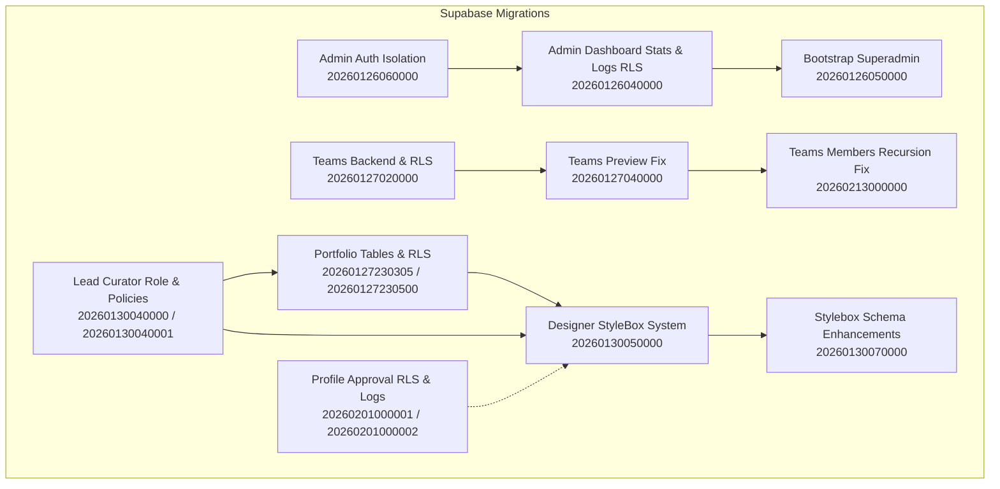
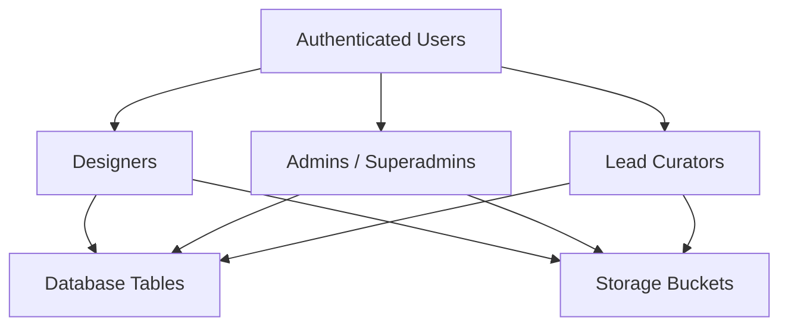
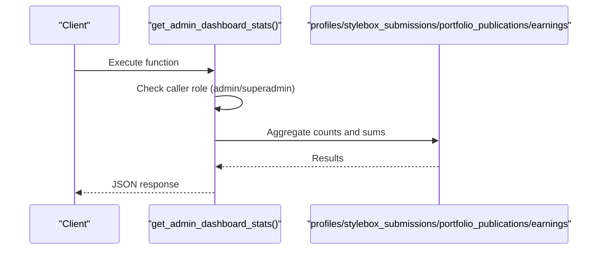
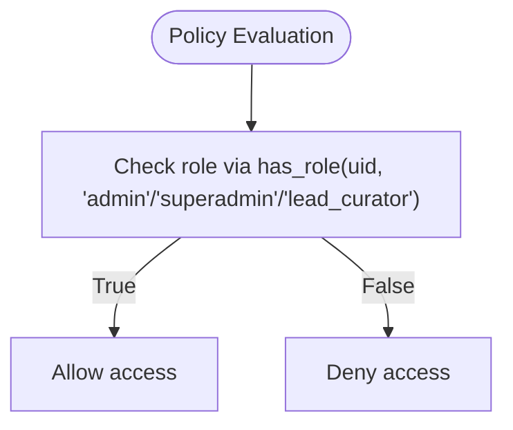
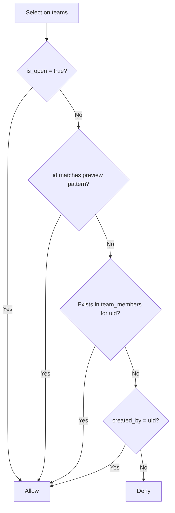
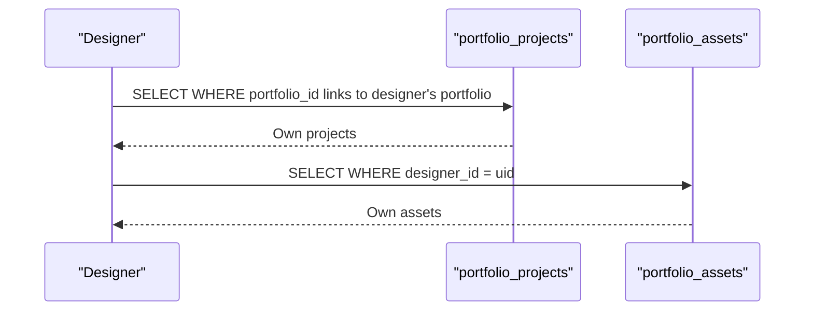
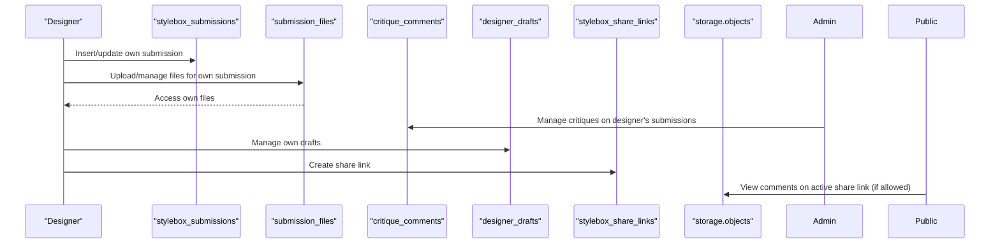
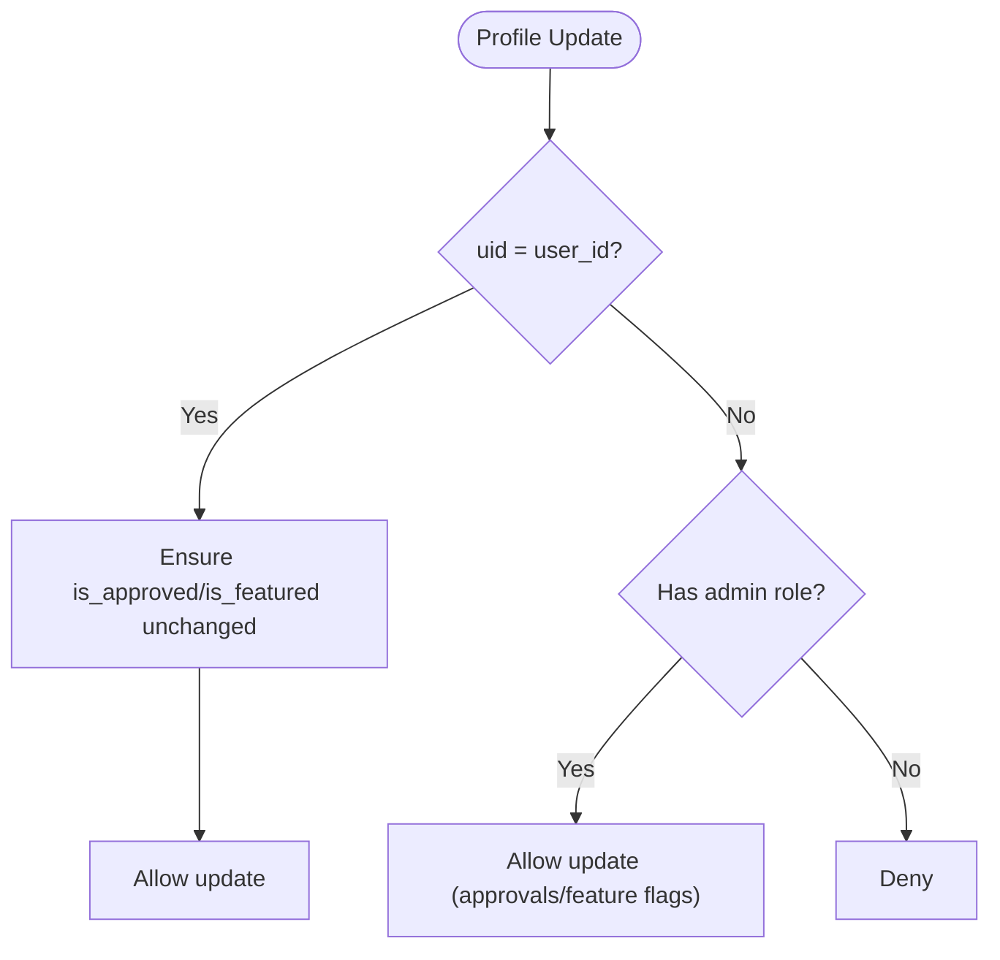
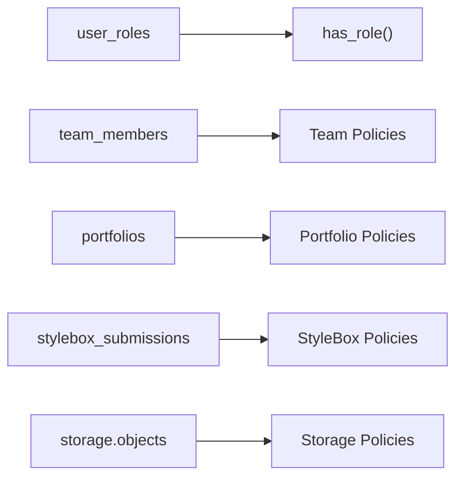

# Row Level Security & Access Control

<cite>
**Referenced Files in This Document**
- [20260126040000_admin_auth_security.sql](file://supabase/migrations/20260126040000_admin_auth_security.sql)
- [20260126050000_bootstrap_superadmin.sql](file://supabase/migrations/20260126050000_bootstrap_superadmin.sql)
- [20260126060000_isolate_admin_auth.sql](file://supabase/migrations/20260126060000_isolate_admin_auth.sql)
- [20260127020000_teams_full_backend.sql](file://supabase/migrations/20260127020000_teams_full_backend.sql)
- [20260127040000_fix_teams_rls_for_preview.sql](file://supabase/migrations/20260127040000_fix_teams_rls_for_preview.sql)
- [20260213000000_fix_team_members_rls_recursion.sql](file://supabase/migrations/20260213000000_fix_team_members_rls_recursion.sql)
- [20260127230305_create_portfolio_tables.sql](file://supabase/migrations/20260127230305_create_portfolio_tables.sql)
- [20260127230500_enhance_portfolio_rls.sql](file://supabase/migrations/20260127230500_enhance_portfolio_rls.sql)
- [20260130040000_add_lead_curator_role.sql](file://supabase/migrations/20260130040000_add_lead_curator_role.sql)
- [20260130040001_update_policies_with_lead_curator.sql](file://supabase/migrations/20260130040001_update_policies_with_lead_curator.sql)
- [20260130050000_designer_stylebox_system.sql](file://supabase/migrations/20260130050000_designer_stylebox_system.sql)
- [20260130070000_complete_stylebox_schema.sql](file://supabase/migrations/20260130070000_complete_stylebox_schema.sql)
- [20260201000001_update_profile_approval_rls.sql](file://supabase/migrations/20260201000001_update_profile_approval_rls.sql)
- [20260201000002_create_profile_approval_logs.sql](file://supabase/migrations/20260201000002_create_profile_approval_logs.sql)
</cite>

## Table of Contents
1. [Introduction](#introduction)
2. [Project Structure](#project-structure)
3. [Core Components](#core-components)
4. [Architecture Overview](#architecture-overview)
5. [Detailed Component Analysis](#detailed-component-analysis)
6. [Dependency Analysis](#dependency-analysis)
7. [Performance Considerations](#performance-considerations)
8. [Troubleshooting Guide](#troubleshooting-guide)
9. [Conclusion](#conclusion)

## Introduction
This document explains the Row Level Security (RLS) and access control system implemented through Supabase policies across the application. It covers role-based access control (RBAC), user permissions, designer access, admin privileges, team collaboration restrictions, and approval workflow security. It also documents policy conditions, row-level filtering, data isolation mechanisms, and best practices derived from the migration scripts.

## Project Structure
The RLS policies and access control logic are primarily defined in Supabase migration files under the supabase/migrations directory. Key areas include:
- Admin authentication isolation and logging
- Team collaboration and membership controls
- Portfolio project and asset visibility and management
- Designer StyleBox submission and curation workflows
- Profile approval and feature flag controls
- Lead Curator role addition and policy updates

**Diagram sources**
- [20260126060000_isolate_admin_auth.sql](file://supabase/migrations/20260126060000_isolate_admin_auth.sql#L1-L96)
- [20260126040000_admin_auth_security.sql](file://supabase/migrations/20260126040000_admin_auth_security.sql#L1-L79)
- [20260126050000_bootstrap_superadmin.sql](file://supabase/migrations/20260126050000_bootstrap_superadmin.sql#L1-L84)
- [20260127020000_teams_full_backend.sql](file://supabase/migrations/20260127020000_teams_full_backend.sql#L1-L213)
- [20260127040000_fix_teams_rls_for_preview.sql](file://supabase/migrations/20260127040000_fix_teams_rls_for_preview.sql#L1-L18)
- [20260213000000_fix_team_members_rls_recursion.sql](file://supabase/migrations/20260213000000_fix_team_members_rls_recursion.sql#L1-L47)
- [20260127230305_create_portfolio_tables.sql](file://supabase/migrations/20260127230305_create_portfolio_tables.sql#L1-L86)
- [20260127230500_enhance_portfolio_rls.sql](file://supabase/migrations/20260127230500_enhance_portfolio_rls.sql#L1-L257)
- [20260130040000_add_lead_curator_role.sql](file://supabase/migrations/20260130040000_add_lead_curator_role.sql#L1-L9)
- [20260130040001_update_policies_with_lead_curator.sql](file://supabase/migrations/20260130040001_update_policies_with_lead_curator.sql#L1-L27)
- [20260130050000_designer_stylebox_system.sql](file://supabase/migrations/20260130050000_designer_stylebox_system.sql#L1-L569)
- [20260130070000_complete_stylebox_schema.sql](file://supabase/migrations/20260130070000_complete_stylebox_schema.sql#L1-L51)
- [20260201000001_update_profile_approval_rls.sql](file://supabase/migrations/20260201000001_update_profile_approval_rls.sql#L1-L89)
- [20260201000002_create_profile_approval_logs.sql](file://supabase/migrations/20260201000002_create_profile_approval_logs.sql#L1-L37)

**Section sources**
- [20260126060000_isolate_admin_auth.sql](file://supabase/migrations/20260126060000_isolate_admin_auth.sql#L1-L96)
- [20260126040000_admin_auth_security.sql](file://supabase/migrations/20260126040000_admin_auth_security.sql#L1-L79)
- [20260126050000_bootstrap_superadmin.sql](file://supabase/migrations/20260126050000_bootstrap_superadmin.sql#L1-L84)
- [20260127020000_teams_full_backend.sql](file://supabase/migrations/20260127020000_teams_full_backend.sql#L1-L213)
- [20260127040000_fix_teams_rls_for_preview.sql](file://supabase/migrations/20260127040000_fix_teams_rls_for_preview.sql#L1-L18)
- [20260213000000_fix_team_members_rls_recursion.sql](file://supabase/migrations/20260213000000_fix_team_members_rls_recursion.sql#L1-L47)
- [20260127230305_create_portfolio_tables.sql](file://supabase/migrations/20260127230305_create_portfolio_tables.sql#L1-L86)
- [20260127230500_enhance_portfolio_rls.sql](file://supabase/migrations/20260127230500_enhance_portfolio_rls.sql#L1-L257)
- [20260130040000_add_lead_curator_role.sql](file://supabase/migrations/20260130040000_add_lead_curator_role.sql#L1-L9)
- [20260130040001_update_policies_with_lead_curator.sql](file://supabase/migrations/20260130040001_update_policies_with_lead_curator.sql#L1-L27)
- [20260130050000_designer_stylebox_system.sql](file://supabase/migrations/20260130050000_designer_stylebox_system.sql#L1-L569)
- [20260130070000_complete_stylebox_schema.sql](file://supabase/migrations/20260130070000_complete_stylebox_schema.sql#L1-L51)
- [20260201000001_update_profile_approval_rls.sql](file://supabase/migrations/20260201000001_update_profile_approval_rls.sql#L1-L89)
- [20260201000002_create_profile_approval_logs.sql](file://supabase/migrations/20260201000002_create_profile_approval_logs.sql#L1-L37)

## Core Components
- Role-based access control (RBAC): Roles include authenticated, admin, superadmin, and lead_curator. Functions like has_role and user_roles support enforcement.
- Admin authentication isolation: Dedicated admin_profiles table and isolated admin logs with RLS policies.
- Team collaboration: Invitation and join-request systems with lead-managed policies and preview team visibility.
- Portfolio data isolation: Designer-only access to portfolio projects/assets with admin oversight.
- Designer StyleBox workflow: Submission lifecycle with deliverable tracking, critique comments, share links, and storage policies.
- Profile approval workflow: Selective visibility, update restrictions, and audit logs.

**Section sources**
- [20260126060000_isolate_admin_auth.sql](file://supabase/migrations/20260126060000_isolate_admin_auth.sql#L1-L96)
- [20260127020000_teams_full_backend.sql](file://supabase/migrations/20260127020000_teams_full_backend.sql#L1-L213)
- [20260127230500_enhance_portfolio_rls.sql](file://supabase/migrations/20260127230500_enhance_portfolio_rls.sql#L1-L257)
- [20260130050000_designer_stylebox_system.sql](file://supabase/migrations/20260130050000_designer_stylebox_system.sql#L1-L569)
- [20260201000001_update_profile_approval_rls.sql](file://supabase/migrations/20260201000001_update_profile_approval_rls.sql#L1-L89)

## Architecture Overview
The access control architecture separates concerns across roles and resources:
- Admins and Superadmins: Broad administrative capabilities with isolated logging and dashboard access.
- Lead Curators: Elevated access for curation tasks aligned with admin privileges.
- Designers: Controlled access to their own data, submissions, and storage folders.
- Public: Limited visibility governed by explicit policies (e.g., share links).

**Diagram sources**
- [20260126040000_admin_auth_security.sql](file://supabase/migrations/20260126040000_admin_auth_security.sql#L61-L79)
- [20260130040001_update_policies_with_lead_curator.sql](file://supabase/migrations/20260130040001_update_policies_with_lead_curator.sql#L6-L26)
- [20260130050000_designer_stylebox_system.sql](file://supabase/migrations/20260130050000_designer_stylebox_system.sql#L414-L462)

## Detailed Component Analysis

### Admin Authentication Isolation and Logging
- Purpose: Separate admin identities from designer profiles, enforce admin-only access to sensitive logs, and secure dashboard functions.
- Key elements:
  - Admin profiles table with RLS policies allowing self-updates and superadmin management.
  - Dashboard stats function secured with role checks and restricted grants.
  - Realtime publication additions for admin dash tables.
  - Auth/admin logs with RLS: Admins can view all auth logs; anyone can insert; admins can manage admin logs.

**Diagram sources**
- [20260126040000_admin_auth_security.sql](file://supabase/migrations/20260126040000_admin_auth_security.sql#L7-L41)

**Section sources**
- [20260126060000_isolate_admin_auth.sql](file://supabase/migrations/20260126060000_isolate_admin_auth.sql#L3-L42)
- [20260126040000_admin_auth_security.sql](file://supabase/migrations/20260126040000_admin_auth_security.sql#L61-L79)
- [20260126050000_bootstrap_superadmin.sql](file://supabase/migrations/20260126050000_bootstrap_superadmin.sql#L4-L84)

### Lead Curator Role and Policies
- Purpose: Introduce a lead_curator role with access similar to admins for curation tasks.
- Key elements:
  - Enum extension to include lead_curator.
  - Updated policies for styleboxes and storage curation assets to include lead_curator alongside admin/superadmin.

**Diagram sources**
- [20260130040000_add_lead_curator_role.sql](file://supabase/migrations/20260130040000_add_lead_curator_role.sql#L3-L8)
- [20260130040001_update_policies_with_lead_curator.sql](file://supabase/migrations/20260130040001_update_policies_with_lead_curator.sql#L6-L26)

**Section sources**
- [20260130040000_add_lead_curator_role.sql](file://supabase/migrations/20260130040000_add_lead_curator_role.sql#L1-L9)
- [20260130040001_update_policies_with_lead_curator.sql](file://supabase/migrations/20260130040001_update_policies_with_lead_curator.sql#L1-L27)

### Team Collaboration Controls
- Purpose: Manage team visibility, invitations, join requests, and membership with lead authority and recursion-safe policies.
- Key elements:
  - Teams: Open teams visible to all; preview teams allowed; members see only permitted teams.
  - Invitations: Leads create; invitees update status; inviters cancel pending.
  - Join requests: Users create; leads approve/reject; admins oversee.
  - Membership: Recursion-safe policies using helper functions to check membership and lead roles.

**Diagram sources**
- [20260127040000_fix_teams_rls_for_preview.sql](file://supabase/migrations/20260127040000_fix_teams_rls_for_preview.sql#L6-L17)

**Section sources**
- [20260127020000_teams_full_backend.sql](file://supabase/migrations/20260127020000_teams_full_backend.sql#L45-L113)
- [20260213000000_fix_team_members_rls_recursion.sql](file://supabase/migrations/20260213000000_fix_team_members_rls_recursion.sql#L13-L46)

### Portfolio Data Isolation
- Purpose: Ensure designers can only access their own portfolio projects and assets while admins retain oversight.
- Key elements:
  - Portfolio projects: Designer can view/update/delete only projects linked to their portfolio.
  - Portfolio assets: Designer can manage assets where designer_id equals uid.
  - Admins: Can manage all projects and assets.
  - Indexes optimized for performance; optional materialized view for stats.

**Diagram sources**
- [20260127230500_enhance_portfolio_rls.sql](file://supabase/migrations/20260127230500_enhance_portfolio_rls.sql#L32-L88)
- [20260127230500_enhance_portfolio_rls.sql](file://supabase/migrations/20260127230500_enhance_portfolio_rls.sql#L118-L168)

**Section sources**
- [20260127230305_create_portfolio_tables.sql](file://supabase/migrations/20260127230305_create_portfolio_tables.sql#L66-L86)
- [20260127230500_enhance_portfolio_rls.sql](file://supabase/migrations/20260127230500_enhance_portfolio_rls.sql#L14-L168)

### Designer StyleBox Submission Workflow
- Purpose: Govern designer submissions, deliverables, critiques, drafts, share links, and storage access.
- Key elements:
  - Submissions: Designers own; admins/lead curators can view; deletion allowed per policy.
  - Submission files: Designer-managed via foreign-key linkage; admin/lead curator visibility.
  - Critique comments: Designers can view comments on their submissions; admins/lead curators manage.
  - Designer drafts: Designer-only management.
  - Share links: Designer-managed; public can view comments on active, non-expired links with permission.
  - Storage: Bucket scoped to designer submissions; folder-based access controlled by uid; admin/lead curator access.

**Diagram sources**
- [20260130050000_designer_stylebox_system.sql](file://supabase/migrations/20260130050000_designer_stylebox_system.sql#L286-L462)

**Section sources**
- [20260130050000_designer_stylebox_system.sql](file://supabase/migrations/20260130050000_designer_stylebox_system.sql#L1-L569)
- [20260130070000_complete_stylebox_schema.sql](file://supabase/migrations/20260130070000_complete_stylebox_schema.sql#L1-L51)

### Profile Approval Workflow Security
- Purpose: Control who can view profiles, update approvals/feature flags, and audit changes.
- Key elements:
  - Select: Active and approved profiles visible; users can view own profile; admins manage approvals and featuring.
  - Update: Users can update own profile except approval/feature fields; admins can change approvals/feature flags.
  - Audit: Logs table tracks approve/unapprove/feature/unfeature actions with RLS for admin visibility.

**Diagram sources**
- [20260201000001_update_profile_approval_rls.sql](file://supabase/migrations/20260201000001_update_profile_approval_rls.sql#L41-L48)

**Section sources**
- [20260201000001_update_profile_approval_rls.sql](file://supabase/migrations/20260201000001_update_profile_approval_rls.sql#L1-L89)
- [20260201000002_create_profile_approval_logs.sql](file://supabase/migrations/20260201000002_create_profile_approval_logs.sql#L1-L37)

## Dependency Analysis
- Role checks depend on user_roles and has_role functions to evaluate permissions.
- Team policies rely on team_members membership and lead role checks.
- Portfolio policies depend on portfolio ownership via portfolio_id.
- StyleBox policies depend on designer_id and submission linkage.
- Storage policies depend on bucket_id and foldername(uid) alignment.

**Diagram sources**
- [20260127020000_teams_full_backend.sql](file://supabase/migrations/20260127020000_teams_full_backend.sql#L50-L97)
- [20260127230500_enhance_portfolio_rls.sql](file://supabase/migrations/20260127230500_enhance_portfolio_rls.sql#L36-L87)
- [20260130050000_designer_stylebox_system.sql](file://supabase/migrations/20260130050000_designer_stylebox_system.sql#L324-L344)
- [20260130050000_designer_stylebox_system.sql](file://supabase/migrations/20260130050000_designer_stylebox_system.sql#L414-L462)

**Section sources**
- [20260127020000_teams_full_backend.sql](file://supabase/migrations/20260127020000_teams_full_backend.sql#L1-L213)
- [20260127230500_enhance_portfolio_rls.sql](file://supabase/migrations/20260127230500_enhance_portfolio_rls.sql#L1-L257)
- [20260130050000_designer_stylebox_system.sql](file://supabase/migrations/20260130050000_designer_stylebox_system.sql#L1-L569)

## Performance Considerations
- Indexes: Optimized indexes on portfolio_projects, portfolio_assets, teams, team_invitations, team_join_requests, and related tables to speed up policy evaluations and queries.
- Materialized views: Optional precomputed stats for portfolio metrics to reduce runtime computation.
- Storage limits: Bucket-level file size limits and allowed MIME types to constrain resource usage.

**Section sources**
- [20260127230500_enhance_portfolio_rls.sql](file://supabase/migrations/20260127230500_enhance_portfolio_rls.sql#L174-L207)
- [20260127020000_teams_full_backend.sql](file://supabase/migrations/20260127020000_teams_full_backend.sql#L188-L197)
- [20260130050000_designer_stylebox_system.sql](file://supabase/migrations/20260130050000_designer_stylebox_system.sql#L234-L272)

## Troubleshooting Guide
- Infinite recursion in team_members RLS: Fixed by introducing helper functions is_team_member and is_team_lead to avoid querying team_members within its own USING clause.
- Preview team visibility: Policy extended to allow viewing teams whose IDs match a specific pattern used for previews.
- Admin dashboard stats: Function enforces role checks and grants minimal necessary permissions; ensure auth_logs and admin_logs have correct RLS.
- Portfolio RLS fixes: Policies refined to prevent unintended visibility; ensure portfolio ownership checks align with portfolio_id.
- Profile approval: Conflicting policies dropped and consolidated; ensure triggers update approval metadata appropriately.

**Section sources**
- [20260213000000_fix_team_members_rls_recursion.sql](file://supabase/migrations/20260213000000_fix_team_members_rls_recursion.sql#L1-L47)
- [20260127040000_fix_teams_rls_for_preview.sql](file://supabase/migrations/20260127040000_fix_teams_rls_for_preview.sql#L1-L18)
- [20260126040000_admin_auth_security.sql](file://supabase/migrations/20260126040000_admin_auth_security.sql#L61-L79)
- [20260127230500_enhance_portfolio_rls.sql](file://supabase/migrations/20260127230500_enhance_portfolio_rls.sql#L14-L27)
- [20260201000001_update_profile_approval_rls.sql](file://supabase/migrations/20260201000001_update_profile_approval_rls.sql#L3-L48)

## Conclusion
The RLS and access control system integrates RBAC with precise row-level policies across teams, portfolios, StyleBox submissions, and profile approvals. Admins and superadmins maintain broad oversight, lead curators assist in curation, designers retain strict ownership over their data, and public access remains constrained by explicit policies. The design emphasizes defense-in-depth through function-level role checks, storage scoping, and audit logging.