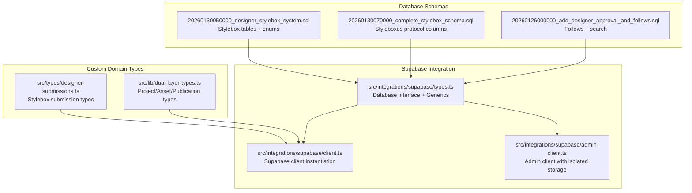
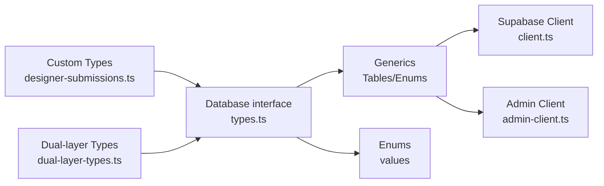

# TypeScript Type Definitions

<cite>
**Referenced Files in This Document**
- [src/integrations/supabase/types.ts](file://src/integrations/supabase/types.ts)
- [src/integrations/supabase/client.ts](file://src/integrations/supabase/client.ts)
- [src/integrations/supabase/admin-client.ts](file://src/integrations/supabase/admin-client.ts)
- [src/types/designer-submissions.ts](file://src/types/designer-submissions.ts)
- [src/lib/dual-layer-types.ts](file://src/lib/dual-layer-types.ts)
- [supabase/migrations/20260130050000_designer_stylebox_system.sql](file://supabase/migrations/20260130050000_designer_stylebox_system.sql)
- [supabase/migrations/20260130070000_complete_stylebox_schema.sql](file://supabase/migrations/20260130070000_complete_stylebox_schema.sql)
- [supabase/migrations/20260126000000_add_designer_approval_and_follows.sql](file://supabase/migrations/20260126000000_add_designer_approval_and_follows.sql)
</cite>

## Table of Contents
1. [Introduction](#introduction)
2. [Project Structure](#project-structure)
3. [Core Components](#core-components)
4. [Architecture Overview](#architecture-overview)
5. [Detailed Component Analysis](#detailed-component-analysis)
6. [Dependency Analysis](#dependency-analysis)
7. [Performance Considerations](#performance-considerations)
8. [Troubleshooting Guide](#troubleshooting-guide)
9. [Conclusion](#conclusion)

## Introduction
This document provides comprehensive TypeScript type definition documentation for the application’s data model. It explains how Supabase-generated types map to database schemas, documents custom type definitions, and outlines utility types used across the codebase. It also covers complex type hierarchies, union types, generic types, type guards, type assertions, and inference patterns used for database operations, form handling, and API integrations. Finally, it addresses type evolution strategies aligned with database migrations.

## Project Structure
The type system spans three primary areas:
- Supabase-generated types: A comprehensive Database interface and supporting generics that mirror the PostgreSQL schema and enums.
- Custom domain types: Strongly typed interfaces and unions for specialized workflows (e.g., designer stylebox submissions).
- Utility types: Shared interfaces for dual-layer operating model (projects, assets, publication requests).



**Diagram sources**
- [src/integrations/supabase/types.ts](file://src/integrations/supabase/types.ts#L9-L2954)
- [src/integrations/supabase/client.ts](file://src/integrations/supabase/client.ts#L1-L17)
- [src/integrations/supabase/admin-client.ts](file://src/integrations/supabase/admin-client.ts#L1-L28)
- [src/types/designer-submissions.ts](file://src/types/designer-submissions.ts#L1-L255)
- [src/lib/dual-layer-types.ts](file://src/lib/dual-layer-types.ts#L1-L44)
- [supabase/migrations/20260130050000_designer_stylebox_system.sql](file://supabase/migrations/20260130050000_designer_stylebox_system.sql#L1-L569)
- [supabase/migrations/20260130070000_complete_stylebox_schema.sql](file://supabase/migrations/20260130070000_complete_stylebox_schema.sql#L1-L51)
- [supabase/migrations/20260126000000_add_designer_approval_and_follows.sql](file://supabase/migrations/20260126000000_add_designer_approval_and_follows.sql#L1-L136)

**Section sources**
- [src/integrations/supabase/types.ts](file://src/integrations/supabase/types.ts#L1-L3146)
- [src/integrations/supabase/client.ts](file://src/integrations/supabase/client.ts#L1-L17)
- [src/integrations/supabase/admin-client.ts](file://src/integrations/supabase/admin-client.ts#L1-L28)
- [src/types/designer-submissions.ts](file://src/types/designer-submissions.ts#L1-L255)
- [src/lib/dual-layer-types.ts](file://src/lib/dual-layer-types.ts#L1-L44)
- [supabase/migrations/20260130050000_designer_stylebox_system.sql](file://supabase/migrations/20260130050000_designer_stylebox_system.sql#L1-L569)
- [supabase/migrations/20260130070000_complete_stylebox_schema.sql](file://supabase/migrations/20260130070000_complete_stylebox_schema.sql#L1-L51)
- [supabase/migrations/20260126000000_add_designer_approval_and_follows.sql](file://supabase/migrations/20260126000000_add_designer_approval_and_follows.sql#L1-L136)

## Core Components
- Supabase-generated types
  - Database: A comprehensive interface that defines Tables, Views, Functions, Enums, and CompositeTypes based on the PostgreSQL schema.
  - Generics: Tables, TablesInsert, TablesUpdate, Enums, and CompositeTypes enable strongly typed database operations and schema-aware typing.
  - Json: A recursive union type representing JSON-compatible structures.
- Custom domain types
  - Designer stylebox submission types: Union types for statuses and file types, plus interfaces for submissions, files, critiques, drafts, share links, and comments.
  - Dual-layer operating model types: Interfaces for Projects, ProjectAssets, and PublicationRequests.
- Utility types
  - Record<string, any>: Used for flexible JSON metadata fields across domains.

These components collectively ensure type safety across database operations, API responses, and UI forms.

**Section sources**
- [src/integrations/supabase/types.ts](file://src/integrations/supabase/types.ts#L1-L8)
- [src/integrations/supabase/types.ts](file://src/integrations/supabase/types.ts#L9-L2954)
- [src/types/designer-submissions.ts](file://src/types/designer-submissions.ts#L1-L255)
- [src/lib/dual-layer-types.ts](file://src/lib/dual-layer-types.ts#L1-L44)

## Architecture Overview
The type architecture connects database schemas to TypeScript via Supabase’s generated types and custom domain interfaces. Clients consume these types to ensure compile-time correctness for database reads/writes, enum usage, and payload shapes.

```mermaid
classDiagram
class Database {
+Tables
+Views
+Functions
+Enums
+CompositeTypes
}
class Tables {
+Row
+Insert
+Update
}
class Enums {
+Values
}
class Json {
+string
+number
+boolean
+null
+{[key : string] : Json}
+Json[]
}
class StyleboxSubmission {
+id : string
+stylebox_id : string
+designer_id : string
+version_number : number
+is_final : boolean
+status : SubmissionStatus
+...
}
class SubmissionFile {
+id : string
+submission_id : string
+deliverable_id : string
+file_type : DesignerFileType
+status : DeliverableStatus
+...
}
class Project {
+id : string
+designer_id : string
+status : "draft"|"in_progress"|"completed"|"published"
+metadata : Record<string,any>
+...
}
Database --> Tables : "defines"
Database --> Enums : "defines"
StyleboxSubmission ..> Database : "uses enums"
SubmissionFile ..> Database : "uses enums"
Project ..> Record : "uses"
```

**Diagram sources**
- [src/integrations/supabase/types.ts](file://src/integrations/supabase/types.ts#L9-L2954)
- [src/types/designer-submissions.ts](file://src/types/designer-submissions.ts#L33-L124)
- [src/lib/dual-layer-types.ts](file://src/lib/dual-layer-types.ts#L3-L43)

**Section sources**
- [src/integrations/supabase/types.ts](file://src/integrations/supabase/types.ts#L9-L2954)
- [src/types/designer-submissions.ts](file://src/types/designer-submissions.ts#L1-L255)
- [src/lib/dual-layer-types.ts](file://src/lib/dual-layer-types.ts#L1-L44)

## Detailed Component Analysis

### Supabase-Generated Types and Generics
- Database interface
  - Defines nested structures for Tables, Views, Functions, Enums, and CompositeTypes.
  - Includes a special internal marker for PostgREST version compatibility.
- Generics
  - Tables<T, K>: Extracts Row types for a given table or schema/table pair.
  - TablesInsert<T, K>: Extracts Insert types.
  - TablesUpdate<T, K>: Extracts Update types.
  - Enums<T, K>: Extracts enum values for a given enum or schema/enum pair.
  - CompositeTypes<T, K>: Extracts composite types for a given composite or schema/composite pair.
- Json union
  - Supports recursive JSON structures for JSONB and JSON fields.

These generics enable schema-aware typing for database operations, ensuring compile-time safety when interacting with Supabase clients.

**Section sources**
- [src/integrations/supabase/types.ts](file://src/integrations/supabase/types.ts#L1-L8)
- [src/integrations/supabase/types.ts](file://src/integrations/supabase/types.ts#L2960-L3071)

### Designer Stylebox Submission Types
- Union types
  - SubmissionStatus: Literal union of submission lifecycle states.
  - DeliverableStatus: Literal union of deliverable upload states.
  - DesignerFileType: Literal union of file categories.
  - CritiqueSeverity: Literal union of feedback severities.
- Interfaces
  - StyleboxSubmission: Submission entity with versioning, status, and progress metrics.
  - SubmissionFile: File entity with metadata, status, and watermarking flags.
  - CritiqueComment: Feedback entity with pin markers and severity.
  - DesignerDraft: Auto-save state for submissions.
  - StyleboxShareLink and ShareLinkComment: Collaboration and public sharing entities.
- Payloads and view models
  - Create/Update payloads for submissions and files.
  - SubmissionWithFiles and SubmissionWithCritiques for UI composition.
- Utilities
  - Type guards and helpers for completeness checks, status-to-color mapping, severity mapping, file size formatting, and progress formatting.

These types encapsulate the designer-side StyleBox workflow and ensure strong typing for UI and API interactions.

**Section sources**
- [src/types/designer-submissions.ts](file://src/types/designer-submissions.ts#L6-L31)
- [src/types/designer-submissions.ts](file://src/types/designer-submissions.ts#L33-L124)
- [src/types/designer-submissions.ts](file://src/types/designer-submissions.ts#L147-L197)
- [src/types/designer-submissions.ts](file://src/types/designer-submissions.ts#L200-L255)

### Dual-Layer Operating Model Types
- Project: Core project entity with status union and metadata.
- ProjectAsset: Asset entity with type union and metadata.
- PublicationRequest: Publication request entity with status union and timestamps.

These types support the dual-layer model for projects and publications, enabling type-safe handling of assets and publication workflows.

**Section sources**
- [src/lib/dual-layer-types.ts](file://src/lib/dual-layer-types.ts#L3-L43)

### Supabase Client Integration
- Client instantiation
  - The Supabase client is created with the Database generic, enabling type-safe database operations.
  - Environment variables provide URL and publishable key.
- Admin client
  - A separate client is configured with isolated storage to keep admin sessions independent from studio sessions.

This ensures type safety and separation of concerns for admin and designer/studio operations.

**Section sources**
- [src/integrations/supabase/client.ts](file://src/integrations/supabase/client.ts#L1-L17)
- [src/integrations/supabase/admin-client.ts](file://src/integrations/supabase/admin-client.ts#L1-L28)

### Database Schemas and Enum Evolution
- Designer StyleBox system
  - Adds enums for submission_status, deliverable_status, and designer_file_type.
  - Creates tables for stylebox_submissions, submission_files, critique_comments, designer_drafts, and stylebox_share_links.
  - Includes indexes, RLS policies, triggers, and helper functions.
- Styleboxes protocol columns
  - Extends styleboxes with Adorzia Protocol metadata (quadrants, deliverables, guidelines, assets).
- Designer approval and follows
  - Adds pending_approval to user_status.
  - Introduces designer_follows table and associated RLS policies.
  - Adds search indexes and global search function.

These migrations drive type evolution by introducing new enums, tables, and columns that are reflected in the generated Database interface.

**Section sources**
- [supabase/migrations/20260130050000_designer_stylebox_system.sql](file://supabase/migrations/20260130050000_designer_stylebox_system.sql#L1-L569)
- [supabase/migrations/20260130070000_complete_stylebox_schema.sql](file://supabase/migrations/20260130070000_complete_stylebox_schema.sql#L1-L51)
- [supabase/migrations/20260126000000_add_designer_approval_and_follows.sql](file://supabase/migrations/20260126000000_add_designer_approval_and_follows.sql#L1-L136)

### Type Safety Mechanisms
- Database operations
  - Use Tables, TablesInsert, and TablesUpdate generics to ensure payloads match table schemas.
  - Use Enums generics to restrict values to defined enum sets.
- Form handling
  - Use union types for statuses and file types to constrain form inputs.
  - Use interfaces for payload shapes to enforce required fields and metadata.
- API integrations
  - Clients are typed with the Database generic, enabling compile-time verification of column names and types.
- Type guards and inference
  - Type guards for completeness and status checks.
  - Inference patterns for dynamic JSON metadata using Record<string, any>.

**Section sources**
- [src/integrations/supabase/types.ts](file://src/integrations/supabase/types.ts#L2960-L3071)
- [src/types/designer-submissions.ts](file://src/types/designer-submissions.ts#L200-L255)
- [src/lib/dual-layer-types.ts](file://src/lib/dual-layer-types.ts#L1-L44)

### Type Evolution Strategies
- Align migrations with type definitions
  - When adding new enums or tables, regenerate Supabase types to reflect schema changes.
  - Extend custom domain types to accommodate new fields and relationships.
- Preserve backward compatibility
  - Use optional fields for new columns and guard against missing data in runtime logic.
- Incremental updates
  - Add new enums via ALTER TYPE statements and introduce new tables via migrations.
  - Keep custom domain types cohesive with evolving database structures.

**Section sources**
- [supabase/migrations/20260130050000_designer_stylebox_system.sql](file://supabase/migrations/20260130050000_designer_stylebox_system.sql#L11-L46)
- [supabase/migrations/20260130070000_complete_stylebox_schema.sql](file://supabase/migrations/20260130070000_complete_stylebox_schema.sql#L4-L51)
- [supabase/migrations/20260126000000_add_designer_approval_and_follows.sql](file://supabase/migrations/20260126000000_add_designer_approval_and_follows.sql#L1-L136)

## Dependency Analysis
The type system exhibits clear separation of concerns:
- Supabase-generated types depend on database schemas and enums.
- Custom domain types depend on Supabase enums and Json union.
- Clients depend on Supabase-generated types to ensure type-safe operations.



**Diagram sources**
- [src/integrations/supabase/types.ts](file://src/integrations/supabase/types.ts#L9-L2954)
- [src/integrations/supabase/client.ts](file://src/integrations/supabase/client.ts#L1-L17)
- [src/integrations/supabase/admin-client.ts](file://src/integrations/supabase/admin-client.ts#L1-L28)
- [src/types/designer-submissions.ts](file://src/types/designer-submissions.ts#L1-L255)
- [src/lib/dual-layer-types.ts](file://src/lib/dual-layer-types.ts#L1-L44)

**Section sources**
- [src/integrations/supabase/types.ts](file://src/integrations/supabase/types.ts#L9-L2954)
- [src/integrations/supabase/client.ts](file://src/integrations/supabase/client.ts#L1-L17)
- [src/integrations/supabase/admin-client.ts](file://src/integrations/supabase/admin-client.ts#L1-L28)
- [src/types/designer-submissions.ts](file://src/types/designer-submissions.ts#L1-L255)
- [src/lib/dual-layer-types.ts](file://src/lib/dual-layer-types.ts#L1-L44)

## Performance Considerations
- Prefer union types for constrained fields to reduce runtime validation overhead.
- Use Records for metadata to avoid excessive interface proliferation while maintaining flexibility.
- Leverage Supabase generics to minimize manual type maintenance and reduce errors.

[No sources needed since this section provides general guidance]

## Troubleshooting Guide
- Type mismatches after schema changes
  - Regenerate Supabase types to align with migrations.
  - Verify enums and table schemas match the generated Database interface.
- Client typing issues
  - Ensure the client is instantiated with the Database generic.
  - Confirm environment variables are set for URL and publishable key.
- Admin vs studio session conflicts
  - Use the admin client with isolated storage to prevent cross-session interference.

**Section sources**
- [src/integrations/supabase/client.ts](file://src/integrations/supabase/client.ts#L1-L17)
- [src/integrations/supabase/admin-client.ts](file://src/integrations/supabase/admin-client.ts#L1-L28)

## Conclusion
The application’s type system combines Supabase-generated types with custom domain and utility types to achieve robust type safety across database operations, forms, and API integrations. By aligning migrations with type definitions and leveraging generics, the system supports maintainable and evolvable data models. Following the outlined strategies ensures consistent type evolution alongside database schema changes.