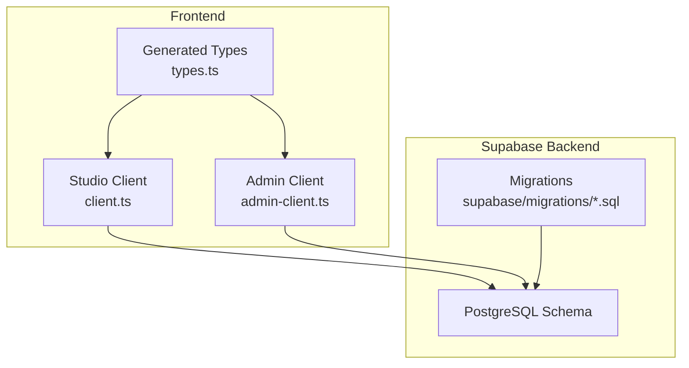
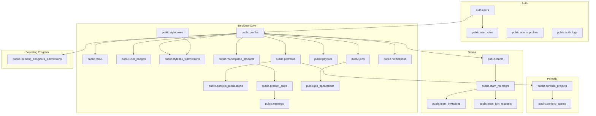
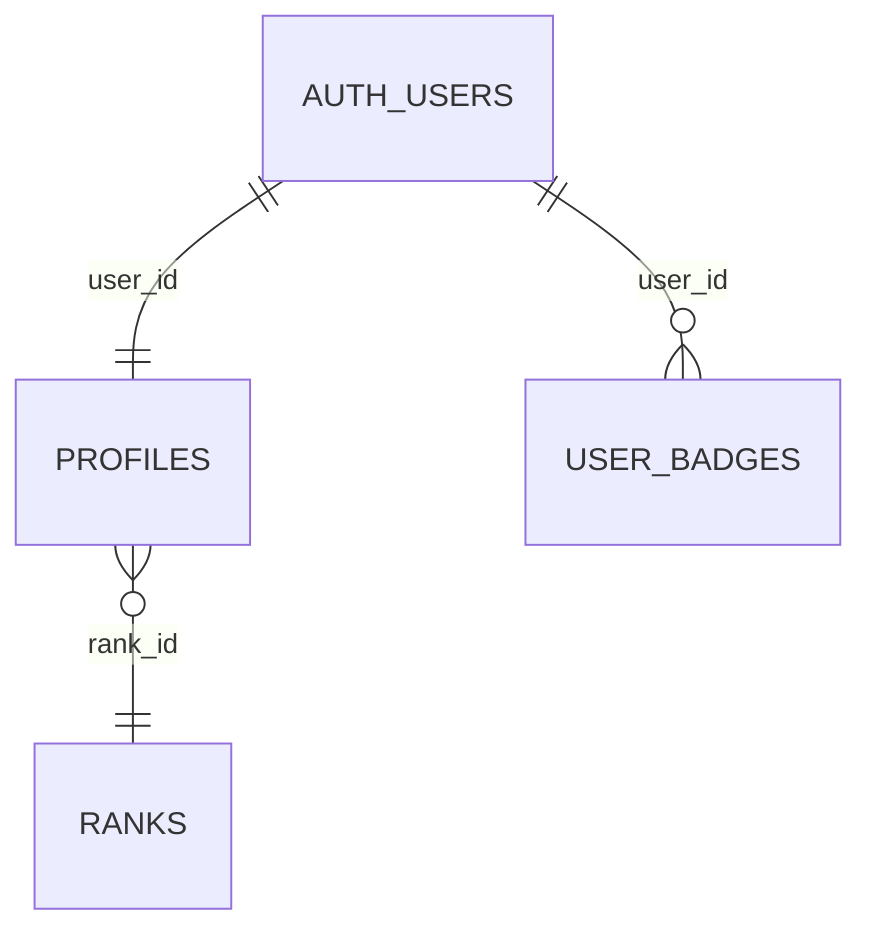
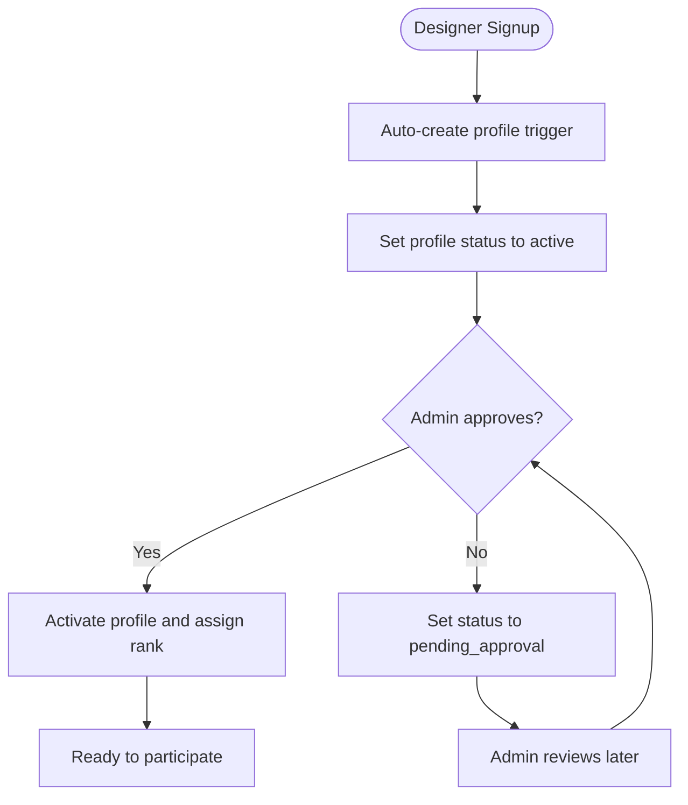
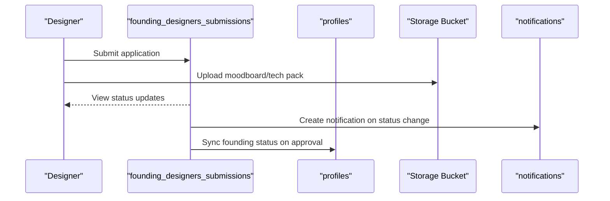
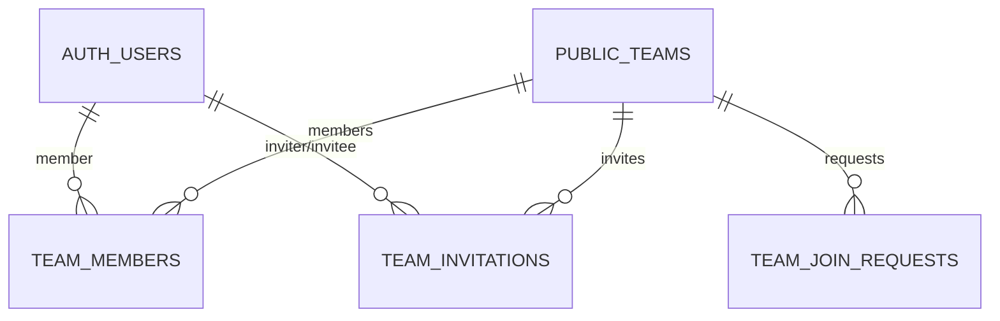
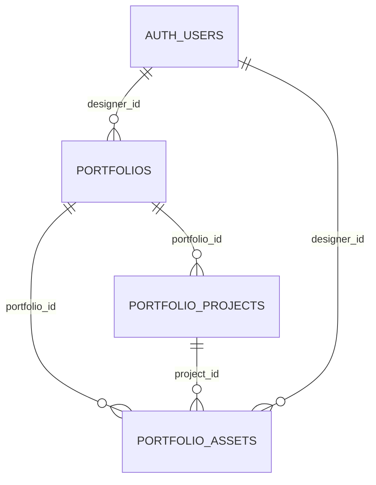
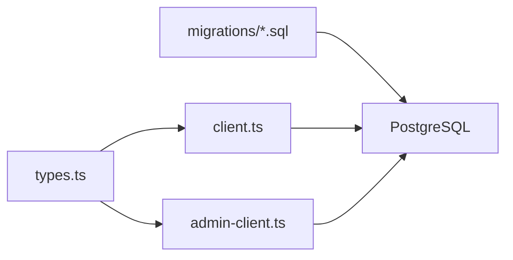

# Core Entities & Tables

<cite>
**Referenced Files in This Document**
- [20251209213954_141af71b-504d-4a68-a16d-b931834b1328.sql](file://supabase/migrations/20251209213954_141af71b-504d-4a68-a16d-b931834b1328.sql)
- [20260126000000_add_designer_approval_and_follows.sql](file://supabase/migrations/20260126000000_add_designer_approval_and_follows.sql)
- [20260126010000_add_founding_designers_program.sql](file://supabase/migrations/20260126010000_add_founding_designers_program.sql)
- [20260126070000_enhance_founding_profiles.sql](file://supabase/migrations/20260126070000_enhance_founding_profiles.sql)
- [20260127020000_teams_full_backend.sql](file://supabase/migrations/20260127020000_teams_full_backend.sql)
- [20260127230305_create_portfolio_tables.sql](file://supabase/migrations/20260127230305_create_portfolio_tables.sql)
- [20260127010000_enhance_notifications.sql](file://supabase/migrations/20260127010000_enhance_notifications.sql)
- [20260127000000_founding_storage_admin_policy.sql](file://supabase/migrations/20260127000000_founding_storage_admin_policy.sql)
- [20251209220223_71c698ff-f4d2-4830-bc60-ed7aabd9e86e.sql](file://supabase/migrations/20251209220223_71c698ff-f4d2-4830-bc60-ed7aabd9e86e.sql)
- [20260126050000_bootstrap_superadmin.sql](file://supabase/migrations/20260126050000_bootstrap_superadmin.sql)
- [20260126060000_isolate_admin_auth.sql](file://supabase/migrations/20260126060000_isolate_admin_auth.sql)
- [client.ts](file://src/integrations/supabase/client.ts)
- [admin-client.ts](file://src/integrations/supabase/admin-client.ts)
- [types.ts](file://src/integrations/supabase/types.ts)
- [database.ts](file://src/types/database.ts)
</cite>

## Table of Contents
1. [Introduction](#introduction)
2. [Project Structure](#project-structure)
3. [Core Components](#core-components)
4. [Architecture Overview](#architecture-overview)
5. [Detailed Component Analysis](#detailed-component-analysis)
6. [Dependency Analysis](#dependency-analysis)
7. [Performance Considerations](#performance-considerations)
8. [Troubleshooting Guide](#troubleshooting-guide)
9. [Conclusion](#conclusion)

## Introduction
This document describes the core database entities and relationships that power the Adorzia platform. It focuses on the primary tables for users, profiles, designers, teams, and related subsystems such as portfolios, notifications, and the Founding Designers Program. It also documents the user role system (admin, superadmin, designer), the designer approval workflow, team membership and invitations, data validation rules, indexing strategies, and performance considerations for frequently accessed tables.

## Project Structure
The database schema is defined via Supabase migrations under the supabase/migrations directory. TypeScript types for Supabase-generated tables are auto-generated and consumed by the frontend under src/integrations/supabase/types.ts. Frontend clients for studio and admin apps are configured in client.ts and admin-client.ts respectively.



**Diagram sources**
- [client.ts](file://src/integrations/supabase/client.ts#L1-L17)
- [admin-client.ts](file://src/integrations/supabase/admin-client.ts#L1-L28)
- [types.ts](file://src/integrations/supabase/types.ts#L1-L100)

**Section sources**
- [client.ts](file://src/integrations/supabase/client.ts#L1-L17)
- [admin-client.ts](file://src/integrations/supabase/admin-client.ts#L1-L28)
- [types.ts](file://src/integrations/supabase/types.ts#L1-L100)

## Core Components
This section outlines the principal tables and their roles in the platform.

- Users and Roles
  - auth.users: Supabase’s built-in user table.
  - public.user_roles: Stores admin and superadmin assignments per user.
  - public.admin_profiles: Isolated admin profile table for administrative users.
  - public.auth_logs: Audit log of authentication events.

- Profiles and Designer Metadata
  - public.profiles: Designer profile linked to auth.users.
  - public.ranks: Rank definitions with XP thresholds and revenue share.
  - public.user_badges: Designer badges.

- Workflows and Content
  - public.styleboxes: Stylebox challenges.
  - public.stylebox_submissions: Designer submissions for styleboxes.
  - public.portfolios: Designer portfolios.
  - public.portfolio_publications: Publication requests for portfolios.
  - public.marketplace_products: Products listed on the marketplace.
  - public.product_sales: Historical sales records.
  - public.earnings: Revenue share per designer per product.
  - public.payouts: Payout requests and statuses.
  - public.jobs and public.job_applications: Job board and applications.
  - public.notifications: User notifications with optional title and metadata.

- Teams
  - public.teams: Team entities.
  - public.team_members: Team membership with lead/member roles.
  - public.team_invitations: Invitation lifecycle for team invites.
  - public.team_join_requests: Join requests for open teams.

- Founding Designers Program
  - public.founding_designers_submissions: Submission lifecycle for founding designers.
  - Founding status sync to profiles via triggers.

- Portfolio System
  - public.portfolio_projects: Projects within a portfolio.
  - public.portfolio_assets: Files and assets associated with projects.

**Section sources**
- [20251209213954_141af71b-504d-4a68-a16d-b931834b1328.sql](file://supabase/migrations/20251209213954_141af71b-504d-4a68-a16d-b931834b1328.sql#L18-L271)
- [20260126000000_add_designer_approval_and_follows.sql](file://supabase/migrations/20260126000000_add_designer_approval_and_follows.sql#L1-L136)
- [20260126010000_add_founding_designers_program.sql](file://supabase/migrations/20260126010000_add_founding_designers_program.sql#L1-L164)
- [20260127020000_teams_full_backend.sql](file://supabase/migrations/20260127020000_teams_full_backend.sql#L1-L213)
- [20260127230305_create_portfolio_tables.sql](file://supabase/migrations/20260127230305_create_portfolio_tables.sql#L1-L86)
- [20260127010000_enhance_notifications.sql](file://supabase/migrations/20260127010000_enhance_notifications.sql#L1-L12)
- [20251209220223_71c698ff-f4d2-4830-bc60-ed7aabd9e86e.sql](file://supabase/migrations/20251209220223_71c698ff-f4d2-4830-bc60-ed7aabd9e86e.sql#L1-L37)

## Architecture Overview
The database architecture centers around:
- Supabase-managed auth (auth.users) and custom row-level security (RLS) policies.
- A strict separation between designer and admin contexts, enforced by dedicated tables and clients.
- Workflow-driven entities (styleboxes, submissions, portfolios, marketplace, teams) with explicit status enums and constraints.
- Triggers and functions to maintain timestamps, compute counts, and synchronize state (e.g., founding status).



**Diagram sources**
- [20251209213954_141af71b-504d-4a68-a16d-b931834b1328.sql](file://supabase/migrations/20251209213954_141af71b-504d-4a68-a16d-b931834b1328.sql#L18-L271)
- [20260126000000_add_designer_approval_and_follows.sql](file://supabase/migrations/20260126000000_add_designer_approval_and_follows.sql#L1-L136)
- [20260126010000_add_founding_designers_program.sql](file://supabase/migrations/20260126010000_add_founding_designers_program.sql#L1-L164)
- [20260127020000_teams_full_backend.sql](file://supabase/migrations/20260127020000_teams_full_backend.sql#L1-L213)
- [20260127230305_create_portfolio_tables.sql](file://supabase/migrations/20260127230305_create_portfolio_tables.sql#L1-L86)

## Detailed Component Analysis

### Users and Roles
- auth.users: Built-in Supabase table storing user identities and credentials.
- public.user_roles: Enforces admin and superadmin roles with a helper function has_role to prevent RLS recursion.
- public.admin_profiles: Isolated admin profile table to separate admin and designer concerns.
- public.auth_logs: Audit trail for login/logout/password reset/signup actions.

```mermaid
erDiagram
AUTH_USERS {
uuid id PK
string email
timestamptz created_at
}
USER_ROLES {
uuid id PK
uuid user_id FK
enum role
timestamptz created_at
}
ADMIN_PROFILES {
uuid id PK
uuid user_id FK UK
string name
string email
uuid role_id FK
enum status
timestamptz last_login
timestamptz created_at
timestamptz updated_at
}
AUTH_LOGS {
uuid id PK
uuid user_id FK
enum action
string ip_address
string user_agent
jsonb metadata
timestamptz created_at
}
AUTH_USERS ||--o{ USER_ROLES : "has"
AUTH_USERS ||--|{ ADMIN_PROFILES : "has"
AUTH_USERS ||--o{ AUTH_LOGS : "audits"
```

**Diagram sources**
- [20251209213954_141af71b-504d-4a68-a16d-b931834b1328.sql](file://supabase/migrations/20251209213954_141af71b-504d-4a68-a16d-b931834b1328.sql#L18-L27)
- [20260126060000_isolate_admin_auth.sql](file://supabase/migrations/20260126060000_isolate_admin_auth.sql#L3-L16)
- [20251209220223_71c698ff-f4d2-4830-bc60-ed7aabd9e86e.sql](file://supabase/migrations/20251209220223_71c698ff-f4d2-4830-bc60-ed7aabd9e86e.sql#L3-L11)

**Section sources**
- [20251209213954_141af71b-504d-4a68-a16d-b931834b1328.sql](file://supabase/migrations/20251209213954_141af71b-504d-4a68-a16d-b931834b1328.sql#L18-L41)
- [20260126060000_isolate_admin_auth.sql](file://supabase/migrations/20260126060000_isolate_admin_auth.sql#L3-L31)
- [20251209220223_71c698ff-f4d2-4830-bc60-ed7aabd9e86e.sql](file://supabase/migrations/20251209220223_71c698ff-f4d2-4830-bc60-ed7aabd9e86e.sql#L3-L11)

### Profiles and Designer Metadata
- public.profiles: Links to auth.users, stores name, email, avatar, category, subscription tier, rank, status, XP, and timestamps.
- public.ranks: Defines rank tiers with XP thresholds, revenue share percent, priority queue flag, and ordering.
- public.user_badges: Tracks earned badges per user.



**Diagram sources**
- [20251209213954_141af71b-504d-4a68-a16d-b931834b1328.sql](file://supabase/migrations/20251209213954_141af71b-504d-4a68-a16d-b931834b1328.sql#L57-L71)
- [20251209213954_141af71b-504d-4a68-a16d-b931834b1328.sql](file://supabase/migrations/20251209213954_141af71b-504d-4a68-a16d-b931834b1328.sql#L43-L53)

**Section sources**
- [20251209213954_141af71b-504d-4a68-a16d-b931834b1328.sql](file://supabase/migrations/20251209213954_141af71b-504d-4a68-a16d-b931834b1328.sql#L57-L71)
- [20251209213954_141af71b-504d-4a68-a16d-b931834b1328.sql](file://supabase/migrations/20251209213954_141af71b-504d-4a68-a16d-b931834b1328.sql#L43-L53)

### Designer Approval Workflow
- Enum extension adds a pending_approval status to user_status.
- Follow system via public.designer_follows with RLS policies allowing users to follow/unfollow and view counts via a function.
- Global search function spans profiles, products, and collections with GIN indexes for performance.



**Diagram sources**
- [20251209213954_141af71b-504d-4a68-a16d-b931834b1328.sql](file://supabase/migrations/20251209213954_141af71b-504d-4a68-a16d-b931834b1328.sql#L438-L449)
- [20260126000000_add_designer_approval_and_follows.sql](file://supabase/migrations/20260126000000_add_designer_approval_and_follows.sql#L1-L136)

**Section sources**
- [20260126000000_add_designer_approval_and_follows.sql](file://supabase/migrations/20260126000000_add_designer_approval_and_follows.sql#L1-L136)

### Founding Designers Program
- public.founding_designers_submissions: Captures collection identity, technical assets, production strategy, and declaration fields with constraints and status lifecycle.
- Storage bucket “founding-submissions” with policies enabling designers to upload/view/delete and admins to view all.
- Notification creation upon status change.
- Trigger to synchronize founding status to profiles when approved.



**Diagram sources**
- [20260126010000_add_founding_designers_program.sql](file://supabase/migrations/20260126010000_add_founding_designers_program.sql#L1-L164)
- [20260127000000_founding_storage_admin_policy.sql](file://supabase/migrations/20260127000000_founding_storage_admin_policy.sql#L1-L29)
- [20260126070000_enhance_founding_profiles.sql](file://supabase/migrations/20260126070000_enhance_founding_profiles.sql#L27-L46)

**Section sources**
- [20260126010000_add_founding_designers_program.sql](file://supabase/migrations/20260126010000_add_founding_designers_program.sql#L1-L164)
- [20260127000000_founding_storage_admin_policy.sql](file://supabase/migrations/20260127000000_founding_storage_admin_policy.sql#L1-L29)
- [20260126070000_enhance_founding_profiles.sql](file://supabase/migrations/20260126070000_enhance_founding_profiles.sql#L27-L46)

### Teams, Membership, and Invitations
- public.teams: Team metadata with created_by linkage.
- public.team_members: Unique (team_id, user_id) with lead/member roles.
- public.team_invitations: Invite lifecycle with status enum and uniqueness constraints.
- public.team_join_requests: Join requests for open teams with status and admin management.
- Functions and triggers for stats, eligibility checks, and challenge completion increments.



**Diagram sources**
- [20260127020000_teams_full_backend.sql](file://supabase/migrations/20260127020000_teams_full_backend.sql#L11-L37)
- [20260127020000_teams_full_backend.sql](file://supabase/migrations/20260127020000_teams_full_backend.sql#L119-L186)

**Section sources**
- [20260127020000_teams_full_backend.sql](file://supabase/migrations/20260127020000_teams_full_backend.sql#L1-L213)

### Portfolio System
- public.portfolios: Designer portfolios with items JSONB and timestamps.
- public.portfolio_publications: Publication requests with status and reviewer linkage.
- public.portfolio_projects: Projects with metadata, tags, source tracking, and ordering.
- public.portfolio_assets: Files with type, size, MIME, dimensions, and categorization.



**Diagram sources**
- [20260127230305_create_portfolio_tables.sql](file://supabase/migrations/20260127230305_create_portfolio_tables.sql#L7-L43)

**Section sources**
- [20260127230305_create_portfolio_tables.sql](file://supabase/migrations/20260127230305_create_portfolio_tables.sql#L1-L86)

### Notifications Enhancements
- public.notifications extended with title and metadata fields.
- Indexes on user_id/status and created_at for efficient retrieval.

**Section sources**
- [20260127010000_enhance_notifications.sql](file://supabase/migrations/20260127010000_enhance_notifications.sql#L1-L12)

## Dependency Analysis
- Frontend clients (studio and admin) consume auto-generated types from src/integrations/supabase/types.ts.
- Studio client uses local storage; Admin client uses a prefixed storage key to isolate sessions.
- Supabase migrations define schema, enums, RLS policies, indexes, triggers, and functions.



**Diagram sources**
- [types.ts](file://src/integrations/supabase/types.ts#L1-L100)
- [client.ts](file://src/integrations/supabase/client.ts#L1-L17)
- [admin-client.ts](file://src/integrations/supabase/admin-client.ts#L1-L28)

**Section sources**
- [types.ts](file://src/integrations/supabase/types.ts#L1-L100)
- [client.ts](file://src/integrations/supabase/client.ts#L1-L17)
- [admin-client.ts](file://src/integrations/supabase/admin-client.ts#L1-L28)

## Performance Considerations
- Timestamp maintenance: Centralized update_updated_at trigger applied to frequently updated tables.
- Search and ranking: GIN indexes on text fields and a global_search function for profiles, products, and collections.
- Team and invitation filtering: Partial indexes on pending status and composite indexes for team membership queries.
- Portfolio queries: Indexes on portfolio_id, designer_id, and created_at for efficient sorting and filtering.
- Notifications: Indexes on user_id/status and created_at for fast retrieval and pagination.

Recommendations:
- Monitor slow queries using auth_logs and adjust indexes based on usage patterns.
- Consider materialized views for expensive aggregates (e.g., follower counts) if contention arises.
- Use partial indexes for high-cardinality filters (e.g., status, is_open).
- Keep updated_at triggers for tables with frequent writes to avoid stale data.

**Section sources**
- [20251209213954_141af71b-504d-4a68-a16d-b931834b1328.sql](file://supabase/migrations/20251209213954_141af71b-504d-4a68-a16d-b931834b1328.sql#L419-L436)
- [20260126000000_add_designer_approval_and_follows.sql](file://supabase/migrations/20260126000000_add_designer_approval_and_follows.sql#L41-L52)
- [20260127020000_teams_full_backend.sql](file://supabase/migrations/20260127020000_teams_full_backend.sql#L188-L197)
- [20260127230305_create_portfolio_tables.sql](file://supabase/migrations/20260127230305_create_portfolio_tables.sql#L45-L51)
- [20260127010000_enhance_notifications.sql](file://supabase/migrations/20260127010000_enhance_notifications.sql#L7-L8)

## Troubleshooting Guide
Common issues and resolutions:
- Admin access denied
  - Verify user_roles assignment and has_role function usage in policies.
  - Confirm bootstrap_superadmin executed and admin_profiles created.
- Founding submission file access
  - Ensure storage bucket “founding-submissions” exists and policies allow designers to upload/view/delete and admins to view all.
- Team invitation errors
  - Check uniqueness constraints and status transitions; ensure team leads have proper roles.
- Notification delivery
  - Confirm notify_on_founding_submission_review trigger and notification metadata fields.

**Section sources**
- [20260126050000_bootstrap_superadmin.sql](file://supabase/migrations/20260126050000_bootstrap_superadmin.sql#L4-L84)
- [20260126060000_isolate_admin_auth.sql](file://supabase/migrations/20260126060000_isolate_admin_auth.sql#L44-L96)
- [20260127000000_founding_storage_admin_policy.sql](file://supabase/migrations/20260127000000_founding_storage_admin_policy.sql#L1-L29)
- [20260126010000_add_founding_designers_program.sql](file://supabase/migrations/20260126010000_add_founding_designers_program.sql#L127-L164)
- [20260127020000_teams_full_backend.sql](file://supabase/migrations/20260127020000_teams_full_backend.sql#L188-L213)

## Conclusion
The Adorzia platform’s database schema is designed around clear separation of concerns (designer vs admin), robust RLS policies, and workflow-driven entities. The Founding Designers Program, teams, portfolios, and notifications are supported by targeted constraints, indexes, and triggers. The frontend consumes strongly typed Supabase clients to interact with the backend securely and efficiently.