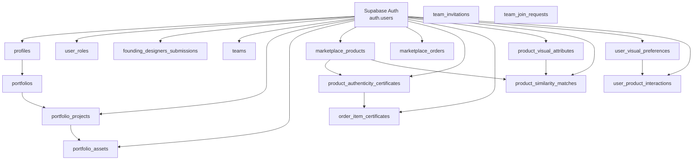
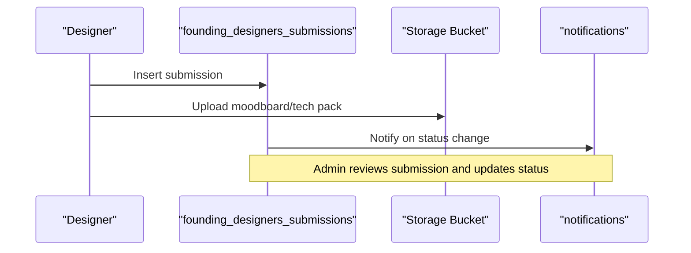
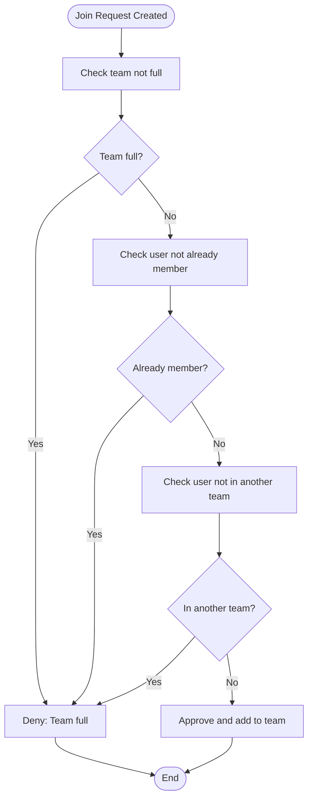
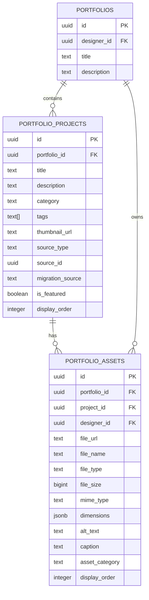
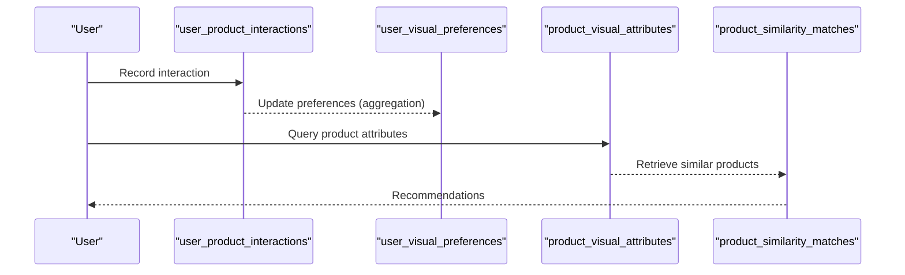
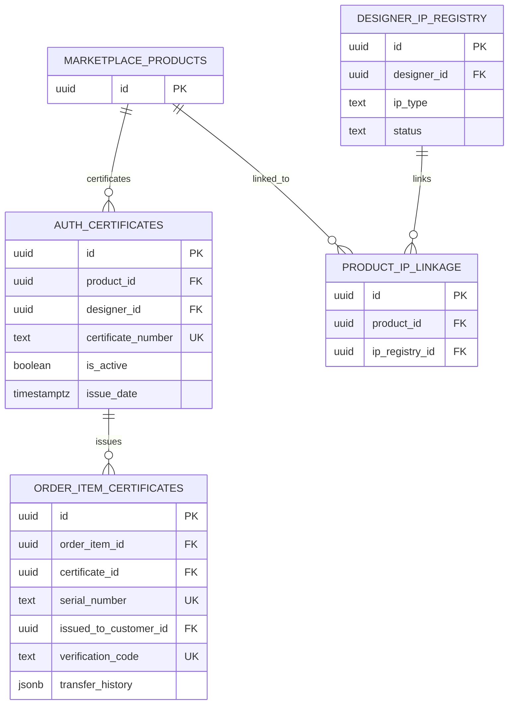
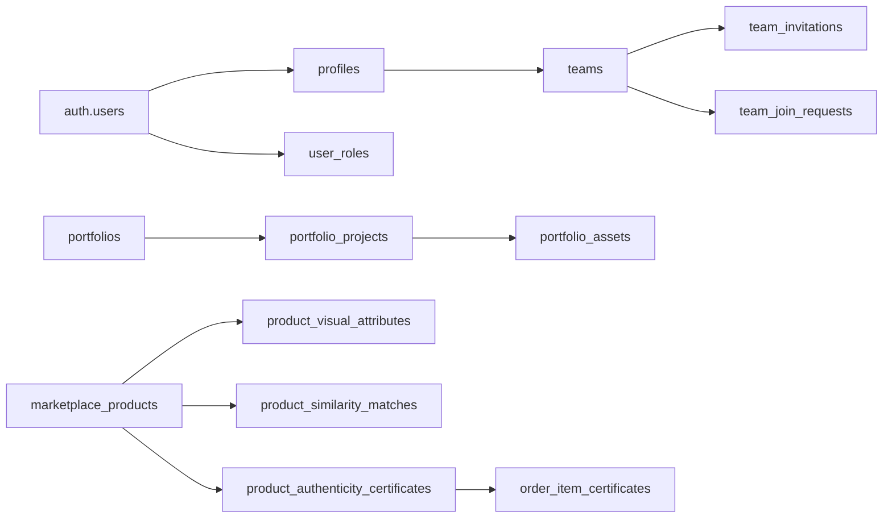

# Database Schema & Data Models

<cite>
**Referenced Files in This Document**
- [20260126000000_add_designer_approval_and_follows.sql](file://supabase/migrations/20260126000000_add_designer_approval_and_follows.sql)
- [20260126010000_add_founding_designers_program.sql](file://supabase/migrations/20260126010000_add_founding_designers_program.sql)
- [20260126020000_fix_all_storage_buckets.sql](file://supabase/migrations/20260126020000_fix_all_storage_buckets.sql)
- [20260126030000_system_optimization.sql](file://supabase/migrations/20260126030000_system_optimization.sql)
- [20260126040000_admin_auth_security.sql](file://supabase/migrations/20260126040000_admin_auth_security.sql)
- [20260126050000_bootstrap_superadmin.sql](file://supabase/migrations/20260126050000_bootstrap_superadmin.sql)
- [20260127000000_founding_storage_admin_policy.sql](file://supabase/migrations/20260127000000_founding_storage_admin_policy.sql)
- [20260127010000_enhance_notifications.sql](file://supabase/migrations/20260127010000_enhance_notifications.sql)
- [20260127020000_teams_full_backend.sql](file://supabase/migrations/20260127020000_teams_full_backend.sql)
- [20260127230305_create_portfolio_tables.sql](file://supabase/migrations/20260127230305_create_portfolio_tables.sql)
- [20260127230400_deprecate_collections.sql](file://supabase/migrations/20260127230400_deprecate_collections.sql)
- [20260127230500_enhance_portfolio_rls.sql](file://supabase/migrations/20260127230500_enhance_portfolio_rls.sql)
- [20260127240000_product_authenticity_system.sql](file://supabase/migrations/20260127240000_product_authenticity_system.sql)
- [20260127250000_visual_similarity_engine.sql](file://supabase/migrations/20260127250000_visual_similarity_engine.sql)
- [20260127260000_seed_marketplace_preview_data.sql](file://supabase/migrations/20260127260000_seed_marketplace_preview_data.sql)
</cite>

## Table of Contents
1. [Introduction](#introduction)
2. [Project Structure](#project-structure)
3. [Core Components](#core-components)
4. [Architecture Overview](#architecture-overview)
5. [Detailed Component Analysis](#detailed-component-analysis)
6. [Dependency Analysis](#dependency-analysis)
7. [Performance Considerations](#performance-considerations)
8. [Troubleshooting Guide](#troubleshooting-guide)
9. [Conclusion](#conclusion)
10. [Appendices](#appendices)

## Introduction
This document describes the PostgreSQL schema and data models powering the Adorzia platform. It focuses on the Supabase-managed Postgres schema, covering table designs, relationships, constraints, row-level security (RLS), access control, indexing strategies, and migration/versioning practices. Core entities include users, designers, styleboxes, portfolios, teams, and marketplace items. The document also outlines data lifecycle management, validation rules, and performance considerations.

## Project Structure
The schema is primarily defined via a series of SQL migration files under the Supabase migrations directory. Each migration adds or modifies tables, indexes, policies, and functions to evolve the schema over time. The migrations are timestamped and applied in chronological order to maintain versioning and reproducibility.

```mermaid
graph TB
subgraph "Supabase Migrations"
M1["20260126000000_add_designer_approval_and_follows.sql"]
M2["20260126010000_add_founding_designers_program.sql"]
M3["20260126020000_fix_all_storage_buckets.sql"]
M4["20260126030000_system_optimization.sql"]
M5["20260126040000_admin_auth_security.sql"]
M6["20260126050000_bootstrap_superadmin.sql"]
M7["20260127000000_founding_storage_admin_policy.sql"]
M8["20260127010000_enhance_notifications.sql"]
M9["20260127020000_teams_full_backend.sql"]
M10["20260127230305_create_portfolio_tables.sql"]
M11["20260127230400_deprecate_collections.sql"]
M12["20260127230500_enhance_portfolio_rls.sql"]
M13["20260127240000_product_authenticity_system.sql"]
M14["20260127250000_visual_similarity_engine.sql"]
M15["20260127260000_seed_marketplace_preview_data.sql"]
end
M1 --> M2 --> M3 --> M4 --> M5 --> M6 --> M7 --> M8 --> M9 --> M10 --> M11 --> M12 --> M13 --> M14 --> M15
```

**Diagram sources**
- [20260126000000_add_designer_approval_and_follows.sql](file://supabase/migrations/20260126000000_add_designer_approval_and_follows.sql#L1-L136)
- [20260126010000_add_founding_designers_program.sql](file://supabase/migrations/20260126010000_add_founding_designers_program.sql#L1-L164)
- [20260126020000_fix_all_storage_buckets.sql](file://supabase/migrations/20260126020000_fix_all_storage_buckets.sql#L1-L453)
- [20260126030000_system_optimization.sql](file://supabase/migrations/20260126030000_system_optimization.sql#L1-L101)
- [20260126040000_admin_auth_security.sql](file://supabase/migrations/20260126040000_admin_auth_security.sql#L1-L79)
- [20260126050000_bootstrap_superadmin.sql](file://supabase/migrations/20260126050000_bootstrap_superadmin.sql#L1-L84)
- [20260127000000_founding_storage_admin_policy.sql](file://supabase/migrations/20260127000000_founding_storage_admin_policy.sql#L1-L29)
- [20260127010000_enhance_notifications.sql](file://supabase/migrations/20260127010000_enhance_notifications.sql#L1-L12)
- [20260127020000_teams_full_backend.sql](file://supabase/migrations/20260127020000_teams_full_backend.sql#L1-L213)
- [20260127230305_create_portfolio_tables.sql](file://supabase/migrations/20260127230305_create_portfolio_tables.sql#L1-L86)
- [20260127230400_deprecate_collections.sql](file://supabase/migrations/20260127230400_deprecate_collections.sql#L1-L121)
- [20260127230500_enhance_portfolio_rls.sql](file://supabase/migrations/20260127230500_enhance_portfolio_rls.sql#L1-L257)
- [20260127240000_product_authenticity_system.sql](file://supabase/migrations/20260127240000_product_authenticity_system.sql#L1-L238)
- [20260127250000_visual_similarity_engine.sql](file://supabase/migrations/20260127250000_visual_similarity_engine.sql#L1-L280)
- [20260127260000_seed_marketplace_preview_data.sql](file://supabase/migrations/20260127260000_seed_marketplace_preview_data.sql)

**Section sources**
- [20260126000000_add_designer_approval_and_follows.sql](file://supabase/migrations/20260126000000_add_designer_approval_and_follows.sql#L1-L136)
- [20260126010000_add_founding_designers_program.sql](file://supabase/migrations/20260126010000_add_founding_designers_program.sql#L1-L164)
- [20260126020000_fix_all_storage_buckets.sql](file://supabase/migrations/20260126020000_fix_all_storage_buckets.sql#L1-L453)
- [20260126030000_system_optimization.sql](file://supabase/migrations/20260126030000_system_optimization.sql#L1-L101)
- [20260126040000_admin_auth_security.sql](file://supabase/migrations/20260126040000_admin_auth_security.sql#L1-L79)
- [20260126050000_bootstrap_superadmin.sql](file://supabase/migrations/20260126050000_bootstrap_superadmin.sql#L1-L84)
- [20260127000000_founding_storage_admin_policy.sql](file://supabase/migrations/20260127000000_founding_storage_admin_policy.sql#L1-L29)
- [20260127010000_enhance_notifications.sql](file://supabase/migrations/20260127010000_enhance_notifications.sql#L1-L12)
- [20260127020000_teams_full_backend.sql](file://supabase/migrations/20260127020000_teams_full_backend.sql#L1-L213)
- [20260127230305_create_portfolio_tables.sql](file://supabase/migrations/20260127230305_create_portfolio_tables.sql#L1-L86)
- [20260127230400_deprecate_collections.sql](file://supabase/migrations/20260127230400_deprecate_collections.sql#L1-L121)
- [20260127230500_enhance_portfolio_rls.sql](file://supabase/migrations/20260127230500_enhance_portfolio_rls.sql#L1-L257)
- [20260127240000_product_authenticity_system.sql](file://supabase/migrations/20260127240000_product_authenticity_system.sql#L1-L238)
- [20260127250000_visual_similarity_engine.sql](file://supabase/migrations/20260127250000_visual_similarity_engine.sql#L1-L280)
- [20260127260000_seed_marketplace_preview_data.sql](file://supabase/migrations/20260127260000_seed_marketplace_preview_data.sql)

## Core Components
This section outlines the principal entities and their roles in the Adorzia schema.

- Users and Profiles
  - Users are managed by Supabase Auth (auth.users). Profiles extend user identity with designer attributes and metadata.
  - Roles are stored in a user_roles table with admin and superadmin capabilities.
  - Validation: Enum-like constraints on status and category fields; array defaults for preferences and tags.

- Founding Designers Program
  - Submissions capture designer intent, assets, and compliance declarations.
  - Storage bucket for submission files with per-user folder isolation and admin visibility.

- Teams
  - Teams table augmented with description, membership limits, and open/closed settings.
  - Invitation and join-request workflows with RLS policies for leads and members.

- Portfolios
  - Portfolio projects and assets split into two tables for modularity.
  - Migration from legacy collection_submissions preserves historical data.

- Marketplace
  - Products, collections, orders, and related analytics.
  - Visual similarity engine for recommendation and personalization.
  - Authenticity system for luxury product verification.

- Storage Buckets
  - Centralized bucket definitions with strict MIME and size limits.
  - Per-bucket RLS policies enforcing ownership and admin oversight.

**Section sources**
- [20260126000000_add_designer_approval_and_follows.sql](file://supabase/migrations/20260126000000_add_designer_approval_and_follows.sql#L1-L136)
- [20260126010000_add_founding_designers_program.sql](file://supabase/migrations/20260126010000_add_founding_designers_program.sql#L1-L164)
- [20260127020000_teams_full_backend.sql](file://supabase/migrations/20260127020000_teams_full_backend.sql#L1-L213)
- [20260127230305_create_portfolio_tables.sql](file://supabase/migrations/20260127230305_create_portfolio_tables.sql#L1-L86)
- [20260127230400_deprecate_collections.sql](file://supabase/migrations/20260127230400_deprecate_collections.sql#L1-L121)
- [20260127240000_product_authenticity_system.sql](file://supabase/migrations/20260127240000_product_authenticity_system.sql#L1-L238)
- [20260127250000_visual_similarity_engine.sql](file://supabase/migrations/20260127250000_visual_similarity_engine.sql#L1-L280)
- [20260126020000_fix_all_storage_buckets.sql](file://supabase/migrations/20260126020000_fix_all_storage_buckets.sql#L1-L453)

## Architecture Overview
The schema architecture centers around:
- Supabase Auth for identity and session management.
- Postgres RLS for fine-grained access control across tables.
- Storage buckets for file management with per-bucket policies.
- Functions and triggers for timestamps, analytics, and lifecycle events.
- Timestamp-triggered updates and materialized views for performance.

**Diagram sources**
- [20260126000000_add_designer_approval_and_follows.sql](file://supabase/migrations/20260126000000_add_designer_approval_and_follows.sql#L1-L136)
- [20260126010000_add_founding_designers_program.sql](file://supabase/migrations/20260126010000_add_founding_designers_program.sql#L1-L164)
- [20260127020000_teams_full_backend.sql](file://supabase/migrations/20260127020000_teams_full_backend.sql#L1-L213)
- [20260127230305_create_portfolio_tables.sql](file://supabase/migrations/20260127230305_create_portfolio_tables.sql#L1-L86)
- [20260127240000_product_authenticity_system.sql](file://supabase/migrations/20260127240000_product_authenticity_system.sql#L1-L238)
- [20260127250000_visual_similarity_engine.sql](file://supabase/migrations/20260127250000_visual_similarity_engine.sql#L1-L280)

## Detailed Component Analysis

### Users and Profiles
- Purpose: Extend auth.users with designer metadata, preferences, and status.
- Key constraints: Enum-like statuses and categories; arrays for preferences and tags.
- RLS: Access governed by roles and ownership checks.

**Section sources**
- [20260126000000_add_designer_approval_and_follows.sql](file://supabase/migrations/20260126000000_add_designer_approval_and_follows.sql#L1-L136)
- [20260126030000_system_optimization.sql](file://supabase/migrations/20260126030000_system_optimization.sql#L1-L101)

### Founding Designers Program
- Purpose: Capture designer submissions for the Founding Program with assets and compliance.
- Storage: Dedicated bucket with per-user folders and admin visibility.
- Lifecycle: Status transitions with notifications and admin feedback.

**Diagram sources**
- [20260126010000_add_founding_designers_program.sql](file://supabase/migrations/20260126010000_add_founding_designers_program.sql#L1-L164)
- [20260126020000_fix_all_storage_buckets.sql](file://supabase/migrations/20260126020000_fix_all_storage_buckets.sql#L1-L453)

**Section sources**
- [20260126010000_add_founding_designers_program.sql](file://supabase/migrations/20260126010000_add_founding_designers_program.sql#L1-L164)
- [20260127000000_founding_storage_admin_policy.sql](file://supabase/migrations/20260127000000_founding_storage_admin_policy.sql#L1-L29)

### Teams
- Purpose: Manage team creation, invitations, join requests, and challenge tracking.
- Policies: Lead-only actions; member visibility; admin oversight.
- Functions: Stats aggregation and eligibility checks.

**Diagram sources**
- [20260127020000_teams_full_backend.sql](file://supabase/migrations/20260127020000_teams_full_backend.sql#L139-L166)

**Section sources**
- [20260127020000_teams_full_backend.sql](file://supabase/migrations/20260127020000_teams_full_backend.sql#L1-L213)

### Portfolios
- Purpose: Modularize designer portfolios with projects and assets.
- Migration: Legacy collection_submissions migrated to portfolio_projects/assets.
- RLS: Owner-only CRUD; admin oversight; optional future public visibility.

**Diagram sources**
- [20260127230305_create_portfolio_tables.sql](file://supabase/migrations/20260127230305_create_portfolio_tables.sql#L7-L43)
- [20260127230400_deprecate_collections.sql](file://supabase/migrations/20260127230400_deprecate_collections.sql#L6-L88)
- [20260127230500_enhance_portfolio_rls.sql](file://supabase/migrations/20260127230500_enhance_portfolio_rls.sql#L29-L168)

**Section sources**
- [20260127230305_create_portfolio_tables.sql](file://supabase/migrations/20260127230305_create_portfolio_tables.sql#L1-L86)
- [20260127230400_deprecate_collections.sql](file://supabase/migrations/20260127230400_deprecate_collections.sql#L1-L121)
- [20260127230500_enhance_portfolio_rls.sql](file://supabase/migrations/20260127230500_enhance_portfolio_rls.sql#L1-L257)

### Marketplace and Visual Similarity Engine
- Visual attributes and similarity matches enable recommendation logic.
- User preferences learned from interactions; personalization functions compute relevance.
- Marketplace preview data seeding supports development and testing.

**Diagram sources**
- [20260127250000_visual_similarity_engine.sql](file://supabase/migrations/20260127250000_visual_similarity_engine.sql#L80-L261)

**Section sources**
- [20260127250000_visual_similarity_engine.sql](file://supabase/migrations/20260127250000_visual_similarity_engine.sql#L1-L280)
- [20260127260000_seed_marketplace_preview_data.sql](file://supabase/migrations/20260127260000_seed_marketplace_preview_data.sql)

### Authenticity and IP Management
- Digital certificates link products to designers and IP registries.
- Order item certificates track ownership and verification history.
- Functions generate unique identifiers and verification codes.

**Diagram sources**
- [20260127240000_product_authenticity_system.sql](file://supabase/migrations/20260127240000_product_authenticity_system.sql#L4-L96)

**Section sources**
- [20260127240000_product_authenticity_system.sql](file://supabase/migrations/20260127240000_product_authenticity_system.sql#L1-L238)

### Storage Buckets and Policies
- Centralized bucket definitions with size and MIME-type restrictions.
- Per-bucket RLS policies enforce ownership and admin oversight.
- Founding submissions bucket includes admin read policy.

**Section sources**
- [20260126020000_fix_all_storage_buckets.sql](file://supabase/migrations/20260126020000_fix_all_storage_buckets.sql#L1-L453)
- [20260127000000_founding_storage_admin_policy.sql](file://supabase/migrations/20260127000000_founding_storage_admin_policy.sql#L1-L29)

### Notifications and Logging
- Enhanced notifications with title and metadata for richer UI.
- Admin and auth logs with RLS for auditability and admin-only access.

**Section sources**
- [20260127010000_enhance_notifications.sql](file://supabase/migrations/20260127010000_enhance_notifications.sql#L1-L12)
- [20260126040000_admin_auth_security.sql](file://supabase/migrations/20260126040000_admin_auth_security.sql#L61-L79)

## Dependency Analysis
- Identity and Roles: Auth users feed into profiles and user_roles; admin functions depend on role checks.
- Teams: Dependent on team_members and team_invitations; triggers update challenge counters.
- Portfolios: Projects and assets depend on portfolios; migration from collections preserves data lineage.
- Marketplace: Visual attributes and similarity rely on product metadata; authenticity depends on product and order items.
- Storage: All buckets governed by centralized policies; per-feature policies refine access.

**Diagram sources**
- [20260126000000_add_designer_approval_and_follows.sql](file://supabase/migrations/20260126000000_add_designer_approval_and_follows.sql#L1-L136)
- [20260127020000_teams_full_backend.sql](file://supabase/migrations/20260127020000_teams_full_backend.sql#L1-L213)
- [20260127230305_create_portfolio_tables.sql](file://supabase/migrations/20260127230305_create_portfolio_tables.sql#L1-L86)
- [20260127240000_product_authenticity_system.sql](file://supabase/migrations/20260127240000_product_authenticity_system.sql#L1-L238)
- [20260127250000_visual_similarity_engine.sql](file://supabase/migrations/20260127250000_visual_similarity_engine.sql#L1-L280)

**Section sources**
- [20260126000000_add_designer_approval_and_follows.sql](file://supabase/migrations/20260126000000_add_designer_approval_and_follows.sql#L1-L136)
- [20260127020000_teams_full_backend.sql](file://supabase/migrations/20260127020000_teams_full_backend.sql#L1-L213)
- [20260127230305_create_portfolio_tables.sql](file://supabase/migrations/20260127230305_create_portfolio_tables.sql#L1-L86)
- [20260127240000_product_authenticity_system.sql](file://supabase/migrations/20260127240000_product_authenticity_system.sql#L1-L238)
- [20260127250000_visual_similarity_engine.sql](file://supabase/migrations/20260127250000_visual_similarity_engine.sql#L1-L280)

## Performance Considerations
- Timestamps: Generic updated_at triggers applied to tables with updated_at columns.
- Materialized views: Portfolio stats view pre-aggregates counts and statuses for dashboards.
- Indexes: Strategic GIN and composite indexes for search, filtering, and joins.
- Triggers: Automated timestamps and counters reduce application-side logic.
- Realtime: Supabase publication configured for admin dashboard tables.

**Section sources**
- [20260126030000_system_optimization.sql](file://supabase/migrations/20260126030000_system_optimization.sql#L10-L33)
- [20260127230500_enhance_portfolio_rls.sql](file://supabase/migrations/20260127230500_enhance_portfolio_rls.sql#L214-L244)
- [20260126040000_admin_auth_security.sql](file://supabase/migrations/20260126040000_admin_auth_security.sql#L43-L59)

## Troubleshooting Guide
- Admin access denied: Verify user_roles membership and function-level grants.
- Portfolio visibility issues: Confirm RLS policies and portfolio visibility settings.
- Storage access errors: Validate bucket existence, MIME/type limits, and per-bucket policies.
- Founding submissions visibility: Ensure admin role checks and bucket policies align.
- Notification delivery: Confirm notification metadata and indexes for efficient retrieval.

**Section sources**
- [20260126040000_admin_auth_security.sql](file://supabase/migrations/20260126040000_admin_auth_security.sql#L1-L79)
- [20260127230500_enhance_portfolio_rls.sql](file://supabase/migrations/20260127230500_enhance_portfolio_rls.sql#L1-L257)
- [20260126020000_fix_all_storage_buckets.sql](file://supabase/migrations/20260126020000_fix_all_storage_buckets.sql#L1-L453)
- [20260127000000_founding_storage_admin_policy.sql](file://supabase/migrations/20260127000000_founding_storage_admin_policy.sql#L1-L29)
- [20260127010000_enhance_notifications.sql](file://supabase/migrations/20260127010000_enhance_notifications.sql#L1-L12)

## Conclusion
The Adorzia schema leverages Supabase’s identity, RLS, and storage capabilities to build a secure, extensible data platform. Migrations systematically introduce features like teams, portfolios, marketplace visuals, and authenticity systems while maintaining strong access controls and performance. The documented policies, indexes, and functions provide a robust foundation for both developer workflows and production operations.

## Appendices

### Migration and Versioning Strategy
- Chronological migrations ensure deterministic schema evolution.
- Timestamped filenames define ordering; each migration encapsulates additions, policies, and indexes.
- Bootstrap and security migrations isolate admin setup and harden access.

**Section sources**
- [20260126050000_bootstrap_superadmin.sql](file://supabase/migrations/20260126050000_bootstrap_superadmin.sql#L1-L84)
- [20260126040000_admin_auth_security.sql](file://supabase/migrations/20260126040000_admin_auth_security.sql#L1-L79)

### Data Lifecycle Management
- Founding submissions: Draft to live transitions with admin feedback and notifications.
- Portfolios: Migration from legacy collections preserves historical assets and metadata.
- Marketplace: Preview data seeding supports development; production data governed by RLS and policies.

**Section sources**
- [20260126010000_add_founding_designers_program.sql](file://supabase/migrations/20260126010000_add_founding_designers_program.sql#L1-L164)
- [20260127230400_deprecate_collections.sql](file://supabase/migrations/20260127230400_deprecate_collections.sql#L1-L121)
- [20260127260000_seed_marketplace_preview_data.sql](file://supabase/migrations/20260127260000_seed_marketplace_preview_data.sql)