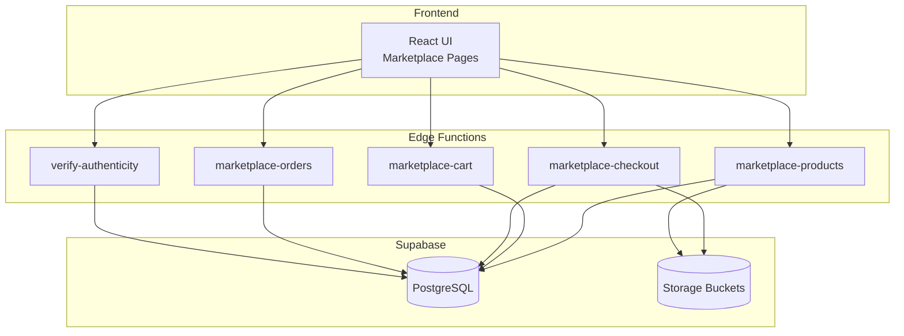
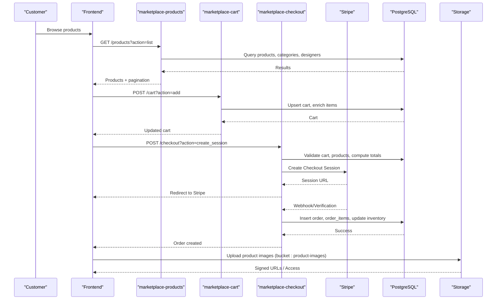
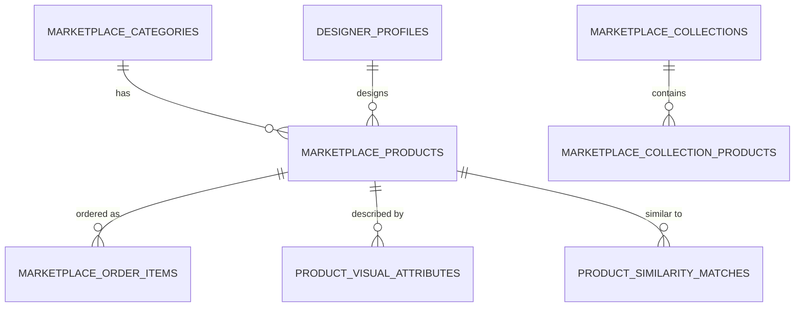
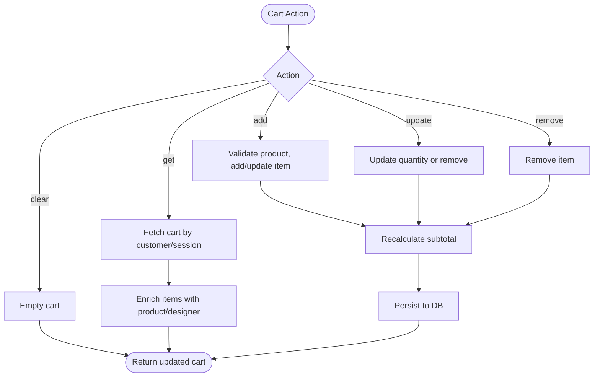
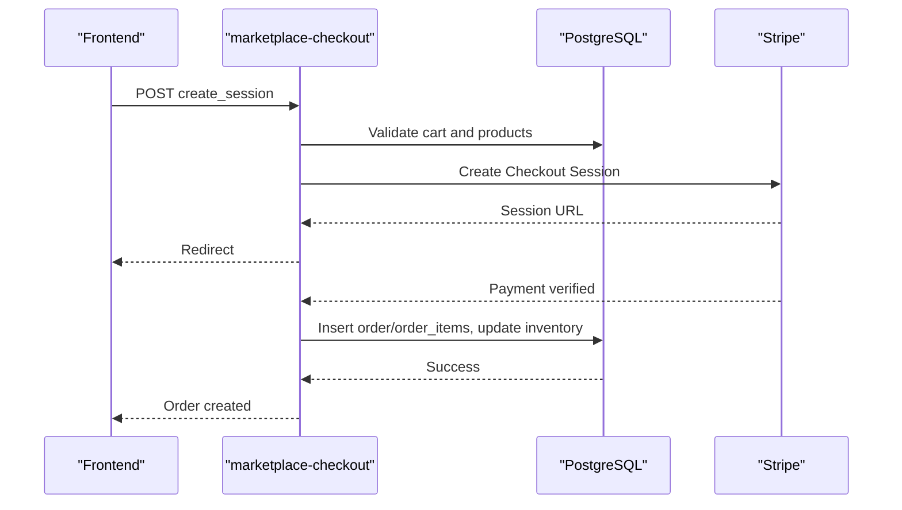
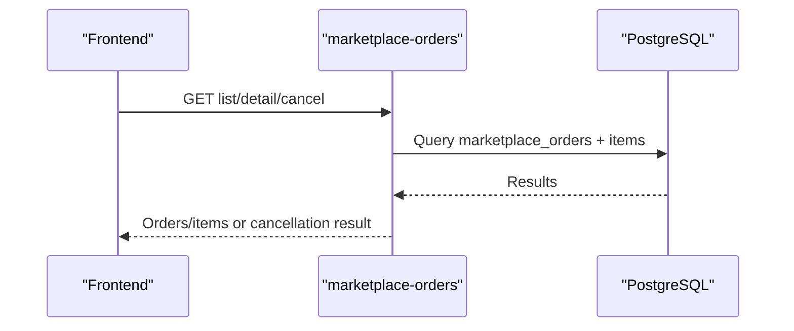
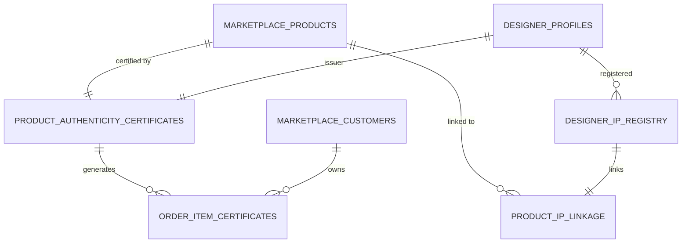
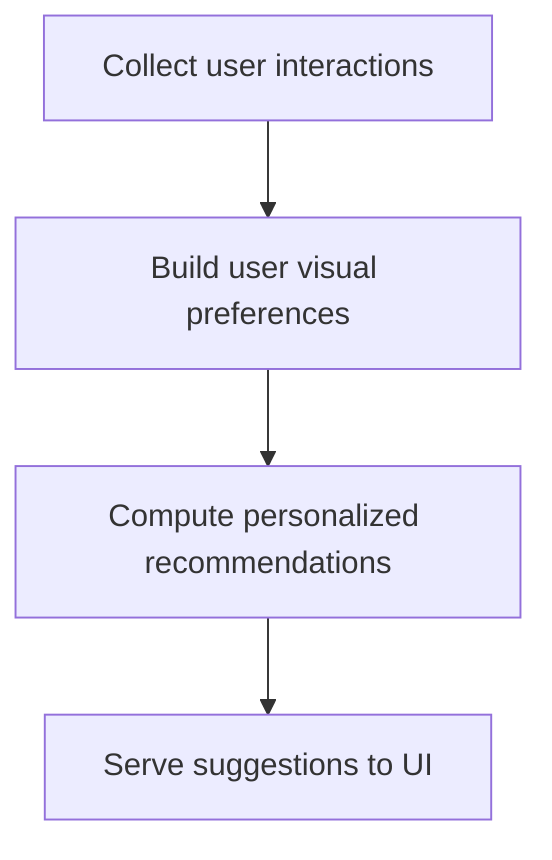
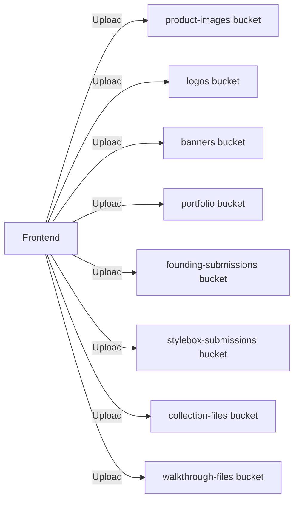
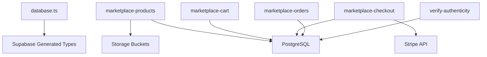

# Marketplace & E-commerce

<cite>
**Referenced Files in This Document**
- [20260127240000_product_authenticity_system.sql](file://supabase/migrations/20260127240000_product_authenticity_system.sql)
- [20260127250000_visual_similarity_engine.sql](file://supabase/migrations/20260127250000_visual_similarity_engine.sql)
- [20260126000000_add_designer_approval_and_follows.sql](file://supabase/migrations/20260000_add_designer_approval_and_follows.sql)
- [20260126010000_add_founding_designers_program.sql](file://supabase/migrations/20260126010000_add_founding_designers_program.sql)
- [20260127230305_create_portfolio_tables.sql](file://supabase/migrations/20260127230305_create_portfolio_tables.sql)
- [20260108044609_38199a3a-f6a3-42ea-b892-ae6b88050934.sql](file://supabase/migrations/20260108044609_38199a3a-f6a3-42ea-b892-ae6b88050934.sql)
- [20260108050000_enhance_designer_profiles.sql](file://supabase/migrations/20260108050000_enhance_designer_profiles.sql)
- [20260126020000_fix_all_storage_buckets.sql](file://supabase/migrations/20260126020000_fix_all_storage_buckets.sql)
- [20260127260000_seed_marketplace_preview_data.sql](file://supabase/migrations/20260127260000_seed_marketplace_preview_data.sql)
- [database.ts](file://src/types/database.ts)
- [marketplace-products/index.ts](file://supabase/functions/marketplace-products/index.ts)
- [marketplace-cart/index.ts](file://supabase/functions/marketplace-cart/index.ts)
- [marketplace-checkout/index.ts](file://supabase/functions/marketplace-checkout/index.ts)
- [marketplace-orders/index.ts](file://supabase/functions/marketplace-orders/index.ts)
- [verify-authenticity/index.ts](file://supabase/functions/verify-authenticity/index.ts)
</cite>

## Table of Contents
1. [Introduction](#introduction)
2. [Project Structure](#project-structure)
3. [Core Components](#core-components)
4. [Architecture Overview](#architecture-overview)
5. [Detailed Component Analysis](#detailed-component-analysis)
6. [Dependency Analysis](#dependency-analysis)
7. [Performance Considerations](#performance-considerations)
8. [Troubleshooting Guide](#troubleshooting-guide)
9. [Conclusion](#conclusion)
10. [Appendices](#appendices)

## Introduction
This document describes the marketplace and e-commerce database schema and backend flows for product catalog, orders, cart, payments, authenticity verification, and the visual similarity engine. It also covers product categorization, designer associations, inventory management, order processing, payment tracking, shipping logistics, and storage bucket integration for product images and digital assets.

## Project Structure
The marketplace is implemented with:
- Supabase Postgres for relational data and Row Level Security (RLS)
- Supabase Edge Functions for serverless APIs (products, cart, checkout, orders, authenticity)
- Supabase Storage buckets for images and documents
- TypeScript types for frontend integration

**Diagram sources**
- [marketplace-products/index.ts](file://supabase/functions/marketplace-products/index.ts#L1-L256)
- [marketplace-cart/index.ts](file://supabase/functions/marketplace-cart/index.ts#L1-L322)
- [marketplace-checkout/index.ts](file://supabase/functions/marketplace-checkout/index.ts#L1-L330)
- [marketplace-orders/index.ts](file://supabase/functions/marketplace-orders/index.ts#L1-L226)
- [verify-authenticity/index.ts](file://supabase/functions/verify-authenticity/index.ts#L1-L262)

**Section sources**
- [marketplace-products/index.ts](file://supabase/functions/marketplace-products/index.ts#L1-L256)
- [marketplace-cart/index.ts](file://supabase/functions/marketplace-cart/index.ts#L1-L322)
- [marketplace-checkout/index.ts](file://supabase/functions/marketplace-checkout/index.ts#L1-L330)
- [marketplace-orders/index.ts](file://supabase/functions/marketplace-orders/index.ts#L1-L226)
- [verify-authenticity/index.ts](file://supabase/functions/verify-authenticity/index.ts#L1-L262)

## Core Components
- Product Catalog: Categories, collections, products, visual attributes, and similarity
- Customer & Orders: Customers, orders, order items, and order lifecycle
- Cart: Anonymous and authenticated sessions with persistence
- Payments: Stripe integration via checkout session creation and verification
- Authenticity: Digital certificates, order-item certificates, IP registry linkage
- Storage: Product images and other digital assets in dedicated buckets

**Section sources**
- [20260108044609_38199a3a-f6a3-42ea-b892-ae6b88050934.sql](file://supabase/migrations/20260108044609_38199a3a-f6a3-42ea-b892-ae6b88050934.sql#L1-L111)
- [20260127250000_visual_similarity_engine.sql](file://supabase/migrations/20260127250000_visual_similarity_engine.sql#L1-L279)
- [20260127240000_product_authenticity_system.sql](file://supabase/migrations/20260127240000_product_authenticity_system.sql#L1-L238)
- [20260126020000_fix_all_storage_buckets.sql](file://supabase/migrations/20260126020000_fix_all_storage_buckets.sql#L38-L138)

## Architecture Overview
End-to-end flow from browsing to purchase and authenticity verification:

**Diagram sources**
- [marketplace-products/index.ts](file://supabase/functions/marketplace-products/index.ts#L28-L115)
- [marketplace-cart/index.ts](file://supabase/functions/marketplace-cart/index.ts#L137-L206)
- [marketplace-checkout/index.ts](file://supabase/functions/marketplace-checkout/index.ts#L40-L173)
- [20260126020000_fix_all_storage_buckets.sql](file://supabase/migrations/20260126020000_fix_all_storage_buckets.sql#L122-L134)

## Detailed Component Analysis

### Product Catalog and Categorization
- Categories: hierarchical grouping with SEO metadata and vibe tags
- Collections: curated sets of products
- Products: rich attributes including pricing, inventory, tags, and images
- Visual attributes and similarity: structured visual descriptors and precomputed matches for recommendation
- Designer associations: product to designer profile via foreign keys

**Diagram sources**
- [20260108044609_38199a3a-f6a3-42ea-b892-ae6b88050934.sql](file://supabase/migrations/20260108044609_38199a3a-f6a3-42ea-b892-ae6b88050934.sql#L61-L111)
- [20260127250000_visual_similarity_engine.sql](file://supabase/migrations/20260127250000_visual_similarity_engine.sql#L6-L91)
- [20260127260000_seed_marketplace_preview_data.sql](file://supabase/migrations/20260127260000_seed_marketplace_preview_data.sql#L18-L24)

**Section sources**
- [20260108044609_38199a3a-f6a3-42ea-b892-ae6b88050934.sql](file://supabase/migrations/20260108044609_38199a3a-f6a3-42ea-b892-ae6b88050934.sql#L1-L111)
- [20260127250000_visual_similarity_engine.sql](file://supabase/migrations/20260127250000_visual_similarity_engine.sql#L1-L279)
- [20260127260000_seed_marketplace_preview_data.sql](file://supabase/migrations/20260127260000_seed_marketplace_preview_data.sql#L40-L245)

### Cart and Inventory Management
- Anonymous and authenticated carts persisted by customer or session
- Cart enrichment with product and designer details
- Inventory checks and updates on add/update/remove
- Clear cart after successful order creation

**Diagram sources**
- [marketplace-cart/index.ts](file://supabase/functions/marketplace-cart/index.ts#L67-L135)
- [marketplace-cart/index.ts](file://supabase/functions/marketplace-cart/index.ts#L137-L206)
- [marketplace-cart/index.ts](file://supabase/functions/marketplace-cart/index.ts#L208-L283)
- [marketplace-cart/index.ts](file://supabase/functions/marketplace-cart/index.ts#L285-L306)

**Section sources**
- [marketplace-cart/index.ts](file://supabase/functions/marketplace-cart/index.ts#L1-L322)
- [database.ts](file://src/types/database.ts#L18-L28)

### Payment Processing and Shipping
- Stripe integration for secure checkout sessions
- Multi-currency support and regional shipping costs
- Free shipping thresholds
- Order creation, order items, and inventory adjustments
- Payment status verification and metadata propagation

**Diagram sources**
- [marketplace-checkout/index.ts](file://supabase/functions/marketplace-checkout/index.ts#L40-L173)
- [marketplace-checkout/index.ts](file://supabase/functions/marketplace-checkout/index.ts#L175-L314)

**Section sources**
- [marketplace-checkout/index.ts](file://supabase/functions/marketplace-checkout/index.ts#L1-L330)

### Orders and Order Lifecycle
- Customer-scoped order listing and detail retrieval
- Order cancellation with inventory restoration
- Order items enriched with product metadata

**Diagram sources**
- [marketplace-orders/index.ts](file://supabase/functions/marketplace-orders/index.ts#L60-L95)
- [marketplace-orders/index.ts](file://supabase/functions/marketplace-orders/index.ts#L97-L145)
- [marketplace-orders/index.ts](file://supabase/functions/marketplace-orders/index.ts#L147-L210)

**Section sources**
- [marketplace-orders/index.ts](file://supabase/functions/marketplace-orders/index.ts#L1-L226)

### Authenticity Verification System
- Product authenticity certificates linked to products and designers
- Order item certificates with unique serial numbers and verification codes
- Designer IP registry and product-to-IP linkage
- Public verification endpoint and admin certificate generation

**Diagram sources**
- [20260127240000_product_authenticity_system.sql](file://supabase/migrations/20260127240000_product_authenticity_system.sql#L4-L96)

**Section sources**
- [20260127240000_product_authenticity_system.sql](file://supabase/migrations/20260127240000_product_authenticity_system.sql#L1-L238)
- [verify-authenticity/index.ts](file://supabase/functions/verify-authenticity/index.ts#L38-L122)
- [verify-authenticity/index.ts](file://supabase/functions/verify-authenticity/index.ts#L124-L186)
- [verify-authenticity/index.ts](file://supabase/functions/verify-authenticity/index.ts#L188-L248)

### Visual Similarity Engine (Vibe-Match)
- Structured visual attributes per product (silhouette, fabric, color, pattern, aesthetics)
- Pre-computed similarity matches and user visual preferences
- Recommendation and personalization functions

**Diagram sources**
- [20260127250000_visual_similarity_engine.sql](file://supabase/migrations/20260127250000_visual_similarity_engine.sql#L63-L91)
- [20260127250000_visual_similarity_engine.sql](file://supabase/migrations/20260127250000_visual_similarity_engine.sql#L163-L214)

**Section sources**
- [20260127250000_visual_similarity_engine.sql](file://supabase/migrations/20260127250000_visual_similarity_engine.sql#L1-L279)

### Storage Bucket Integration
- Dedicated buckets for product images, logos, banners, portfolios, and submissions
- RLS policies controlling access per bucket and per user
- Frontend uploads to product-images bucket for product media

**Diagram sources**
- [20260126020000_fix_all_storage_buckets.sql](file://supabase/migrations/20260126020000_fix_all_storage_buckets.sql#L38-L138)
- [20260108050000_enhance_designer_profiles.sql](file://supabase/migrations/20260108050000_enhance_designer_profiles.sql#L50-L127)

**Section sources**
- [20260126020000_fix_all_storage_buckets.sql](file://supabase/migrations/20260126020000_fix_all_storage_buckets.sql#L1-L138)
- [20260108050000_enhance_designer_profiles.sql](file://supabase/migrations/20260108050000_enhance_designer_profiles.sql#L1-L127)

## Dependency Analysis
- Frontend types depend on Supabase-generated types for marketplace entities
- Edge functions depend on Supabase client and environment variables
- Authenticity and visual similarity rely on dedicated tables and functions
- Storage depends on bucket definitions and RLS policies

**Diagram sources**
- [database.ts](file://src/types/database.ts#L1-L29)
- [marketplace-products/index.ts](file://supabase/functions/marketplace-products/index.ts#L1-L256)
- [marketplace-cart/index.ts](file://supabase/functions/marketplace-cart/index.ts#L1-L322)
- [marketplace-checkout/index.ts](file://supabase/functions/marketplace-checkout/index.ts#L1-L330)
- [marketplace-orders/index.ts](file://supabase/functions/marketplace-orders/index.ts#L1-L226)
- [verify-authenticity/index.ts](file://supabase/functions/verify-authenticity/index.ts#L1-L262)

**Section sources**
- [database.ts](file://src/types/database.ts#L1-L29)

## Performance Considerations
- Use indexes on frequently filtered columns (category, designer, product status)
- Prefer precomputed similarity matches for recommendation performance
- Batch updates for inventory and sold counts during checkout
- Leverage GIN indexes for arrays and JSONB fields in visual attributes and interactions
- Limit payload sizes and use pagination for product listings

[No sources needed since this section provides general guidance]

## Troubleshooting Guide
- Authentication failures in checkout: ensure service role key is configured and accessible to the function
- Empty cart errors: verify cart exists and is not expired; confirm customer/session association
- Payment verification: check Stripe webhook configuration and session metadata consistency
- Authenticity verification: ensure uppercase normalization for verification code/serial number
- Storage access denied: confirm bucket policies and folder-based ownership checks

**Section sources**
- [marketplace-checkout/index.ts](file://supabase/functions/marketplace-checkout/index.ts#L22-L33)
- [marketplace-orders/index.ts](file://supabase/functions/marketplace-orders/index.ts#L23-L53)
- [verify-authenticity/index.ts](file://supabase/functions/verify-authenticity/index.ts#L38-L80)

## Conclusion
The marketplace integrates a robust product catalog with visual similarity, a secure cart and checkout powered by Stripe, comprehensive order lifecycle management, and a luxury-grade authenticity system with IP linkage. Storage buckets are provisioned for scalable media handling. The schema and functions are designed for scalability, security via RLS, and maintainable operations.

## Appendices

### API Surface Summary
- Products: list, detail, categories, collections
- Cart: get, add, update, remove, clear
- Checkout: create session, verify session
- Orders: list, detail, cancel
- Authenticity: verify, get_certificate, generate

**Section sources**
- [marketplace-products/index.ts](file://supabase/functions/marketplace-products/index.ts#L28-L240)
- [marketplace-cart/index.ts](file://supabase/functions/marketplace-cart/index.ts#L101-L306)
- [marketplace-checkout/index.ts](file://supabase/functions/marketplace-checkout/index.ts#L40-L314)
- [marketplace-orders/index.ts](file://supabase/functions/marketplace-orders/index.ts#L60-L210)
- [verify-authenticity/index.ts](file://supabase/functions/verify-authenticity/index.ts#L38-L248)