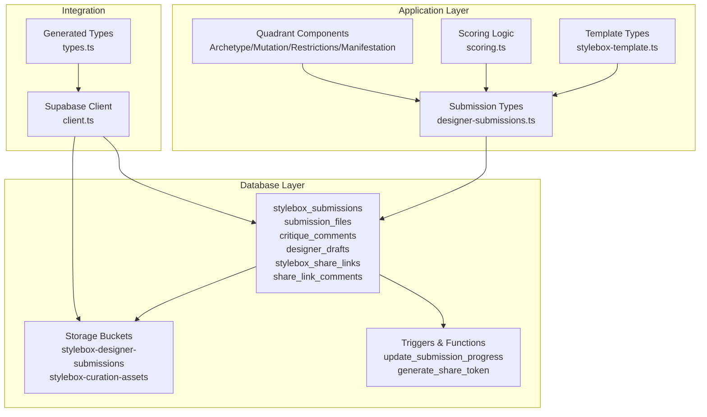
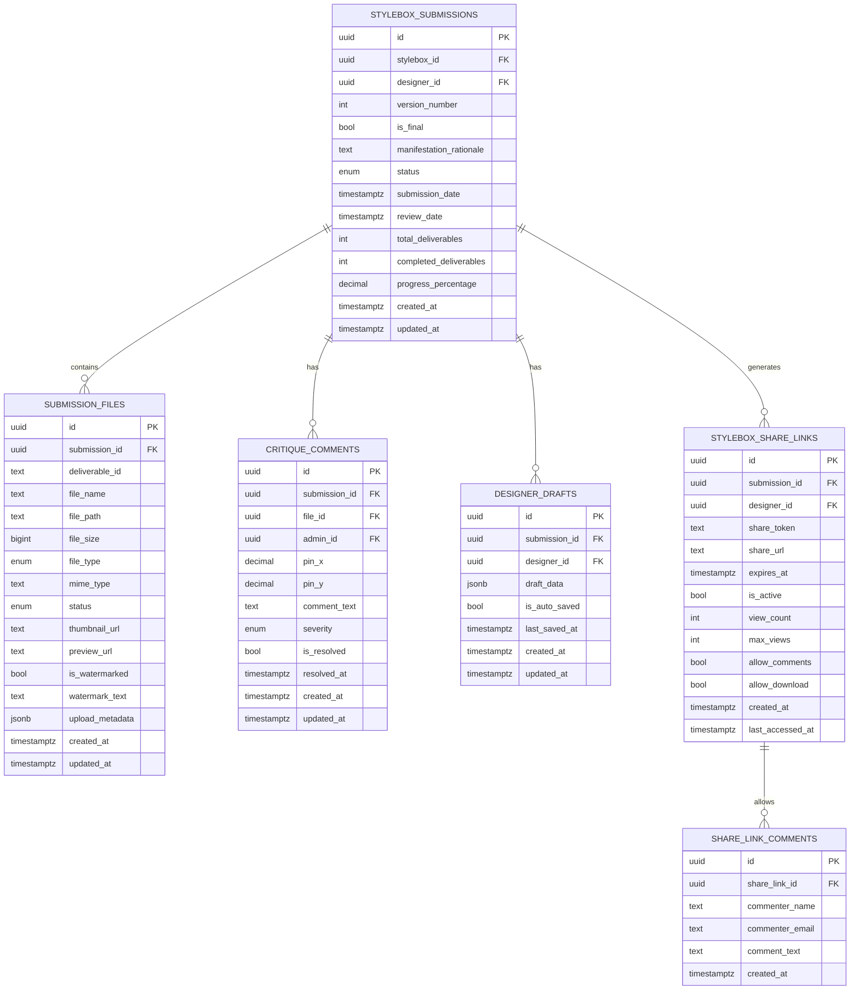
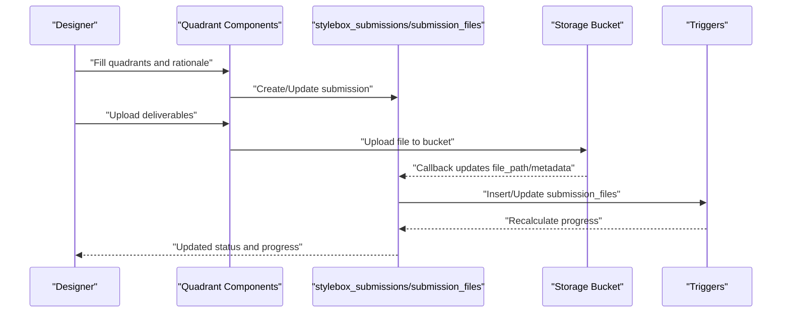
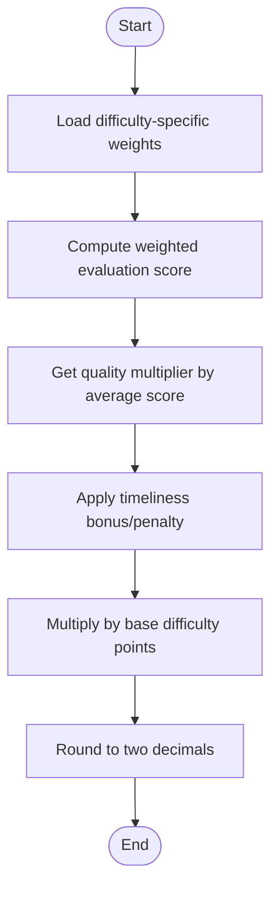
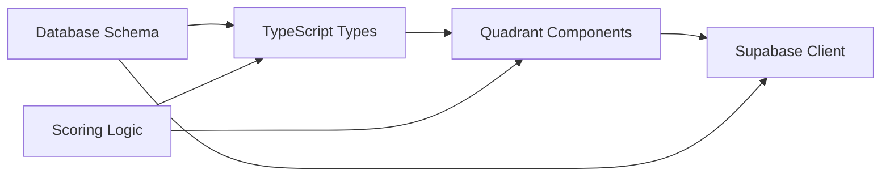

# Stylebox Challenge System

<cite>
**Referenced Files in This Document**
- [20260130050000_designer_stylebox_system.sql](file://supabase/migrations/20260130050000_designer_stylebox_system.sql)
- [20260130030000_stylebox_storage_and_watermarking.sql](file://supabase/migrations/20260130030000_stylebox_storage_and_watermarking.sql)
- [stylebox-template.ts](file://src/lib/stylebox-template.ts)
- [scoring.ts](file://src/lib/scoring.ts)
- [StyleboxArchetypeQuadrant.tsx](file://src/components/stylebox/workspace/StyleboxArchetypeQuadrant.tsx)
- [StyleboxMutationQuadrant.tsx](file://src/components/stylebox/workspace/StyleboxMutationQuadrant.tsx)
- [StyleboxRestrictionsQuadrant.tsx](file://src/components/stylebox/workspace/StyleboxRestrictionsQuadrant.tsx)
- [StyleboxManifestationQuadrant.tsx](file://src/components/stylebox/workspace/StyleboxManifestationQuadrant.tsx)
- [designer-submissions.ts](file://src/types/designer-submissions.ts)
- [client.ts](file://src/integrations/supabase/client.ts)
- [types.ts](file://src/integrations/supabase/types.ts)
</cite>

## Table of Contents
1. [Introduction](#introduction)
2. [Project Structure](#project-structure)
3. [Core Components](#core-components)
4. [Architecture Overview](#architecture-overview)
5. [Detailed Component Analysis](#detailed-component-analysis)
6. [Dependency Analysis](#dependency-analysis)
7. [Performance Considerations](#performance-considerations)
8. [Troubleshooting Guide](#troubleshooting-guide)
9. [Conclusion](#conclusion)

## Introduction
This document explains the Stylebox challenge system database schema and the end-to-end designer workflow. It covers the quadrant-based design system (archetype, mutation, restrictions, and manifestation), the submission lifecycle, evaluation and scoring, and the watermarking and storage integration for submitted designs. The goal is to help both technical and non-technical stakeholders understand how Stylebox submissions are modeled, stored, reviewed, and rewarded.

## Project Structure
The Stylebox system spans database migrations, TypeScript type definitions, frontend quadrant components, and scoring logic:
- Database schema: migrations define enums, tables, storage buckets, RLS policies, triggers, and helper functions.
- Templates and types: TypeScript interfaces define the production-grade StyleBox template and submission-related types.
- Frontend quadrants: React components visualize the four quadrants of the design process.
- Scoring: TypeScript utilities compute weighted scores for designers based on StyleBox performance and timeliness.

**Diagram sources**
- [20260130050000_designer_stylebox_system.sql](file://supabase/migrations/20260130050000_designer_stylebox_system.sql#L43-L195)
- [20260130030000_stylebox_storage_and_watermarking.sql](file://supabase/migrations/20260130030000_stylebox_storage_and_watermarking.sql#L1-L45)
- [stylebox-template.ts](file://src/lib/stylebox-template.ts#L209-L282)
- [designer-submissions.ts](file://src/types/designer-submissions.ts#L33-L124)
- [scoring.ts](file://src/lib/scoring.ts#L1-L239)
- [StyleboxArchetypeQuadrant.tsx](file://src/components/stylebox/workspace/StyleboxArchetypeQuadrant.tsx#L10-L23)
- [StyleboxMutationQuadrant.tsx](file://src/components/stylebox/workspace/StyleboxMutationQuadrant.tsx#L10-L22)
- [StyleboxRestrictionsQuadrant.tsx](file://src/components/stylebox/workspace/StyleboxRestrictionsQuadrant.tsx#L13-L22)
- [StyleboxManifestationQuadrant.tsx](file://src/components/stylebox/workspace/StyleboxManifestationQuadrant.tsx#L10-L28)
- [client.ts](file://src/integrations/supabase/client.ts#L11-L17)
- [types.ts](file://src/integrations/supabase/types.ts#L1-L15)

**Section sources**
- [20260130050000_designer_stylebox_system.sql](file://supabase/migrations/20260130050000_designer_stylebox_system.sql#L1-L559)
- [20260130030000_stylebox_storage_and_watermarking.sql](file://supabase/migrations/20260130030000_stylebox_storage_and_watermarking.sql#L1-L45)
- [stylebox-template.ts](file://src/lib/stylebox-template.ts#L1-L531)
- [designer-submissions.ts](file://src/types/designer-submissions.ts#L1-L255)
- [scoring.ts](file://src/lib/scoring.ts#L1-L239)
- [StyleboxArchetypeQuadrant.tsx](file://src/components/stylebox/workspace/StyleboxArchetypeQuadrant.tsx#L1-L205)
- [StyleboxMutationQuadrant.tsx](file://src/components/stylebox/workspace/StyleboxMutationQuadrant.tsx#L1-L230)
- [StyleboxRestrictionsQuadrant.tsx](file://src/components/stylebox/workspace/StyleboxRestrictionsQuadrant.tsx#L1-L230)
- [StyleboxManifestationQuadrant.tsx](file://src/components/stylebox/workspace/StyleboxManifestationQuadrant.tsx#L1-L202)
- [client.ts](file://src/integrations/supabase/client.ts#L1-L17)
- [types.ts](file://src/integrations/supabase/types.ts#L1-L800)

## Core Components
- StyleBox templates define the production-grade structure for challenges, including scenario, constraints, deliverables, evaluation criteria, and timeline.
- Designer submissions capture the designer’s work-in-progress and final entries, including versioning, status tracking, and progress metrics.
- Submission files represent uploaded deliverables with metadata, preview/thumbnail URLs, and watermark flags.
- Critique comments enable admin pin-marker feedback on specific files.
- Designer drafts support auto-save and version control.
- Share links enable view-only collaboration with optional download and comment permissions.
- Storage buckets isolate designer submissions and curation assets with strict RLS policies.
- Triggers and helper functions automate progress updates and share link generation.
- Scoring logic computes weighted StyleBox scores considering difficulty, evaluation weights, quality multipliers, and timeliness.

**Section sources**
- [stylebox-template.ts](file://src/lib/stylebox-template.ts#L209-L282)
- [designer-submissions.ts](file://src/types/designer-submissions.ts#L33-L124)
- [20260130050000_designer_stylebox_system.sql](file://supabase/migrations/20260130050000_designer_stylebox_system.sql#L43-L195)
- [20260130030000_stylebox_storage_and_watermarking.sql](file://supabase/migrations/20260130030000_stylebox_storage_and_watermarking.sql#L1-L45)
- [scoring.ts](file://src/lib/scoring.ts#L1-L239)

## Architecture Overview
The system integrates a normalized relational schema with Supabase storage and RLS, complemented by frontend quadrant components and scoring utilities.

**Diagram sources**
- [20260130050000_designer_stylebox_system.sql](file://supabase/migrations/20260130050000_designer_stylebox_system.sql#L43-L195)

## Detailed Component Analysis

### Database Schema: StyleBox Submissions and Files
- stylebox_submissions: Tracks each designer’s submission per StyleBox, including versioning, status, and progress metrics.
- submission_files: Links deliverables to submissions with file metadata, preview URLs, watermark flags, and status.
- critique_comments: Enables admin pin-marker feedback with severity and resolution tracking.
- designer_drafts: Stores auto-saved form state per submission.
- stylebox_share_links: Generates secure, view-only share tokens with optional limits and permissions.
- share_link_comments: Public comments on active share links.

Key constraints and checks ensure data integrity (e.g., progress percentage bounds, deliverable counts).

**Section sources**
- [20260130050000_designer_stylebox_system.sql](file://supabase/migrations/20260130050000_designer_stylebox_system.sql#L43-L195)

### Storage and Watermarking Integration
- Storage buckets:
  - stylebox-designer-submissions: Private bucket for designer uploads with a 500 MB limit and allowed MIME types.
  - stylebox-curation-assets: Private bucket for curated assets during the curation phase.
- RLS policies:
  - Designers can upload, view, update, and delete only their own files.
  - Admins and lead curators can access all designer submissions.
  - Curators can manage curation assets.
- Watermarking:
  - submission_files includes is_watermarked and watermark_text fields to mark uploaded assets.

**Section sources**
- [20260130050000_designer_stylebox_system.sql](file://supabase/migrations/20260130050000_designer_stylebox_system.sql#L224-L262)
- [20260130030000_stylebox_storage_and_watermarking.sql](file://supabase/migrations/20260130030000_stylebox_storage_and_watermarking.sql#L1-L45)

### Triggers and Helper Functions
- update_submission_progress: Automatically recalculates completed_deliverables and progress_percentage whenever submission_files change.
- generate_share_token: Creates unique share tokens and URLs before inserting share links.
- check_submission_complete: Helper function to verify if a submission has completed all deliverables.
- increment_share_view: Increments view counters for share links with expiration and view caps.

**Section sources**
- [20260130050000_designer_stylebox_system.sql](file://supabase/migrations/20260130050000_designer_stylebox_system.sql#L458-L547)

### Quadrant-Based Design System
The frontend presents a quadrant-based design canvas:
- Q1: Archetype – Commercial constant with silhouette rationale and anchor image.
- Q2: Mutation – Creative disruption with concept, directive, and moodboard gallery.
- Q3: Restrictions – Technical constraints and numerical tolerances.
- Q4: Manifestation – Design prompt and rationale, plus deliverable upload area.

These quadrants map to the template fields and submission data model, guiding designers through the challenge while preserving structure for evaluation.

**Section sources**
- [StyleboxArchetypeQuadrant.tsx](file://src/components/stylebox/workspace/StyleboxArchetypeQuadrant.tsx#L10-L23)
- [StyleboxMutationQuadrant.tsx](file://src/components/stylebox/workspace/StyleboxMutationQuadrant.tsx#L10-L22)
- [StyleboxRestrictionsQuadrant.tsx](file://src/components/stylebox/workspace/StyleboxRestrictionsQuadrant.tsx#L13-L22)
- [StyleboxManifestationQuadrant.tsx](file://src/components/stylebox/workspace/StyleboxManifestationQuadrant.tsx#L10-L28)
- [stylebox-template.ts](file://src/lib/stylebox-template.ts#L209-L282)

### Submission Workflow
The submission lifecycle:
- Draft → Submit → Under Review → Approved/Rejected/Revision Requested.
- Progress is tracked via completed_deliverables and progress_percentage.
- Manifestation rationale is captured in stylebox_submissions.
- Deliverables are uploaded to submission_files with appropriate metadata and watermark flags.

**Diagram sources**
- [20260130050000_designer_stylebox_system.sql](file://supabase/migrations/20260130050000_designer_stylebox_system.sql#L458-L492)
- [StyleboxManifestationQuadrant.tsx](file://src/components/stylebox/workspace/StyleboxManifestationQuadrant.tsx#L35-L64)

**Section sources**
- [20260130050000_designer_stylebox_system.sql](file://supabase/migrations/20260130050000_designer_stylebox_system.sql#L43-L195)
- [StyleboxManifestationQuadrant.tsx](file://src/components/stylebox/workspace/StyleboxManifestationQuadrant.tsx#L35-L64)

### Evaluation Criteria and Reward Calculation
- Evaluation criteria weights vary by difficulty, ensuring appropriate emphasis on trend alignment, creativity, technical execution, and craftsmanship.
- Quality multipliers adjust scores based on average performance tiers.
- Timeliness bonuses penalize lateness and reward early completion.
- The scoring module computes a weighted StyleBox score contribution and integrates with broader designer scoring.

**Diagram sources**
- [scoring.ts](file://src/lib/scoring.ts#L31-L148)

**Section sources**
- [scoring.ts](file://src/lib/scoring.ts#L1-L239)

### Template and Type Definitions
- StyleBoxTemplate defines the production-grade structure for challenges, including scenario, constraints, deliverables, evaluation criteria, and timeline.
- DesignerSubmission types align with the database schema and provide type safety for frontend operations.

**Section sources**
- [stylebox-template.ts](file://src/lib/stylebox-template.ts#L209-L282)
- [designer-submissions.ts](file://src/types/designer-submissions.ts#L33-L124)

### Supabase Integration
- Supabase client is configured with environment variables and persistence.
- Generated types provide compile-time safety for database operations.

**Section sources**
- [client.ts](file://src/integrations/supabase/client.ts#L11-L17)
- [types.ts](file://src/integrations/supabase/types.ts#L1-L15)

## Dependency Analysis
The system exhibits clear separation of concerns:
- Database schema defines core entities and constraints.
- TypeScript types enforce consistency between frontend and backend.
- Frontend components depend on types and Supabase client for CRUD operations.
- Scoring logic is decoupled and reusable across contexts.

**Diagram sources**
- [20260130050000_designer_stylebox_system.sql](file://supabase/migrations/20260130050000_designer_stylebox_system.sql#L43-L195)
- [designer-submissions.ts](file://src/types/designer-submissions.ts#L33-L124)
- [StyleboxManifestationQuadrant.tsx](file://src/components/stylebox/workspace/StyleboxManifestationQuadrant.tsx#L35-L64)
- [scoring.ts](file://src/lib/scoring.ts#L1-L239)
- [client.ts](file://src/integrations/supabase/client.ts#L11-L17)

**Section sources**
- [20260130050000_designer_stylebox_system.sql](file://supabase/migrations/20260130050000_designer_stylebox_system.sql#L1-L559)
- [designer-submissions.ts](file://src/types/designer-submissions.ts#L1-L255)
- [StyleboxManifestationQuadrant.tsx](file://src/components/stylebox/workspace/StyleboxManifestationQuadrant.tsx#L1-L202)
- [scoring.ts](file://src/lib/scoring.ts#L1-L239)
- [client.ts](file://src/integrations/supabase/client.ts#L1-L17)

## Performance Considerations
- Indexes on frequently queried columns (designer_id, stylebox_id, status, timestamps) improve query performance.
- Triggers recalculate progress on file changes; keep file operations batched to minimize trigger overhead.
- Storage bucket policies restrict access to reduce unnecessary scans.
- Use helper functions judiciously; consider materialized views for heavy aggregations if needed.

[No sources needed since this section provides general guidance]

## Troubleshooting Guide
Common issues and resolutions:
- Progress not updating: Verify that submission_files inserts/updates fire the update_submission_progress trigger and that statuses are uploaded/approved.
- Watermarking missing: Ensure is_watermarked flag and watermark_text are set during upload and that storage policies permit updates.
- Share link access denied: Confirm share_token validity, expiration, and view limits; verify allow_comments and allow_download flags.
- Storage permission errors: Check RLS policies for bucket access and folder ownership.

**Section sources**
- [20260130050000_designer_stylebox_system.sql](file://supabase/migrations/20260130050000_designer_stylebox_system.sql#L458-L547)
- [20260130030000_stylebox_storage_and_watermarking.sql](file://supabase/migrations/20260130030000_stylebox_storage_and_watermarking.sql#L1-L45)

## Conclusion
The Stylebox challenge system combines a robust relational schema, strict storage and access controls, a structured quadrant-based design workflow, and a flexible scoring mechanism. Together, these components enable designers to produce high-quality submissions, streamline admin review, and fairly reward performance while maintaining strong data integrity and security.