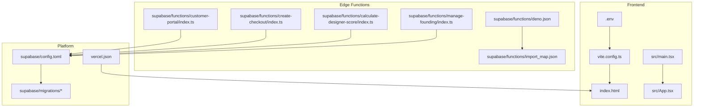
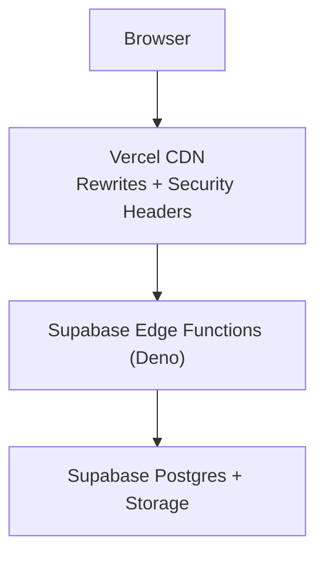
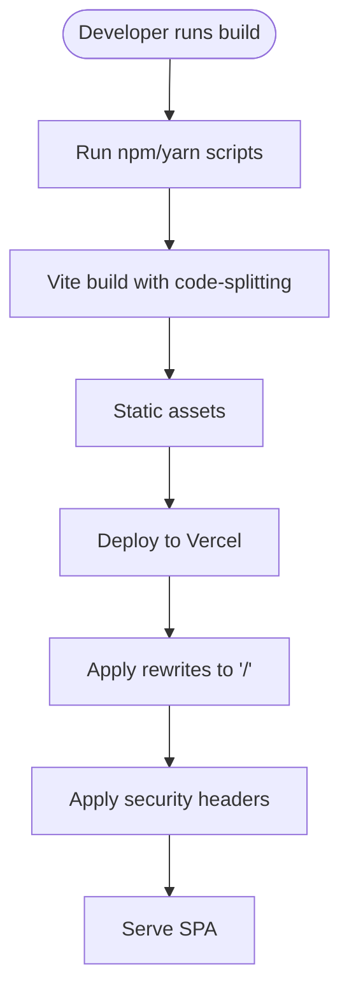
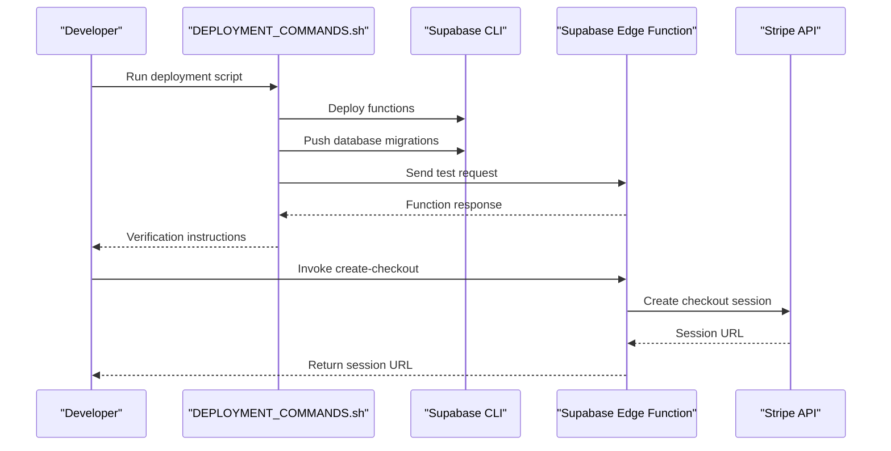
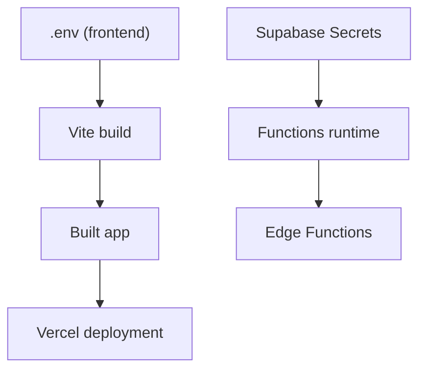
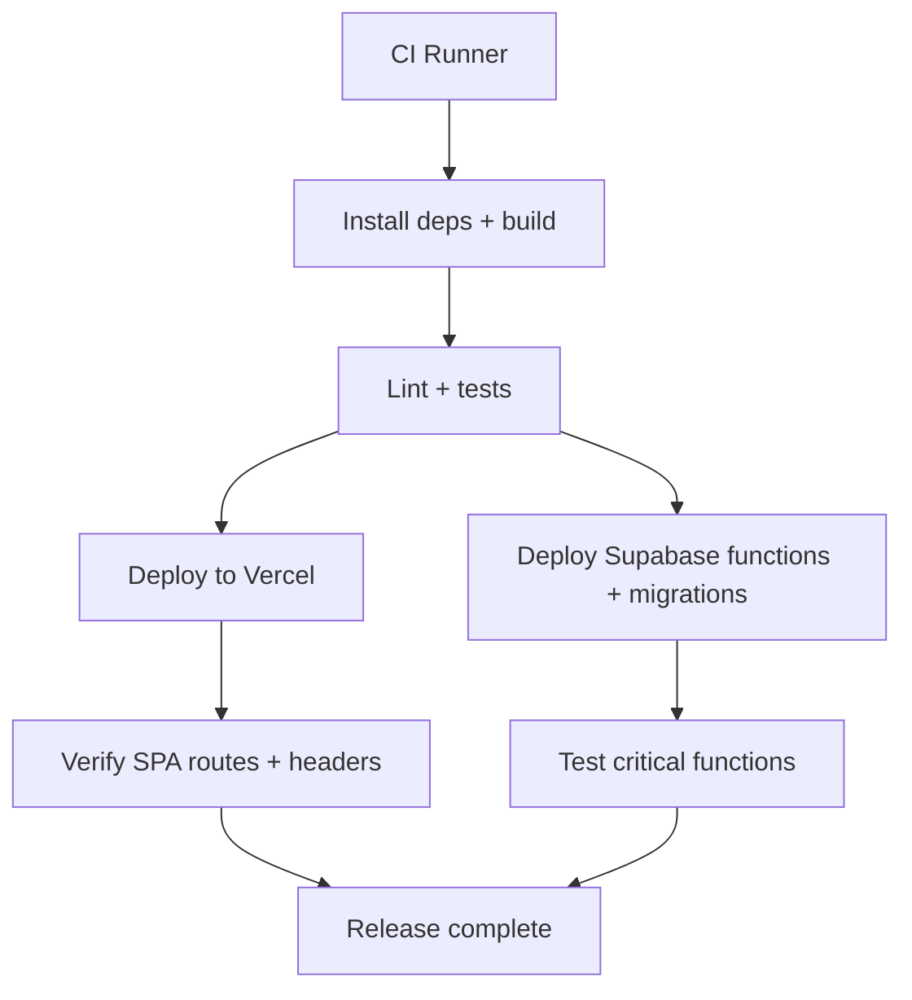
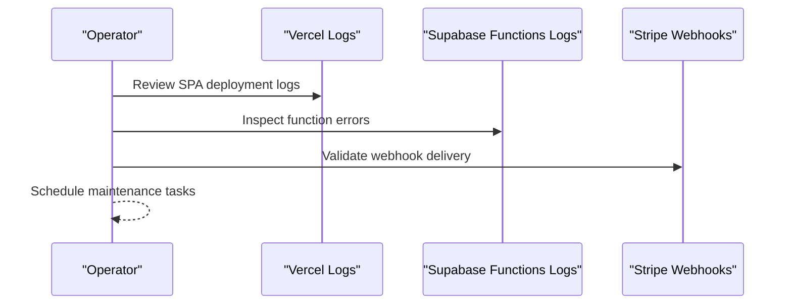
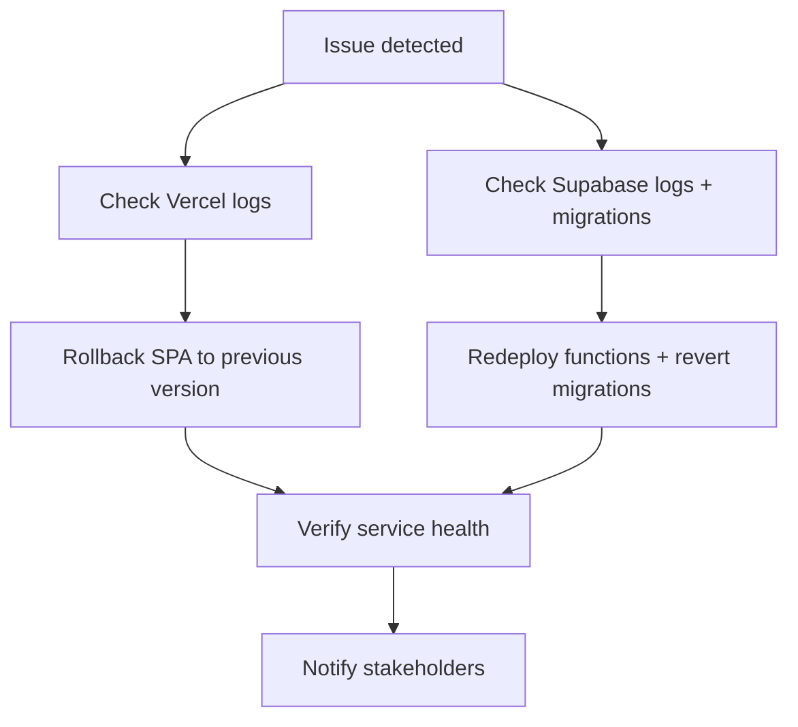
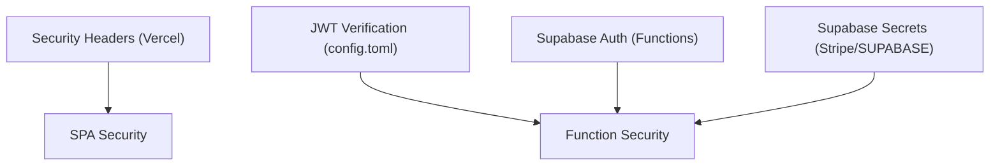
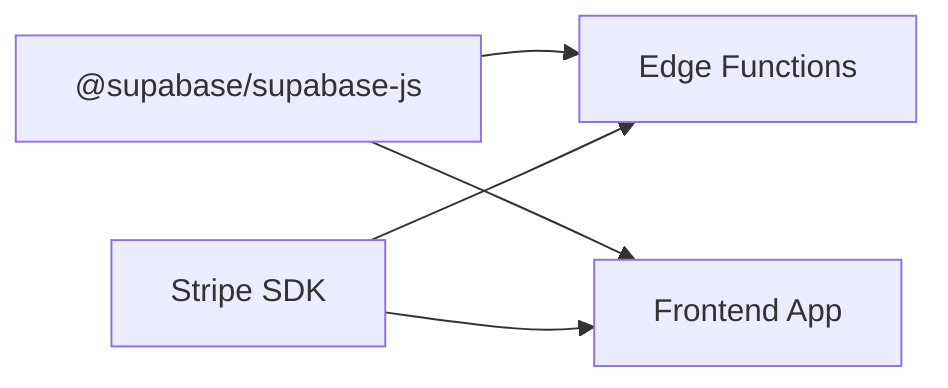

# Deployment & DevOps

<cite>
**Referenced Files in This Document**
- [vercel.json](file://vercel.json)
- [package.json](file://package.json)
- [DEPLOYMENT_COMMANDS.sh](file://DEPLOYMENT_COMMANDS.sh)
- [supabase/config.toml](file://supabase/config.toml)
- [.env](file://.env)
- [vite.config.ts](file://vite.config.ts)
- [index.html](file://index.html)
- [src/main.tsx](file://src/main.tsx)
- [src/App.tsx](file://src/App.tsx)
- [supabase/functions/deno.json](file://supabase/functions/deno.json)
- [supabase/functions/import_map.json](file://supabase/functions/import_map.json)
- [supabase/functions/manage-founding/index.ts](file://supabase/functions/manage-founding/index.ts)
- [supabase/functions/calculate-designer-score/index.ts](file://supabase/functions/calculate-designer-score/index.ts)
- [supabase/functions/create-checkout/index.ts](file://supabase/functions/create-checkout/index.ts)
- [supabase/functions/customer-portal/index.ts](file://supabase/functions/customer-portal/index.ts)
</cite>

## Table of Contents
1. [Introduction](#introduction)
2. [Project Structure](#project-structure)
3. [Core Components](#core-components)
4. [Architecture Overview](#architecture-overview)
5. [Detailed Component Analysis](#detailed-component-analysis)
6. [Dependency Analysis](#dependency-analysis)
7. [Performance Considerations](#performance-considerations)
8. [Troubleshooting Guide](#troubleshooting-guide)
9. [Conclusion](#conclusion)
10. [Appendices](#appendices)

## Introduction
This document provides comprehensive deployment and DevOps guidance for the Adorzia platform. It covers the frontend build process, environment configuration, CI/CD pipeline setup, and deployment strategies. It also documents Vercel deployment configuration, Supabase deployment requirements, environment variable management, monitoring and maintenance procedures, rollback strategies, performance optimization, security considerations, backup procedures, and disaster recovery planning.

## Project Structure
The Adorzia platform consists of:
- A React + TypeScript frontend built with Vite and deployed via Vercel.
- A Supabase backend with Edge Functions (Deno runtime) and database migrations.
- Environment configuration managed via .env and Supabase secrets.
- A dedicated deployment script for Supabase functions and migrations.

**Diagram sources**
- [vite.config.ts](file://vite.config.ts#L1-L39)
- [.env](file://.env#L1-L4)
- [index.html](file://index.html#L1-L127)
- [src/main.tsx](file://src/main.tsx#L1-L20)
- [src/App.tsx](file://src/App.tsx#L1-L350)
- [supabase/functions/deno.json](file://supabase/functions/deno.json#L1-L4)
- [supabase/functions/import_map.json](file://supabase/functions/import_map.json#L1-L7)
- [supabase/functions/manage-founding/index.ts](file://supabase/functions/manage-founding/index.ts#L1-L191)
- [supabase/functions/calculate-designer-score/index.ts](file://supabase/functions/calculate-designer-score/index.ts#L1-L223)
- [supabase/functions/create-checkout/index.ts](file://supabase/functions/create-checkout/index.ts#L1-L85)
- [supabase/functions/customer-portal/index.ts](file://supabase/functions/customer-portal/index.ts#L1-L74)
- [vercel.json](file://vercel.json#L1-L16)
- [supabase/config.toml](file://supabase/config.toml#L1-L71)

**Section sources**
- [package.json](file://package.json#L1-L88)
- [vite.config.ts](file://vite.config.ts#L1-L39)
- [vercel.json](file://vercel.json#L1-L16)
- [supabase/config.toml](file://supabase/config.toml#L1-L71)

## Core Components
- Frontend build and deployment:
  - Build scripts and dependencies are defined in package.json.
  - Vite configuration enables code-splitting, vendor chunking, and asset optimization.
  - Vercel configuration enforces rewrites and security headers.
- Supabase Edge Functions:
  - Deno runtime with import map for third-party libraries.
  - Functions for founding approvals, scoring, checkout, and customer portal.
- Environment configuration:
  - Frontend environment variables (.env) for Supabase project identifiers and keys.
  - Supabase config.toml defines JWT verification policies per function.

**Section sources**
- [package.json](file://package.json#L1-L88)
- [vite.config.ts](file://vite.config.ts#L18-L38)
- [vercel.json](file://vercel.json#L1-L16)
- [supabase/functions/deno.json](file://supabase/functions/deno.json#L1-L4)
- [supabase/functions/import_map.json](file://supabase/functions/import_map.json#L1-L7)
- [supabase/config.toml](file://supabase/config.toml#L1-L71)
- [.env](file://.env#L1-L4)

## Architecture Overview
The deployment architecture integrates the frontend and backend as follows:
- Frontend (React SPA) hosted on Vercel with static rewrites and security headers.
- Supabase Edge Functions (Deno) handling business logic and integrations with Stripe and Supabase Auth/DB.
- Supabase database migrations applied via CLI to maintain schema consistency.

**Diagram sources**
- [vercel.json](file://vercel.json#L1-L16)
- [supabase/functions/manage-founding/index.ts](file://supabase/functions/manage-founding/index.ts#L1-L191)
- [supabase/functions/calculate-designer-score/index.ts](file://supabase/functions/calculate-designer-score/index.ts#L1-L223)
- [supabase/functions/create-checkout/index.ts](file://supabase/functions/create-checkout/index.ts#L1-L85)
- [supabase/functions/customer-portal/index.ts](file://supabase/functions/customer-portal/index.ts#L1-L74)

## Detailed Component Analysis

### Frontend Build and Deployment
- Build process:
  - Scripts for dev, build, dev build, lint, and preview are defined in package.json.
  - Vite configuration optimizes bundle size with manualChunks for vendor libraries and sets esbuild minification.
- Static hosting:
  - Vercel rewrites all routes to the SPA entry, enabling client-side routing.
  - Security headers enforce content-type options, frame options, and XSS protection.
- Environment variables:
  - Frontend reads Supabase project ID, publishable key, and URL from .env.

**Diagram sources**
- [package.json](file://package.json#L6-L11)
- [vite.config.ts](file://vite.config.ts#L18-L38)
- [vercel.json](file://vercel.json#L1-L16)

**Section sources**
- [package.json](file://package.json#L6-L11)
- [vite.config.ts](file://vite.config.ts#L18-L38)
- [vercel.json](file://vercel.json#L1-L16)
- [.env](file://.env#L1-L4)

### Supabase Edge Functions Deployment
- Function deployment flow:
  - A shell script deploys specific functions and pushes database migrations.
  - Post-deployment, the script tests a function endpoint and instructs next steps for verification.
- Function configuration:
  - deno.json defines the import map used by all functions.
  - import_map.json resolves @supabase/supabase-js and Stripe SDK.
- Function-specific behavior:
  - manage-founding validates admin roles and updates submission statuses.
  - calculate-designer-score computes weighted scores and persists results.
  - create-checkout creates Stripe checkout sessions using Supabase Auth.
  - customer-portal generates Stripe Billing Portal sessions for authenticated users.

**Diagram sources**
- [DEPLOYMENT_COMMANDS.sh](file://DEPLOYMENT_COMMANDS.sh#L1-L37)
- [supabase/functions/manage-founding/index.ts](file://supabase/functions/manage-founding/index.ts#L1-L191)
- [supabase/functions/create-checkout/index.ts](file://supabase/functions/create-checkout/index.ts#L1-L85)
- [supabase/functions/customer-portal/index.ts](file://supabase/functions/customer-portal/index.ts#L1-L74)

**Section sources**
- [DEPLOYMENT_COMMANDS.sh](file://DEPLOYMENT_COMMANDS.sh#L1-L37)
- [supabase/functions/deno.json](file://supabase/functions/deno.json#L1-L4)
- [supabase/functions/import_map.json](file://supabase/functions/import_map.json#L1-L7)
- [supabase/functions/manage-founding/index.ts](file://supabase/functions/manage-founding/index.ts#L1-L191)
- [supabase/functions/calculate-designer-score/index.ts](file://supabase/functions/calculate-designer-score/index.ts#L1-L223)
- [supabase/functions/create-checkout/index.ts](file://supabase/functions/create-checkout/index.ts#L1-L85)
- [supabase/functions/customer-portal/index.ts](file://supabase/functions/customer-portal/index.ts#L1-L74)

### Environment Variable Management
- Frontend variables:
  - Supabase project ID, publishable key, and URL are loaded from .env.
- Supabase function variables:
  - Functions rely on Supabase service role key, Stripe secret key, and Supabase URLs.
  - These are configured in Supabase project settings/secrets and injected at runtime.

**Diagram sources**
- [.env](file://.env#L1-L4)
- [vite.config.ts](file://vite.config.ts#L1-L39)
- [supabase/functions/manage-founding/index.ts](file://supabase/functions/manage-founding/index.ts#L22-L37)
- [supabase/functions/create-checkout/index.ts](file://supabase/functions/create-checkout/index.ts#L38-L40)
- [supabase/functions/customer-portal/index.ts](file://supabase/functions/customer-portal/index.ts#L22-L24)

**Section sources**
- [.env](file://.env#L1-L4)
- [supabase/functions/manage-founding/index.ts](file://supabase/functions/manage-founding/index.ts#L22-L37)
- [supabase/functions/create-checkout/index.ts](file://supabase/functions/create-checkout/index.ts#L38-L40)
- [supabase/functions/customer-portal/index.ts](file://supabase/functions/customer-portal/index.ts#L22-L24)

### CI/CD Pipeline Setup
Recommended CI/CD pipeline stages:
- Build:
  - Install dependencies and run the build script defined in package.json.
- Test:
  - Run lint checks and unit/integration tests (as applicable).
- Deploy:
  - Deploy frontend to Vercel using Vercel CLI or provider-native deployment.
  - Deploy Supabase functions and migrations using the deployment script and Supabase CLI.
- Post-deploy verification:
  - Validate function health and critical flows (e.g., checkout, scoring).
  - Monitor Vercel and Supabase dashboards for errors.

**Diagram sources**
- [package.json](file://package.json#L6-L11)
- [DEPLOYMENT_COMMANDS.sh](file://DEPLOYMENT_COMMANDS.sh#L1-L37)
- [vercel.json](file://vercel.json#L1-L16)

**Section sources**
- [package.json](file://package.json#L6-L11)
- [DEPLOYMENT_COMMANDS.sh](file://DEPLOYMENT_COMMANDS.sh#L1-L37)
- [vercel.json](file://vercel.json#L1-L16)

### Monitoring and Maintenance
- Frontend monitoring:
  - Track Vercel deployment logs and performance metrics.
  - Use browser-level error boundaries and global error handlers for runtime diagnostics.
- Backend monitoring:
  - Review Supabase Edge Functions logs for function invocations and errors.
  - Monitor Stripe webhooks and billing portal sessions.
- Maintenance tasks:
  - Regularly apply database migrations via the deployment script.
  - Rotate secrets and keys in Supabase project settings.
  - Audit JWT verification settings in config.toml.

**Diagram sources**
- [src/main.tsx](file://src/main.tsx#L6-L13)
- [supabase/functions/manage-founding/index.ts](file://supabase/functions/manage-founding/index.ts#L183-L189)
- [supabase/functions/create-checkout/index.ts](file://supabase/functions/create-checkout/index.ts#L76-L83)
- [supabase/functions/customer-portal/index.ts](file://supabase/functions/customer-portal/index.ts#L65-L72)

**Section sources**
- [src/main.tsx](file://src/main.tsx#L6-L13)
- [supabase/functions/manage-founding/index.ts](file://supabase/functions/manage-founding/index.ts#L183-L189)
- [supabase/functions/create-checkout/index.ts](file://supabase/functions/create-checkout/index.ts#L76-L83)
- [supabase/functions/customer-portal/index.ts](file://supabase/functions/customer-portal/index.ts#L65-L72)

### Rollback Strategies
- Frontend rollback:
  - Revert to the previous Vercel deployment using the provider’s rollback mechanism.
- Backend rollback:
  - Re-run the deployment script to redeploy previously known-good functions.
  - Revert database schema by re-applying prior migrations or using Supabase’s migration history.
- Communication:
  - Notify stakeholders and monitor systems after rollback.

**Diagram sources**
- [DEPLOYMENT_COMMANDS.sh](file://DEPLOYMENT_COMMANDS.sh#L1-L37)
- [vercel.json](file://vercel.json#L1-L16)

**Section sources**
- [DEPLOYMENT_COMMANDS.sh](file://DEPLOYMENT_COMMANDS.sh#L1-L37)
- [vercel.json](file://vercel.json#L1-L16)

### Security Considerations
- Frontend:
  - Security headers enforced by Vercel configuration.
  - Environment variables must remain private; avoid committing secrets to the repository.
- Backend:
  - JWT verification toggled per function in config.toml.
  - Functions authenticate requests using Supabase Auth and enforce role-based access.
  - Secrets for Stripe and Supabase are stored securely in Supabase project settings.

**Diagram sources**
- [vercel.json](file://vercel.json#L5-L14)
- [supabase/config.toml](file://supabase/config.toml#L1-L71)
- [supabase/functions/manage-founding/index.ts](file://supabase/functions/manage-founding/index.ts#L39-L62)
- [supabase/functions/create-checkout/index.ts](file://supabase/functions/create-checkout/index.ts#L31-L36)
- [supabase/functions/customer-portal/index.ts](file://supabase/functions/customer-portal/index.ts#L32-L41)

**Section sources**
- [vercel.json](file://vercel.json#L5-L14)
- [supabase/config.toml](file://supabase/config.toml#L1-L71)
- [supabase/functions/manage-founding/index.ts](file://supabase/functions/manage-founding/index.ts#L39-L62)
- [supabase/functions/create-checkout/index.ts](file://supabase/functions/create-checkout/index.ts#L31-L36)
- [supabase/functions/customer-portal/index.ts](file://supabase/functions/customer-portal/index.ts#L32-L41)

### Backup Procedures and Disaster Recovery
- Database backups:
  - Use Supabase’s automated backup and point-in-time recovery features.
- Function artifacts:
  - Maintain a copy of function source code and deno.json/import_map.json in version control.
- Environment drift prevention:
  - Store all secrets in Supabase project settings and track changes via configuration management.
- DR testing:
  - Periodically restore backups in a staging environment and validate critical flows.

[No sources needed since this section provides general guidance]

## Dependency Analysis
- Frontend dependencies:
  - React ecosystem, TanStack Query, Radix UI, Tailwind-based UI library, and Vite toolchain.
- Supabase dependencies:
  - @supabase/supabase-js and Stripe SDK resolved via import_map.json.
- Internal coupling:
  - Functions depend on Supabase Auth/DB and Stripe APIs; frontend depends on Supabase JS client.

**Diagram sources**
- [supabase/functions/import_map.json](file://supabase/functions/import_map.json#L1-L7)
- [supabase/functions/create-checkout/index.ts](file://supabase/functions/create-checkout/index.ts#L1-L2)
- [supabase/functions/customer-portal/index.ts](file://supabase/functions/customer-portal/index.ts#L1-L2)

**Section sources**
- [supabase/functions/import_map.json](file://supabase/functions/import_map.json#L1-L7)
- [supabase/functions/create-checkout/index.ts](file://supabase/functions/create-checkout/index.ts#L1-L2)
- [supabase/functions/customer-portal/index.ts](file://supabase/functions/customer-portal/index.ts#L1-L2)

## Performance Considerations
- Frontend:
  - Manual chunks for React, UI, and data libraries reduce initial payload.
  - esbuild minification and CSS code splitting improve load performance.
  - Asset inline threshold optimized for high-resolution imagery.
- Backend:
  - Functions should minimize cold starts by keeping dependencies lean.
  - Use Supabase RLS and efficient queries to reduce function latency.

**Section sources**
- [vite.config.ts](file://vite.config.ts#L18-L38)
- [supabase/functions/manage-founding/index.ts](file://supabase/functions/manage-founding/index.ts#L1-L191)

## Troubleshooting Guide
- Frontend:
  - Use global error handlers and browser developer tools to diagnose runtime issues.
  - Verify Vercel rewrites and security headers are applied.
- Backend:
  - Inspect Supabase Edge Functions logs for authentication failures, missing headers, or invalid actions.
  - Validate Stripe secret key presence and checkout session creation.
- Environment:
  - Confirm Supabase service role key and Stripe secret key are present in Supabase project settings.

**Section sources**
- [src/main.tsx](file://src/main.tsx#L6-L13)
- [vercel.json](file://vercel.json#L1-L16)
- [supabase/functions/manage-founding/index.ts](file://supabase/functions/manage-founding/index.ts#L17-L32)
- [supabase/functions/create-checkout/index.ts](file://supabase/functions/create-checkout/index.ts#L22-L28)
- [supabase/functions/customer-portal/index.ts](file://supabase/functions/customer-portal/index.ts#L22-L24)

## Conclusion
The Adorzia platform combines a modern React SPA with Supabase Edge Functions and a robust deployment workflow. By following the outlined build, environment, CI/CD, monitoring, rollback, security, backup, and performance practices, teams can reliably operate and evolve the platform.

## Appendices
- Recommended CI/CD checklist:
  - Build and lint passes.
  - Supabase migrations applied.
  - Critical function tests executed.
  - Vercel deployment verified.
  - Monitoring alerts reviewed.

[No sources needed since this section provides general guidance]