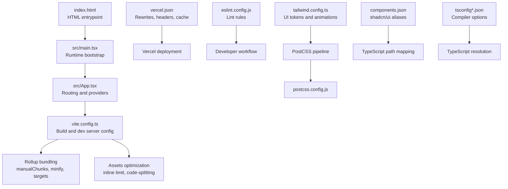
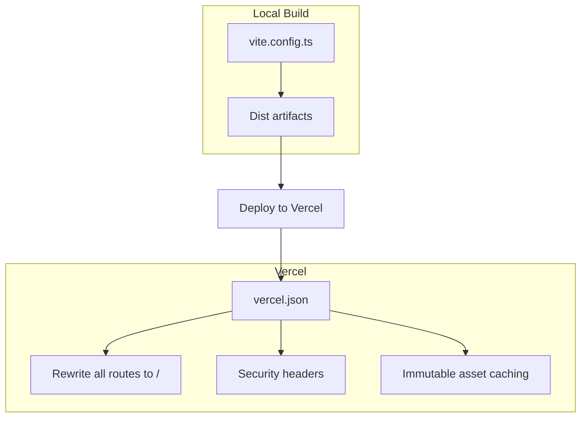
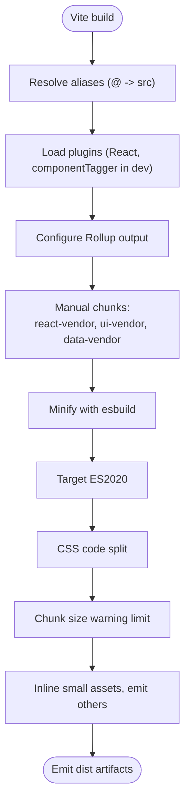
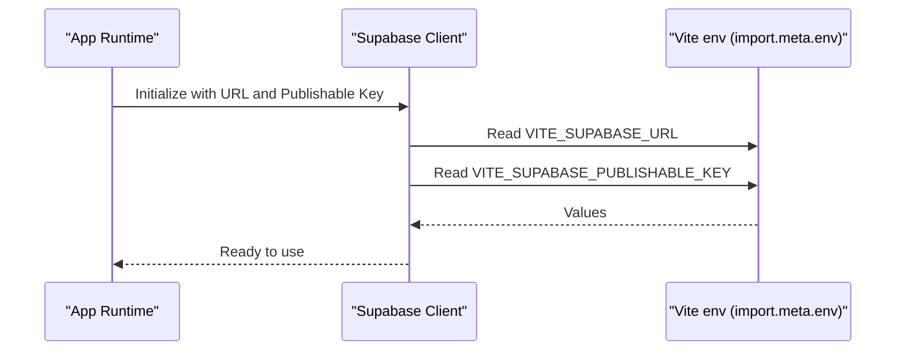
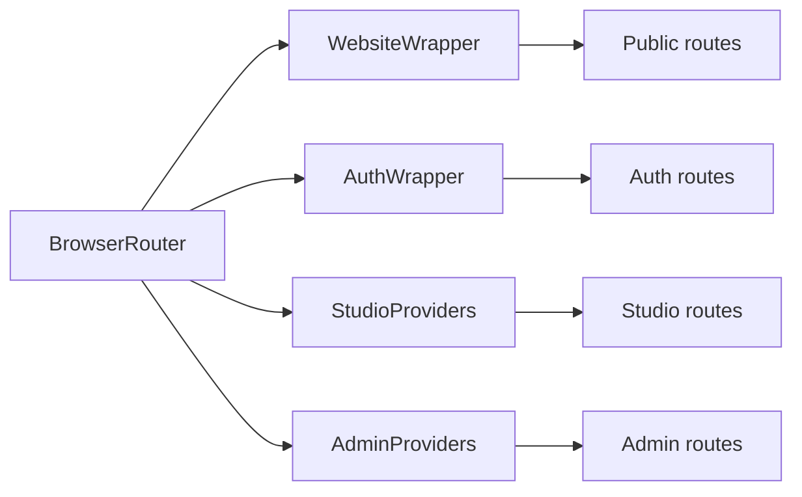
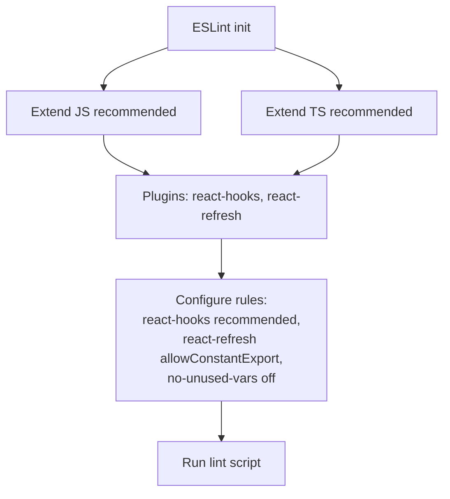
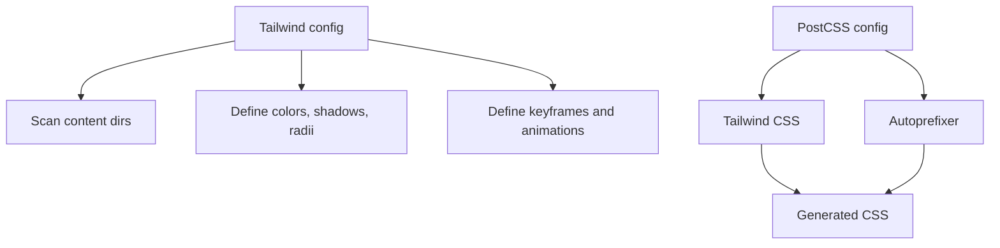
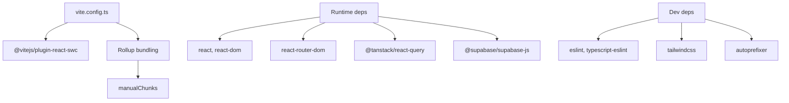

# Deployment & DevOps

<cite>
**Referenced Files in This Document**
- [vite.config.ts](file://vite.config.ts)
- [package.json](file://package.json)
- [vercel.json](file://vercel.json)
- [eslint.config.js](file://eslint.config.js)
- [tailwind.config.ts](file://tailwind.config.ts)
- [postcss.config.js](file://postcss.config.js)
- [components.json](file://components.json)
- [index.html](file://index.html)
- [src/App.tsx](file://src/App.tsx)
- [src/main.tsx](file://src/main.tsx)
- [src/integrations/supabase/client.ts](file://src/integrations/supabase/client.ts)
- [src/integrations/supabase/admin-client.ts](file://src/integrations/supabase/admin-client.ts)
- [tsconfig.json](file://tsconfig.json)
- [tsconfig.app.json](file://tsconfig.app.json)
</cite>

## Table of Contents
1. [Introduction](#introduction)
2. [Project Structure](#project-structure)
3. [Core Components](#core-components)
4. [Architecture Overview](#architecture-overview)
5. [Detailed Component Analysis](#detailed-component-analysis)
6. [Dependency Analysis](#dependency-analysis)
7. [Performance Considerations](#performance-considerations)
8. [Troubleshooting Guide](#troubleshooting-guide)
9. [Conclusion](#conclusion)
10. [Appendices](#appendices)

## Introduction
This document provides comprehensive deployment and DevOps guidance for the project. It covers build configuration with Vite, asset optimization, bundling strategies, deployment via Vercel, environment variable management, CI/CD considerations, development workflow best practices, code quality standards with ESLint, project maintenance, troubleshooting, performance optimization, monitoring strategies, environment setup, testing procedures, and release management.

## Project Structure
The project is a Vite-powered React application with TypeScript, Tailwind CSS, and shadcn/ui components. Build-time configuration is centralized in Vite, while runtime configuration relies on environment variables accessed via Vite’s import.meta.env. The application is deployed to Vercel with security headers and caching policies applied.

**Diagram sources**
- [index.html](file://index.html#L1-L127)
- [src/main.tsx](file://src/main.tsx#L1-L46)
- [src/App.tsx](file://src/App.tsx#L1-L422)
- [vite.config.ts](file://vite.config.ts#L1-L40)
- [vercel.json](file://vercel.json#L1-L24)
- [eslint.config.js](file://eslint.config.js#L1-L27)
- [tailwind.config.ts](file://tailwind.config.ts#L1-L476)
- [postcss.config.js](file://postcss.config.js#L1-L7)
- [components.json](file://components.json#L1-L21)
- [tsconfig.json](file://tsconfig.json#L1-L17)
- [tsconfig.app.json](file://tsconfig.app.json#L1-L31)

**Section sources**
- [index.html](file://index.html#L1-L127)
- [src/main.tsx](file://src/main.tsx#L1-L46)
- [src/App.tsx](file://src/App.tsx#L1-L422)
- [vite.config.ts](file://vite.config.ts#L1-L40)
- [vercel.json](file://vercel.json#L1-L24)
- [eslint.config.js](file://eslint.config.js#L1-L27)
- [tailwind.config.ts](file://tailwind.config.ts#L1-L476)
- [postcss.config.js](file://postcss.config.js#L1-L7)
- [components.json](file://components.json#L1-L21)
- [tsconfig.json](file://tsconfig.json#L1-L17)
- [tsconfig.app.json](file://tsconfig.app.json#L1-L31)

## Core Components
- Build system: Vite with esbuild minification, ES2020 target, CSS code splitting, and manual chunking for vendor bundles.
- Asset optimization: Inline assets under a threshold and long-term caching for immutable assets.
- Routing and providers: Centralized routing with protected routes and provider wrappers for Studio and Admin contexts.
- Environment variables: Supabase client initialization using Vite env variables.
- Code quality: ESLint with TypeScript and React Hooks recommended rules.
- Styling pipeline: Tailwind CSS with PostCSS autoprefixing and animation utilities.

**Section sources**
- [vite.config.ts](file://vite.config.ts#L1-L40)
- [vercel.json](file://vercel.json#L1-L24)
- [src/App.tsx](file://src/App.tsx#L1-L422)
- [src/integrations/supabase/client.ts](file://src/integrations/supabase/client.ts#L1-L17)
- [src/integrations/supabase/admin-client.ts](file://src/integrations/supabase/admin-client.ts#L1-L28)
- [eslint.config.js](file://eslint.config.js#L1-L27)
- [tailwind.config.ts](file://tailwind.config.ts#L1-L476)
- [postcss.config.js](file://postcss.config.js#L1-L7)

## Architecture Overview
The deployment architecture integrates Vite build outputs with Vercel. Vercel applies rewrites to serve the SPA, sets security headers, and caches static assets for optimal performance.

**Diagram sources**
- [vite.config.ts](file://vite.config.ts#L1-L40)
- [vercel.json](file://vercel.json#L1-L24)

**Section sources**
- [vite.config.ts](file://vite.config.ts#L1-L40)
- [vercel.json](file://vercel.json#L1-L24)

## Detailed Component Analysis

### Vite Build Configuration
- Dev server: Host binding to all interfaces, fixed port, and optional component tagger plugin in development.
- Aliasing: Path alias @ resolves to src for concise imports.
- Rollup options: Manual chunking separates React core, UI motion libraries, and data fetching/storage libraries.
- Minification and targets: esbuild minification, ES2020 target, CSS code splitting, and chunk size warning threshold.
- Assets: Inline assets smaller than a configured limit; larger assets emitted as separate chunks.

**Diagram sources**
- [vite.config.ts](file://vite.config.ts#L1-L40)

**Section sources**
- [vite.config.ts](file://vite.config.ts#L1-L40)

### Environment Variable Management
- Supabase clients read Vite environment variables prefixed with VITE_. The Studio and Admin clients use the same base keys but isolate session storage for Admin.
- Ensure environment variables are present in Vercel project settings for production builds.

**Diagram sources**
- [src/integrations/supabase/client.ts](file://src/integrations/supabase/client.ts#L1-L17)
- [src/integrations/supabase/admin-client.ts](file://src/integrations/supabase/admin-client.ts#L1-L28)

**Section sources**
- [src/integrations/supabase/client.ts](file://src/integrations/supabase/client.ts#L1-L17)
- [src/integrations/supabase/admin-client.ts](file://src/integrations/supabase/admin-client.ts#L1-L28)

### Routing and Providers
- Centralized routing with nested providers for Studio and Admin contexts, protected routes, and theme providers.
- Public website routes are wrapped with a theme provider suitable for the marketing site.
- Auth and Studio routes are wrapped with appropriate providers and protected route guards.

**Diagram sources**
- [src/App.tsx](file://src/App.tsx#L1-L422)

**Section sources**
- [src/App.tsx](file://src/App.tsx#L1-L422)

### Code Quality and Linting
- ESLint configuration extends recommended rules for JavaScript and TypeScript, enables React Hooks rules, and includes a refresh plugin.
- Unused variable rule is disabled to reduce noise in a large codebase.

**Diagram sources**
- [eslint.config.js](file://eslint.config.js#L1-L27)

**Section sources**
- [eslint.config.js](file://eslint.config.js#L1-L27)

### Styling Pipeline and Tailwind
- Tailwind scans components and app directories, supports CSS variables for themes, and defines extensive color palettes and animations.
- PostCSS pipeline applies Tailwind and autoprefixer.

**Diagram sources**
- [tailwind.config.ts](file://tailwind.config.ts#L1-L476)
- [postcss.config.js](file://postcss.config.js#L1-L7)

**Section sources**
- [tailwind.config.ts](file://tailwind.config.ts#L1-L476)
- [postcss.config.js](file://postcss.config.js#L1-L7)

### TypeScript Configuration
- Root tsconfig aggregates app and node configs and sets baseUrl and path mapping for @.
- App tsconfig targets ES2020, uses bundler module resolution, JSX transform, and path mapping aligned with Vite.

**Section sources**
- [tsconfig.json](file://tsconfig.json#L1-L17)
- [tsconfig.app.json](file://tsconfig.app.json#L1-L31)

### shadcn/ui Setup
- components.json defines style, TSX usage, Tailwind config path, CSS file, base color, and aliases for components, utils, ui, lib, and hooks.

**Section sources**
- [components.json](file://components.json#L1-L21)

## Dependency Analysis
The build pipeline depends on Vite, React plugin, and Rollup for bundling. Runtime dependencies include React, React Router, TanStack Query, and Supabase. Dev dependencies include ESLint, TypeScript, Tailwind, and PostCSS.

**Diagram sources**
- [vite.config.ts](file://vite.config.ts#L1-L40)
- [package.json](file://package.json#L1-L92)

**Section sources**
- [package.json](file://package.json#L1-L92)
- [vite.config.ts](file://vite.config.ts#L1-L40)

## Performance Considerations
- Bundle size and loading: Manual chunking reduces initial payload; ensure chunk size warnings are monitored during development.
- Asset optimization: Inline small assets to reduce requests; rely on Vercel caching for immutable assets.
- CSS delivery: Enable CSS code splitting to avoid large single CSS bundles.
- Target compatibility: ES2020 target balances modern features with broad browser support.
- Monitoring: Global error listeners in main entry can be extended to integrate with error tracking services.

**Section sources**
- [vite.config.ts](file://vite.config.ts#L1-L40)
- [vercel.json](file://vercel.json#L1-L24)
- [src/main.tsx](file://src/main.tsx#L1-L46)

## Troubleshooting Guide
- Build fails due to missing environment variables:
  - Ensure VITE_SUPABASE_URL and VITE_SUPABASE_PUBLISHABLE_KEY are set in Vercel project settings.
  - Verify environment variable names match those used by the Supabase clients.
- SPA routing issues after deploy:
  - Confirm Vercel rewrite rule serves index.html for all routes.
- Security headers not applied:
  - Validate header entries in vercel.json are correctly formatted.
- Asset caching problems:
  - Check Cache-Control headers for /assets/* paths.
- Lint errors blocking commits:
  - Run the lint script and address rule violations; unused vars are intentionally disabled.

**Section sources**
- [src/integrations/supabase/client.ts](file://src/integrations/supabase/client.ts#L1-L17)
- [src/integrations/supabase/admin-client.ts](file://src/integrations/supabase/admin-client.ts#L1-L28)
- [vercel.json](file://vercel.json#L1-L24)
- [eslint.config.js](file://eslint.config.js#L1-L27)

## Conclusion
The project employs a modern Vite build pipeline with strategic bundling and asset optimization, served securely via Vercel with robust headers and caching. Environment variables are cleanly abstracted for Supabase integration, while ESLint and Tailwind streamline development and styling. Following the outlined DevOps practices ensures reliable deployments, maintainable code, and strong performance.

## Appendices

### Environment Setup
- Install dependencies: Use the package manager commands defined in scripts.
- Local development: Start the Vite dev server on the configured ports.
- Build for production: Emit optimized artifacts for deployment.

**Section sources**
- [package.json](file://package.json#L1-L92)

### Testing Procedures
- Linting: Run the lint script to validate code quality against ESLint rules.
- Preview: Use the preview script to test built artifacts locally before deploying.

**Section sources**
- [package.json](file://package.json#L1-L92)
- [eslint.config.js](file://eslint.config.js#L1-L27)

### Release Management
- Versioning: Maintain semantic versioning in package.json.
- Build artifacts: Tag releases with immutable asset caching via Vercel.
- Rollback: Leverage Vercel’s deployment history to roll back to previous versions if needed.

**Section sources**
- [package.json](file://package.json#L1-L92)
- [vercel.json](file://vercel.json#L1-L24)