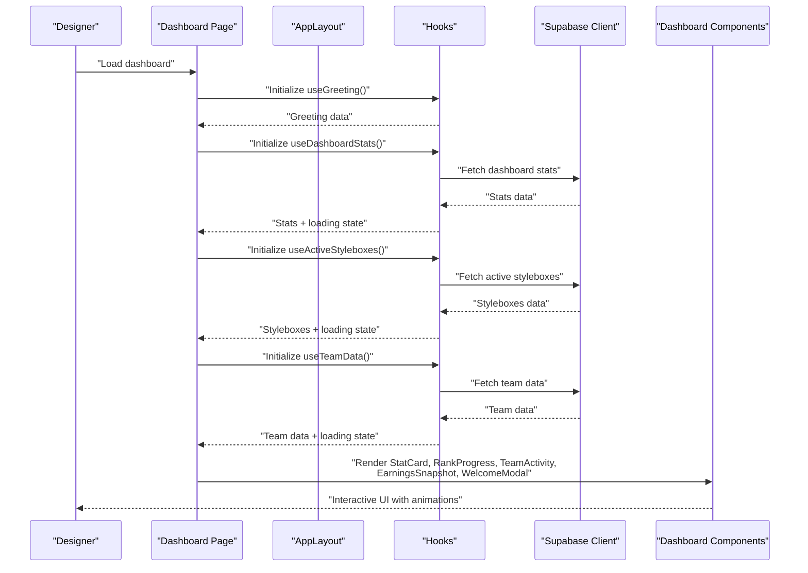
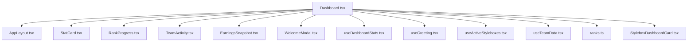

# Dashboard Overview

<cite>
**Referenced Files in This Document**
- [Dashboard.tsx](file://src/pages/Dashboard.tsx)
- [AppLayout.tsx](file://src/components/layout/AppLayout.tsx)
- [StatCard.tsx](file://src/components/dashboard/StatCard.tsx)
- [RankProgress.tsx](file://src/components/dashboard/RankProgress.tsx)
- [TeamActivity.tsx](file://src/components/dashboard/TeamActivity.tsx)
- [EarningsSnapshot.tsx](file://src/components/dashboard/EarningsSnapshot.tsx)
- [WelcomeModal.tsx](file://src/components/WelcomeModal.tsx)
- [useDashboardStats.tsx](file://src/hooks/useDashboardStats.tsx)
- [useGreeting.tsx](file://src/hooks/useGreeting.tsx)
- [useActiveStyleboxes.tsx](file://src/hooks/useActiveStyleboxes.tsx)
- [useTeamData.tsx](file://src/hooks/useTeamData.tsx)
- [ranks.ts](file://src/lib/ranks.ts)
- [StyleboxDashboardCard.tsx](file://src/components/stylebox/StyleboxDashboardCard.tsx)
</cite>

## Table of Contents
1. [Introduction](#introduction)
2. [Project Structure](#project-structure)
3. [Core Components](#core-components)
4. [Architecture Overview](#architecture-overview)
5. [Detailed Component Analysis](#detailed-component-analysis)
6. [Dependency Analysis](#dependency-analysis)
7. [Performance Considerations](#performance-considerations)
8. [Troubleshooting Guide](#troubleshooting-guide)
9. [Conclusion](#conclusion)

## Introduction
This document provides a comprehensive overview of the designer dashboard, focusing on its layout, statistics cards, welcome modal integration, and activity tracking. It explains the greeting system, profile integration, and navigation flows, while detailing the responsive design implementation, animation system using Framer Motion, and real-time data updates. The dashboard also features rank progress visualization, team activity display, and earnings snapshot components. Finally, it outlines the dashboard's role in designer onboarding and engagement optimization.

## Project Structure
The dashboard is implemented as a single-page application routed under the main application layout. It integrates multiple reusable components and hooks to render statistics, rank progress, team activity, earnings snapshots, and recent activity feeds. The page leverages Supabase for real-time data retrieval and Framer Motion for smooth animations.

```mermaid
graph TB
Dashboard["Dashboard Page<br/>src/pages/Dashboard.tsx"] --> Layout["AppLayout<br/>src/components/layout/AppLayout.tsx"]
Dashboard --> StatCard["StatCard<br/>src/components/dashboard/StatCard.tsx"]
Dashboard --> RankProgress["RankProgress<br/>src/components/dashboard/RankProgress.tsx"]
Dashboard --> TeamActivity["TeamActivity<br/>src/components/dashboard/TeamActivity.tsx"]
Dashboard --> EarningsSnapshot["EarningsSnapshot<br/>src/components/dashboard/EarningsSnapshot.tsx"]
Dashboard --> WelcomeModal["WelcomeModal<br/>src/components/WelcomeModal.tsx"]
Dashboard --> HookStats["useDashboardStats<br/>src/hooks/useDashboardStats.tsx"]
Dashboard --> HookGreeting["useGreeting<br/>src/hooks/useGreeting.tsx"]
Dashboard --> HookActiveSB["useActiveStyleboxes<br/>src/hooks/useActiveStyleboxes.tsx"]
Dashboard --> HookTeamData["useTeamData<br/>src/hooks/useTeamData.tsx"]
Dashboard --> LibRanks["ranks library<br/>src/lib/ranks.ts"]
Dashboard --> SBWidget["StyleboxDashboardCard<br/>src/components/stylebox/StyleboxDashboardCard.tsx"]
```

**Diagram sources**
- [Dashboard.tsx](file://src/pages/Dashboard.tsx#L1-L434)
- [AppLayout.tsx](file://src/components/layout/AppLayout.tsx#L1-L153)
- [StatCard.tsx](file://src/components/dashboard/StatCard.tsx#L1-L73)
- [RankProgress.tsx](file://src/components/dashboard/RankProgress.tsx#L1-L204)
- [TeamActivity.tsx](file://src/components/dashboard/TeamActivity.tsx#L1-L97)
- [EarningsSnapshot.tsx](file://src/components/dashboard/EarningsSnapshot.tsx#L1-L83)
- [WelcomeModal.tsx](file://src/components/WelcomeModal.tsx#L1-L112)
- [useDashboardStats.tsx](file://src/hooks/useDashboardStats.tsx#L1-L122)
- [useGreeting.tsx](file://src/hooks/useGreeting.tsx#L1-L99)
- [useActiveStyleboxes.tsx](file://src/hooks/useActiveStyleboxes.tsx#L1-L115)
- [useTeamData.tsx](file://src/hooks/useTeamData.tsx#L1-L129)
- [ranks.ts](file://src/lib/ranks.ts#L1-L246)
- [StyleboxDashboardCard.tsx](file://src/components/stylebox/StyleboxDashboardCard.tsx#L1-L164)

**Section sources**
- [Dashboard.tsx](file://src/pages/Dashboard.tsx#L1-L434)
- [AppLayout.tsx](file://src/components/layout/AppLayout.tsx#L1-L153)

## Core Components
- Dashboard Page: Orchestrates layout, statistics, rank progress, team activity, earnings snapshot, recent activity, and welcome modal integration.
- StatCard: Renders KPI cards with icons, values, subtitles, and optional trend indicators.
- RankProgress: Visualizes designer rank progression, commission, and badges with animated transitions.
- TeamActivity: Displays team information, current project, and team member avatars.
- EarningsSnapshot: Shows monthly earnings, total earnings, pending payouts, and products sold.
- WelcomeModal: Guides first-time users through a multi-step onboarding flow.
- Hooks: useDashboardStats, useGreeting, useActiveStyleboxes, useTeamData provide reactive data and computed values.
- ranks library: Defines rank tiers, progression, commission calculations, and utilities.

**Section sources**
- [Dashboard.tsx](file://src/pages/Dashboard.tsx#L1-L434)
- [StatCard.tsx](file://src/components/dashboard/StatCard.tsx#L1-L73)
- [RankProgress.tsx](file://src/components/dashboard/RankProgress.tsx#L1-L204)
- [TeamActivity.tsx](file://src/components/dashboard/TeamActivity.tsx#L1-L97)
- [EarningsSnapshot.tsx](file://src/components/dashboard/EarningsSnapshot.tsx#L1-L83)
- [WelcomeModal.tsx](file://src/components/WelcomeModal.tsx#L1-L112)
- [useDashboardStats.tsx](file://src/hooks/useDashboardStats.tsx#L1-L122)
- [useGreeting.tsx](file://src/hooks/useGreeting.tsx#L1-L99)
- [useActiveStyleboxes.tsx](file://src/hooks/useActiveStyleboxes.tsx#L1-L115)
- [useTeamData.tsx](file://src/hooks/useTeamData.tsx#L1-L129)
- [ranks.ts](file://src/lib/ranks.ts#L1-L246)

## Architecture Overview
The dashboard follows a modular architecture:
- Page-level orchestration in Dashboard.tsx manages state, effects, and renders child components.
- AppLayout provides global navigation, notifications, and user profile dropdown.
- Hooks encapsulate data fetching and computations, enabling reusability and testability.
- Components are self-contained, styled with Tailwind CSS, and integrated with Framer Motion for animations.

**Diagram sources**
- [Dashboard.tsx](file://src/pages/Dashboard.tsx#L1-L434)
- [AppLayout.tsx](file://src/components/layout/AppLayout.tsx#L1-L153)
- [useDashboardStats.tsx](file://src/hooks/useDashboardStats.tsx#L1-L122)
- [useActiveStyleboxes.tsx](file://src/hooks/useActiveStyleboxes.tsx#L1-L115)
- [useTeamData.tsx](file://src/hooks/useTeamData.tsx#L1-L129)

## Detailed Component Analysis

### Dashboard Page
The dashboard page composes the entire overview:
- Layout integration via AppLayout for consistent navigation and user controls.
- Responsive grid layout with statistics cards, active styleboxes, recent activity, rank progress, team activity, and earnings snapshot.
- Framer Motion animations for staggered entrance and interactive hover states.
- Real-time data integration through hooks and Supabase queries.
- Welcome modal for first-time users with guided onboarding.

Key behaviors:
- Greeting computation using useGreeting with time-based, holiday, and anniversary logic.
- Recent activity feed built from stylebox submissions with relative timestamps.
- Rank data derived from profile and ranks library for accurate progression visualization.
- Navigation to styleboxes, teams, and walkthroughs based on user actions.

**Section sources**
- [Dashboard.tsx](file://src/pages/Dashboard.tsx#L1-L434)
- [useGreeting.tsx](file://src/hooks/useGreeting.tsx#L1-L99)
- [ranks.ts](file://src/lib/ranks.ts#L1-L246)

### Statistics Cards (StatCard)
Purpose:
- Present key metrics in an accessible, visually distinct card format.

Features:
- Icon placement with hover effects and color transitions.
- Optional trend indicator with directional arrow and percentage change.
- Accessible labeling and roles for screen readers.

Responsive design:
- Grid layout adapts from 1 column on small screens to 4 columns on extra-large screens.

Accessibility:
- Proper ARIA roles and labels for article and region semantics.

**Section sources**
- [StatCard.tsx](file://src/components/dashboard/StatCard.tsx#L1-L73)

### Rank Progress Visualization (RankProgress)
Purpose:
- Visualize designer rank progression, commission rate, and badges.

Key elements:
- Rank display with dynamic styling based on rank tier.
- Commission calculation incorporating foundation rank bonuses.
- Progress bar showing advancement toward the next rank.
- Foundation badge highlighting lifetime bonuses.
- Animated transitions for SC display and progress updates.

Integration:
- Uses ranks library for rank definitions, progression, and commission calculations.

**Section sources**
- [RankProgress.tsx](file://src/components/dashboard/RankProgress.tsx#L1-L204)
- [ranks.ts](file://src/lib/ranks.ts#L1-L246)

### Team Activity Display (TeamActivity)
Purpose:
- Show team context, current project, and team member avatars.

Highlights:
- Unread message badge with pulse animation.
- Hover interactions on avatars and interactive elements.
- Clear CTAs to open team spaces.

**Section sources**
- [TeamActivity.tsx](file://src/components/dashboard/TeamActivity.tsx#L1-L97)

### Earnings Snapshot (EarningsSnapshot)
Purpose:
- Summarize financial highlights for quick review.

Components:
- Monthly earnings with trend indicator.
- Total earnings and pending payouts.
- Products sold count.
- Call-to-action to view analytics.

**Section sources**
- [EarningsSnapshot.tsx](file://src/components/dashboard/EarningsSnapshot.tsx#L1-L83)

### Welcome Modal Integration (WelcomeModal)
Purpose:
- Guide first-time users through a multi-step onboarding process.

Flow:
- Step-by-step presentation with icons, titles, and descriptions.
- Navigation between steps and skip option on the first step.
- Automatic redirect to walkthroughs upon completion.

**Section sources**
- [WelcomeModal.tsx](file://src/components/WelcomeModal.tsx#L1-L112)

### Greeting System (useGreeting)
Purpose:
- Provide contextual, time-aware greetings with special occasions.

Logic:
- First-login greeting with onboarding prompt.
- Seasonal greetings for New Year and Christmas.
- Anniversary celebration when joining date matches current date across years.
- Regular time-based greeting with rotating motivational subtitles.

**Section sources**
- [useGreeting.tsx](file://src/hooks/useGreeting.tsx#L1-L99)

### Profile Integration
- Dashboard retrieves profile data for greeting, rank display, and navigation.
- Avatar fallback initials and user menu provide quick access to profile, settings, and subscription.

**Section sources**
- [Dashboard.tsx](file://src/pages/Dashboard.tsx#L1-L434)
- [AppLayout.tsx](file://src/components/layout/AppLayout.tsx#L1-L153)

### Navigation Flows
- Explore Styleboxes and View All buttons navigate to relevant sections.
- Team Activity and Founding Designers Program banners link to team and application pages.
- User menu provides access to profile, settings, subscription, and sign out.

**Section sources**
- [Dashboard.tsx](file://src/pages/Dashboard.tsx#L1-L434)
- [AppLayout.tsx](file://src/components/layout/AppLayout.tsx#L1-L153)

### Responsive Design Implementation
- Grid layouts adapt across breakpoints: 1 column (small), 2 columns (medium), 4 columns (extra-large) for statistics.
- Card-based components scale padding and typography for readability.
- Sidebar and header remain responsive with mobile-friendly toggles and search.

**Section sources**
- [Dashboard.tsx](file://src/pages/Dashboard.tsx#L1-L434)
- [AppLayout.tsx](file://src/components/layout/AppLayout.tsx#L1-L153)

### Animation System Using Framer Motion
- Staggered entrance animations for dashboard sections using container and item variants.
- Animated progress bars and SC display transitions.
- Hover effects on cards and buttons for enhanced interactivity.

**Section sources**
- [Dashboard.tsx](file://src/pages/Dashboard.tsx#L1-L434)
- [RankProgress.tsx](file://src/components/dashboard/RankProgress.tsx#L1-L204)

### Real-Time Data Updates
- useDashboardStats aggregates counts and earnings from Supabase.
- useActiveStyleboxes fetches active submissions and computes progress.
- useTeamData resolves team membership and related metadata.
- Recent activity feed dynamically builds from stylebox submissions.

**Section sources**
- [useDashboardStats.tsx](file://src/hooks/useDashboardStats.tsx#L1-L122)
- [useActiveStyleboxes.tsx](file://src/hooks/useActiveStyleboxes.tsx#L1-L115)
- [useTeamData.tsx](file://src/hooks/useTeamData.tsx#L1-L129)
- [Dashboard.tsx](file://src/pages/Dashboard.tsx#L1-L434)

### Rank Progress Visualization Details
- Calculates effective commission considering foundation rank bonuses.
- Computes progress percentage between current and next rank thresholds.
- Formats SC values and displays badges.

**Section sources**
- [RankProgress.tsx](file://src/components/dashboard/RankProgress.tsx#L1-L204)
- [ranks.ts](file://src/lib/ranks.ts#L1-L246)

### Team Activity Display Details
- Displays active team name and current project.
- Shows team member avatars with fallback initials.
- Provides CTA to open team space.

**Section sources**
- [TeamActivity.tsx](file://src/components/dashboard/TeamActivity.tsx#L1-L97)

### Earnings Snapshot Details
- Monthly earnings with trend percentage.
- Running totals for total earnings and pending payouts.
- Products sold aggregation.

**Section sources**
- [EarningsSnapshot.tsx](file://src/components/dashboard/EarningsSnapshot.tsx#L1-L83)

### Activity Tracking
- Builds recent activity from stylebox submissions with action, project, and relative time.
- Supports pending, approved, and rejected statuses with appropriate badges.

**Section sources**
- [Dashboard.tsx](file://src/pages/Dashboard.tsx#L1-L434)

### Active Styleboxes Widget
- Displays submitted styleboxes with progress rings and countdown timers.
- Integrates with stylebox dashboard cards for unified UX.

**Section sources**
- [StyleboxDashboardCard.tsx](file://src/components/stylebox/StyleboxDashboardCard.tsx#L1-L164)

## Dependency Analysis
The dashboard exhibits strong modularity with clear separation of concerns:
- Dashboard.tsx depends on AppLayout, multiple dashboard components, hooks, and the ranks library.
- Hooks encapsulate data fetching and reduce coupling to Supabase.
- Components are decoupled and reusable across pages.

**Diagram sources**
- [Dashboard.tsx](file://src/pages/Dashboard.tsx#L1-L434)
- [AppLayout.tsx](file://src/components/layout/AppLayout.tsx#L1-L153)
- [StatCard.tsx](file://src/components/dashboard/StatCard.tsx#L1-L73)
- [RankProgress.tsx](file://src/components/dashboard/RankProgress.tsx#L1-L204)
- [TeamActivity.tsx](file://src/components/dashboard/TeamActivity.tsx#L1-L97)
- [EarningsSnapshot.tsx](file://src/components/dashboard/EarningsSnapshot.tsx#L1-L83)
- [WelcomeModal.tsx](file://src/components/WelcomeModal.tsx#L1-L112)
- [useDashboardStats.tsx](file://src/hooks/useDashboardStats.tsx#L1-L122)
- [useGreeting.tsx](file://src/hooks/useGreeting.tsx#L1-L99)
- [useActiveStyleboxes.tsx](file://src/hooks/useActiveStyleboxes.tsx#L1-L115)
- [useTeamData.tsx](file://src/hooks/useTeamData.tsx#L1-L129)
- [ranks.ts](file://src/lib/ranks.ts#L1-L246)
- [StyleboxDashboardCard.tsx](file://src/components/stylebox/StyleboxDashboardCard.tsx#L1-L164)

**Section sources**
- [Dashboard.tsx](file://src/pages/Dashboard.tsx#L1-L434)

## Performance Considerations
- Lazy loading and skeleton loaders improve perceived performance during data fetches.
- Efficient grid layouts minimize layout thrashing on resize.
- Animations are scoped to enhance UX without impacting core rendering performance.
- Hooks centralize data fetching to avoid redundant requests.

## Troubleshooting Guide
Common issues and resolutions:
- Missing profile data: Ensure profile is loaded before rendering greeting and rank progress.
- Empty activity feed: Verify user ID and stylebox submissions exist in Supabase.
- Team data not appearing: Confirm team membership records and team existence in Supabase.
- Rank progress anomalies: Validate rank definitions and SC thresholds in the ranks library.

**Section sources**
- [Dashboard.tsx](file://src/pages/Dashboard.tsx#L1-L434)
- [useDashboardStats.tsx](file://src/hooks/useDashboardStats.tsx#L1-L122)
- [useTeamData.tsx](file://src/hooks/useTeamData.tsx#L1-L129)
- [ranks.ts](file://src/lib/ranks.ts#L1-L246)

## Conclusion
The designer dashboard provides a comprehensive, engaging, and responsive overview of a designer's activity, progress, and earnings. Through thoughtful integration of hooks, components, animations, and onboarding flows, it optimizes engagement and accelerates designer onboarding. The modular architecture ensures maintainability and scalability for future enhancements.