# Designer Studio Features

<cite>
**Referenced Files in This Document**
- [README.md](file://README.md)
- [Dashboard.tsx](file://src/pages/Dashboard.tsx)
- [Styleboxes.tsx](file://src/pages/Styleboxes.tsx)
- [Portfolio.tsx](file://src/pages/Portfolio.tsx)
- [Profile.tsx](file://src/pages/Profile.tsx)
- [useDashboardStats.tsx](file://src/hooks/useDashboardStats.tsx)
- [useActiveStyleboxes.tsx](file://src/hooks/useActiveStyleboxes.tsx)
- [usePortfolioData.tsx](file://src/hooks/usePortfolioData.tsx)
- [useProfile.tsx](file://src/hooks/useProfile.tsx)
- [StyleboxDashboardCard.tsx](file://src/components/stylebox/StyleboxDashboardCard.tsx)
- [StatCard.tsx](file://src/components/dashboard/StatCard.tsx)
- [RankProgress.tsx](file://src/components/dashboard/RankProgress.tsx)
- [TeamActivity.tsx](file://src/components/dashboard/TeamActivity.tsx)
- [EarningsSnapshot.tsx](file://src/components/dashboard/EarningsSnapshot.tsx)
- [stylebox-content.ts](file://src/lib/stylebox-content.ts)
</cite>

## Table of Contents
1. [Introduction](#introduction)
2. [Project Structure](#project-structure)
3. [Core Components](#core-components)
4. [Architecture Overview](#architecture-overview)
5. [Detailed Component Analysis](#detailed-component-analysis)
6. [Dependency Analysis](#dependency-analysis)
7. [Performance Considerations](#performance-considerations)
8. [Troubleshooting Guide](#troubleshooting-guide)
9. [Conclusion](#conclusion)
10. [Appendices](#appendices)

## Introduction
This document explains the Designer Studio features of the Adorzia platform, focusing on the dashboard, Stylebox challenge system, portfolio management, analytics and insights, and profile management. It also outlines the end-to-end designer workflow from registration to active participation in challenges, submission and evaluation processes, progress tracking, rewards, team collaboration, and skill development pathways. Guidance is included for onboarding, support resources, and engagement optimization.

## Project Structure
The Designer Studio spans pages, hooks, components, and shared libraries:
- Pages: Dashboard, Styleboxes, Portfolio, Profile
- Hooks: useDashboardStats, useActiveStyleboxes, usePortfolioData, useProfile
- Components: dashboard widgets, Stylebox cards, and profile sections
- Libraries: stylebox-content for curated challenge templates

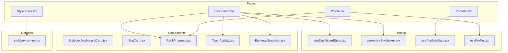

**Diagram sources**
- [Dashboard.tsx](file://src/pages/Dashboard.tsx#L29-L434)
- [Styleboxes.tsx](file://src/pages/Styleboxes.tsx#L24-L393)
- [Portfolio.tsx](file://src/pages/Portfolio.tsx#L33-L268)
- [Profile.tsx](file://src/pages/Profile.tsx#L39-L449)
- [useDashboardStats.tsx](file://src/hooks/useDashboardStats.tsx#L15-L122)
- [useActiveStyleboxes.tsx](file://src/hooks/useActiveStyleboxes.tsx#L30-L115)
- [usePortfolioData.tsx](file://src/hooks/usePortfolioData.tsx#L31-L117)
- [useProfile.tsx](file://src/hooks/useProfile.tsx#L13-L154)
- [StyleboxDashboardCard.tsx](file://src/components/stylebox/StyleboxDashboardCard.tsx#L31-L164)
- [StatCard.tsx](file://src/components/dashboard/StatCard.tsx#L17-L73)
- [RankProgress.tsx](file://src/components/dashboard/RankProgress.tsx#L71-L204)
- [TeamActivity.tsx](file://src/components/dashboard/TeamActivity.tsx#L20-L97)
- [EarningsSnapshot.tsx](file://src/components/dashboard/EarningsSnapshot.tsx#L13-L83)
- [stylebox-content.ts](file://src/lib/stylebox-content.ts#L1-L926)

**Section sources**
- [Dashboard.tsx](file://src/pages/Dashboard.tsx#L29-L434)
- [Styleboxes.tsx](file://src/pages/Styleboxes.tsx#L24-L393)
- [Portfolio.tsx](file://src/pages/Portfolio.tsx#L33-L268)
- [Profile.tsx](file://src/pages/Profile.tsx#L39-L449)

## Core Components
- Dashboard: Aggregates designer stats, active Styleboxes, recent activity, rank progress, team activity, and earnings snapshot.
- Styleboxes Catalog: Discovery, filtering, sorting, and entry into Stylebox challenges.
- Portfolio: Project curation, collections, publishing pipeline, and export capabilities.
- Profile: Personal stats, rank progression, achievements, skills, and marketplace presence.
- Hooks: Centralized data fetching and transformations for dashboard, active Styleboxes, portfolio, and profile.
- Components: Reusable widgets for stats, rank progress, team activity, earnings, and Stylebox cards.

**Section sources**
- [Dashboard.tsx](file://src/pages/Dashboard.tsx#L133-L417)
- [Styleboxes.tsx](file://src/pages/Styleboxes.tsx#L103-L293)
- [Portfolio.tsx](file://src/pages/Portfolio.tsx#L55-L267)
- [Profile.tsx](file://src/pages/Profile.tsx#L176-L448)
- [useDashboardStats.tsx](file://src/hooks/useDashboardStats.tsx#L15-L122)
- [useActiveStyleboxes.tsx](file://src/hooks/useActiveStyleboxes.tsx#L30-L115)
- [usePortfolioData.tsx](file://src/hooks/usePortfolioData.tsx#L31-L117)
- [useProfile.tsx](file://src/hooks/useProfile.tsx#L13-L154)
- [StatCard.tsx](file://src/components/dashboard/StatCard.tsx#L17-L73)
- [RankProgress.tsx](file://src/components/dashboard/RankProgress.tsx#L71-L204)
- [TeamActivity.tsx](file://src/components/dashboard/TeamActivity.tsx#L20-L97)
- [EarningsSnapshot.tsx](file://src/components/dashboard/EarningsSnapshot.tsx#L13-L83)
- [StyleboxDashboardCard.tsx](file://src/components/stylebox/StyleboxDashboardCard.tsx#L31-L164)

## Architecture Overview
The Designer Studio follows a modular React architecture with:
- Page-level orchestration for rendering designer-centric views
- Hook-driven data fetching and caching
- Component composition for reusable UI widgets
- Shared libraries for curated Stylebox content and ranking logic

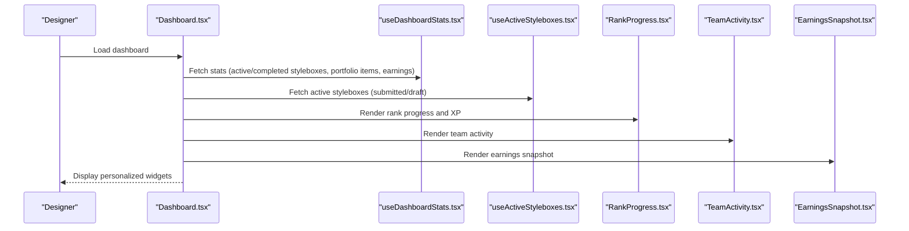

**Diagram sources**
- [Dashboard.tsx](file://src/pages/Dashboard.tsx#L29-L434)
- [useDashboardStats.tsx](file://src/hooks/useDashboardStats.tsx#L15-L122)
- [useActiveStyleboxes.tsx](file://src/hooks/useActiveStyleboxes.tsx#L30-L115)
- [RankProgress.tsx](file://src/components/dashboard/RankProgress.tsx#L71-L204)
- [TeamActivity.tsx](file://src/components/dashboard/TeamActivity.tsx#L20-L97)
- [EarningsSnapshot.tsx](file://src/components/dashboard/EarningsSnapshot.tsx#L13-L83)

## Detailed Component Analysis

### Dashboard Implementation
The dashboard aggregates key metrics and widgets:
- Stats grid: Active Styleboxes, Completed this year, Portfolio items, Monthly Earnings
- Founding Designers banner
- Active Styleboxes grid with progress and deadlines
- Recent activity feed
- Rank progress widget
- Team activity widget
- Earnings snapshot

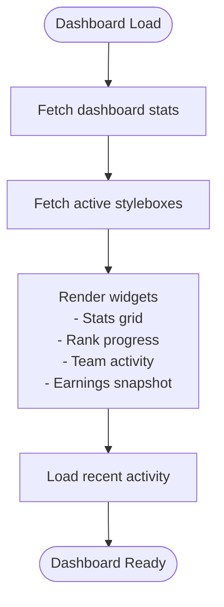

**Diagram sources**
- [Dashboard.tsx](file://src/pages/Dashboard.tsx#L29-L434)
- [useDashboardStats.tsx](file://src/hooks/useDashboardStats.tsx#L15-L122)
- [useActiveStyleboxes.tsx](file://src/hooks/useActiveStyleboxes.tsx#L30-L115)
- [StatCard.tsx](file://src/components/dashboard/StatCard.tsx#L17-L73)
- [RankProgress.tsx](file://src/components/dashboard/RankProgress.tsx#L71-L204)
- [TeamActivity.tsx](file://src/components/dashboard/TeamActivity.tsx#L20-L97)
- [EarningsSnapshot.tsx](file://src/components/dashboard/EarningsSnapshot.tsx#L13-L83)

**Section sources**
- [Dashboard.tsx](file://src/pages/Dashboard.tsx#L133-L417)
- [StatCard.tsx](file://src/components/dashboard/StatCard.tsx#L17-L73)
- [RankProgress.tsx](file://src/components/dashboard/RankProgress.tsx#L71-L204)
- [TeamActivity.tsx](file://src/components/dashboard/TeamActivity.tsx#L20-L97)
- [EarningsSnapshot.tsx](file://src/components/dashboard/EarningsSnapshot.tsx#L13-L83)

### Stylebox Challenge System
The Stylebox system provides a structured pathway for designers to participate in themed challenges:
- Discovery and filtering: search, category, difficulty, level, sort by newest/deadline/sc reward/level
- Featured challenge banner
- Library cards with level badges, season tags, difficulty badges, SC reward, countdown timers, and team indicators
- Detailed entry flow to challenge workspace

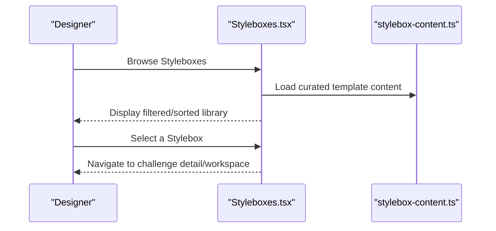

**Diagram sources**
- [Styleboxes.tsx](file://src/pages/Styleboxes.tsx#L24-L393)
- [stylebox-content.ts](file://src/lib/stylebox-content.ts#L1-L926)

**Section sources**
- [Styleboxes.tsx](file://src/pages/Styleboxes.tsx#L24-L393)
- [stylebox-content.ts](file://src/lib/stylebox-content.ts#L1-L926)

### Portfolio Management
Portfolio enables designers to manage and publish their work:
- Project grid with categorization and status
- Collections view by category
- Publishing pipeline (request publish)
- Stats: total projects, published, in pipeline, collections
- Upload modal for adding new projects

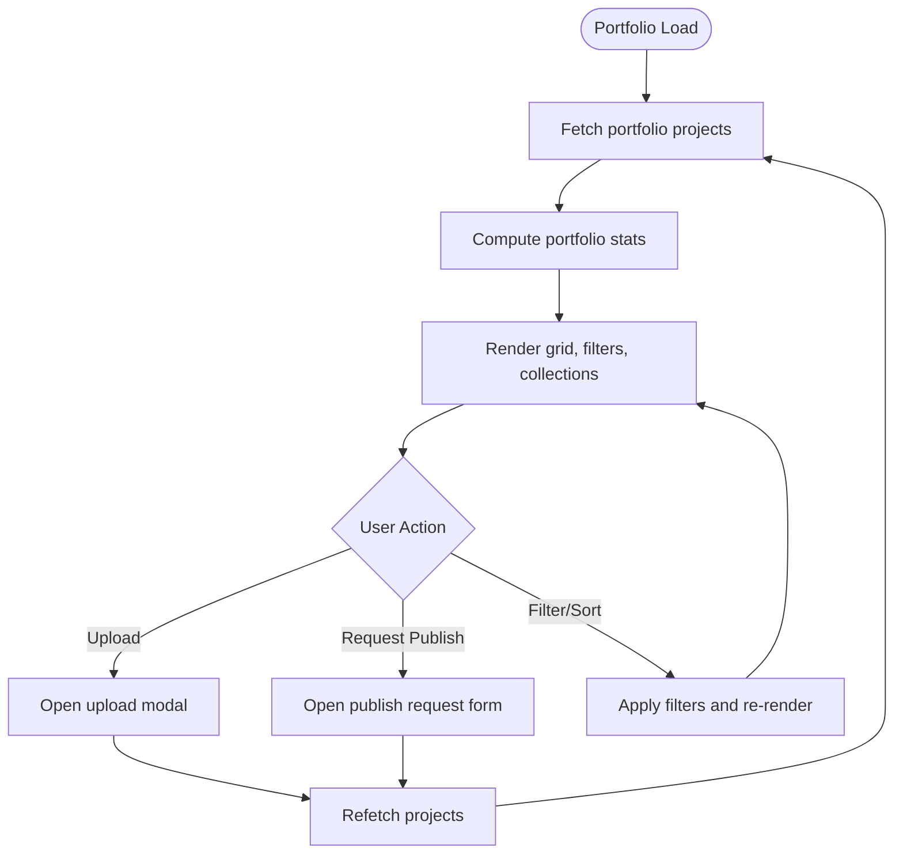

**Diagram sources**
- [Portfolio.tsx](file://src/pages/Portfolio.tsx#L33-L268)
- [usePortfolioData.tsx](file://src/hooks/usePortfolioData.tsx#L31-L117)

**Section sources**
- [Portfolio.tsx](file://src/pages/Portfolio.tsx#L33-L268)
- [usePortfolioData.tsx](file://src/hooks/usePortfolioData.tsx#L31-L117)

### Analytics & Insights
The dashboard’s analytics widgets provide:
- Stats grid with icons and trends
- Earnings snapshot with monthly totals, pending payouts, and products sold
- Rank progress with commission and XP thresholds

```mermaid
classDiagram
class StatCard {
+title : string
+value : string|number
+subtitle : string
+icon : LucideIcon
+trend : {value : number, isPositive : boolean}
}
class EarningsSnapshot {
+totalEarnings : number
+monthlyEarnings : number
+pendingPayouts : number
+productsSold : number
+trend : number
}
class RankProgress {
+currentRank : RankTier
+foundationRank : "f1"|"f2"|null
+styleCredits : number
+badges : array
}
StatCard <.. Dashboard : "used by"
EarningsSnapshot <.. Dashboard : "used by"
RankProgress <.. Dashboard : "used by"
```

**Diagram sources**
- [StatCard.tsx](file://src/components/dashboard/StatCard.tsx#L17-L73)
- [EarningsSnapshot.tsx](file://src/components/dashboard/EarningsSnapshot.tsx#L13-L83)
- [RankProgress.tsx](file://src/components/dashboard/RankProgress.tsx#L71-L204)
- [Dashboard.tsx](file://src/pages/Dashboard.tsx#L180-L225)

**Section sources**
- [StatCard.tsx](file://src/components/dashboard/StatCard.tsx#L17-L73)
- [EarningsSnapshot.tsx](file://src/components/dashboard/EarningsSnapshot.tsx#L13-L83)
- [RankProgress.tsx](file://src/components/dashboard/RankProgress.tsx#L71-L204)
- [Dashboard.tsx](file://src/pages/Dashboard.tsx#L180-L225)

### Profile Management
Profile consolidates personal stats, rank, achievements, skills, and marketplace readiness:
- Header with avatar, rank badge, revenue share
- Stats row: Styleboxes, XP Points, Day Streak, Achievements, Products Sold
- Tabs: Overview, Achievements, Skills, Marketplace
- Rank overview and progress visualization

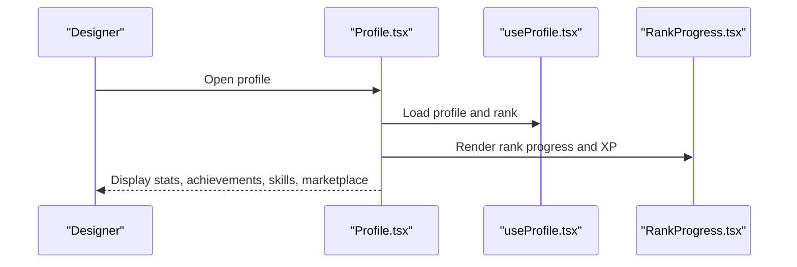

**Diagram sources**
- [Profile.tsx](file://src/pages/Profile.tsx#L39-L449)
- [useProfile.tsx](file://src/hooks/useProfile.tsx#L13-L154)
- [RankProgress.tsx](file://src/components/dashboard/RankProgress.tsx#L71-L204)

**Section sources**
- [Profile.tsx](file://src/pages/Profile.tsx#L39-L449)
- [useProfile.tsx](file://src/hooks/useProfile.tsx#L13-L154)
- [RankProgress.tsx](file://src/components/dashboard/RankProgress.tsx#L71-L204)

### Designer Workflow: From Registration to Participation
End-to-end workflow:
1. Registration and first-login completion
2. Onboarding via welcome modal and profile creation
3. Explore Styleboxes and choose a challenge
4. Work through deliverables and submit entries
5. Track progress and receive feedback
6. Build portfolio and request publication
7. Advance rank and unlock rewards

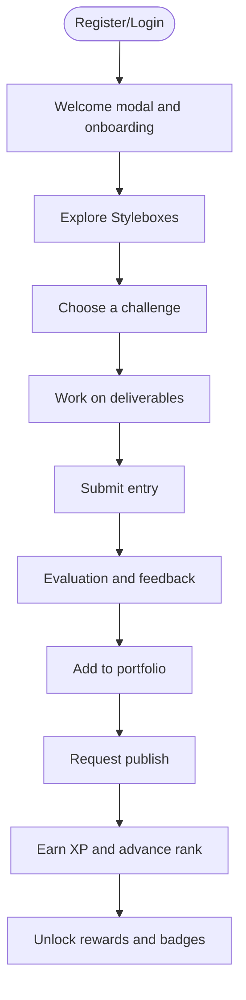

[No sources needed since this diagram shows conceptual workflow, not actual code structure]

### Submission Process, Evaluation Criteria, and Progress Tracking
- Submission flow: Challenge workspace → deliverables checklist → submission confirmation modal
- Progress tracking: Dashboard cards display progress percentage and deadlines
- Evaluation: Submissions are reviewed and status updates (approved/rejected/pending) appear in recent activity
- Rewards: Stylebox XP rewards and rank progression

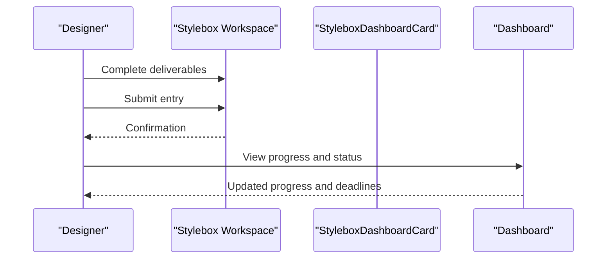

**Diagram sources**
- [StyleboxDashboardCard.tsx](file://src/components/stylebox/StyleboxDashboardCard.tsx#L31-L164)
- [Dashboard.tsx](file://src/pages/Dashboard.tsx#L29-L434)

**Section sources**
- [StyleboxDashboardCard.tsx](file://src/components/stylebox/StyleboxDashboardCard.tsx#L31-L164)
- [Dashboard.tsx](file://src/pages/Dashboard.tsx#L29-L434)

### Team Collaboration Features
- Team activity widget displays active team, current project, and member avatars
- Team challenges are indicated in Stylebox listings
- Messaging notifications and team space access

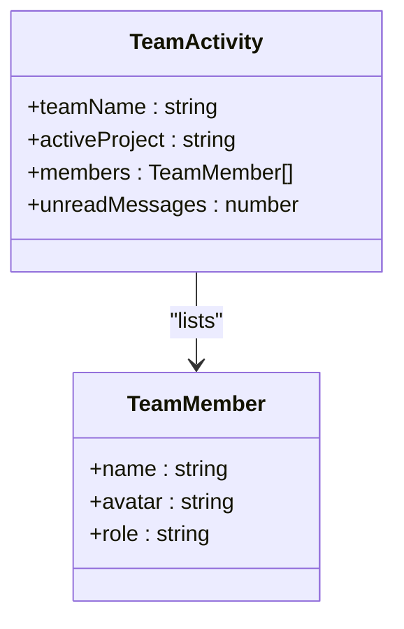

**Diagram sources**
- [TeamActivity.tsx](file://src/components/dashboard/TeamActivity.tsx#L20-L97)

**Section sources**
- [TeamActivity.tsx](file://src/components/dashboard/TeamActivity.tsx#L20-L97)
- [Styleboxes.tsx](file://src/pages/Styleboxes.tsx#L331-L333)

### Challenge Participation Mechanics and Skill Development Pathways
- Difficulty and level progression drive challenge selection and unlocks
- Seasonal themes and studio curations provide variety
- Skill badges and XP accumulation support progression
- Founding Designers Program offers premium collaboration and revenue sharing

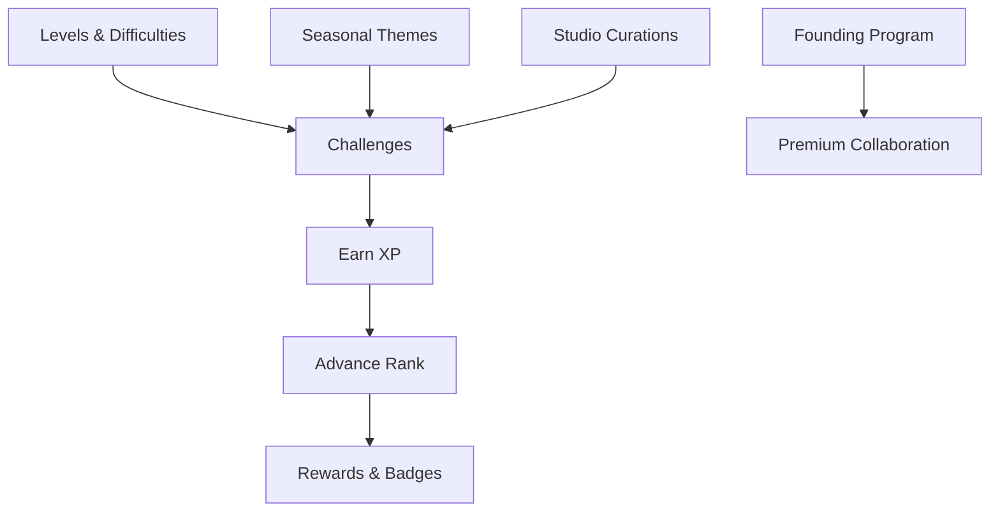

**Diagram sources**
- [Styleboxes.tsx](file://src/pages/Styleboxes.tsx#L24-L393)
- [RankProgress.tsx](file://src/components/dashboard/RankProgress.tsx#L71-L204)
- [Dashboard.tsx](file://src/pages/Dashboard.tsx#L229-L261)

**Section sources**
- [Styleboxes.tsx](file://src/pages/Styleboxes.tsx#L24-L393)
- [RankProgress.tsx](file://src/components/dashboard/RankProgress.tsx#L71-L204)
- [Dashboard.tsx](file://src/pages/Dashboard.tsx#L229-L261)

### Designer Onboarding, Support Resources, and Engagement Optimization
- First-login welcome modal and onboarding flow
- Profile creation and editing
- Achievement system and skill visualization
- Engagement through recent activity, team messaging, and earnings trends

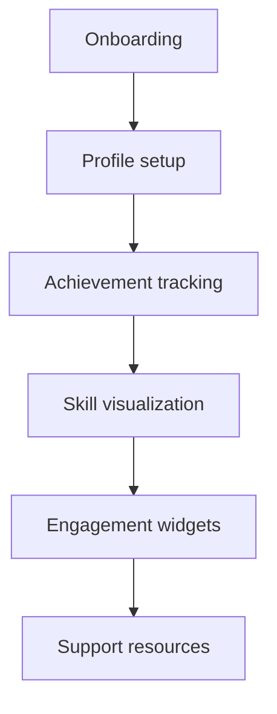

**Diagram sources**
- [Dashboard.tsx](file://src/pages/Dashboard.tsx#L46-L56)
- [Profile.tsx](file://src/pages/Profile.tsx#L221-L225)
- [Profile.tsx](file://src/pages/Profile.tsx#L362-L403)
- [Profile.tsx](file://src/pages/Profile.tsx#L406-L422)

**Section sources**
- [Dashboard.tsx](file://src/pages/Dashboard.tsx#L46-L56)
- [Profile.tsx](file://src/pages/Profile.tsx#L221-L225)
- [Profile.tsx](file://src/pages/Profile.tsx#L362-L403)
- [Profile.tsx](file://src/pages/Profile.tsx#L406-L422)

## Dependency Analysis
The Designer Studio components depend on:
- Supabase client for data fetching
- TanStack Query for caching and refetching
- Framer Motion for animations
- Local ranking and style-credit utilities

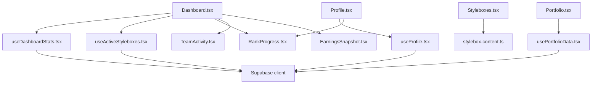

**Diagram sources**
- [Dashboard.tsx](file://src/pages/Dashboard.tsx#L29-L434)
- [Styleboxes.tsx](file://src/pages/Styleboxes.tsx#L24-L393)
- [Portfolio.tsx](file://src/pages/Portfolio.tsx#L33-L268)
- [Profile.tsx](file://src/pages/Profile.tsx#L39-L449)
- [useDashboardStats.tsx](file://src/hooks/useDashboardStats.tsx#L15-L122)
- [useActiveStyleboxes.tsx](file://src/hooks/useActiveStyleboxes.tsx#L30-L115)
- [usePortfolioData.tsx](file://src/hooks/usePortfolioData.tsx#L31-L117)
- [useProfile.tsx](file://src/hooks/useProfile.tsx#L13-L154)
- [stylebox-content.ts](file://src/lib/stylebox-content.ts#L1-L926)

**Section sources**
- [Dashboard.tsx](file://src/pages/Dashboard.tsx#L29-L434)
- [Styleboxes.tsx](file://src/pages/Styleboxes.tsx#L24-L393)
- [Portfolio.tsx](file://src/pages/Portfolio.tsx#L33-L268)
- [Profile.tsx](file://src/pages/Profile.tsx#L39-L449)

## Performance Considerations
- Use TanStack Query for efficient caching and background refetching
- Lazy-load images and avoid unnecessary re-renders with memoization
- Debounce search inputs and filter operations
- Paginate or virtualize long lists (portfolio and activity feeds)
- Optimize dashboard widget rendering with skeleton loaders during initial load

[No sources needed since this section provides general guidance]

## Troubleshooting Guide
Common issues and remedies:
- Dashboard stats not loading: Verify authentication state and network connectivity; check hook error states
- Active Styleboxes empty: Confirm submission statuses and database records
- Portfolio data missing: Ensure portfolio and publication records exist for the user
- Profile not updating: Validate field names and conflict handling in upsert operations

**Section sources**
- [useDashboardStats.tsx](file://src/hooks/useDashboardStats.tsx#L15-L122)
- [useActiveStyleboxes.tsx](file://src/hooks/useActiveStyleboxes.tsx#L30-L115)
- [usePortfolioData.tsx](file://src/hooks/usePortfolioData.tsx#L31-L117)
- [useProfile.tsx](file://src/hooks/useProfile.tsx#L95-L154)

## Conclusion
The Designer Studio integrates discovery, participation, progress tracking, and growth pathways into a cohesive experience. The dashboard centralizes insights, while the Stylebox system and portfolio management enable structured skill-building and publication. Hooks and components promote maintainability and scalability, and the ranking system incentivizes continued engagement.

[No sources needed since this section summarizes without analyzing specific files]

## Appendices
- Getting started: Follow the project setup steps in the repository README to run the development server and explore the Designer Studio features.

**Section sources**
- [README.md](file://README.md#L23-L36)