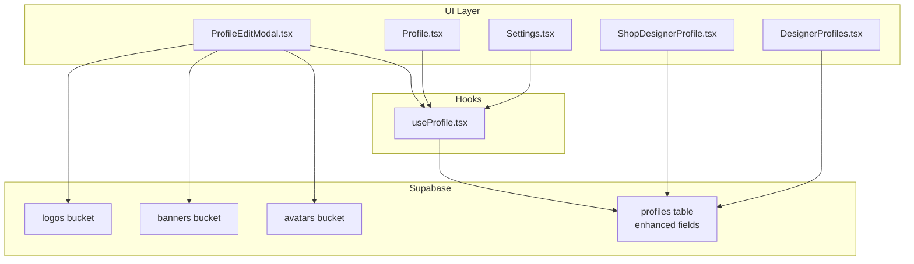
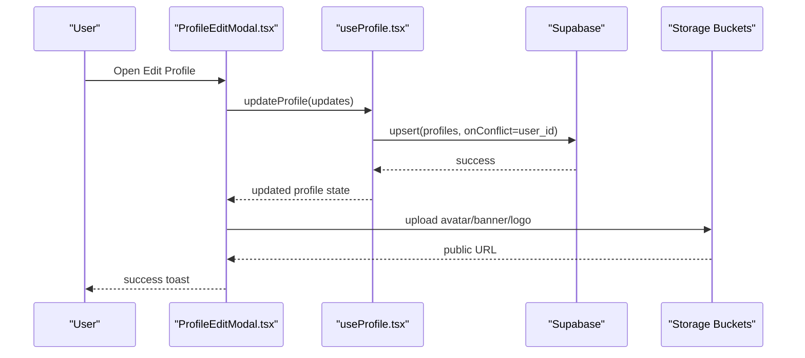
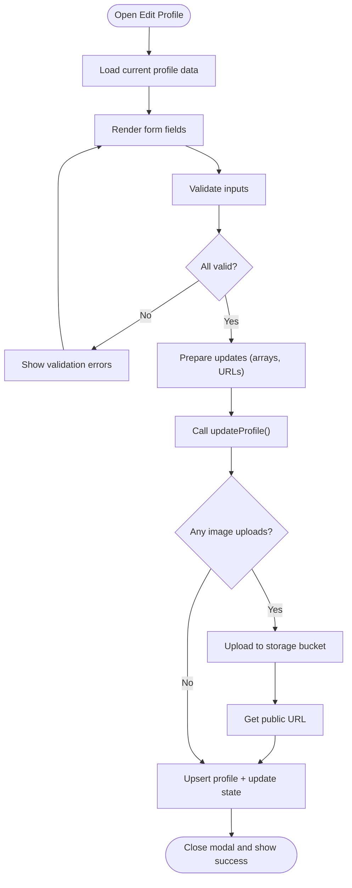
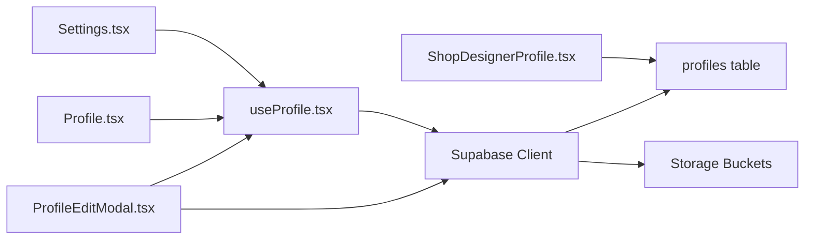

# Profile Management

<cite>
**Referenced Files in This Document**
- [ProfileEditModal.tsx](file://src/components/profile/ProfileEditModal.tsx)
- [Profile.tsx](file://src/pages/Profile.tsx)
- [useProfile.tsx](file://src/hooks/useProfile.tsx)
- [Settings.tsx](file://src/pages/Settings.tsx)
- [enhance_designer_profiles.sql](file://supabase/migrations/20260108050000_enhance_designer_profiles.sql)
- [add_designer_approval_and_follows.sql](file://supabase/migrations/20260126000000_add_designer_approval_and_follows.sql)
- [ShopDesignerProfile.tsx](file://src/pages/shop/ShopDesignerProfile.tsx)
- [DesignerProfiles.tsx](file://src/pages/public/DesignerProfiles.tsx)
- [social-links.ts](file://src/lib/social-links.ts)
</cite>

## Table of Contents
1. [Introduction](#introduction)
2. [Project Structure](#project-structure)
3. [Core Components](#core-components)
4. [Architecture Overview](#architecture-overview)
5. [Detailed Component Analysis](#detailed-component-analysis)
6. [Dependency Analysis](#dependency-analysis)
7. [Performance Considerations](#performance-considerations)
8. [Troubleshooting Guide](#troubleshooting-guide)
9. [Conclusion](#conclusion)

## Introduction
This document describes the designer profile management system, covering the profile editing interface, personal information management, and integration with account settings. It explains the profile validation system, image upload capabilities, and social media linking features. It also details profile visibility and privacy controls, and how profile information integrates with platform features such as team collaboration and marketplace presence. Finally, it outlines the profile completion workflow and its impact on platform access and features.

## Project Structure
The profile management system spans UI components, page views, hooks, Supabase integration, and database migrations:
- UI components: Profile edit modal and profile page
- Hooks: Centralized profile data fetching and updates
- Pages: Designer profile page and settings page
- Database: Enhanced profiles schema with comprehensive fields and storage buckets
- Marketplace integration: Designer showcase and public profile exposure

**Diagram sources**
- [ProfileEditModal.tsx](file://src/components/profile/ProfileEditModal.tsx#L38-L773)
- [Profile.tsx](file://src/pages/Profile.tsx#L39-L449)
- [Settings.tsx](file://src/pages/Settings.tsx#L67-L1054)
- [ShopDesignerProfile.tsx](file://src/pages/shop/ShopDesignerProfile.tsx#L20-L131)
- [DesignerProfiles.tsx](file://src/pages/public/DesignerProfiles.tsx#L87-L236)
- [useProfile.tsx](file://src/hooks/useProfile.tsx#L13-L154)
- [enhance_designer_profiles.sql](file://supabase/migrations/20260108050000_enhance_designer_profiles.sql#L4-L21)
- [enhance_designer_profiles.sql](file://supabase/migrations/20260108050000_enhance_designer_profiles.sql#L50-L63)

**Section sources**
- [ProfileEditModal.tsx](file://src/components/profile/ProfileEditModal.tsx#L38-L773)
- [Profile.tsx](file://src/pages/Profile.tsx#L39-L449)
- [Settings.tsx](file://src/pages/Settings.tsx#L67-L1054)
- [useProfile.tsx](file://src/hooks/useProfile.tsx#L13-L154)
- [enhance_designer_profiles.sql](file://supabase/migrations/20260108050000_enhance_designer_profiles.sql#L4-L21)

## Core Components
- ProfileEditModal: Full-featured modal for editing profile fields, uploading images, and managing social links.
- Profile page: Personal dashboard displaying profile summary, stats, and tabs for overview, achievements, skills, and marketplace presence.
- Settings page: Alternative editing surface integrated with account settings, including validation and array field handling.
- useProfile hook: Centralized logic for fetching, creating, and updating profiles with optimistic updates and safe field filtering.
- Database schema: Enhanced profiles table with brand, media, location, education, awards, and social links; storage buckets for avatars, banners, and logos; RLS policies for access control.

**Section sources**
- [ProfileEditModal.tsx](file://src/components/profile/ProfileEditModal.tsx#L38-L773)
- [Profile.tsx](file://src/pages/Profile.tsx#L39-L449)
- [Settings.tsx](file://src/pages/Settings.tsx#L67-L1054)
- [useProfile.tsx](file://src/hooks/useProfile.tsx#L13-L154)
- [enhance_designer_profiles.sql](file://supabase/migrations/20260108050000_enhance_designer_profiles.sql#L4-L21)

## Architecture Overview
The profile system follows a unidirectional data flow:
- UI components render profile data from the useProfile hook.
- Mutations trigger Supabase upserts with safe field filtering.
- Image uploads use Supabase Storage buckets with per-user folder isolation and RLS policies.
- Marketplace and public pages consume profile data for discovery and presentation.

**Diagram sources**
- [ProfileEditModal.tsx](file://src/components/profile/ProfileEditModal.tsx#L122-L193)
- [useProfile.tsx](file://src/hooks/useProfile.tsx#L95-L140)
- [enhance_designer_profiles.sql](file://supabase/migrations/20260108050000_enhance_designer_profiles.sql#L50-L63)

## Detailed Component Analysis

### Profile Editing Interface
The editing interface supports:
- Personal branding: display name, brand name, bio, category, location.
- Visual assets: avatar, banner, brand logo upload with validation and previews.
- Expertise: education and awards as newline-separated lists.
- Social & business presence: handles and links for Instagram, Twitter/X, LinkedIn, Facebook, TikTok, YouTube, Dribbble, Behance, Etsy, Shopify, plus website and optional logo URL.
- Validation: client-side validation for required fields and URL/handle formats; errors surfaced per field.

**Diagram sources**
- [ProfileEditModal.tsx](file://src/components/profile/ProfileEditModal.tsx#L95-L120)
- [ProfileEditModal.tsx](file://src/components/profile/ProfileEditModal.tsx#L122-L193)
- [ProfileEditModal.tsx](file://src/components/profile/ProfileEditModal.tsx#L195-L273)

**Section sources**
- [ProfileEditModal.tsx](file://src/components/profile/ProfileEditModal.tsx#L38-L773)

### Personal Information Management
- Fields managed include name, bio, category, skills, location, education, awards, website, and brand name.
- Arrays are normalized from multiline text inputs and stored as arrays in the database.
- Safe field filtering ensures only known fields are sent to the backend.

**Section sources**
- [ProfileEditModal.tsx](file://src/components/profile/ProfileEditModal.tsx#L128-L174)
- [useProfile.tsx](file://src/hooks/useProfile.tsx#L95-L140)

### Account Settings Integration
The settings page provides an alternative editing surface:
- Loads profile data from the database on mount.
- Applies Zod-based validation for core fields and custom validators for social handles and URLs.
- Handles array fields by splitting on newlines and trimming entries.
- Upserts profile data with conflict resolution on user_id.

**Section sources**
- [Settings.tsx](file://src/pages/Settings.tsx#L119-L184)
- [Settings.tsx](file://src/pages/Settings.tsx#L186-L211)
- [Settings.tsx](file://src/pages/Settings.tsx#L213-L280)

### Profile Validation System
Validation covers:
- Required name.
- URL format for website.
- Social handles must start with "@" for Instagram, Twitter/X, and TikTok.
- Real-time clearing of validation errors upon correction.

**Section sources**
- [ProfileEditModal.tsx](file://src/components/profile/ProfileEditModal.tsx#L95-L120)
- [Settings.tsx](file://src/pages/Settings.tsx#L186-L211)

### Image Upload Capabilities
- Avatars: upload to the avatars bucket with image type and size limits; preview shown until upload completes.
- Banners: upload to the banners bucket with larger size limit; preview shown.
- Brand logos: either paste a URL or upload to the logos bucket; preview shown.
- Per-user folder isolation via user_id-based paths; RLS policies restrict uploads to owners.

**Section sources**
- [ProfileEditModal.tsx](file://src/components/profile/ProfileEditModal.tsx#L195-L233)
- [ProfileEditModal.tsx](file://src/components/profile/ProfileEditModal.tsx#L235-L273)
- [ProfileEditModal.tsx](file://src/components/profile/ProfileEditModal.tsx#L560-L596)
- [enhance_designer_profiles.sql](file://supabase/migrations/20260108050000_enhance_designer_profiles.sql#L50-L63)
- [enhance_designer_profiles.sql](file://supabase/migrations/20260108050000_enhance_designer_profiles.sql#L107-L126)

### Social Media Linking Features
- Supported platforms: Instagram, Twitter/X, LinkedIn, Facebook, TikTok, YouTube, Dribbble, Behance, Etsy, Shopify.
- Handles and links are stored separately for discoverability and consistent formatting.
- Public designer profile aggregates social links for external discovery.

**Section sources**
- [ProfileEditModal.tsx](file://src/components/profile/ProfileEditModal.tsx#L602-L748)
- [ShopDesignerProfile.tsx](file://src/pages/shop/ShopDesignerProfile.tsx#L60-L66)

### Profile Visibility and Privacy Controls
- Public profiles: selectable by marketplace and public designer directory.
- RLS policies:
  - Profiles: select allowed; insert/update restricted to owner.
  - Storage: select allowed; insert/update/delete restricted to owner’s folder.
- Follow system: optional follow relationships for engagement and discovery.

**Section sources**
- [enhance_designer_profiles.sql](file://supabase/migrations/20260108050000_enhance_designer_profiles.sql#L27-L48)
- [enhance_designer_profiles.sql](file://supabase/migrations/20260108050000_enhance_designer_profiles.sql#L107-L126)
- [add_designer_approval_and_follows.sql](file://supabase/migrations/20260126000000_add_designer_approval_and_follows.sql#L15-L26)

### Integration with Platform Features
- Team collaboration: profile data used in team dashboards and challenges; team eligibility checks leverage profile attributes indirectly.
- Marketplace presence: public designer profile displays banner, avatar, bio, education, and social links; products are associated with designer_id.
- Public directory: public designer profiles page showcases designers with ratings and product counts.

**Section sources**
- [ShopDesignerProfile.tsx](file://src/pages/shop/ShopDesignerProfile.tsx#L20-L131)
- [DesignerProfiles.tsx](file://src/pages/public/DesignerProfiles.tsx#L87-L236)

### Profile Completion Workflow and Impact
- Onboarding: useProfile hook creates a minimal profile on first login if none exists.
- Completion indicators: profile completeness influences access to advanced features and marketplace visibility.
- Discovery: global search and marketplace filters rely on profile fields (name, bio, brand_name, category).

Note: The exact thresholds and gating mechanisms for platform access are not explicitly defined in the referenced files; the system exposes profile completeness via fields and indices suitable for downstream logic.

**Section sources**
- [useProfile.tsx](file://src/hooks/useProfile.tsx#L55-L83)
- [add_designer_approval_and_follows.sql](file://supabase/migrations/20260126000000_add_designer_approval_and_follows.sql#L54-L131)

## Dependency Analysis
The profile system depends on:
- Supabase client for database and storage operations.
- React Query for caching and optimistic updates.
- Tailwind-based UI primitives for forms and dialogs.
- Storage buckets for media assets.

**Diagram sources**
- [ProfileEditModal.tsx](file://src/components/profile/ProfileEditModal.tsx#L3-L4)
- [useProfile.tsx](file://src/hooks/useProfile.tsx#L2-L4)
- [Profile.tsx](file://src/pages/Profile.tsx#L32-L34)
- [Settings.tsx](file://src/pages/Settings.tsx#L49-L49)
- [ShopDesignerProfile.tsx](file://src/pages/shop/ShopDesignerProfile.tsx#L15-L16)

**Section sources**
- [ProfileEditModal.tsx](file://src/components/profile/ProfileEditModal.tsx#L3-L4)
- [useProfile.tsx](file://src/hooks/useProfile.tsx#L2-L4)
- [Profile.tsx](file://src/pages/Profile.tsx#L32-L34)
- [Settings.tsx](file://src/pages/Settings.tsx#L49-L49)
- [ShopDesignerProfile.tsx](file://src/pages/shop/ShopDesignerProfile.tsx#L15-L16)

## Performance Considerations
- Prefer client-side validation to reduce server round trips during editing.
- Use previews for uploads to minimize re-renders and improve UX.
- Normalize arrays from multiline inputs to avoid excessive writes.
- Leverage database indexes on frequently searched fields (name, bio, brand_name) for discovery and search performance.

## Troubleshooting Guide
Common issues and resolutions:
- Upload failures: Verify file type and size limits; confirm bucket policies allow uploads for the current user.
- Validation errors: Ensure required fields are filled and URLs/handles meet format requirements.
- Profile not found: Confirm the user has a profile record; the hook auto-creates one on first login.
- Storage access denied: Check RLS policies for the bucket and user ownership of the folder path.

**Section sources**
- [ProfileEditModal.tsx](file://src/components/profile/ProfileEditModal.tsx#L195-L233)
- [ProfileEditModal.tsx](file://src/components/profile/ProfileEditModal.tsx#L235-L273)
- [useProfile.tsx](file://src/hooks/useProfile.tsx#L55-L83)
- [enhance_designer_profiles.sql](file://supabase/migrations/20260108050000_enhance_designer_profiles.sql#L107-L126)

## Conclusion
The profile management system provides a robust, extensible foundation for designer identity across the platform. It supports comprehensive personal and professional information, secure media handling, and seamless integration with marketplace and team features. The modular design, centralized hook, and strong database schema enable maintainable growth and consistent user experiences.