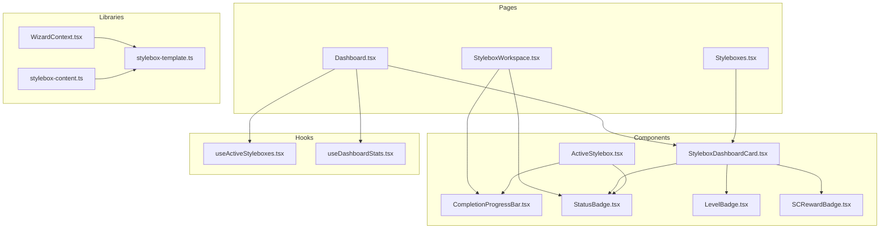
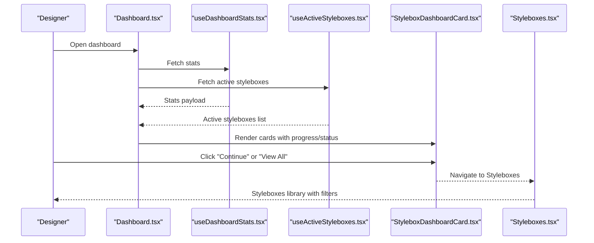
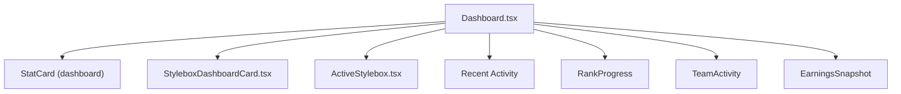
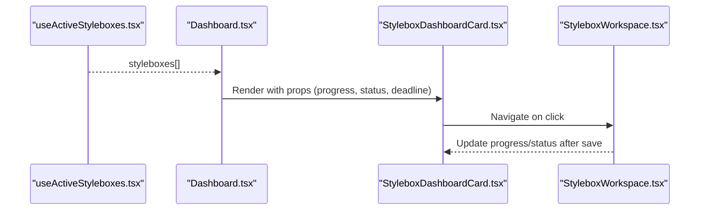
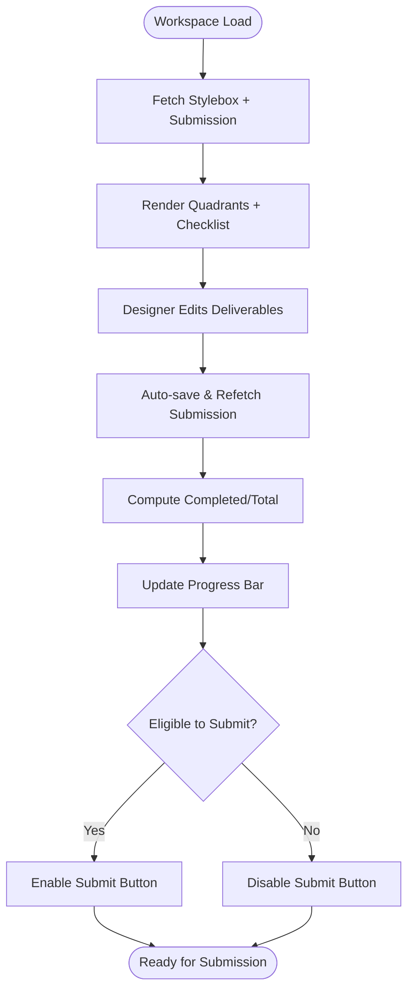
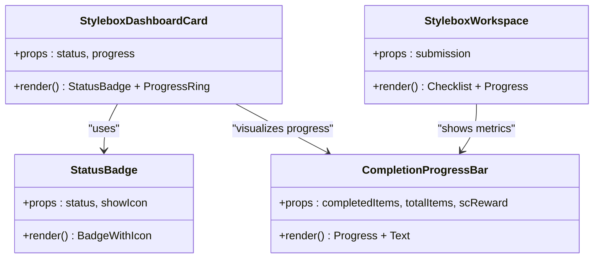
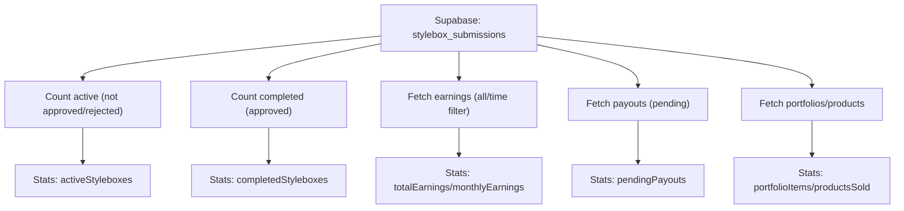
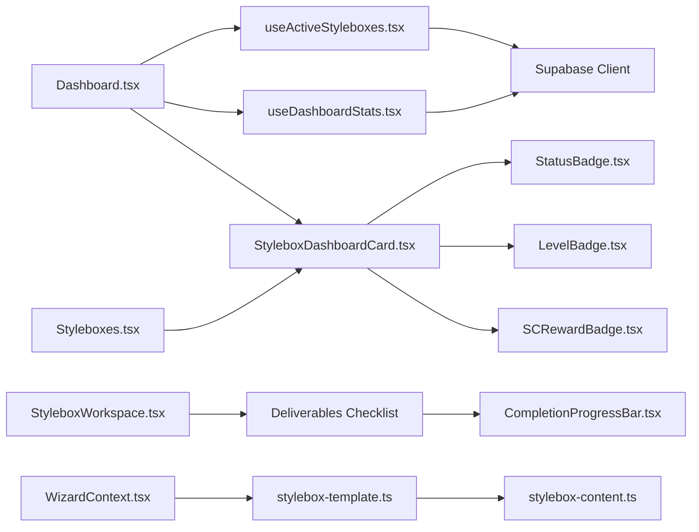

# Stylebox System Integration

<cite>
**Referenced Files in This Document**
- [Dashboard.tsx](file://src/pages/Dashboard.tsx)
- [Styleboxes.tsx](file://src/pages/Styleboxes.tsx)
- [StyleboxWorkspace.tsx](file://src/pages/StyleboxWorkspace.tsx)
- [ActiveStylebox.tsx](file://src/components/dashboard/ActiveStylebox.tsx)
- [StyleboxDashboardCard.tsx](file://src/components/stylebox/StyleboxDashboardCard.tsx)
- [useActiveStyleboxes.tsx](file://src/hooks/useActiveStyleboxes.tsx)
- [useDashboardStats.tsx](file://src/hooks/useDashboardStats.tsx)
- [CompletionProgressBar.tsx](file://src/components/stylebox/CompletionProgressBar.tsx)
- [StatusBadge.tsx](file://src/components/stylebox/StatusBadge.tsx)
- [LevelBadge.tsx](file://src/components/stylebox/LevelBadge.tsx)
- [SCRewardBadge.tsx](file://src/components/stylebox/SCRewardBadge.tsx)
- [stylebox-content.ts](file://src/lib/stylebox-content.ts)
- [stylebox-template.ts](file://src/lib/stylebox-template.ts)
- [WizardContext.tsx](file://src/components/admin/stylebox-wizard/WizardContext.tsx)
</cite>

## Table of Contents
1. [Introduction](#introduction)
2. [Project Structure](#project-structure)
3. [Core Components](#core-components)
4. [Architecture Overview](#architecture-overview)
5. [Detailed Component Analysis](#detailed-component-analysis)
6. [Dependency Analysis](#dependency-analysis)
7. [Performance Considerations](#performance-considerations)
8. [Troubleshooting Guide](#troubleshooting-guide)
9. [Conclusion](#conclusion)

## Introduction
This document explains the stylebox system integration within the designer studio, focusing on how the dashboard displays active styleboxes, how dashboard widgets connect to stylebox listings, and the navigation flow between different stylebox views. It also documents the progress tracking system, status indicators, and completion metrics shown on the dashboard, along with the relationship between dashboard statistics and stylebox performance, and how the system promotes continued engagement through visual progress indicators.

## Project Structure
The stylebox system spans several layers:
- Pages: Dashboard, Styleboxes listing, and Stylebox workspace
- Components: Dashboard cards, progress bars, status badges, level badges, and reward badges
- Hooks: Data fetching for active styleboxes and dashboard statistics
- Libraries: Stylebox content templates and standardized template types
- Admin wizard: Context provider for stylebox creation/editing

**Diagram sources**
- [Dashboard.tsx](file://src/pages/Dashboard.tsx#L29-L434)
- [Styleboxes.tsx](file://src/pages/Styleboxes.tsx#L24-L393)
- [StyleboxWorkspace.tsx](file://src/pages/StyleboxWorkspace.tsx#L29-L412)
- [ActiveStylebox.tsx](file://src/components/dashboard/ActiveStylebox.tsx#L1-L84)
- [StyleboxDashboardCard.tsx](file://src/components/stylebox/StyleboxDashboardCard.tsx#L1-L164)
- [CompletionProgressBar.tsx](file://src/components/stylebox/CompletionProgressBar.tsx#L1-L49)
- [StatusBadge.tsx](file://src/components/stylebox/StatusBadge.tsx#L1-L89)
- [LevelBadge.tsx](file://src/components/stylebox/LevelBadge.tsx#L1-L40)
- [SCRewardBadge.tsx](file://src/components/stylebox/SCRewardBadge.tsx#L1-L46)
- [useActiveStyleboxes.tsx](file://src/hooks/useActiveStyleboxes.tsx#L1-L115)
- [useDashboardStats.tsx](file://src/hooks/useDashboardStats.tsx#L1-L122)
- [stylebox-content.ts](file://src/lib/stylebox-content.ts#L1-L926)
- [stylebox-template.ts](file://src/lib/stylebox-template.ts#L1-L531)
- [WizardContext.tsx](file://src/components/admin/stylebox-wizard/WizardContext.tsx#L1-L120)

**Section sources**
- [Dashboard.tsx](file://src/pages/Dashboard.tsx#L29-L434)
- [Styleboxes.tsx](file://src/pages/Styleboxes.tsx#L24-L393)
- [StyleboxWorkspace.tsx](file://src/pages/StyleboxWorkspace.tsx#L29-L412)

## Core Components
- Dashboard displays active styleboxes, recent activity, and key statistics. It integrates with hooks to fetch live data and renders cards for quick navigation.
- Styleboxes listing provides filtering, sorting, and tabbed views for browsing available styleboxes.
- Stylebox workspace manages deliverables, progress tracking, and submission flow with real-time updates.
- Dashboard cards and workspace components share common UI elements for status, levels, rewards, and progress.

Key responsibilities:
- Dashboard: Aggregate and present stylebox performance metrics and active challenges.
- Listing: Surface discoverability and filtering for styleboxes.
- Workspace: Track deliverables completion and submission readiness.

**Section sources**
- [Dashboard.tsx](file://src/pages/Dashboard.tsx#L180-L414)
- [Styleboxes.tsx](file://src/pages/Styleboxes.tsx#L104-L294)
- [StyleboxWorkspace.tsx](file://src/pages/StyleboxWorkspace.tsx#L166-L412)

## Architecture Overview
The system follows a data-fetching pattern with hooks and reactive UI updates. The dashboard orchestrates multiple widgets that rely on Supabase queries to reflect real-time stylebox submissions and statistics.

**Diagram sources**
- [Dashboard.tsx](file://src/pages/Dashboard.tsx#L33-L34)
- [useDashboardStats.tsx](file://src/hooks/useDashboardStats.tsx#L15-L122)
- [useActiveStyleboxes.tsx](file://src/hooks/useActiveStyleboxes.tsx#L30-L115)
- [StyleboxDashboardCard.tsx](file://src/components/stylebox/StyleboxDashboardCard.tsx#L47-L57)
- [Styleboxes.tsx](file://src/pages/Styleboxes.tsx#L25-L31)

## Detailed Component Analysis

### Dashboard Widget Integration
The dashboard composes multiple widgets:
- Statistics cards: Active styleboxes, completed this year, portfolio items, monthly earnings
- Active styleboxes grid: Renders cards for ongoing submissions
- Recent activity feed: Shows submission status updates
- Sidebar widgets: Rank progress, team activity, earnings snapshot

**Diagram sources**
- [Dashboard.tsx](file://src/pages/Dashboard.tsx#L180-L414)
- [StyleboxDashboardCard.tsx](file://src/components/stylebox/StyleboxDashboardCard.tsx#L1-L164)
- [ActiveStylebox.tsx](file://src/components/dashboard/ActiveStylebox.tsx#L1-L84)

**Section sources**
- [Dashboard.tsx](file://src/pages/Dashboard.tsx#L180-L414)

### Active Styleboxes Display and Navigation
Active styleboxes are fetched by a dedicated hook and rendered as interactive cards. Each card exposes:
- Thumbnail and metadata (level, category, studio)
- Status badge and progress ring
- Deadline countdown
- Navigation to the workspace

**Diagram sources**
- [useActiveStyleboxes.tsx](file://src/hooks/useActiveStyleboxes.tsx#L30-L115)
- [Dashboard.tsx](file://src/pages/Dashboard.tsx#L292-L311)
- [StyleboxDashboardCard.tsx](file://src/components/stylebox/StyleboxDashboardCard.tsx#L47-L57)
- [StyleboxWorkspace.tsx](file://src/pages/StyleboxWorkspace.tsx#L321-L325)

**Section sources**
- [useActiveStyleboxes.tsx](file://src/hooks/useActiveStyleboxes.tsx#L30-L115)
- [StyleboxDashboardCard.tsx](file://src/components/stylebox/StyleboxDashboardCard.tsx#L31-L163)

### Progress Tracking System
The workspace tracks deliverables completion and submission readiness:
- Deliverables checklist with completion indicators
- Progress bar showing completed vs total deliverables
- Submission eligibility computed from checklist state
- Real-time progress percentage updates

**Diagram sources**
- [StyleboxWorkspace.tsx](file://src/pages/StyleboxWorkspace.tsx#L74-L117)
- [StyleboxWorkspace.tsx](file://src/pages/StyleboxWorkspace.tsx#L337-L388)
- [CompletionProgressBar.tsx](file://src/components/stylebox/CompletionProgressBar.tsx#L12-L49)

**Section sources**
- [StyleboxWorkspace.tsx](file://src/pages/StyleboxWorkspace.tsx#L74-L117)
- [CompletionProgressBar.tsx](file://src/components/stylebox/CompletionProgressBar.tsx#L12-L49)

### Status Indicators and Completion Metrics
Status badges communicate submission lifecycle stages with consistent icons and colors. Completion metrics are derived from submission records and displayed on both dashboard cards and the workspace.

**Diagram sources**
- [StatusBadge.tsx](file://src/components/stylebox/StatusBadge.tsx#L74-L89)
- [CompletionProgressBar.tsx](file://src/components/stylebox/CompletionProgressBar.tsx#L12-L49)
- [StyleboxDashboardCard.tsx](file://src/components/stylebox/StyleboxDashboardCard.tsx#L88-L121)
- [StyleboxWorkspace.tsx](file://src/pages/StyleboxWorkspace.tsx#L337-L388)

**Section sources**
- [StatusBadge.tsx](file://src/components/stylebox/StatusBadge.tsx#L27-L72)
- [StyleboxDashboardCard.tsx](file://src/components/stylebox/StyleboxDashboardCard.tsx#L88-L121)
- [StyleboxWorkspace.tsx](file://src/pages/StyleboxWorkspace.tsx#L370-L388)

### Relationship Between Dashboard Statistics and Stylebox Performance
The dashboard aggregates performance metrics from stylebox submissions:
- Active styleboxes: count of non-completed submissions
- Completed styleboxes: count of approved submissions
- Portfolio items and products sold: cross-domain metrics
- Monthly earnings: revenue aggregation filtered by month

**Diagram sources**
- [useDashboardStats.tsx](file://src/hooks/useDashboardStats.tsx#L34-L109)
- [Dashboard.tsx](file://src/pages/Dashboard.tsx#L196-L222)

**Section sources**
- [useDashboardStats.tsx](file://src/hooks/useDashboardStats.tsx#L15-L122)
- [Dashboard.tsx](file://src/pages/Dashboard.tsx#L196-L222)

### Promotion Through Visual Progress Indicators
The system uses layered visual cues to encourage continued engagement:
- Progress rings and bars in cards and workspace
- Status badges indicating lifecycle stage
- Level badges communicating skill progression
- Reward badges highlighting potential style credits
- Recent activity feed reinforcing momentum

These elements collectively create a feedback loop that highlights progress, clarifies next steps, and motivates designers to complete deliverables and advance through levels.

**Section sources**
- [StyleboxDashboardCard.tsx](file://src/components/stylebox/StyleboxDashboardCard.tsx#L118-L121)
- [StyleboxWorkspace.tsx](file://src/pages/StyleboxWorkspace.tsx#L370-L388)
- [StatusBadge.tsx](file://src/components/stylebox/StatusBadge.tsx#L74-L89)
- [LevelBadge.tsx](file://src/components/stylebox/LevelBadge.tsx#L22-L39)
- [SCRewardBadge.tsx](file://src/components/stylebox/SCRewardBadge.tsx#L12-L46)

## Dependency Analysis
The stylebox system exhibits clear separation of concerns:
- Pages depend on hooks for data and on components for UI
- Components depend on shared UI utilities and libraries
- Hooks depend on Supabase client and authentication context
- Templates and content define standardized structures for styleboxes

**Diagram sources**
- [Dashboard.tsx](file://src/pages/Dashboard.tsx#L33-L34)
- [Styleboxes.tsx](file://src/pages/Styleboxes.tsx#L25-L31)
- [StyleboxWorkspace.tsx](file://src/pages/StyleboxWorkspace.tsx#L337-L388)
- [useActiveStyleboxes.tsx](file://src/hooks/useActiveStyleboxes.tsx#L30-L115)
- [useDashboardStats.tsx](file://src/hooks/useDashboardStats.tsx#L15-L122)
- [stylebox-template.ts](file://src/lib/stylebox-template.ts#L209-L282)
- [stylebox-content.ts](file://src/lib/stylebox-content.ts#L1-L926)
- [WizardContext.tsx](file://src/components/admin/stylebox-wizard/WizardContext.tsx#L45-L118)

**Section sources**
- [Dashboard.tsx](file://src/pages/Dashboard.tsx#L29-L434)
- [Styleboxes.tsx](file://src/pages/Styleboxes.tsx#L24-L393)
- [StyleboxWorkspace.tsx](file://src/pages/StyleboxWorkspace.tsx#L29-L412)
- [useActiveStyleboxes.tsx](file://src/hooks/useActiveStyleboxes.tsx#L30-L115)
- [useDashboardStats.tsx](file://src/hooks/useDashboardStats.tsx#L15-L122)
- [stylebox-template.ts](file://src/lib/stylebox-template.ts#L209-L282)
- [stylebox-content.ts](file://src/lib/stylebox-content.ts#L1-L926)
- [WizardContext.tsx](file://src/components/admin/stylebox-wizard/WizardContext.tsx#L45-L118)

## Performance Considerations
- Efficient data fetching: Hooks use targeted queries and caching via TanStack Query to minimize redundant network requests.
- Conditional rendering: Loading skeletons improve perceived performance while data loads.
- Computation offloading: Progress calculations are performed client-side after data retrieval.
- Debounced interactions: Auto-save intervals reduce server load while maintaining responsiveness.

## Troubleshooting Guide
Common issues and resolutions:
- No active styleboxes displayed: Verify user authentication and submission records; check hook error states and loading flags.
- Incorrect progress values: Confirm submission status and deliverables counts; ensure progress percentage computation aligns with completed vs total deliverables.
- Navigation failures: Validate route parameters and existence of stylebox/submission records before rendering workspace.
- Status badge inconsistencies: Ensure status mapping matches submission lifecycle and UI configuration.

**Section sources**
- [useActiveStyleboxes.tsx](file://src/hooks/useActiveStyleboxes.tsx#L102-L107)
- [StyleboxWorkspace.tsx](file://src/pages/StyleboxWorkspace.tsx#L119-L129)
- [StatusBadge.tsx](file://src/components/stylebox/StatusBadge.tsx#L27-L72)

## Conclusion
The stylebox system integration delivers a cohesive designer experience by connecting dashboard widgets to live stylebox data, enabling smooth navigation across views, and reinforcing engagement through clear progress indicators and status communication. The modular architecture ensures maintainability and scalability as new styleboxes and features are introduced.