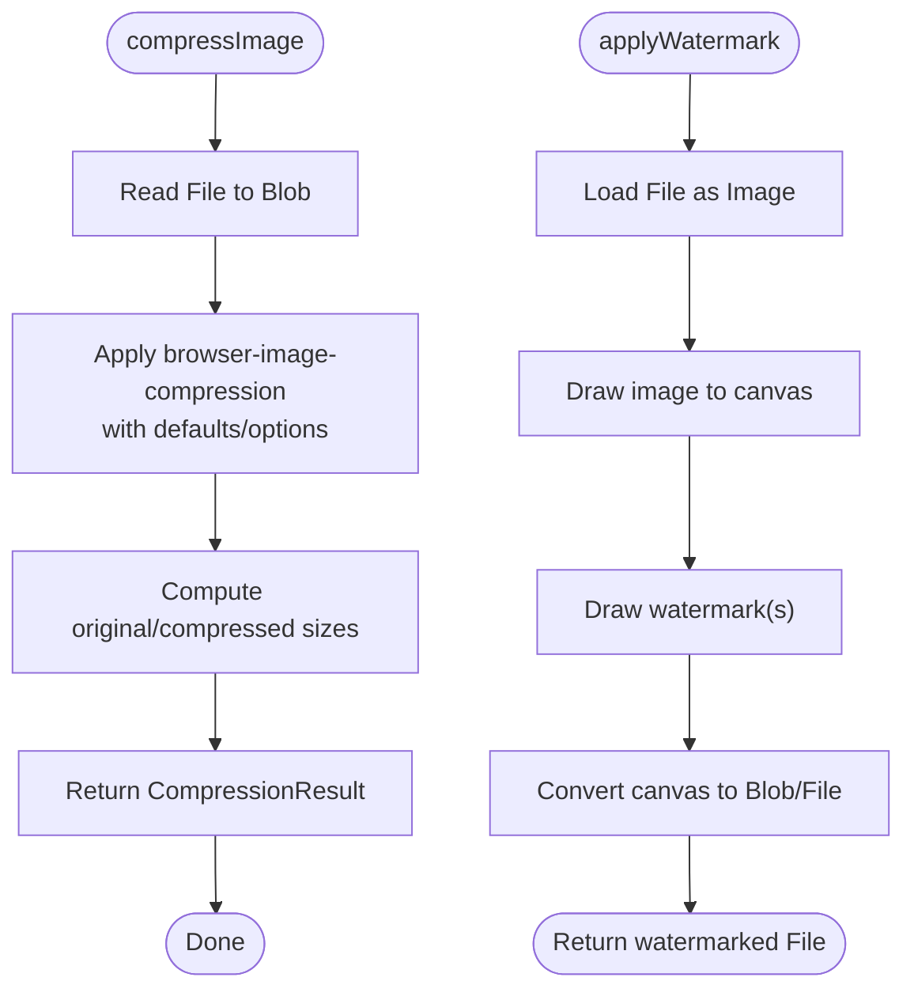

# Asset Optimization

<cite>
**Referenced Files in This Document**
- [cdn-image.ts](file://src/lib/cdn-image.ts)
- [image-compression.ts](file://src/lib/image-compression.ts)
- [image-processing.ts](file://src/lib/image-processing.ts)
- [images.ts](file://src/lib/images.ts)
- [use-mobile.tsx](file://src/hooks/use-mobile.tsx)
- [ImageReveal.tsx](file://src/components/public/ImageReveal.tsx)
- [package.json](file://package.json)
- [vercel.json](file://vercel.json)
</cite>

## Table of Contents
1. [Introduction](#introduction)
2. [Project Structure](#project-structure)
3. [Core Components](#core-components)
4. [Architecture Overview](#architecture-overview)
5. [Detailed Component Analysis](#detailed-component-analysis)
6. [Dependency Analysis](#dependency-analysis)
7. [Performance Considerations](#performance-considerations)
8. [Troubleshooting Guide](#troubleshooting-guide)
9. [Conclusion](#conclusion)
10. [Appendices](#appendices)

## Introduction
This document explains the asset optimization strategies implemented in the project, focusing on responsive image serving, automatic format detection, quality adjustments based on device capabilities, CDN caching and invalidation, performance monitoring, lazy loading, image preloading, bandwidth optimization, fallback mechanisms for unsupported formats, and offline caching strategies. It also covers mobile-first optimization and progressive loading.

## Project Structure
The asset optimization logic is primarily implemented in dedicated libraries and utilities:
- CDN image transformation and responsive serving
- Client-side image compression and watermarking
- Mobile detection hook for device-aware rendering
- Progressive image reveal component for perceived performance
- Public image URL registry for static assets
- Build and deployment configuration impacting caching and headers

**Diagram sources**
- [cdn-image.ts](file://src/lib/cdn-image.ts#L1-L195)
- [image-compression.ts](file://src/lib/image-compression.ts#L1-L124)
- [image-processing.ts](file://src/lib/image-processing.ts#L1-L82)
- [images.ts](file://src/lib/images.ts#L1-L95)
- [use-mobile.tsx](file://src/hooks/use-mobile.tsx#L1-L19)
- [ImageReveal.tsx](file://src/components/public/ImageReveal.tsx#L34-L63)
- [package.json](file://package.json#L1-L88)
- [vercel.json](file://vercel.json#L1-L15)

**Section sources**
- [cdn-image.ts](file://src/lib/cdn-image.ts#L1-L195)
- [image-compression.ts](file://src/lib/image-compression.ts#L1-L124)
- [image-processing.ts](file://src/lib/image-processing.ts#L1-L82)
- [images.ts](file://src/lib/images.ts#L1-L95)
- [use-mobile.tsx](file://src/hooks/use-mobile.tsx#L1-L19)
- [ImageReveal.tsx](file://src/components/public/ImageReveal.tsx#L34-L63)
- [package.json](file://package.json#L1-L88)
- [vercel.json](file://vercel.json#L1-L15)

## Core Components
- CDN image transformation and responsive serving:
  - Optimized URL generation with width, height, quality, format, and fit
  - Presets for products and designers
  - Srcset generation for responsive images
  - Format detection for AVIF/WebP/JPEG
- Client-side compression and watermarking:
  - Compression with configurable limits and Web Worker usage
  - Watermark application to uploaded images
- Progressive loading and lazy loading:
  - Native lazy loading with eager override for priority images
  - Intersection Observer fallback
  - Preload for Largest Contentful Paint optimization
  - Image reveal animation with loading placeholders
- Mobile optimization:
  - Hook to detect mobile viewport for adaptive behavior
- Public image registry:
  - Centralized URLs for marketing and content visuals
- Build and deployment:
  - Browser image compression dependency
  - Security headers and rewrites affecting caching and security

**Section sources**
- [cdn-image.ts](file://src/lib/cdn-image.ts#L9-L195)
- [image-compression.ts](file://src/lib/image-compression.ts#L11-L124)
- [image-processing.ts](file://src/lib/image-processing.ts#L6-L82)
- [ImageReveal.tsx](file://src/components/public/ImageReveal.tsx#L34-L63)
- [use-mobile.tsx](file://src/hooks/use-mobile.tsx#L1-L19)
- [images.ts](file://src/lib/images.ts#L1-L95)
- [package.json](file://package.json#L44-L44)
- [vercel.json](file://vercel.json#L1-L15)

## Architecture Overview
The asset optimization pipeline integrates client-side utilities with CDN transformations and progressive rendering to deliver fast, adaptive, and visually consistent images.

**Diagram sources**
- [cdn-image.ts](file://src/lib/cdn-image.ts#L22-L53)
- [cdn-image.ts](file://src/lib/cdn-image.ts#L59-L70)
- [cdn-image.ts](file://src/lib/cdn-image.ts#L171-L185)
- [cdn-image.ts](file://src/lib/cdn-image.ts#L126-L152)
- [cdn-image.ts](file://src/lib/cdn-image.ts#L158-L165)
- [image-compression.ts](file://src/lib/image-compression.ts#L30-L64)
- [image-processing.ts](file://src/lib/image-processing.ts#L17-L81)

## Detailed Component Analysis

### CDN Image Transformation and Responsive Serving
- Purpose:
  - Generate optimized image URLs with transformations (size, quality, format, fit)
  - Provide presets for consistent product and designer image rendering
  - Build responsive srcsets for varied screen widths
  - Detect modern image format support for optimal delivery
- Key behaviors:
  - URL construction with ImgProxy parameters
  - Preset mapping for thumbnails, cards, details, heroes, and zoom
  - Format detection returning AVIF, WebP, or JPEG fallback
  - Srcset generation across common widths

**Diagram sources**
- [cdn-image.ts](file://src/lib/cdn-image.ts#L22-L53)

**Section sources**
- [cdn-image.ts](file://src/lib/cdn-image.ts#L9-L53)
- [cdn-image.ts](file://src/lib/cdn-image.ts#L59-L82)
- [cdn-image.ts](file://src/lib/cdn-image.ts#L171-L185)

### Presets and Srcset Generation
- Product and designer presets define consistent dimensions, quality, and fit
- Srcset generation builds a set of responsive URLs for different widths
- Format selection influences srcset entries for modern browsers

**Diagram sources**
- [cdn-image.ts](file://src/lib/cdn-image.ts#L59-L70)

**Section sources**
- [cdn-image.ts](file://src/lib/cdn-image.ts#L59-L70)
- [cdn-image.ts](file://src/lib/cdn-image.ts#L76-L92)

### Format Detection and Fallback Mechanisms
- Modern format detection checks AVIF and WebP support via data URLs
- Returns JPEG as a guaranteed fallback
- Used to select appropriate format for presets and srcset entries

**Diagram sources**
- [cdn-image.ts](file://src/lib/cdn-image.ts#L171-L185)

**Section sources**
- [cdn-image.ts](file://src/lib/cdn-image.ts#L171-L185)

### Lazy Loading and Preloading Strategies
- Native lazy loading with eager override for priority images
- Intersection Observer fallback with a small root margin
- Preload link element for critical images to improve LCP

**Diagram sources**
- [cdn-image.ts](file://src/lib/cdn-image.ts#L126-L152)
- [cdn-image.ts](file://src/lib/cdn-image.ts#L158-L165)

**Section sources**
- [cdn-image.ts](file://src/lib/cdn-image.ts#L126-L165)

### Progressive Loading and Image Reveal
- Uses motion animations to reveal images progressively
- Maintains aspect ratio and scaling during transitions
- Provides a loading placeholder until the image loads

**Diagram sources**
- [ImageReveal.tsx](file://src/components/public/ImageReveal.tsx#L34-L63)

**Section sources**
- [ImageReveal.tsx](file://src/components/public/ImageReveal.tsx#L34-L63)

### Client-Side Image Compression and Watermarking
- Compression:
  - Configurable max size, dimension, Web Worker usage, target MIME type, and initial quality
  - Parallel compression with progress callbacks
  - Fallback to original file on failure
- Watermarking:
  - Canvas-based watermarking with adjustable text, opacity, color, and angle
  - Multi-position watermarking for coverage

**Diagram sources**
- [image-compression.ts](file://src/lib/image-compression.ts#L30-L64)
- [image-processing.ts](file://src/lib/image-processing.ts#L17-L81)

**Section sources**
- [image-compression.ts](file://src/lib/image-compression.ts#L11-L124)
- [image-processing.ts](file://src/lib/image-processing.ts#L6-L82)

### Mobile Optimization
- Mobile breakpoint detection enables adaptive rendering and behavior
- Combined with responsive images and progressive loading for optimal mobile performance

**Section sources**
- [use-mobile.tsx](file://src/hooks/use-mobile.tsx#L1-L19)

### Public Image Registry
- Centralized URLs for marketing and content visuals
- Useful for quick prototyping and static assets

**Section sources**
- [images.ts](file://src/lib/images.ts#L1-L95)

## Dependency Analysis
- External dependencies relevant to asset optimization:
  - browser-image-compression for client-side compression
- Build and deployment configuration:
  - Vercel headers and rewrites influence caching and security headers

**Diagram sources**
- [cdn-image.ts](file://src/lib/cdn-image.ts#L49-L50)
- [image-compression.ts](file://src/lib/image-compression.ts#L1-L1)
- [image-processing.ts](file://src/lib/image-processing.ts#L22-L38)
- [ImageReveal.tsx](file://src/components/public/ImageReveal.tsx#L38-L51)
- [use-mobile.tsx](file://src/hooks/use-mobile.tsx#L8-L16)
- [vercel.json](file://vercel.json#L5-L14)

**Section sources**
- [package.json](file://package.json#L44-L44)
- [vercel.json](file://vercel.json#L1-L15)

## Performance Considerations
- CDN transformations:
  - Adjust width, height, and quality per preset to balance fidelity and bandwidth
  - Prefer WebP/AVIF where supported; JPEG fallback ensures compatibility
- Responsive images:
  - Use srcset with widths aligned to common device widths
  - Fit modes (cover/contain/fill/inside/outside) optimize cropping and scaling
- Lazy loading and preloading:
  - Use native lazy loading for modern browsers; Intersection Observer fallback for older ones
  - Preload critical images to improve LCP
- Compression:
  - Tune maxSizeMB and initialQuality to meet bandwidth targets while preserving visual fidelity
  - Use Web Workers to avoid blocking the UI thread
- Progressive loading:
  - Combine lazy loading with image reveal animations to improve perceived performance
- Mobile-first:
  - Use smaller dimensions and lower quality for mobile presets; increase for desktop
- Caching and headers:
  - Security headers protect assets; ensure appropriate cache-control headers at the CDN level for long-term caching of immutable assets

[No sources needed since this section provides general guidance]

## Troubleshooting Guide
- Images not loading:
  - Verify CDN URL construction and environment variable for the Supabase URL
  - Confirm storage bucket and path correctness
- Poor image quality:
  - Increase quality or adjust dimensions in presets
  - Ensure format selection matches browser support
- Slow page load:
  - Enable lazy loading and preload critical images
  - Reduce initial quality or size for mobile
- Compression failures:
  - The compression utility falls back to the original file; inspect console logs for errors
- Watermarking issues:
  - Canvas context availability and image load errors are handled; check console for failures

**Section sources**
- [cdn-image.ts](file://src/lib/cdn-image.ts#L22-L53)
- [cdn-image.ts](file://src/lib/cdn-image.ts#L126-L152)
- [image-compression.ts](file://src/lib/image-compression.ts#L53-L63)
- [image-processing.ts](file://src/lib/image-processing.ts#L25-L77)

## Conclusion
The project implements a comprehensive asset optimization strategy centered around CDN transformations, responsive serving, progressive loading, and client-side compression and watermarking. By combining modern image formats, adaptive sizing, lazy loading, and preloading, it achieves strong performance and visual fidelity across devices. Mobile detection and preset-driven optimization further tailor experiences for different contexts.

[No sources needed since this section summarizes without analyzing specific files]

## Appendices

### Example Optimized Image URLs
- Constructed using the CDN image utility with width, height, quality, format, and fit parameters
- Preset-based URLs for product and designer images
- Srcset entries for responsive widths

**Section sources**
- [cdn-image.ts](file://src/lib/cdn-image.ts#L22-L53)
- [cdn-image.ts](file://src/lib/cdn-image.ts#L97-L120)
- [cdn-image.ts](file://src/lib/cdn-image.ts#L59-L70)

### CDN Caching and Invalidation
- CDN caching:
  - Configure long cache TTLs for immutable assets at the CDN level
  - Use far-future expires and etag validation
- Invalidation strategies:
  - Versioned filenames or hashed asset paths to bypass stale caches
  - Cache purging APIs for immediate updates after content changes

[No sources needed since this section provides general guidance]

### Performance Monitoring
- Track LCP improvements with preloading and lazy loading
- Monitor compression savings and bandwidth usage
- Observe format adoption rates and fallback frequency

[No sources needed since this section provides general guidance]

### Offline Caching Strategies
- Service workers and cache-first strategies for static assets
- Stale-while-revalidate for dynamic images
- Local storage of frequently used images for repeat visits

[No sources needed since this section provides general guidance]