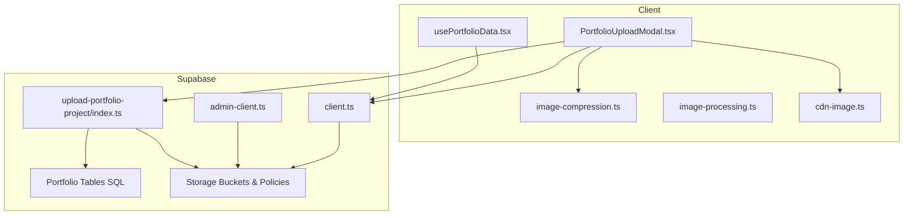
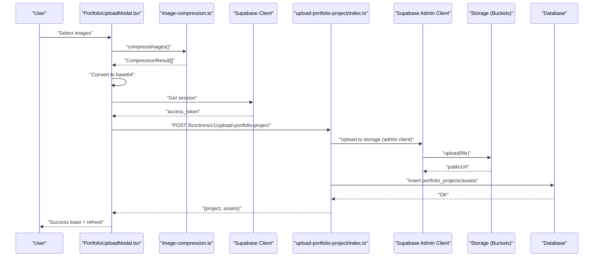
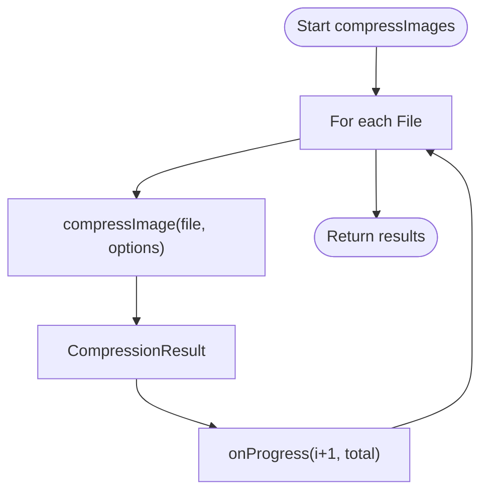
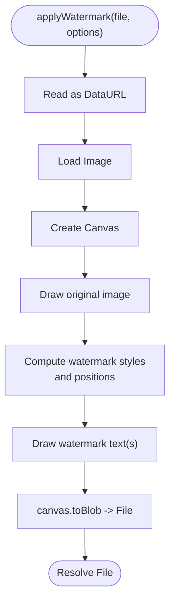
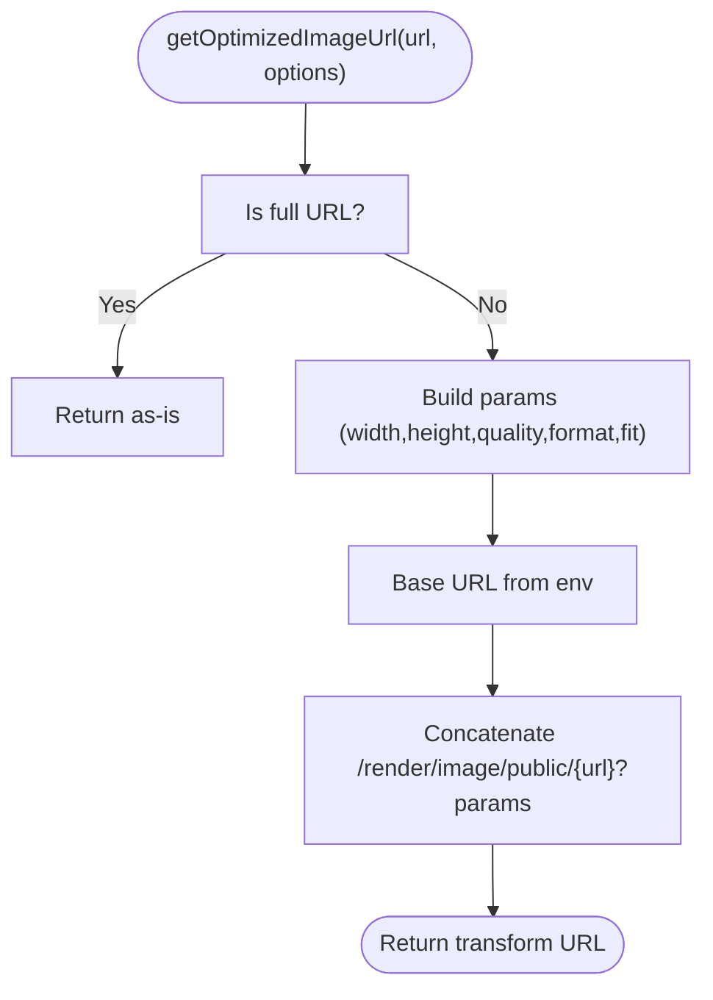
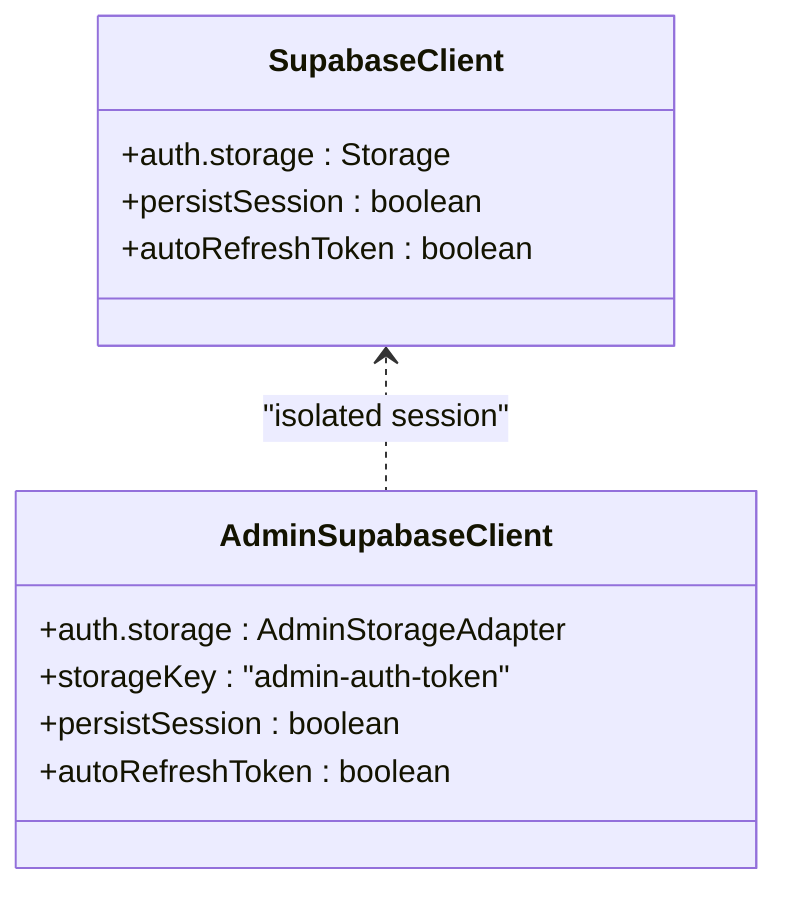
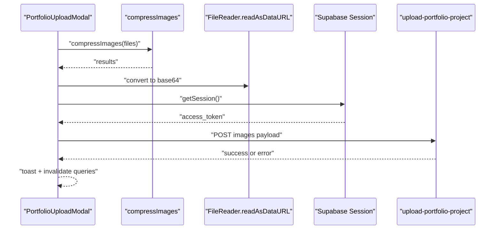
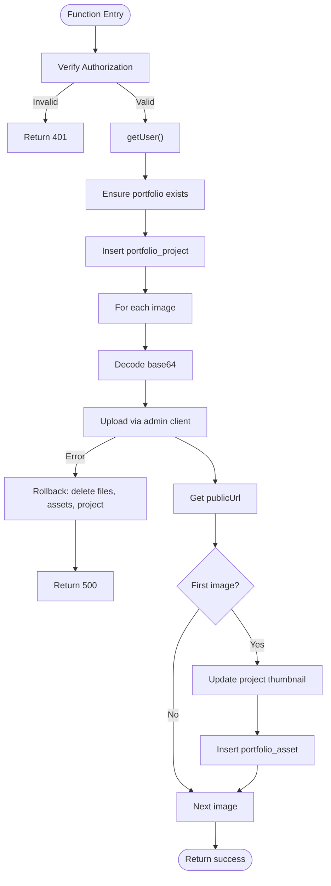
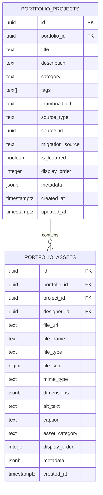
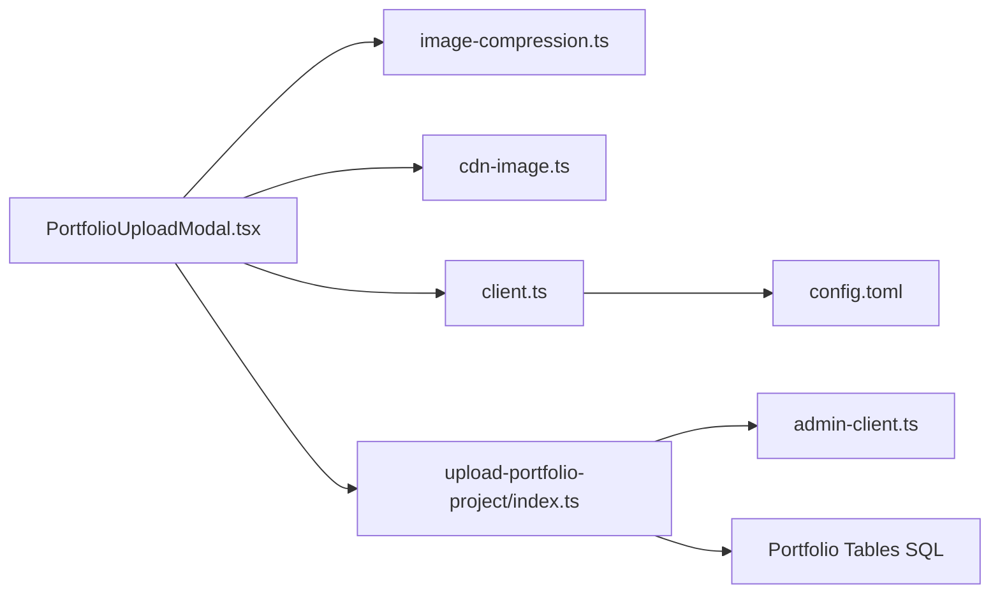

# File Upload & Asset Management

<cite>
**Referenced Files in This Document**
- [image-compression.ts](file://src/lib/image-compression.ts)
- [image-processing.ts](file://src/lib/image-processing.ts)
- [cdn-image.ts](file://src/lib/cdn-image.ts)
- [client.ts](file://src/integrations/supabase/client.ts)
- [admin-client.ts](file://src/integrations/supabase/admin-client.ts)
- [PortfolioUploadModal.tsx](file://src/components/portfolio/PortfolioUploadModal.tsx)
- [usePortfolioData.tsx](file://src/hooks/usePortfolioData.tsx)
- [index.ts](file://supabase/functions/upload-portfolio-project/index.ts)
- [20260127230305_create_portfolio_tables.sql](file://supabase/migrations/20260127230305_create_portfolio_tables.sql)
- [20260130030000_stylebox_storage_and_watermarking.sql](file://supabase/migrations/20260130030000_stylebox_storage_and_watermarking.sql)
- [20260126020000_fix_all_storage_buckets.sql](file://supabase/migrations/20260126020000_fix_all_storage_buckets.sql)
- [config.toml](file://supabase/config.toml)
- [images.ts](file://src/lib/images.ts)
- [designer-submissions.ts](file://src/types/designer-submissions.ts)
</cite>

## Table of Contents
1. [Introduction](#introduction)
2. [Project Structure](#project-structure)
3. [Core Components](#core-components)
4. [Architecture Overview](#architecture-overview)
5. [Detailed Component Analysis](#detailed-component-analysis)
6. [Dependency Analysis](#dependency-analysis)
7. [Performance Considerations](#performance-considerations)
8. [Troubleshooting Guide](#troubleshooting-guide)
9. [Conclusion](#conclusion)

## Introduction
This document explains the file upload and asset management system, focusing on the image processing pipeline, compression algorithms, Supabase storage integration, and CDN optimization strategies. It covers asset optimization techniques, security measures for file uploads, delivery optimization, image transformation capabilities, responsive image serving, performance monitoring, error handling, retry mechanisms, and storage management policies.

## Project Structure
The asset management system spans client-side libraries, UI components, Supabase integration clients, serverless functions, and database migrations:
- Client-side libraries provide compression, watermarking, and CDN URL generation.
- UI components orchestrate image selection, compression, and upload flows.
- Supabase clients enable authenticated access and admin isolation.
- Serverless functions handle secure uploads, metadata persistence, and rollback on failure.
- Database migrations define storage buckets, RLS policies, and asset tables.

**Diagram sources**
- [PortfolioUploadModal.tsx](file://src/components/portfolio/PortfolioUploadModal.tsx#L1-L521)
- [image-compression.ts](file://src/lib/image-compression.ts#L1-L124)
- [image-processing.ts](file://src/lib/image-processing.ts#L1-L82)
- [cdn-image.ts](file://src/lib/cdn-image.ts#L1-L195)
- [usePortfolioData.tsx](file://src/hooks/usePortfolioData.tsx#L1-L117)
- [client.ts](file://src/integrations/supabase/client.ts#L1-L17)
- [admin-client.ts](file://src/integrations/supabase/admin-client.ts#L1-L28)
- [index.ts](file://supabase/functions/upload-portfolio-project/index.ts#L1-L300)
- [20260127230305_create_portfolio_tables.sql](file://supabase/migrations/20260127230305_create_portfolio_tables.sql#L1-L86)
- [20260126020000_fix_all_storage_buckets.sql](file://supabase/migrations/20260126020000_fix_all_storage_buckets.sql#L1-L452)

**Section sources**
- [PortfolioUploadModal.tsx](file://src/components/portfolio/PortfolioUploadModal.tsx#L1-L521)
- [image-compression.ts](file://src/lib/image-compression.ts#L1-L124)
- [cdn-image.ts](file://src/lib/cdn-image.ts#L1-L195)
- [client.ts](file://src/integrations/supabase/client.ts#L1-L17)
- [admin-client.ts](file://src/integrations/supabase/admin-client.ts#L1-L28)
- [index.ts](file://supabase/functions/upload-portfolio-project/index.ts#L1-L300)
- [20260127230305_create_portfolio_tables.sql](file://supabase/migrations/20260127230305_create_portfolio_tables.sql#L1-L86)
- [20260126020000_fix_all_storage_buckets.sql](file://supabase/migrations/20260126020000_fix_all_storage_buckets.sql#L1-L452)

## Core Components
- Image compression library: Provides single and batch compression with progress callbacks, saving calculations, and fallback behavior on failure.
- Image processing library: Applies watermarks to images using canvas for internal drafts.
- CDN image utility: Generates optimized CDN URLs with transformations (resize, format, quality), responsive srcsets, presets, lazy loading, preloading, and format detection.
- Supabase clients: Standard client with local storage persistence and admin client with isolated storage for admin sessions.
- Portfolio upload modal: Orchestrates file validation, compression, base64 conversion, and serverless function invocation with progress tracking.
- Portfolio data hook: Fetches portfolio projects and publication statistics via Supabase.
- Serverless function: Validates authorization, manages portfolio/project creation, uploads images to Supabase Storage with admin client, persists asset records, sets thumbnails, and performs transactional rollbacks on failure.
- Database schema: Defines portfolio_projects and portfolio_assets tables with indexes, triggers, RLS, and grants.
- Storage buckets and policies: Configures buckets for avatars, logos, walkthroughs, product-images, and stylebox curation assets with per-bucket limits and RLS policies.

**Section sources**
- [image-compression.ts](file://src/lib/image-compression.ts#L1-L124)
- [image-processing.ts](file://src/lib/image-processing.ts#L1-L82)
- [cdn-image.ts](file://src/lib/cdn-image.ts#L1-L195)
- [client.ts](file://src/integrations/supabase/client.ts#L1-L17)
- [admin-client.ts](file://src/integrations/supabase/admin-client.ts#L1-L28)
- [PortfolioUploadModal.tsx](file://src/components/portfolio/PortfolioUploadModal.tsx#L1-L521)
- [usePortfolioData.tsx](file://src/hooks/usePortfolioData.tsx#L1-L117)
- [index.ts](file://supabase/functions/upload-portfolio-project/index.ts#L1-L300)
- [20260127230305_create_portfolio_tables.sql](file://supabase/migrations/20260127230305_create_portfolio_tables.sql#L1-L86)
- [20260126020000_fix_all_storage_buckets.sql](file://supabase/migrations/20260126020000_fix_all_storage_buckets.sql#L1-L452)
- [20260130030000_stylebox_storage_and_watermarking.sql](file://supabase/migrations/20260130030000_stylebox_storage_and_watermarking.sql#L1-L45)

## Architecture Overview
The upload flow begins in the UI, moves through compression and base64 conversion, invokes a serverless function for secure storage, and persists metadata to the database. CDN utilities optimize delivery and responsive serving.

**Diagram sources**
- [PortfolioUploadModal.tsx](file://src/components/portfolio/PortfolioUploadModal.tsx#L75-L151)
- [image-compression.ts](file://src/lib/image-compression.ts#L69-L86)
- [client.ts](file://src/integrations/supabase/client.ts#L1-L17)
- [index.ts](file://supabase/functions/upload-portfolio-project/index.ts#L111-L138)
- [admin-client.ts](file://src/integrations/supabase/admin-client.ts#L1-L28)

## Detailed Component Analysis

### Image Compression Pipeline
- Single and batch compression with configurable options (max size, dimensions, Web Worker usage, target format, initial quality).
- Progress reporting and cumulative savings calculation.
- Graceful fallback: on compression failure, the original file is returned with zero savings metrics.

**Diagram sources**
- [image-compression.ts](file://src/lib/image-compression.ts#L69-L86)
- [image-compression.ts](file://src/lib/image-compression.ts#L30-L64)

**Section sources**
- [image-compression.ts](file://src/lib/image-compression.ts#L1-L124)

### Image Watermarking
- Applies a configurable watermark overlay to images using canvas, supporting text, opacity, color, and rotation.
- Returns a new File object suitable for upload.

**Diagram sources**
- [image-processing.ts](file://src/lib/image-processing.ts#L17-L81)

**Section sources**
- [image-processing.ts](file://src/lib/image-processing.ts#L1-L82)

### CDN Optimization and Responsive Serving
- Generates optimized CDN URLs with transformation parameters (width, height, quality, format, fit).
- Provides presets for product and designer images.
- Builds responsive srcsets for multiple widths and formats.
- Implements lazy loading with native loading/eager fallback and Intersection Observer.
- Preloads critical images for LCP optimization.
- Detects browser support for AVIF/WebP/JPEG to choose optimal formats.

**Diagram sources**
- [cdn-image.ts](file://src/lib/cdn-image.ts#L22-L53)

**Section sources**
- [cdn-image.ts](file://src/lib/cdn-image.ts#L1-L195)

### Supabase Clients and Isolation
- Standard client configured with localStorage-backed persistence and automatic token refresh.
- Admin client uses a separate storage namespace and storage key to isolate admin sessions from designer/studio sessions.

**Diagram sources**
- [client.ts](file://src/integrations/supabase/client.ts#L11-L17)
- [admin-client.ts](file://src/integrations/supabase/admin-client.ts#L8-L12)
- [admin-client.ts](file://src/integrations/supabase/admin-client.ts#L16-L27)

**Section sources**
- [client.ts](file://src/integrations/supabase/client.ts#L1-L17)
- [admin-client.ts](file://src/integrations/supabase/admin-client.ts#L1-L28)

### Portfolio Upload Modal Workflow
- Validates file types and sizes, compresses images, previews results, and tracks compression/upload progress.
- Converts compressed images to base64, obtains session, and posts to the serverless function.
- On success, invalidates queries and closes the modal; on error, displays toast and resets progress.

**Diagram sources**
- [PortfolioUploadModal.tsx](file://src/components/portfolio/PortfolioUploadModal.tsx#L75-L151)
- [image-compression.ts](file://src/lib/image-compression.ts#L69-L86)

**Section sources**
- [PortfolioUploadModal.tsx](file://src/components/portfolio/PortfolioUploadModal.tsx#L1-L521)
- [image-compression.ts](file://src/lib/image-compression.ts#L1-L124)

### Serverless Function: upload-portfolio-project
- Validates Authorization header and authenticates the user.
- Ensures a portfolio exists for the user; otherwise, creates one.
- Inserts a portfolio project and iterates over images:
  - Decodes base64, generates unique filenames, uploads via admin client, retrieves public URL, sets first image as thumbnail, and inserts asset records.
- On any upload failure, performs a full rollback: deletes uploaded files, removes asset records, and deletes the project.
- Returns success with project and assets or an error with rollback notice.

**Diagram sources**
- [index.ts](file://supabase/functions/upload-portfolio-project/index.ts#L21-L299)

**Section sources**
- [index.ts](file://supabase/functions/upload-portfolio-project/index.ts#L1-L300)

### Database Schema: Portfolio Assets
- portfolio_projects: Stores project metadata, category, tags, thumbnail_url, source tracking, and timestamps.
- portfolio_assets: Stores file metadata, dimensions, alt/caption, category, display order, and timestamps.
- Indexes on foreign keys and created_at improve query performance.
- Row Level Security enabled; grants for authenticated and anonymous access.
- Trigger updates updated_at for projects.

**Diagram sources**
- [20260127230305_create_portfolio_tables.sql](file://supabase/migrations/20260127230305_create_portfolio_tables.sql#L6-L44)

**Section sources**
- [20260127230305_create_portfolio_tables.sql](file://supabase/migrations/20260127230305_create_portfolio_tables.sql#L1-L86)

### Storage Buckets and Policies
- Avatars, logos, walkthrough-files, product-images, and stylebox-curation-assets buckets are created with per-bucket file size limits and allowed MIME types.
- RLS policies enforce visibility and modification rules per bucket, including admin overrides and designer ownership checks.
- The stylebox curation bucket supports diverse media types and restricts access to authenticated users.

**Section sources**
- [20260126020000_fix_all_storage_buckets.sql](file://supabase/migrations/20260126020000_fix_all_storage_buckets.sql#L1-L452)
- [20260130030000_stylebox_storage_and_watermarking.sql](file://supabase/migrations/20260130030000_stylebox_storage_and_watermarking.sql#L1-L45)

### Portfolio Data Fetching
- Uses the authenticated Supabase client to fetch portfolio projects and publication statistics for the current user.
- Aggregates counts for published and pipeline statuses and computes unique collections from categories.

**Section sources**
- [usePortfolioData.tsx](file://src/hooks/usePortfolioData.tsx#L1-L117)

### Additional Image Utilities
- Centralized image URLs for public site placeholders and marketing assets.
- Type definitions for designer submissions include file upload progress, deliverable requirements, and watermarking flags.

**Section sources**
- [images.ts](file://src/lib/images.ts#L1-L95)
- [designer-submissions.ts](file://src/types/designer-submissions.ts#L126-L181)

## Dependency Analysis
- UI depends on compression and CDN utilities, Supabase clients, and the serverless function endpoint.
- Serverless function depends on Supabase clients (service role for storage), Supabase Storage, and database tables.
- Database depends on RLS policies and grants enforced by migrations.
- Supabase configuration controls JWT verification for selected functions.

**Diagram sources**
- [PortfolioUploadModal.tsx](file://src/components/portfolio/PortfolioUploadModal.tsx#L1-L521)
- [image-compression.ts](file://src/lib/image-compression.ts#L1-L124)
- [cdn-image.ts](file://src/lib/cdn-image.ts#L1-L195)
- [client.ts](file://src/integrations/supabase/client.ts#L1-L17)
- [admin-client.ts](file://src/integrations/supabase/admin-client.ts#L1-L28)
- [index.ts](file://supabase/functions/upload-portfolio-project/index.ts#L1-L300)
- [20260127230305_create_portfolio_tables.sql](file://supabase/migrations/20260127230305_create_portfolio_tables.sql#L1-L86)
- [config.toml](file://supabase/config.toml#L1-L71)

**Section sources**
- [PortfolioUploadModal.tsx](file://src/components/portfolio/PortfolioUploadModal.tsx#L1-L521)
- [client.ts](file://src/integrations/supabase/client.ts#L1-L17)
- [admin-client.ts](file://src/integrations/supabase/admin-client.ts#L1-L28)
- [index.ts](file://supabase/functions/upload-portfolio-project/index.ts#L1-L300)
- [20260127230305_create_portfolio_tables.sql](file://supabase/migrations/20260127230305_create_portfolio_tables.sql#L1-L86)
- [config.toml](file://supabase/config.toml#L1-L71)

## Performance Considerations
- Compression reduces payload size and improves upload throughput; savings are calculated and surfaced to users.
- CDN transformations enable on-the-fly resizing, cropping, and format conversion to reduce bandwidth and improve rendering performance.
- Responsive srcsets deliver appropriately sized images per viewport, minimizing over-fetching.
- Lazy loading defers offscreen images; preloading prioritizes critical images for LCP.
- WebP/AVIF detection ensures optimal visual fidelity with minimal file size.
- Database indexing on foreign keys and created_at timestamps accelerates queries.

[No sources needed since this section provides general guidance]

## Troubleshooting Guide
- Compression failures: The compression utility returns the original file with zero savings; verify browser support and worker availability.
- Upload failures: The serverless function performs a full rollback on any error, ensuring consistency; check Authorization header, service role key, and storage permissions.
- Access denied: Verify RLS policies for the bucket and user role; ensure correct bucket ID and folder naming.
- CDN not applied: Confirm transformation parameters and that the URL is a storage path, not a full external URL.
- Admin isolation: Ensure admin client storage adapter is used for admin sessions to prevent token collisions.

**Section sources**
- [image-compression.ts](file://src/lib/image-compression.ts#L53-L63)
- [index.ts](file://supabase/functions/upload-portfolio-project/index.ts#L41-L54)
- [index.ts](file://supabase/functions/upload-portfolio-project/index.ts#L228-L273)
- [20260126020000_fix_all_storage_buckets.sql](file://supabase/migrations/20260126020000_fix_all_storage_buckets.sql#L136-L452)
- [cdn-image.ts](file://src/lib/cdn-image.ts#L28-L31)

## Conclusion
The asset management system integrates client-side compression and watermarking, robust serverless upload handling with transactional rollbacks, and Supabase Storage with strict RLS policies. CDN utilities and responsive serving strategies ensure fast, efficient delivery while maintaining strong security and reliability. The modular design enables easy extension for additional asset types and optimization techniques.