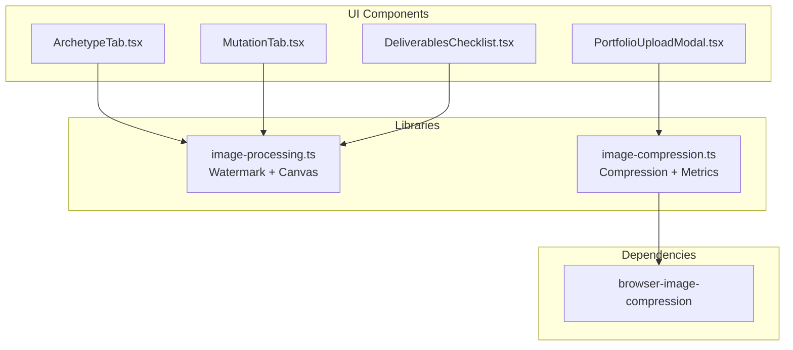
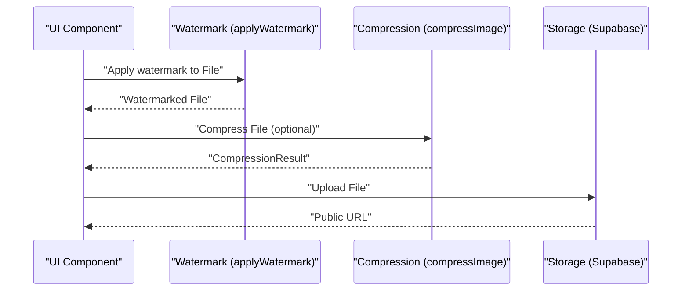
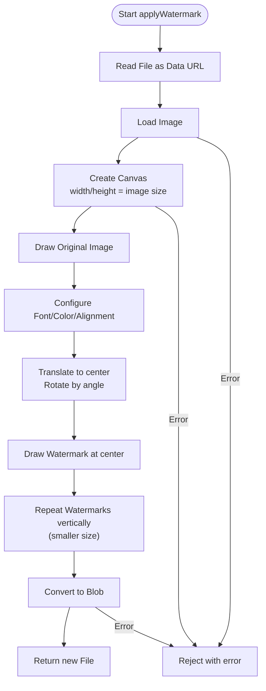
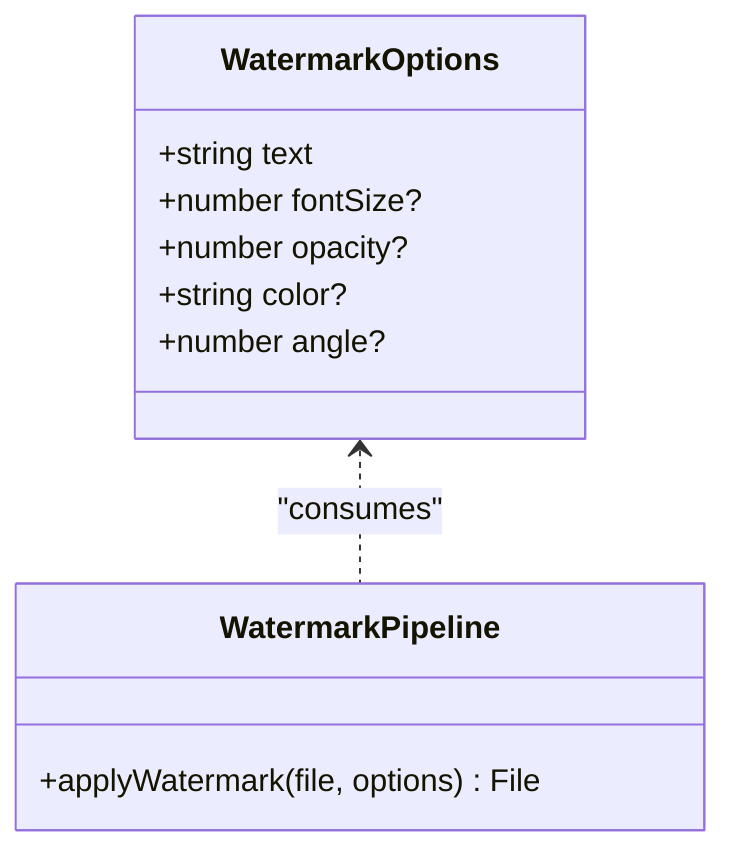
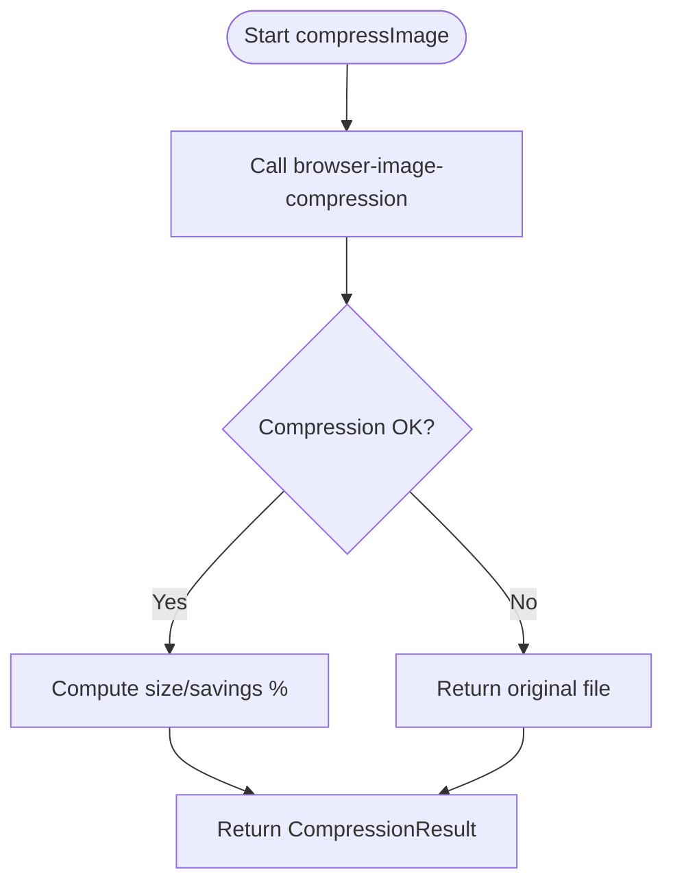
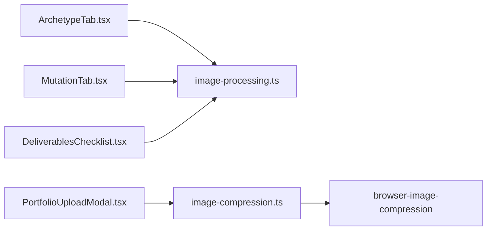

# Image Processing Pipeline

<cite>
**Referenced Files in This Document**
- [image-processing.ts](file://src/lib/image-processing.ts)
- [image-compression.ts](file://src/lib/image-compression.ts)
- [ArchetypeTab.tsx](file://src/components/admin/stylebox-wizard/tabs/ArchetypeTab.tsx)
- [MutationTab.tsx](file://src/components/admin/stylebox-wizard/tabs/MutationTab.tsx)
- [DeliverablesChecklist.tsx](file://src/components/stylebox/workspace/DeliverablesChecklist.tsx)
- [PortfolioUploadModal.tsx](file://src/components/portfolio/PortfolioUploadModal.tsx)
- [package.json](file://package.json)
</cite>

## Table of Contents
1. [Introduction](#introduction)
2. [Project Structure](#project-structure)
3. [Core Components](#core-components)
4. [Architecture Overview](#architecture-overview)
5. [Detailed Component Analysis](#detailed-component-analysis)
6. [Dependency Analysis](#dependency-analysis)
7. [Performance Considerations](#performance-considerations)
8. [Troubleshooting Guide](#troubleshooting-guide)
9. [Conclusion](#conclusion)

## Introduction
This document describes the image processing pipeline used for watermarking, canvas-based image manipulation, compression, and file optimization. It covers the watermark application system with customizable text, opacity, color, and positioning options, canvas techniques for watermark repetition and rotation, compression algorithms for file size optimization, supported image formats, practical configuration examples, performance benchmarks, memory management, and error handling for corrupted files.

## Project Structure
The image processing pipeline is implemented as reusable libraries and integrated into several UI components:
- Core libraries:
  - Watermarking and canvas manipulation: [`src/lib/image-processing.ts`](file://src/lib/image-processing.ts)
  - Compression utilities: [`src/lib/image-compression.ts`](file://src/lib/image-compression.ts)
- UI integrations:
  - Admin stylebox wizard tabs: [`src/components/admin/stylebox-wizard/tabs/ArchetypeTab.tsx`](file://src/components/admin/stylebox-wizard/tabs/ArchetypeTab.tsx), [`src/components/admin/stylebox-wizard/tabs/MutationTab.tsx`](file://src/components/admin/stylebox-wizard/tabs/MutationTab.tsx)
  - Designer deliverables checklist: [`src/components/stylebox/workspace/DeliverablesChecklist.tsx`](file://src/components/stylebox/workspace/DeliverablesChecklist.tsx)
  - Portfolio upload modal: [`src/components/portfolio/PortfolioUploadModal.tsx`](file://src/components/portfolio/PortfolioUploadModal.tsx)
- Dependencies:
  - [`package.json`](file://package.json) declares the browser image compression library used for compression.

**Diagram sources**
- [image-processing.ts](file://src/lib/image-processing.ts#L1-L82)
- [image-compression.ts](file://src/lib/image-compression.ts#L1-L124)
- [ArchetypeTab.tsx](file://src/components/admin/stylebox-wizard/tabs/ArchetypeTab.tsx#L1-L218)
- [MutationTab.tsx](file://src/components/admin/stylebox-wizard/tabs/MutationTab.tsx#L1-L186)
- [DeliverablesChecklist.tsx](file://src/components/stylebox/workspace/DeliverablesChecklist.tsx#L1-L374)
- [PortfolioUploadModal.tsx](file://src/components/portfolio/PortfolioUploadModal.tsx#L1-L521)
- [package.json](file://package.json#L44-L44)

**Section sources**
- [image-processing.ts](file://src/lib/image-processing.ts#L1-L82)
- [image-compression.ts](file://src/lib/image-compression.ts#L1-L124)
- [ArchetypeTab.tsx](file://src/components/admin/stylebox-wizard/tabs/ArchetypeTab.tsx#L1-L218)
- [MutationTab.tsx](file://src/components/admin/stylebox-wizard/tabs/MutationTab.tsx#L1-L186)
- [DeliverablesChecklist.tsx](file://src/components/stylebox/workspace/DeliverablesChecklist.tsx#L1-L374)
- [PortfolioUploadModal.tsx](file://src/components/portfolio/PortfolioUploadModal.tsx#L1-L521)
- [package.json](file://package.json#L44-L44)

## Core Components
- Watermark application (`applyWatermark`)
  - Reads image via FileReader, renders to canvas, draws watermark with configurable text, opacity, color, and angle, repeats watermark vertically for coverage, and converts back to File via canvas.toBlob.
  - Returns a new File with preserved metadata (name, type, lastModified).
- Compression utilities (`compressImage`, `compressImages`)
  - Uses browser-image-compression with defaults: max 2 MB, max 1920px on the largest side, WebP output, initial quality ~0.85, web worker enabled.
  - Provides per-file metrics (original/compressed size, savings, savings percentage) and aggregate totals.

Key capabilities:
- Watermark customization: text, font size, opacity, color, angle.
- Canvas-based drawing with translation and rotation around center.
- Vertical repetition for coverage.
- Compression with progress tracking and error fallback.

**Section sources**
- [image-processing.ts](file://src/lib/image-processing.ts#L6-L20)
- [image-processing.ts](file://src/lib/image-processing.ts#L21-L81)
- [image-compression.ts](file://src/lib/image-compression.ts#L11-L25)
- [image-compression.ts](file://src/lib/image-compression.ts#L30-L63)
- [image-compression.ts](file://src/lib/image-compression.ts#L69-L86)

## Architecture Overview
The pipeline integrates three stages:
1. Watermarking
   - Triggered in admin wizard tabs and designer deliverables checklist for images.
   - Produces a watermarked File for upload.
2. Compression
   - Applied in portfolio uploads to reduce file size while preserving quality.
   - Provides progress and savings metrics.
3. Upload
   - Watermarked/compressed files are uploaded to storage via Supabase.

**Diagram sources**
- [ArchetypeTab.tsx](file://src/components/admin/stylebox-wizard/tabs/ArchetypeTab.tsx#L43-L78)
- [MutationTab.tsx](file://src/components/admin/stylebox-wizard/tabs/MutationTab.tsx#L22-L66)
- [DeliverablesChecklist.tsx](file://src/components/stylebox/workspace/DeliverablesChecklist.tsx#L77-L162)
- [PortfolioUploadModal.tsx](file://src/components/portfolio/PortfolioUploadModal.tsx#L216-L256)
- [image-processing.ts](file://src/lib/image-processing.ts#L17-L81)
- [image-compression.ts](file://src/lib/image-compression.ts#L30-L63)

## Detailed Component Analysis

### Watermark Application System
- Options interface supports:
  - text: watermark text
  - fontSize: optional explicit size
  - opacity: alpha transparency
  - color: fill style
  - angle: rotation in degrees
- Canvas rendering:
  - Loads image via FileReader and Image
  - Creates canvas sized to image
  - Draws original image
  - Configures font, alignment, baseline
  - Translates to center, rotates by angle, draws watermark
  - Repeats watermark vertically with smaller size for coverage
  - Converts to blob and returns new File

**Diagram sources**
- [image-processing.ts](file://src/lib/image-processing.ts#L17-L81)

**Section sources**
- [image-processing.ts](file://src/lib/image-processing.ts#L6-L20)
- [image-processing.ts](file://src/lib/image-processing.ts#L21-L81)

### Canvas-Based Image Manipulation Techniques
- Centered positioning and rotation:
  - Uses translate and rotate around canvas center for angle control.
- Repetition patterns:
  - Draws watermark at center, then above and below for coverage.
- Font scaling:
  - Defaults to proportional font size based on canvas width; secondary smaller size for repetition.

**Diagram sources**
- [image-processing.ts](file://src/lib/image-processing.ts#L6-L20)
- [image-processing.ts](file://src/lib/image-processing.ts#L17-L81)

**Section sources**
- [image-processing.ts](file://src/lib/image-processing.ts#L40-L60)

### Compression Algorithms and Quality Preservation
- Library: browser-image-compression
- Defaults:
  - maxSizeMB: 2
  - maxWidthOrHeight: 1920
  - useWebWorker: true
  - fileType: image/webp
  - initialQuality: 0.85
- Behavior:
  - Returns original file if compression fails
  - Provides per-file metrics and aggregate savings
  - Supports parallel compression with progress callbacks

**Diagram sources**
- [image-compression.ts](file://src/lib/image-compression.ts#L30-L63)
- [image-compression.ts](file://src/lib/image-compression.ts#L69-L86)

**Section sources**
- [image-compression.ts](file://src/lib/image-compression.ts#L11-L25)
- [image-compression.ts](file://src/lib/image-compression.ts#L30-L63)
- [image-compression.ts](file://src/lib/image-compression.ts#L69-L86)

### Supported Image Formats and Integration Points
- Watermarking:
  - Works on any image/* File; preserves original type when converting back to File.
- Compression:
  - Default output type: image/webp
  - Accepts JPEG, PNG, WebP based on UI constraints and browser-image-compression behavior.
- UI integrations:
  - Admin wizard tabs restrict uploads to image/*.
  - Portfolio upload modal restricts to JPEG, PNG, WebP and enforces 10 MB limit.

**Section sources**
- [image-processing.ts](file://src/lib/image-processing.ts#L65-L73)
- [image-compression.ts](file://src/lib/image-compression.ts#L23-L23)
- [ArchetypeTab.tsx](file://src/components/admin/stylebox-wizard/tabs/ArchetypeTab.tsx#L201-L206)
- [PortfolioUploadModal.tsx](file://src/components/portfolio/PortfolioUploadModal.tsx#L46-L46)
- [PortfolioUploadModal.tsx](file://src/components/portfolio/PortfolioUploadModal.tsx#L185-L193)

### Practical Examples and Configuration

- Watermark configuration examples:
  - Default internal draft watermark applied in admin wizard tabs.
  - Designer deliverables checklist applies a custom watermark text and reduced opacity for drafts.
  - Example paths:
    - [ArchetypeTab.tsx](file://src/components/admin/stylebox-wizard/tabs/ArchetypeTab.tsx#L46-L47)
    - [MutationTab.tsx](file://src/components/admin/stylebox-wizard/tabs/MutationTab.tsx#L28-L29)
    - [DeliverablesChecklist.tsx](file://src/components/stylebox/workspace/DeliverablesChecklist.tsx#L88-L94)

- Compression settings examples:
  - Defaults used in portfolio uploads; progress tracking and savings display.
  - Example paths:
    - [PortfolioUploadModal.tsx](file://src/components/portfolio/PortfolioUploadModal.tsx#L220-L227)
    - [PortfolioUploadModal.tsx](file://src/components/portfolio/PortfolioUploadModal.tsx#L242-L248)

- Performance benchmarks:
  - Parallel compression via `compressImages` with progress callbacks.
  - Example path:
    - [PortfolioUploadModal.tsx](file://src/components/portfolio/PortfolioUploadModal.tsx#L216-L256)

**Section sources**
- [ArchetypeTab.tsx](file://src/components/admin/stylebox-wizard/tabs/ArchetypeTab.tsx#L43-L78)
- [MutationTab.tsx](file://src/components/admin/stylebox-wizard/tabs/MutationTab.tsx#L22-L66)
- [DeliverablesChecklist.tsx](file://src/components/stylebox/workspace/DeliverablesChecklist.tsx#L77-L162)
- [PortfolioUploadModal.tsx](file://src/components/portfolio/PortfolioUploadModal.tsx#L216-L256)

## Dependency Analysis
- Internal dependencies:
  - UI components depend on watermark and compression libraries.
- External dependencies:
  - browser-image-compression for compression.
- Import relationships:
  - Watermarking: FileReader → Image → Canvas → toBlob → File
  - Compression: browser-image-compression with defaults and metrics

**Diagram sources**
- [ArchetypeTab.tsx](file://src/components/admin/stylebox-wizard/tabs/ArchetypeTab.tsx#L16-L16)
- [MutationTab.tsx](file://src/components/admin/stylebox-wizard/tabs/MutationTab.tsx#L8-L8)
- [DeliverablesChecklist.tsx](file://src/components/stylebox/workspace/DeliverablesChecklist.tsx#L19-L19)
- [PortfolioUploadModal.tsx](file://src/components/portfolio/PortfolioUploadModal.tsx#L27-L27)
- [image-processing.ts](file://src/lib/image-processing.ts#L21-L22)
- [image-compression.ts](file://src/lib/image-compression.ts#L37-L39)
- [package.json](file://package.json#L44-L44)

**Section sources**
- [ArchetypeTab.tsx](file://src/components/admin/stylebox-wizard/tabs/ArchetypeTab.tsx#L1-L218)
- [MutationTab.tsx](file://src/components/admin/stylebox-wizard/tabs/MutationTab.tsx#L1-L186)
- [DeliverablesChecklist.tsx](file://src/components/stylebox/workspace/DeliverablesChecklist.tsx#L1-L374)
- [PortfolioUploadModal.tsx](file://src/components/portfolio/PortfolioUploadModal.tsx#L1-L521)
- [image-processing.ts](file://src/lib/image-processing.ts#L1-L82)
- [image-compression.ts](file://src/lib/image-compression.ts#L1-L124)
- [package.json](file://package.json#L44-L44)

## Performance Considerations
- Canvas rendering:
  - Large images increase memory usage; consider pre-scaling to target dimensions before watermarking.
- Compression:
  - WebP generally yields smaller files than JPEG/PNG; adjust quality and dimensions to balance size and perceived quality.
  - Parallel compression improves throughput for multiple images.
- Browser worker:
  - Web workers offload compression work from the main thread; keep enabled for large batches.
- UI feedback:
  - Progress indicators improve perceived performance during compression and upload.

[No sources needed since this section provides general guidance]

## Troubleshooting Guide
- Watermarking failures:
  - FileReader/FileReader errors lead to rejection; verify file type and size.
  - Canvas context acquisition failures; ensure browser compatibility.
  - Image load failures; verify URL/Data URL validity.
  - Canvas toBlob failures; retry or fall back to original file.
  - Example paths:
    - [image-processing.ts](file://src/lib/image-processing.ts#L21-L81)

- Compression failures:
  - Compression exceptions caught; pipeline falls back to returning the original file with zero savings.
  - Example paths:
    - [image-compression.ts](file://src/lib/image-compression.ts#L36-L63)

- Upload errors:
  - UI components surface errors via toast notifications and prevent upload on failure.
  - Example paths:
    - [ArchetypeTab.tsx](file://src/components/admin/stylebox-wizard/tabs/ArchetypeTab.tsx#L68-L75)
    - [MutationTab.tsx](file://src/components/admin/stylebox-wizard/tabs/MutationTab.tsx#L56-L63)
    - [DeliverablesChecklist.tsx](file://src/components/stylebox/workspace/DeliverablesChecklist.tsx#L151-L158)

**Section sources**
- [image-processing.ts](file://src/lib/image-processing.ts#L21-L81)
- [image-compression.ts](file://src/lib/image-compression.ts#L36-L63)
- [ArchetypeTab.tsx](file://src/components/admin/stylebox-wizard/tabs/ArchetypeTab.tsx#L68-L75)
- [MutationTab.tsx](file://src/components/admin/stylebox-wizard/tabs/MutationTab.tsx#L56-L63)
- [DeliverablesChecklist.tsx](file://src/components/stylebox/workspace/DeliverablesChecklist.tsx#L151-L158)

## Conclusion
The image processing pipeline combines canvas-based watermarking with efficient compression to optimize file size while preserving quality. It is integrated across admin and designer workflows, providing customizable watermark options, robust error handling, and progress feedback for large batches. By leveraging browser-image-compression and canvas APIs, the system balances performance and usability for diverse image formats and use cases.