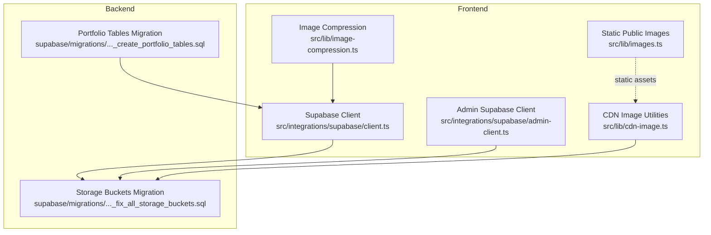
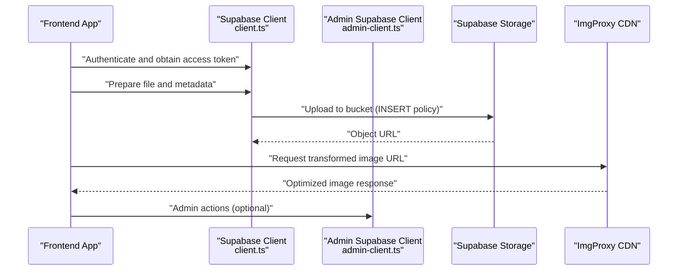
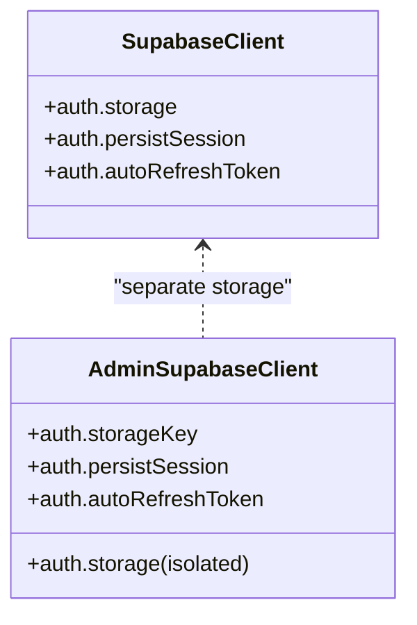
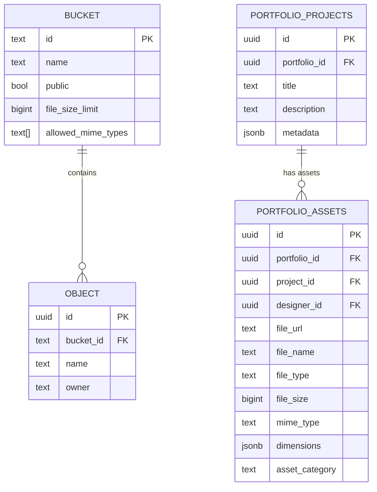
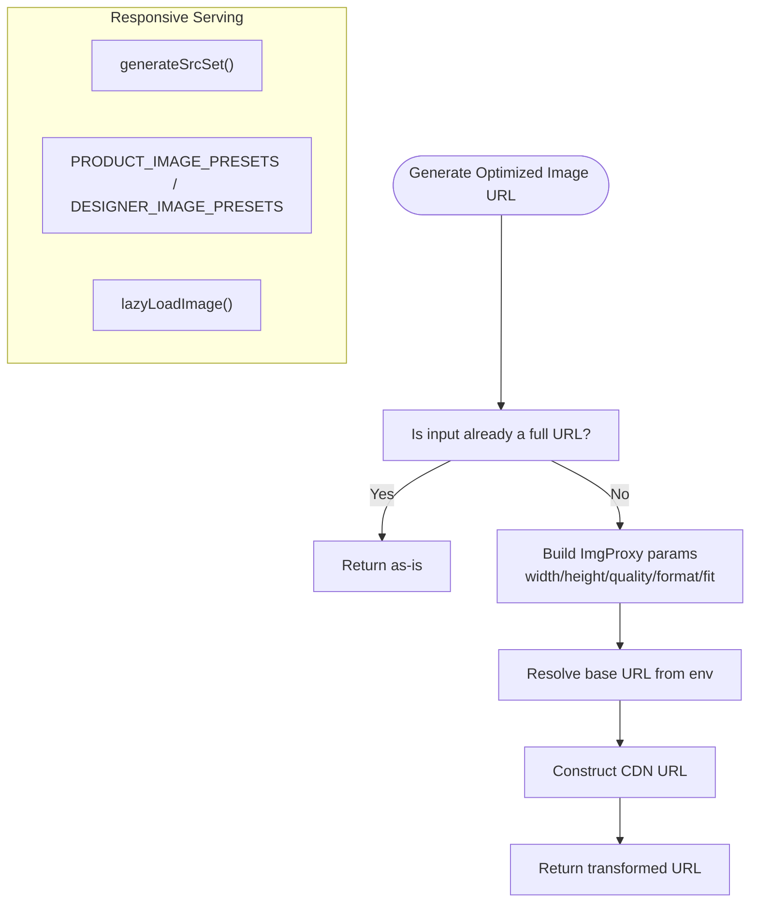
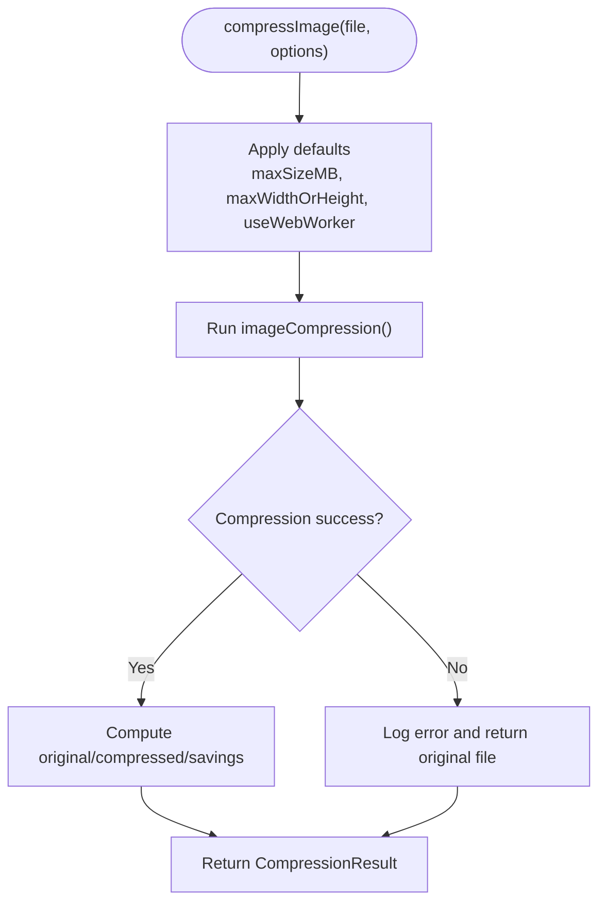
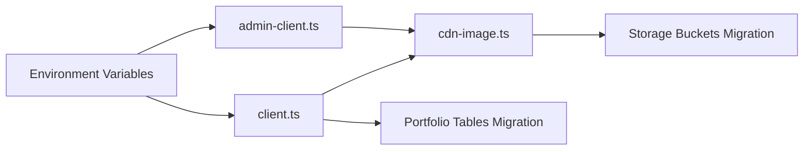

# Storage Integration

<cite>
**Referenced Files in This Document**
- [client.ts](file://src/integrations/supabase/client.ts)
- [admin-client.ts](file://src/integrations/supabase/admin-client.ts)
- [types.ts](file://src/integrations/supabase/types.ts)
- [cdn-image.ts](file://src/lib/cdn-image.ts)
- [image-compression.ts](file://src/lib/image-compression.ts)
- [images.ts](file://src/lib/images.ts)
- [20260126020000_fix_all_storage_buckets.sql](file://supabase/migrations/20260126020000_fix_all_storage_buckets.sql)
- [20260127230305_create_portfolio_tables.sql](file://supabase/migrations/20260127230305_create_portfolio_tables.sql)
</cite>

## Table of Contents
1. [Introduction](#introduction)
2. [Project Structure](#project-structure)
3. [Core Components](#core-components)
4. [Architecture Overview](#architecture-overview)
5. [Detailed Component Analysis](#detailed-component-analysis)
6. [Dependency Analysis](#dependency-analysis)
7. [Performance Considerations](#performance-considerations)
8. [Troubleshooting Guide](#troubleshooting-guide)
9. [Conclusion](#conclusion)

## Introduction
This document explains the storage integration with Supabase across the frontend and backend. It covers:
- File upload workflow and bucket management
- Access control policies and security posture
- CDN optimization strategies, image URL generation, and responsive image serving
- Storage security measures, file validation, and access token management
- Examples of direct upload implementation, progress tracking, and error recovery
- Storage quotas, file size limits, and cleanup policies for temporary files

## Project Structure
The storage integration spans three primary areas:
- Supabase client configuration for frontend apps
- Backend storage buckets and row-level security (RLS) policies
- Frontend image optimization utilities and compression helpers

**Diagram sources**
- [client.ts](file://src/integrations/supabase/client.ts#L1-L17)
- [admin-client.ts](file://src/integrations/supabase/admin-client.ts#L1-L28)
- [cdn-image.ts](file://src/lib/cdn-image.ts#L1-L195)
- [image-compression.ts](file://src/lib/image-compression.ts#L1-L124)
- [images.ts](file://src/lib/images.ts#L1-L95)
- [20260126020000_fix_all_storage_buckets.sql](file://supabase/migrations/20260126020000_fix_all_storage_buckets.sql#L1-L453)
- [20260127230305_create_portfolio_tables.sql](file://supabase/migrations/20260127230305_create_portfolio_tables.sql#L1-L86)

**Section sources**
- [client.ts](file://src/integrations/supabase/client.ts#L1-L17)
- [admin-client.ts](file://src/integrations/supabase/admin-client.ts#L1-L28)
- [cdn-image.ts](file://src/lib/cdn-image.ts#L1-L195)
- [image-compression.ts](file://src/lib/image-compression.ts#L1-L124)
- [images.ts](file://src/lib/images.ts#L1-L95)
- [20260126020000_fix_all_storage_buckets.sql](file://supabase/migrations/20260126020000_fix_all_storage_buckets.sql#L1-L453)
- [20260127230305_create_portfolio_tables.sql](file://supabase/migrations/20260127230305_create_portfolio_tables.sql#L1-L86)

## Core Components
- Supabase clients for authenticated and admin contexts
- CDN image transformation and responsive serving utilities
- Image compression helpers for reducing payload sizes
- Backend storage buckets and RLS policies
- Portfolio asset tables for structured metadata and governance

**Section sources**
- [client.ts](file://src/integrations/supabase/client.ts#L1-L17)
- [admin-client.ts](file://src/integrations/supabase/admin-client.ts#L1-L28)
- [cdn-image.ts](file://src/lib/cdn-image.ts#L1-L195)
- [image-compression.ts](file://src/lib/image-compression.ts#L1-L124)
- [20260126020000_fix_all_storage_buckets.sql](file://supabase/migrations/20260126020000_fix_all_storage_buckets.sql#L1-L453)
- [20260127230305_create_portfolio_tables.sql](file://supabase/migrations/20260127230305_create_portfolio_tables.sql#L1-L86)

## Architecture Overview
The storage architecture combines Supabase Storage with ImgProxy-powered CDN transformations and RLS policies. Frontends use dedicated clients configured with local storage persistence and automatic token refresh. Backend migrations define buckets, limits, allowed MIME types, and fine-grained access rules.

**Diagram sources**
- [client.ts](file://src/integrations/supabase/client.ts#L1-L17)
- [admin-client.ts](file://src/integrations/supabase/admin-client.ts#L1-L28)
- [20260126020000_fix_all_storage_buckets.sql](file://supabase/migrations/20260126020000_fix_all_storage_buckets.sql#L137-L453)

## Detailed Component Analysis

### Supabase Clients
- Authenticated client: persistent session, auto-refresh token, and localStorage-backed storage.
- Admin client: isolated storage keys and separate auth token to prevent cross-session interference.

**Diagram sources**
- [client.ts](file://src/integrations/supabase/client.ts#L11-L17)
- [admin-client.ts](file://src/integrations/supabase/admin-client.ts#L16-L27)

**Section sources**
- [client.ts](file://src/integrations/supabase/client.ts#L1-L17)
- [admin-client.ts](file://src/integrations/supabase/admin-client.ts#L1-L28)

### Storage Buckets and Policies
- Buckets created with explicit public/private visibility, file size limits, and allowed MIME types.
- RLS policies enforce per-user ownership checks and admin overrides where applicable.
- Portfolio asset tables track metadata and enforce RLS for governance.

**Diagram sources**
- [20260126020000_fix_all_storage_buckets.sql](file://supabase/migrations/20260126020000_fix_all_storage_buckets.sql#L10-L134)
- [20260127230305_create_portfolio_tables.sql](file://supabase/migrations/20260127230305_create_portfolio_tables.sql#L6-L43)

**Section sources**
- [20260126020000_fix_all_storage_buckets.sql](file://supabase/migrations/20260126020000_fix_all_storage_buckets.sql#L1-L453)
- [20260127230305_create_portfolio_tables.sql](file://supabase/migrations/20260127230305_create_portfolio_tables.sql#L1-L86)

### CDN Optimization and Image Serving
- Transformations via ImgProxy: width, height, quality, format (webp/avif/jpeg/png), fit modes.
- Presets for product and designer images to ensure consistent rendering.
- Responsive srcset generation and lazy-loading fallbacks.
- Runtime detection of supported image formats for optimal fidelity.

**Diagram sources**
- [cdn-image.ts](file://src/lib/cdn-image.ts#L22-L53)
- [cdn-image.ts](file://src/lib/cdn-image.ts#L59-L70)
- [cdn-image.ts](file://src/lib/cdn-image.ts#L97-L120)
- [cdn-image.ts](file://src/lib/cdn-image.ts#L126-L152)
- [cdn-image.ts](file://src/lib/cdn-image.ts#L171-L194)

**Section sources**
- [cdn-image.ts](file://src/lib/cdn-image.ts#L1-L195)

### Image Compression
- Browser-based compression with configurable max size, resolution, and quality.
- Parallel compression with progress callbacks.
- Fallback to original file if compression fails.

**Diagram sources**
- [image-compression.ts](file://src/lib/image-compression.ts#L30-L64)
- [image-compression.ts](file://src/lib/image-compression.ts#L69-L86)

**Section sources**
- [image-compression.ts](file://src/lib/image-compression.ts#L1-L124)

### Portfolio Asset Metadata
- Structured tables for projects and assets with indexes and triggers for timestamps.
- RLS enabled and grants for authenticated users and anonymous viewers as appropriate.

**Section sources**
- [20260127230305_create_portfolio_tables.sql](file://supabase/migrations/20260127230305_create_portfolio_tables.sql#L1-L86)

## Dependency Analysis
- Frontend clients depend on environment variables for Supabase URL and publishable key.
- CDN utilities depend on the base Supabase URL to construct ImgProxy endpoints.
- Backend migrations define bucket constraints and policies that govern uploads and access.

**Diagram sources**
- [client.ts](file://src/integrations/supabase/client.ts#L5-L6)
- [admin-client.ts](file://src/integrations/supabase/admin-client.ts#L4-L5)
- [cdn-image.ts](file://src/lib/cdn-image.ts#L49-L50)
- [20260126020000_fix_all_storage_buckets.sql](file://supabase/migrations/20260126020000_fix_all_storage_buckets.sql#L1-L453)
- [20260127230305_create_portfolio_tables.sql](file://supabase/migrations/20260127230305_create_portfolio_tables.sql#L1-L86)

**Section sources**
- [client.ts](file://src/integrations/supabase/client.ts#L1-L17)
- [admin-client.ts](file://src/integrations/supabase/admin-client.ts#L1-L28)
- [cdn-image.ts](file://src/lib/cdn-image.ts#L1-L195)
- [20260126020000_fix_all_storage_buckets.sql](file://supabase/migrations/20260126020000_fix_all_storage_buckets.sql#L1-L453)
- [20260127230305_create_portfolio_tables.sql](file://supabase/migrations/20260127230305_create_portfolio_tables.sql#L1-L86)

## Performance Considerations
- Prefer WebP/AVIF when supported; degrade gracefully to JPEG.
- Use responsive srcset and lazy loading to reduce bandwidth and improve LCP.
- Apply compression before upload to minimize transfer size and storage costs.
- Serve images via ImgProxy to avoid exposing raw storage URLs and to centralize transformations.

[No sources needed since this section provides general guidance]

## Troubleshooting Guide
- Upload failures due to size or MIME type: verify bucket limits and allowed types in the migration.
- Access denied errors: confirm RLS policies and that the folder path matches the authenticated user ID.
- Token expiration: ensure auto-refresh is enabled and local storage is accessible.
- CDN transformation errors: validate the base URL and that the storage URL follows the expected bucket/key pattern.

**Section sources**
- [20260126020000_fix_all_storage_buckets.sql](file://supabase/migrations/20260126020000_fix_all_storage_buckets.sql#L137-L453)
- [client.ts](file://src/integrations/supabase/client.ts#L12-L16)
- [admin-client.ts](file://src/integrations/supabase/admin-client.ts#L20-L25)

## Conclusion
The storage integration leverages Supabase Storage with ImgProxy for scalable, secure, and optimized image delivery. Frontend clients are configured for robust authentication and token management, while backend migrations establish strict bucket policies and governance tables. By combining compression, responsive serving, and CDN transformations, the system balances performance, security, and maintainability.