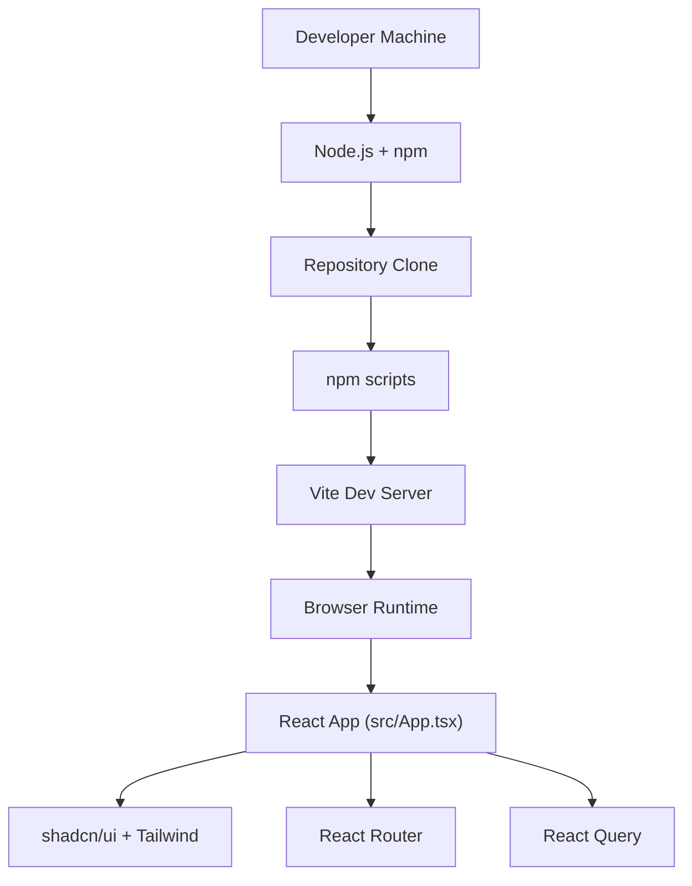
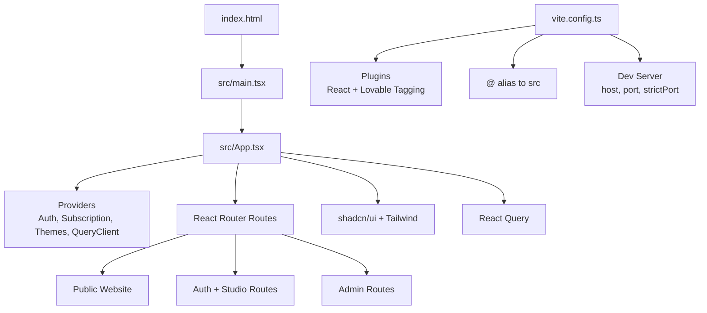
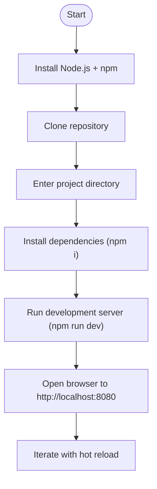
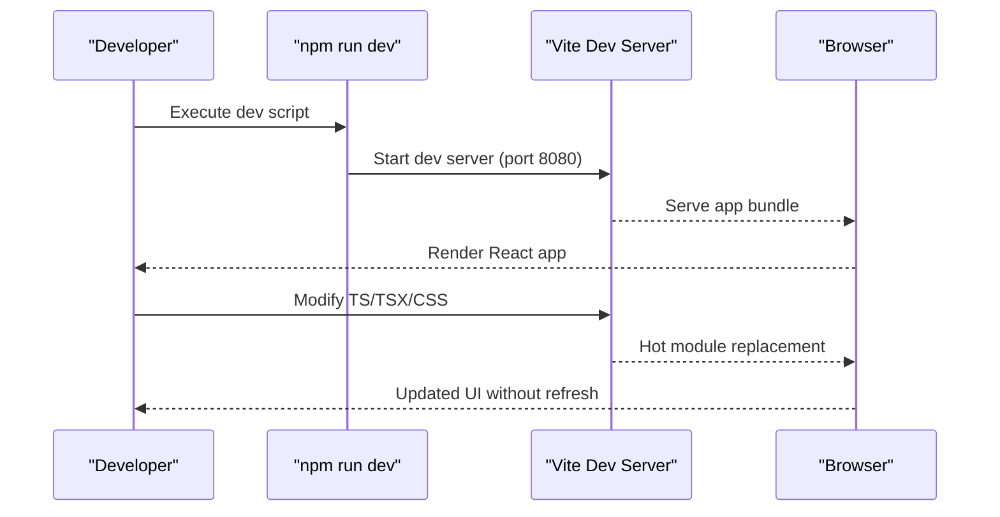
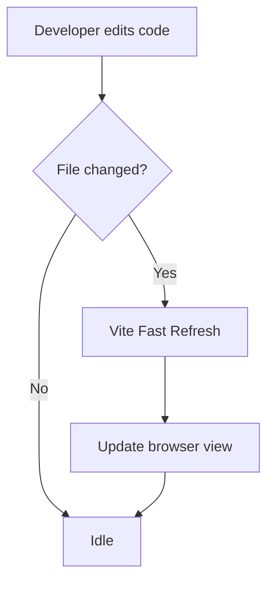
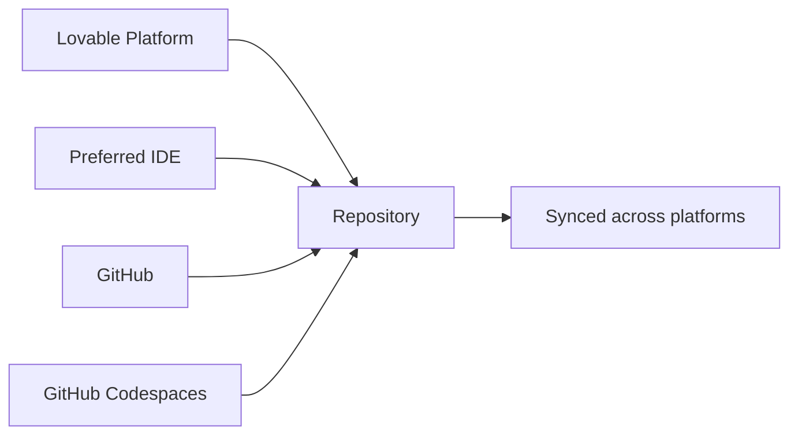
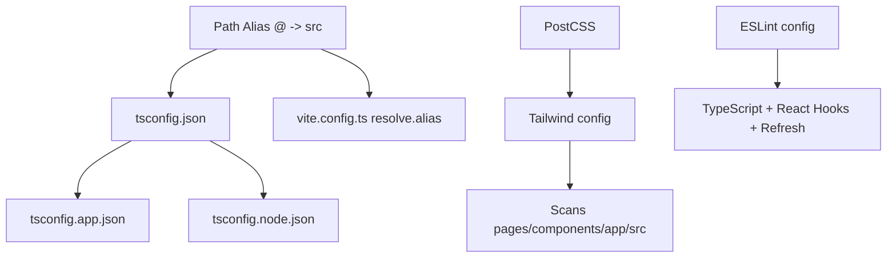
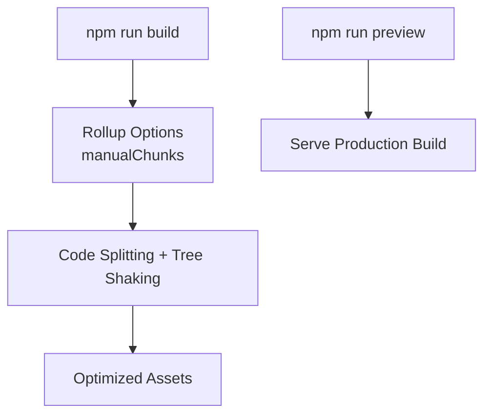
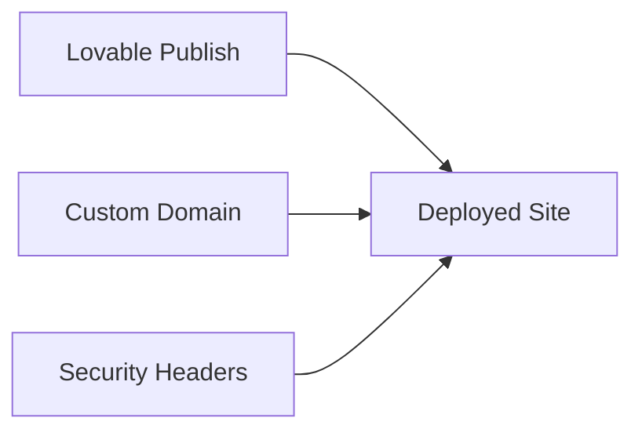
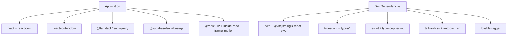

# Getting Started

<cite>
**Referenced Files in This Document**
- [README.md](file://README.md)
- [package.json](file://package.json)
- [vite.config.ts](file://vite.config.ts)
- [tsconfig.json](file://tsconfig.json)
- [tsconfig.app.json](file://tsconfig.app.json)
- [tsconfig.node.json](file://tsconfig.node.json)
- [tailwind.config.ts](file://tailwind.config.ts)
- [postcss.config.js](file://postcss.config.js)
- [eslint.config.js](file://eslint.config.js)
- [components.json](file://components.json)
- [vercel.json](file://vercel.json)
- [index.html](file://index.html)
- [src/main.tsx](file://src/main.tsx)
- [src/App.tsx](file://src/App.tsx)
</cite>

## Table of Contents
1. [Introduction](#introduction)
2. [Project Structure](#project-structure)
3. [Core Components](#core-components)
4. [Architecture Overview](#architecture-overview)
5. [Detailed Component Analysis](#detailed-component-analysis)
6. [Dependency Analysis](#dependency-analysis)
7. [Performance Considerations](#performance-considerations)
8. [Troubleshooting Guide](#troubleshooting-guide)
9. [Conclusion](#conclusion)
10. [Appendices](#appendices)

## Introduction
Welcome to the Adorzia development environment. This guide helps new developers set up the project locally, understand the development workflow, and contribute effectively using Lovable, a preferred IDE, GitHub, or GitHub Codespaces. You will learn how to install prerequisites, clone and bootstrap the project, run the local development server with hot reloading and live preview, and troubleshoot common setup issues.

## Project Structure
Adorzia is a Vite-powered React application with TypeScript, styled using Tailwind CSS and shadcn/ui components. The repository includes:
- Frontend application under src/
- Build and tooling configurations for Vite, TypeScript, ESLint, PostCSS, and Tailwind
- Supabase-related backend functions and database migrations under supabase/
- Static HTML shell and SEO metadata in index.html
- Deployment and security headers configuration for Vercel-like environments

**Diagram sources**
- [package.json](file://package.json#L6-L13)
- [vite.config.ts](file://vite.config.ts#L7-L18)
- [src/App.tsx](file://src/App.tsx#L155-L420)
- [tailwind.config.ts](file://tailwind.config.ts#L3-L5)

**Section sources**
- [README.md](file://README.md#L23-L37)
- [package.json](file://package.json#L6-L13)
- [vite.config.ts](file://vite.config.ts#L1-L39)
- [tsconfig.json](file://tsconfig.json#L1-L17)
- [tailwind.config.ts](file://tailwind.config.ts#L1-L476)
- [postcss.config.js](file://postcss.config.js#L1-L7)
- [index.html](file://index.html#L1-L127)

## Core Components
- Package manager and scripts: npm scripts define development, building, linting, and preview commands.
- Vite configuration: development server, plugin chain, path aliases, and build optimizations.
- TypeScript configuration: app and node configs with bundler resolution and path aliases.
- Styling pipeline: Tailwind CSS with shadcn/ui, PostCSS, and CSS variables.
- Application entry and routing: React root, providers, router, and route groups.

**Section sources**
- [package.json](file://package.json#L6-L13)
- [vite.config.ts](file://vite.config.ts#L7-L39)
- [tsconfig.app.json](file://tsconfig.app.json#L1-L31)
- [tsconfig.node.json](file://tsconfig.node.json#L1-L23)
- [tailwind.config.ts](file://tailwind.config.ts#L3-L5)
- [postcss.config.js](file://postcss.config.js#L1-L7)
- [src/main.tsx](file://src/main.tsx#L1-L46)
- [src/App.tsx](file://src/App.tsx#L155-L420)

## Architecture Overview
The development stack centers on Vite’s fast dev server with React Fast Refresh, TypeScript compilation, and Tailwind CSS processing. The app initializes in index.html and renders the React root in src/main.tsx, which mounts src/App.tsx. Providers wrap routes for authentication, subscriptions, themes, and dual-layer contexts. Routing organizes public, auth/studio, and admin sections.

**Diagram sources**
- [index.html](file://index.html#L123-L126)
- [src/main.tsx](file://src/main.tsx#L1-L46)
- [src/App.tsx](file://src/App.tsx#L155-L420)
- [vite.config.ts](file://vite.config.ts#L7-L18)

## Detailed Component Analysis

### Local Development Setup
Follow these steps to set up the project locally:
- Install prerequisites: Node.js and npm. The project requires Node.js and npm; using nvm is recommended.
- Clone the repository using the project’s Git URL.
- Navigate into the project directory.
- Install dependencies with npm.
- Start the development server with hot reloading and live preview.

**Section sources**
- [README.md](file://README.md#L21-L37)
- [package.json](file://package.json#L6-L13)
- [vite.config.ts](file://vite.config.ts#L8-L12)

### Development Workflow and Hot Reloading
- The dev script launches Vite on port 8080 with strict port enforcement to prevent auto-port switching.
- React Fast Refresh enables hot reloading of components during development.
- The Lovable tagger plugin is conditionally enabled in development to support component tagging.

**Diagram sources**
- [package.json](file://package.json#L7-L7)
- [vite.config.ts](file://vite.config.ts#L7-L13)

**Section sources**
- [package.json](file://package.json#L7-L7)
- [vite.config.ts](file://vite.config.ts#L7-L13)

### Auto-Preview and Live Updates
- The dev server serves the app at http://localhost:8080.
- Changes to source files trigger Fast Refresh, updating the UI instantly.
- The preview script can be used to test the production build locally.

**Section sources**
- [package.json](file://package.json#L13-L13)
- [vite.config.ts](file://vite.config.ts#L8-L12)

### Contribution Methods
- Lovable: Visit the Lovable project page and start prompting; changes are committed automatically.
- Preferred IDE: Clone the repo locally, develop with your IDE, and push changes; synced to Lovable.
- GitHub: Edit files directly on GitHub and commit changes.
- GitHub Codespaces: Launch a Codespace from the repository and edit directly; commit and push changes.

**Section sources**
- [README.md](file://README.md#L11-L21)
- [README.md](file://README.md#L39-L51)

### Environment Configuration
- Path aliases: @ resolves to src via tsconfig and Vite resolve.alias.
- TypeScript: App and node configurations with bundler module resolution.
- Styling: Tailwind scans components/pages/app/src; PostCSS applies Tailwind and Autoprefixer.
- ESLint: TypeScript + React Hooks + React Refresh rules configured.

**Diagram sources**
- [tsconfig.json](file://tsconfig.json#L4-L8)
- [vite.config.ts](file://vite.config.ts#L14-L17)
- [tailwind.config.ts](file://tailwind.config.ts#L3-L5)
- [postcss.config.js](file://postcss.config.js#L1-L7)
- [eslint.config.js](file://eslint.config.js#L1-L27)

**Section sources**
- [tsconfig.json](file://tsconfig.json#L4-L8)
- [tsconfig.app.json](file://tsconfig.app.json#L24-L27)
- [vite.config.ts](file://vite.config.ts#L14-L17)
- [tailwind.config.ts](file://tailwind.config.ts#L3-L5)
- [postcss.config.js](file://postcss.config.js#L1-L7)
- [eslint.config.js](file://eslint.config.js#L1-L27)

### Build and Preview
- Build: Generates optimized bundles with code splitting and vendor chunking.
- Preview: Serves the production build locally for testing.

**Section sources**
- [package.json](file://package.json#L10-L12)
- [vite.config.ts](file://vite.config.ts#L19-L36)

### Deployment and Security Headers
- Deployment: Publish via Lovable’s Share -> Publish.
- Custom domains: Configure under Project > Settings > Domains.
- Security headers: Vercel-compatible headers for content-type options, frame options, XSS protection, referrer policy, permissions policy, and asset caching.

**Section sources**
- [README.md](file://README.md#L63-L74)
- [vercel.json](file://vercel.json#L1-L24)

## Dependency Analysis
- Runtime dependencies include React, React Router, TanStack React Query, Supabase JS, Framer Motion, shadcn/ui primitives, Tailwind variants, and others.
- Dev dependencies include Vite, TypeScript, ESLint, Tailwind, PostCSS, and the Lovable tagger plugin.

**Diagram sources**
- [package.json](file://package.json#L15-L69)
- [package.json](file://package.json#L71-L89)

**Section sources**
- [package.json](file://package.json#L15-L69)
- [package.json](file://package.json#L71-L89)

## Performance Considerations
- Vendor chunking separates React, UI, and data libraries to improve caching and load performance.
- Code splitting and tree shaking reduce bundle sizes.
- Strict port enforcement prevents accidental port conflicts.
- Asset inlining threshold tuned for high-resolution imagery.

**Section sources**
- [vite.config.ts](file://vite.config.ts#L21-L36)
- [vite.config.ts](file://vite.config.ts#L38-L38)

## Troubleshooting Guide
Common setup issues and resolutions:
- Node.js/npm not installed or outdated
  - Ensure Node.js and npm are installed. Using nvm is recommended.
  - Verify installation by checking node -v and npm -v.
- Port conflicts on 8080
  - The dev server enforces strict port usage. Close other services using port 8080 or change the port in Vite configuration.
- Missing dependencies after clone
  - Run npm i to install all dependencies defined in package.json.
- TypeScript path alias not resolving
  - Confirm @ alias is defined in both tsconfig.json and vite.config.ts resolve.alias.
- Tailwind styles not applied
  - Ensure Tailwind scans the correct paths and PostCSS is configured. Check content globs and PostCSS plugins.
- ESLint errors
  - Fix lint violations or adjust rules in eslint.config.js if needed.
- Production preview differs locally
  - Use npm run preview to emulate production builds and confirm behavior.

**Section sources**
- [README.md](file://README.md#L21-L21)
- [vite.config.ts](file://vite.config.ts#L8-L12)
- [vite.config.ts](file://vite.config.ts#L14-L17)
- [tsconfig.json](file://tsconfig.json#L4-L8)
- [tailwind.config.ts](file://tailwind.config.ts#L3-L5)
- [postcss.config.js](file://postcss.config.js#L1-L7)
- [eslint.config.js](file://eslint.config.js#L1-L27)
- [package.json](file://package.json#L13-L13)

## Conclusion
You now have the essentials to set up the Adorzia development environment, run the local server with hot reloading, and contribute via Lovable, IDE, GitHub, or Codespaces. Use the troubleshooting section to resolve common issues and refer to the architecture overview to understand how the pieces fit together.

## Appendices

### Quick Reference
- Install prerequisites: Node.js and npm (recommended: nvm)
- Clone repository and enter directory
- Install dependencies: npm i
- Start dev server: npm run dev
- View site: http://localhost:8080
- Build for production: npm run build
- Preview production build: npm run preview

**Section sources**
- [README.md](file://README.md#L23-L37)
- [package.json](file://package.json#L6-L13)
- [vite.config.ts](file://vite.config.ts#L8-L12)