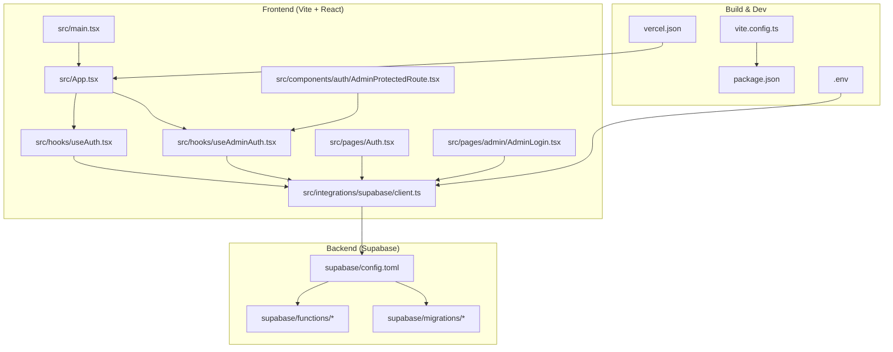
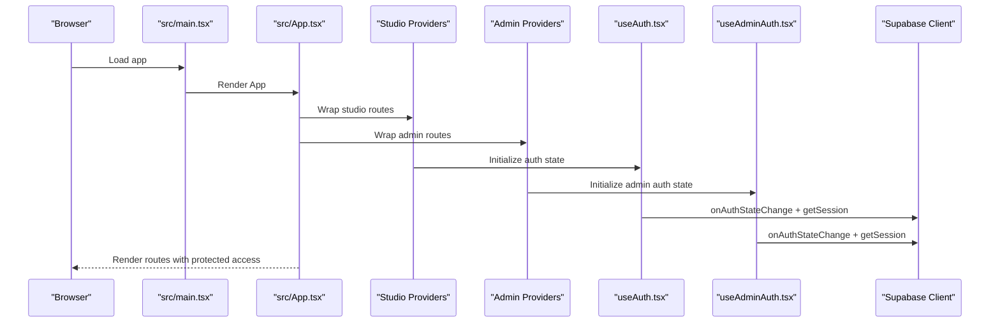
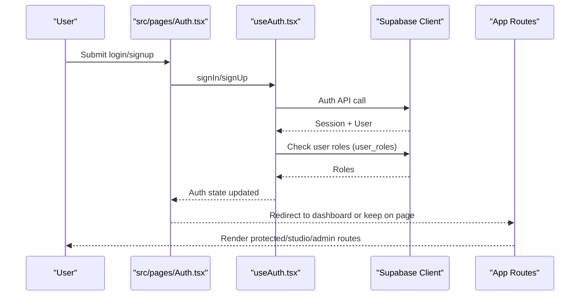
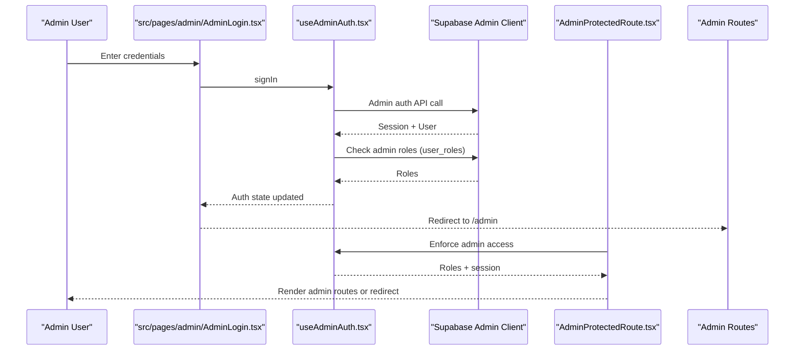
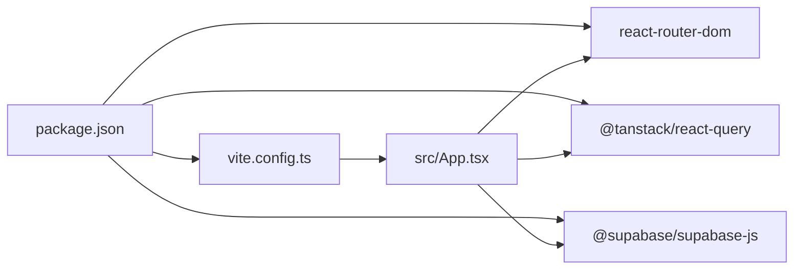

# Getting Started

<cite>
**Referenced Files in This Document**
- [package.json](file://package.json)
- [README.md](file://README.md)
- [.env](file://.env)
- [vite.config.ts](file://vite.config.ts)
- [src/main.tsx](file://src/main.tsx)
- [src/App.tsx](file://src/App.tsx)
- [src/hooks/useAuth.tsx](file://src/hooks/useAuth.tsx)
- [src/hooks/useAdminAuth.tsx](file://src/hooks/useAdminAuth.tsx)
- [src/integrations/supabase/client.ts](file://src/integrations/supabase/client.ts)
- [src/pages/Auth.tsx](file://src/pages/Auth.tsx)
- [src/pages/admin/AdminLogin.tsx](file://src/pages/admin/AdminLogin.tsx)
- [src/components/auth/AdminProtectedRoute.tsx](file://src/components/auth/AdminProtectedRoute.tsx)
- [supabase/config.toml](file://supabase/config.toml)
- [vercel.json](file://vercel.json)
- [PLAN_ADORZIA_CORE_OPERATING_MODEL.md](file://PLAN_ADORZIA_CORE_OPERATING_MODEL.md)
- [DEPLOYMENT_COMMANDS.sh](file://DEPLOYMENT_COMMANDS.sh)
</cite>

## Table of Contents
1. [Introduction](#introduction)
2. [Project Structure](#project-structure)
3. [Core Components](#core-components)
4. [Architecture Overview](#architecture-overview)
5. [Detailed Component Analysis](#detailed-component-analysis)
6. [Dependency Analysis](#dependency-analysis)
7. [Performance Considerations](#performance-considerations)
8. [Troubleshooting Guide](#troubleshooting-guide)
9. [Conclusion](#conclusion)
10. [Appendices](#appendices)

## Introduction
This guide helps you install, configure, and run the Adorzia platform locally. It covers prerequisites, environment setup, local development server startup, project structure overview, key configuration files, initial verification steps, and how to access different user roles (designer, admin, public). It also explains the authentication flow and highlights environment-specific considerations.

## Project Structure
The Adorzia platform is a Vite + React + TypeScript application with Supabase for authentication and backend logic. The frontend is organized by feature areas under src/, with pages, components, hooks, integrations, and libraries. Supabase-related backend logic lives under supabase/.

**Diagram sources**
- [src/main.tsx](file://src/main.tsx#L1-L20)
- [src/App.tsx](file://src/App.tsx#L1-L350)
- [src/hooks/useAuth.tsx](file://src/hooks/useAuth.tsx#L1-L252)
- [src/hooks/useAdminAuth.tsx](file://src/hooks/useAdminAuth.tsx#L1-L216)
- [src/integrations/supabase/client.ts](file://src/integrations/supabase/client.ts#L1-L17)
- [src/pages/Auth.tsx](file://src/pages/Auth.tsx#L1-L451)
- [src/pages/admin/AdminLogin.tsx](file://src/pages/admin/AdminLogin.tsx#L1-L158)
- [src/components/auth/AdminProtectedRoute.tsx](file://src/components/auth/AdminProtectedRoute.tsx#L1-L46)
- [vite.config.ts](file://vite.config.ts#L1-L39)
- [package.json](file://package.json#L1-L88)
- [.env](file://.env#L1-L4)
- [supabase/config.toml](file://supabase/config.toml#L1-L71)
- [vercel.json](file://vercel.json#L1-L16)

**Section sources**
- [package.json](file://package.json#L1-L88)
- [vite.config.ts](file://vite.config.ts#L1-L39)
- [src/App.tsx](file://src/App.tsx#L1-L350)
- [supabase/config.toml](file://supabase/config.toml#L1-L71)

## Core Components
- Build and dev server: Vite configuration defines the dev server host/port, aliases, and build optimizations.
- Routing and providers: App sets up routing, theme, React Query, and provider wrappers for studio and admin contexts.
- Authentication: useAuth manages designer/studio sessions and roles; useAdminAuth manages admin sessions and roles.
- Supabase client: Typed client initialized with Vite environment variables.
- Pages: Public, marketplace, studio (protected), and admin routes are declared in App.
- Admin protection: AdminProtectedRoute enforces admin access and optional superadmin gating.

**Section sources**
- [vite.config.ts](file://vite.config.ts#L1-L39)
- [src/App.tsx](file://src/App.tsx#L1-L350)
- [src/hooks/useAuth.tsx](file://src/hooks/useAuth.tsx#L1-L252)
- [src/hooks/useAdminAuth.tsx](file://src/hooks/useAdminAuth.tsx#L1-L216)
- [src/integrations/supabase/client.ts](file://src/integrations/supabase/client.ts#L1-L17)
- [src/components/auth/AdminProtectedRoute.tsx](file://src/components/auth/AdminProtectedRoute.tsx#L1-L46)

## Architecture Overview
The app initializes providers and routes, then delegates authentication to Supabase. Designer and admin flows are isolated via separate auth contexts and protected routes.

**Diagram sources**
- [src/main.tsx](file://src/main.tsx#L1-L20)
- [src/App.tsx](file://src/App.tsx#L1-L350)
- [src/hooks/useAuth.tsx](file://src/hooks/useAuth.tsx#L1-L252)
- [src/hooks/useAdminAuth.tsx](file://src/hooks/useAdminAuth.tsx#L1-L216)
- [src/integrations/supabase/client.ts](file://src/integrations/supabase/client.ts#L1-L17)

## Detailed Component Analysis

### Prerequisites and Installation
- Node.js and npm are required. The project README provides installation guidance and a step-by-step process.
- Install dependencies and start the dev server using the scripts defined in package.json.

Step-by-step:
1. Install dependencies: npm install
2. Start the development server: npm run dev
3. Open http://localhost:8080 in your browser.

Notes:
- The dev server binds to :: (all interfaces) and runs on port 8080 as configured in vite.config.ts.
- The project README includes a concise setup flow and technology stack overview.

**Section sources**
- [README.md](file://README.md#L21-L37)
- [package.json](file://package.json#L6-L12)
- [vite.config.ts](file://vite.config.ts#L8-L11)

### Environment Setup (.env)
- The project reads Supabase configuration from Vite environment variables prefixed with VITE_.
- Ensure the following variables are present in your .env file:
  - VITE_SUPABASE_URL
  - VITE_SUPABASE_PUBLISHABLE_KEY
  - VITE_SUPABASE_PROJECT_ID

These are consumed by the Supabase client initialization.

Verification tip:
- Confirm the Supabase client resolves these variables at runtime.

**Section sources**
- [.env](file://.env#L1-L4)
- [src/integrations/supabase/client.ts](file://src/integrations/supabase/client.ts#L5-L6)

### Local Development Server Startup
- Use the dev script to start Vite’s development server.
- The server listens on port 8080 and hosts on all interfaces per vite.config.ts.
- The main entry point renders the App inside an ErrorBoundary and global error handlers.

**Section sources**
- [package.json](file://package.json#L7-L7)
- [vite.config.ts](file://vite.config.ts#L8-L11)
- [src/main.tsx](file://src/main.tsx#L1-L20)

### Project Structure Overview
Key directories and files:
- src/pages: Public, marketplace, studio (protected), and admin pages.
- src/components: Shared UI and feature components.
- src/hooks: Custom hooks for auth, subscriptions, cart, analytics, etc.
- src/integrations/supabase: Supabase client and types.
- supabase/: Edge functions and database migrations.
- vite.config.ts, package.json, .env, vercel.json: Build, runtime, and deployment configuration.

**Section sources**
- [src/App.tsx](file://src/App.tsx#L1-L350)
- [supabase/config.toml](file://supabase/config.toml#L1-L71)
- [package.json](file://package.json#L1-L88)
- [vite.config.ts](file://vite.config.ts#L1-L39)
- [vercel.json](file://vercel.json#L1-L16)

### Initial Setup Verification
After starting the dev server:
- Visit the homepage to confirm the public site loads.
- Navigate to /auth to verify the designer login/signup page.
- Navigate to /admin/login to verify the admin login page.
- Check that protected routes redirect unauthenticated users appropriately.

**Section sources**
- [src/App.tsx](file://src/App.tsx#L124-L342)
- [src/pages/Auth.tsx](file://src/pages/Auth.tsx#L1-L451)
- [src/pages/admin/AdminLogin.tsx](file://src/pages/admin/AdminLogin.tsx#L1-L158)

### Accessing Different User Roles
- Public: Access public pages without authentication.
- Designer: Use the login/signup form at /auth. After successful login, you gain access to studio routes.
- Admin: Use the admin login at /admin/login. AdminProtectedRoute enforces admin access and optionally superadmin-only access for certain routes.

Authentication flow highlights:
- Designer auth uses Supabase auth with role checks against user_roles.
- Admin auth uses a separate admin client and role checks.
- AdminProtectedRoute handles redirects and superadmin gating.

**Section sources**
- [src/App.tsx](file://src/App.tsx#L157-L338)
- [src/pages/Auth.tsx](file://src/pages/Auth.tsx#L35-L163)
- [src/pages/admin/AdminLogin.tsx](file://src/pages/admin/AdminLogin.tsx#L17-L68)
- [src/hooks/useAuth.tsx](file://src/hooks/useAuth.tsx#L102-L133)
- [src/hooks/useAdminAuth.tsx](file://src/hooks/useAdminAuth.tsx#L101-L140)
- [src/components/auth/AdminProtectedRoute.tsx](file://src/components/auth/AdminProtectedRoute.tsx#L11-L45)

### Understanding the Authentication Flow

**Diagram sources**
- [src/pages/Auth.tsx](file://src/pages/Auth.tsx#L84-L163)
- [src/hooks/useAuth.tsx](file://src/hooks/useAuth.tsx#L51-L133)
- [src/App.tsx](file://src/App.tsx#L157-L236)

### Admin Authentication and Protection

**Diagram sources**
- [src/pages/admin/AdminLogin.tsx](file://src/pages/admin/AdminLogin.tsx#L32-L68)
- [src/hooks/useAdminAuth.tsx](file://src/hooks/useAdminAuth.tsx#L50-L140)
- [src/components/auth/AdminProtectedRoute.tsx](file://src/components/auth/AdminProtectedRoute.tsx#L11-L45)
- [src/App.tsx](file://src/App.tsx#L241-L338)

### Supabase Edge Functions and JWT Verification
- supabase/config.toml controls whether specific edge functions verify JWTs. Some functions require authenticated admin calls, while others are open.
- These settings influence how admin and studio features interact with backend logic.

**Section sources**
- [supabase/config.toml](file://supabase/config.toml#L1-L71)

### Environment-Specific Considerations
- Vite environment variables: Ensure VITE_SUPABASE_URL, VITE_SUPABASE_PUBLISHABLE_KEY, and VITE_SUPABASE_PROJECT_ID are set in .env.
- Build and hosting: vercel.json defines rewrites and security headers for deployments.
- Development server: vite.config.ts sets host, port, aliases, and build optimizations.

**Section sources**
- [.env](file://.env#L1-L4)
- [vercel.json](file://vercel.json#L1-L16)
- [vite.config.ts](file://vite.config.ts#L7-L38)

## Dependency Analysis
The project uses Vite for bundling, React for UI, Radix UI + shadcn for components, Tailwind CSS for styling, and Supabase for auth and backend functions. Routing is handled by react-router-dom, and state/cache by @tanstack/react-query.

**Diagram sources**
- [package.json](file://package.json#L13-L85)
- [vite.config.ts](file://vite.config.ts#L1-L39)
- [src/App.tsx](file://src/App.tsx#L1-L14)

**Section sources**
- [package.json](file://package.json#L13-L85)
- [vite.config.ts](file://vite.config.ts#L1-L39)
- [src/App.tsx](file://src/App.tsx#L1-L14)

## Performance Considerations
- Vite build settings optimize for fast load times, including manual chunks for vendor libraries, esbuild minification, and CSS code splitting.
- Assets inline limit is configured for efficient handling of small assets.
- These settings help maintain a responsive UI during development and in production builds.

**Section sources**
- [vite.config.ts](file://vite.config.ts#L18-L38)

## Troubleshooting Guide
Common setup issues and resolutions:
- Missing environment variables:
  - Ensure VITE_SUPABASE_URL, VITE_SUPABASE_PUBLISHABLE_KEY, and VITE_SUPABASE_PROJECT_ID are defined in .env.
- Dev server does not start:
  - Verify Node.js and npm versions meet project requirements.
  - Clear node_modules and reinstall dependencies if needed.
- Supabase client errors:
  - Confirm the Supabase URL and key match your project settings.
  - Check that the client is initialized with the correct environment variables.
- Admin access denied:
  - Ensure your user has an appropriate role in the user_roles table.
  - AdminProtectedRoute will redirect to unauthorized if insufficient privileges.
- CORS or auth state issues:
  - Check browser storage for auth tokens and ensure they are persisted as configured.
  - Review global error handlers in main.tsx for unhandled exceptions.

**Section sources**
- [.env](file://.env#L1-L4)
- [src/integrations/supabase/client.ts](file://src/integrations/supabase/client.ts#L5-L17)
- [src/hooks/useAdminAuth.tsx](file://src/hooks/useAdminAuth.tsx#L101-L140)
- [src/components/auth/AdminProtectedRoute.tsx](file://src/components/auth/AdminProtectedRoute.tsx#L18-L45)
- [src/main.tsx](file://src/main.tsx#L6-L13)

## Conclusion
You now have the essentials to install, configure, and run the Adorzia platform locally. Use the .env file to configure Supabase, start the dev server with npm run dev, and explore public, studio, and admin experiences. For deeper operational model guidance, refer to the core operating model plan.

## Appendices
- Additional deployment and edge function guidance is available in the deployment script and operating model plan.

**Section sources**
- [DEPLOYMENT_COMMANDS.sh](file://DEPLOYMENT_COMMANDS.sh#L1-L37)
- [PLAN_ADORZIA_CORE_OPERATING_MODEL.md](file://PLAN_ADORZIA_CORE_OPERATING_MODEL.md#L1-L356)