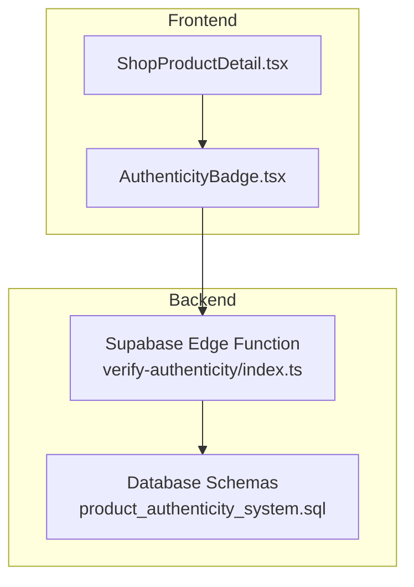
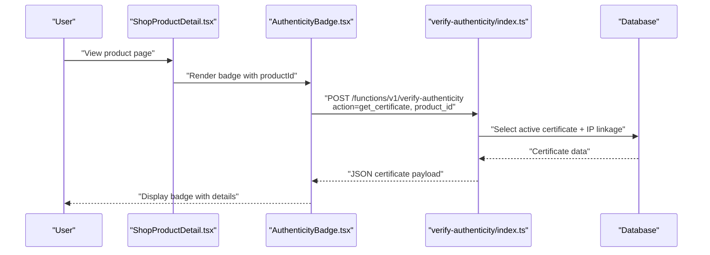
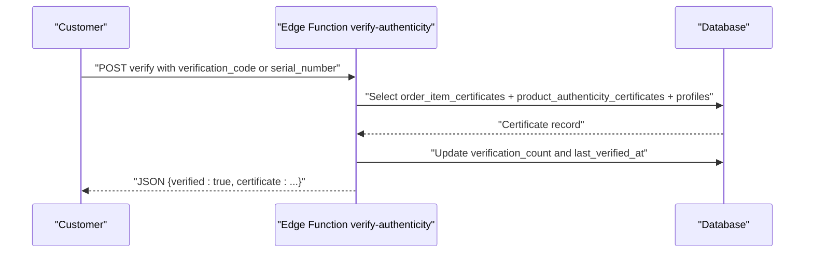
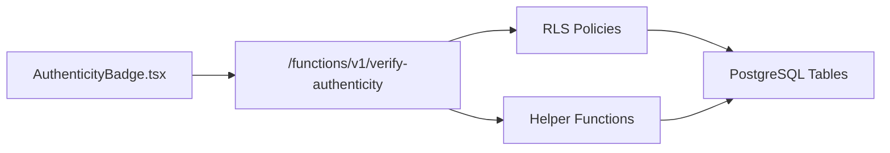

# Authenticity Verification

<cite>
**Referenced Files in This Document**
- [AuthenticityBadge.tsx](file://src/components/marketplace/AuthenticityBadge.tsx)
- [ShopProductDetail.tsx](file://src/pages/shop/ShopProductDetail.tsx)
- [index.ts](file://supabase/functions/verify-authenticity/index.ts)
- [20260127240000_product_authenticity_system.sql](file://supabase/migrations/20260127240000_product_authenticity_system.sql)
- [20260129000000_fix_security_vulnerabilities.sql](file://supabase/migrations/20260129000000_fix_security_vulnerabilities.sql)
- [useMarketplaceProducts.tsx](file://src/hooks/useMarketplaceProducts.tsx)
</cite>

## Table of Contents
1. [Introduction](#introduction)
2. [Project Structure](#project-structure)
3. [Core Components](#core-components)
4. [Architecture Overview](#architecture-overview)
5. [Detailed Component Analysis](#detailed-component-analysis)
6. [Dependency Analysis](#dependency-analysis)
7. [Performance Considerations](#performance-considerations)
8. [Troubleshooting Guide](#troubleshooting-guide)
9. [Conclusion](#conclusion)

## Introduction
This document describes the product authenticity verification system that builds customer trust through a visible badge on product pages, a public verification endpoint, and integrated designer intellectual property (IP) protection. It covers:
- The badge component that displays verification status and certificate details
- Backend verification workflows and certificate generation
- Integration with product metadata and designer profiles
- Trust indicators and user interface patterns
- Practical examples of status management and customer communication

## Project Structure
The authenticity system spans frontend UI, product detail pages, and backend Supabase Edge Functions with database schemas supporting certificates, IP linkage, and verification stats.

**Diagram sources**
- [ShopProductDetail.tsx](file://src/pages/shop/ShopProductDetail.tsx#L184-L185)
- [AuthenticityBadge.tsx](file://src/components/marketplace/AuthenticityBadge.tsx#L17-L42)
- [index.ts](file://supabase/functions/verify-authenticity/index.ts#L35-L47)
- [20260127240000_product_authenticity_system.sql](file://supabase/migrations/20260127240000_product_authenticity_system.sql#L4-L96)

**Section sources**
- [ShopProductDetail.tsx](file://src/pages/shop/ShopProductDetail.tsx#L184-L185)
- [AuthenticityBadge.tsx](file://src/components/marketplace/AuthenticityBadge.tsx#L17-L42)
- [index.ts](file://supabase/functions/verify-authenticity/index.ts#L35-L47)
- [20260127240000_product_authenticity_system.sql](file://supabase/migrations/20260127240000_product_authenticity_system.sql#L4-L96)

## Core Components
- AuthenticityBadge: A product page component that fetches and renders a digital certificate, including designer branding, materials, production info, and IP protections. It supports expand/collapse of detailed certificate data.
- Product Detail Page: Integrates the badge into the product view to reinforce trust signals alongside other badges (shipping, security, returns).
- Verification Endpoint: A Supabase Edge Function that serves three actions: verify (public), get_certificate (public), and generate (admin-only).
- Database Schema: Defines tables for product authenticity certificates, order-item certificates, designer IP registry, and product-to-IP linkage with RLS policies and helper functions.

**Section sources**
- [AuthenticityBadge.tsx](file://src/components/marketplace/AuthenticityBadge.tsx#L17-L157)
- [ShopProductDetail.tsx](file://src/pages/shop/ShopProductDetail.tsx#L184-L185)
- [index.ts](file://supabase/functions/verify-authenticity/index.ts#L27-L33)
- [20260127240000_product_authenticity_system.sql](file://supabase/migrations/20260127240000_product_authenticity_system.sql#L4-L96)

## Architecture Overview
The system follows a clear separation of concerns:
- Frontend queries the verification endpoint to retrieve certificate data for a given product ID.
- The Edge Function performs secure database queries, applies row-level security, and returns structured certificate information.
- The UI renders a trust-indicating badge with optional details expansion.

**Diagram sources**
- [ShopProductDetail.tsx](file://src/pages/shop/ShopProductDetail.tsx#L184-L185)
- [AuthenticityBadge.tsx](file://src/components/marketplace/AuthenticityBadge.tsx#L20-L42)
- [index.ts](file://supabase/functions/verify-authenticity/index.ts#L136-L198)
- [20260127240000_product_authenticity_system.sql](file://supabase/migrations/20260127240000_product_authenticity_system.sql#L138-L160)

## Detailed Component Analysis

### AuthenticityBadge Component
Responsibilities:
- Fetch certificate data for a product via the verification endpoint
- Render a compact badge with a shield icon and “Verified” indicator
- Optionally show detailed certificate information (certificate number, materials, production location/date, designer info)
- Display protected IP badges with type and registration metadata

UI patterns:
- Uses a card container with soft borders and subtle background
- “Verified” shown as an outline badge with a check icon
- Expandable details panel with monospace certificate numbers and right-aligned material lists
- IP section highlights intellectual property types and registration numbers

Badge rendering conditions:
- Shown only when certificate data is available for the product
- Loading state uses a skeleton placeholder while fetching
- Details panel toggled by a link button

Trust signals:
- Designer branding and signature field (when present)
- Crafted-in location and design date
- IP protection badges with registration country/type

**Section sources**
- [AuthenticityBadge.tsx](file://src/components/marketplace/AuthenticityBadge.tsx#L17-L157)

### Product Detail Page Integration
- The product detail page imports and renders the AuthenticityBadge component after the designer’s vision section and before trust badges.
- This placement ensures authenticity appears alongside designer storytelling and complementary trust signals.

**Section sources**
- [ShopProductDetail.tsx](file://src/pages/shop/ShopProductDetail.tsx#L184-L185)

### Verification Backend Workflow
Actions supported:
- verify: Public verification by either verification code or serial number; increments verification counters and returns product and designer metadata.
- get_certificate: Public retrieval of active product certificate and associated IP linkage for badge rendering.
- generate: Admin-only certificate creation using product metadata and a generated certificate hash.

Data returned by get_certificate:
- Certificate number, designer identity, design info, materials, production details, IP registry entries, QR and PDF URLs.

Verification flow:
- Query order_item_certificates joined with product_authenticity_certificates and profiles
- Enforce RLS policy allowing public verification by code
- Update verification_count and last_verified_at upon successful verification

Security and policies:
- Row-level security policies restrict visibility and management actions
- Helper functions generate certificate, serial, and verification codes with deterministic formats

**Section sources**
- [index.ts](file://supabase/functions/verify-authenticity/index.ts#L49-L134)
- [index.ts](file://supabase/functions/verify-authenticity/index.ts#L136-L198)
- [index.ts](file://supabase/functions/verify-authenticity/index.ts#L200-L260)
- [20260127240000_product_authenticity_system.sql](file://supabase/migrations/20260127240000_product_authenticity_system.sql#L98-L139)
- [20260129000000_fix_security_vulnerabilities.sql](file://supabase/migrations/20260129000000_fix_security_vulnerabilities.sql#L166-L209)

### Database Schema and Data Model
Tables and relationships:
- product_authenticity_certificates: Product-level certificate with materials, production info, designer signature, QR/PDF URLs, and IP linkage
- order_item_certificates: Per-item certificate with serial number, verification code, verification stats, and ownership history
- designer_ip_registry: Designer IP registrations (copyright, trademark, patent, design_patent) with status and documents
- product_ip_linkage: Many-to-many between products and IP registrations

Indexes and triggers:
- Indexes on foreign keys and lookup fields
- Triggers to maintain updated_at timestamps

RLS policies:
- Public can view active certificates
- Designers can view own certificates
- Admins can manage all certificates
- Public can verify by code
- Verified IP is publicly readable

Helper functions:
- generate_certificate_number: Deterministic numbering scheme per designer and year
- generate_serial_number: Sequential serial per certificate
- generate_verification_code: Randomized public verification code

**Section sources**
- [20260127240000_product_authenticity_system.sql](file://supabase/migrations/20260127240000_product_authenticity_system.sql#L4-L96)
- [20260127240000_product_authenticity_system.sql](file://supabase/migrations/20260127240000_product_authenticity_system.sql#L151-L214)
- [20260129000000_fix_security_vulnerabilities.sql](file://supabase/migrations/20260129000000_fix_security_vulnerabilities.sql#L166-L209)

### Verification Workflow Sequence

**Diagram sources**
- [index.ts](file://supabase/functions/verify-authenticity/index.ts#L49-L134)

### Badge Rendering Conditions and Trust Indicators
- Visibility: Only rendered when a certificate exists for the product
- Loading: Skeleton card while fetching
- Expand/Collapse: Toggle details panel to show certificate number, materials, production info, and IP badges
- Trust indicators: Designer branding, IP protection badges, QR/PDF URLs, and crafted-in location/date

**Section sources**
- [AuthenticityBadge.tsx](file://src/components/marketplace/AuthenticityBadge.tsx#L44-L52)
- [AuthenticityBadge.tsx](file://src/components/marketplace/AuthenticityBadge.tsx#L80-L150)

### Practical Examples
- Verification status management:
  - On successful verification, the system updates verification_count and last_verified_at
  - Public verification returns a concise payload with product and designer identifiers
- Badge rendering conditions:
  - Certificate number displayed in monospace for easy copy/paste
  - Materials list aligned right for readability
  - IP badges show type and registration number with country
- Customer communication:
  - “Authenticity Guaranteed” header with a shield icon
  - “Protected Intellectual Property” section to highlight legal safeguards
  - Optional QR and PDF certificate URLs for further validation

**Section sources**
- [index.ts](file://supabase/functions/verify-authenticity/index.ts#L94-L102)
- [index.ts](file://supabase/functions/verify-authenticity/index.ts#L103-L133)
- [AuthenticityBadge.tsx](file://src/components/marketplace/AuthenticityBadge.tsx#L65-L78)
- [AuthenticityBadge.tsx](file://src/components/marketplace/AuthenticityBadge.tsx#L121-L140)

## Dependency Analysis
- Frontend depends on:
  - TanStack React Query for caching and fetching
  - Supabase publishable key for API access
- Backend depends on:
  - Supabase client for Postgres operations
  - Row-level security policies for access control
  - Helper functions for deterministic IDs and codes

**Diagram sources**
- [AuthenticityBadge.tsx](file://src/components/marketplace/AuthenticityBadge.tsx#L20-L42)
- [index.ts](file://supabase/functions/verify-authenticity/index.ts#L35-L47)
- [20260127240000_product_authenticity_system.sql](file://supabase/migrations/20260127240000_product_authenticity_system.sql#L98-L139)
- [20260127240000_product_authenticity_system.sql](file://supabase/migrations/20260127240000_product_authenticity_system.sql#L151-L214)

**Section sources**
- [AuthenticityBadge.tsx](file://src/components/marketplace/AuthenticityBadge.tsx#L20-L42)
- [index.ts](file://supabase/functions/verify-authenticity/index.ts#L35-L47)
- [20260127240000_product_authenticity_system.sql](file://supabase/migrations/20260127240000_product_authenticity_system.sql#L98-L139)

## Performance Considerations
- Caching: React Query caches certificate data by productId to reduce repeated network calls.
- Indexes: Database indexes on certificate_number, serial_number, and verification_code improve lookup performance.
- Lightweight UI: Skeleton loading avoids layout shifts during fetch.
- Pagination and timeouts: Related marketplace hooks demonstrate robust error handling and timeouts for network reliability.

**Section sources**
- [AuthenticityBadge.tsx](file://src/components/marketplace/AuthenticityBadge.tsx#L20-L42)
- [20260127240000_product_authenticity_system.sql](file://supabase/migrations/20260127240000_product_authenticity_system.sql#L217-L223)
- [useMarketplaceProducts.tsx](file://src/hooks/useMarketplaceProducts.tsx#L102-L147)

## Troubleshooting Guide
Common issues and resolutions:
- Certificate not found:
  - Ensure product_id is correct and the certificate is active
  - Confirm RLS allows public viewing of active certificates
- Verification failures:
  - Check verification_code or serial_number formatting (uppercased)
  - Verify RLS policy for public verification by code
- Admin certificate generation errors:
  - Confirm Authorization header presence
  - Ensure product exists and designer metadata is available
- Network timeouts:
  - Adjust client-side timeouts and retry logic
  - Validate Supabase function availability and environment variables

**Section sources**
- [index.ts](file://supabase/functions/verify-authenticity/index.ts#L71-L92)
- [index.ts](file://supabase/functions/verify-authenticity/index.ts#L202-L208)
- [20260127240000_product_authenticity_system.sql](file://supabase/migrations/20260127240000_product_authenticity_system.sql#L105-L139)
- [useMarketplaceProducts.tsx](file://src/hooks/useMarketplaceProducts.tsx#L102-L147)

## Conclusion
The authenticity verification system combines a customer-facing badge with a robust backend that enforces security, tracks verification events, and integrates designer IP protections. The modular design enables clear trust signaling, efficient data access, and scalable administration, reinforcing customer confidence in luxury marketplace purchases.