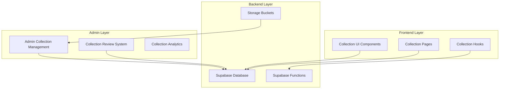
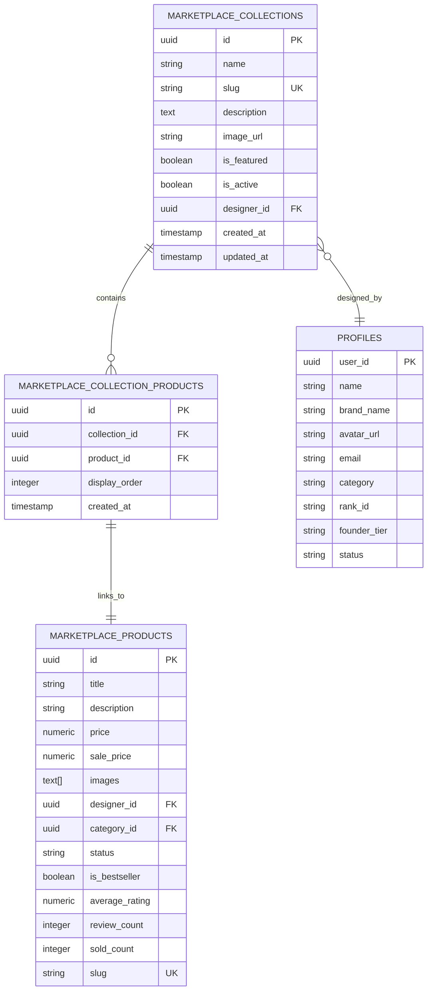
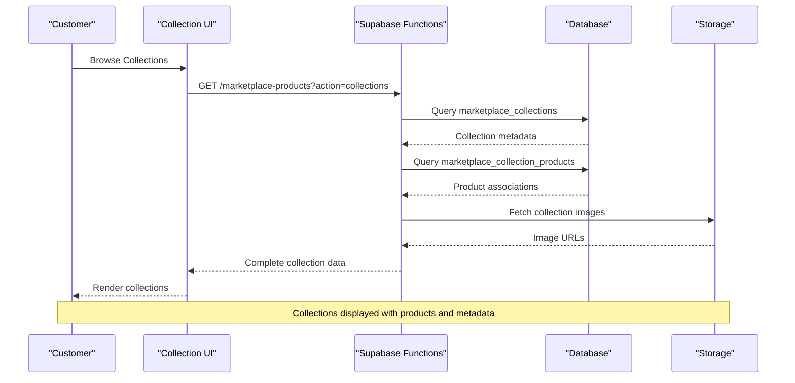
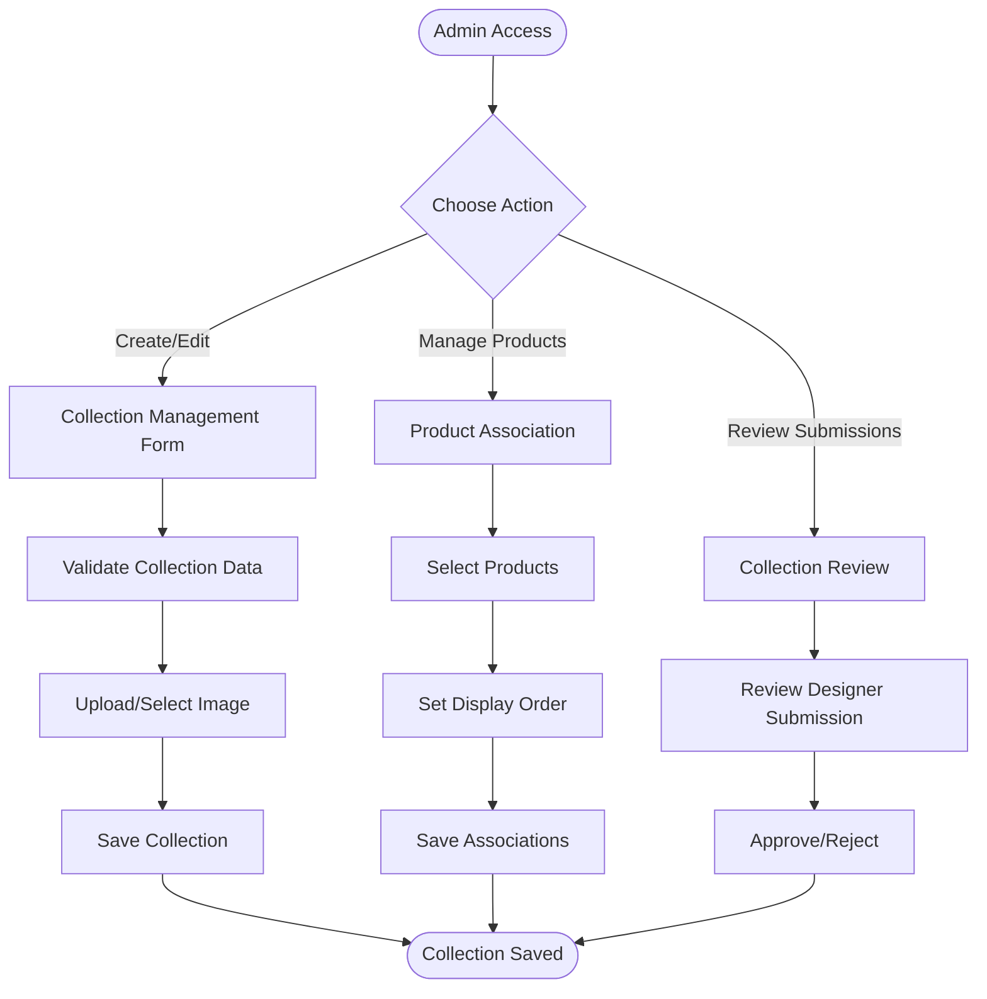
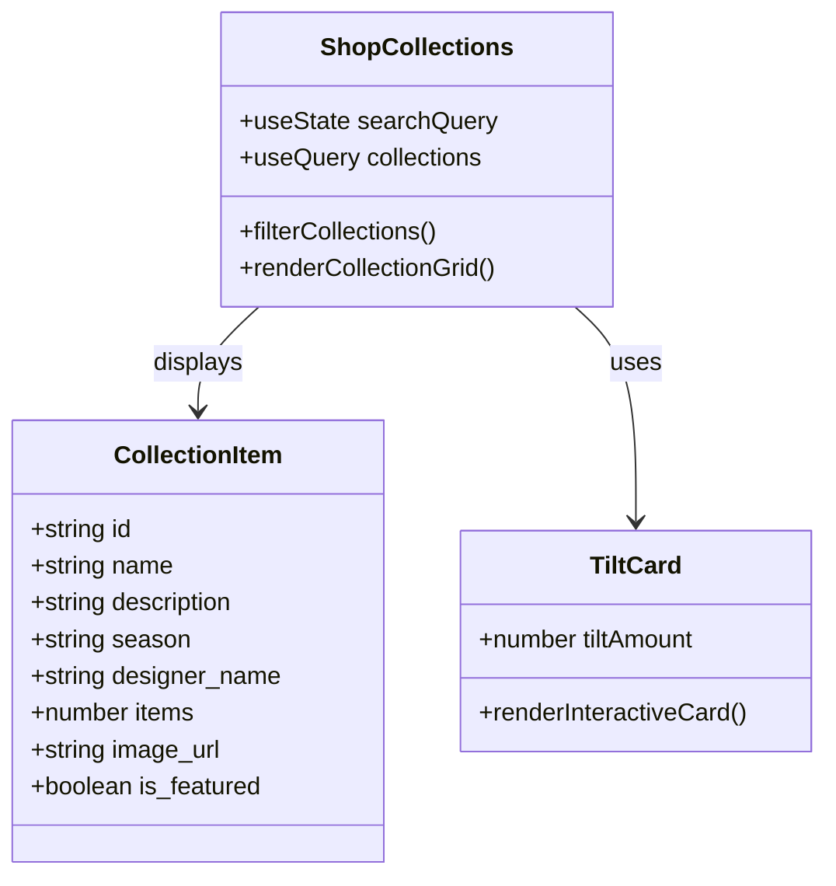
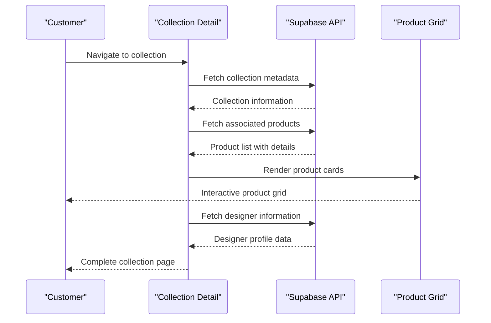
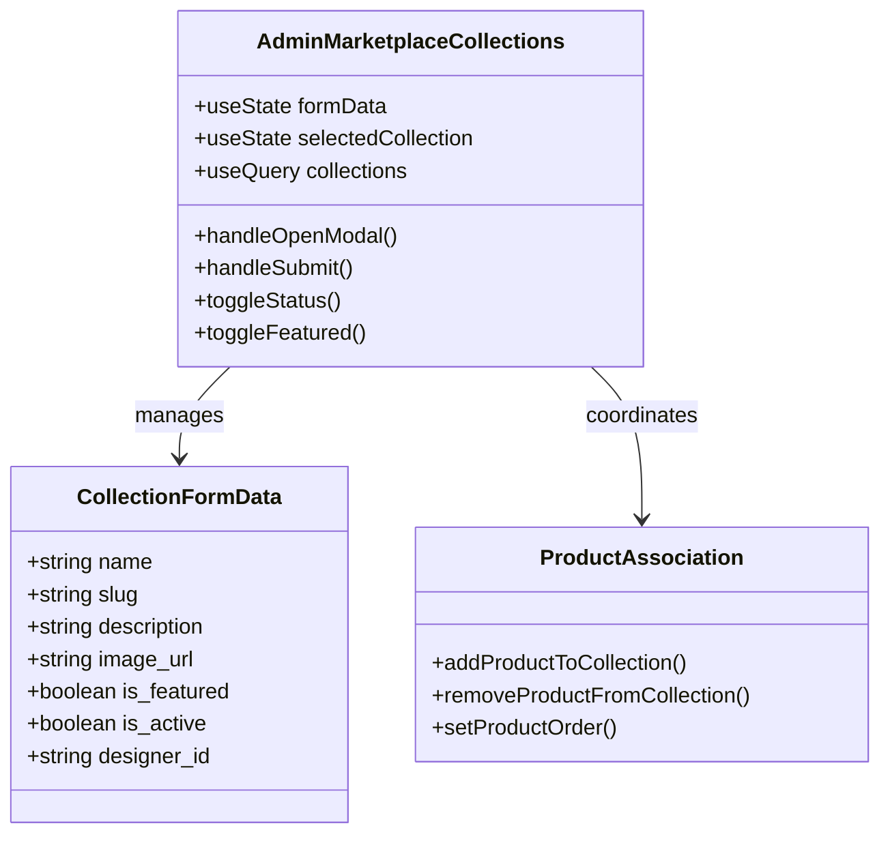
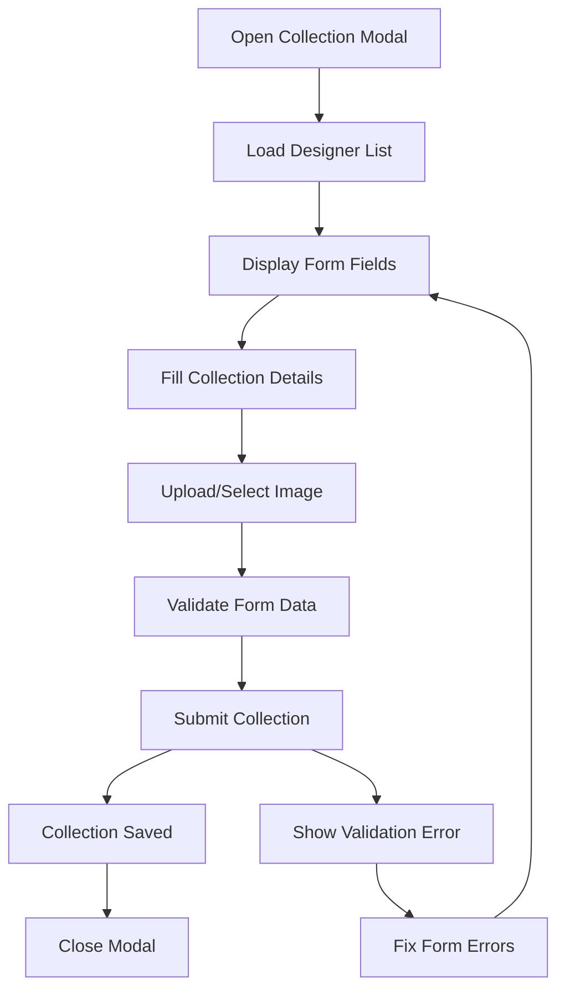
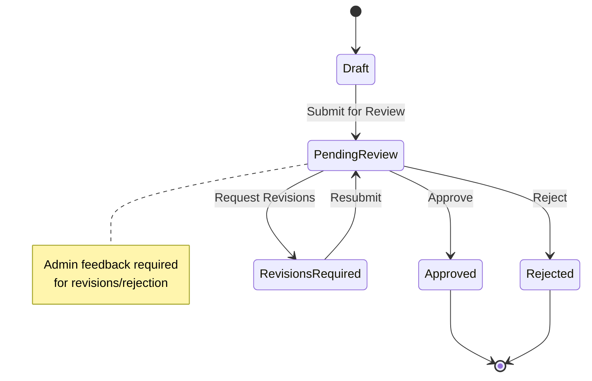
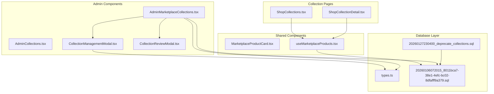

# Collections System

<cite>
**Referenced Files in This Document**
- [ShopCollections.tsx](file://src/pages/shop/ShopCollections.tsx)
- [ShopCollectionDetail.tsx](file://src/pages/shop/ShopCollectionDetail.tsx)
- [AdminCollections.tsx](file://src/pages/admin/AdminCollections.tsx)
- [AdminMarketplaceCollections.tsx](file://src/components/admin/marketplace/AdminMarketplaceCollections.tsx)
- [AdminCollectionsContent.tsx](file://src/components/admin/marketplace/AdminCollectionsContent.tsx)
- [CollectionManagementModal.tsx](file://src/components/admin/CollectionManagementModal.tsx)
- [CollectionReviewModal.tsx](file://src/components/admin/CollectionReviewModal.tsx)
- [MarketplaceProductCard.tsx](file://src/components/marketplace/MarketplaceProductCard.tsx)
- [useMarketplaceProducts.tsx](file://src/hooks/useMarketplaceProducts.tsx)
- [types.ts](file://src/integrations/supabase/types.ts)
- [20260106072015_8011bca7-38e1-4efc-bc02-8dfafff9a379.sql](file://supabase/migrations/20260106072015_8011bca7-38e1-4efc-bc02-8dfafff9a379.sql)
- [20260127230400_deprecate_collections.sql](file://supabase/migrations/20260127230400_deprecate_collections.sql)
</cite>

## Table of Contents
1. [Introduction](#introduction)
2. [Project Structure](#project-structure)
3. [Core Components](#core-components)
4. [Architecture Overview](#architecture-overview)
5. [Detailed Component Analysis](#detailed-component-analysis)
6. [Dependency Analysis](#dependency-analysis)
7. [Performance Considerations](#performance-considerations)
8. [Troubleshooting Guide](#troubleshooting-guide)
9. [Conclusion](#conclusion)

## Introduction

The collections system in Adorzia manages curated product groupings and administrative workflows for marketplace content. This system enables designers to create themed collections while providing administrators with comprehensive tools to manage, organize, and optimize collection-based marketing strategies.

The collections system encompasses three primary areas:
- **Collection Browsing Interface**: Curated product groupings, collection descriptions, and designer showcases
- **Collection Detail Pages**: Product organization, collection metadata, and visual presentation
- **Administrative Management**: Creation, editing, and organizational tools for collections

## Project Structure

The collections system is organized across multiple layers within the Adorzia marketplace architecture:

**Diagram sources**
- [ShopCollections.tsx](file://src/pages/shop/ShopCollections.tsx#L1-L301)
- [AdminMarketplaceCollections.tsx](file://src/components/admin/marketplace/AdminMarketplaceCollections.tsx#L1-L1248)

**Section sources**
- [ShopCollections.tsx](file://src/pages/shop/ShopCollections.tsx#L1-L301)
- [AdminMarketplaceCollections.tsx](file://src/components/admin/marketplace/AdminMarketplaceCollections.tsx#L1-L1248)

## Core Components

### Database Schema Architecture

The collections system is built on a robust database schema with clear relationships between collections, products, and designers:

**Diagram sources**
- [20260106072015_8011bca7-38e1-4efc-bc02-8dfafff9a379.sql](file://supabase/migrations/20260106072015_8011bca7-38e1-4efc-bc02-8dfafff9a379.sql#L19-L40)
- [types.ts](file://src/integrations/supabase/types.ts#L714-L760)

### Collection Data Model

The collection system maintains comprehensive metadata for effective marketing and organization:

| Collection Property | Type | Purpose | Example |
|-------------------|------|---------|---------|
| `id` | UUID | Unique identifier | `uuid_generate_v4()` |
| `name` | String | Collection title | `"SS24: Modern Minimalism"` |
| `slug` | String | URL-friendly identifier | `"ss24-modern-minimalism"` |
| `description` | Text | Marketing copy | `"Clean lines, neutral palettes..."` |
| `image_url` | String | Visual representation | `"https://storage.example.com/collections/ss24.jpg"` |
| `is_featured` | Boolean | Homepage promotion flag | `true/false` |
| `is_active` | Boolean | Visibility status | `true/false` |
| `designer_id` | UUID | Creator attribution | `profiles.user_id` |

**Section sources**
- [20260106072015_8011bca7-38e1-4efc-bc02-8dfafff9a379.sql](file://supabase/migrations/20260106072015_8011bca7-38e1-4efc-bc02-8dfafff9a379.sql#L19-L30)
- [types.ts](file://src/integrations/supabase/types.ts#L714-L726)

## Architecture Overview

The collections system follows a multi-tier architecture with clear separation of concerns:

**Diagram sources**
- [ShopCollections.tsx](file://src/pages/shop/ShopCollections.tsx#L76-L153)
- [useMarketplaceProducts.tsx](file://src/hooks/useMarketplaceProducts.tsx#L260-L314)

### Administrative Workflow

Administrators have comprehensive control over collections through dedicated management interfaces:

**Diagram sources**
- [AdminMarketplaceCollections.tsx](file://src/components/admin/marketplace/AdminMarketplaceCollections.tsx#L202-L241)
- [CollectionManagementModal.tsx](file://src/components/admin/CollectionManagementModal.tsx#L397-L519)

**Section sources**
- [AdminCollections.tsx](file://src/pages/admin/AdminCollections.tsx#L1-L17)
- [AdminMarketplaceCollections.tsx](file://src/components/admin/marketplace/AdminMarketplaceCollections.tsx#L1-L1248)

## Detailed Component Analysis

### Collection Browsing Interface

The frontend collection browsing interface provides an immersive experience for customers to discover curated collections:

**Diagram sources**
- [ShopCollections.tsx](file://src/pages/shop/ShopCollections.tsx#L73-L301)

The collection browsing interface features:

- **Responsive Grid Layout**: Three-column design on desktop, single column on mobile
- **Interactive Elements**: Hover effects, tilt animations, and smooth transitions
- **Search Integration**: Real-time filtering by name and description
- **Designer Attribution**: Clear designer branding and showcase
- **Product Count Display**: Immediate indication of collection size

**Section sources**
- [ShopCollections.tsx](file://src/pages/shop/ShopCollections.tsx#L160-L270)

### Collection Detail Pages

Collection detail pages provide comprehensive information about curated product groupings:

**Diagram sources**
- [ShopCollectionDetail.tsx](file://src/pages/shop/ShopCollectionDetail.tsx#L12-L103)

Key features of collection detail pages:

- **Hero Section**: Full-width collection imagery with gradient overlays
- **Metadata Display**: Season information, description, and designer details
- **Product Organization**: Grid layout with product cards and pricing
- **Designer Showcase**: Profile integration with bio and branding
- **Navigation**: Seamless back-to-collections and product detail links

**Section sources**
- [ShopCollectionDetail.tsx](file://src/pages/shop/ShopCollectionDetail.tsx#L107-L277)

### Administrative Collection Management

Administrators utilize comprehensive tools for managing collections and their associated products:

**Diagram sources**
- [AdminMarketplaceCollections.tsx](file://src/components/admin/marketplace/AdminMarketplaceCollections.tsx#L107-L558)

Administrative capabilities include:

- **Collection Creation**: Complete form with validation and image upload
- **Product Management**: Associate/disassociate products with collections
- **Display Control**: Toggle visibility and featured status
- **Bulk Operations**: Multi-select and batch actions
- **Designer Attribution**: Track collection creators and ownership

**Section sources**
- [AdminMarketplaceCollections.tsx](file://src/components/admin/marketplace/AdminMarketplaceCollections.tsx#L895-L1149)

### Collection Management Modal

The collection management modal provides a comprehensive interface for creating and editing collections:

**Diagram sources**
- [CollectionManagementModal.tsx](file://src/components/admin/CollectionManagementModal.tsx#L51-L519)

Key modal features:

- **Dynamic Form Fields**: Conditional fields based on collection type
- **Image Upload System**: Chunked upload with progress tracking
- **Auto-save Functionality**: Draft preservation for long-form content
- **Validation Integration**: Real-time form validation and error handling
- **Designer Integration**: Automatic designer assignment and attribution

**Section sources**
- [CollectionManagementModal.tsx](file://src/components/admin/CollectionManagementModal.tsx#L1-L969)

### Collection Review System

The collection review system manages designer-submitted collections through a structured approval workflow:

**Diagram sources**
- [CollectionReviewModal.tsx](file://src/components/admin/CollectionReviewModal.tsx#L68-L101)

The review system supports:

- **Multi-tab Interface**: Details, files, and notes presentation
- **Status Tracking**: Visual indicators for current status
- **Feedback System**: Structured communication between admins and designers
- **File Management**: Preview and download of submitted assets
- **Action Workflow**: Streamlined approval, revision, and rejection processes

**Section sources**
- [CollectionReviewModal.tsx](file://src/components/admin/CollectionReviewModal.tsx#L1-L366)

## Dependency Analysis

The collections system exhibits clear dependency relationships across the application architecture:

**Diagram sources**
- [ShopCollections.tsx](file://src/pages/shop/ShopCollections.tsx#L1-L301)
- [AdminMarketplaceCollections.tsx](file://src/components/admin/marketplace/AdminMarketplaceCollections.tsx#L1-L1248)
- [types.ts](file://src/integrations/supabase/types.ts#L714-L760)

### Data Flow Dependencies

The system maintains clear data flow patterns:

1. **Frontend Queries**: React Query manages collection and product data fetching
2. **Database Relationships**: Supabase handles collection-product associations
3. **Admin Workflows**: Dedicated interfaces for collection management
4. **Storage Integration**: Image and asset management through Supabase storage

**Section sources**
- [useMarketplaceProducts.tsx](file://src/hooks/useMarketplaceProducts.tsx#L83-L315)
- [AdminCollectionsContent.tsx](file://src/components/admin/marketplace/AdminCollectionsContent.tsx#L103-L199)

## Performance Considerations

The collections system implements several performance optimization strategies:

### Query Optimization
- **Lazy Loading**: Collections and products loaded on-demand
- **Pagination**: Efficient handling of large collection catalogs
- **Caching**: React Query provides intelligent caching and stale-while-revalidate
- **Batch Operations**: Combined queries for collection metadata and product counts

### Image Optimization
- **CDN Integration**: Optimized image delivery through CDN
- **Responsive Sizing**: Dynamic image resizing based on device
- **Progressive Loading**: Skeleton screens during image loading
- **Compression**: Automatic image compression for faster loading

### Administrative Performance
- **Debounced Search**: Efficient filtering without excessive API calls
- **Virtualized Lists**: Large datasets rendered efficiently
- **Background Processing**: Image uploads handled asynchronously
- **Error Boundaries**: Graceful degradation on API failures

## Troubleshooting Guide

### Common Collection Issues

**Collection Not Visible**
- Verify `is_active` status is set to `true`
- Check collection slug uniqueness conflicts
- Ensure associated products are in `live` status
- Confirm storage bucket accessibility for collection images

**Product Association Problems**
- Verify unique constraint on collection-product pairs
- Check product status is `live` before association
- Ensure proper foreign key relationships
- Validate display order values are sequential

**Image Upload Failures**
- Verify storage bucket permissions
- Check file size limits (5MB maximum)
- Ensure proper MIME type detection
- Validate CDN accessibility

**Performance Issues**
- Monitor React Query cache effectiveness
- Check database query execution plans
- Verify CDN cache configuration
- Audit network request patterns

**Section sources**
- [AdminMarketplaceCollections.tsx](file://src/components/admin/marketplace/AdminMarketplaceCollections.tsx#L243-L287)
- [CollectionManagementModal.tsx](file://src/components/admin/CollectionManagementModal.tsx#L274-L330)

## Conclusion

The collections system in Adorzia provides a comprehensive framework for curating and managing marketplace content. Through its multi-layered architecture, the system successfully balances customer experience with administrative control, enabling both designers and administrators to effectively manage collection-based marketing strategies.

Key strengths of the system include:

- **Scalable Architecture**: Well-defined database relationships and API patterns
- **User Experience**: Responsive design with interactive elements and smooth transitions
- **Administrative Control**: Comprehensive tools for collection management and oversight
- **Performance Optimization**: Strategic caching, lazy loading, and CDN integration
- **Future-Proof Design**: Migration-ready architecture for evolving marketplace needs

The system's modular design ensures maintainability and extensibility, while its comprehensive error handling and performance optimizations provide a robust foundation for collection-based commerce within the Adorzia marketplace ecosystem.