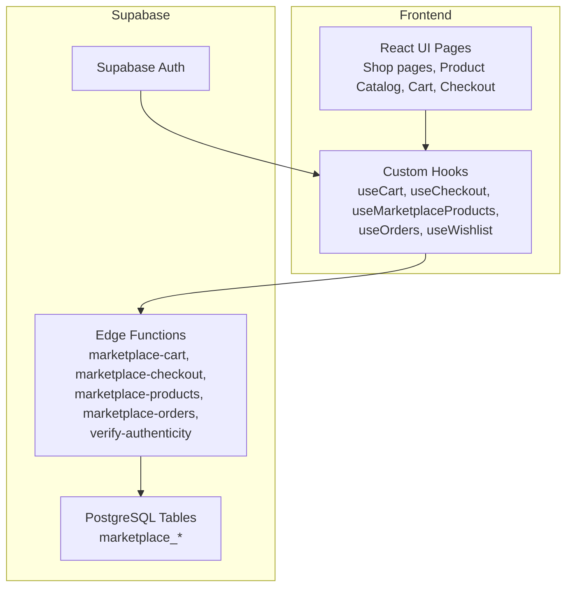
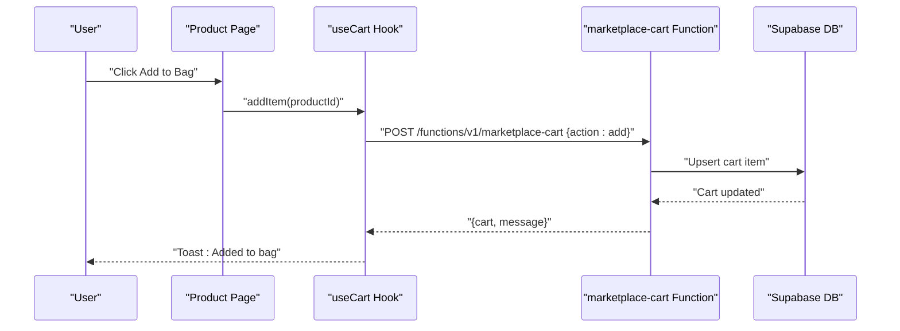
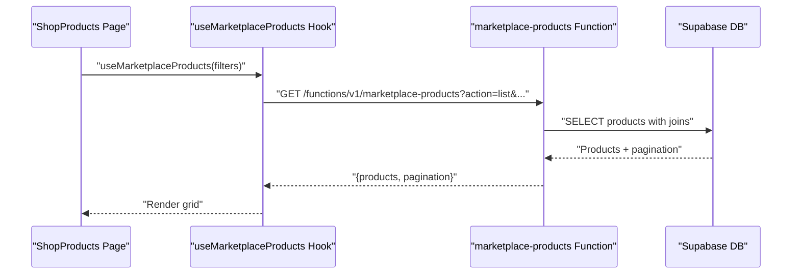
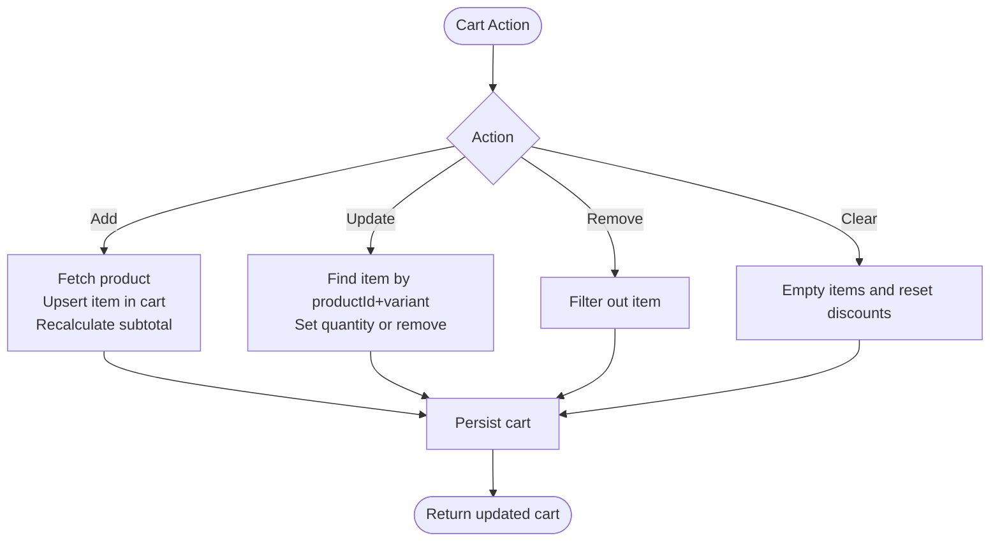
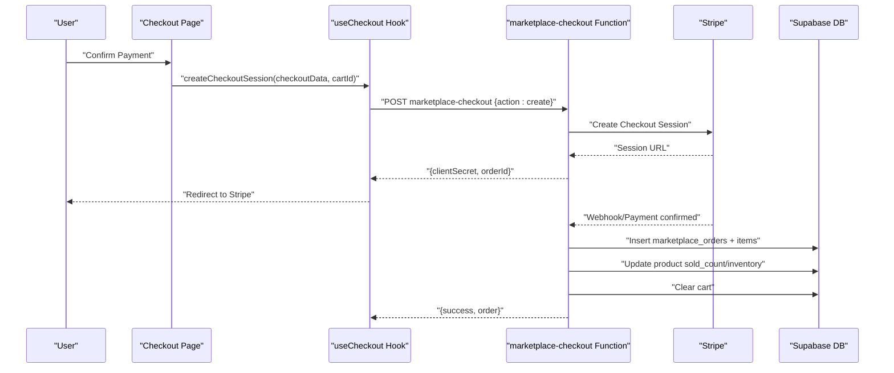
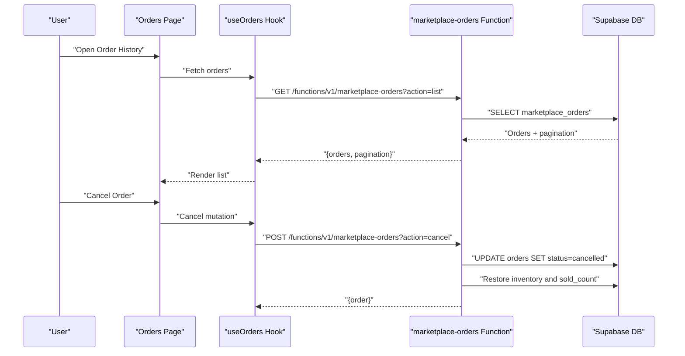
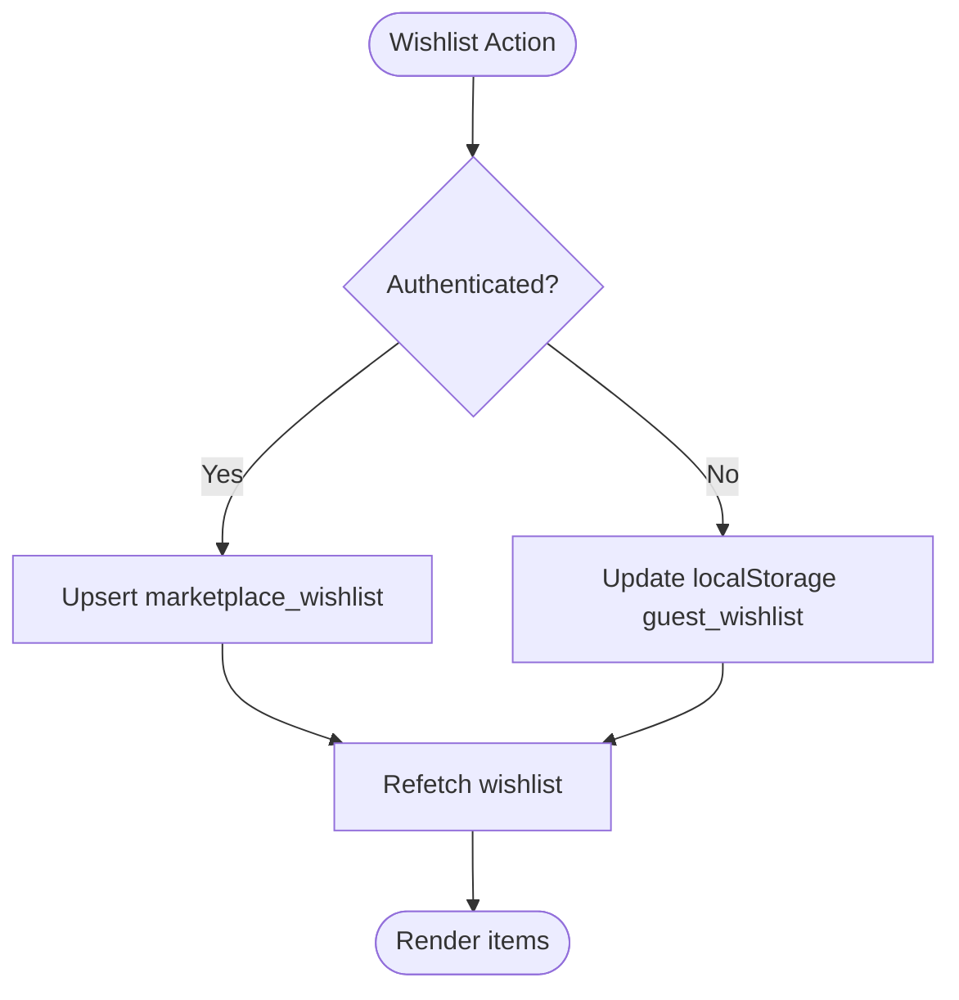
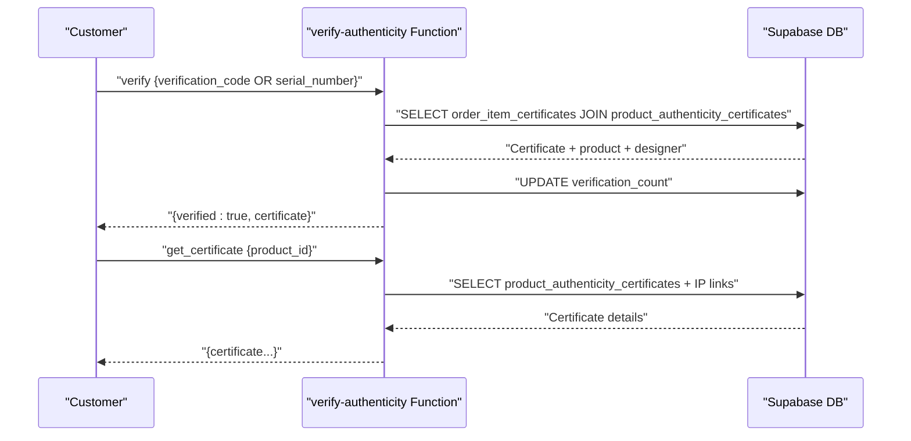
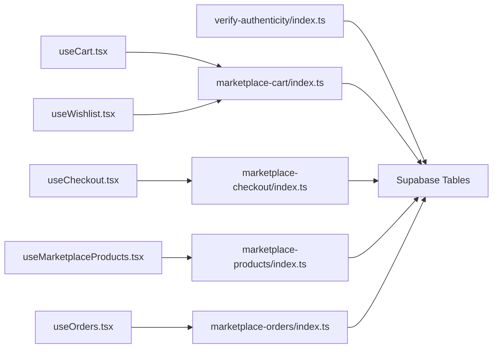

# Marketplace Platform

<cite>
**Referenced Files in This Document**
- [README.md](file://README.md)
- [src/hooks/useCart.tsx](file://src/hooks/useCart.tsx)
- [src/hooks/useCheckout.tsx](file://src/hooks/useCheckout.tsx)
- [src/hooks/useMarketplaceProducts.tsx](file://src/hooks/useMarketplaceProducts.tsx)
- [src/hooks/useOrders.tsx](file://src/hooks/useOrders.tsx)
- [src/hooks/useWishlist.tsx](file://src/hooks/useWishlist.tsx)
- [supabase/functions/marketplace-cart/index.ts](file://supabase/functions/marketplace-cart/index.ts)
- [supabase/functions/marketplace-checkout/index.ts](file://supabase/functions/marketplace-checkout/index.ts)
- [supabase/functions/marketplace-products/index.ts](file://supabase/functions/marketplace-products/index.ts)
- [supabase/functions/marketplace-orders/index.ts](file://supabase/functions/marketplace-orders/index.ts)
- [supabase/functions/verify-authenticity/index.ts](file://supabase/functions/verify-authenticity/index.ts)
</cite>

## Table of Contents
1. [Introduction](#introduction)
2. [Project Structure](#project-structure)
3. [Core Components](#core-components)
4. [Architecture Overview](#architecture-overview)
5. [Detailed Component Analysis](#detailed-component-analysis)
6. [Dependency Analysis](#dependency-analysis)
7. [Performance Considerations](#performance-considerations)
8. [Troubleshooting Guide](#troubleshooting-guide)
9. [Conclusion](#conclusion)
10. [Appendices](#appendices)

## Introduction
This document describes the marketplace platform’s e-commerce functionality for fashion products. It covers the product catalog system, shopping cart management, checkout process, order fulfillment, and wishlist functionality. It also documents the integration between the marketplace and studio workspace, the product authenticity verification system, and collection management. Practical examples illustrate browsing products, adding to cart, completing purchases, and managing orders. Finally, it outlines the relationship between designer submissions and marketplace availability, pricing strategies, and inventory management workflows.

## Project Structure
The marketplace frontend is a React application using Supabase for authentication and database access, and serverless functions for marketplace operations. The backend consists of Supabase Edge Functions implementing marketplace-cart, marketplace-checkout, marketplace-products, marketplace-orders, and verify-authenticity.

**Diagram sources**
- [src/hooks/useCart.tsx](file://src/hooks/useCart.tsx#L1-L214)
- [src/hooks/useCheckout.tsx](file://src/hooks/useCheckout.tsx#L1-L188)
- [src/hooks/useMarketplaceProducts.tsx](file://src/hooks/useMarketplaceProducts.tsx#L1-L207)
- [src/hooks/useOrders.tsx](file://src/hooks/useOrders.tsx#L1-L320)
- [src/hooks/useWishlist.tsx](file://src/hooks/useWishlist.tsx#L1-L245)
- [supabase/functions/marketplace-cart/index.ts](file://supabase/functions/marketplace-cart/index.ts#L1-L323)
- [supabase/functions/marketplace-checkout/index.ts](file://supabase/functions/marketplace-checkout/index.ts#L1-L331)
- [supabase/functions/marketplace-products/index.ts](file://supabase/functions/marketplace-products/index.ts#L1-L257)
- [supabase/functions/marketplace-orders/index.ts](file://supabase/functions/marketplace-orders/index.ts#L1-L227)
- [supabase/functions/verify-authenticity/index.ts](file://supabase/functions/verify-authenticity/index.ts#L1-L263)

**Section sources**
- [README.md](file://README.md#L53-L74)

## Core Components
- Product Catalog: Fetches products, categories, and collections with filtering, sorting, and pagination.
- Shopping Cart: Manages cart lifecycle (get/add/update/remove/clear) with guest and authenticated sessions.
- Checkout: Creates Stripe Checkout sessions, verifies payments, and fulfills orders with inventory updates.
- Orders: Retrieves customer orders and supports cancellation with inventory restoration.
- Wishlist: Supports guest and authenticated wishlists with persistence and synchronization.
- Authenticity Verification: Provides public verification and certificate retrieval for products.

**Section sources**
- [src/hooks/useMarketplaceProducts.tsx](file://src/hooks/useMarketplaceProducts.tsx#L83-L207)
- [src/hooks/useCart.tsx](file://src/hooks/useCart.tsx#L57-L214)
- [src/hooks/useCheckout.tsx](file://src/hooks/useCheckout.tsx#L29-L188)
- [src/hooks/useOrders.tsx](file://src/hooks/useOrders.tsx#L58-L320)
- [src/hooks/useWishlist.tsx](file://src/hooks/useWishlist.tsx#L29-L245)
- [supabase/functions/verify-authenticity/index.ts](file://supabase/functions/verify-authenticity/index.ts#L38-L263)

## Architecture Overview
The marketplace relies on Supabase Edge Functions to implement core e-commerce logic. Frontend hooks encapsulate user actions and communicate with functions via Supabase Functions invoke or direct HTTP requests. Authentication integrates with Supabase Auth to derive customer identities for carts, orders, and wishlists.

**Diagram sources**
- [src/hooks/useCart.tsx](file://src/hooks/useCart.tsx#L99-L123)
- [supabase/functions/marketplace-cart/index.ts](file://supabase/functions/marketplace-cart/index.ts#L138-L207)

**Section sources**
- [src/hooks/useCart.tsx](file://src/hooks/useCart.tsx#L67-L85)
- [supabase/functions/marketplace-cart/index.ts](file://supabase/functions/marketplace-cart/index.ts#L68-L96)

## Detailed Component Analysis

### Product Catalog System
- Fetches products with filters (category, designer, price range, search, featured, bestseller), sorting (newest, price asc/desc, rating, bestselling), and pagination.
- Retrieves product detail by UUID or slug, increments view count, and returns related products and reviews.
- Loads categories and collections with optional featured flag.

**Diagram sources**
- [src/hooks/useMarketplaceProducts.tsx](file://src/hooks/useMarketplaceProducts.tsx#L83-L121)
- [supabase/functions/marketplace-products/index.ts](file://supabase/functions/marketplace-products/index.ts#L29-L116)

**Section sources**
- [src/hooks/useMarketplaceProducts.tsx](file://src/hooks/useMarketplaceProducts.tsx#L83-L207)
- [supabase/functions/marketplace-products/index.ts](file://supabase/functions/marketplace-products/index.ts#L118-L205)

### Shopping Cart Management
- Session-based carts for guests; authenticated customer carts linked to a customer record.
- Supports add, update quantity, remove, clear, and enrich items with product and designer details.
- Validates availability against inventory and product status.

**Diagram sources**
- [src/hooks/useCart.tsx](file://src/hooks/useCart.tsx#L99-L183)
- [supabase/functions/marketplace-cart/index.ts](file://supabase/functions/marketplace-cart/index.ts#L138-L307)

**Section sources**
- [src/hooks/useCart.tsx](file://src/hooks/useCart.tsx#L57-L214)
- [supabase/functions/marketplace-cart/index.ts](file://supabase/functions/marketplace-cart/index.ts#L68-L136)

### Checkout Process
- Creates Stripe Checkout sessions with line items derived from the cart and product details.
- Calculates regional shipping costs and applies free shipping thresholds.
- On successful payment, creates an order, computes designer commission and platform fee, updates inventory, and clears the cart.

**Diagram sources**
- [src/hooks/useCheckout.tsx](file://src/hooks/useCheckout.tsx#L38-L86)
- [supabase/functions/marketplace-checkout/index.ts](file://supabase/functions/marketplace-checkout/index.ts#L41-L174)
- [supabase/functions/marketplace-checkout/index.ts](file://supabase/functions/marketplace-checkout/index.ts#L176-L315)

**Section sources**
- [src/hooks/useCheckout.tsx](file://src/hooks/useCheckout.tsx#L29-L188)
- [supabase/functions/marketplace-checkout/index.ts](file://supabase/functions/marketplace-checkout/index.ts#L17-L331)

### Order Fulfillment and Management
- Retrieves customer orders and order details with associated items and product metadata.
- Supports cancellation of pending/confirmed orders with inventory restoration and sales count adjustments.

**Diagram sources**
- [src/hooks/useOrders.tsx](file://src/hooks/useOrders.tsx#L58-L149)
- [supabase/functions/marketplace-orders/index.ts](file://supabase/functions/marketplace-orders/index.ts#L61-L96)
- [supabase/functions/marketplace-orders/index.ts](file://supabase/functions/marketplace-orders/index.ts#L148-L211)

**Section sources**
- [src/hooks/useOrders.tsx](file://src/hooks/useOrders.tsx#L58-L320)
- [supabase/functions/marketplace-orders/index.ts](file://supabase/functions/marketplace-orders/index.ts#L1-L227)

### Wishlist Functionality
- Supports guest and authenticated wishlists with local storage fallback for guests.
- Adds/removes items and checks membership; synchronizes with backend when logged in.

**Diagram sources**
- [src/hooks/useWishlist.tsx](file://src/hooks/useWishlist.tsx#L128-L218)
- [supabase/functions/marketplace-cart/index.ts](file://supabase/functions/marketplace-cart/index.ts#L138-L207)

**Section sources**
- [src/hooks/useWishlist.tsx](file://src/hooks/useWishlist.tsx#L29-L245)

### Product Authenticity Verification System
- Public verification endpoint validates certificates by verification code or serial number.
- Retrieves product certificate details including designer, materials, production info, and IP linkage.
- Generates certificates (admin-only flow) with generated certificate numbers and cryptographic hashes.

**Diagram sources**
- [supabase/functions/verify-authenticity/index.ts](file://supabase/functions/verify-authenticity/index.ts#L38-L123)
- [supabase/functions/verify-authenticity/index.ts](file://supabase/functions/verify-authenticity/index.ts#L125-L187)

**Section sources**
- [supabase/functions/verify-authenticity/index.ts](file://supabase/functions/verify-authenticity/index.ts#L1-L263)

### Collection Management
- Collections are loaded via marketplace-products with optional featured filter.
- Collections surface curated sets of products for targeted browsing.

**Section sources**
- [src/hooks/useMarketplaceProducts.tsx](file://src/hooks/useMarketplaceProducts.tsx#L179-L206)
- [supabase/functions/marketplace-products/index.ts](file://supabase/functions/marketplace-products/index.ts#L221-L241)

### Relationship Between Designer Submissions and Marketplace Availability
- Product listings depend on active status and availability; inventory controls stock levels and visibility.
- Orders and order items track designer commission and platform fees, linking purchases to designer profiles.
- The studio workspace context implies submission workflows that feed into marketplace availability (e.g., product activation, status updates), though the specific submission-to-listing pipeline is not detailed in the referenced files.

**Section sources**
- [supabase/functions/marketplace-products/index.ts](file://supabase/functions/marketplace-products/index.ts#L42-L49)
- [supabase/functions/marketplace-checkout/index.ts](file://supabase/functions/marketplace-checkout/index.ts#L257-L299)

### Pricing Strategies and Inventory Workflows
- Pricing: Unit prices from products; Stripe line items computed from cart items.
- Currency: Multi-currency support with regional conversion factors.
- Shipping: Regional rates with free shipping thresholds based on subtotal.
- Inventory: Sold count increases and inventory decreases upon order confirmation; cancellations restore inventory and decrement sold count.

**Section sources**
- [supabase/functions/marketplace-checkout/index.ts](file://supabase/functions/marketplace-checkout/index.ts#L77-L125)
- [supabase/functions/marketplace-checkout/index.ts](file://supabase/functions/marketplace-checkout/index.ts#L282-L299)
- [supabase/functions/marketplace-orders/index.ts](file://supabase/functions/marketplace-orders/index.ts#L187-L204)

## Dependency Analysis
- Frontend hooks depend on Supabase client and react-query for caching and refetching.
- Edge functions depend on Supabase service role keys and Stripe secret key.
- Data model dependencies include marketplace_carts, marketplace_products, marketplace_orders, marketplace_order_items, marketplace_customers, marketplace_wishlist, and product authenticity tables.

**Diagram sources**
- [src/hooks/useCart.tsx](file://src/hooks/useCart.tsx#L1-L214)
- [src/hooks/useCheckout.tsx](file://src/hooks/useCheckout.tsx#L1-L188)
- [src/hooks/useMarketplaceProducts.tsx](file://src/hooks/useMarketplaceProducts.tsx#L1-L207)
- [src/hooks/useOrders.tsx](file://src/hooks/useOrders.tsx#L1-L320)
- [src/hooks/useWishlist.tsx](file://src/hooks/useWishlist.tsx#L1-L245)
- [supabase/functions/marketplace-cart/index.ts](file://supabase/functions/marketplace-cart/index.ts#L1-L323)
- [supabase/functions/marketplace-checkout/index.ts](file://supabase/functions/marketplace-checkout/index.ts#L1-L331)
- [supabase/functions/marketplace-products/index.ts](file://supabase/functions/marketplace-products/index.ts#L1-L257)
- [supabase/functions/marketplace-orders/index.ts](file://supabase/functions/marketplace-orders/index.ts#L1-L227)
- [supabase/functions/verify-authenticity/index.ts](file://supabase/functions/verify-authenticity/index.ts#L1-L263)

**Section sources**
- [src/hooks/useCart.tsx](file://src/hooks/useCart.tsx#L1-L214)
- [src/hooks/useCheckout.tsx](file://src/hooks/useCheckout.tsx#L1-L188)
- [src/hooks/useMarketplaceProducts.tsx](file://src/hooks/useMarketplaceProducts.tsx#L1-L207)
- [src/hooks/useOrders.tsx](file://src/hooks/useOrders.tsx#L1-L320)
- [src/hooks/useWishlist.tsx](file://src/hooks/useWishlist.tsx#L1-L245)
- [supabase/functions/marketplace-cart/index.ts](file://supabase/functions/marketplace-cart/index.ts#L1-L323)
- [supabase/functions/marketplace-checkout/index.ts](file://supabase/functions/marketplace-checkout/index.ts#L1-L331)
- [supabase/functions/marketplace-products/index.ts](file://supabase/functions/marketplace-products/index.ts#L1-L257)
- [supabase/functions/marketplace-orders/index.ts](file://supabase/functions/marketplace-orders/index.ts#L1-L227)
- [supabase/functions/verify-authenticity/index.ts](file://supabase/functions/verify-authenticity/index.ts#L1-L263)

## Performance Considerations
- Use react-query caching and pagination to minimize repeated network calls for product lists.
- Batch operations in Edge Functions (e.g., single insert for order items) reduce round trips.
- Prefer UUID-based lookups for product detail to avoid slug normalization overhead.
- Limit cart enrichment to necessary fields to reduce payload sizes.

## Troubleshooting Guide
- Cart errors: Validate product availability and quantity limits; ensure session or customer linkage is present.
- Checkout failures: Confirm Stripe secret key configuration and supported currencies; verify shipping address collection and regional rates.
- Order retrieval: Ensure customer authentication and correct customer_id mapping.
- Wishlist sync: For guests, confirm localStorage persistence; for authenticated users, verify backend wishlist entries.

**Section sources**
- [src/hooks/useCart.tsx](file://src/hooks/useCart.tsx#L87-L97)
- [src/hooks/useCheckout.tsx](file://src/hooks/useCheckout.tsx#L72-L86)
- [src/hooks/useOrders.tsx](file://src/hooks/useOrders.tsx#L62-L98)
- [src/hooks/useWishlist.tsx](file://src/hooks/useWishlist.tsx#L128-L178)

## Conclusion
The marketplace platform implements a robust e-commerce stack with Supabase-backed frontend hooks and Edge Functions. It supports rich product discovery, cart management, secure checkout with Stripe, order lifecycle handling, and product authenticity verification. The system scales with caching, pagination, and efficient database queries while maintaining clear separation of concerns between frontend and backend.

## Appendices
- Practical examples:
  - Browse products: Use product listing hook with filters and pagination.
  - Add to cart: Call add item with productId and optional variant.
  - Checkout: Provide shipping address and email; confirm payment via Stripe; receive order confirmation.
  - Manage orders: View order history and cancel eligible orders.
  - Authenticity verification: Use verification code or serial number to validate a certificate.

[No sources needed since this section summarizes without analyzing specific files]