# Order Management

<cite>
**Referenced Files in This Document**
- [ShopOrderTracking.tsx](file://src/pages/shop/ShopOrderTracking.tsx)
- [ShopOrderConfirmation.tsx](file://src/pages/shop/ShopOrderConfirmation.tsx)
- [useOrders.tsx](file://src/hooks/useOrders.tsx)
- [OrderHistoryItem.tsx](file://src/components/shop/OrderHistoryItem.tsx)
- [OrderSummary.tsx](file://src/components/shop/OrderSummary.tsx)
- [AdminOrdersTable.tsx](file://src/components/admin/marketplace/AdminOrdersTable.tsx)
- [ShopAccount.tsx](file://src/pages/shop/ShopAccount.tsx)
- [marketplace-orders/index.ts](file://supabase/functions/marketplace-orders/index.ts)
- [marketplace_orders.sql](file://supabase/migrations/20260106072015_8011bca7-38e1-4efc-bc02-8dfafff9a379.sql)
- [ShopPolicies.tsx](file://src/pages/shop/ShopPolicies.tsx)
</cite>

## Table of Contents
1. [Introduction](#introduction)
2. [Project Structure](#project-structure)
3. [Core Components](#core-components)
4. [Architecture Overview](#architecture-overview)
5. [Detailed Component Analysis](#detailed-component-analysis)
6. [Dependency Analysis](#dependency-analysis)
7. [Performance Considerations](#performance-considerations)
8. [Troubleshooting Guide](#troubleshooting-guide)
9. [Conclusion](#conclusion)

## Introduction
This document explains the order management functionality across the marketplace, focusing on order tracking, order history, and fulfillment processes. It covers the customer-facing order tracking interface, order history display, order summary component, state transitions, and administrative oversight. It also documents integration points with Supabase for order persistence and serverless functions, and outlines cancellation and return workflows.

## Project Structure
The order management system spans frontend React components and hooks, and backend Supabase resources:
- Frontend pages and components for customer order experiences
- React Query hooks for fetching and caching order data
- Supabase serverless function for customer order operations
- Supabase database schema for orders, order items, and related entities

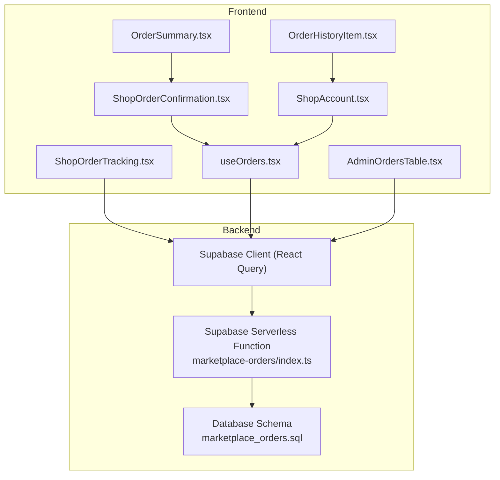

**Diagram sources**
- [ShopOrderConfirmation.tsx](file://src/pages/shop/ShopOrderConfirmation.tsx#L1-L221)
- [ShopOrderTracking.tsx](file://src/pages/shop/ShopOrderTracking.tsx#L1-L354)
- [OrderHistoryItem.tsx](file://src/components/shop/OrderHistoryItem.tsx#L1-L173)
- [OrderSummary.tsx](file://src/components/shop/OrderSummary.tsx#L1-L198)
- [useOrders.tsx](file://src/hooks/useOrders.tsx#L1-L320)
- [ShopAccount.tsx](file://src/pages/shop/ShopAccount.tsx#L1-L399)
- [AdminOrdersTable.tsx](file://src/components/admin/marketplace/AdminOrdersTable.tsx#L1-L144)
- [marketplace-orders/index.ts](file://supabase/functions/marketplace-orders/index.ts#L1-L229)
- [marketplace_orders.sql](file://supabase/migrations/20260106072015_8011bca7-38e1-4efc-bc02-8dfafff9a379.sql#L72-L102)

**Section sources**
- [ShopOrderTracking.tsx](file://src/pages/shop/ShopOrderTracking.tsx#L1-L354)
- [ShopOrderConfirmation.tsx](file://src/pages/shop/ShopOrderConfirmation.tsx#L1-L221)
- [useOrders.tsx](file://src/hooks/useOrders.tsx#L1-L320)
- [OrderHistoryItem.tsx](file://src/components/shop/OrderHistoryItem.tsx#L1-L173)
- [OrderSummary.tsx](file://src/components/shop/OrderSummary.tsx#L1-L198)
- [AdminOrdersTable.tsx](file://src/components/admin/marketplace/AdminOrdersTable.tsx#L1-L144)
- [ShopAccount.tsx](file://src/pages/shop/ShopAccount.tsx#L1-L399)
- [marketplace-orders/index.ts](file://supabase/functions/marketplace-orders/index.ts#L1-L229)
- [marketplace_orders.sql](file://supabase/migrations/20260106072015_8011bca7-38e1-4efc-bc02-8dfafff9a379.sql#L72-L102)

## Core Components
- Order tracking page: Displays order status timeline, items, shipping address, payment info, and tracking number.
- Order confirmation page: Shows order number, items, totals, and next steps.
- Order history item: Renders a compact row per order with status, date, total, and quick link to track.
- Order summary component: Shows itemization, subtotal, shipping, discounts, and total; supports promo code application.
- Orders hook: Fetches customer orders and individual order details via Supabase.
- Admin orders table: Lists marketplace orders for administrators with status badges and actions.
- Customer account page: Provides access to order history and saved addresses.
- Backend serverless function: Handles listing, retrieving, and cancelling orders for authenticated customers.
- Database schema: Defines marketplace_orders, marketplace_order_items, and related fields.

**Section sources**
- [ShopOrderTracking.tsx](file://src/pages/shop/ShopOrderTracking.tsx#L91-L354)
- [ShopOrderConfirmation.tsx](file://src/pages/shop/ShopOrderConfirmation.tsx#L12-L221)
- [OrderHistoryItem.tsx](file://src/components/shop/OrderHistoryItem.tsx#L77-L173)
- [OrderSummary.tsx](file://src/components/shop/OrderSummary.tsx#L31-L198)
- [useOrders.tsx](file://src/hooks/useOrders.tsx#L58-L149)
- [AdminOrdersTable.tsx](file://src/components/admin/marketplace/AdminOrdersTable.tsx#L32-L144)
- [ShopAccount.tsx](file://src/pages/shop/ShopAccount.tsx#L25-L399)
- [marketplace-orders/index.ts](file://supabase/functions/marketplace-orders/index.ts#L63-L213)
- [marketplace_orders.sql](file://supabase/migrations/20260106072015_8011bca7-38e1-4efc-bc02-8dfafff9a379.sql#L72-L102)

## Architecture Overview
The order lifecycle integrates frontend UI with Supabase:
- Customer actions (view order, apply promo, cancel) are handled by React components and hooks.
- Supabase client queries are used for real-time order data.
- A serverless function enforces customer authorization and performs order operations (list, detail, cancel).
- The database schema stores orders, items, addresses, and timestamps.

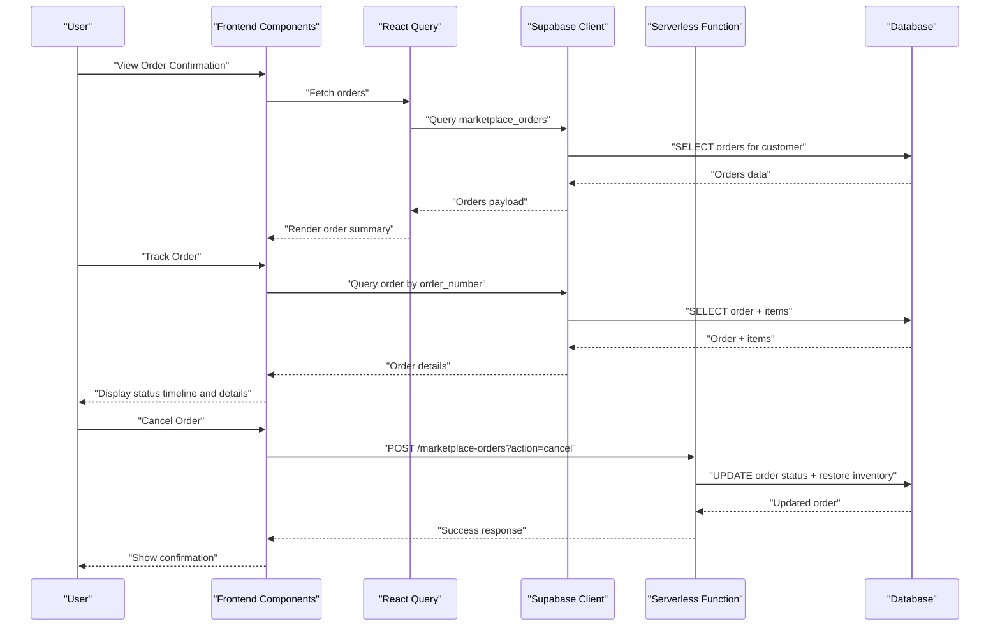

**Diagram sources**
- [ShopOrderConfirmation.tsx](file://src/pages/shop/ShopOrderConfirmation.tsx#L12-L221)
- [ShopOrderTracking.tsx](file://src/pages/shop/ShopOrderTracking.tsx#L94-L117)
- [useOrders.tsx](file://src/hooks/useOrders.tsx#L58-L149)
- [marketplace-orders/index.ts](file://supabase/functions/marketplace-orders/index.ts#L63-L213)
- [marketplace_orders.sql](file://supabase/migrations/20260106072015_8011bca7-38e1-4efc-bc02-8dfafff9a379.sql#L72-L102)

## Detailed Component Analysis

### Order Tracking Interface
The order tracking page presents:
- Status timeline with icons and labels aligned to the internal progression
- Order items with thumbnails, quantities, unit and total prices
- Subtotal, shipping, discount, and total computation
- Shipping address and payment method/status
- Tracking number and external tracking link when available

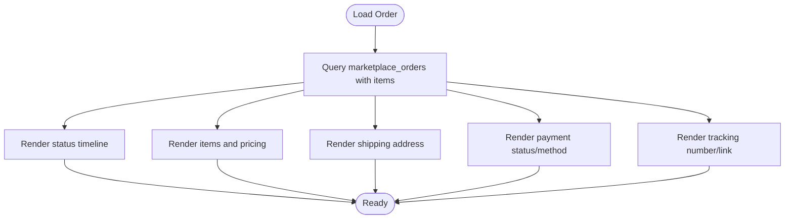

**Diagram sources**
- [ShopOrderTracking.tsx](file://src/pages/shop/ShopOrderTracking.tsx#L94-L354)

**Section sources**
- [ShopOrderTracking.tsx](file://src/pages/shop/ShopOrderTracking.tsx#L91-L354)

### Order History Display
The order history item component:
- Shows order number, status badge with icon and color, placed date, and total
- Displays thumbnail previews of ordered products with optional quantity badges
- Links to the order tracking page for details

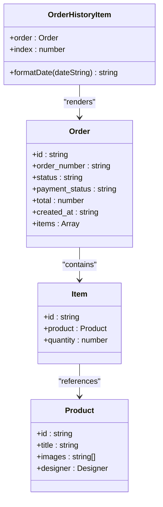

**Diagram sources**
- [OrderHistoryItem.tsx](file://src/components/shop/OrderHistoryItem.tsx#L8-L30)
- [useOrders.tsx](file://src/hooks/useOrders.tsx#L5-L43)

**Section sources**
- [OrderHistoryItem.tsx](file://src/components/shop/OrderHistoryItem.tsx#L77-L173)
- [useOrders.tsx](file://src/hooks/useOrders.tsx#L58-L149)

### Order Summary Component
The order summary component:
- Displays item thumbnails, titles, designer names, quantities, and line totals
- Shows subtotal, shipping cost, discount amount, and total
- Supports applying/removing promo codes and indicates free shipping progress

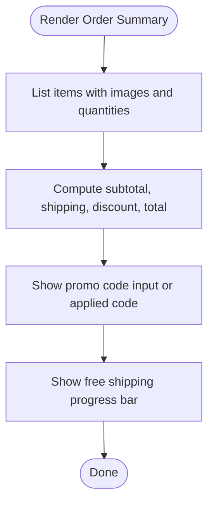

**Diagram sources**
- [OrderSummary.tsx](file://src/components/shop/OrderSummary.tsx#L31-L198)

**Section sources**
- [OrderSummary.tsx](file://src/components/shop/OrderSummary.tsx#L31-L198)

### Order State Management and Fulfillment
Internal order statuses and progression:
- Statuses: confirmed, sampling, production, quality_check, shipping, delivered, cancelled
- Progression follows a fixed order for timeline rendering
- Payment status and method are shown alongside order status
- Tracking number and URL are surfaced when available

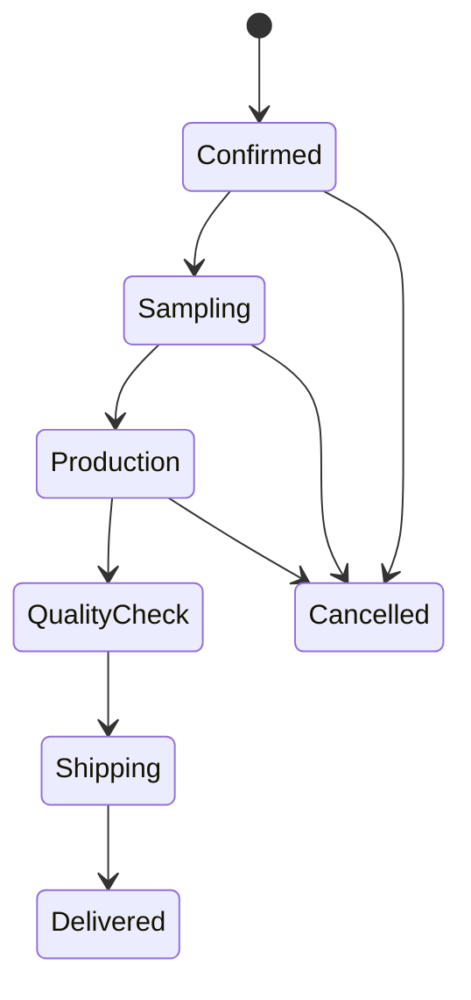

**Diagram sources**
- [ShopOrderTracking.tsx](file://src/pages/shop/ShopOrderTracking.tsx#L22-L89)

**Section sources**
- [ShopOrderTracking.tsx](file://src/pages/shop/ShopOrderTracking.tsx#L22-L89)

### Customer Notification Workflows
- After placing an order, the confirmation page displays next steps and links to tracking
- Policies document email notifications upon shipping and expectations for tracking
- The tracking page surfaces a “Track Package” link when a tracking URL is present

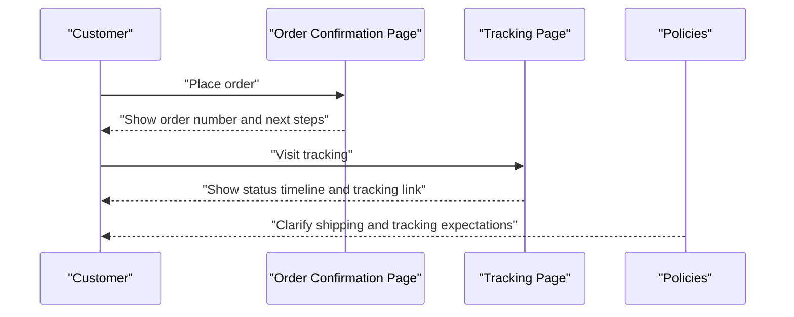

**Diagram sources**
- [ShopOrderConfirmation.tsx](file://src/pages/shop/ShopOrderConfirmation.tsx#L12-L221)
- [ShopOrderTracking.tsx](file://src/pages/shop/ShopOrderTracking.tsx#L91-L354)
- [ShopPolicies.tsx](file://src/pages/shop/ShopPolicies.tsx#L268-L291)

**Section sources**
- [ShopOrderConfirmation.tsx](file://src/pages/shop/ShopOrderConfirmation.tsx#L12-L221)
- [ShopOrderTracking.tsx](file://src/pages/shop/ShopOrderTracking.tsx#L91-L354)
- [ShopPolicies.tsx](file://src/pages/shop/ShopPolicies.tsx#L268-L291)

### Integration with Marketplace Orders and Fulfillment Pipelines
- Orders are persisted in the marketplace_orders table with nested items stored as JSON
- The serverless function enforces customer authorization and supports listing, detail retrieval, and cancellation
- On cancellation, inventory is restored and sold counts adjusted

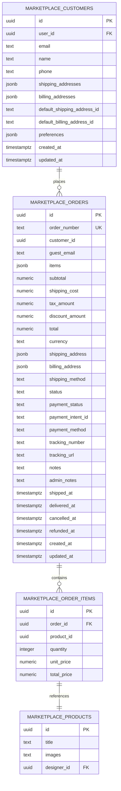

**Diagram sources**
- [marketplace_orders.sql](file://supabase/migrations/20260106072015_8011bca7-38e1-4efc-bc02-8dfafff9a379.sql#L72-L102)

**Section sources**
- [marketplace-orders/index.ts](file://supabase/functions/marketplace-orders/index.ts#L63-L213)
- [marketplace_orders.sql](file://supabase/migrations/20260106072015_8011bca7-38e1-4efc-bc02-8dfafff9a379.sql#L72-L102)

### Administrative Oversight
Administrators can view recent orders, customer details, and update order status via the admin orders table.

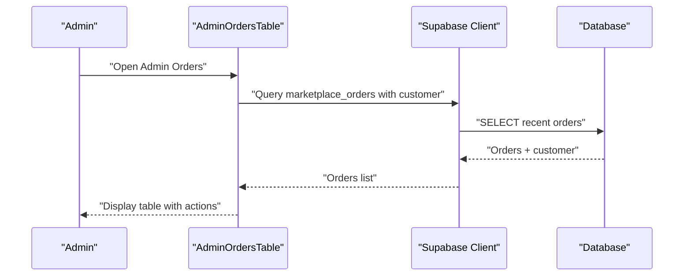

**Diagram sources**
- [AdminOrdersTable.tsx](file://src/components/admin/marketplace/AdminOrdersTable.tsx#L32-L144)

**Section sources**
- [AdminOrdersTable.tsx](file://src/components/admin/marketplace/AdminOrdersTable.tsx#L32-L144)

### Order Cancellation Workflow
Customers can cancel eligible orders (pending or confirmed). The serverless function validates eligibility, updates status, records cancellation timestamp, and restores inventory.

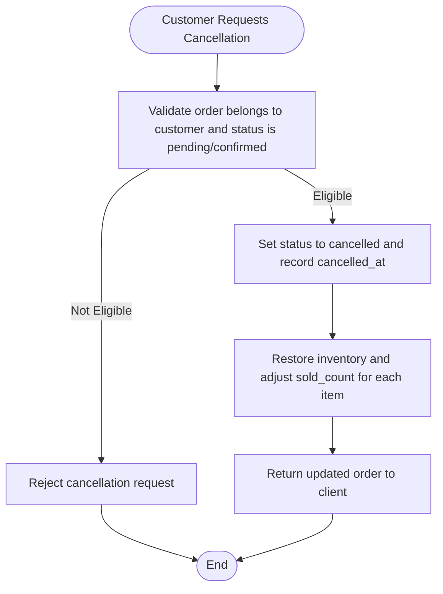

**Diagram sources**
- [marketplace-orders/index.ts](file://supabase/functions/marketplace-orders/index.ts#L150-L213)

**Section sources**
- [marketplace-orders/index.ts](file://supabase/functions/marketplace-orders/index.ts#L150-L213)

### Returns and Customer Service
- Policies describe international shipping expectations, customs, and delayed/lost package resolution
- The order tracking page provides a “Track Package” link to assist with delivery inquiries

**Section sources**
- [ShopPolicies.tsx](file://src/pages/shop/ShopPolicies.tsx#L268-L291)
- [ShopOrderTracking.tsx](file://src/pages/shop/ShopOrderTracking.tsx#L327-L346)

## Dependency Analysis
- Frontend depends on Supabase client for queries and on the serverless function for protected operations
- The serverless function depends on Supabase Auth to identify the customer and on the database schema for order data
- The order history and tracking components depend on the shared order data model exposed by the hooks

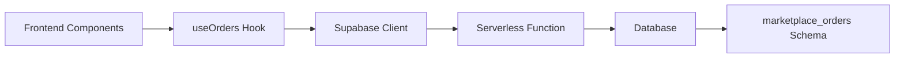

**Diagram sources**
- [useOrders.tsx](file://src/hooks/useOrders.tsx#L58-L149)
- [marketplace-orders/index.ts](file://supabase/functions/marketplace-orders/index.ts#L47-L56)
- [marketplace_orders.sql](file://supabase/migrations/20260106072015_8011bca7-38e1-4efc-bc02-8dfafff9a379.sql#L72-L102)

**Section sources**
- [useOrders.tsx](file://src/hooks/useOrders.tsx#L58-L149)
- [marketplace-orders/index.ts](file://supabase/functions/marketplace-orders/index.ts#L47-L56)
- [marketplace_orders.sql](file://supabase/migrations/20260106072015_8011bca7-38e1-4efc-bc02-8dfafff9a379.sql#L72-L102)

## Performance Considerations
- Use React Query’s caching and invalidation to avoid redundant network requests for order lists and details
- Paginate order listings on the serverless function to limit payload sizes
- Normalize product references in order items to reduce duplication and improve query performance
- Debounce or batch UI updates when applying promo codes to minimize re-renders

## Troubleshooting Guide
- Order not found: Verify order_number and customer association; ensure serverless function receives a valid Authorization header
- Cancellation errors: Confirm order status is pending or confirmed; check inventory restoration logic
- Tracking link missing: Ensure tracking_number and tracking_url are populated in the order record
- Order totals mismatch: Validate subtotal, shipping, discount, and total calculations in the order summary component

**Section sources**
- [marketplace-orders/index.ts](file://supabase/functions/marketplace-orders/index.ts#L100-L148)
- [marketplace-orders/index.ts](file://supabase/functions/marketplace-orders/index.ts#L150-L213)
- [ShopOrderTracking.tsx](file://src/pages/shop/ShopOrderTracking.tsx#L327-L346)
- [OrderSummary.tsx](file://src/components/shop/OrderSummary.tsx#L142-L175)

## Conclusion
The order management system combines customer-facing components with robust backend integration to deliver a seamless experience for tracking, reviewing, and managing orders. The frontend components render rich order details and summaries, while the serverless function and database schema enforce authorization, maintain accurate inventory, and support administrative oversight. Clear status progression, shipping visibility, and cancellation workflows provide transparency and control for both customers and administrators.