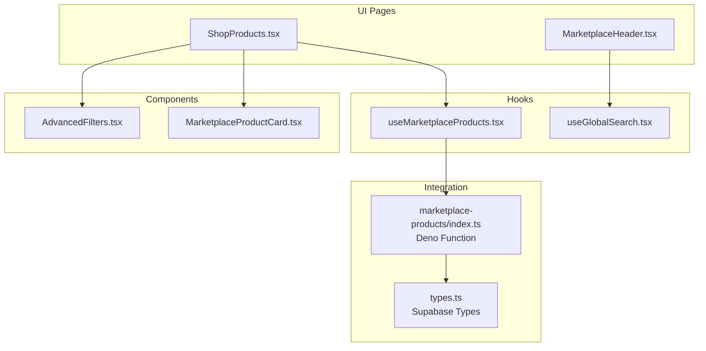
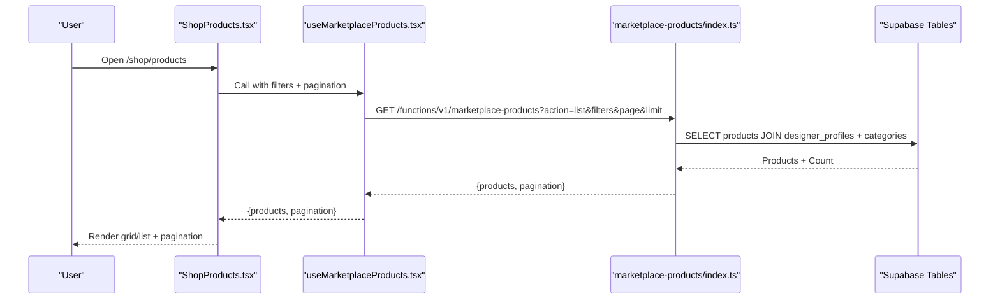
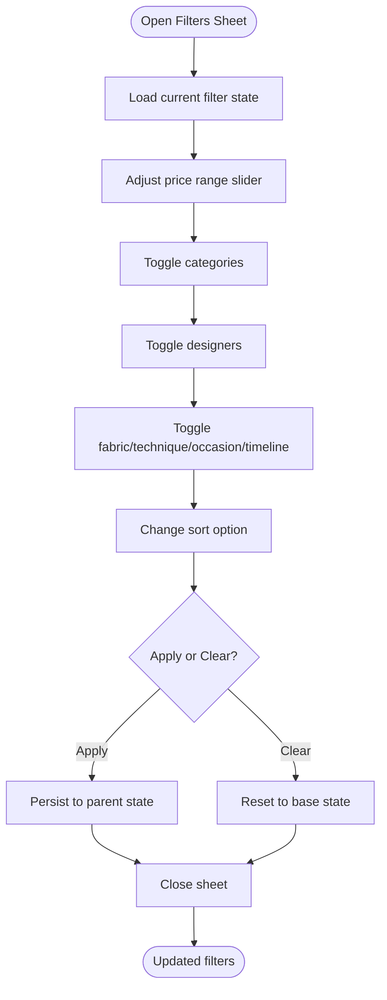
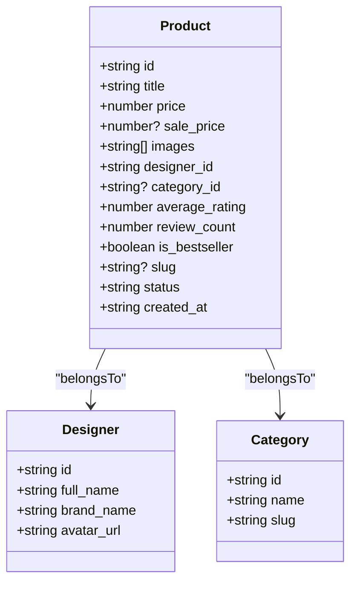
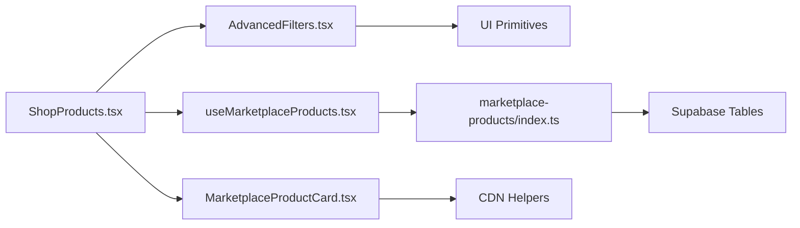

# Product Catalog

<cite>
**Referenced Files in This Document**
- [ShopProducts.tsx](file://src/pages/shop/ShopProducts.tsx)
- [AdvancedFilters.tsx](file://src/components/marketplace/AdvancedFilters.tsx)
- [useMarketplaceProducts.tsx](file://src/hooks/useMarketplaceProducts.tsx)
- [MarketplaceProductCard.tsx](file://src/components/marketplace/MarketplaceProductCard.tsx)
- [MarketplaceHeader.tsx](file://src/components/marketplace/MarketplaceHeader.tsx)
- [useGlobalSearch.tsx](file://src/hooks/useGlobalSearch.tsx)
- [types.ts](file://src/integrations/supabase/types.ts)
- [index.ts](file://supabase/functions/marketplace-products/index.ts)
</cite>

## Table of Contents
1. [Introduction](#introduction)
2. [Project Structure](#project-structure)
3. [Core Components](#core-components)
4. [Architecture Overview](#architecture-overview)
5. [Detailed Component Analysis](#detailed-component-analysis)
6. [Dependency Analysis](#dependency-analysis)
7. [Performance Considerations](#performance-considerations)
8. [Troubleshooting Guide](#troubleshooting-guide)
9. [Conclusion](#conclusion)

## Introduction
This document explains the product catalog system powering the marketplace’s product discovery, filtering, and browsing experience. It covers the product listing page, advanced filtering by category, designer, price range, and sorting options; grid and list view modes; pagination; responsive design patterns; search parameter handling; Supabase integration; product data structures; and the relationship between products and designer profiles. Practical examples illustrate how components work together and how to extend functionality.

## Project Structure
The product catalog spans UI components, hooks for data fetching, Supabase integration, and a serverless function for product queries.

**Diagram sources**
- [ShopProducts.tsx](file://src/pages/shop/ShopProducts.tsx#L1-L194)
- [AdvancedFilters.tsx](file://src/components/marketplace/AdvancedFilters.tsx#L1-L379)
- [MarketplaceProductCard.tsx](file://src/components/marketplace/MarketplaceProductCard.tsx#L1-L208)
- [useMarketplaceProducts.tsx](file://src/hooks/useMarketplaceProducts.tsx#L1-L207)
- [MarketplaceHeader.tsx](file://src/components/marketplace/MarketplaceHeader.tsx#L1-L258)
- [useGlobalSearch.tsx](file://src/hooks/useGlobalSearch.tsx#L1-L126)
- [types.ts](file://src/integrations/supabase/types.ts#L1039-L1164)
- [index.ts](file://supabase/functions/marketplace-products/index.ts#L1-L257)

**Section sources**
- [ShopProducts.tsx](file://src/pages/shop/ShopProducts.tsx#L1-L194)
- [AdvancedFilters.tsx](file://src/components/marketplace/AdvancedFilters.tsx#L1-L379)
- [MarketplaceProductCard.tsx](file://src/components/marketplace/MarketplaceProductCard.tsx#L1-L208)
- [useMarketplaceProducts.tsx](file://src/hooks/useMarketplaceProducts.tsx#L1-L207)
- [MarketplaceHeader.tsx](file://src/components/marketplace/MarketplaceHeader.tsx#L1-L258)
- [useGlobalSearch.tsx](file://src/hooks/useGlobalSearch.tsx#L1-L126)
- [types.ts](file://src/integrations/supabase/types.ts#L1039-L1164)
- [index.ts](file://supabase/functions/marketplace-products/index.ts#L1-L257)

## Core Components
- Product listing page: orchestrates filters, view mode, pagination, and renders product cards.
- Advanced filters: manages category, designer, price range, fabric, technique, occasion, timeline, and sorting.
- Product card: displays product image(s), pricing, badges, and quick actions.
- Data hooks: encapsulate Supabase queries via a Deno function and expose typed results.
- Supabase types: define marketplace_products and related tables for type safety.
- Deno function: implements product listing, detail retrieval, categories, and collections endpoints.

**Section sources**
- [ShopProducts.tsx](file://src/pages/shop/ShopProducts.tsx#L12-L194)
- [AdvancedFilters.tsx](file://src/components/marketplace/AdvancedFilters.tsx#L37-L46)
- [MarketplaceProductCard.tsx](file://src/components/marketplace/MarketplaceProductCard.tsx#L11-L41)
- [useMarketplaceProducts.tsx](file://src/hooks/useMarketplaceProducts.tsx#L83-L121)
- [types.ts](file://src/integrations/supabase/types.ts#L1039-L1164)
- [index.ts](file://supabase/functions/marketplace-products/index.ts#L29-L116)

## Architecture Overview
The product catalog follows a client-driven data fetching pattern:
- The listing page composes filter state and passes it to a hook that builds query parameters.
- The hook calls a Supabase Edge Function endpoint with the parameters.
- The function executes optimized PostgREST queries against Supabase tables, including joins to designer and category data.
- Results include pagination metadata and product arrays for rendering.

**Diagram sources**
- [ShopProducts.tsx](file://src/pages/shop/ShopProducts.tsx#L35-L43)
- [useMarketplaceProducts.tsx](file://src/hooks/useMarketplaceProducts.tsx#L83-L121)
- [index.ts](file://supabase/functions/marketplace-products/index.ts#L29-L116)
- [types.ts](file://src/integrations/supabase/types.ts#L1039-L1164)

## Detailed Component Analysis

### Product Listing Page
Responsibilities:
- Manage view mode (grid/list), pagination, and filter state.
- Fetch categories and designers for filter options.
- Fetch products with current filters and pagination.
- Render product cards and pagination controls.

Key behaviors:
- Filter change resets to the first page.
- Pagination supports previous/next and small numeric steps.
- Responsive grid adapts to list mode.

Practical examples:
- Passing filters to the product hook: [useMarketplaceProducts.tsx](file://src/hooks/useMarketplaceProducts.tsx#L83-L121)
- Rendering product cards: [ShopProducts.tsx](file://src/pages/shop/ShopProducts.tsx#L132-L149)
- Pagination UI: [ShopProducts.tsx](file://src/pages/shop/ShopProducts.tsx#L152-L185)

**Section sources**
- [ShopProducts.tsx](file://src/pages/shop/ShopProducts.tsx#L12-L194)

### Advanced Filtering Component
Capabilities:
- Category filter (multi-select).
- Designer filter (multi-select).
- Price range slider with min/max.
- Additional filters: fabric, technique, occasion, made-to-order timeline.
- Sorting dropdown: newest, most popular, price low-high, price high-low.

State management:
- Local state mirrors props for immediate UI feedback.
- Apply/clear actions propagate changes to parent via callbacks.
- Active filter badge counts visible filters.

Practical examples:
- Filter state interface: [AdvancedFilters.tsx](file://src/components/marketplace/AdvancedFilters.tsx#L37-L46)
- Price slider and categories: [AdvancedFilters.tsx](file://src/components/marketplace/AdvancedFilters.tsx#L156-L210)
- Sorting dropdown: [AdvancedFilters.tsx](file://src/components/marketplace/AdvancedFilters.tsx#L117-L130)
- Applying filters: [AdvancedFilters.tsx](file://src/components/marketplace/AdvancedFilters.tsx#L94-L97)

**Diagram sources**
- [AdvancedFilters.tsx](file://src/components/marketplace/AdvancedFilters.tsx#L77-L379)

**Section sources**
- [AdvancedFilters.tsx](file://src/components/marketplace/AdvancedFilters.tsx#L1-L379)

### Product Card Component
Features:
- Hover effects: quick actions, image dots, and scaling image.
- Badges for new, bestseller, and discount percentage.
- Pricing display with sale price and strikethrough original price.
- Click to product detail route using slug or id fallback.
- Wishlist toggle and add-to-cart integration.

Practical examples:
- Product URL composition: [MarketplaceProductCard.tsx](file://src/components/marketplace/MarketplaceProductCard.tsx#L47-L48)
- Pricing and discount calculation: [MarketplaceProductCard.tsx](file://src/components/marketplace/MarketplaceProductCard.tsx#L48-L50)
- Designer click routing: [MarketplaceProductCard.tsx](file://src/components/marketplace/MarketplaceProductCard.tsx#L176-L184)

**Section sources**
- [MarketplaceProductCard.tsx](file://src/components/marketplace/MarketplaceProductCard.tsx#L1-L208)

### Data Hooks and Supabase Integration
useMarketplaceProducts:
- Builds URL query parameters for category, designer, price range, sort, search, featured, bestseller, page, and limit.
- Calls the Deno function endpoint and returns typed products plus pagination.

useMarketplaceCategories:
- Fetches active categories for filter options.

useMarketplaceProduct:
- Resolves product by id or slug and returns product detail with related products and reviews.

Deno function (marketplace-products):
- Implements list/detail/categories/collections actions.
- Applies filters, sorts, and paginates results.
- Joins marketplace_products with designer_profiles and marketplace_categories.

Practical examples:
- Parameter building and fetch: [useMarketplaceProducts.tsx](file://src/hooks/useMarketplaceProducts.tsx#L83-L121)
- Categories fetch: [useMarketplaceProducts.tsx](file://src/hooks/useMarketplaceProducts.tsx#L154-L177)
- Product detail and related products: [index.ts](file://supabase/functions/marketplace-products/index.ts#L118-L205)
- Product table schema: [types.ts](file://src/integrations/supabase/types.ts#L1039-L1164)

**Diagram sources**
- [types.ts](file://src/integrations/supabase/types.ts#L1039-L1164)

**Section sources**
- [useMarketplaceProducts.tsx](file://src/hooks/useMarketplaceProducts.tsx#L1-L207)
- [index.ts](file://supabase/functions/marketplace-products/index.ts#L1-L257)
- [types.ts](file://src/integrations/supabase/types.ts#L1039-L1164)

### Search Parameter Handling and Global Search
- The listing page reads URL search parameters and applies them to the product query.
- The header provides a prominent global search bar that triggers a stored procedure RPC to search across designers, products, and collections.
- Search results render with relevance and navigation to detail pages.

Practical examples:
- Using URL search params: [ShopProducts.tsx](file://src/pages/shop/ShopProducts.tsx#L13-L18)
- Global search hook: [useGlobalSearch.tsx](file://src/hooks/useGlobalSearch.tsx#L14-L37)
- Header search integration: [MarketplaceHeader.tsx](file://src/components/marketplace/MarketplaceHeader.tsx#L38-L62)

**Section sources**
- [ShopProducts.tsx](file://src/pages/shop/ShopProducts.tsx#L1-L194)
- [useGlobalSearch.tsx](file://src/hooks/useGlobalSearch.tsx#L1-L126)
- [MarketplaceHeader.tsx](file://src/components/marketplace/MarketplaceHeader.tsx#L1-L258)

### Pagination System
- Pagination metadata returned by the Deno function includes total, limit, and total pages.
- UI shows Previous/Next buttons and a small set of page indicators.
- Changing filters resets to page 1.

Practical examples:
- Pagination rendering: [ShopProducts.tsx](file://src/pages/shop/ShopProducts.tsx#L152-L185)
- Function pagination logic: [index.ts](file://supabase/functions/marketplace-products/index.ts#L92-L96)

**Section sources**
- [ShopProducts.tsx](file://src/pages/shop/ShopProducts.tsx#L152-L185)
- [index.ts](file://supabase/functions/marketplace-products/index.ts#L92-L96)

### Responsive Design Patterns
- Grid/list view toggler adjusts CSS grid columns for different breakpoints.
- Product card images adapt via lazy loading and srcset generation.
- Header search and mobile menu adapt to smaller screens.

Practical examples:
- View mode grid/list: [ShopProducts.tsx](file://src/pages/shop/ShopProducts.tsx#L104-L131)
- Product image lazy loading and srcset: [MarketplaceProductCard.tsx](file://src/components/marketplace/MarketplaceProductCard.tsx#L76-L82)
- Mobile menu and search: [MarketplaceHeader.tsx](file://src/components/marketplace/MarketplaceHeader.tsx#L226-L253)

**Section sources**
- [ShopProducts.tsx](file://src/pages/shop/ShopProducts.tsx#L104-L131)
- [MarketplaceProductCard.tsx](file://src/components/marketplace/MarketplaceProductCard.tsx#L76-L82)
- [MarketplaceHeader.tsx](file://src/components/marketplace/MarketplaceHeader.tsx#L226-L253)

### Designer Profiles and Brand Information
- Product listings join with designer_profiles to show brand name and designer name.
- Clicking a product’s designer name navigates to a filtered product list for that designer.
- The listing page fetches designers for filter options.

Practical examples:
- Designer join in function: [index.ts](file://supabase/functions/marketplace-products/index.ts#L46-L47)
- Designer name display and click: [MarketplaceProductCard.tsx](file://src/components/marketplace/MarketplaceProductCard.tsx#L173-L184)
- Designer list fetch: [ShopProducts.tsx](file://src/pages/shop/ShopProducts.tsx#L21-L33)

**Section sources**
- [index.ts](file://supabase/functions/marketplace-products/index.ts#L46-L47)
- [MarketplaceProductCard.tsx](file://src/components/marketplace/MarketplaceProductCard.tsx#L173-L184)
- [ShopProducts.tsx](file://src/pages/shop/ShopProducts.tsx#L21-L33)

## Dependency Analysis
- ShopProducts depends on AdvancedFilters, MarketplaceProductCard, useMarketplaceProducts, and useMarketplaceCategories.
- AdvancedFilters depends on UI primitives (Sheet, Select, Accordion, Checkbox, Slider) and maintains local state.
- useMarketplaceProducts depends on the Deno function endpoint and returns typed data.
- The Deno function depends on Supabase tables and performs joins and aggregations.
- MarketplaceProductCard depends on image helpers and cart hooks.

**Diagram sources**
- [ShopProducts.tsx](file://src/pages/shop/ShopProducts.tsx#L1-L194)
- [AdvancedFilters.tsx](file://src/components/marketplace/AdvancedFilters.tsx#L1-L379)
- [MarketplaceProductCard.tsx](file://src/components/marketplace/MarketplaceProductCard.tsx#L1-L208)
- [useMarketplaceProducts.tsx](file://src/hooks/useMarketplaceProducts.tsx#L1-L207)
- [index.ts](file://supabase/functions/marketplace-products/index.ts#L1-L257)
- [types.ts](file://src/integrations/supabase/types.ts#L1039-L1164)

**Section sources**
- [ShopProducts.tsx](file://src/pages/shop/ShopProducts.tsx#L1-L194)
- [AdvancedFilters.tsx](file://src/components/marketplace/AdvancedFilters.tsx#L1-L379)
- [MarketplaceProductCard.tsx](file://src/components/marketplace/MarketplaceProductCard.tsx#L1-L208)
- [useMarketplaceProducts.tsx](file://src/hooks/useMarketplaceProducts.tsx#L1-L207)
- [index.ts](file://supabase/functions/marketplace-products/index.ts#L1-L257)
- [types.ts](file://src/integrations/supabase/types.ts#L1039-L1164)

## Performance Considerations
- Pagination: Limit page size and compute total pages server-side to avoid large payloads.
- Lazy loading: Product images use lazy loading and srcset to optimize bandwidth.
- Debounced search: Header search query is debounced to reduce RPC calls.
- Query caching: React Query caches responses keyed by filters and page to minimize redundant requests.
- Sorting and filtering: The Deno function applies filters and sorts efficiently using database indexes.

[No sources needed since this section provides general guidance]

## Troubleshooting Guide
Common issues and resolutions:
- No products found: Verify filters and clear filters to reset state. Check backend function logs for errors.
- Incorrect pagination: Ensure page and limit parameters are passed correctly and totals are recalculated after filter changes.
- Designer filter not working: Confirm designers are fetched and filter keys match designer ids.
- Sorting anomalies: Validate sort values align with supported options in the function and hook.

Practical references:
- Filter clearing and page reset: [ShopProducts.tsx](file://src/pages/shop/ShopProducts.tsx#L50-L53)
- Function error handling: [index.ts](file://supabase/functions/marketplace-products/index.ts#L248-L255)
- Query parameter construction: [useMarketplaceProducts.tsx](file://src/hooks/useMarketplaceProducts.tsx#L86-L101)

**Section sources**
- [ShopProducts.tsx](file://src/pages/shop/ShopProducts.tsx#L50-L53)
- [index.ts](file://supabase/functions/marketplace-products/index.ts#L248-L255)
- [useMarketplaceProducts.tsx](file://src/hooks/useMarketplaceProducts.tsx#L86-L101)

## Conclusion
The product catalog integrates UI components, robust filtering, responsive views, and efficient Supabase-backed queries. The Deno function centralizes filtering, sorting, and pagination logic while exposing typed results to the client. Extending features—such as adding new filters, integrating real-time updates, or enhancing metadata—can be achieved by expanding the function’s query conditions and the UI’s filter surface.