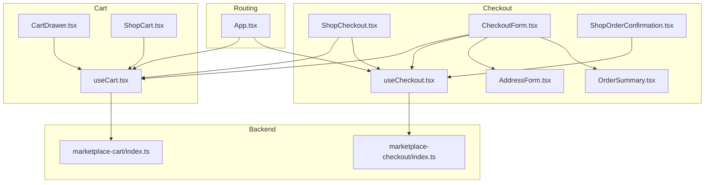
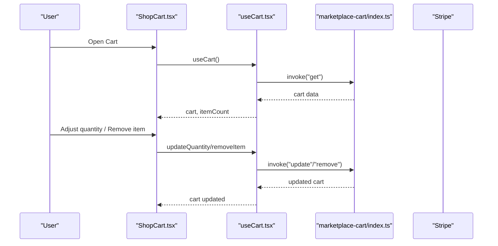
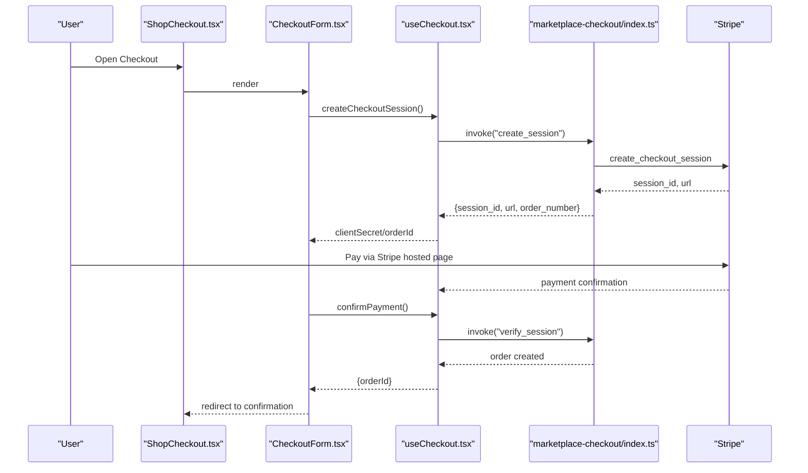
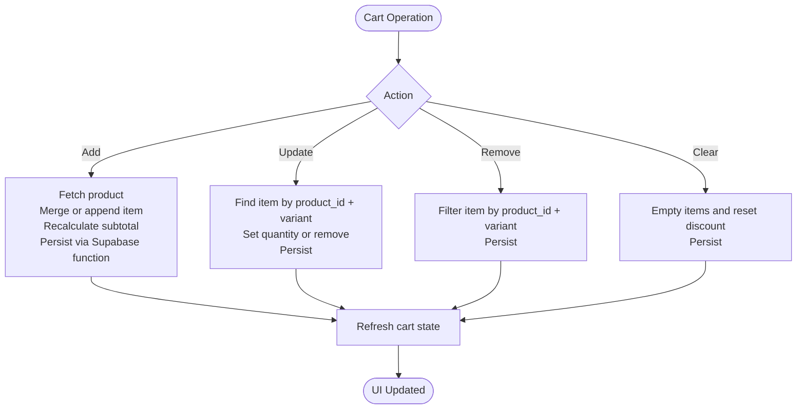
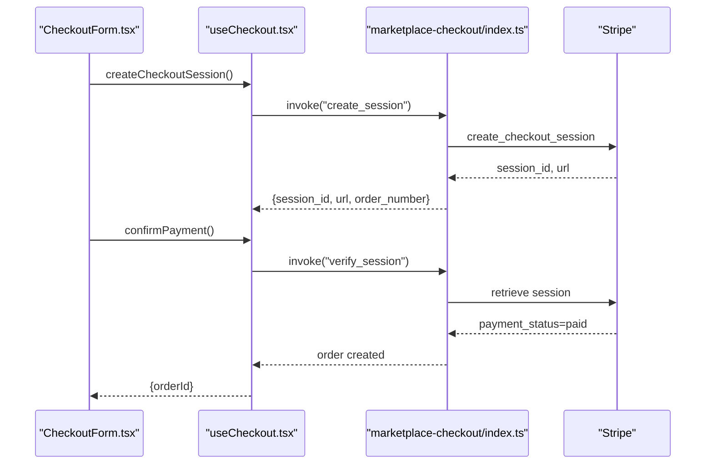
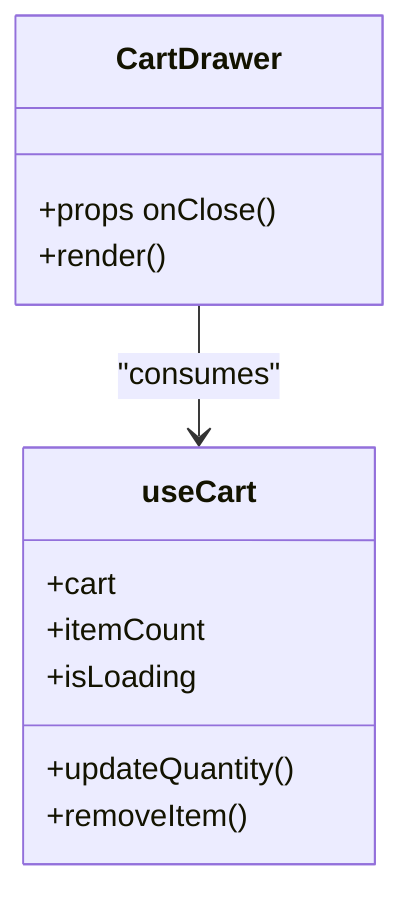
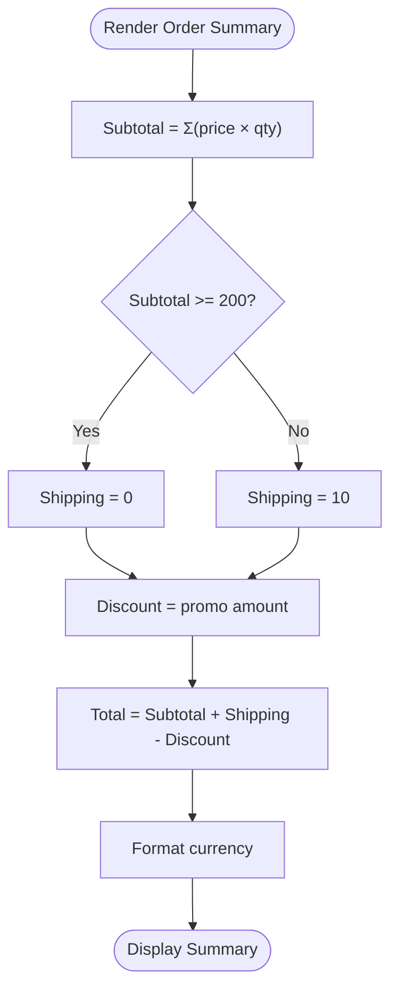
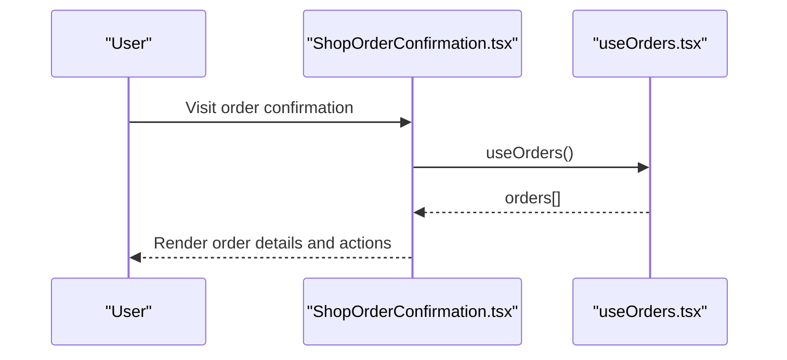
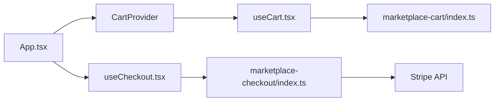

# Shopping Experience

<cite>
**Referenced Files in This Document**
- [useCart.tsx](file://src/hooks/useCart.tsx)
- [CartDrawer.tsx](file://src/components/marketplace/CartDrawer.tsx)
- [ShopCart.tsx](file://src/pages/shop/ShopCart.tsx)
- [useCheckout.tsx](file://src/hooks/useCheckout.tsx)
- [ShopCheckout.tsx](file://src/pages/shop/ShopCheckout.tsx)
- [CheckoutForm.tsx](file://src/components/shop/CheckoutForm.tsx)
- [AddressForm.tsx](file://src/components/shop/AddressForm.tsx)
- [OrderSummary.tsx](file://src/components/shop/OrderSummary.tsx)
- [ShopOrderConfirmation.tsx](file://src/pages/shop/ShopOrderConfirmation.tsx)
- [useOrders.tsx](file://src/hooks/useOrders.tsx)
- [OrderHistoryItem.tsx](file://src/components/shop/OrderHistoryItem.tsx)
- [marketplace-math.ts](file://src/lib/marketplace-math.ts)
- [App.tsx](file://src/App.tsx)
- [marketplace-cart/index.ts](file://supabase/functions/marketplace-cart/index.ts)
- [marketplace-checkout/index.ts](file://supabase/functions/marketplace-checkout/index.ts)
</cite>

## Table of Contents
1. [Introduction](#introduction)
2. [Project Structure](#project-structure)
3. [Core Components](#core-components)
4. [Architecture Overview](#architecture-overview)
5. [Detailed Component Analysis](#detailed-component-analysis)
6. [Dependency Analysis](#dependency-analysis)
7. [Performance Considerations](#performance-considerations)
8. [Troubleshooting Guide](#troubleshooting-guide)
9. [Conclusion](#conclusion)

## Introduction
This document explains the complete shopping experience in the marketplace, covering cart management, checkout flow, and user journey optimization. It details how items are added, adjusted, and persisted; how the checkout form validates and processes orders; how Stripe payments integrate; and how order summaries and customer data are managed. Practical examples are provided via file references to guide implementation and troubleshooting.

## Project Structure
The shopping experience spans frontend React components and hooks, Supabase edge functions, and routing configuration:
- Frontend hooks manage cart and checkout state and communicate with Supabase Edge Functions.
- Pages render the shopping cart, checkout, and order confirmation views.
- Components encapsulate reusable UI for cart drawers, checkout forms, address management, and order summaries.
- Supabase functions implement server-side cart operations, Stripe checkout sessions, and order creation.
- Routing wraps pages with providers for cart, wishlist, and authentication.

**Diagram sources**
- [App.tsx](file://src/App.tsx#L195-L222)
- [useCart.tsx](file://src/hooks/useCart.tsx#L57-L219)
- [CartDrawer.tsx](file://src/components/marketplace/CartDrawer.tsx#L13-L170)
- [ShopCart.tsx](file://src/pages/shop/ShopCart.tsx#L9-L221)
- [useCheckout.tsx](file://src/hooks/useCheckout.tsx#L29-L187)
- [ShopCheckout.tsx](file://src/pages/shop/ShopCheckout.tsx#L10-L85)
- [CheckoutForm.tsx](file://src/components/shop/CheckoutForm.tsx#L25-L365)
- [AddressForm.tsx](file://src/components/shop/AddressForm.tsx#L28-L157)
- [OrderSummary.tsx](file://src/components/shop/OrderSummary.tsx#L31-L198)
- [ShopOrderConfirmation.tsx](file://src/pages/shop/ShopOrderConfirmation.tsx#L12-L221)
- [marketplace-cart/index.ts](file://supabase/functions/marketplace-cart/index.ts#L24-L334)
- [marketplace-checkout/index.ts](file://supabase/functions/marketplace-checkout/index.ts#L27-L318)

**Section sources**
- [App.tsx](file://src/App.tsx#L195-L222)

## Core Components
- Cart Context and Provider: Centralizes cart state, persistence, and operations (add/update/remove/clear) with guest and authenticated user support.
- Checkout Hook: Manages Stripe checkout session creation, payment confirmation, and promo code application/removal.
- Cart Drawer: Real-time cart drawer with item quantity controls, removal, and order summary.
- Cart Page: Full cart view with order summary, shipping estimation, and clear cart.
- Checkout Form: Multi-step form with shipping, payment method selection, and review steps.
- Address Form: Structured form for shipping address with saved address selection.
- Order Summary: Live calculation of subtotal, shipping, discount, and total; promo code application.
- Order Confirmation: Post-payment confirmation page with order details and next steps.
- Orders Hook: Fetches customer orders and saved addresses for account and history views.
- Currency Formatting: Consistent currency formatting utilities.

**Section sources**
- [useCart.tsx](file://src/hooks/useCart.tsx#L57-L219)
- [CartDrawer.tsx](file://src/components/marketplace/CartDrawer.tsx#L13-L170)
- [ShopCart.tsx](file://src/pages/shop/ShopCart.tsx#L9-L221)
- [useCheckout.tsx](file://src/hooks/useCheckout.tsx#L29-L187)
- [ShopCheckout.tsx](file://src/pages/shop/ShopCheckout.tsx#L10-L85)
- [CheckoutForm.tsx](file://src/components/shop/CheckoutForm.tsx#L25-L365)
- [AddressForm.tsx](file://src/components/shop/AddressForm.tsx#L28-L157)
- [OrderSummary.tsx](file://src/components/shop/OrderSummary.tsx#L31-L198)
- [ShopOrderConfirmation.tsx](file://src/pages/shop/ShopOrderConfirmation.tsx#L12-L221)
- [useOrders.tsx](file://src/hooks/useOrders.tsx#L58-L149)
- [marketplace-math.ts](file://src/lib/marketplace-math.ts#L74-L94)

## Architecture Overview
The shopping experience integrates frontend hooks with Supabase Edge Functions and Stripe:
- Cart operations (get/add/update/remove/clear) are invoked via Supabase functions, supporting guest sessions and authenticated customers.
- Checkout operations create Stripe Checkout Sessions and later confirm orders, persisting them to the database and clearing the cart.
- Real-time updates occur through React state and Supabase function responses.

**Diagram sources**
- [ShopCart.tsx](file://src/pages/shop/ShopCart.tsx#L9-L221)
- [useCart.tsx](file://src/hooks/useCart.tsx#L101-L197)
- [marketplace-cart/index.ts](file://supabase/functions/marketplace-cart/index.ts#L113-L147)

**Diagram sources**
- [ShopCheckout.tsx](file://src/pages/shop/ShopCheckout.tsx#L10-L85)
- [CheckoutForm.tsx](file://src/components/shop/CheckoutForm.tsx#L25-L365)
- [useCheckout.tsx](file://src/hooks/useCheckout.tsx#L38-L119)
- [marketplace-checkout/index.ts](file://supabase/functions/marketplace-checkout/index.ts#L52-L174)

## Detailed Component Analysis

### Cart Management
- State model: Cart with items, subtotal, discount code, and discount amount; items include product metadata and availability.
- Persistence: Guest sessions use a local session identifier; authenticated users link to a customer record.
- Operations:
  - Add item: Validates product availability, enriches with product and designer info, updates subtotal.
  - Update quantity: Adjusts item quantity or removes if zero.
  - Remove item: Filters item from cart.
  - Clear cart: Empties items and resets discount fields.
- Real-time updates: Drawer and cart page reflect changes immediately after function responses.

**Diagram sources**
- [useCart.tsx](file://src/hooks/useCart.tsx#L113-L197)
- [marketplace-cart/index.ts](file://supabase/functions/marketplace-cart/index.ts#L149-L318)

**Section sources**
- [useCart.tsx](file://src/hooks/useCart.tsx#L5-L228)
- [CartDrawer.tsx](file://src/components/marketplace/CartDrawer.tsx#L13-L170)
- [ShopCart.tsx](file://src/pages/shop/ShopCart.tsx#L9-L221)
- [marketplace-cart/index.ts](file://supabase/functions/marketplace-cart/index.ts#L79-L147)

### Checkout Flow
- Multi-step form:
  - Step 1: Contact and shipping address; saved addresses available.
  - Step 2: Payment method selection (Stripe).
  - Step 3: Review order and terms agreement.
- Validation: Prevents proceeding without required fields or terms.
- Stripe integration:
  - Creates a Stripe Checkout Session with line items and shipping cost.
  - On success, verifies payment and creates an order with items, totals, and metadata.
  - Clears the cart upon successful order creation.
- Order summary: Live computation of subtotal, shipping, discount, and total.

**Diagram sources**
- [CheckoutForm.tsx](file://src/components/shop/CheckoutForm.tsx#L57-L89)
- [useCheckout.tsx](file://src/hooks/useCheckout.tsx#L38-L119)
- [marketplace-checkout/index.ts](file://supabase/functions/marketplace-checkout/index.ts#L52-L174)

**Section sources**
- [ShopCheckout.tsx](file://src/pages/shop/ShopCheckout.tsx#L10-L85)
- [CheckoutForm.tsx](file://src/components/shop/CheckoutForm.tsx#L25-L365)
- [AddressForm.tsx](file://src/components/shop/AddressForm.tsx#L28-L157)
- [OrderSummary.tsx](file://src/components/shop/OrderSummary.tsx#L31-L198)
- [useCheckout.tsx](file://src/hooks/useCheckout.tsx#L29-L187)
- [marketplace-checkout/index.ts](file://supabase/functions/marketplace-checkout/index.ts#L52-L174)

### Cart Drawer Component
- Displays cart items with image, title, variant, price, and quantity.
- Provides inline quantity adjustment and removal controls.
- Shows free shipping progress and order totals.
- Links to cart and checkout pages.

**Diagram sources**
- [CartDrawer.tsx](file://src/components/marketplace/CartDrawer.tsx#L13-L170)
- [useCart.tsx](file://src/hooks/useCart.tsx#L34-L43)

**Section sources**
- [CartDrawer.tsx](file://src/components/marketplace/CartDrawer.tsx#L13-L170)

### Order Summary Calculations
- Subtotal: Sum of item prices × quantities.
- Shipping: Free over threshold; otherwise flat rate; regional rates in backend.
- Discount: Applied promo code amount.
- Total: Subtotal + Shipping − Discount.
- Currency formatting: Consistent USD formatting across components.

**Diagram sources**
- [OrderSummary.tsx](file://src/components/shop/OrderSummary.tsx#L43-L175)
- [CheckoutForm.tsx](file://src/components/shop/CheckoutForm.tsx#L52-L55)
- [marketplace-math.ts](file://src/lib/marketplace-math.ts#L74-L94)

**Section sources**
- [OrderSummary.tsx](file://src/components/shop/OrderSummary.tsx#L31-L198)
- [CheckoutForm.tsx](file://src/components/shop/CheckoutForm.tsx#L52-L55)
- [marketplace-math.ts](file://src/lib/marketplace-math.ts#L74-L94)

### Order Confirmation and History
- Confirmation page displays order number, items, and totals with status badges.
- Order history lists past orders with status icons and quick links to track.
- Orders hook fetches customer orders and enriches product and designer data.

**Diagram sources**
- [ShopOrderConfirmation.tsx](file://src/pages/shop/ShopOrderConfirmation.tsx#L12-L221)
- [useOrders.tsx](file://src/hooks/useOrders.tsx#L58-L149)
- [OrderHistoryItem.tsx](file://src/components/shop/OrderHistoryItem.tsx#L77-L173)

**Section sources**
- [ShopOrderConfirmation.tsx](file://src/pages/shop/ShopOrderConfirmation.tsx#L12-L221)
- [useOrders.tsx](file://src/hooks/useOrders.tsx#L58-L149)
- [OrderHistoryItem.tsx](file://src/components/shop/OrderHistoryItem.tsx#L77-L173)

## Dependency Analysis
- Providers and routing:
  - App wraps marketplace routes with CartProvider and WishlistProvider to enable cart and wishlist features.
- Frontend-to-backend:
  - useCart invokes Supabase functions for cart operations.
  - useCheckout invokes Supabase functions for checkout session creation and verification.
- Backend functions:
  - marketplace-cart manages cart persistence and enrichment.
  - marketplace-checkout integrates with Stripe to create sessions and verify payments, then persists orders.

**Diagram sources**
- [App.tsx](file://src/App.tsx#L195-L222)
- [useCart.tsx](file://src/hooks/useCart.tsx#L67-L99)
- [useCheckout.tsx](file://src/hooks/useCheckout.tsx#L47-L56)
- [marketplace-cart/index.ts](file://supabase/functions/marketplace-cart/index.ts#L30-L76)
- [marketplace-checkout/index.ts](file://supabase/functions/marketplace-checkout/index.ts#L33-L45)

**Section sources**
- [App.tsx](file://src/App.tsx#L195-L222)
- [useCart.tsx](file://src/hooks/useCart.tsx#L67-L99)
- [useCheckout.tsx](file://src/hooks/useCheckout.tsx#L47-L56)
- [marketplace-cart/index.ts](file://supabase/functions/marketplace-cart/index.ts#L30-L76)
- [marketplace-checkout/index.ts](file://supabase/functions/marketplace-checkout/index.ts#L33-L45)

## Performance Considerations
- Function timeouts: Cart operations enforce a 10-second timeout to prevent hanging requests.
- Efficient cart refresh: CartProvider initializes and refreshes cart on mount.
- Minimal re-renders: useCart and useCheckout memoize callbacks to avoid unnecessary recalculations.
- Currency formatting: Centralized formatter reduces repeated computations.
- Backend caching: Supabase edge functions cache minimal data and compute totals server-side.

[No sources needed since this section provides general guidance]

## Troubleshooting Guide
- Cart errors:
  - Timeout: Requests exceeding 10 seconds surface a timeout error; retry the operation.
  - Not found: Adding or updating items requires a valid product ID; ensure product exists and is active.
  - Quantity adjustments: Zero quantity removes the item; verify variant matching when updating.
- Checkout errors:
  - Empty cart: Cannot create a checkout session if cart is empty.
  - Payment not completed: Session verification requires paid status; ensure Stripe payment succeeded.
  - Promo code invalid: Applying/removing promo codes surfaces errors; confirm code validity and cart association.
- Toast notifications:
  - Cart operations and checkout actions trigger user-friendly toasts for success and failure.

**Section sources**
- [useCart.tsx](file://src/hooks/useCart.tsx#L92-L99)
- [useCart.tsx](file://src/hooks/useCart.tsx#L129-L136)
- [useCheckout.tsx](file://src/hooks/useCheckout.tsx#L72-L85)
- [useCheckout.tsx](file://src/hooks/useCheckout.tsx#L141-L148)

## Conclusion
The shopping experience combines a robust cart system with a streamlined checkout powered by Stripe. Real-time updates, guest and authenticated persistence, and clear order summaries optimize the user journey. The modular architecture ensures maintainability and scalability, while backend functions centralize business logic for reliability and performance.