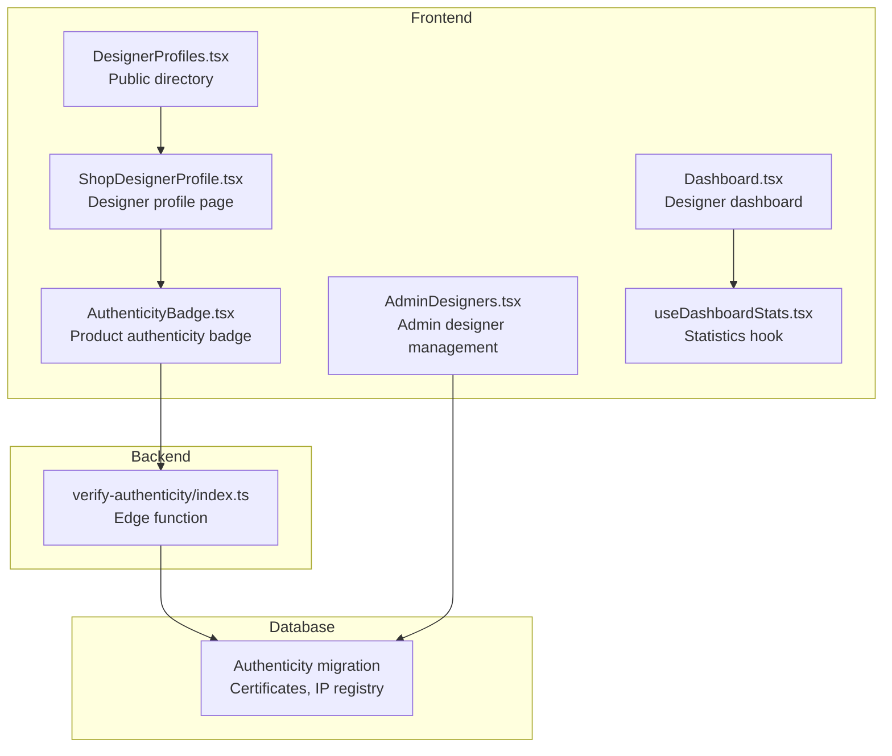
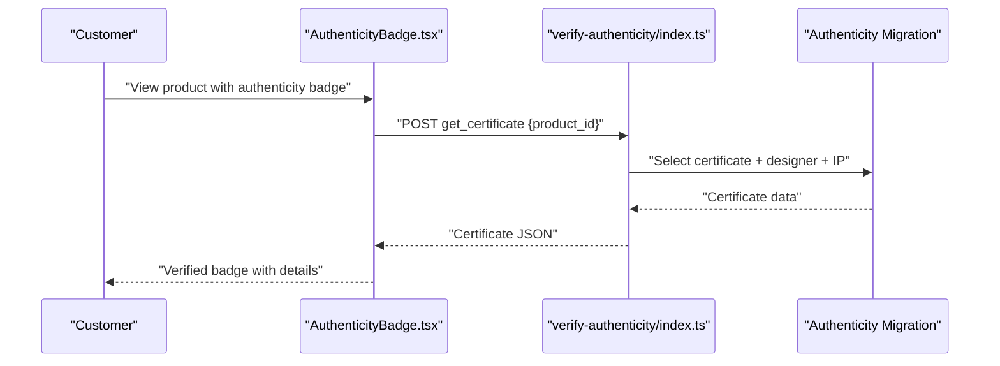
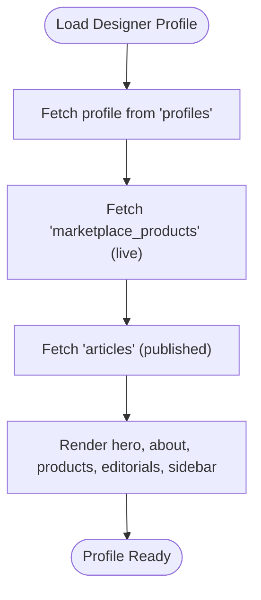
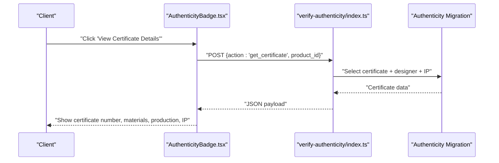
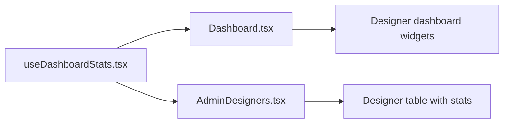
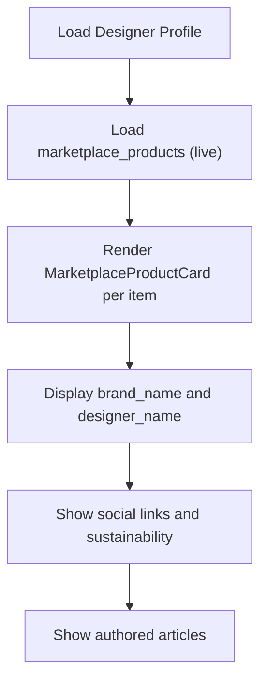
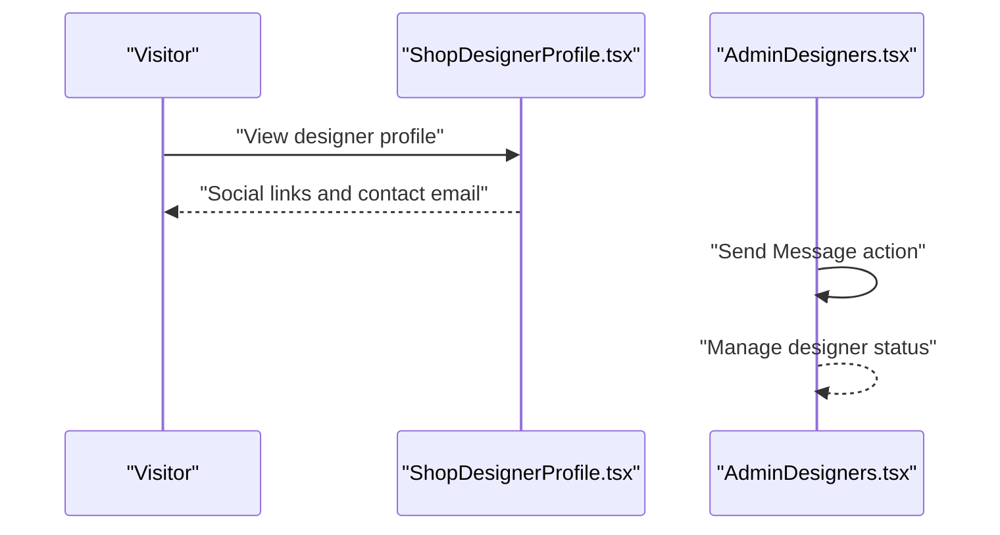
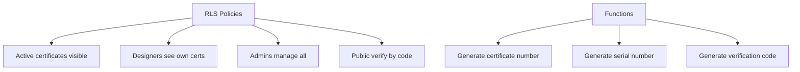
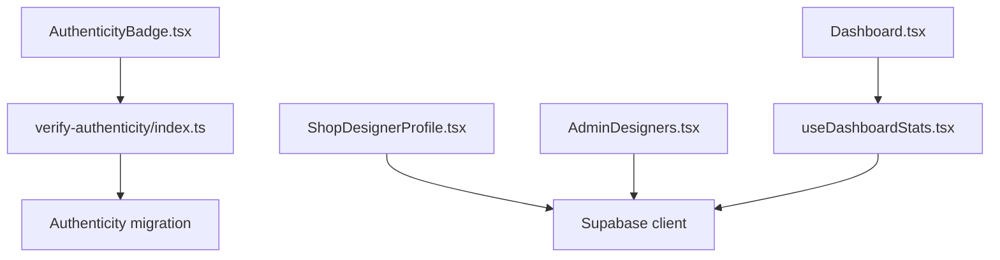

# Designer Profile Integration

<cite>
**Referenced Files in This Document**
- [DesignerProfiles.tsx](file://src/pages/public/DesignerProfiles.tsx)
- [ShopDesignerProfile.tsx](file://src/pages/shop/ShopDesignerProfile.tsx)
- [AuthenticityBadge.tsx](file://src/components/marketplace/AuthenticityBadge.tsx)
- [verify-authenticity/index.ts](file://supabase/functions/verify-authenticity/index.ts)
- [20260127240000_product_authenticity_system.sql](file://supabase/migrations/20260127240000_product_authenticity_system.sql)
- [AdminDesigners.tsx](file://src/pages/admin/AdminDesigners.tsx)
- [useDashboardStats.tsx](file://src/hooks/useDashboardStats.tsx)
- [Dashboard.tsx](file://src/pages/Dashboard.tsx)
- [types.ts](file://src/integrations/supabase/types.ts)
</cite>

## Table of Contents
1. [Introduction](#introduction)
2. [Project Structure](#project-structure)
3. [Core Components](#core-components)
4. [Architecture Overview](#architecture-overview)
5. [Detailed Component Analysis](#detailed-component-analysis)
6. [Dependency Analysis](#dependency-analysis)
7. [Performance Considerations](#performance-considerations)
8. [Troubleshooting Guide](#troubleshooting-guide)
9. [Conclusion](#conclusion)

## Introduction
This document describes the designer profile integration within the marketplace, covering onboarding, profile creation, verification, authenticity guarantees, reputation metrics, trust indicators, product listings, brand representation, analytics, sales tracking, communication features, and policy compliance. It synthesizes frontend pages, backend Supabase functions, and database schemas to present a complete picture of how designers are onboarded, represented, and supported across the platform.

## Project Structure
The designer profile integration spans several frontend pages and backend services:
- Public designer directory and profile page
- Authenticity verification system with a dedicated badge component
- Admin dashboard for designer management
- Real-time dashboard statistics for designers
- Supabase edge function for verification and certificate retrieval
- Database schema supporting authenticity, IP linkage, and verification

**Diagram sources**
- [DesignerProfiles.tsx](file://src/pages/public/DesignerProfiles.tsx#L1-L236)
- [ShopDesignerProfile.tsx](file://src/pages/shop/ShopDesignerProfile.tsx#L1-L420)
- [AuthenticityBadge.tsx](file://src/components/marketplace/AuthenticityBadge.tsx#L1-L158)
- [verify-authenticity/index.ts](file://supabase/functions/verify-authenticity/index.ts#L1-L262)
- [20260127240000_product_authenticity_system.sql](file://supabase/migrations/20260127240000_product_authenticity_system.sql#L1-L238)
- [AdminDesigners.tsx](file://src/pages/admin/AdminDesigners.tsx#L1-L403)
- [Dashboard.tsx](file://src/pages/Dashboard.tsx#L1-L434)
- [useDashboardStats.tsx](file://src/hooks/useDashboardStats.tsx#L1-L138)

**Section sources**
- [DesignerProfiles.tsx](file://src/pages/public/DesignerProfiles.tsx#L1-L236)
- [ShopDesignerProfile.tsx](file://src/pages/shop/ShopDesignerProfile.tsx#L1-L420)
- [AuthenticityBadge.tsx](file://src/components/marketplace/AuthenticityBadge.tsx#L1-L158)
- [verify-authenticity/index.ts](file://supabase/functions/verify-authenticity/index.ts#L1-L262)
- [20260127240000_product_authenticity_system.sql](file://supabase/migrations/20260127240000_product_authenticity_system.sql#L1-L238)
- [AdminDesigners.tsx](file://src/pages/admin/AdminDesigners.tsx#L1-L403)
- [Dashboard.tsx](file://src/pages/Dashboard.tsx#L1-L434)
- [useDashboardStats.tsx](file://src/hooks/useDashboardStats.tsx#L1-L138)

## Core Components
- Designer directory and profile page: Presents designer bios, collections, editorial content, and social links.
- Authenticity badge: Displays verified product certificates and IP protection details.
- Verification edge function: Handles public verification, certificate retrieval, and admin certificate generation.
- Admin designer management: Lists designers, filters by status/rank, and updates account status.
- Designer dashboard and stats: Provides performance insights, earnings snapshots, and recent activity.
- Database schema: Supports product authenticity certificates, order-item certificates, IP registry, and product/IP linkage.

**Section sources**
- [ShopDesignerProfile.tsx](file://src/pages/shop/ShopDesignerProfile.tsx#L1-L420)
- [AuthenticityBadge.tsx](file://src/components/marketplace/AuthenticityBadge.tsx#L1-L158)
- [verify-authenticity/index.ts](file://supabase/functions/verify-authenticity/index.ts#L1-L262)
- [AdminDesigners.tsx](file://src/pages/admin/AdminDesigners.tsx#L1-L403)
- [Dashboard.tsx](file://src/pages/Dashboard.tsx#L1-L434)
- [useDashboardStats.tsx](file://src/hooks/useDashboardStats.tsx#L1-L138)
- [20260127240000_product_authenticity_system.sql](file://supabase/migrations/20260127240000_product_authenticity_system.sql#L1-L238)

## Architecture Overview
The designer profile integration follows a layered architecture:
- Frontend pages and components query Supabase for designer and product data.
- An edge function exposes public verification endpoints and generates certificates.
- Database tables enforce row-level security and maintain audit trails for authenticity and IP.

**Diagram sources**
- [AuthenticityBadge.tsx](file://src/components/marketplace/AuthenticityBadge.tsx#L17-L42)
- [verify-authenticity/index.ts](file://supabase/functions/verify-authenticity/index.ts#L124-L186)
- [20260127240000_product_authenticity_system.sql](file://supabase/migrations/20260127240000_product_authenticity_system.sql#L4-L96)

## Detailed Component Analysis

### Designer Onboarding and Profile Creation
- Public directory showcases top designers with specialty, product count, and ratings.
- Designer profile page aggregates:
  - Brand presentation (banner, avatar, brand name fallback)
  - About section (bio, artist statement, education, manufacturing locations)
  - Product collection (linked to marketplace_products)
  - Editorial features (articles authored by the designer)
  - Social links and sustainability practices
  - Custom inquiries via email contact

**Diagram sources**
- [ShopDesignerProfile.tsx](file://src/pages/shop/ShopDesignerProfile.tsx#L24-L104)

**Section sources**
- [DesignerProfiles.tsx](file://src/pages/public/DesignerProfiles.tsx#L14-L79)
- [ShopDesignerProfile.tsx](file://src/pages/shop/ShopDesignerProfile.tsx#L24-L104)

### Authenticity Badge System and Verification
- AuthenticityBadge displays a verified badge with expandable details.
- It queries the verification edge function to retrieve certificate metadata and IP linkage.
- The edge function supports:
  - Public verification by verification code or serial number
  - Retrieval of product certificates for product pages
  - Generation of certificates (admin-only with Authorization header)

**Diagram sources**
- [AuthenticityBadge.tsx](file://src/components/marketplace/AuthenticityBadge.tsx#L17-L42)
- [verify-authenticity/index.ts](file://supabase/functions/verify-authenticity/index.ts#L124-L186)
- [20260127240000_product_authenticity_system.sql](file://supabase/migrations/20260127240000_product_authenticity_system.sql#L4-L96)

**Section sources**
- [AuthenticityBadge.tsx](file://src/components/marketplace/AuthenticityBadge.tsx#L17-L158)
- [verify-authenticity/index.ts](file://supabase/functions/verify-authenticity/index.ts#L24-L122)
- [20260127240000_product_authenticity_system.sql](file://supabase/migrations/20260127240000_product_authenticity_system.sql#L151-L214)

### Trust Indicators and Reputation Metrics
- Designer reputation metrics surfaced in the admin panel include:
  - Completed stylebox submissions
  - Published items (proxy derived from submissions)
  - Revenue generated
  - Status (active/suspended)
- The dashboard provides:
  - Active styleboxes and completed styleboxes
  - Portfolio items count
  - Earnings snapshot (monthly and total)
  - Pending payouts
  - Products sold quantity

**Diagram sources**
- [useDashboardStats.tsx](file://src/hooks/useDashboardStats.tsx#L15-L138)
- [Dashboard.tsx](file://src/pages/Dashboard.tsx#L180-L225)
- [AdminDesigners.tsx](file://src/pages/admin/AdminDesigners.tsx#L73-L121)

**Section sources**
- [AdminDesigners.tsx](file://src/pages/admin/AdminDesigners.tsx#L73-L121)
- [useDashboardStats.tsx](file://src/hooks/useDashboardStats.tsx#L28-L98)
- [Dashboard.tsx](file://src/pages/Dashboard.tsx#L180-L225)

### Designer Product Listings and Brand Representation
- Designer profile page lists live products with brand and designer attribution.
- Social links and sustainability practices are prominently displayed in the sidebar.
- Editorials authored by the designer are shown as editorial features.

**Diagram sources**
- [ShopDesignerProfile.tsx](file://src/pages/shop/ShopDesignerProfile.tsx#L70-L104)
- [ShopDesignerProfile.tsx](file://src/pages/shop/ShopDesignerProfile.tsx#L263-L285)
- [ShopDesignerProfile.tsx](file://src/pages/shop/ShopDesignerProfile.tsx#L327-L414)

**Section sources**
- [ShopDesignerProfile.tsx](file://src/pages/shop/ShopDesignerProfile.tsx#L70-L104)
- [ShopDesignerProfile.tsx](file://src/pages/shop/ShopDesignerProfile.tsx#L263-L285)
- [ShopDesignerProfile.tsx](file://src/pages/shop/ShopDesignerProfile.tsx#L327-L414)

### Communication Features and Customer Service Integration
- Designer profile exposes contact options via social links and email.
- Custom inquiries are routed through email links.
- Admin actions support sending messages and managing designer accounts.

**Diagram sources**
- [ShopDesignerProfile.tsx](file://src/pages/shop/ShopDesignerProfile.tsx#L327-L414)
- [AdminDesigners.tsx](file://src/pages/admin/AdminDesigners.tsx#L350-L376)

**Section sources**
- [ShopDesignerProfile.tsx](file://src/pages/shop/ShopDesignerProfile.tsx#L327-L414)
- [AdminDesigners.tsx](file://src/pages/admin/AdminDesigners.tsx#L350-L376)

### Policy Compliance and Quality Standards
- Database policies ensure:
  - Public visibility of active certificates
  - Designer access to their own certificates
  - Admin management capabilities
  - Public verification by code for order item certificates
- Functions generate certificate numbers, serial numbers, and verification codes with deterministic formats.

**Diagram sources**
- [20260127240000_product_authenticity_system.sql](file://supabase/migrations/20260127240000_product_authenticity_system.sql#L98-L150)
- [20260127240000_product_authenticity_system.sql](file://supabase/migrations/20260127240000_product_authenticity_system.sql#L151-L214)

**Section sources**
- [20260127240000_product_authenticity_system.sql](file://supabase/migrations/20260127240000_product_authenticity_system.sql#L98-L150)
- [20260127240000_product_authenticity_system.sql](file://supabase/migrations/20260127240000_product_authenticity_system.sql#L151-L214)

## Dependency Analysis
- Frontend depends on Supabase client for data fetching and React Query for caching.
- AuthenticityBadge depends on the verification edge function for certificate retrieval.
- AdminDesigners depends on Supabase admin client and RLS policies for secure listing and updates.
- Dashboard statistics depend on earnings, portfolio projects, and marketplace sales data.

**Diagram sources**
- [ShopDesignerProfile.tsx](file://src/pages/shop/ShopDesignerProfile.tsx#L15-L16)
- [AuthenticityBadge.tsx](file://src/components/marketplace/AuthenticityBadge.tsx#L23-L42)
- [AdminDesigners.tsx](file://src/pages/admin/AdminDesigners.tsx#L3-L4)
- [Dashboard.tsx](file://src/pages/Dashboard.tsx#L24-L25)
- [useDashboardStats.tsx](file://src/hooks/useDashboardStats.tsx#L2-L3)
- [verify-authenticity/index.ts](file://supabase/functions/verify-authenticity/index.ts#L29-L32)
- [20260127240000_product_authenticity_system.sql](file://supabase/migrations/20260127240000_product_authenticity_system.sql#L1-L238)

**Section sources**
- [ShopDesignerProfile.tsx](file://src/pages/shop/ShopDesignerProfile.tsx#L15-L16)
- [AuthenticityBadge.tsx](file://src/components/marketplace/AuthenticityBadge.tsx#L23-L42)
- [AdminDesigners.tsx](file://src/pages/admin/AdminDesigners.tsx#L3-L4)
- [Dashboard.tsx](file://src/pages/Dashboard.tsx#L24-L25)
- [useDashboardStats.tsx](file://src/hooks/useDashboardStats.tsx#L2-L3)
- [verify-authenticity/index.ts](file://supabase/functions/verify-authenticity/index.ts#L29-L32)
- [20260127240000_product_authenticity_system.sql](file://supabase/migrations/20260127240000_product_authenticity_system.sql#L1-L238)

## Performance Considerations
- Use React Query caching for repeated queries on designer profiles and products.
- Paginate designer listings in admin views to reduce payload size.
- Index certificate and verification code fields to optimize verification queries.
- Defer heavy computations (e.g., certificate generation) to edge functions to keep the client responsive.

## Troubleshooting Guide
- Authentication errors when accessing certificates: Ensure proper Authorization headers for admin-only certificate generation and verify that public endpoints are called without auth.
- Missing certificate data: Confirm product_id exists and certificate is active; check RLS policies for visibility.
- Slow profile loads: Verify network requests and consider adding optimistic UI updates for follow/share actions.
- Admin actions failing: Check toast feedback and confirm mutation keys and query invalidation are correctly configured.

**Section sources**
- [verify-authenticity/index.ts](file://supabase/functions/verify-authenticity/index.ts#L188-L248)
- [20260127240000_product_authenticity_system.sql](file://supabase/migrations/20260127240000_product_authenticity_system.sql#L104-L149)

## Conclusion
The designer profile integration combines a robust frontend experience with a secure, auditable backend. Designers can present their brands, showcase products, and communicate with customers, while the authenticity system and admin tools ensure trust, compliance, and operational efficiency. The architecture leverages Supabase’s real-time capabilities, RLS policies, and edge functions to provide scalable and secure designer-centric features.