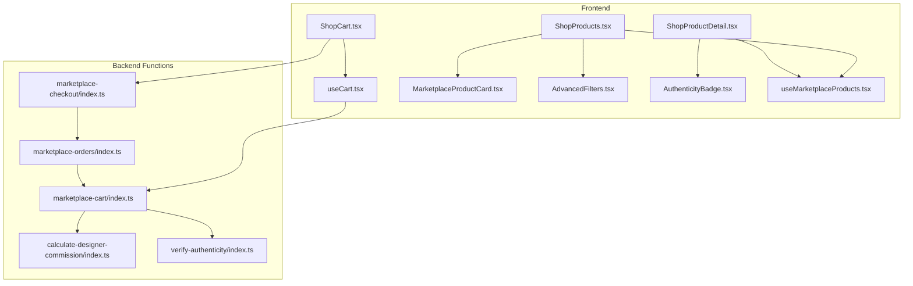
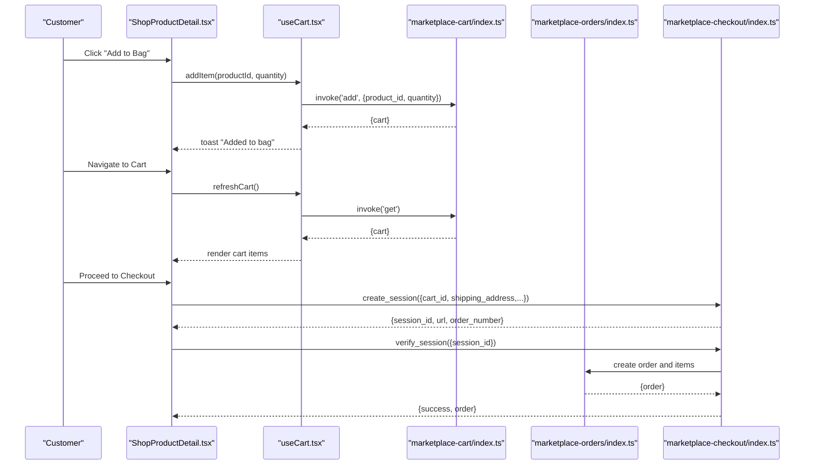
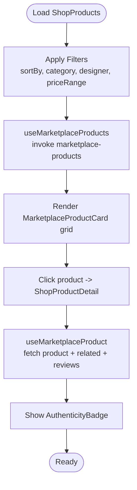
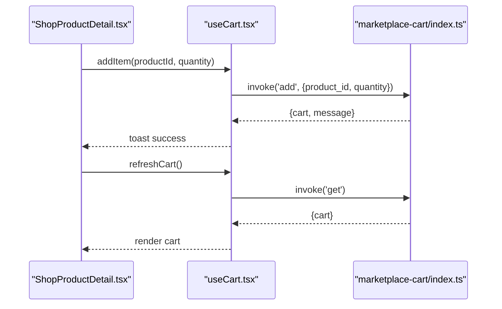
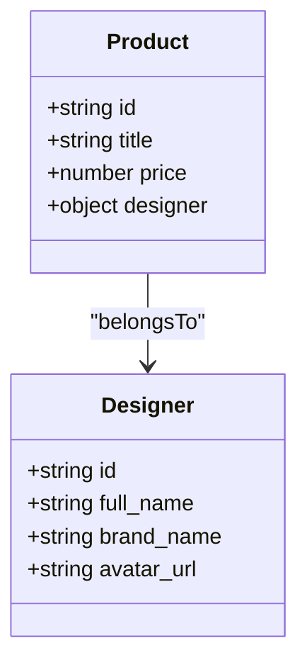
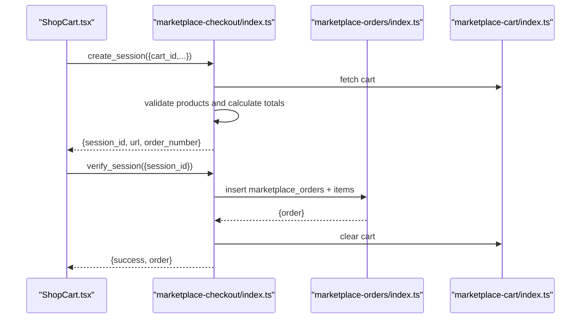
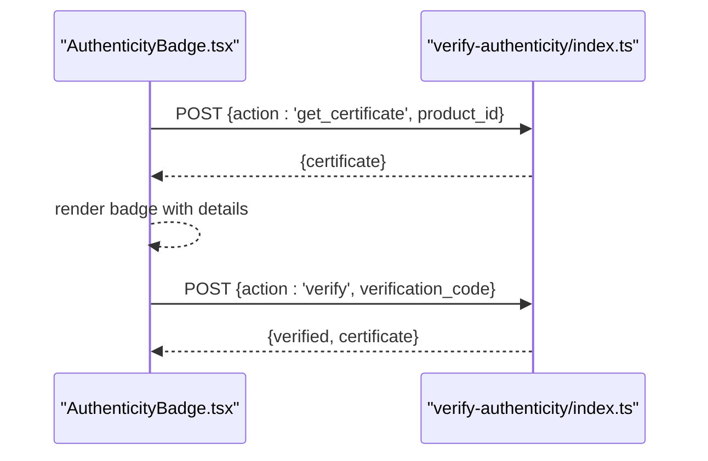
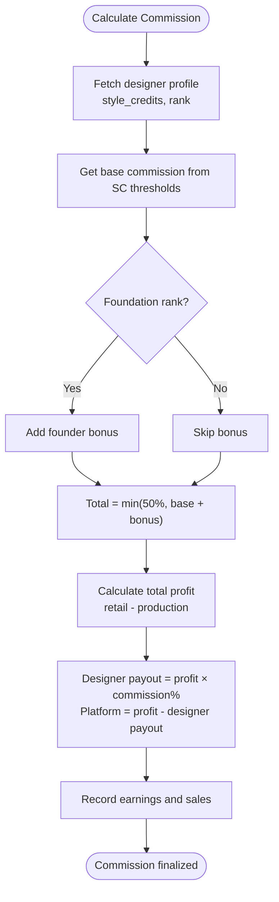
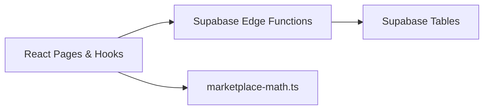

# Marketplace System

<cite>
**Referenced Files in This Document**
- [ShopProducts.tsx](file://src/pages/shop/ShopProducts.tsx)
- [ShopProductDetail.tsx](file://src/pages/shop/ShopProductDetail.tsx)
- [ShopCart.tsx](file://src/pages/shop/ShopCart.tsx)
- [useCart.tsx](file://src/hooks/useCart.tsx)
- [MarketplaceProductCard.tsx](file://src/components/marketplace/MarketplaceProductCard.tsx)
- [AdvancedFilters.tsx](file://src/components/marketplace/AdvancedFilters.tsx)
- [AuthenticityBadge.tsx](file://src/components/marketplace/AuthenticityBadge.tsx)
- [useMarketplaceProducts.tsx](file://src/hooks/useMarketplaceProducts.tsx)
- [marketplace-cart/index.ts](file://supabase/functions/marketplace-cart/index.ts)
- [marketplace-checkout/index.ts](file://supabase/functions/marketplace-checkout/index.ts)
- [marketplace-orders/index.ts](file://supabase/functions/marketplace-orders/index.ts)
- [calculate-designer-commission/index.ts](file://supabase/functions/calculate-designer-commission/index.ts)
- [verify-authenticity/index.ts](file://supabase/functions/verify-authenticity/index.ts)
- [marketplace-math.ts](file://src/lib/marketplace-math.ts)
</cite>

## Table of Contents
1. [Introduction](#introduction)
2. [Project Structure](#project-structure)
3. [Core Components](#core-components)
4. [Architecture Overview](#architecture-overview)
5. [Detailed Component Analysis](#detailed-component-analysis)
6. [Dependency Analysis](#dependency-analysis)
7. [Performance Considerations](#performance-considerations)
8. [Troubleshooting Guide](#troubleshooting-guide)
9. [Conclusion](#conclusion)

## Introduction
This document describes the Adorzia marketplace system covering product catalog management, shopping cart, designer profiles, order processing, and payment integration. It explains the end-to-end workflow from product discovery to purchase completion, including inventory management, pricing strategies, designer commission calculations, and order fulfillment. It also documents search and filtering, product categorization, recommendation systems, marketplace policies, authenticity verification, and dispute resolution mechanisms.

## Project Structure
The marketplace spans frontend React components and Supabase Edge Functions:
- Pages: Product listings, product detail, cart, and checkout
- Hooks: Cart state management and marketplace queries
- Components: Product cards, advanced filters, authenticity badges
- Backend Functions: Cart operations, checkout and payments, order management, commission calculation, authenticity verification

**Diagram sources**
- [ShopProducts.tsx](file://src/pages/shop/ShopProducts.tsx#L1-L201)
- [ShopProductDetail.tsx](file://src/pages/shop/ShopProductDetail.tsx#L1-L350)
- [ShopCart.tsx](file://src/pages/shop/ShopCart.tsx#L1-L221)
- [useCart.tsx](file://src/hooks/useCart.tsx#L1-L214)
- [MarketplaceProductCard.tsx](file://src/components/marketplace/MarketplaceProductCard.tsx#L1-L206)
- [AdvancedFilters.tsx](file://src/components/marketplace/AdvancedFilters.tsx#L1-L379)
- [AuthenticityBadge.tsx](file://src/components/marketplace/AuthenticityBadge.tsx#L1-L158)
- [useMarketplaceProducts.tsx](file://src/hooks/useMarketplaceProducts.tsx#L1-L209)
- [marketplace-cart/index.ts](file://supabase/functions/marketplace-cart/index.ts#L1-L322)
- [marketplace-checkout/index.ts](file://supabase/functions/marketplace-checkout/index.ts#L1-L330)
- [marketplace-orders/index.ts](file://supabase/functions/marketplace-orders/index.ts#L1-L226)
- [calculate-designer-commission/index.ts](file://supabase/functions/calculate-designer-commission/index.ts#L1-L198)
- [verify-authenticity/index.ts](file://supabase/functions/verify-authenticity/index.ts#L1-L262)

**Section sources**
- [ShopProducts.tsx](file://src/pages/shop/ShopProducts.tsx#L1-L201)
- [ShopProductDetail.tsx](file://src/pages/shop/ShopProductDetail.tsx#L1-L350)
- [ShopCart.tsx](file://src/pages/shop/ShopCart.tsx#L1-L221)
- [useCart.tsx](file://src/hooks/useCart.tsx#L1-L214)
- [useMarketplaceProducts.tsx](file://src/hooks/useMarketplaceProducts.tsx#L1-L209)

## Core Components
- Product Catalog Management
  - Listing and filtering via [useMarketplaceProducts.tsx](file://src/hooks/useMarketplaceProducts.tsx#L83-L126)
  - Product detail and related products via [useMarketplaceProducts.tsx](file://src/hooks/useMarketplaceProducts.tsx#L128-L155)
  - Categories and collections via [useMarketplaceProducts.tsx](file://src/hooks/useMarketplaceProducts.tsx#L158-L180) and [useMarketplaceProducts.tsx](file://src/hooks/useMarketplaceProducts.tsx#L182-L208)
- Shopping Cart
  - Cart provider and actions via [useCart.tsx](file://src/hooks/useCart.tsx#L57-L204)
  - Frontend cart UI via [ShopCart.tsx](file://src/pages/shop/ShopCart.tsx#L9-L221)
  - Backend cart operations via [marketplace-cart/index.ts](file://supabase/functions/marketplace-cart/index.ts#L137-L306)
- Designer Profiles
  - Designer information embedded in product queries via [useMarketplaceProducts.tsx](file://src/hooks/useMarketplaceProducts.tsx#L37-L47)
  - Designer links in product cards via [MarketplaceProductCard.tsx](file://src/components/marketplace/MarketplaceProductCard.tsx#L174-L183)
- Order Processing
  - Customer order history and details via [marketplace-orders/index.ts](file://supabase/functions/marketplace-orders/index.ts#L60-L145)
  - Order cancellation and inventory restoration via [marketplace-orders/index.ts](file://supabase/functions/marketplace-orders/index.ts#L147-L210)
- Payment Integration
  - Stripe checkout session creation and verification via [marketplace-checkout/index.ts](file://supabase/functions/marketplace-checkout/index.ts#L40-L173) and [marketplace-checkout/index.ts](file://supabase/functions/marketplace-checkout/index.ts#L175-L314)
- Authenticity Verification
  - Authenticity badge and certificate retrieval via [AuthenticityBadge.tsx](file://src/components/marketplace/AuthenticityBadge.tsx#L17-L42) and [verify-authenticity/index.ts](file://supabase/functions/verify-authenticity/index.ts#L124-L186)
- Search and Filtering
  - Advanced filters UI via [AdvancedFilters.tsx](file://src/components/marketplace/AdvancedFilters.tsx#L77-L379)
  - Product cards and quick actions via [MarketplaceProductCard.tsx](file://src/components/marketplace/MarketplaceProductCard.tsx#L27-L204)

**Section sources**
- [useMarketplaceProducts.tsx](file://src/hooks/useMarketplaceProducts.tsx#L83-L180)
- [ShopCart.tsx](file://src/pages/shop/ShopCart.tsx#L9-L221)
- [useCart.tsx](file://src/hooks/useCart.tsx#L57-L204)
- [marketplace-cart/index.ts](file://supabase/functions/marketplace-cart/index.ts#L137-L306)
- [marketplace-orders/index.ts](file://supabase/functions/marketplace-orders/index.ts#L60-L210)
- [marketplace-checkout/index.ts](file://supabase/functions/marketplace-checkout/index.ts#L40-L314)
- [AuthenticityBadge.tsx](file://src/components/marketplace/AuthenticityBadge.tsx#L17-L42)
- [verify-authenticity/index.ts](file://supabase/functions/verify-authenticity/index.ts#L124-L186)
- [AdvancedFilters.tsx](file://src/components/marketplace/AdvancedFilters.tsx#L77-L379)
- [MarketplaceProductCard.tsx](file://src/components/marketplace/MarketplaceProductCard.tsx#L27-L204)

## Architecture Overview
The marketplace follows a frontend-first pattern with Supabase Edge Functions handling cart, checkout, orders, commission, and authenticity operations. The frontend uses React Query for data fetching and state, while backend functions enforce business logic and maintain data consistency.

**Diagram sources**
- [ShopProductDetail.tsx](file://src/pages/shop/ShopProductDetail.tsx#L67-L69)
- [useCart.tsx](file://src/hooks/useCart.tsx#L99-L123)
- [marketplace-cart/index.ts](file://supabase/functions/marketplace-cart/index.ts#L137-L206)
- [marketplace-orders/index.ts](file://supabase/functions/marketplace-orders/index.ts#L232-L280)
- [marketplace-checkout/index.ts](file://supabase/functions/marketplace-checkout/index.ts#L144-L173)

## Detailed Component Analysis

### Product Catalog Management
- Product listing and pagination
  - Uses [useMarketplaceProducts.tsx](file://src/hooks/useMarketplaceProducts.tsx#L83-L126) to fetch paginated products with filters and sorting
  - Renders product cards via [MarketplaceProductCard.tsx](file://src/components/marketplace/MarketplaceProductCard.tsx#L27-L204)
- Product detail and related products
  - Fetches product detail and related items via [useMarketplaceProducts.tsx](file://src/hooks/useMarketplaceProducts.tsx#L128-L155)
  - Displays product gallery, pricing, designer info, authenticity badge, and reviews
- Categories and collections
  - Retrieves categories via [useMarketplaceProducts.tsx](file://src/hooks/useMarketplaceProducts.tsx#L158-L180)
  - Collections via [useMarketplaceProducts.tsx](file://src/hooks/useMarketplaceProducts.tsx#L182-L208)

**Diagram sources**
- [ShopProducts.tsx](file://src/pages/shop/ShopProducts.tsx#L49-L56)
- [useMarketplaceProducts.tsx](file://src/hooks/useMarketplaceProducts.tsx#L83-L126)
- [MarketplaceProductCard.tsx](file://src/components/marketplace/MarketplaceProductCard.tsx#L27-L204)
- [ShopProductDetail.tsx](file://src/pages/shop/ShopProductDetail.tsx#L27-L62)

**Section sources**
- [ShopProducts.tsx](file://src/pages/shop/ShopProducts.tsx#L27-L199)
- [useMarketplaceProducts.tsx](file://src/hooks/useMarketplaceProducts.tsx#L83-L180)
- [MarketplaceProductCard.tsx](file://src/components/marketplace/MarketplaceProductCard.tsx#L27-L204)
- [ShopProductDetail.tsx](file://src/pages/shop/ShopProductDetail.tsx#L20-L349)

### Shopping Cart Implementation
- Cart state management
  - Provider initializes session ID, handles add/update/remove/clear, and refreshes cart
  - Uses Supabase Edge Function [marketplace-cart/index.ts](file://supabase/functions/marketplace-cart/index.ts#L67-L85) for backend operations
- Cart UI
  - Displays items, quantities, and order summary with free shipping progress
  - Supports quantity adjustments and removal

**Diagram sources**
- [ShopProductDetail.tsx](file://src/pages/shop/ShopProductDetail.tsx#L67-L69)
- [useCart.tsx](file://src/hooks/useCart.tsx#L99-L123)
- [marketplace-cart/index.ts](file://supabase/functions/marketplace-cart/index.ts#L137-L206)

**Section sources**
- [useCart.tsx](file://src/hooks/useCart.tsx#L57-L204)
- [ShopCart.tsx](file://src/pages/shop/ShopCart.tsx#L9-L221)
- [marketplace-cart/index.ts](file://supabase/functions/marketplace-cart/index.ts#L137-L306)

### Designer Profile Integration
- Designer information is embedded in product queries and rendered in product cards and detail views
- Links to designer profiles enable browsing by designer

**Diagram sources**
- [useMarketplaceProducts.tsx](file://src/hooks/useMarketplaceProducts.tsx#L37-L47)
- [MarketplaceProductCard.tsx](file://src/components/marketplace/MarketplaceProductCard.tsx#L174-L183)

**Section sources**
- [useMarketplaceProducts.tsx](file://src/hooks/useMarketplaceProducts.tsx#L37-L47)
- [MarketplaceProductCard.tsx](file://src/components/marketplace/MarketplaceProductCard.tsx#L174-L183)

### Order Processing and Fulfillment
- Order listing and detail retrieval
  - Customer-specific orders via [marketplace-orders/index.ts](file://supabase/functions/marketplace-orders/index.ts#L60-L145)
- Order cancellation and inventory restoration
  - Validates status and restores inventory via [marketplace-orders/index.ts](file://supabase/functions/marketplace-orders/index.ts#L147-L210)
- Order creation during checkout
  - Creates order and order items, calculates commissions, updates product sold counts and inventory via [marketplace-checkout/index.ts](file://supabase/functions/marketplace-checkout/index.ts#L232-L304)

**Diagram sources**
- [ShopCart.tsx](file://src/pages/shop/ShopCart.tsx#L196-L201)
- [marketplace-checkout/index.ts](file://supabase/functions/marketplace-checkout/index.ts#L144-L173)
- [marketplace-orders/index.ts](file://supabase/functions/marketplace-orders/index.ts#L232-L280)
- [marketplace-cart/index.ts](file://supabase/functions/marketplace-cart/index.ts#L285-L306)

**Section sources**
- [marketplace-orders/index.ts](file://supabase/functions/marketplace-orders/index.ts#L60-L210)
- [marketplace-checkout/index.ts](file://supabase/functions/marketplace-checkout/index.ts#L232-L304)

### Payment Integration
- Stripe integration
  - Creates checkout sessions with line items and shipping costs via [marketplace-checkout/index.ts](file://supabase/functions/marketplace-checkout/index.ts#L144-L173)
  - Verifies payment and creates orders via [marketplace-checkout/index.ts](file://supabase/functions/marketplace-checkout/index.ts#L175-L314)
- Multi-currency support
  - Supported currencies and conversion handled in [marketplace-checkout/index.ts](file://supabase/functions/marketplace-checkout/index.ts#L76-L78)

**Section sources**
- [marketplace-checkout/index.ts](file://supabase/functions/marketplace-checkout/index.ts#L40-L314)

### Authenticity Verification
- Authenticity badge displays digital certificate information on product pages
- Public verification endpoint supports certificate lookup by verification code or serial number
- Generates certificates with blockchain-ready hashes for tamper-evident records

**Diagram sources**
- [AuthenticityBadge.tsx](file://src/components/marketplace/AuthenticityBadge.tsx#L17-L42)
- [verify-authenticity/index.ts](file://supabase/functions/verify-authenticity/index.ts#L124-L186)
- [verify-authenticity/index.ts](file://supabase/functions/verify-authenticity/index.ts#L38-L122)

**Section sources**
- [AuthenticityBadge.tsx](file://src/components/marketplace/AuthenticityBadge.tsx#L17-L158)
- [verify-authenticity/index.ts](file://supabase/functions/verify-authenticity/index.ts#L124-L186)

### Designer Commission Calculations
- Rank-based commission tiers and optional founder bonuses
- Calculates total commission, designer payout, and platform payout
- Records earnings and sales for audit trail

**Diagram sources**
- [calculate-designer-commission/index.ts](file://supabase/functions/calculate-designer-commission/index.ts#L63-L116)
- [calculate-designer-commission/index.ts](file://supabase/functions/calculate-designer-commission/index.ts#L118-L171)

**Section sources**
- [calculate-designer-commission/index.ts](file://supabase/functions/calculate-designer-commission/index.ts#L11-L198)
- [marketplace-math.ts](file://src/lib/marketplace-math.ts#L27-L69)

### Search, Filtering, and Recommendations
- Advanced filters
  - Price range, categories, designers, fabrics, techniques, occasions, and made-to-order timeline
  - UI and state management via [AdvancedFilters.tsx](file://src/components/marketplace/AdvancedFilters.tsx#L77-L379)
- Product cards
  - Hover effects, quick actions, pricing, and badges via [MarketplaceProductCard.tsx](file://src/components/marketplace/MarketplaceProductCard.tsx#L27-L204)
- Recommendations
  - Related products rendering in product detail via [ShopProductDetail.tsx](file://src/pages/shop/ShopProductDetail.tsx#L326-L345)

**Section sources**
- [AdvancedFilters.tsx](file://src/components/marketplace/AdvancedFilters.tsx#L77-L379)
- [MarketplaceProductCard.tsx](file://src/components/marketplace/MarketplaceProductCard.tsx#L27-L204)
- [ShopProductDetail.tsx](file://src/pages/shop/ShopProductDetail.tsx#L326-L345)

## Dependency Analysis
- Frontend depends on Supabase Edge Functions for cart, checkout, orders, commission, and authenticity
- Backend functions depend on Supabase tables for marketplace data, customers, orders, and certificates
- Currency and pricing utilities centralized in [marketplace-math.ts](file://src/lib/marketplace-math.ts#L74-L93)

**Diagram sources**
- [useCart.tsx](file://src/hooks/useCart.tsx#L67-L85)
- [marketplace-cart/index.ts](file://supabase/functions/marketplace-cart/index.ts#L19-L21)
- [marketplace-checkout/index.ts](file://supabase/functions/marketplace-checkout/index.ts#L22-L33)
- [marketplace-orders/index.ts](file://supabase/functions/marketplace-orders/index.ts#L19-L21)
- [calculate-designer-commission/index.ts](file://supabase/functions/calculate-designer-commission/index.ts#L46-L50)
- [verify-authenticity/index.ts](file://supabase/functions/verify-authenticity/index.ts#L30-L32)
- [marketplace-math.ts](file://src/lib/marketplace-math.ts#L74-L93)

**Section sources**
- [useCart.tsx](file://src/hooks/useCart.tsx#L67-L85)
- [marketplace-cart/index.ts](file://supabase/functions/marketplace-cart/index.ts#L19-L21)
- [marketplace-checkout/index.ts](file://supabase/functions/marketplace-checkout/index.ts#L22-L33)
- [marketplace-orders/index.ts](file://supabase/functions/marketplace-orders/index.ts#L19-L21)
- [calculate-designer-commission/index.ts](file://supabase/functions/calculate-designer-commission/index.ts#L46-L50)
- [verify-authenticity/index.ts](file://supabase/functions/verify-authenticity/index.ts#L30-L32)
- [marketplace-math.ts](file://src/lib/marketplace-math.ts#L74-L93)

## Performance Considerations
- Cart operations are optimized with single cart per user/session and batched updates
- Product queries use efficient joins and projections to minimize payload
- Currency conversions and shipping calculations are computed server-side to avoid client rounding errors
- Recommendation rendering limits related product lists to prevent excessive DOM nodes

## Troubleshooting Guide
- Cart errors
  - Verify backend responses and toast messages in [useCart.tsx](file://src/hooks/useCart.tsx#L111-L122), [useCart.tsx](file://src/hooks/useCart.tsx#L139-L144), [useCart.tsx](file://src/hooks/useCart.tsx#L163-L168), [useCart.tsx](file://src/hooks/useCart.tsx#L177-L182)
- Checkout failures
  - Inspect Stripe session creation and verification in [marketplace-checkout/index.ts](file://supabase/functions/marketplace-checkout/index.ts#L144-L173), [marketplace-checkout/index.ts](file://supabase/functions/marketplace-checkout/index.ts#L175-L314)
- Order retrieval issues
  - Confirm customer authentication and order ownership checks in [marketplace-orders/index.ts](file://supabase/functions/marketplace-orders/index.ts#L31-L53), [marketplace-orders/index.ts](file://supabase/functions/marketplace-orders/index.ts#L108-L126)
- Authenticity verification
  - Validate certificate existence and verification counts in [verify-authenticity/index.ts](file://supabase/functions/verify-authenticity/index.ts#L70-L90), [verify-authenticity/index.ts](file://supabase/functions/verify-authenticity/index.ts#L124-L186)

**Section sources**
- [useCart.tsx](file://src/hooks/useCart.tsx#L111-L182)
- [marketplace-checkout/index.ts](file://supabase/functions/marketplace-checkout/index.ts#L144-L314)
- [marketplace-orders/index.ts](file://supabase/functions/marketplace-orders/index.ts#L31-L126)
- [verify-authenticity/index.ts](file://supabase/functions/verify-authenticity/index.ts#L70-L186)

## Conclusion
The Adorzia marketplace integrates a robust frontend with Supabase Edge Functions to deliver a seamless shopping experience. It supports advanced filtering, authentic product presentation, secure payments, and transparent commission calculations. The system’s modular design enables scalability and maintainability while enforcing marketplace policies through backend validations and certification workflows.