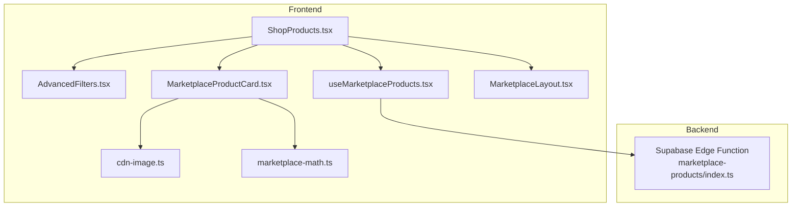
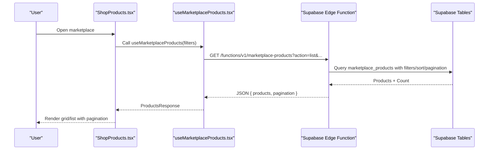
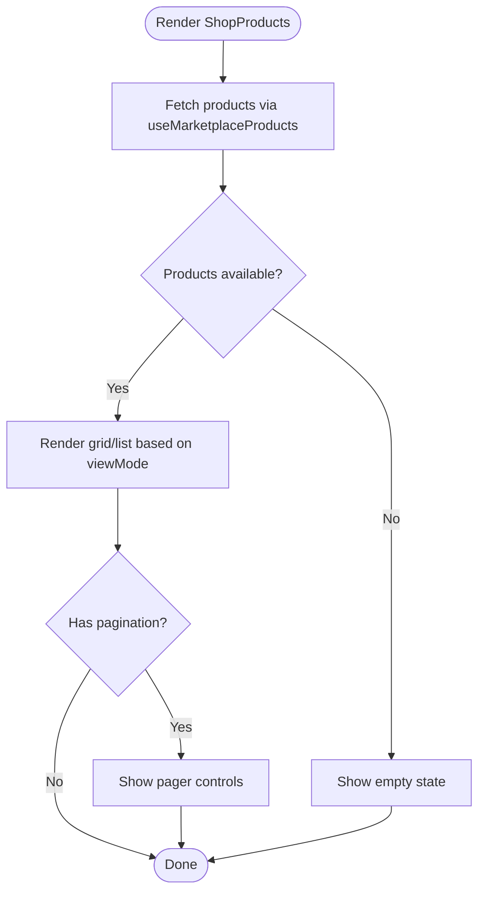
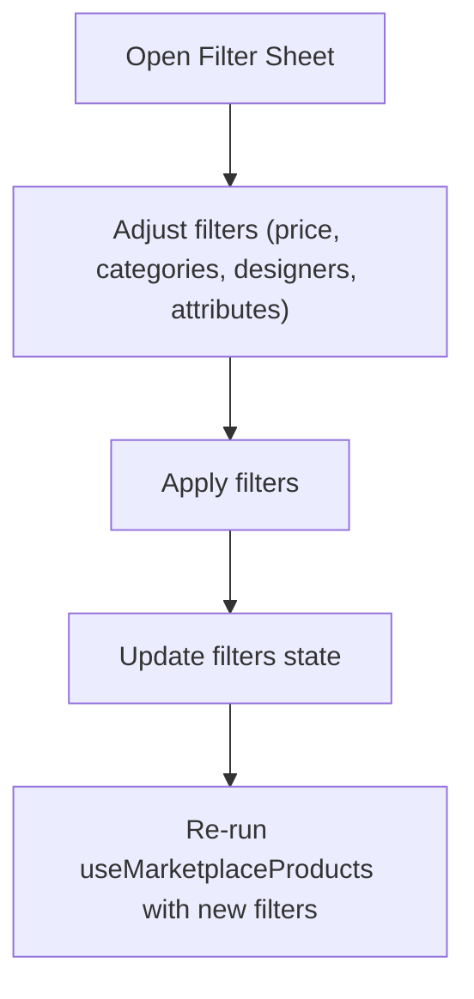
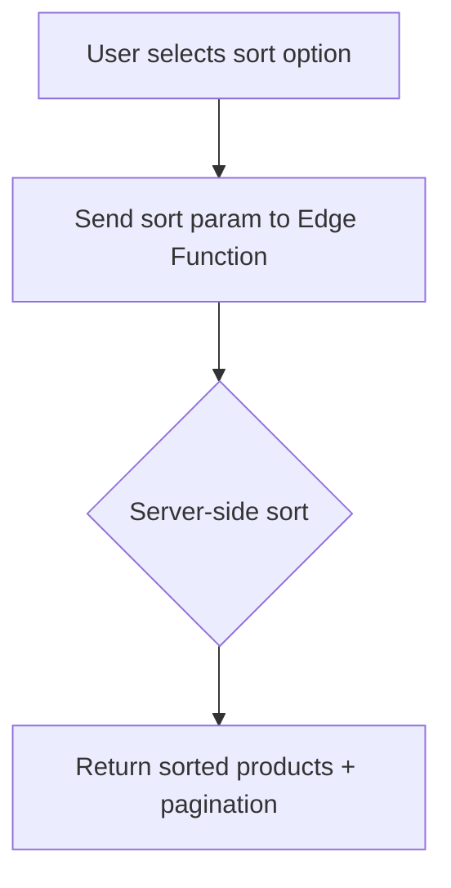
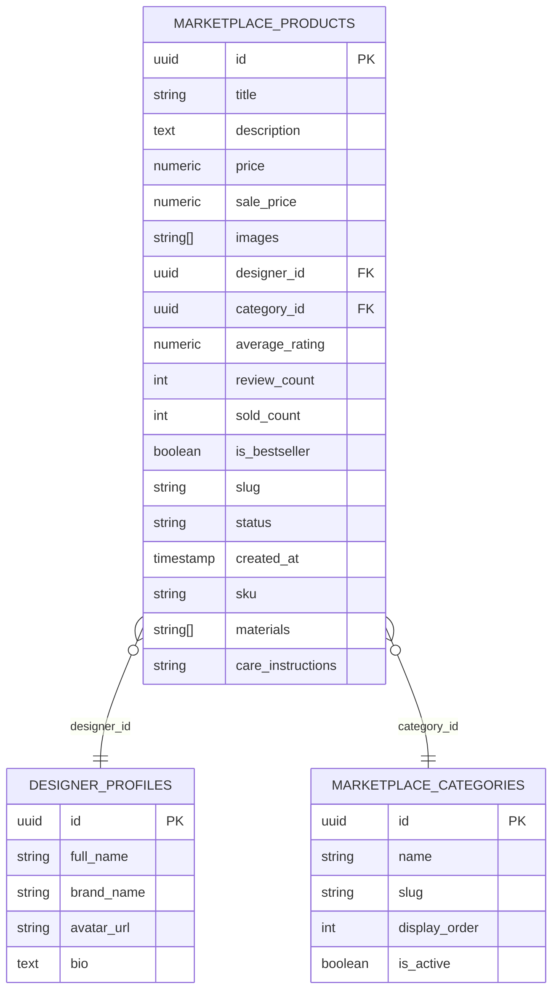
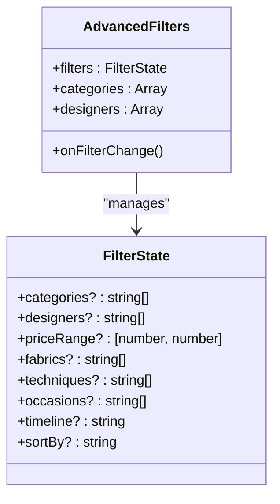
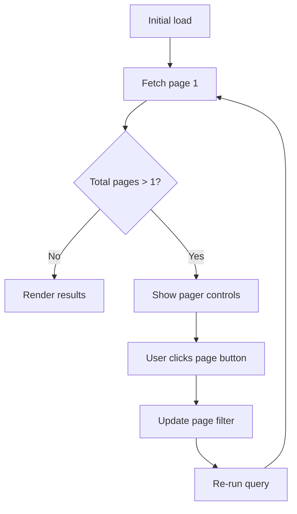
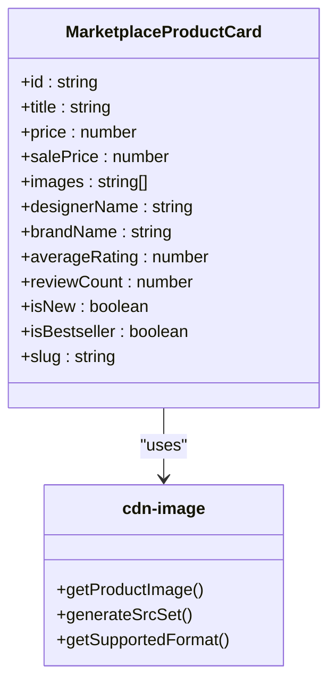
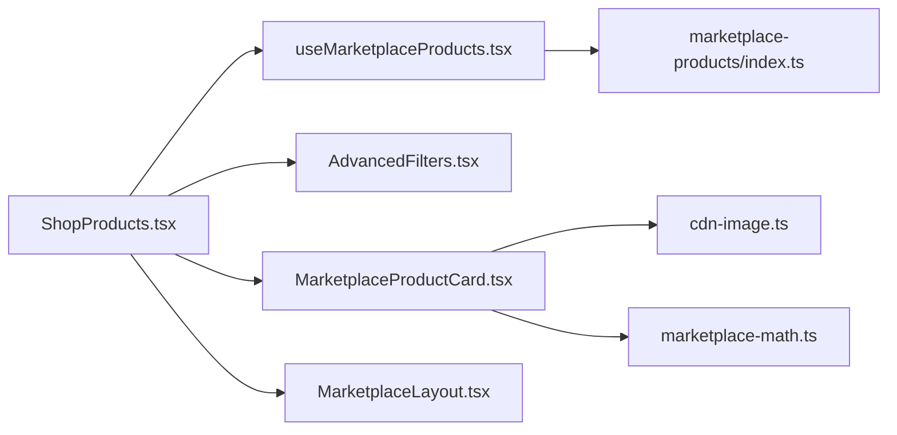

# Product Catalog Management

<cite>
**Referenced Files in This Document**
- [ShopProducts.tsx](file://src/pages/shop/ShopProducts.tsx)
- [useMarketplaceProducts.tsx](file://src/hooks/useMarketplaceProducts.tsx)
- [AdvancedFilters.tsx](file://src/components/marketplace/AdvancedFilters.tsx)
- [MarketplaceProductCard.tsx](file://src/components/marketplace/MarketplaceProductCard.tsx)
- [database.ts](file://src/types/database.ts)
- [index.ts](file://supabase/functions/marketplace-products/index.ts)
- [marketplace-math.ts](file://src/lib/marketplace-math.ts)
- [cdn-image.ts](file://src/lib/cdn-image.ts)
- [MarketplaceLayout.tsx](file://src/components/marketplace/MarketplaceLayout.tsx)
</cite>

## Table of Contents
1. [Introduction](#introduction)
2. [Project Structure](#project-structure)
3. [Core Components](#core-components)
4. [Architecture Overview](#architecture-overview)
5. [Detailed Component Analysis](#detailed-component-analysis)
6. [Dependency Analysis](#dependency-analysis)
7. [Performance Considerations](#performance-considerations)
8. [Troubleshooting Guide](#troubleshooting-guide)
9. [Conclusion](#conclusion)

## Introduction
This document describes the product catalog management system for the marketplace. It covers the product listing interface, filtering and sorting mechanisms, search functionality, and the underlying data model. It also documents advanced filtering capabilities (categories, designers, price ranges, and custom attributes), pagination, view modes (grid/list), responsive design patterns, product display components, image handling, performance optimizations, and discovery signals such as bestseller tracking.

## Project Structure
The product catalog is implemented across several layers:
- Page layer: renders the product listing and controls view mode and pagination
- Hook layer: encapsulates data fetching and caching via React Query
- UI components: filter sheet, product cards, and layout wrappers
- Backend: a Supabase Edge Function that queries and transforms product data
- Utilities: math helpers for currency and image optimization helpers for CDN images

**Diagram sources**
- [ShopProducts.tsx](file://src/pages/shop/ShopProducts.tsx#L27-L200)
- [AdvancedFilters.tsx](file://src/components/marketplace/AdvancedFilters.tsx#L77-L378)
- [MarketplaceProductCard.tsx](file://src/components/marketplace/MarketplaceProductCard.tsx#L27-L205)
- [useMarketplaceProducts.tsx](file://src/hooks/useMarketplaceProducts.tsx#L83-L208)
- [MarketplaceLayout.tsx](file://src/components/marketplace/MarketplaceLayout.tsx#L9-L17)
- [cdn-image.ts](file://src/lib/cdn-image.ts#L97-L120)
- [marketplace-math.ts](file://src/lib/marketplace-math.ts#L74-L79)
- [index.ts](file://supabase/functions/marketplace-products/index.ts#L13-L255)

**Section sources**
- [ShopProducts.tsx](file://src/pages/shop/ShopProducts.tsx#L1-L201)
- [useMarketplaceProducts.tsx](file://src/hooks/useMarketplaceProducts.tsx#L1-L209)
- [AdvancedFilters.tsx](file://src/components/marketplace/AdvancedFilters.tsx#L1-L379)
- [MarketplaceProductCard.tsx](file://src/components/marketplace/MarketplaceProductCard.tsx#L1-L206)
- [MarketplaceLayout.tsx](file://src/components/marketplace/MarketplaceLayout.tsx#L1-L18)
- [cdn-image.ts](file://src/lib/cdn-image.ts#L1-L195)
- [marketplace-math.ts](file://src/lib/marketplace-math.ts#L1-L94)
- [index.ts](file://supabase/functions/marketplace-products/index.ts#L1-L256)

## Core Components
- Product listing page orchestrates filters, view mode, pagination, and rendering of product cards.
- AdvancedFilters provides a multi-category filter sheet with price range, categories, designers, fabrics, techniques, occasions, and made-to-order timeline.
- useMarketplaceProducts abstracts product listing and detail retrieval via a Supabase Edge Function.
- MarketplaceProductCard renders product tiles with image navigation, badges, pricing, and quick actions.
- Utility libraries provide currency formatting and CDN image optimization.

**Section sources**
- [ShopProducts.tsx](file://src/pages/shop/ShopProducts.tsx#L27-L200)
- [AdvancedFilters.tsx](file://src/components/marketplace/AdvancedFilters.tsx#L77-L378)
- [useMarketplaceProducts.tsx](file://src/hooks/useMarketplaceProducts.tsx#L83-L208)
- [MarketplaceProductCard.tsx](file://src/components/marketplace/MarketplaceProductCard.tsx#L27-L205)
- [cdn-image.ts](file://src/lib/cdn-image.ts#L97-L120)
- [marketplace-math.ts](file://src/lib/marketplace-math.ts#L74-L79)

## Architecture Overview
The system follows a client-driven data fetching pattern:
- Frontend pages and components trigger React Query hooks.
- Hooks call a Supabase Edge Function with query parameters for filtering, sorting, and pagination.
- The function executes SQL queries against Supabase tables, applies joins, and returns structured data with pagination metadata.
- The frontend renders product cards and exposes view mode toggles and pagination controls.

**Diagram sources**
- [ShopProducts.tsx](file://src/pages/shop/ShopProducts.tsx#L49-L56)
- [useMarketplaceProducts.tsx](file://src/hooks/useMarketplaceProducts.tsx#L83-L126)
- [index.ts](file://supabase/functions/marketplace-products/index.ts#L28-L115)

## Detailed Component Analysis

### Product Listing Interface
- Displays a header with product count and sorting controls.
- Provides a filter sheet and view mode toggle (grid/list).
- Renders product cards and pagination controls.
- Uses a marketplace layout wrapper for consistent header/footer.

**Diagram sources**
- [ShopProducts.tsx](file://src/pages/shop/ShopProducts.tsx#L62-L198)
- [MarketplaceLayout.tsx](file://src/components/marketplace/MarketplaceLayout.tsx#L9-L17)

**Section sources**
- [ShopProducts.tsx](file://src/pages/shop/ShopProducts.tsx#L27-L200)
- [MarketplaceLayout.tsx](file://src/components/marketplace/MarketplaceLayout.tsx#L9-L17)

### Filtering Mechanisms
- AdvancedFilters supports:
  - Categories (multi-select)
  - Designers (multi-select)
  - Price range (slider)
  - Custom attributes: fabrics, techniques, occasions (multi-select)
  - Made-to-order timeline (single-select)
  - Sorting: newest, popular, price_asc, price_desc
- Filters are applied locally in the sheet and propagated to the parent page via callbacks.
- The page passes filters to the hook, which forwards them to the Edge Function.

**Diagram sources**
- [AdvancedFilters.tsx](file://src/components/marketplace/AdvancedFilters.tsx#L77-L378)
- [ShopProducts.tsx](file://src/pages/shop/ShopProducts.tsx#L58-L60)

**Section sources**
- [AdvancedFilters.tsx](file://src/components/marketplace/AdvancedFilters.tsx#L37-L46)
- [AdvancedFilters.tsx](file://src/components/marketplace/AdvancedFilters.tsx#L117-L130)
- [AdvancedFilters.tsx](file://src/components/marketplace/AdvancedFilters.tsx#L154-L355)
- [ShopProducts.tsx](file://src/pages/shop/ShopProducts.tsx#L58-L60)

### Sorting Algorithms
- Supported sorts: newest, price_asc, price_desc, rating, bestselling.
- Sorting is handled server-side by the Edge Function, ensuring consistent ordering across pages.

**Diagram sources**
- [ShopProducts.tsx](file://src/pages/shop/ShopProducts.tsx#L19-L25)
- [index.ts](file://supabase/functions/marketplace-products/index.ts#L72-L89)

**Section sources**
- [ShopProducts.tsx](file://src/pages/shop/ShopProducts.tsx#L19-L25)
- [index.ts](file://supabase/functions/marketplace-products/index.ts#L72-L89)

### Search Functionality
- Search term is passed to the Edge Function and used to match product titles and descriptions.
- Search is combined with other filters and pagination.

**Section sources**
- [useMarketplaceProducts.tsx](file://src/hooks/useMarketplaceProducts.tsx#L96-L96)
- [index.ts](file://supabase/functions/marketplace-products/index.ts#L62-L64)

### Product Data Model
- Product fields include identifiers, pricing, inventory-related fields, ratings, metadata, and relations.
- The type definition augments product rows with nested designer and category information.

**Diagram sources**
- [database.ts](file://src/types/database.ts#L3-L16)
- [index.ts](file://supabase/functions/marketplace-products/index.ts#L42-L47)
- [index.ts](file://supabase/functions/marketplace-products/index.ts#L128-L135)

**Section sources**
- [database.ts](file://src/types/database.ts#L3-L16)
- [index.ts](file://supabase/functions/marketplace-products/index.ts#L42-L47)

### Advanced Filtering System
- Categories and designers are populated from separate endpoints and passed into the filter sheet.
- Custom attributes include fabrics, techniques, and occasions with predefined lists.
- Price range slider updates min/max bounds and triggers re-query.
- Timeline filter allows selection of made-to-order windows.

**Diagram sources**
- [AdvancedFilters.tsx](file://src/components/marketplace/AdvancedFilters.tsx#L37-L46)
- [AdvancedFilters.tsx](file://src/components/marketplace/AdvancedFilters.tsx#L77-L378)

**Section sources**
- [AdvancedFilters.tsx](file://src/components/marketplace/AdvancedFilters.tsx#L55-L75)
- [AdvancedFilters.tsx](file://src/components/marketplace/AdvancedFilters.tsx#L154-L355)

### Pagination Implementation
- Pagination is computed server-side with limit and offset.
- The page displays a compact pager with previous/next buttons and page indicators when total pages exceed one.
- Current page is controlled locally; clicking pager buttons updates the filter state.

**Diagram sources**
- [useMarketplaceProducts.tsx](file://src/hooks/useMarketplaceProducts.tsx#L92-L93)
- [index.ts](file://supabase/functions/marketplace-products/index.ts#L91-L93)
- [ShopProducts.tsx](file://src/pages/shop/ShopProducts.tsx#L160-L192)

**Section sources**
- [useMarketplaceProducts.tsx](file://src/hooks/useMarketplaceProducts.tsx#L92-L93)
- [index.ts](file://supabase/functions/marketplace-products/index.ts#L91-L93)
- [ShopProducts.tsx](file://src/pages/shop/ShopProducts.tsx#L160-L192)

### View Modes (Grid/List)
- Toggle between grid and list layouts using two buttons.
- Grid uses a responsive CSS grid; list uses a single column.
- View mode does not change filters but affects rendering.

**Section sources**
- [ShopProducts.tsx](file://src/pages/shop/ShopProducts.tsx#L85-L104)
- [ShopProducts.tsx](file://src/pages/shop/ShopProducts.tsx#L134-L138)

### Responsive Design Patterns
- Grid columns adapt based on viewport (2–3 columns on medium screens).
- Images use responsive srcset and modern formats (WebP/AVIF) with lazy loading.
- Cards scale appropriately across devices.

**Section sources**
- [ShopProducts.tsx](file://src/pages/shop/ShopProducts.tsx#L111-L115)
- [MarketplaceProductCard.tsx](file://src/components/marketplace/MarketplaceProductCard.tsx#L76-L82)
- [cdn-image.ts](file://src/lib/cdn-image.ts#L59-L70)

### Product Display Components and Image Handling
- Product cards show:
  - Main image with optional hover navigation dots
  - Badges for new, bestseller, and discount percentage
  - Designer branding and product title
  - Formatted pricing with sale handling
- Image optimization:
  - Preset-based transformations for consistent sizing
  - srcset generation for responsive delivery
  - Modern format detection and fallbacks
  - Lazy loading and optional preloading

**Diagram sources**
- [MarketplaceProductCard.tsx](file://src/components/marketplace/MarketplaceProductCard.tsx#L27-L41)
- [cdn-image.ts](file://src/lib/cdn-image.ts#L97-L120)

**Section sources**
- [MarketplaceProductCard.tsx](file://src/components/marketplace/MarketplaceProductCard.tsx#L27-L205)
- [cdn-image.ts](file://src/lib/cdn-image.ts#L97-L120)
- [cdn-image.ts](file://src/lib/cdn-image.ts#L171-L185)

### Performance Optimization Techniques
- Server-side pagination and sorting reduce payload sizes.
- CDN image optimization with WebP/AVIF and responsive srcset improves LCP and bandwidth.
- Lazy loading and format detection minimize render-blocking resources.
- Currency formatting uses locale-aware number formatting.

**Section sources**
- [index.ts](file://supabase/functions/marketplace-products/index.ts#L91-L93)
- [cdn-image.ts](file://src/lib/cdn-image.ts#L59-L70)
- [cdn-image.ts](file://src/lib/cdn-image.ts#L126-L152)
- [marketplace-math.ts](file://src/lib/marketplace-math.ts#L74-L79)

### Product Discovery and Bestseller Tracking
- Bestseller flag is part of the product model and surfaced as a badge.
- Sorting by bestselling leverages the sold_count field.
- Related products are suggested by the Edge Function using designer affinity and category fallback.

**Section sources**
- [database.ts](file://src/types/database.ts#L29-L30)
- [index.ts](file://supabase/functions/marketplace-products/index.ts#L83-L84)
- [index.ts](file://supabase/functions/marketplace-products/index.ts#L159-L181)

## Dependency Analysis
- ShopProducts depends on:
  - useMarketplaceProducts for data
  - AdvancedFilters for filters
  - MarketplaceProductCard for rendering
  - MarketplaceLayout for shell
- useMarketplaceProducts depends on:
  - Supabase Edge Function for data
- MarketplaceProductCard depends on:
  - cdn-image for image URLs
  - marketplace-math for currency formatting

**Diagram sources**
- [ShopProducts.tsx](file://src/pages/shop/ShopProducts.tsx#L14-L15)
- [useMarketplaceProducts.tsx](file://src/hooks/useMarketplaceProducts.tsx#L102-L124)
- [MarketplaceProductCard.tsx](file://src/components/marketplace/MarketplaceProductCard.tsx#L9-L7)
- [cdn-image.ts](file://src/lib/cdn-image.ts#L97-L106)
- [marketplace-math.ts](file://src/lib/marketplace-math.ts#L74-L79)
- [index.ts](file://supabase/functions/marketplace-products/index.ts#L102-L124)

**Section sources**
- [ShopProducts.tsx](file://src/pages/shop/ShopProducts.tsx#L14-L15)
- [useMarketplaceProducts.tsx](file://src/hooks/useMarketplaceProducts.tsx#L102-L124)
- [MarketplaceProductCard.tsx](file://src/components/marketplace/MarketplaceProductCard.tsx#L9-L7)
- [cdn-image.ts](file://src/lib/cdn-image.ts#L97-L106)
- [marketplace-math.ts](file://src/lib/marketplace-math.ts#L74-L79)
- [index.ts](file://supabase/functions/marketplace-products/index.ts#L102-L124)

## Performance Considerations
- Prefer server-side pagination and sorting to avoid large payloads.
- Use responsive images and modern formats to optimize bandwidth and rendering.
- Implement lazy loading for offscreen images.
- Cache frequently accessed data using React Query’s built-in caching.
- Keep filter selections minimal to reduce query complexity.

## Troubleshooting Guide
- If products do not update after applying filters, verify that the filter callback updates the state and that the hook re-runs with new parameters.
- If images fail to load, confirm the storage URLs and that the CDN helper is invoked with the correct preset.
- If sorting appears inconsistent, ensure the sort parameter is correctly passed to the Edge Function and that the backend applies the intended order.

**Section sources**
- [AdvancedFilters.tsx](file://src/components/marketplace/AdvancedFilters.tsx#L94-L97)
- [useMarketplaceProducts.tsx](file://src/hooks/useMarketplaceProducts.tsx#L83-L126)
- [cdn-image.ts](file://src/lib/cdn-image.ts#L97-L106)
- [index.ts](file://supabase/functions/marketplace-products/index.ts#L72-L89)

## Conclusion
The product catalog system combines a flexible client-side UI with robust server-side filtering, sorting, and pagination. Advanced filters, responsive images, and performance utilities deliver a scalable and user-friendly shopping experience. The modular design enables easy extension of filters, discovery signals, and rendering options.