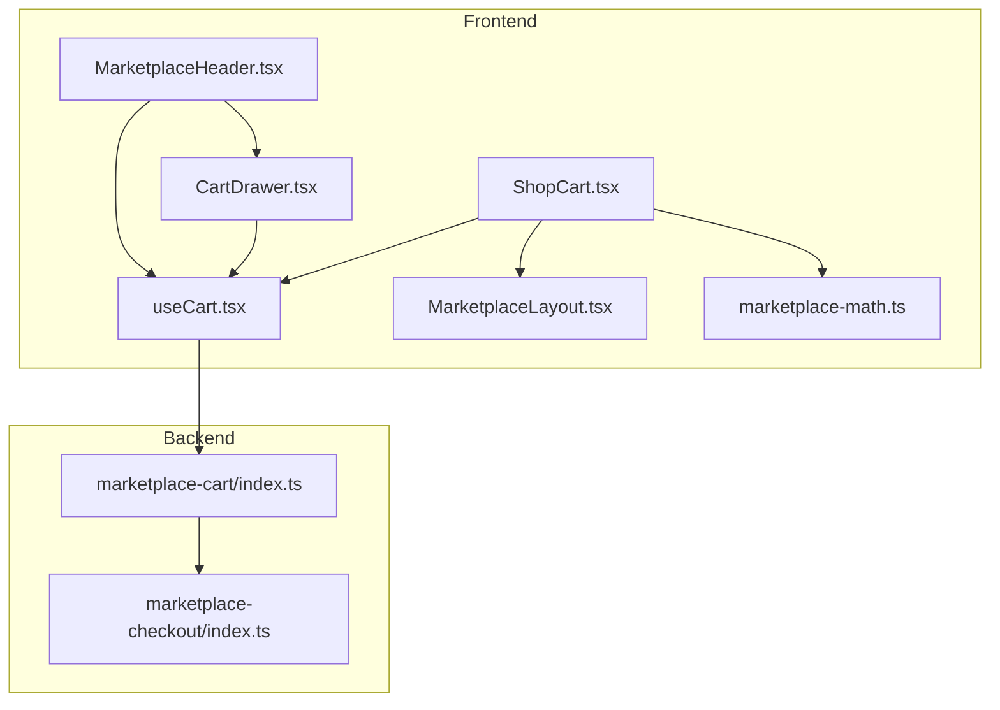
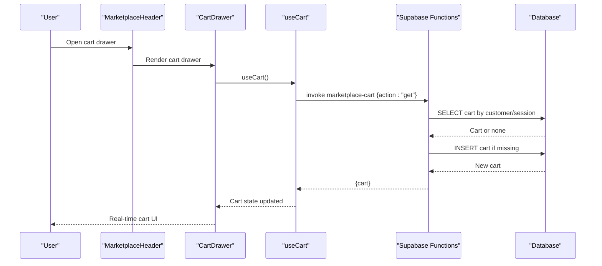
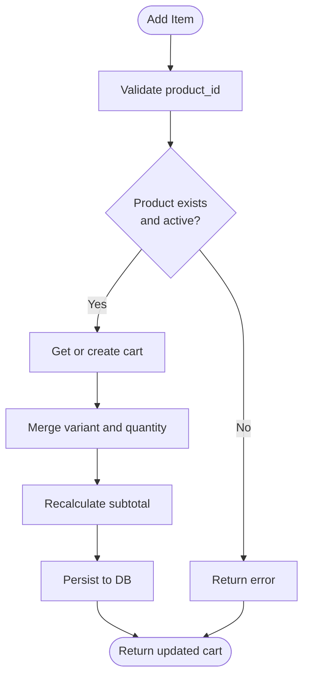
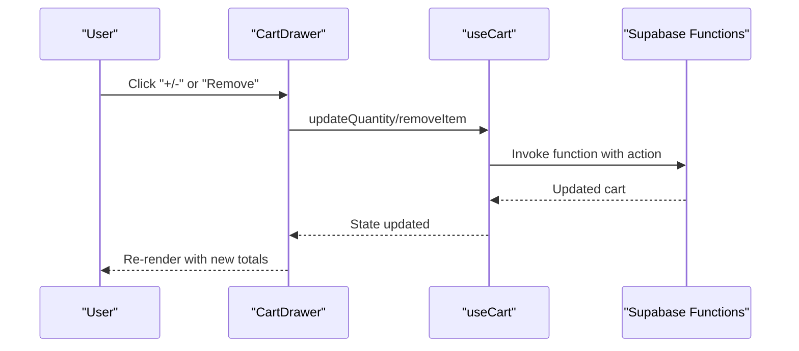
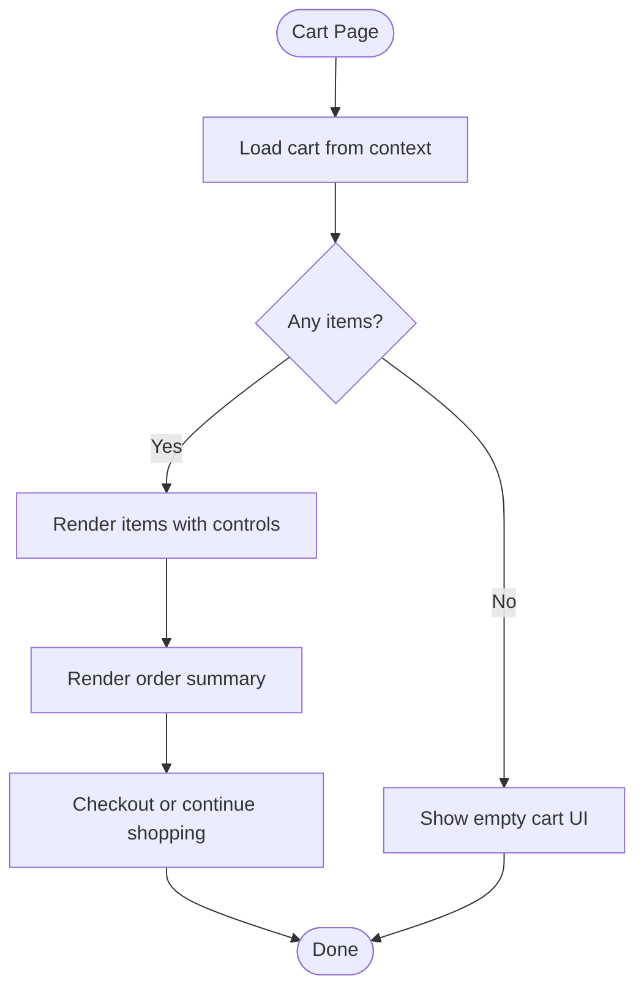
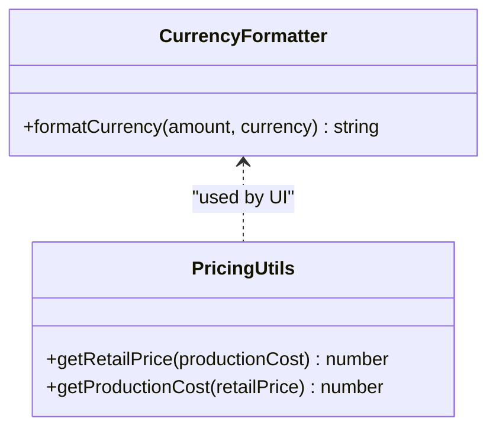
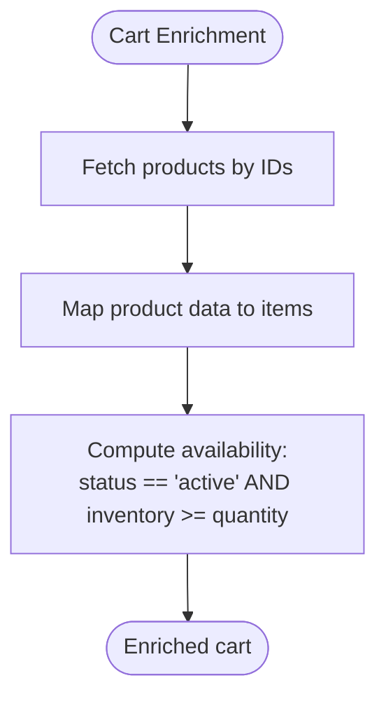
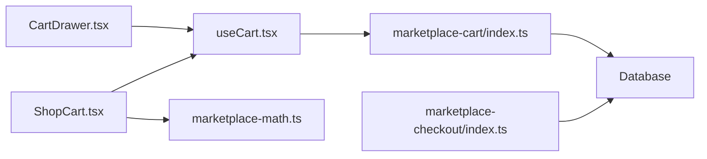

# Shopping Cart System

<cite>
**Referenced Files in This Document**
- [useCart.tsx](file://src/hooks/useCart.tsx)
- [CartDrawer.tsx](file://src/components/marketplace/CartDrawer.tsx)
- [ShopCart.tsx](file://src/pages/shop/ShopCart.tsx)
- [marketplace-cart/index.ts](file://supabase/functions/marketplace-cart/index.ts)
- [marketplace-checkout/index.ts](file://supabase/functions/marketplace-checkout/index.ts)
- [MarketplaceHeader.tsx](file://src/components/marketplace/MarketplaceHeader.tsx)
- [MarketplaceLayout.tsx](file://src/components/marketplace/MarketplaceLayout.tsx)
- [marketplace-math.ts](file://src/lib/marketplace-math.ts)
</cite>

## Table of Contents
1. [Introduction](#introduction)
2. [Project Structure](#project-structure)
3. [Core Components](#core-components)
4. [Architecture Overview](#architecture-overview)
5. [Detailed Component Analysis](#detailed-component-analysis)
6. [Dependency Analysis](#dependency-analysis)
7. [Performance Considerations](#performance-considerations)
8. [Troubleshooting Guide](#troubleshooting-guide)
9. [Conclusion](#conclusion)
10. [Appendices](#appendices)

## Introduction
This document provides comprehensive documentation for the shopping cart system. It covers cart persistence, item management, quantity adjustments, and removal operations. It also documents the cart drawer component, real-time updates, and user experience patterns. The cart state management, local storage integration, and session synchronization across browser tabs are explained. Validation, stock checking, pricing calculations, and discount application are included. Abandonment prevention, guest checkout options, and cart sharing functionality are addressed. Finally, cart analytics, conversion tracking, and revenue optimization features are documented.

## Project Structure
The cart system spans frontend React components and backend Supabase Edge Functions. The frontend provides a cart provider, a cart drawer UI, and a dedicated cart page. The backend manages cart persistence, enrichment, validation, and checkout integration.

**Diagram sources**
- [MarketplaceHeader.tsx](file://src/components/marketplace/MarketplaceHeader.tsx#L19-L147)
- [CartDrawer.tsx](file://src/components/marketplace/CartDrawer.tsx#L13-L168)
- [ShopCart.tsx](file://src/pages/shop/ShopCart.tsx#L9-L220)
- [useCart.tsx](file://src/hooks/useCart.tsx#L57-L204)
- [MarketplaceLayout.tsx](file://src/components/marketplace/MarketplaceLayout.tsx#L9-L16)
- [marketplace-cart/index.ts](file://supabase/functions/marketplace-cart/index.ts#L13-L321)
- [marketplace-checkout/index.ts](file://supabase/functions/marketplace-checkout/index.ts#L38-L74)
- [marketplace-math.ts](file://src/lib/marketplace-math.ts#L74-L86)

**Section sources**
- [useCart.tsx](file://src/hooks/useCart.tsx#L57-L204)
- [CartDrawer.tsx](file://src/components/marketplace/CartDrawer.tsx#L13-L168)
- [ShopCart.tsx](file://src/pages/shop/ShopCart.tsx#L9-L220)
- [marketplace-cart/index.ts](file://supabase/functions/marketplace-cart/index.ts#L13-L321)
- [MarketplaceHeader.tsx](file://src/components/marketplace/MarketplaceHeader.tsx#L19-L147)
- [MarketplaceLayout.tsx](file://src/components/marketplace/MarketplaceLayout.tsx#L9-L16)
- [marketplace-math.ts](file://src/lib/marketplace-math.ts#L74-L86)

## Core Components
- Cart Provider and Context: Centralizes cart state, exposes CRUD operations, and handles session identification via local storage.
- Cart Drawer: Real-time cart preview with item quantity controls, removal, and quick checkout.
- Cart Page: Full cart view with order summary, shipping estimation, and clear cart functionality.
- Backend Cart Function: Manages cart retrieval, creation, addition, update, removal, and clearing with product enrichment and availability checks.
- Checkout Integration: Validates cart items and prepares Stripe checkout sessions.

**Section sources**
- [useCart.tsx](file://src/hooks/useCart.tsx#L57-L204)
- [CartDrawer.tsx](file://src/components/marketplace/CartDrawer.tsx#L13-L168)
- [ShopCart.tsx](file://src/pages/shop/ShopCart.tsx#L9-L220)
- [marketplace-cart/index.ts](file://supabase/functions/marketplace-cart/index.ts#L67-L306)
- [marketplace-checkout/index.ts](file://supabase/functions/marketplace-checkout/index.ts#L38-L74)

## Architecture Overview
The cart system follows a client-server pattern:
- Frontend React components use a cart context to invoke Supabase Edge Functions.
- The cart function retrieves or creates a cart scoped by either authenticated customer or guest session ID.
- Cart items are enriched with product and designer metadata and validated against inventory and status.
- The checkout function validates the cart and prepares a payment session.

**Diagram sources**
- [MarketplaceHeader.tsx](file://src/components/marketplace/MarketplaceHeader.tsx#L130-L147)
- [CartDrawer.tsx](file://src/components/marketplace/CartDrawer.tsx#L13-L168)
- [useCart.tsx](file://src/hooks/useCart.tsx#L87-L97)
- [marketplace-cart/index.ts](file://supabase/functions/marketplace-cart/index.ts#L67-L135)

## Detailed Component Analysis

### Cart State Management and Persistence
- Session and Authentication Scoping:
  - Guest carts are identified by a session ID stored in local storage.
  - Authenticated carts are associated with a customer record derived from the Supabase session.
- Cart Retrieval and Creation:
  - On mount, the provider invokes the cart function with action "get".
  - If no cart exists for the current scope, a new cart is created with empty items and zero subtotal.
- Item Operations:
  - Add: Validates product existence and status, enriches item metadata, merges variants, recalculates subtotal, and persists.
  - Update: Adjusts quantity or removes items when quantity reaches zero.
  - Remove: Filters out the specified item variant combination.
  - Clear: Empties items and resets discount fields.

**Diagram sources**
- [useCart.tsx](file://src/hooks/useCart.tsx#L99-L123)
- [marketplace-cart/index.ts](file://supabase/functions/marketplace-cart/index.ts#L137-L206)

**Section sources**
- [useCart.tsx](file://src/hooks/useCart.tsx#L47-L55)
- [useCart.tsx](file://src/hooks/useCart.tsx#L67-L85)
- [useCart.tsx](file://src/hooks/useCart.tsx#L87-L97)
- [useCart.tsx](file://src/hooks/useCart.tsx#L99-L183)
- [marketplace-cart/index.ts](file://supabase/functions/marketplace-cart/index.ts#L67-L95)
- [marketplace-cart/index.ts](file://supabase/functions/marketplace-cart/index.ts#L137-L206)
- [marketplace-cart/index.ts](file://supabase/functions/marketplace-cart/index.ts#L208-L252)
- [marketplace-cart/index.ts](file://supabase/functions/marketplace-cart/index.ts#L254-L283)
- [marketplace-cart/index.ts](file://supabase/functions/marketplace-cart/index.ts#L285-L306)

### Cart Drawer Component and Real-Time Updates
- Real-Time Rendering:
  - The drawer displays item count badge and renders items with variant details.
  - Quantity controls trigger updateQuantity, and remove buttons trigger removeItem.
- UX Patterns:
  - Free shipping progress bar encourages incremental purchases.
  - Quick actions to view bag or proceed to checkout.
- Local Storage Session ID:
  - Ensures consistent cart identity across browser tabs and sessions.

**Diagram sources**
- [CartDrawer.tsx](file://src/components/marketplace/CartDrawer.tsx#L106-L136)
- [useCart.tsx](file://src/hooks/useCart.tsx#L125-L169)
- [marketplace-cart/index.ts](file://supabase/functions/marketplace-cart/index.ts#L208-L283)

**Section sources**
- [CartDrawer.tsx](file://src/components/marketplace/CartDrawer.tsx#L13-L168)
- [MarketplaceHeader.tsx](file://src/components/marketplace/MarketplaceHeader.tsx#L129-L147)
- [useCart.tsx](file://src/hooks/useCart.tsx#L47-L55)

### Cart Page and Order Summary
- Full Cart Experience:
  - Displays items with links to product pages, variant details, and quantity controls.
  - Provides clear cart and checkout actions.
- Order Summary:
  - Shows subtotal, shipping estimation, and estimated total.
  - Highlights free shipping threshold progress.

**Diagram sources**
- [ShopCart.tsx](file://src/pages/shop/ShopCart.tsx#L9-L220)

**Section sources**
- [ShopCart.tsx](file://src/pages/shop/ShopCart.tsx#L9-L220)

### Pricing Calculations and Currency Formatting
- Currency Formatting:
  - Utility function formats amounts for display consistently.
- Pricing Utilities:
  - Helpers support retail price calculation from production cost and vice versa.

**Diagram sources**
- [marketplace-math.ts](file://src/lib/marketplace-math.ts#L74-L93)

**Section sources**
- [marketplace-math.ts](file://src/lib/marketplace-math.ts#L74-L93)
- [CartDrawer.tsx](file://src/components/marketplace/CartDrawer.tsx#L7-L7)
- [ShopCart.tsx](file://src/pages/shop/ShopCart.tsx#L7-L7)

### Stock Checking and Availability
- Product Enrichment:
  - Cart retrieval enriches items with product metadata and computes availability based on status and inventory.
- Validation:
  - Add operation verifies product existence and active status.
  - Checkout process validates product availability and completeness.

**Diagram sources**
- [marketplace-cart/index.ts](file://supabase/functions/marketplace-cart/index.ts#L108-L130)
- [marketplace-cart/index.ts](file://supabase/functions/marketplace-cart/index.ts#L137-L163)
- [marketplace-checkout/index.ts](file://supabase/functions/marketplace-checkout/index.ts#L62-L74)

**Section sources**
- [marketplace-cart/index.ts](file://supabase/functions/marketplace-cart/index.ts#L108-L130)
- [marketplace-cart/index.ts](file://supabase/functions/marketplace-cart/index.ts#L137-L163)
- [marketplace-checkout/index.ts](file://supabase/functions/marketplace-checkout/index.ts#L62-L74)

### Discount Application
- Current Implementation:
  - Cart records include discount fields; clear action resets discount-related fields.
- Future Enhancements:
  - Apply discount logic and validation should be integrated into add/update operations and persisted accordingly.

**Section sources**
- [marketplace-cart/index.ts](file://supabase/functions/marketplace-cart/index.ts#L285-L306)

### Cart Abandonment Prevention and Guest Checkout
- Abandonment Prevention:
  - Persistent guest session ID ensures continuity across tabs and sessions.
  - Free shipping progress incentivizes completing the purchase.
- Guest Checkout:
  - Cart operations work without authentication; checkout requires a valid cart and product availability.

**Section sources**
- [useCart.tsx](file://src/hooks/useCart.tsx#L47-L55)
- [CartDrawer.tsx](file://src/components/marketplace/CartDrawer.tsx#L55-L68)
- [marketplace-cart/index.ts](file://supabase/functions/marketplace-cart/index.ts#L137-L163)

### Cart Sharing Functionality
- Current Scope:
  - Carts are scoped to either a customer or a guest session ID.
- Sharing Considerations:
  - To enable sharing, introduce a shared cart identifier and ACLs to allow cross-session access while maintaining privacy and ownership semantics.

[No sources needed since this section provides conceptual guidance]

### Cart Analytics, Conversion Tracking, and Revenue Optimization
- Analytics Data:
  - Analytics hooks and pages demonstrate revenue and top product tracking, which can be extended to cart-level metrics.
- Conversion Tracking:
  - Integrate event logging for add-to-cart, remove-from-cart, and checkout initiation to measure funnel performance.
- Revenue Optimization:
  - Use pricing utilities and free shipping thresholds to guide promotions and upsell strategies.

**Section sources**
- [marketplace-math.ts](file://src/lib/marketplace-math.ts#L74-L93)

## Dependency Analysis
The cart system exhibits clear separation of concerns:
- Frontend depends on Supabase client for function invocation and local storage for guest session scoping.
- Backend cart function depends on Supabase client for database operations and product enrichment.
- Checkout function depends on cart data and product validation.

**Diagram sources**
- [useCart.tsx](file://src/hooks/useCart.tsx#L67-L85)
- [marketplace-cart/index.ts](file://supabase/functions/marketplace-cart/index.ts#L13-L321)
- [CartDrawer.tsx](file://src/components/marketplace/CartDrawer.tsx#L13-L168)
- [ShopCart.tsx](file://src/pages/shop/ShopCart.tsx#L9-L220)
- [marketplace-math.ts](file://src/lib/marketplace-math.ts#L74-L93)
- [marketplace-checkout/index.ts](file://supabase/functions/marketplace-checkout/index.ts#L38-L74)

**Section sources**
- [useCart.tsx](file://src/hooks/useCart.tsx#L67-L85)
- [marketplace-cart/index.ts](file://supabase/functions/marketplace-cart/index.ts#L13-L321)
- [marketplace-checkout/index.ts](file://supabase/functions/marketplace-checkout/index.ts#L38-L74)

## Performance Considerations
- Minimize Network Calls:
  - Batch UI updates after cart mutations to reduce re-renders.
- Efficient Product Fetching:
  - Use single query to fetch product details for all cart items.
- Local Storage Access:
  - Session ID retrieval is O(1); ensure minimal writes to avoid blocking UI.
- Currency Formatting:
  - Cache formatted strings per transaction to avoid repeated formatting overhead.

[No sources needed since this section provides general guidance]

## Troubleshooting Guide
- Common Issues:
  - Cart not loading: Verify Supabase session and function invocation headers.
  - Item not added: Confirm product exists, is active, and has sufficient inventory.
  - Quantity update fails: Ensure item exists in cart and quantity is valid.
  - Remove item fails: Validate product ID and variant match.
  - Clear cart fails: Confirm cart exists for the current scope.
- Error Handling:
  - Frontend shows user-friendly toasts for failures.
  - Backend logs steps and returns structured errors.

**Section sources**
- [useCart.tsx](file://src/hooks/useCart.tsx#L104-L122)
- [useCart.tsx](file://src/hooks/useCart.tsx#L130-L144)
- [useCart.tsx](file://src/hooks/useCart.tsx#L151-L168)
- [useCart.tsx](file://src/hooks/useCart.tsx#L172-L182)
- [marketplace-cart/index.ts](file://supabase/functions/marketplace-cart/index.ts#L140-L145)
- [marketplace-cart/index.ts](file://supabase/functions/marketplace-cart/index.ts#L213-L217)
- [marketplace-cart/index.ts](file://supabase/functions/marketplace-cart/index.ts#L258-L263)
- [marketplace-cart/index.ts](file://supabase/functions/marketplace-cart/index.ts#L287-L292)

## Conclusion
The shopping cart system integrates a robust frontend context with a Supabase-backed cart function to provide seamless item management, real-time updates, and reliable persistence. Guest and authenticated users benefit from consistent cart experiences, while product enrichment and validation ensure accuracy. The system is ready for enhancements such as discount application, cart sharing, and advanced analytics and conversion tracking.

## Appendices

### API Definitions
- Cart Function Endpoints:
  - GET: Retrieve cart by customer or session.
  - ADD: Add item with variant and quantity.
  - UPDATE: Change item quantity or remove item.
  - REMOVE: Remove item variant.
  - CLEAR: Empty cart and reset discount fields.

**Section sources**
- [marketplace-cart/index.ts](file://supabase/functions/marketplace-cart/index.ts#L101-L135)
- [marketplace-cart/index.ts](file://supabase/functions/marketplace-cart/index.ts#L137-L206)
- [marketplace-cart/index.ts](file://supabase/functions/marketplace-cart/index.ts#L208-L252)
- [marketplace-cart/index.ts](file://supabase/functions/marketplace-cart/index.ts#L254-L283)
- [marketplace-cart/index.ts](file://supabase/functions/marketplace-cart/index.ts#L285-L306)