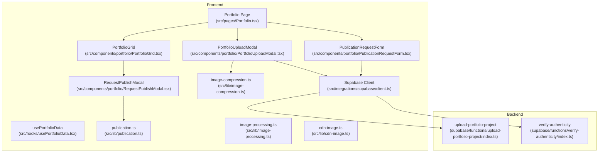
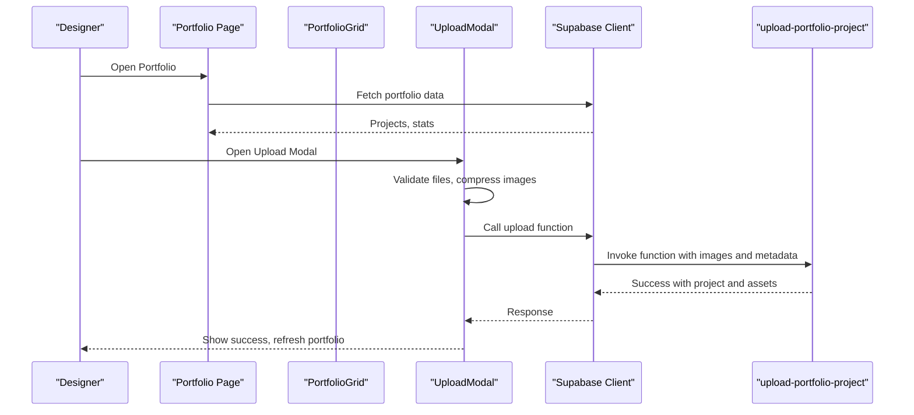
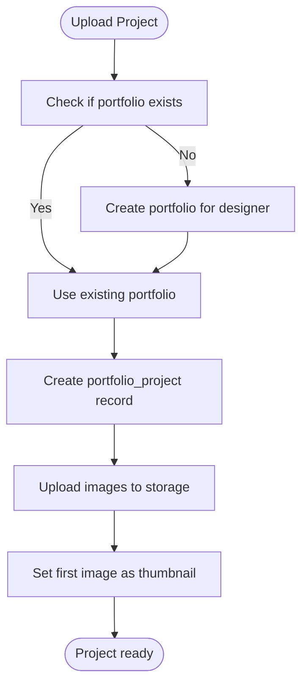
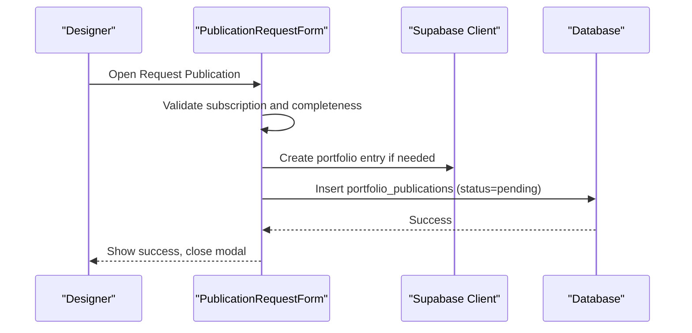
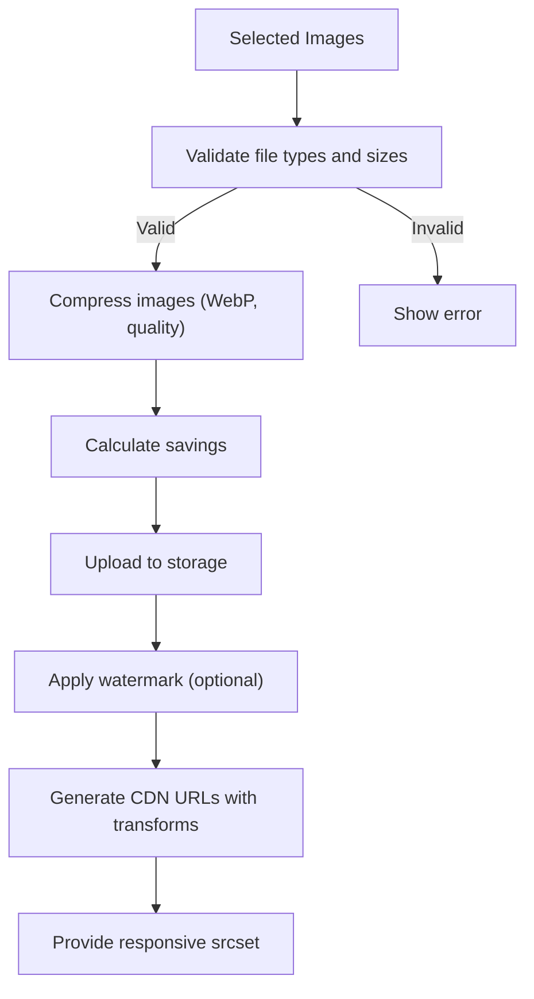
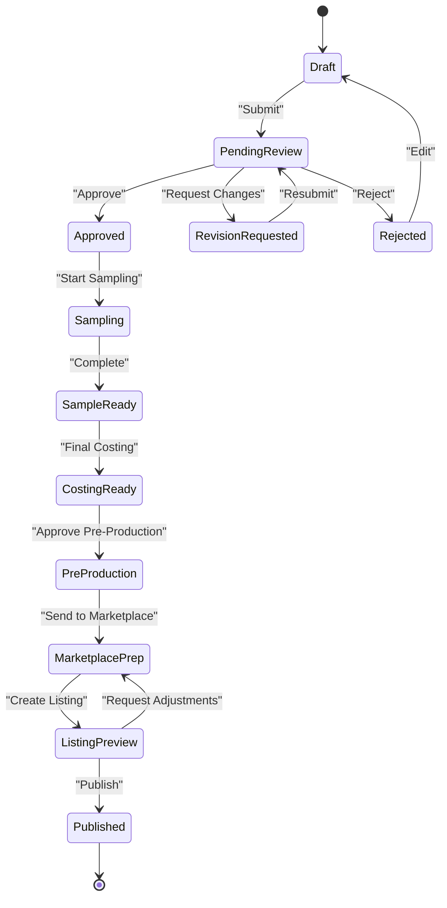
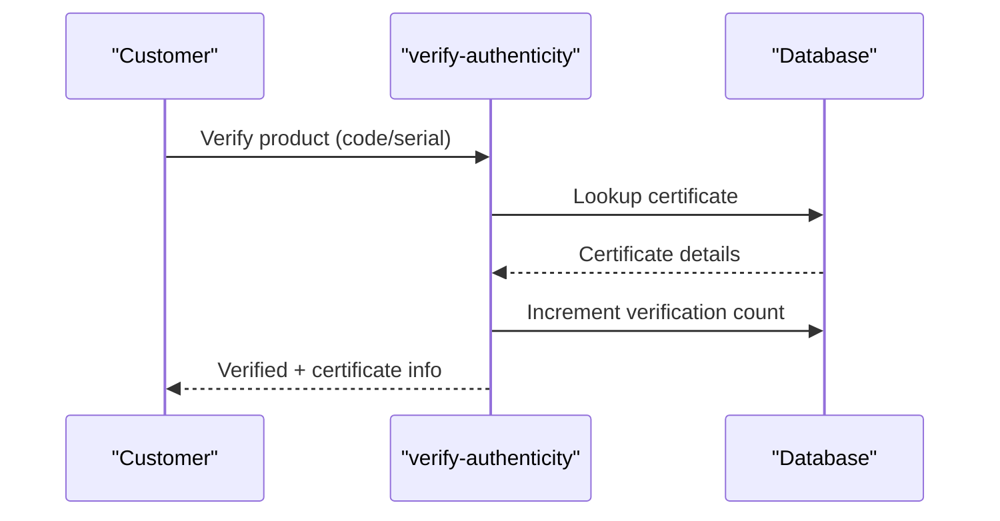
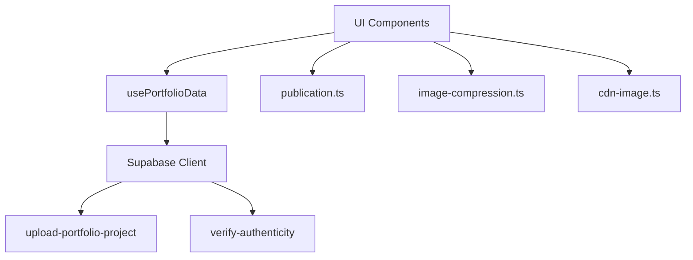

# Portfolio Management System

<cite>
**Referenced Files in This Document**
- [src/pages/Portfolio.tsx](file://src/pages/Portfolio.tsx)
- [src/components/portfolio/PortfolioGrid.tsx](file://src/components/portfolio/PortfolioGrid.tsx)
- [src/components/portfolio/PortfolioUploadModal.tsx](file://src/components/portfolio/PortfolioUploadModal.tsx)
- [src/components/portfolio/PublicationRequestForm.tsx](file://src/components/portfolio/PublicationRequestForm.tsx)
- [src/components/portfolio/RequestPublishModal.tsx](file://src/components/portfolio/RequestPublishModal.tsx)
- [src/hooks/usePortfolioData.tsx](file://src/hooks/usePortfolioData.tsx)
- [src/lib/publication.ts](file://src/lib/publication.ts)
- [src/lib/image-compression.ts](file://src/lib/image-compression.ts)
- [src/lib/image-processing.ts](file://src/lib/image-processing.ts)
- [src/lib/cdn-image.ts](file://src/lib/cdn-image.ts)
- [src/integrations/supabase/client.ts](file://src/integrations/supabase/client.ts)
- [supabase/functions/upload-portfolio-project/index.ts](file://supabase/functions/upload-portfolio-project/index.ts)
- [supabase/functions/verify-authenticity/index.ts](file://supabase/functions/verify-authenticity/index.ts)
</cite>

## Table of Contents
1. [Introduction](#introduction)
2. [Project Structure](#project-structure)
3. [Core Components](#core-components)
4. [Architecture Overview](#architecture-overview)
5. [Detailed Component Analysis](#detailed-component-analysis)
6. [Dependency Analysis](#dependency-analysis)
7. [Performance Considerations](#performance-considerations)
8. [Troubleshooting Guide](#troubleshooting-guide)
9. [Conclusion](#conclusion)

## Introduction
This document explains the portfolio management system, focusing on project upload and organization, publication request workflow, collection management, and asset optimization processes. It also covers portfolio creation, project categorization, metadata management, visibility controls, publication approval workflow, authenticity verification, and public showcase features, along with asset processing, compression, and delivery optimization strategies.

## Project Structure
The portfolio management system is organized around:
- UI pages and components for portfolio browsing, uploading, and publication requests
- Hooks for data fetching and state management
- Libraries for publication workflows, image compression, watermarking, and CDN optimization
- Supabase integration for authentication and database operations
- Edge functions for portfolio project uploads and authenticity verification

**Diagram sources**
- [src/pages/Portfolio.tsx](file://src/pages/Portfolio.tsx#L1-L268)
- [src/components/portfolio/PortfolioGrid.tsx](file://src/components/portfolio/PortfolioGrid.tsx#L1-L296)
- [src/components/portfolio/PortfolioUploadModal.tsx](file://src/components/portfolio/PortfolioUploadModal.tsx#L1-L521)
- [src/components/portfolio/PublicationRequestForm.tsx](file://src/components/portfolio/PublicationRequestForm.tsx#L1-L634)
- [src/components/portfolio/RequestPublishModal.tsx](file://src/components/portfolio/RequestPublishModal.tsx#L1-L291)
- [src/hooks/usePortfolioData.tsx](file://src/hooks/usePortfolioData.tsx#L1-L117)
- [src/lib/publication.ts](file://src/lib/publication.ts#L1-L282)
- [src/lib/image-compression.ts](file://src/lib/image-compression.ts#L1-L124)
- [src/lib/image-processing.ts](file://src/lib/image-processing.ts#L1-L82)
- [src/lib/cdn-image.ts](file://src/lib/cdn-image.ts#L1-L195)
- [src/integrations/supabase/client.ts](file://src/integrations/supabase/client.ts#L1-L17)
- [supabase/functions/upload-portfolio-project/index.ts](file://supabase/functions/upload-portfolio-project/index.ts#L1-L300)
- [supabase/functions/verify-authenticity/index.ts](file://supabase/functions/verify-authenticity/index.ts#L1-L262)

**Section sources**
- [src/pages/Portfolio.tsx](file://src/pages/Portfolio.tsx#L1-L268)
- [src/components/portfolio/PortfolioGrid.tsx](file://src/components/portfolio/PortfolioGrid.tsx#L1-L296)
- [src/components/portfolio/PortfolioUploadModal.tsx](file://src/components/portfolio/PortfolioUploadModal.tsx#L1-L521)
- [src/components/portfolio/PublicationRequestForm.tsx](file://src/components/portfolio/PublicationRequestForm.tsx#L1-L634)
- [src/components/portfolio/RequestPublishModal.tsx](file://src/components/portfolio/RequestPublishModal.tsx#L1-L291)
- [src/hooks/usePortfolioData.tsx](file://src/hooks/usePortfolioData.tsx#L1-L117)
- [src/lib/publication.ts](file://src/lib/publication.ts#L1-L282)
- [src/lib/image-compression.ts](file://src/lib/image-compression.ts#L1-L124)
- [src/lib/image-processing.ts](file://src/lib/image-processing.ts#L1-L82)
- [src/lib/cdn-image.ts](file://src/lib/cdn-image.ts#L1-L195)
- [src/integrations/supabase/client.ts](file://src/integrations/supabase/client.ts#L1-L17)
- [supabase/functions/upload-portfolio-project/index.ts](file://supabase/functions/upload-portfolio-project/index.ts#L1-L300)
- [supabase/functions/verify-authenticity/index.ts](file://supabase/functions/verify-authenticity/index.ts#L1-L262)

## Core Components
- Portfolio page: Provides overview, filters, tabs for all projects, stylebox-derived items, uploaded items, and collections.
- Portfolio grid: Displays projects with quick actions, status badges, and publication tracking.
- Upload modal: Handles multi-image selection, compression, validation, and submission to backend.
- Publication request forms: Guides designers through selecting source material, reviewing completeness, and submitting for review.
- Data hook: Fetches portfolio projects, publication counts, and computes statistics.
- Publication library: Defines publication statuses, transitions, eligibility rules, and progress calculation.
- Asset optimization libraries: Compression, watermarking, and CDN transformation utilities.
- Supabase integration: Authentication client and edge function invocations.

**Section sources**
- [src/pages/Portfolio.tsx](file://src/pages/Portfolio.tsx#L1-L268)
- [src/components/portfolio/PortfolioGrid.tsx](file://src/components/portfolio/PortfolioGrid.tsx#L1-L296)
- [src/components/portfolio/PortfolioUploadModal.tsx](file://src/components/portfolio/PortfolioUploadModal.tsx#L1-L521)
- [src/components/portfolio/PublicationRequestForm.tsx](file://src/components/portfolio/PublicationRequestForm.tsx#L1-L634)
- [src/components/portfolio/RequestPublishModal.tsx](file://src/components/portfolio/RequestPublishModal.tsx#L1-L291)
- [src/hooks/usePortfolioData.tsx](file://src/hooks/usePortfolioData.tsx#L1-L117)
- [src/lib/publication.ts](file://src/lib/publication.ts#L1-L282)
- [src/lib/image-compression.ts](file://src/lib/image-compression.ts#L1-L124)
- [src/lib/image-processing.ts](file://src/lib/image-processing.ts#L1-L82)
- [src/lib/cdn-image.ts](file://src/lib/cdn-image.ts#L1-L195)
- [src/integrations/supabase/client.ts](file://src/integrations/supabase/client.ts#L1-L17)

## Architecture Overview
The system follows a frontend-driven architecture with Supabase for authentication and data, and edge functions for specialized operations like portfolio project uploads and authenticity verification.

**Diagram sources**
- [src/pages/Portfolio.tsx](file://src/pages/Portfolio.tsx#L1-L268)
- [src/components/portfolio/PortfolioUploadModal.tsx](file://src/components/portfolio/PortfolioUploadModal.tsx#L1-L521)
- [src/integrations/supabase/client.ts](file://src/integrations/supabase/client.ts#L1-L17)
- [supabase/functions/upload-portfolio-project/index.ts](file://supabase/functions/upload-portfolio-project/index.ts#L1-L300)

## Detailed Component Analysis

### Portfolio Creation and Organization
- Portfolio creation: On first upload, the system ensures a portfolio exists per designer; otherwise, it creates one automatically.
- Project organization: Projects are associated with a portfolio and can originate from uploads or stylebox submissions.
- Collections: Derived from unique categories; the UI groups projects by category and allows creating new collections.

**Diagram sources**
- [supabase/functions/upload-portfolio-project/index.ts](file://supabase/functions/upload-portfolio-project/index.ts#L78-L128)
- [supabase/functions/upload-portfolio-project/index.ts](file://supabase/functions/upload-portfolio-project/index.ts#L130-L227)

**Section sources**
- [src/pages/Portfolio.tsx](file://src/pages/Portfolio.tsx#L1-L268)
- [src/components/portfolio/PortfolioUploadModal.tsx](file://src/components/portfolio/PortfolioUploadModal.tsx#L1-L521)
- [supabase/functions/upload-portfolio-project/index.ts](file://supabase/functions/upload-portfolio-project/index.ts#L78-L128)

### Publication Request Workflow
- Eligibility: Requires Pro or Elite subscription tier and 100% completeness of required fields.
- Multi-step form: Select source type (stylebox/walkthrough/portfolio), choose item, review completeness and revenue share, optionally add notes, and submit.
- Backend submission: Creates a publication record with metadata and status set to pending.

**Diagram sources**
- [src/components/portfolio/PublicationRequestForm.tsx](file://src/components/portfolio/PublicationRequestForm.tsx#L250-L307)
- [src/lib/publication.ts](file://src/lib/publication.ts#L191-L210)

**Section sources**
- [src/components/portfolio/PublicationRequestForm.tsx](file://src/components/portfolio/PublicationRequestForm.tsx#L1-L634)
- [src/lib/publication.ts](file://src/lib/publication.ts#L1-L282)

### Collection Management
- Collections are derived from project categories; the UI displays category cards and allows creating new collections.
- Filtering: Users can filter projects by category and status across tabs.

**Section sources**
- [src/pages/Portfolio.tsx](file://src/pages/Portfolio.tsx#L211-L245)

### Asset Optimization Processes
- Compression: Validates file types and sizes, compresses images with WebP/WebP conversion, and reports savings.
- Watermarking: Applies a configurable watermark to protect internal drafts.
- Delivery optimization: Generates CDN URLs with transformations (format, quality, resize), responsive srcsets, and lazy loading.

**Diagram sources**
- [src/components/portfolio/PortfolioUploadModal.tsx](file://src/components/portfolio/PortfolioUploadModal.tsx#L185-L256)
- [src/lib/image-compression.ts](file://src/lib/image-compression.ts#L30-L86)
- [src/lib/image-processing.ts](file://src/lib/image-processing.ts#L17-L81)
- [src/lib/cdn-image.ts](file://src/lib/cdn-image.ts#L22-L120)

**Section sources**
- [src/components/portfolio/PortfolioUploadModal.tsx](file://src/components/portfolio/PortfolioUploadModal.tsx#L1-L521)
- [src/lib/image-compression.ts](file://src/lib/image-compression.ts#L1-L124)
- [src/lib/image-processing.ts](file://src/lib/image-processing.ts#L1-L82)
- [src/lib/cdn-image.ts](file://src/lib/cdn-image.ts#L1-L195)

### Publication Approval Workflow and Visibility Controls
- Status lifecycle: Draft → Pending Review → Revision Requested → Approved → Sampling → Sample Ready → Costing Ready → Pre-Production → Marketplace Prep → Listing Preview → Published.
- Eligibility checks: Subscription tier and completeness thresholds gate publishing.
- Visibility: Projects can be marked as drafts or completed; publication status indicates visibility in the pipeline.

**Diagram sources**
- [src/lib/publication.ts](file://src/lib/publication.ts#L4-L157)
- [src/lib/publication.ts](file://src/lib/publication.ts#L252-L269)

**Section sources**
- [src/lib/publication.ts](file://src/lib/publication.ts#L1-L282)
- [src/components/portfolio/PortfolioGrid.tsx](file://src/components/portfolio/PortfolioGrid.tsx#L1-L296)

### Authenticity Verification and Public Showcase
- Authenticity verification: Public endpoint verifies products via verification code or serial number, updates verification stats, and returns certificate details.
- Public showcase: Once published, projects are visible on the marketplace; authenticity certificates can be retrieved for product pages.

**Diagram sources**
- [supabase/functions/verify-authenticity/index.ts](file://supabase/functions/verify-authenticity/index.ts#L38-L121)

**Section sources**
- [supabase/functions/verify-authenticity/index.ts](file://supabase/functions/verify-authenticity/index.ts#L1-L262)

## Dependency Analysis
The system exhibits clear separation of concerns:
- UI components depend on hooks for data and libraries for business logic.
- Supabase client encapsulates authentication and data access.
- Edge functions encapsulate specialized operations (uploads, verification).

**Diagram sources**
- [src/hooks/usePortfolioData.tsx](file://src/hooks/usePortfolioData.tsx#L1-L117)
- [src/lib/publication.ts](file://src/lib/publication.ts#L1-L282)
- [src/lib/image-compression.ts](file://src/lib/image-compression.ts#L1-L124)
- [src/lib/cdn-image.ts](file://src/lib/cdn-image.ts#L1-L195)
- [src/integrations/supabase/client.ts](file://src/integrations/supabase/client.ts#L1-L17)
- [supabase/functions/upload-portfolio-project/index.ts](file://supabase/functions/upload-portfolio-project/index.ts#L1-L300)
- [supabase/functions/verify-authenticity/index.ts](file://supabase/functions/verify-authenticity/index.ts#L1-L262)

**Section sources**
- [src/hooks/usePortfolioData.tsx](file://src/hooks/usePortfolioData.tsx#L1-L117)
- [src/lib/publication.ts](file://src/lib/publication.ts#L1-L282)
- [src/lib/image-compression.ts](file://src/lib/image-compression.ts#L1-L124)
- [src/lib/cdn-image.ts](file://src/lib/cdn-image.ts#L1-L195)
- [src/integrations/supabase/client.ts](file://src/integrations/supabase/client.ts#L1-L17)
- [supabase/functions/upload-portfolio-project/index.ts](file://supabase/functions/upload-portfolio-project/index.ts#L1-L300)
- [supabase/functions/verify-authenticity/index.ts](file://supabase/functions/verify-authenticity/index.ts#L1-L262)

## Performance Considerations
- Image compression reduces payload sizes while maintaining quality, with progress feedback and savings reporting.
- CDN transformations enable adaptive formats (WebP/AVIF) and responsive sizing to minimize bandwidth and improve LCP.
- Lazy loading and preloading strategies optimize perceived performance for large image galleries.
- Batch operations in edge functions include rollback mechanisms to maintain data consistency.

[No sources needed since this section provides general guidance]

## Troubleshooting Guide
Common issues and resolutions:
- Upload failures: Validate file types and sizes; ensure compression completes; check network connectivity; review error messages returned by the upload function.
- Authentication errors: Confirm session validity and presence of authorization headers when invoking edge functions.
- Publication eligibility errors: Verify subscription tier and completeness metrics; ensure required fields are filled.
- Watermarking failures: Confirm image availability and canvas context support; handle fallbacks gracefully.

**Section sources**
- [src/components/portfolio/PortfolioUploadModal.tsx](file://src/components/portfolio/PortfolioUploadModal.tsx#L185-L256)
- [supabase/functions/upload-portfolio-project/index.ts](file://supabase/functions/upload-portfolio-project/index.ts#L26-L76)
- [src/lib/publication.ts](file://src/lib/publication.ts#L191-L210)

## Conclusion
The portfolio management system integrates robust project upload and organization, a structured publication workflow, and strong asset optimization capabilities. It supports designer collections, publication visibility controls, and public authenticity verification, ensuring a professional showcase experience with performance and reliability.