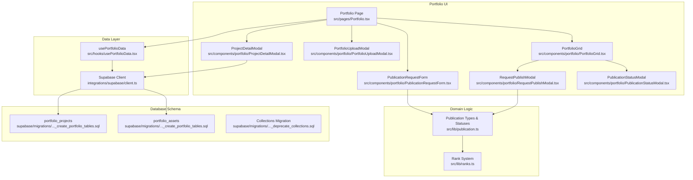
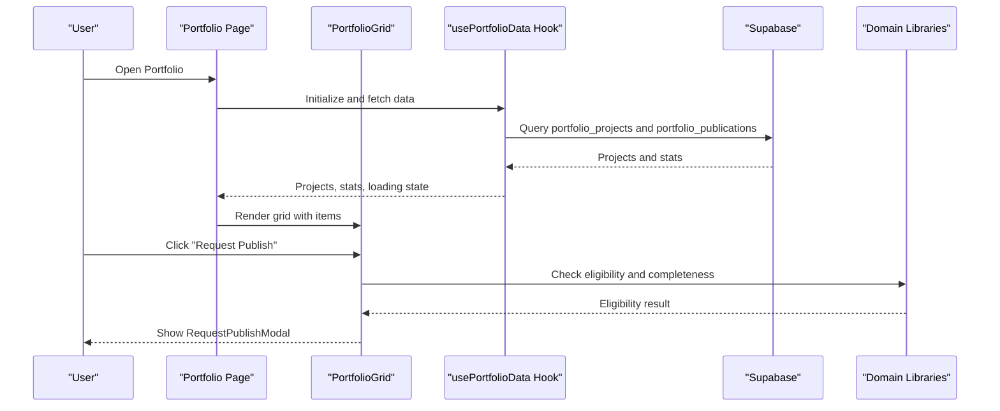
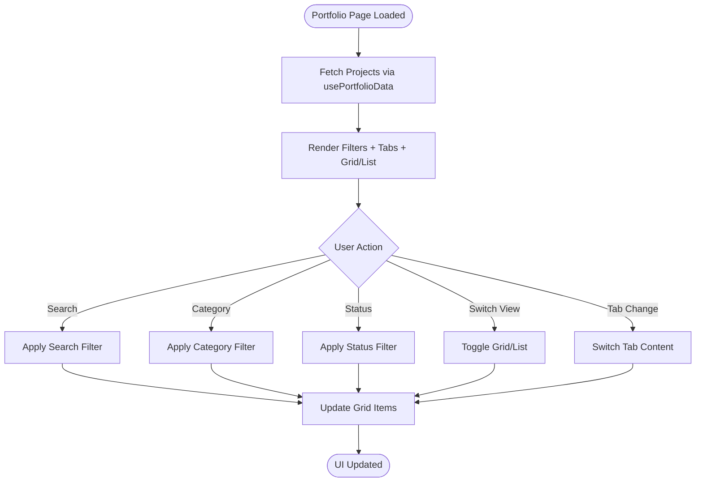
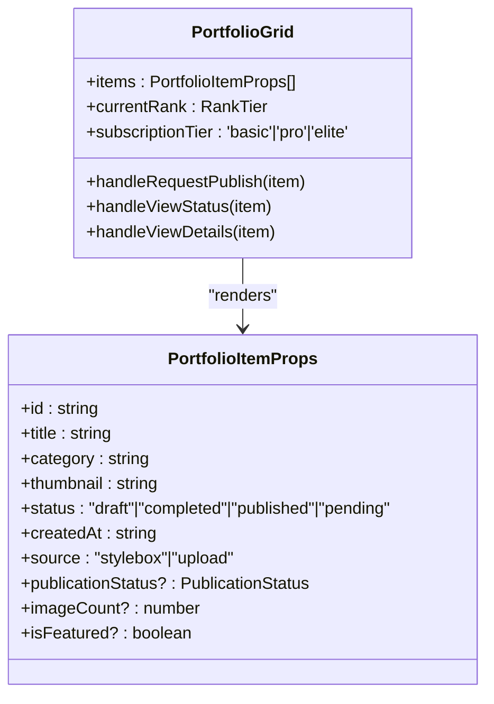
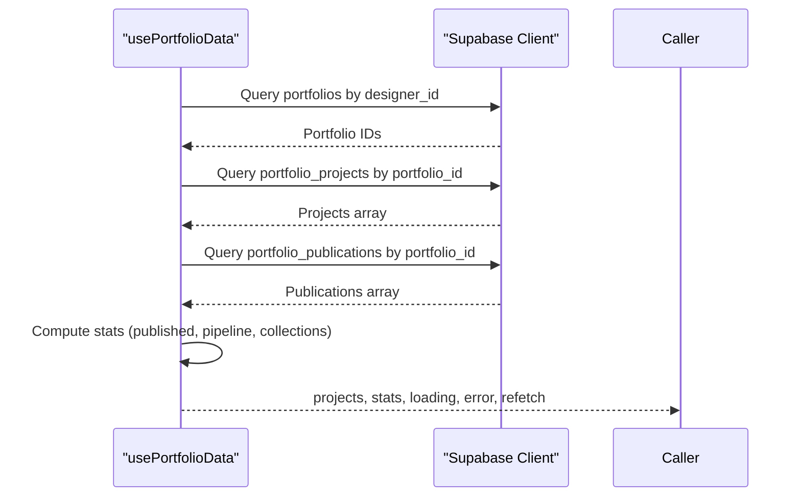
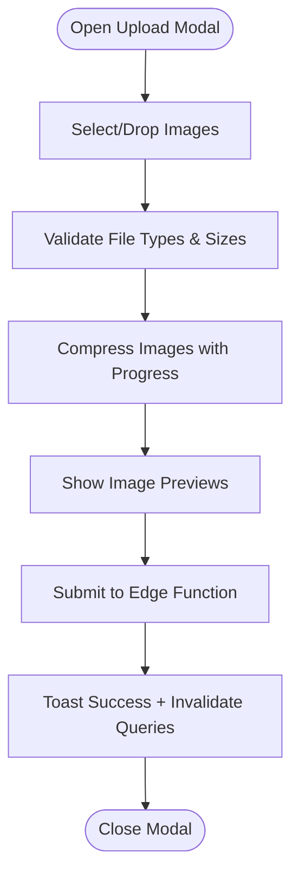
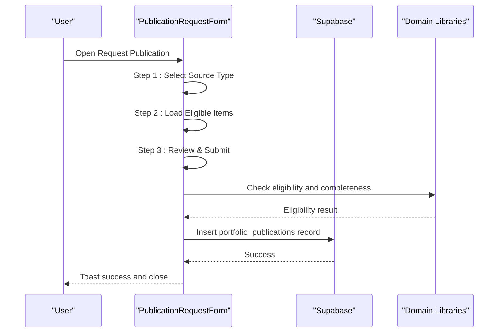
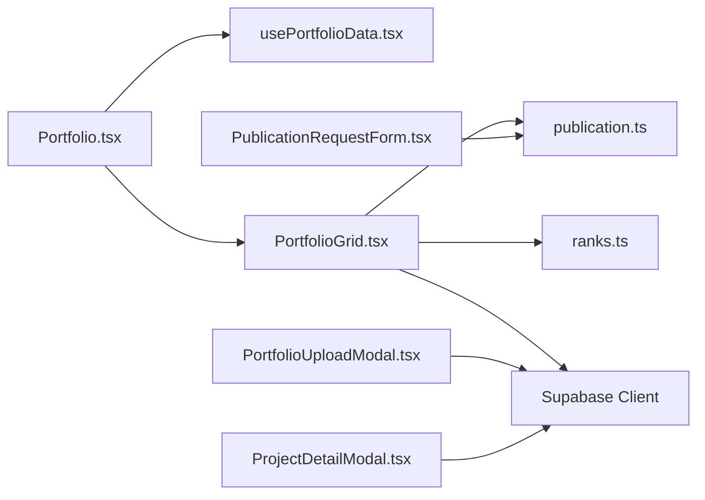

# Portfolio Organization & Management

<cite>
**Referenced Files in This Document**
- [Portfolio.tsx](file://src/pages/Portfolio.tsx)
- [PortfolioGrid.tsx](file://src/components/portfolio/PortfolioGrid.tsx)
- [usePortfolioData.tsx](file://src/hooks/usePortfolioData.tsx)
- [PortfolioUploadModal.tsx](file://src/components/portfolio/PortfolioUploadModal.tsx)
- [PublicationRequestForm.tsx](file://src/components/portfolio/PublicationRequestForm.tsx)
- [ProjectDetailModal.tsx](file://src/components/portfolio/ProjectDetailModal.tsx)
- [RequestPublishModal.tsx](file://src/components/portfolio/RequestPublishModal.tsx)
- [PublicationStatusModal.tsx](file://src/components/portfolio/PublicationStatusModal.tsx)
- [publication.ts](file://src/lib/publication.ts)
- [ranks.ts](file://src/lib/ranks.ts)
- [create_portfolio_tables.sql](file://supabase/migrations/20260127230305_create_portfolio_tables.sql)
- [deprecate_collections.sql](file://supabase/migrations/20260127230400_deprecate_collections.sql)
</cite>

## Table of Contents
1. [Introduction](#introduction)
2. [Project Structure](#project-structure)
3. [Core Components](#core-components)
4. [Architecture Overview](#architecture-overview)
5. [Detailed Component Analysis](#detailed-component-analysis)
6. [Dependency Analysis](#dependency-analysis)
7. [Performance Considerations](#performance-considerations)
8. [Troubleshooting Guide](#troubleshooting-guide)
9. [Conclusion](#conclusion)

## Introduction
This document explains the portfolio organization and management features, focusing on how designers organize, filter, sort, and present their design work. It covers:
- Grid and list view modes
- Filtering by category and status
- Sorting options
- Category-based organization and collections
- Project categorization and tagging
- Source-based organization (Stylebox vs uploaded projects)
- Search functionality
- Publication workflow and status tracking
- Guidelines for effective portfolio management and client presentation

## Project Structure
The portfolio system is centered around a dedicated page that orchestrates data fetching, filtering, and presentation. Supporting components handle uploads, publication requests, and detailed project management.

**Diagram sources**
- [Portfolio.tsx](file://src/pages/Portfolio.tsx#L33-L268)
- [PortfolioGrid.tsx](file://src/components/portfolio/PortfolioGrid.tsx#L73-L296)
- [usePortfolioData.tsx](file://src/hooks/usePortfolioData.tsx#L31-L117)
- [publication.ts](file://src/lib/publication.ts#L1-L282)
- [ranks.ts](file://src/lib/ranks.ts#L1-L246)
- [create_portfolio_tables.sql](file://supabase/migrations/20260127230305_create_portfolio_tables.sql#L1-L86)
- [deprecate_collections.sql](file://supabase/migrations/20260127230400_deprecate_collections.sql#L1-L120)

**Section sources**
- [Portfolio.tsx](file://src/pages/Portfolio.tsx#L33-L268)
- [PortfolioGrid.tsx](file://src/components/portfolio/PortfolioGrid.tsx#L73-L296)
- [usePortfolioData.tsx](file://src/hooks/usePortfolioData.tsx#L31-L117)

## Core Components
- Portfolio Page: Orchestrates filters, view modes, and renders the grid/list view. Provides quick stats and tabs for All Projects, Stylebox projects, Uploaded projects, and Collections.
- PortfolioGrid: Renders individual project cards with status badges, source indicators, and action menus. Supports quick actions and publication status tracking.
- usePortfolioData Hook: Fetches portfolio projects, calculates statistics, and exposes refetch functionality.
- Upload Modal: Handles multi-image upload, compression, validation, and submission to backend functions.
- Publication Request Form: Guides designers through multi-step publication submission from Stylebox, walkthrough, or portfolio items.
- Project Detail Modal: Allows editing project metadata, viewing assets, toggling featured status, and deleting projects.
- Publication Status Modal: Visualizes publication journey and current status with timeline and progress.

**Section sources**
- [Portfolio.tsx](file://src/pages/Portfolio.tsx#L33-L268)
- [PortfolioGrid.tsx](file://src/components/portfolio/PortfolioGrid.tsx#L73-L296)
- [usePortfolioData.tsx](file://src/hooks/usePortfolioData.tsx#L31-L117)
- [PortfolioUploadModal.tsx](file://src/components/portfolio/PortfolioUploadModal.tsx#L56-L521)
- [PublicationRequestForm.tsx](file://src/components/portfolio/PublicationRequestForm.tsx#L97-L634)
- [ProjectDetailModal.tsx](file://src/components/portfolio/ProjectDetailModal.tsx#L47-L461)
- [PublicationStatusModal.tsx](file://src/components/portfolio/PublicationStatusModal.tsx#L99-L245)

## Architecture Overview
The portfolio system follows a clear separation of concerns:
- Presentation: Portfolio page and grid components render UI and manage user interactions.
- Data: Hook encapsulates Supabase queries and state management.
- Domain: Publication and ranking libraries define business rules and status transitions.
- Persistence: Supabase tables store projects, assets, and publication records.

**Diagram sources**
- [Portfolio.tsx](file://src/pages/Portfolio.tsx#L33-L268)
- [PortfolioGrid.tsx](file://src/components/portfolio/PortfolioGrid.tsx#L73-L296)
- [usePortfolioData.tsx](file://src/hooks/usePortfolioData.tsx#L31-L117)
- [publication.ts](file://src/lib/publication.ts#L185-L210)

## Detailed Component Analysis

### Portfolio Page: Organization and Navigation
- View Modes: Grid/list buttons are present in the UI; the current implementation uses a responsive grid layout. The UI structure supports switching to list mode by adding appropriate handlers.
- Tabs: "All Projects", "From Styleboxes", "Uploaded", and "Collections" tabs enable segmented views.
- Filters: Search box, category selector, and status selector are defined in the UI but require binding to state and handlers to filter data.
- Collections: Unique categories are computed and rendered as collection cards; includes a "Create Collection" action.

**Diagram sources**
- [Portfolio.tsx](file://src/pages/Portfolio.tsx#L138-L246)

**Section sources**
- [Portfolio.tsx](file://src/pages/Portfolio.tsx#L33-L268)

### PortfolioGrid: Cards, Actions, and Status Tracking
- Rendering: Responsive grid with project cards displaying thumbnails, title, category, and metadata.
- Status Badges: Draft, Completed, Published, Pending Review with icons and variants.
- Source Indicators: "Stylebox" or "Uploaded" badges.
- Action Menus: Quick actions for view details, edit, request publish, track status, and view on marketplace.
- Publication Status Tracking: When a project has an active publication status, a "Track" button appears linking to the status modal.

**Diagram sources**
- [PortfolioGrid.tsx](file://src/components/portfolio/PortfolioGrid.tsx#L36-L56)
- [PortfolioGrid.tsx](file://src/components/portfolio/PortfolioGrid.tsx#L73-L296)

**Section sources**
- [PortfolioGrid.tsx](file://src/components/portfolio/PortfolioGrid.tsx#L73-L296)

### usePortfolioData Hook: Data Fetching and Statistics
- Fetches portfolio IDs and projects for the authenticated user.
- Computes statistics: total projects, published count, pipeline count, and unique categories as collections.
- Exposes refetch for manual refresh after mutations.

**Diagram sources**
- [usePortfolioData.tsx](file://src/hooks/usePortfolioData.tsx#L31-L117)

**Section sources**
- [usePortfolioData.tsx](file://src/hooks/usePortfolioData.tsx#L31-L117)

### Upload Modal: Multi-Image Upload and Compression
- Validates file types and sizes, compresses images, and previews selections.
- Submits to a Supabase Edge Function for processing and storage.
- Integrates with React Query to invalidate caches and refresh portfolio data.

**Diagram sources**
- [PortfolioUploadModal.tsx](file://src/components/portfolio/PortfolioUploadModal.tsx#L195-L289)

**Section sources**
- [PortfolioUploadModal.tsx](file://src/components/portfolio/PortfolioUploadModal.tsx#L56-L521)

### Publication Request Form: Multi-Step Submission
- Guides selection of source (Stylebox, Walkthrough, Portfolio), project selection, and submission.
- Checks subscription tier and completeness for eligibility.
- Creates a publication record with metadata and triggers notifications.

**Diagram sources**
- [PublicationRequestForm.tsx](file://src/components/portfolio/PublicationRequestForm.tsx#L250-L307)
- [publication.ts](file://src/lib/publication.ts#L185-L210)

**Section sources**
- [PublicationRequestForm.tsx](file://src/components/portfolio/PublicationRequestForm.tsx#L97-L634)
- [publication.ts](file://src/lib/publication.ts#L1-L282)

### Project Detail Modal: Editing and Management
- Loads project details and assets, supports editing metadata, toggling featured, sharing, and deletion.
- Uses mutations to update project data and invalidate caches.

**Section sources**
- [ProjectDetailModal.tsx](file://src/components/portfolio/ProjectDetailModal.tsx#L47-L461)

### Publication Status Modal: Journey Visualization
- Displays current status, reviewer notes (when applicable), stage progress, and a timeline of stages.
- Uses publication status definitions to render appropriate visuals and descriptions.

**Section sources**
- [PublicationStatusModal.tsx](file://src/components/portfolio/PublicationStatusModal.tsx#L99-L245)
- [publication.ts](file://src/lib/publication.ts#L25-L157)

## Dependency Analysis
- Portfolio Page depends on usePortfolioData for data and state.
- PortfolioGrid depends on domain libraries for publication status and ranking.
- Upload Modal integrates with Supabase Edge Functions and React Query.
- Publication components depend on Supabase for persistence and domain libraries for business rules.

**Diagram sources**
- [Portfolio.tsx](file://src/pages/Portfolio.tsx#L33-L268)
- [PortfolioGrid.tsx](file://src/components/portfolio/PortfolioGrid.tsx#L73-L296)
- [usePortfolioData.tsx](file://src/hooks/usePortfolioData.tsx#L31-L117)
- [publication.ts](file://src/lib/publication.ts#L1-L282)
- [ranks.ts](file://src/lib/ranks.ts#L1-L246)
- [PortfolioUploadModal.tsx](file://src/components/portfolio/PortfolioUploadModal.tsx#L56-L521)
- [PublicationRequestForm.tsx](file://src/components/portfolio/PublicationRequestForm.tsx#L97-L634)
- [ProjectDetailModal.tsx](file://src/components/portfolio/ProjectDetailModal.tsx#L47-L461)

**Section sources**
- [Portfolio.tsx](file://src/pages/Portfolio.tsx#L33-L268)
- [PortfolioGrid.tsx](file://src/components/portfolio/PortfolioGrid.tsx#L73-L296)
- [usePortfolioData.tsx](file://src/hooks/usePortfolioData.tsx#L31-L117)

## Performance Considerations
- Efficient data fetching: The hook orders projects by creation date descending and limits queries to the authenticated user’s portfolios.
- Client-side filtering: The Portfolio page defines filter controls; implementing reactive filtering will reduce unnecessary re-renders by leveraging memoization and controlled state updates.
- Image compression: The upload modal compresses images before upload to reduce payload size and improve UX.
- Pagination: Consider adding pagination for large portfolios to avoid rendering thousands of cards at once.

## Troubleshooting Guide
- Upload fails: Verify authentication session, file type validation, and network connectivity. Check toast messages for specific errors.
- Publication eligibility: Ensure subscription tier is Pro or Elite and completeness is 100%. Review required fields and optional enhancements.
- Status tracking: If publication status does not update, confirm the backend publication records and that the modal is linked to the correct project ID.
- Data not refreshing: Trigger refetch after mutations or ensure React Query cache invalidation is invoked.

**Section sources**
- [PortfolioUploadModal.tsx](file://src/components/portfolio/PortfolioUploadModal.tsx#L146-L151)
- [PublicationRequestForm.tsx](file://src/components/portfolio/PublicationRequestForm.tsx#L299-L307)
- [usePortfolioData.tsx](file://src/hooks/usePortfolioData.tsx#L104-L108)

## Conclusion
The portfolio system provides a robust foundation for designers to organize, filter, and present their work. With grid/list views, category-based collections, source differentiation, and publication tracking, designers can curate professional portfolios optimized for clients and visitors. Implementing reactive filtering and pagination will further enhance usability, while maintaining clear separation of concerns ensures scalability and maintainability.