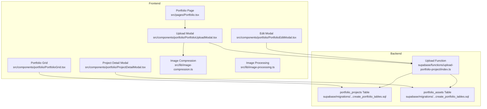
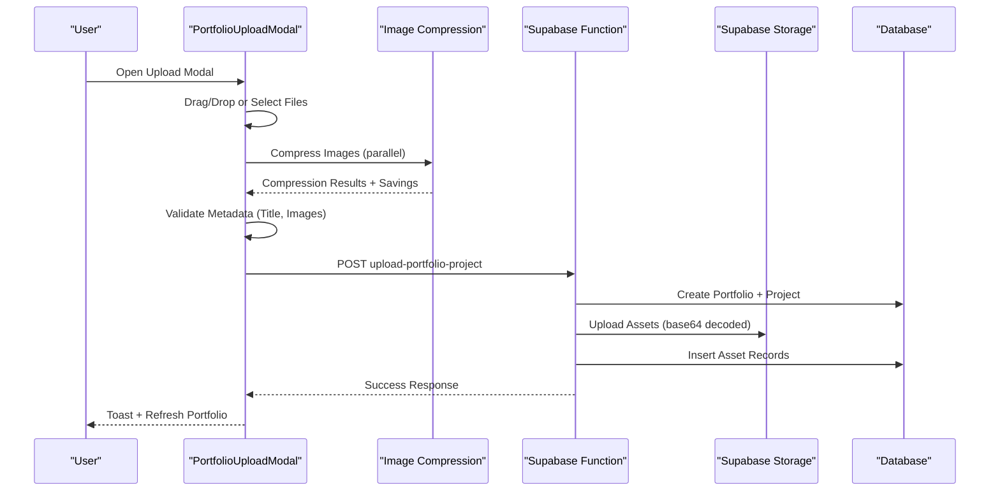
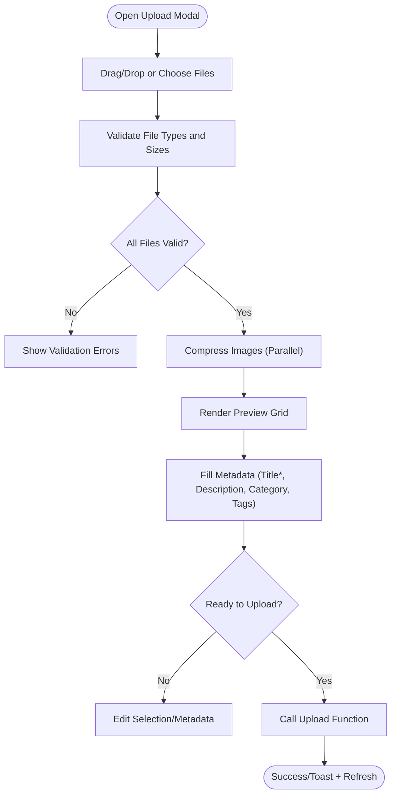
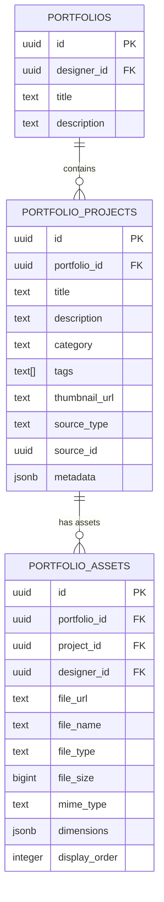
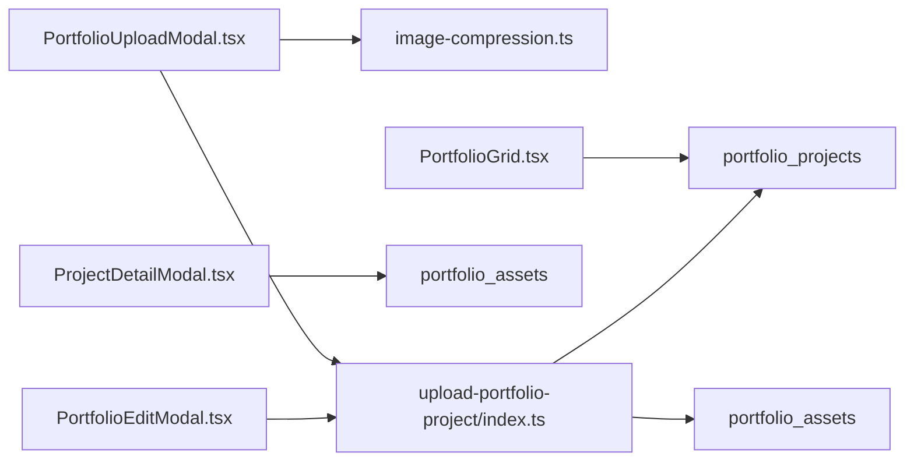

# Project Upload Workflow

<cite>
**Referenced Files in This Document**
- [PortfolioUploadModal.tsx](file://src/components/portfolio/PortfolioUploadModal.tsx)
- [PortfolioEditModal.tsx](file://src/components/portfolio/PortfolioEditModal.tsx)
- [image-compression.ts](file://src/lib/image-compression.ts)
- [image-processing.ts](file://src/lib/image-processing.ts)
- [upload-portfolio-project/index.ts](file://supabase/functions/upload-portfolio-project/index.ts)
- [Portfolio.tsx](file://src/pages/Portfolio.tsx)
- [PortfolioGrid.tsx](file://src/components/portfolio/PortfolioGrid.tsx)
- [usePortfolioData.tsx](file://src/hooks/usePortfolioData.tsx)
- [ProjectDetailModal.tsx](file://src/components/portfolio/ProjectDetailModal.tsx)
- [20260127230305_create_portfolio_tables.sql](file://supabase/migrations/20260127230305_create_portfolio_tables.sql)
</cite>

## Table of Contents
1. [Introduction](#introduction)
2. [Project Structure](#project-structure)
3. [Core Components](#core-components)
4. [Architecture Overview](#architecture-overview)
5. [Detailed Component Analysis](#detailed-component-analysis)
6. [Dependency Analysis](#dependency-analysis)
7. [Performance Considerations](#performance-considerations)
8. [Troubleshooting Guide](#troubleshooting-guide)
9. [Conclusion](#conclusion)

## Introduction
This document explains the complete project upload workflow for the portfolio system. It covers the upload modal interface, file selection and validation, metadata entry, compression strategies, thumbnail generation, preview functionality, step-by-step procedures, error handling, progress indicators, backend processing pipeline, storage optimization, and quality assurance checks. The workflow integrates frontend UI components with Supabase functions and database tables to deliver a robust and user-friendly experience.

## Project Structure
The upload workflow spans several frontend components and backend functions:
- Frontend modals and pages orchestrate user interactions
- Image compression utilities optimize file sizes
- Supabase Edge Function handles secure server-side processing
- Database tables store projects, assets, and metadata

**Diagram sources**
- [Portfolio.tsx](file://src/pages/Portfolio.tsx#L258-L262)
- [PortfolioUploadModal.tsx](file://src/components/portfolio/PortfolioUploadModal.tsx#L1-L521)
- [PortfolioEditModal.tsx](file://src/components/portfolio/PortfolioEditModal.tsx#L1-L251)
- [ProjectDetailModal.tsx](file://src/components/portfolio/ProjectDetailModal.tsx#L1-L461)
- [PortfolioGrid.tsx](file://src/components/portfolio/PortfolioGrid.tsx#L1-L296)
- [image-compression.ts](file://src/lib/image-compression.ts#L1-L124)
- [image-processing.ts](file://src/lib/image-processing.ts#L1-L82)
- [upload-portfolio-project/index.ts](file://supabase/functions/upload-portfolio-project/index.ts#L1-L300)
- [20260127230305_create_portfolio_tables.sql](file://supabase/migrations/20260127230305_create_portfolio_tables.sql#L1-L86)

**Section sources**
- [Portfolio.tsx](file://src/pages/Portfolio.tsx#L33-L268)
- [PortfolioUploadModal.tsx](file://src/components/portfolio/PortfolioUploadModal.tsx#L1-L521)
- [PortfolioEditModal.tsx](file://src/components/portfolio/PortfolioEditModal.tsx#L1-L251)
- [ProjectDetailModal.tsx](file://src/components/portfolio/ProjectDetailModal.tsx#L1-L461)
- [PortfolioGrid.tsx](file://src/components/portfolio/PortfolioGrid.tsx#L1-L296)
- [image-compression.ts](file://src/lib/image-compression.ts#L1-L124)
- [image-processing.ts](file://src/lib/image-processing.ts#L1-L82)
- [upload-portfolio-project/index.ts](file://supabase/functions/upload-portfolio-project/index.ts#L1-L300)
- [20260127230305_create_portfolio_tables.sql](file://supabase/migrations/20260127230305_create_portfolio_tables.sql#L1-L86)

## Core Components
- Upload Modal: Provides drag-and-drop file selection, validation, compression, preview, and submission controls.
- Edit Modal: Allows updating project metadata and thumbnail URL after upload.
- Compression Utilities: Optimizes image sizes using browser-based compression with progress feedback.
- Upload Function: Processes uploads server-side, validates requests, creates portfolio entries, stores assets, and generates thumbnails.
- Portfolio Pages and Grid: Display projects, support filtering and publication requests.

**Section sources**
- [PortfolioUploadModal.tsx](file://src/components/portfolio/PortfolioUploadModal.tsx#L1-L521)
- [PortfolioEditModal.tsx](file://src/components/portfolio/PortfolioEditModal.tsx#L1-L251)
- [image-compression.ts](file://src/lib/image-compression.ts#L1-L124)
- [upload-portfolio-project/index.ts](file://supabase/functions/upload-portfolio-project/index.ts#L1-L300)
- [Portfolio.tsx](file://src/pages/Portfolio.tsx#L33-L268)
- [PortfolioGrid.tsx](file://src/components/portfolio/PortfolioGrid.tsx#L1-L296)

## Architecture Overview
The upload workflow follows a client-driven compression and submission pattern with server-side validation and persistence.

**Diagram sources**
- [PortfolioUploadModal.tsx](file://src/components/portfolio/PortfolioUploadModal.tsx#L75-L151)
- [image-compression.ts](file://src/lib/image-compression.ts#L69-L86)
- [upload-portfolio-project/index.ts](file://supabase/functions/upload-portfolio-project/index.ts#L21-L287)

## Detailed Component Analysis

### Upload Modal Interface and File Selection
- File Acceptance: Supports JPEG, JPG, PNG, and WebP with a 10 MB per-file limit.
- Drag-and-Drop Zone: Highlights on drag enter/leave with visual feedback.
- File Validation: On selection, files are validated for type and size; invalid files show error notifications.
- Compression Pipeline: Selected files are compressed in parallel with progress updates; savings are calculated and displayed.
- Preview Grid: Shows thumbnails with remove controls; first image is marked as thumbnail.
- Metadata Forms: Title (required), description, category, and tags; tags support add/remove and Enter key submission.

**Diagram sources**
- [PortfolioUploadModal.tsx](file://src/components/portfolio/PortfolioUploadModal.tsx#L185-L256)
- [image-compression.ts](file://src/lib/image-compression.ts#L69-L86)

**Section sources**
- [PortfolioUploadModal.tsx](file://src/components/portfolio/PortfolioUploadModal.tsx#L185-L256)
- [image-compression.ts](file://src/lib/image-compression.ts#L1-L124)

### Metadata Entry Forms and Validation
- Title: Required field with character limit.
- Description: Optional with character limit.
- Category: Select from predefined categories.
- Tags: Add/remove tags with Enter key support; duplicates prevented.
- Validation: Ensures at least one image and a non-empty title before enabling upload.

**Section sources**
- [PortfolioUploadModal.tsx](file://src/components/portfolio/PortfolioUploadModal.tsx#L410-L488)
- [PortfolioUploadModal.tsx](file://src/components/portfolio/PortfolioUploadModal.tsx#L75-L151)

### Supported Formats, Size Limits, and Compression Strategies
- Supported Formats: JPEG, JPG, PNG, WebP.
- Size Limit: 10 MB per file.
- Compression Defaults: Target ~2 MB max size, max dimension 1920, WebP output, 85% initial quality, Web Worker usage for performance.
- Progress Tracking: Separate progress bars for compression and upload phases.
- Savings Display: Percentage and absolute saved bytes shown after compression.

**Section sources**
- [PortfolioUploadModal.tsx](file://src/components/portfolio/PortfolioUploadModal.tsx#L45-L46)
- [image-compression.ts](file://src/lib/image-compression.ts#L19-L25)
- [image-compression.ts](file://src/lib/image-compression.ts#L69-L86)
- [image-compression.ts](file://src/lib/image-compression.ts#L91-L101)

### Thumbnail Generation and Preview
- Thumbnail Selection: First uploaded image is automatically set as the project thumbnail.
- Backend Thumbnail Update: After successful storage, the project’s thumbnail URL is updated.
- Preview Controls: In the detail modal, users can navigate images and see thumbnails; edit modal supports manual thumbnail URL override.

**Section sources**
- [upload-portfolio-project/index.ts](file://supabase/functions/upload-portfolio-project/index.ts#L181-L193)
- [PortfolioEditModal.tsx](file://src/components/portfolio/PortfolioEditModal.tsx#L206-L227)
- [ProjectDetailModal.tsx](file://src/components/portfolio/ProjectDetailModal.tsx#L282-L339)

### Step-by-Step Upload Procedure
1. Open the Portfolio page and click "Upload Project".
2. Drag-and-drop or choose images; validation runs immediately.
3. Adjust metadata: title (required), description, category, tags.
4. Wait for compression progress; review savings.
5. Click "Upload Project"; monitor upload progress.
6. On success, toast confirms completion and the grid refreshes.

**Section sources**
- [Portfolio.tsx](file://src/pages/Portfolio.tsx#L82-L89)
- [PortfolioUploadModal.tsx](file://src/components/portfolio/PortfolioUploadModal.tsx#L311-L320)
- [PortfolioUploadModal.tsx](file://src/components/portfolio/PortfolioUploadModal.tsx#L495-L516)

### Error Handling Mechanisms and Progress Indicators
- Frontend:
  - Validation errors for unsupported types or oversized files.
  - Compression failures fall back to original files with user notification.
  - Upload progress bar and current file indicator during submission.
  - Error toast on failure; progress resets on error.
- Backend:
  - Authentication checks and authorization header validation.
  - Batch upload rollback on failure: deletes uploaded files, asset records, and project.
  - Detailed error messages returned to client.

**Section sources**
- [PortfolioUploadModal.tsx](file://src/components/portfolio/PortfolioUploadModal.tsx#L146-L151)
- [image-compression.ts](file://src/lib/image-compression.ts#L53-L63)
- [upload-portfolio-project/index.ts](file://supabase/functions/upload-portfolio-project/index.ts#L26-L66)
- [upload-portfolio-project/index.ts](file://supabase/functions/upload-portfolio-project/index.ts#L228-L273)

### File Processing Pipeline and Storage Optimization
- Client-Side:
  - Base64 encoding of compressed images for transport.
  - Parallel compression reduces total wait time.
- Server-Side:
  - Decodes base64 to binary data.
  - Stores files in Supabase Storage with cache-control and unique filenames.
  - Creates asset records with file metadata and dimensions.
  - Sets thumbnail URL on the first asset.
  - Uses service role client to bypass row-level security for storage operations.

**Section sources**
- [PortfolioUploadModal.tsx](file://src/components/portfolio/PortfolioUploadModal.tsx#L82-L103)
- [upload-portfolio-project/index.ts](file://supabase/functions/upload-portfolio-project/index.ts#L136-L227)

### Quality Assurance Checks
- Required Fields: Title and at least one image are mandatory.
- File Integrity: Binary decoding and storage errors trigger rollback.
- Metadata Consistency: Thumbnail URL updated only after successful storage.
- User Feedback: Real-time progress and savings notifications.

**Section sources**
- [PortfolioUploadModal.tsx](file://src/components/portfolio/PortfolioUploadModal.tsx#L75-L79)
- [upload-portfolio-project/index.ts](file://supabase/functions/upload-portfolio-project/index.ts#L68-L76)

### Project Editing Capabilities
- Edit Modal allows updating title, description, category, tags, and thumbnail URL.
- Saves changes via Supabase update mutation and refreshes queries.

**Section sources**
- [PortfolioEditModal.tsx](file://src/components/portfolio/PortfolioEditModal.tsx#L76-L104)
- [PortfolioEditModal.tsx](file://src/components/portfolio/PortfolioEditModal.tsx#L206-L227)

### Data Model and Relationships
The upload workflow persists data in two primary tables with referential integrity and indexing.

**Diagram sources**
- [20260127230305_create_portfolio_tables.sql](file://supabase/migrations/20260127230305_create_portfolio_tables.sql#L6-L43)

**Section sources**
- [20260127230305_create_portfolio_tables.sql](file://supabase/migrations/20260127230305_create_portfolio_tables.sql#L1-L86)

## Dependency Analysis
- Frontend dependencies:
  - PortfolioUploadModal depends on image-compression utilities and Supabase client.
  - PortfolioEditModal depends on Supabase client for updates.
  - PortfolioGrid and ProjectDetailModal depend on Supabase queries and mutations.
- Backend dependencies:
  - Upload function depends on Supabase client and service role key for storage operations.
  - Database migrations define table schemas and permissions.

**Diagram sources**
- [PortfolioUploadModal.tsx](file://src/components/portfolio/PortfolioUploadModal.tsx#L1-L521)
- [PortfolioEditModal.tsx](file://src/components/portfolio/PortfolioEditModal.tsx#L1-L251)
- [ProjectDetailModal.tsx](file://src/components/portfolio/ProjectDetailModal.tsx#L1-L461)
- [PortfolioGrid.tsx](file://src/components/portfolio/PortfolioGrid.tsx#L1-L296)
- [image-compression.ts](file://src/lib/image-compression.ts#L1-L124)
- [upload-portfolio-project/index.ts](file://supabase/functions/upload-portfolio-project/index.ts#L1-L300)
- [20260127230305_create_portfolio_tables.sql](file://supabase/migrations/20260127230305_create_portfolio_tables.sql#L1-L86)

**Section sources**
- [PortfolioUploadModal.tsx](file://src/components/portfolio/PortfolioUploadModal.tsx#L1-L521)
- [PortfolioEditModal.tsx](file://src/components/portfolio/PortfolioEditModal.tsx#L1-L251)
- [ProjectDetailModal.tsx](file://src/components/portfolio/ProjectDetailModal.tsx#L1-L461)
- [PortfolioGrid.tsx](file://src/components/portfolio/PortfolioGrid.tsx#L1-L296)
- [image-compression.ts](file://src/lib/image-compression.ts#L1-L124)
- [upload-portfolio-project/index.ts](file://supabase/functions/upload-portfolio-project/index.ts#L1-L300)
- [20260127230305_create_portfolio_tables.sql](file://supabase/migrations/20260127230305_create_portfolio_tables.sql#L1-L86)

## Performance Considerations
- Parallel Compression: Reduces total processing time by handling multiple images concurrently.
- Web Worker Usage: Offloads compression to background threads to keep UI responsive.
- Base64 Encoding: Increases payload size; consider streaming or chunked uploads for very large batches.
- Storage Cache-Control: Sets cache-control to balance freshness and CDN performance.
- Rollback Efficiency: Batch deletion minimizes orphaned assets and ensures data consistency.

[No sources needed since this section provides general guidance]

## Troubleshooting Guide
Common issues and resolutions:
- File Type Errors: Ensure images are JPEG, JPG, PNG, or WebP; verify MIME types.
- Size Limit Exceeded: Compress images below 10 MB or resize prior to upload.
- Compression Failures: Browser-image-compression fallback returns original file; retry or adjust options.
- Authentication Errors: Verify session and access token availability before upload.
- Upload Failures: Check network connectivity; backend rollbacks clean up partial data.

**Section sources**
- [PortfolioUploadModal.tsx](file://src/components/portfolio/PortfolioUploadModal.tsx#L185-L193)
- [image-compression.ts](file://src/lib/image-compression.ts#L53-L63)
- [upload-portfolio-project/index.ts](file://supabase/functions/upload-portfolio-project/index.ts#L26-L66)
- [upload-portfolio-project/index.ts](file://supabase/functions/upload-portfolio-project/index.ts#L228-L273)

## Conclusion
The project upload workflow combines a user-friendly frontend interface with efficient compression and a robust server-side pipeline. It enforces validation, provides clear feedback, optimizes storage, and maintains data integrity through rollbacks. Together with editing and preview capabilities, it delivers a seamless experience for designers to showcase their work.