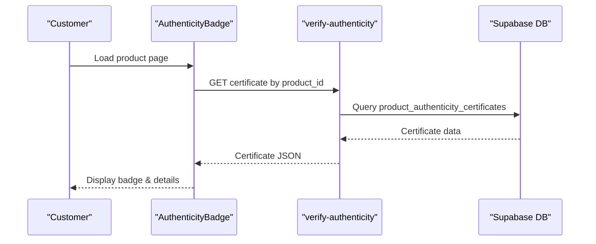

# Publication Request System

<cite>
**Referenced Files in This Document**
- [PublicationRequestForm.tsx](file://src/components/portfolio/PublicationRequestForm.tsx)
- [PublicationStatusModal.tsx](file://src/components/portfolio/PublicationStatusModal.tsx)
- [RequestPublishModal.tsx](file://src/components/portfolio/RequestPublishModal.tsx)
- [publication.ts](file://src/lib/publication.ts)
- [AdminPublications.tsx](file://src/pages/admin/AdminPublications.tsx)
- [AuthenticityBadge.tsx](file://src/components/marketplace/AuthenticityBadge.tsx)
- [verify-authenticity/index.ts](file://supabase/functions/verify-authenticity/index.ts)
- [useNotifications.tsx](file://src/hooks/useNotifications.tsx)
</cite>

## Table of Contents
1. [Introduction](#introduction)
2. [Project Structure](#project-structure)
3. [Core Components](#core-components)
4. [Architecture Overview](#architecture-overview)
5. [Detailed Component Analysis](#detailed-component-analysis)
6. [Dependency Analysis](#dependency-analysis)
7. [Performance Considerations](#performance-considerations)
8. [Troubleshooting Guide](#troubleshooting-guide)
9. [Conclusion](#conclusion)

## Introduction
This document describes the Publication Request System that enables designers to submit creative works for marketplace review and approval. It covers the submission form interface, required documentation, approval workflow, publication statuses, review criteria, timeline expectations, status tracking, notification system, authenticity verification, and resubmission procedures.

## Project Structure
The publication system spans frontend components, shared libraries, and backend Supabase functions:
- Frontend forms and modals for initiating publication requests
- Shared publication status and eligibility logic
- Admin portal for reviewing and approving submissions
- Authenticity verification service for marketplace products
- Real-time notifications for status updates

**Diagram sources**
- [PublicationRequestForm.tsx](file://src/components/portfolio/PublicationRequestForm.tsx#L1-L634)
- [RequestPublishModal.tsx](file://src/components/portfolio/RequestPublishModal.tsx#L1-L291)
- [PublicationStatusModal.tsx](file://src/components/portfolio/PublicationStatusModal.tsx#L1-L245)
- [publication.ts](file://src/lib/publication.ts#L1-L282)
- [AuthenticityBadge.tsx](file://src/components/marketplace/AuthenticityBadge.tsx#L1-L52)
- [verify-authenticity/index.ts](file://supabase/functions/verify-authenticity/index.ts#L1-L262)
- [useNotifications.tsx](file://src/hooks/useNotifications.tsx#L1-L158)

**Section sources**
- [PublicationRequestForm.tsx](file://src/components/portfolio/PublicationRequestForm.tsx#L1-L634)
- [publication.ts](file://src/lib/publication.ts#L1-L282)

## Core Components
- PublicationRequestForm: Multi-step wizard to select source, choose project, and submit for review with eligibility checks and completeness indicators.
- RequestPublishModal: Alternative modal for quick submission with completeness metrics and agreement prompts.
- PublicationStatusModal: Designer-facing status tracker with stage progress, current status, reviewer notes, and journey timeline.
- publication.ts: Centralized definitions for publication statuses, transitions, completeness calculation, and auto-approval logic.
- AdminPublications: Admin portal for reviewing submissions, logging decisions, and managing publication queues.
- AuthenticityBadge + verify-authenticity: Product authenticity verification for marketplace listings.
- useNotifications: Real-time notifications for publication status updates.

**Section sources**
- [PublicationRequestForm.tsx](file://src/components/portfolio/PublicationRequestForm.tsx#L97-L312)
- [RequestPublishModal.tsx](file://src/components/portfolio/RequestPublishModal.tsx#L79-L110)
- [PublicationStatusModal.tsx](file://src/components/portfolio/PublicationStatusModal.tsx#L99-L107)
- [publication.ts](file://src/lib/publication.ts#L4-L157)
- [AdminPublications.tsx](file://src/pages/admin/AdminPublications.tsx#L103-L166)
- [AuthenticityBadge.tsx](file://src/components/marketplace/AuthenticityBadge.tsx#L17-L42)
- [verify-authenticity/index.ts](file://supabase/functions/verify-authenticity/index.ts#L24-L122)
- [useNotifications.tsx](file://src/hooks/useNotifications.tsx#L8-L88)

## Architecture Overview
The system integrates designer submissions, admin review, and marketplace readiness with real-time notifications and authenticity verification.

**Diagram sources**
- [PublicationRequestForm.tsx](file://src/components/portfolio/PublicationRequestForm.tsx#L250-L307)
- [publication.ts](file://src/lib/publication.ts#L191-L210)
- [AdminPublications.tsx](file://src/pages/admin/AdminPublications.tsx#L122-L166)
- [verify-authenticity/index.ts](file://supabase/functions/verify-authenticity/index.ts#L34-L122)
- [useNotifications.tsx](file://src/hooks/useNotifications.tsx#L45-L88)

## Detailed Component Analysis

### Publication Request Form
The form guides designers through three steps:
1. Source selection: StyleBox submission, Walkthrough project, or Portfolio item.
2. Project selection: Choose from eligible completed items.
3. Review and submit: Completeness preview, subscription eligibility, notes, and agreement.

Key behaviors:
- Eligibility requires Pro or Elite subscription tier and 100% completeness.
- On submit, creates a portfolio entry if needed and inserts a publication record with status "pending".
- Uses toast notifications for success/error feedback.

**Diagram sources**
- [PublicationRequestForm.tsx](file://src/components/portfolio/PublicationRequestForm.tsx#L137-L307)
- [publication.ts](file://src/lib/publication.ts#L191-L210)

**Section sources**
- [PublicationRequestForm.tsx](file://src/components/portfolio/PublicationRequestForm.tsx#L97-L312)

### Publication Status Tracking
The status modal displays:
- Current status with icon and color-coded badge
- Overall progress percentage based on stage completion
- Journey timeline showing submission → review → production → marketplace
- Optional reviewer notes when revision is requested
- Last updated timestamp

**Diagram sources**
- [PublicationStatusModal.tsx](file://src/components/portfolio/PublicationStatusModal.tsx#L32-L107)
- [publication.ts](file://src/lib/publication.ts#L25-L34)

**Section sources**
- [PublicationStatusModal.tsx](file://src/components/portfolio/PublicationStatusModal.tsx#L99-L244)
- [publication.ts](file://src/lib/publication.ts#L212-L216)

### Approval Workflow and Admin Portal
AdminPublications provides:
- Filtering by status (pending, approved, rejected, revision, production)
- Decision actions: approve, request revision, reject
- Logging of reviews with notes and optional quality ratings
- Real-time notifications for status changes

**Diagram sources**
- [AdminPublications.tsx](file://src/pages/admin/AdminPublications.tsx#L122-L166)
- [AdminPublications.tsx](file://src/pages/admin/AdminPublications.tsx#L245-L282)
- [useNotifications.tsx](file://src/hooks/useNotifications.tsx#L45-L88)

**Section sources**
- [AdminPublications.tsx](file://src/pages/admin/AdminPublications.tsx#L103-L198)
- [AdminPublications.tsx](file://src/pages/admin/AdminPublications.tsx#L245-L841)

### Authenticity Verification
The authenticity system supports:
- Public verification by verification code or serial number
- Retrieval of product certificate details for marketplace pages
- Certificate generation (admin-only endpoint)

**Diagram sources**
- [AuthenticityBadge.tsx](file://src/components/marketplace/AuthenticityBadge.tsx#L17-L42)
- [verify-authenticity/index.ts](file://supabase/functions/verify-authenticity/index.ts#L124-L186)

**Section sources**
- [AuthenticityBadge.tsx](file://src/components/marketplace/AuthenticityBadge.tsx#L17-L52)
- [verify-authenticity/index.ts](file://supabase/functions/verify-authenticity/index.ts#L24-L122)

### Publication Status Definitions and Transitions
The system defines 11 publication statuses across four stages: submission, review, production, and marketplace. Each status includes:
- Label and description
- Stage assignment
- Order for progress calculation
- Designer visibility/editability
- Available admin actions

Transitions define allowable state changes, ensuring workflow integrity.

**Diagram sources**
- [publication.ts](file://src/lib/publication.ts#L36-L157)
- [publication.ts](file://src/lib/publication.ts#L251-L269)

**Section sources**
- [publication.ts](file://src/lib/publication.ts#L4-L157)
- [publication.ts](file://src/lib/publication.ts#L251-L269)

## Dependency Analysis
- PublicationRequestForm depends on:
  - publication.ts for eligibility and completeness
  - Supabase client for database operations
  - Sonner for toast notifications
- PublicationStatusModal depends on:
  - publication.ts for status metadata and progress
  - Framer Motion for animations
- AdminPublications depends on:
  - Supabase admin client for queries and mutations
  - TanStack Query for caching and refetching
  - useNotifications for real-time updates
- AuthenticityBadge depends on:
  - verify-authenticity function for certificate retrieval
  - Supabase functions runtime

**Diagram sources**
- [PublicationRequestForm.tsx](file://src/components/portfolio/PublicationRequestForm.tsx#L1-L50)
- [PublicationStatusModal.tsx](file://src/components/portfolio/PublicationStatusModal.tsx#L25-L30)
- [AdminPublications.tsx](file://src/pages/admin/AdminPublications.tsx#L1-L67)
- [AuthenticityBadge.tsx](file://src/components/marketplace/AuthenticityBadge.tsx#L1-L31)
- [verify-authenticity/index.ts](file://supabase/functions/verify-authenticity/index.ts#L1-L32)
- [useNotifications.tsx](file://src/hooks/useNotifications.tsx#L1-L8)

**Section sources**
- [PublicationRequestForm.tsx](file://src/components/portfolio/PublicationRequestForm.tsx#L1-L50)
- [AdminPublications.tsx](file://src/pages/admin/AdminPublications.tsx#L1-L67)
- [useNotifications.tsx](file://src/hooks/useNotifications.tsx#L1-L8)

## Performance Considerations
- Use React Query’s caching to avoid redundant queries for publication lists and statuses.
- Debounce search filters in AdminPublications to reduce network load.
- Lazy-load certificate retrieval in AuthenticityBadge to minimize initial page weight.
- Batch notifications updates using Supabase real-time channels to prevent excessive re-renders.

## Troubleshooting Guide
Common issues and resolutions:
- Submission blocked due to eligibility:
  - Ensure subscription tier is Pro or Elite.
  - Complete all required fields (title, description, category, sketches, moodboard, mockups).
- No eligible items found:
  - Complete a StyleBox challenge, walkthrough, or portfolio project first.
- Submission fails:
  - Check toast error messages; retry after resolving errors.
- Status not updating:
  - Refresh the page or rely on real-time notifications; verify Supabase real-time subscription is active.
- Authentication verification errors:
  - Confirm product_id is valid and certificate exists; ensure function endpoint is reachable.

**Section sources**
- [PublicationRequestForm.tsx](file://src/components/portfolio/PublicationRequestForm.tsx#L250-L307)
- [RequestPublishModal.tsx](file://src/components/portfolio/RequestPublishModal.tsx#L95-L110)
- [useNotifications.tsx](file://src/hooks/useNotifications.tsx#L45-L88)
- [verify-authenticity/index.ts](file://supabase/functions/verify-authenticity/index.ts#L34-L122)

## Conclusion
The Publication Request System provides a structured pathway for designers to submit creative works, with clear eligibility requirements, comprehensive status tracking, and robust admin oversight. The system balances automation (auto-approval timers) with human review, while integrating real-time notifications and authenticity verification for marketplace trust.