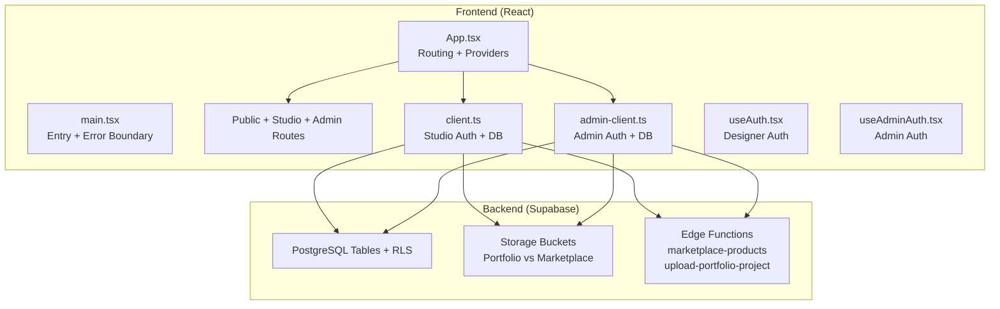
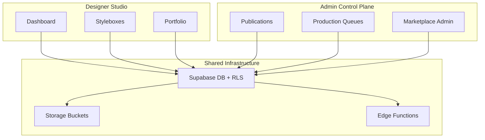
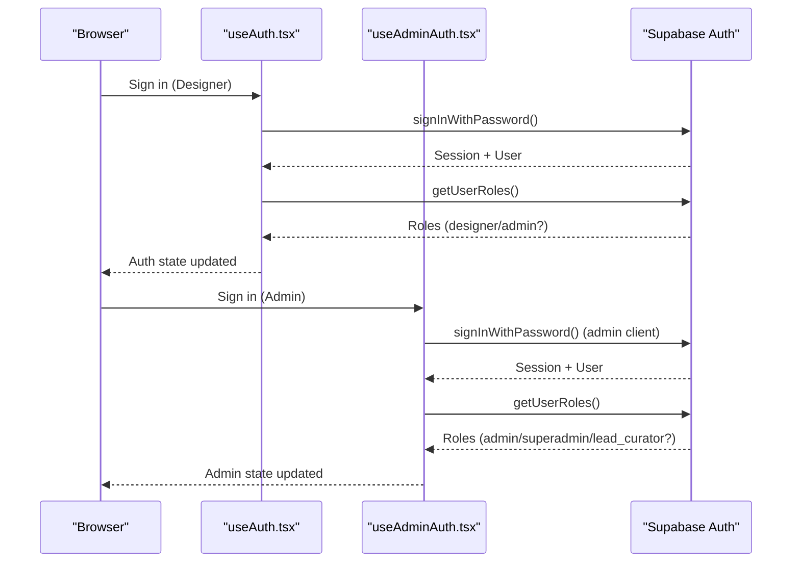
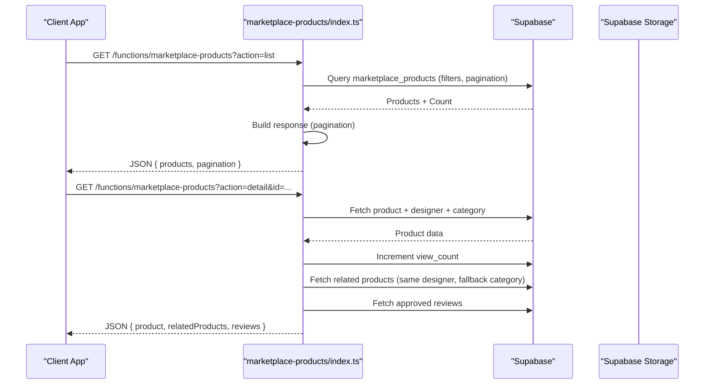
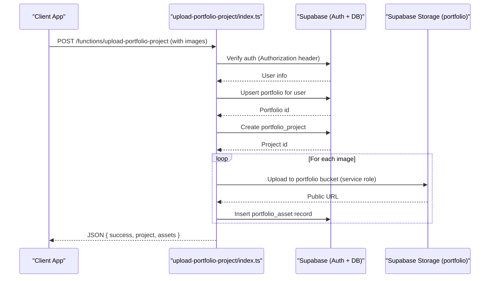
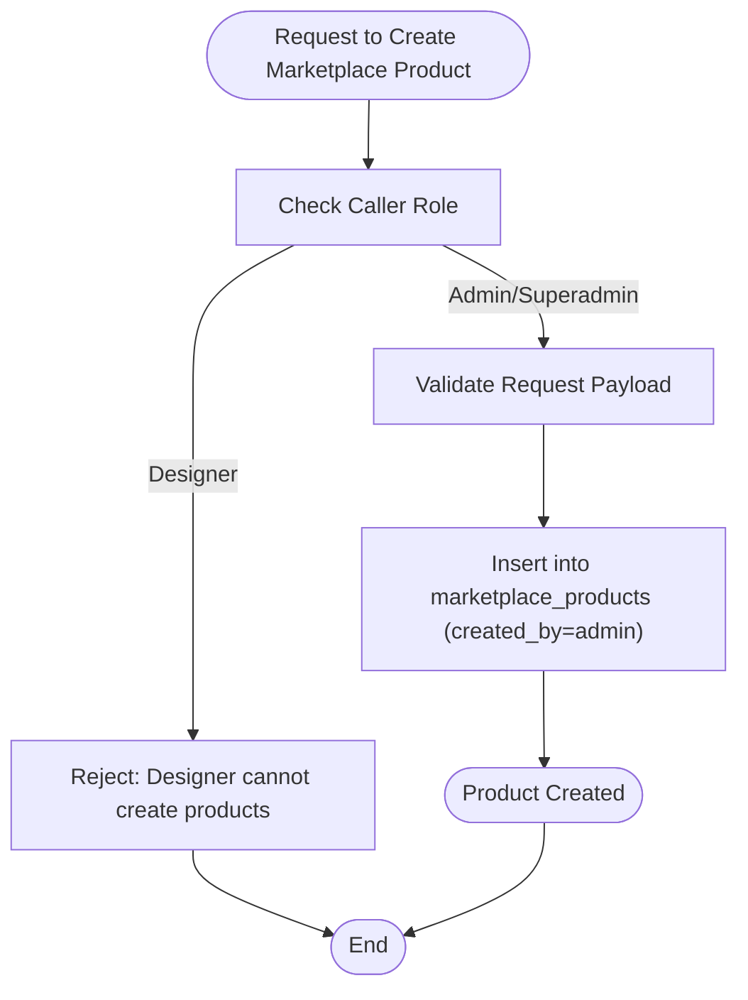
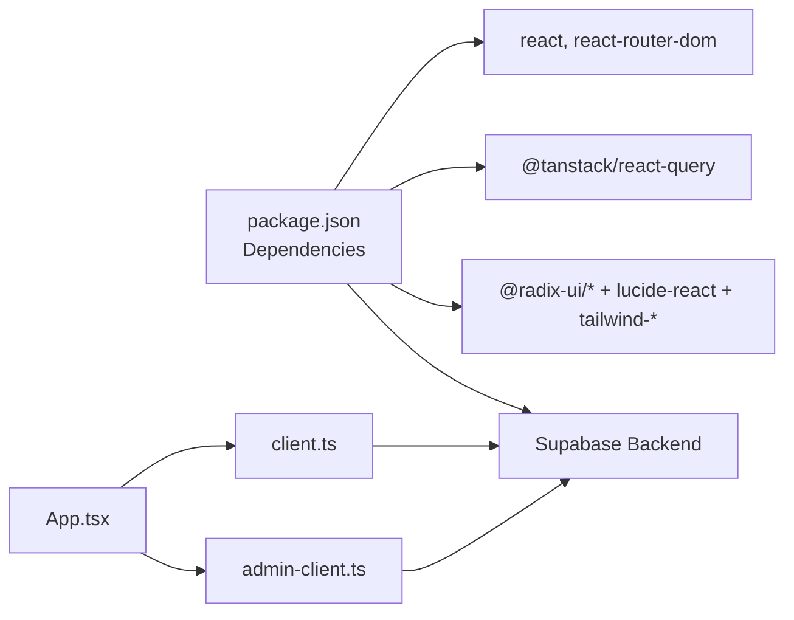

# Project Overview

<cite>
**Referenced Files in This Document**
- [README.md](file://README.md)
- [package.json](file://package.json)
- [PLAN_ADORZIA_CORE_OPERATING_MODEL.md](file://PLAN_ADORZIA_CORE_OPERATING_MODEL.md)
- [src/App.tsx](file://src/App.tsx)
- [src/main.tsx](file://src/main.tsx)
- [src/integrations/supabase/client.ts](file://src/integrations/supabase/client.ts)
- [src/integrations/supabase/admin-client.ts](file://src/integrations/supabase/admin-client.ts)
- [src/integrations/supabase/types.ts](file://src/integrations/supabase/types.ts)
- [src/pages/public/Home.tsx](file://src/pages/public/Home.tsx)
- [src/pages/Dashboard.tsx](file://src/pages/Dashboard.tsx)
- [src/pages/Portfolio.tsx](file://src/pages/Portfolio.tsx)
- [src/pages/Styleboxes.tsx](file://src/pages/Styleboxes.tsx)
- [supabase/functions/marketplace-products/index.ts](file://supabase/functions/marketplace-products/index.ts)
- [supabase/functions/upload-portfolio-project/index.ts](file://supabase/functions/upload-portfolio-project/index.ts)
- [src/hooks/useAuth.tsx](file://src/hooks/useAuth.tsx)
- [src/hooks/useAdminAuth.tsx](file://src/hooks/useAdminAuth.tsx)
</cite>

## Table of Contents
1. [Introduction](#introduction)
2. [Project Structure](#project-structure)
3. [Core Components](#core-components)
4. [Architecture Overview](#architecture-overview)
5. [Detailed Component Analysis](#detailed-component-analysis)
6. [Dependency Analysis](#dependency-analysis)
7. [Performance Considerations](#performance-considerations)
8. [Troubleshooting Guide](#troubleshooting-guide)
9. [Conclusion](#conclusion)
10. [Appendices](#appendices)

## Introduction
Adorzia is a creative design community platform tailored for fashion, textile, and jewelry designers. It unifies learning, creation, collaboration, and commerce into a single ecosystem:
- Learning: Gamified StyleBox challenges that build practical skills and produce portfolio-ready assets.
- Creation: Portfolio management for showcasing and organizing design work.
- Collaboration: Team-based challenges and shared workflows.
- Commerce: Curated marketplace where designer works become sellable products, governed by an admin-controlled commercial pipeline.

The platform enforces a “Creative-Commercial Bifurcation” model: designers are creative partners with full control over creative assets and submissions; Adorzia Admin controls the entire commercial value chain (pricing, inventory, listings, payments, payouts).

## Project Structure
The project is a React application with TypeScript, styled with Tailwind CSS and UI primitives from shadcn/ui. Routing is handled by React Router, with state management powered by TanStack Query. Supabase serves as the backend, providing authentication, database, row-level security (RLS), storage, and serverless functions.

**Diagram sources**
- [src/App.tsx](file://src/App.tsx#L112-L347)
- [src/main.tsx](file://src/main.tsx#L1-L20)
- [src/integrations/supabase/client.ts](file://src/integrations/supabase/client.ts#L1-L17)
- [src/integrations/supabase/admin-client.ts](file://src/integrations/supabase/admin-client.ts#L1-L28)
- [src/hooks/useAuth.tsx](file://src/hooks/useAuth.tsx#L1-L252)
- [src/hooks/useAdminAuth.tsx](file://src/hooks/useAdminAuth.tsx#L1-L216)

**Section sources**
- [README.md](file://README.md#L53-L62)
- [package.json](file://package.json#L13-L66)
- [src/App.tsx](file://src/App.tsx#L112-L347)

## Core Components
- Dual Authentication System
  - Designer (Studio) Auth: [src/hooks/useAuth.tsx](file://src/hooks/useAuth.tsx#L22-L243) manages studio sessions, role resolution, and secure sign-in/sign-out.
  - Admin Auth: [src/hooks/useAdminAuth.tsx](file://src/hooks/useAdminAuth.tsx#L21-L207) isolates admin sessions with a separate client and storage keys.
- Routing and Providers
  - Central routing and nested providers for studio and admin contexts: [src/App.tsx](file://src/App.tsx#L112-L347).
- Supabase Integration
  - Studio client: [src/integrations/supabase/client.ts](file://src/integrations/supabase/client.ts#L1-L17)
  - Admin client: [src/integrations/supabase/admin-client.ts](file://src/integrations/supabase/admin-client.ts#L1-L28)
  - Strongly typed Supabase schema: [src/integrations/supabase/types.ts](file://src/integrations/supabase/types.ts#L1-L800)
- Public Experience
  - Home page highlights the unified journey and marketplace preview: [src/pages/public/Home.tsx](file://src/pages/public/Home.tsx#L106-L505)
- Studio Features
  - Dashboard: [src/pages/Dashboard.tsx](file://src/pages/Dashboard.tsx#L29-L434)
  - Styleboxes Catalog: [src/pages/Styleboxes.tsx](file://src/pages/Styleboxes.tsx#L24-L393)
  - Portfolio Management: [src/pages/Portfolio.tsx](file://src/pages/Portfolio.tsx#L33-L268)
- Marketplace Edge Functions
  - Product listing and detail retrieval: [supabase/functions/marketplace-products/index.ts](file://supabase/functions/marketplace-products/index.ts#L13-L256)
  - Portfolio project upload: [supabase/functions/upload-portfolio-project/index.ts](file://supabase/functions/upload-portfolio-project/index.ts#L21-L300)

**Section sources**
- [src/hooks/useAuth.tsx](file://src/hooks/useAuth.tsx#L22-L243)
- [src/hooks/useAdminAuth.tsx](file://src/hooks/useAdminAuth.tsx#L21-L207)
- [src/App.tsx](file://src/App.tsx#L112-L347)
- [src/integrations/supabase/client.ts](file://src/integrations/supabase/client.ts#L1-L17)
- [src/integrations/supabase/admin-client.ts](file://src/integrations/supabase/admin-client.ts#L1-L28)
- [src/pages/public/Home.tsx](file://src/pages/public/Home.tsx#L106-L505)
- [src/pages/Dashboard.tsx](file://src/pages/Dashboard.tsx#L29-L434)
- [src/pages/Styleboxes.tsx](file://src/pages/Styleboxes.tsx#L24-L393)
- [src/pages/Portfolio.tsx](file://src/pages/Portfolio.tsx#L33-L268)
- [supabase/functions/marketplace-products/index.ts](file://supabase/functions/marketplace-products/index.ts#L13-L256)
- [supabase/functions/upload-portfolio-project/index.ts](file://supabase/functions/upload-portfolio-project/index.ts#L21-L300)

## Architecture Overview
Adorzia’s architecture separates creative and commercial domains:
- Creative Layer (Designer Studio)
  - StyleBoxes: gamified challenges producing portfolio assets.
  - Portfolio: curated collection of projects and submissions.
- Commercial Layer (Admin-Controlled)
  - Publication pipeline: approvals and curation before marketplace readiness.
  - Marketplace: admin-managed product listings, pricing, and inventory.
- Data Isolation
  - Database policies and storage policies prevent designers from directly manipulating marketplace data.
  - Edge functions enforce admin-only access for sensitive operations.

**Diagram sources**
- [src/pages/Dashboard.tsx](file://src/pages/Dashboard.tsx#L29-L434)
- [src/pages/Styleboxes.tsx](file://src/pages/Styleboxes.tsx#L24-L393)
- [src/pages/Portfolio.tsx](file://src/pages/Portfolio.tsx#L33-L268)
- [PLAN_ADORZIA_CORE_OPERATING_MODEL.md](file://PLAN_ADORZIA_CORE_OPERATING_MODEL.md#L32-L107)
- [supabase/functions/marketplace-products/index.ts](file://supabase/functions/marketplace-products/index.ts#L13-L256)
- [supabase/functions/upload-portfolio-project/index.ts](file://supabase/functions/upload-portfolio-project/index.ts#L21-L300)

## Detailed Component Analysis

### Dual Authentication System
Adorzia employs two independent authentication contexts:
- Designer (Studio) Authentication
  - Provides user session, role detection, and secure sign-in/out flows.
  - Integrates with Supabase Auth and resolves user roles from the user_roles table.
- Admin Authentication
  - Uses a dedicated client and storage keys to keep admin sessions separate from studio sessions.
  - Enforces role checks and logs admin actions for auditability.

**Diagram sources**
- [src/hooks/useAuth.tsx](file://src/hooks/useAuth.tsx#L135-L207)
- [src/hooks/useAdminAuth.tsx](file://src/hooks/useAdminAuth.tsx#L142-L190)

**Section sources**
- [src/hooks/useAuth.tsx](file://src/hooks/useAuth.tsx#L22-L243)
- [src/hooks/useAdminAuth.tsx](file://src/hooks/useAdminAuth.tsx#L21-L207)
- [src/integrations/supabase/client.ts](file://src/integrations/supabase/client.ts#L1-L17)
- [src/integrations/supabase/admin-client.ts](file://src/integrations/supabase/admin-client.ts#L1-L28)

### Marketplace Edge Function Flow
The marketplace functions provide controlled access to product listings and related data, ensuring admin-only operations remain protected.

**Diagram sources**
- [supabase/functions/marketplace-products/index.ts](file://supabase/functions/marketplace-products/index.ts#L13-L256)

**Section sources**
- [supabase/functions/marketplace-products/index.ts](file://supabase/functions/marketplace-products/index.ts#L13-L256)

### Portfolio Upload Edge Function Flow
Portfolio uploads are handled securely to ensure assets land in the correct bucket and metadata is recorded.

**Diagram sources**
- [supabase/functions/upload-portfolio-project/index.ts](file://supabase/functions/upload-portfolio-project/index.ts#L21-L300)

**Section sources**
- [supabase/functions/upload-portfolio-project/index.ts](file://supabase/functions/upload-portfolio-project/index.ts#L21-L300)

### Creative-Commercial Bifurcation Enforcement
The operating model document outlines database and application-level safeguards to maintain separation between creative and commercial domains.

**Diagram sources**
- [PLAN_ADORZIA_CORE_OPERATING_MODEL.md](file://PLAN_ADORZIA_CORE_OPERATING_MODEL.md#L35-L55)

**Section sources**
- [PLAN_ADORZIA_CORE_OPERATING_MODEL.md](file://PLAN_ADORZIA_CORE_OPERATING_MODEL.md#L32-L107)

## Dependency Analysis
- Technology Stack
  - Frontend: React, TypeScript, TanStack Query, React Router, shadcn/ui, Tailwind CSS.
  - Backend: Supabase (Auth, Database, Storage, Edge Functions).
- Routing and Providers
  - Centralized routing with nested providers for studio and admin contexts.
- Supabase Clients
  - Two clients: one for studio (designer) and one for admin, each with isolated storage to prevent session crossover.

**Diagram sources**
- [package.json](file://package.json#L13-L66)
- [src/App.tsx](file://src/App.tsx#L112-L347)
- [src/integrations/supabase/client.ts](file://src/integrations/supabase/client.ts#L1-L17)
- [src/integrations/supabase/admin-client.ts](file://src/integrations/supabase/admin-client.ts#L1-L28)

**Section sources**
- [package.json](file://package.json#L13-L66)
- [src/App.tsx](file://src/App.tsx#L112-L347)

## Performance Considerations
- Client-Side Data Fetching
  - TanStack Query is configured globally; leverage caching, background refetching, and selective invalidation to minimize redundant network calls.
- Edge Functions
  - Keep payload sizes small; offload heavy processing to serverless functions and return only necessary fields.
- Storage
  - Use appropriate image compression and CDN-backed public URLs for assets.
- Routing
  - Lazy-load route components to reduce initial bundle size.

## Troubleshooting Guide
- Authentication Issues
  - Designer and Admin sessions are isolated; ensure the correct client is used for each portal.
  - Use the admin client for admin routes and studio client for designer routes.
- Edge Function Errors
  - Verify Authorization headers and service role keys are present.
  - Check function logs for detailed error messages.
- Data Access Problems
  - Confirm RLS policies and storage policies align with the Creative-Commercial Bifurcation model.

**Section sources**
- [src/hooks/useAuth.tsx](file://src/hooks/useAuth.tsx#L135-L207)
- [src/hooks/useAdminAuth.tsx](file://src/hooks/useAdminAuth.tsx#L142-L190)
- [supabase/functions/marketplace-products/index.ts](file://supabase/functions/marketplace-products/index.ts#L247-L254)
- [supabase/functions/upload-portfolio-project/index.ts](file://supabase/functions/upload-portfolio-project/index.ts#L288-L298)

## Conclusion
Adorzia positions itself as a unified ecosystem for creative designers, merging gamified skill-building, portfolio curation, team collaboration, and a professionally managed marketplace. Its dual authentication system and strict data isolation enforce a clear division between creative ownership and commercial control, enabling scalable growth while preserving designer autonomy and brand integrity.

## Appendices

### Key Value Propositions
- StyleBox Challenges: Gamified, production-ready learning that builds portfolios and unlocks rewards.
- Marketplace Functionality: Admin-curated, designer-attributed product listings with professional presentation.
- Portfolio Management: Centralized, searchable, and exportable collection of creative works.
- Team Collaboration: Shared challenges and workflows that amplify creative output.
- Commercial Control: Transparent, fair revenue sharing with full admin oversight of pricing and inventory.

### Technology Stack Overview
- Frontend: React, TypeScript, TanStack Query, React Router, shadcn/ui, Tailwind CSS.
- Backend: Supabase (Auth, Database, Storage, Edge Functions).
- Deployment: Vite-based build with Supabase hosting and edge functions.

**Section sources**
- [README.md](file://README.md#L53-L62)
- [package.json](file://package.json#L13-L66)

### Target Audience Segmentation
- Emerging Designers: Skill-building via StyleBoxes and early portfolio development.
- Established Designers: Publishing curated works and building brand presence.
- Brands and Buyers: Discovery and purchase of designer-made products through the marketplace.

### Core Business Models
- Freemium with Premium StyleBoxes and advanced features.
- Revenue Sharing: Profit split from marketplace sales.
- Subscription Tiers: Access to premium challenges, analytics, and collaboration tools.
- Founding Designers Program: Early-stage collaboration with profit participation.

**Section sources**
- [src/pages/public/Home.tsx](file://src/pages/public/Home.tsx#L106-L505)
- [src/pages/Dashboard.tsx](file://src/pages/Dashboard.tsx#L29-L434)
- [PLAN_ADORZIA_CORE_OPERATING_MODEL.md](file://PLAN_ADORZIA_CORE_OPERATING_MODEL.md#L30-L356)