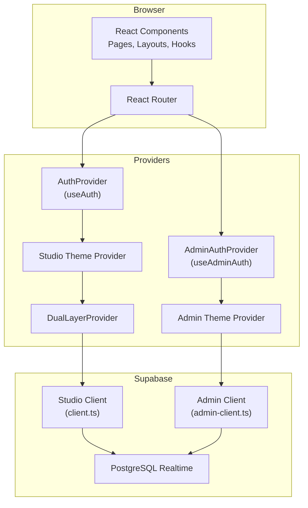
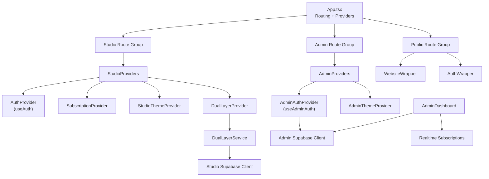
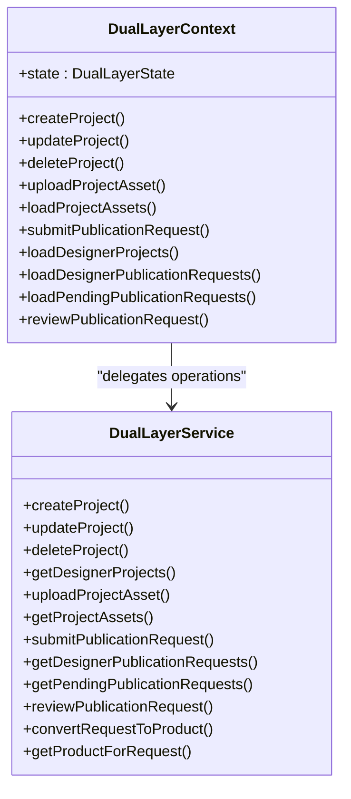
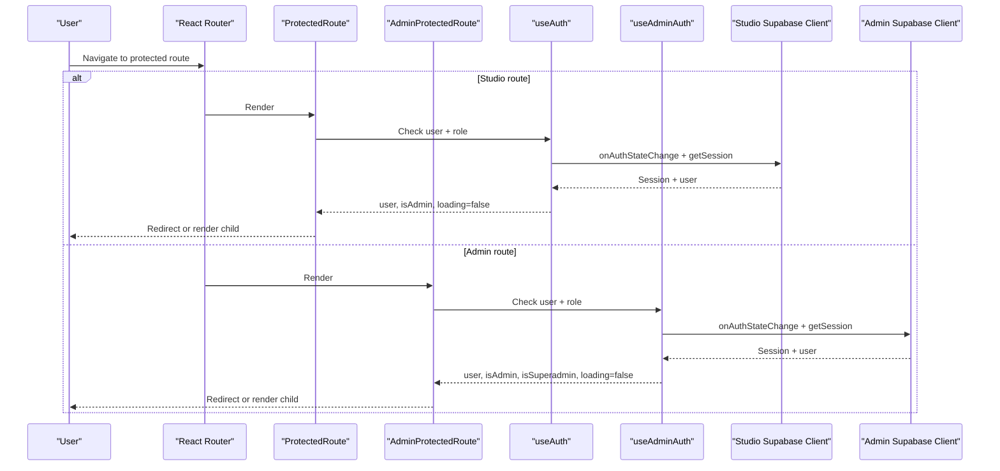
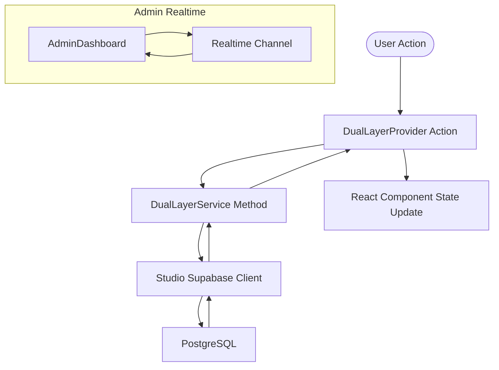
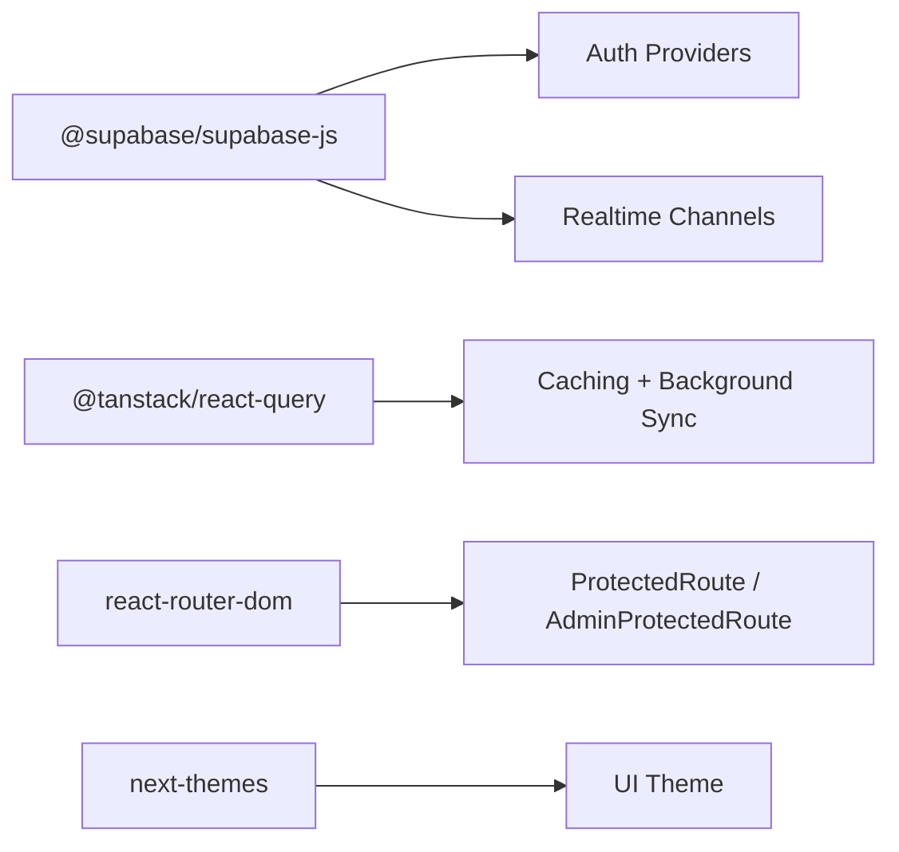

# Architecture Overview

<cite>
**Referenced Files in This Document**
- [App.tsx](file://src/App.tsx)
- [main.tsx](file://src/main.tsx)
- [DualLayerContext.tsx](file://src/contexts/DualLayerContext.tsx)
- [client.ts](file://src/integrations/supabase/client.ts)
- [admin-client.ts](file://src/integrations/supabase/admin-client.ts)
- [useAuth.tsx](file://src/hooks/useAuth.tsx)
- [useAdminAuth.tsx](file://src/hooks/useAdminAuth.tsx)
- [ProtectedRoute.tsx](file://src/components/auth/ProtectedRoute.tsx)
- [AdminProtectedRoute.tsx](file://src/components/auth/AdminProtectedRoute.tsx)
- [dual-layer-service.ts](file://src/lib/dual-layer-service.ts)
- [dual-layer-types.ts](file://src/lib/dual-layer-types.ts)
- [Dashboard.tsx](file://src/pages/Dashboard.tsx)
- [AdminDashboard.tsx](file://src/pages/admin/AdminDashboard.tsx)
- [package.json](file://package.json)
</cite>

## Table of Contents
1. [Introduction](#introduction)
2. [Project Structure](#project-structure)
3. [Core Components](#core-components)
4. [Architecture Overview](#architecture-overview)
5. [Detailed Component Analysis](#detailed-component-analysis)
6. [Dependency Analysis](#dependency-analysis)
7. [Performance Considerations](#performance-considerations)
8. [Troubleshooting Guide](#troubleshooting-guide)
9. [Conclusion](#conclusion)

## Introduction
This document describes the Adorzia platform’s dual-layer system design and integration patterns. The platform separates two primary operating contexts:
- Designer Workspace: A protected, role-aware environment for designers to manage stylebox projects, portfolios, and analytics.
- Admin Panel: A separate, isolated administrative portal for operations like reviews, queues, payouts, and system analytics.

The frontend is a React application with TypeScript, routing via React Router, and state management powered by React Context providers and TanStack React Query. The backend integrates with Supabase for authentication, authorization, and real-time data synchronization.

## Project Structure
High-level structure:
- Frontend: React + TypeScript, organized by feature areas under src/components, src/hooks, src/pages, src/contexts, src/lib, and src/integrations/supabase.
- Routing and Providers: Centralized in App.tsx with route guards and layered providers for authentication and theme.
- Supabase Clients: One client for the Studio (designer workspace) and a separate client for the Admin portal, each with isolated storage to prevent session crossover.
- Dual Layer Context: A dedicated context orchestrating designer workspace operations (projects, assets, publication requests) with a service layer encapsulating database interactions.

**Diagram sources**
- [App.tsx](file://src/App.tsx#L157-L431)
- [client.ts](file://src/integrations/supabase/client.ts#L1-L17)
- [admin-client.ts](file://src/integrations/supabase/admin-client.ts#L1-L28)

**Section sources**
- [App.tsx](file://src/App.tsx#L157-L431)
- [main.tsx](file://src/main.tsx#L1-L46)

## Core Components
- Dual Layer Operating Model: A dedicated context and service layer enabling designers to manage projects, assets, and publication requests while maintaining clear separation from admin operations.
- Authentication Architecture: Two independent authentication systems:
  - Studio (designer/workspace) authentication via a Supabase client with shared storage for tokens and session persistence.
  - Admin portal authentication via a separate Supabase client with isolated storage keys to prevent cross-session contamination.
- Route Guards: ProtectedRoute and AdminProtectedRoute enforce role-based access and redirect unauthenticated or unauthorized users appropriately.
- Real-time Updates: AdminDashboard subscribes to PostgreSQL Realtime channels to receive live notifications for designer registrations and stylebox submissions.

**Section sources**
- [DualLayerContext.tsx](file://src/contexts/DualLayerContext.tsx#L1-L303)
- [dual-layer-service.ts](file://src/lib/dual-layer-service.ts#L1-L340)
- [useAuth.tsx](file://src/hooks/useAuth.tsx#L1-L323)
- [useAdminAuth.tsx](file://src/hooks/useAdminAuth.tsx#L1-L249)
- [ProtectedRoute.tsx](file://src/components/auth/ProtectedRoute.tsx#L1-L42)
- [AdminProtectedRoute.tsx](file://src/components/auth/AdminProtectedRoute.tsx#L1-L52)
- [AdminDashboard.tsx](file://src/pages/admin/AdminDashboard.tsx#L307-L353)

## Architecture Overview
The system enforces a strict separation between the designer workspace and the admin portal:
- Routing: App.tsx defines three major route groups: public website, studio (designer workspace), and admin. Each group mounts distinct provider stacks.
- Providers:
  - StudioProviders wraps AuthProvider, SubscriptionProvider, StudioThemeProvider, and DualLayerProvider.
  - AdminProviders wraps AdminAuthProvider and AdminThemeProvider.
  - WebsiteWrapper and AuthWrapper provide theme and auth for public-facing pages.
- Authentication:
  - Studio client persists sessions in localStorage with a standard key.
  - Admin client uses a prefixed storage key to keep admin sessions independent.
- Data Access:
  - DualLayerProvider delegates database operations to DualLayerService, which uses the Studio Supabase client.
  - AdminDashboard uses the Admin Supabase client and subscribes to Realtime channels for live updates.

**Diagram sources**
- [App.tsx](file://src/App.tsx#L110-L154)
- [useAuth.tsx](file://src/hooks/useAuth.tsx#L34-L314)
- [useAdminAuth.tsx](file://src/hooks/useAdminAuth.tsx#L21-L240)
- [dual-layer-service.ts](file://src/lib/dual-layer-service.ts#L1-L340)
- [client.ts](file://src/integrations/supabase/client.ts#L1-L17)
- [admin-client.ts](file://src/integrations/supabase/admin-client.ts#L1-L28)
- [AdminDashboard.tsx](file://src/pages/admin/AdminDashboard.tsx#L307-L353)

## Detailed Component Analysis

### Dual Layer Operating Model
The dual-layer system centers around a context and service that encapsulate designer workspace operations:
- Context state tracks projects, assets per project, and publication requests with loading and error flags.
- Actions include CRUD for projects and assets, and lifecycle operations for publication requests.
- The service layer performs ownership checks and data transformations before interacting with Supabase.

**Diagram sources**
- [DualLayerContext.tsx](file://src/contexts/DualLayerContext.tsx#L135-L295)
- [dual-layer-service.ts](file://src/lib/dual-layer-service.ts#L4-L340)

**Section sources**
- [DualLayerContext.tsx](file://src/contexts/DualLayerContext.tsx#L1-L303)
- [dual-layer-service.ts](file://src/lib/dual-layer-service.ts#L1-L340)
- [dual-layer-types.ts](file://src/lib/dual-layer-types.ts#L1-L44)

### Authentication Architecture and Route Guards
The platform implements a dual-layer authentication system:
- Studio Auth: Uses the Studio Supabase client with shared localStorage keys for tokens and session persistence. Roles are derived from a user_roles table with priority ordering.
- Admin Auth: Uses the Admin Supabase client with isolated storage keys. On invalid access attempts, the system forces a local sign-out to prevent session hijacking.
- Route Guards:
  - ProtectedRoute enforces authentication and optional admin-only access for studio routes.
  - AdminProtectedRoute enforces admin or superadmin access for admin routes and logs detailed state for debugging.

**Diagram sources**
- [ProtectedRoute.tsx](file://src/components/auth/ProtectedRoute.tsx#L11-L41)
- [AdminProtectedRoute.tsx](file://src/components/auth/AdminProtectedRoute.tsx#L11-L51)
- [useAuth.tsx](file://src/hooks/useAuth.tsx#L109-L167)
- [useAdminAuth.tsx](file://src/hooks/useAdminAuth.tsx#L106-L167)
- [client.ts](file://src/integrations/supabase/client.ts#L11-L17)
- [admin-client.ts](file://src/integrations/supabase/admin-client.ts#L16-L27)

**Section sources**
- [useAuth.tsx](file://src/hooks/useAuth.tsx#L1-L323)
- [useAdminAuth.tsx](file://src/hooks/useAdminAuth.tsx#L1-L249)
- [ProtectedRoute.tsx](file://src/components/auth/ProtectedRoute.tsx#L1-L42)
- [AdminProtectedRoute.tsx](file://src/components/auth/AdminProtectedRoute.tsx#L1-L52)
- [client.ts](file://src/integrations/supabase/client.ts#L1-L17)
- [admin-client.ts](file://src/integrations/supabase/admin-client.ts#L1-L28)

### Data Flow and Real-time Updates
- Designer Workspace:
  - Components consume DualLayerProvider actions to create/update projects, upload assets, and submit publication requests.
  - The service layer validates ownership and performs inserts/updates via the Studio Supabase client.
- Admin Portal:
  - AdminDashboard fetches metrics and lists pending items.
  - It subscribes to Postgres Realtime channels for new designer registrations and stylebox submissions, triggering toast notifications and re-fetching stats.

**Diagram sources**
- [dual-layer-service.ts](file://src/lib/dual-layer-service.ts#L1-L340)
- [client.ts](file://src/integrations/supabase/client.ts#L1-L17)
- [AdminDashboard.tsx](file://src/pages/admin/AdminDashboard.tsx#L307-L353)

**Section sources**
- [Dashboard.tsx](file://src/pages/Dashboard.tsx#L1-L440)
- [AdminDashboard.tsx](file://src/pages/admin/AdminDashboard.tsx#L1-L608)
- [dual-layer-service.ts](file://src/lib/dual-layer-service.ts#L1-L340)

## Dependency Analysis
External dependencies relevant to architecture:
- @supabase/supabase-js: Authentication, session management, and Realtime subscriptions.
- @tanstack/react-query: Centralized caching and background synchronization for data fetching.
- react-router-dom: Routing and protected route guards.
- next-themes: Theme switching with persistence.

**Diagram sources**
- [package.json](file://package.json#L15-L69)

**Section sources**
- [package.json](file://package.json#L15-L69)

## Performance Considerations
- Provider Layering: Mounting multiple providers per route group avoids unnecessary re-renders by scoping state to relevant routes.
- React Query: Centralized caching reduces redundant network calls and improves perceived performance.
- Realtime Subscriptions: AdminDashboard subscribes selectively to relevant channels to minimize overhead.
- Token Refresh Handling: Auth providers debounce role checks and ignore benign refresh events to reduce UI flicker.

[No sources needed since this section provides general guidance]

## Troubleshooting Guide
- Authentication Issues:
  - Studio vs Admin sessions: If signing in to one affects the other, verify storage keys and client initialization. Studio uses standard keys; Admin uses a prefixed key.
  - Role Resolution: If a user appears authenticated but lacks access, confirm the user_roles table and the role priority logic.
- Route Guard Behavior:
  - ProtectedRoute redirects unauthenticated users to the appropriate login page. AdminProtectedRoute logs state and redirects to unauthorized when insufficient privileges are detected.
- Real-time Updates:
  - AdminDashboard relies on Realtime channels. If notifications do not appear, verify channel subscriptions and network connectivity.

**Section sources**
- [useAuth.tsx](file://src/hooks/useAuth.tsx#L91-L167)
- [useAdminAuth.tsx](file://src/hooks/useAdminAuth.tsx#L89-L167)
- [ProtectedRoute.tsx](file://src/components/auth/ProtectedRoute.tsx#L18-L41)
- [AdminProtectedRoute.tsx](file://src/components/auth/AdminProtectedRoute.tsx#L18-L51)
- [AdminDashboard.tsx](file://src/pages/admin/AdminDashboard.tsx#L307-L353)

## Conclusion
Adorzia’s dual-layer architecture cleanly separates the designer workspace from the admin portal through independent routing, providers, authentication clients, and data access layers. The use of Supabase authentication and Realtime, combined with React Context and TanStack Query, yields a scalable, secure, and maintainable system. The documented patterns support future enhancements such as additional admin roles, expanded real-time coverage, and incremental migration of legacy features.