# Getting Started

<cite>
**Referenced Files in This Document**
- [README.md](file://README.md)
- [package.json](file://package.json)
- [vite.config.ts](file://vite.config.ts)
- [tsconfig.json](file://tsconfig.json)
- [tsconfig.app.json](file://tsconfig.app.json)
- [tsconfig.node.json](file://tsconfig.node.json)
- [tailwind.config.ts](file://tailwind.config.ts)
- [eslint.config.js](file://eslint.config.js)
- [components.json](file://components.json)
- [src/main.tsx](file://src/main.tsx)
- [src/App.tsx](file://src/App.tsx)
- [index.html](file://index.html)
- [vercel.json](file://vercel.json)
- [src/integrations/supabase/client.ts](file://src/integrations/supabase/client.ts)
</cite>

## Table of Contents
1. [Introduction](#introduction)
2. [Project Structure](#project-structure)
3. [Core Components](#core-components)
4. [Architecture Overview](#architecture-overview)
5. [Detailed Component Analysis](#detailed-component-analysis)
6. [Dependency Analysis](#dependency-analysis)
7. [Performance Considerations](#performance-considerations)
8. [Troubleshooting Guide](#troubleshooting-guide)
9. [Conclusion](#conclusion)
10. [Appendices](#appendices)

## Introduction
Welcome to the Adorzia project. This guide helps you set up a local development environment, understand the build and TypeScript configuration, and run the application locally. It also explains how the project integrates with the Lovable platform for deployment and customization.

You will:
- Prepare your environment with Node.js and npm
- Clone the repository and install dependencies
- Run the development server with hot reloading
- Explore the project’s structure, build configuration with Vite, and TypeScript setup
- Learn how to deploy via Lovable and connect a custom domain

## Project Structure
At a high level, the project is a React application written in TypeScript, bundled with Vite, styled with Tailwind CSS and shadcn/ui components. The frontend bootstraps from index.html into src/main.tsx, which renders src/App.tsx. Routing and providers are configured inside App.tsx, and the build toolchain is defined in vite.config.ts. TypeScript configuration is split across tsconfig.json and related app/node configs. Tailwind is configured centrally in tailwind.config.ts, and ESLint is configured in eslint.config.js.

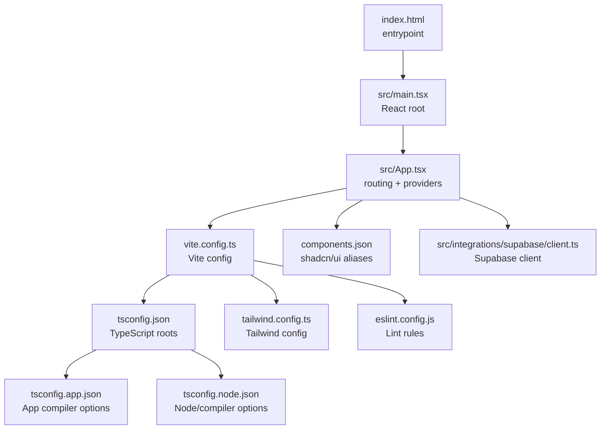

**Diagram sources**
- [index.html](file://index.html#L1-L127)
- [src/main.tsx](file://src/main.tsx#L1-L46)
- [src/App.tsx](file://src/App.tsx#L1-L422)
- [vite.config.ts](file://vite.config.ts#L1-L40)
- [tsconfig.json](file://tsconfig.json#L1-L17)
- [tsconfig.app.json](file://tsconfig.app.json#L1-L31)
- [tsconfig.node.json](file://tsconfig.node.json#L1-L23)
- [tailwind.config.ts](file://tailwind.config.ts#L1-L476)
- [eslint.config.js](file://eslint.config.js#L1-L27)
- [components.json](file://components.json#L1-L21)
- [src/integrations/supabase/client.ts](file://src/integrations/supabase/client.ts#L1-L17)

**Section sources**
- [index.html](file://index.html#L1-L127)
- [src/main.tsx](file://src/main.tsx#L1-L46)
- [src/App.tsx](file://src/App.tsx#L1-L422)
- [vite.config.ts](file://vite.config.ts#L1-L40)
- [tsconfig.json](file://tsconfig.json#L1-L17)
- [tsconfig.app.json](file://tsconfig.app.json#L1-L31)
- [tsconfig.node.json](file://tsconfig.node.json#L1-L23)
- [tailwind.config.ts](file://tailwind.config.ts#L1-L476)
- [eslint.config.js](file://eslint.config.js#L1-L27)
- [components.json](file://components.json#L1-L21)
- [src/integrations/supabase/client.ts](file://src/integrations/supabase/client.ts#L1-L17)

## Core Components
- Development server and scripts: npm scripts define dev, dev:studio, dev:admin, build, build:dev, lint, and preview commands. Vite runs on port 8080 by default and supports component tagging in development.
- Build configuration: Vite is configured with React plugin, path aliases (@), Rollup manual chunks for vendor separation, esbuild minification, and asset inlining thresholds.
- TypeScript configuration: Root tsconfig.json references app and node configs; app config targets ES2020, uses bundler module resolution, JSX transform, and path aliases; node config targets ES2022 for Vite config.
- Styling: Tailwind CSS is configured with content globs, dark mode strategy, custom colors, shadows, keyframes, animations, and a plugin for CSS animations.
- Linting: ESLint is configured with TypeScript and React hooks recommended rules, plus react-refresh and react-hooks rules.
- UI framework: shadcn/ui is configured with Tailwind, CSS variables, and aliases for components, utils, ui, lib, and hooks.

**Section sources**
- [package.json](file://package.json#L1-L92)
- [vite.config.ts](file://vite.config.ts#L1-L40)
- [tsconfig.json](file://tsconfig.json#L1-L17)
- [tsconfig.app.json](file://tsconfig.app.json#L1-L31)
- [tsconfig.node.json](file://tsconfig.node.json#L1-L23)
- [tailwind.config.ts](file://tailwind.config.ts#L1-L476)
- [eslint.config.js](file://eslint.config.js#L1-L27)
- [components.json](file://components.json#L1-L21)

## Architecture Overview
The runtime architecture is a single-page React application bootstrapped from index.html. The React root mounts App.tsx, which sets up routing, providers, and UI libraries. Vite handles development server, HMR, and bundling. TypeScript compiles TS/TSX to JS. Tailwind generates styles. Supabase client is wired via environment variables.

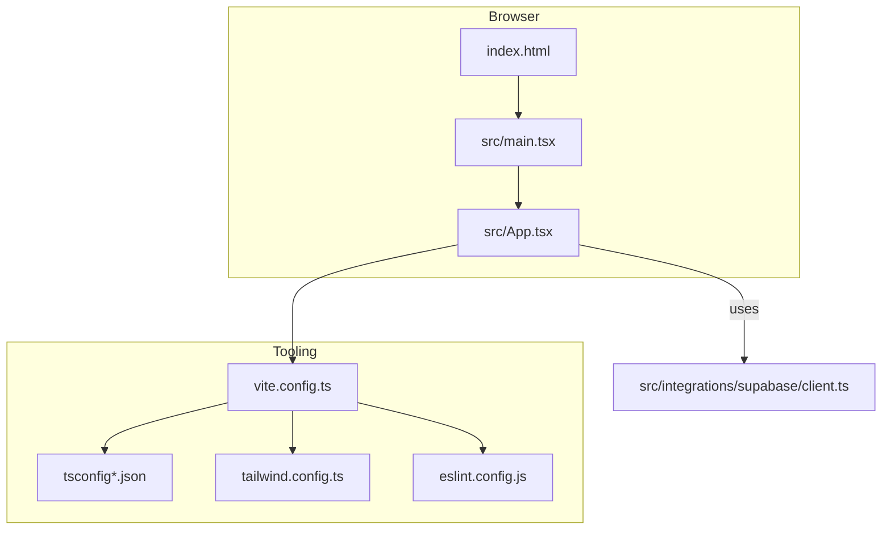

**Diagram sources**
- [index.html](file://index.html#L1-L127)
- [src/main.tsx](file://src/main.tsx#L1-L46)
- [src/App.tsx](file://src/App.tsx#L1-L422)
- [vite.config.ts](file://vite.config.ts#L1-L40)
- [tsconfig.json](file://tsconfig.json#L1-L17)
- [tailwind.config.ts](file://tailwind.config.ts#L1-L476)
- [eslint.config.js](file://eslint.config.js#L1-L27)
- [src/integrations/supabase/client.ts](file://src/integrations/supabase/client.ts#L1-L17)

## Detailed Component Analysis

### Environment Setup and Local Development
Follow these steps to set up and run the project locally:
1. Install Node.js and npm. The project requires Node.js and npm; using nvm is recommended.
2. Clone the repository using the project’s Git URL.
3. Navigate into the project directory.
4. Install dependencies with npm install.
5. Start the development server with npm run dev. The server listens on port 8080 by default.

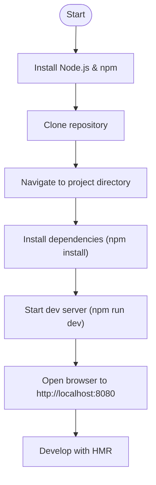

**Section sources**
- [README.md](file://README.md#L21-L37)
- [package.json](file://package.json#L6-L14)

### Build Configuration with Vite
- Server: Host "::", port 8080, strictPort enabled to prevent auto port switching.
- Plugins: React plugin via @vitejs/plugin-react-swc; componentTagger is enabled in development.
- Aliases: "@" resolves to "./src".
- Build: Rollup manualChunks for react-vendor, ui-vendor, data-vendor; esbuild minify; target ES2020; CSS code splitting; chunkSizeWarningLimit 600 KB; assetsInlineLimit 4096 bytes.
- Additional: Lovable tagger plugin integrated conditionally.

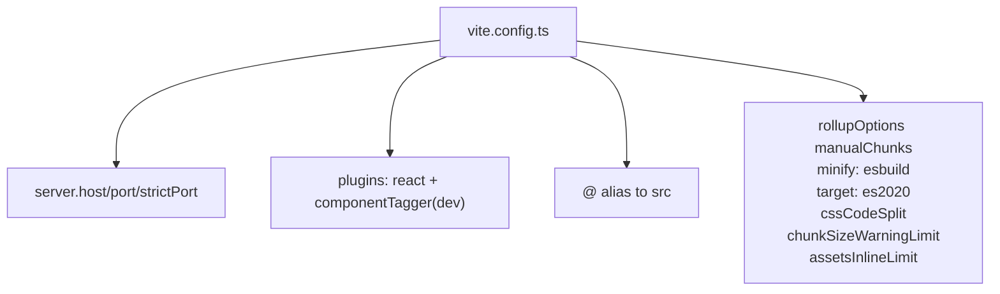

**Diagram sources**
- [vite.config.ts](file://vite.config.ts#L1-L40)

**Section sources**
- [vite.config.ts](file://vite.config.ts#L1-L40)

### TypeScript Setup
- Root tsconfig.json references app and node configs and defines baseUrl and "@/*" path mapping.
- tsconfig.app.json:
  - Targets ES2020
  - Uses bundler module resolution and module detection
  - Enables JSX transform and path mapping
  - Disables strictness for local development
- tsconfig.node.json:
  - Targets ES2022
  - Bundler mode for Vite config
  - Strict defaults for Node-side config

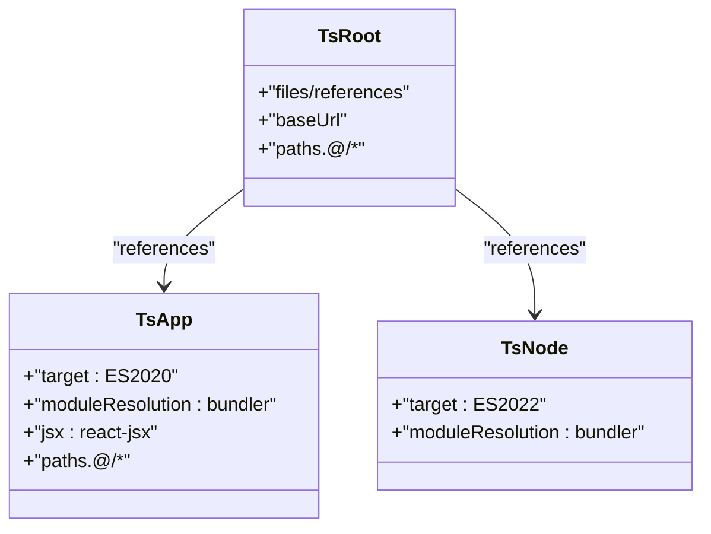

**Diagram sources**
- [tsconfig.json](file://tsconfig.json#L1-L17)
- [tsconfig.app.json](file://tsconfig.app.json#L1-L31)
- [tsconfig.node.json](file://tsconfig.node.json#L1-L23)

**Section sources**
- [tsconfig.json](file://tsconfig.json#L1-L17)
- [tsconfig.app.json](file://tsconfig.app.json#L1-L31)
- [tsconfig.node.json](file://tsconfig.node.json#L1-L23)

### Styling with Tailwind CSS
- Content globs include pages, components, app, and src directories.
- Dark mode strategy uses class.
- Extensive color palette, shadows, borderRadius, keyframes, and animations are defined.
- Plugin for CSS animations is enabled.

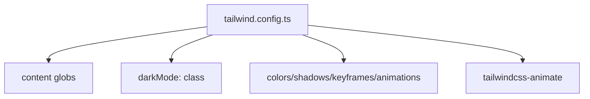

**Diagram sources**
- [tailwind.config.ts](file://tailwind.config.ts#L1-L476)

**Section sources**
- [tailwind.config.ts](file://tailwind.config.ts#L1-L476)

### Linting with ESLint
- Recommended base rules extended with TypeScript and React hooks.
- Enforces react-hooks and react-refresh rules.
- Disables unused vars lint for convenience.

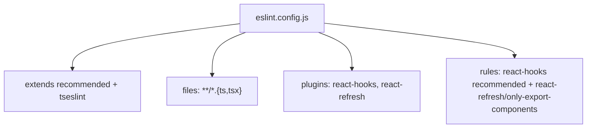

**Diagram sources**
- [eslint.config.js](file://eslint.config.js#L1-L27)

**Section sources**
- [eslint.config.js](file://eslint.config.js#L1-L27)

### UI Framework: shadcn/ui
- Configuration includes style, RSC flag, TSX, Tailwind config/css/baseColor/cssVariables, and aliases for components, utils, ui, lib, hooks.
- Enables TSX usage and proper aliasing for imports.

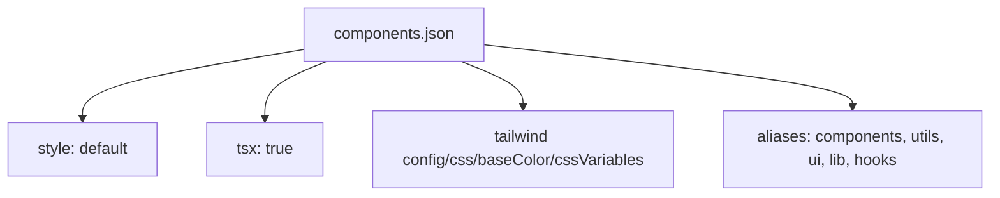

**Diagram sources**
- [components.json](file://components.json#L1-L21)

**Section sources**
- [components.json](file://components.json#L1-L21)

### Application Entry and Routing
- index.html defines the root div and loads /src/main.tsx.
- src/main.tsx creates the React root and installs global error handlers; it renders App.
- src/App.tsx:
  - Sets up React Query, TooltipProvider, ThemeProvider, Auth/Admin/Sub providers
  - Defines nested routing for public, auth/studio, and admin sections
  - Wraps providers per route group and includes a 404 catch-all

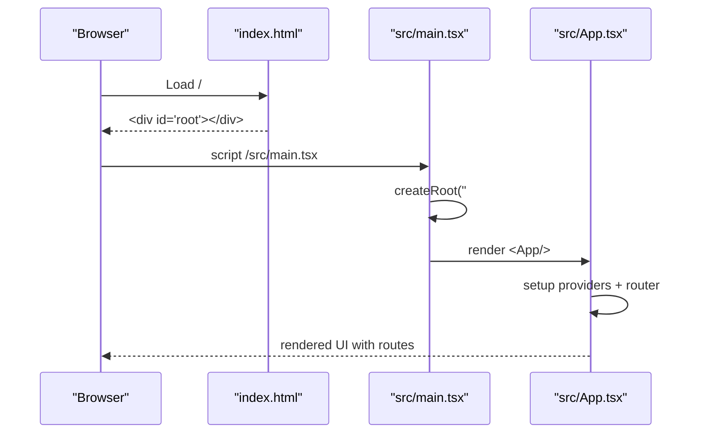

**Diagram sources**
- [index.html](file://index.html#L1-L127)
- [src/main.tsx](file://src/main.tsx#L1-L46)
- [src/App.tsx](file://src/App.tsx#L1-L422)

**Section sources**
- [index.html](file://index.html#L1-L127)
- [src/main.tsx](file://src/main.tsx#L1-L46)
- [src/App.tsx](file://src/App.tsx#L1-L422)

### Supabase Integration
- Supabase client is created using Vite environment variables for URL and publishable key.
- Auth persistence is configured to use localStorage and auto-refresh tokens.

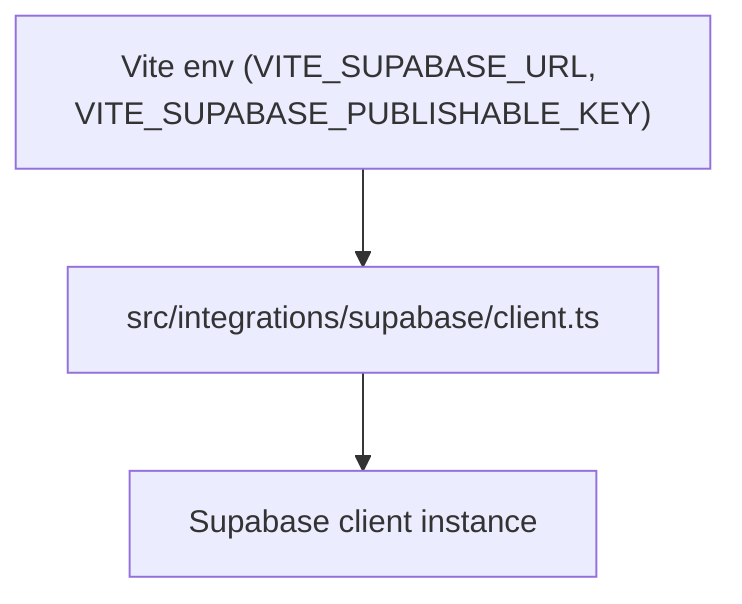

**Diagram sources**
- [src/integrations/supabase/client.ts](file://src/integrations/supabase/client.ts#L1-L17)

**Section sources**
- [src/integrations/supabase/client.ts](file://src/integrations/supabase/client.ts#L1-L17)

### Deployment Options via Lovable
- You can deploy directly from Lovable with a single click.
- Custom domains can be connected via Project > Settings > Domains.

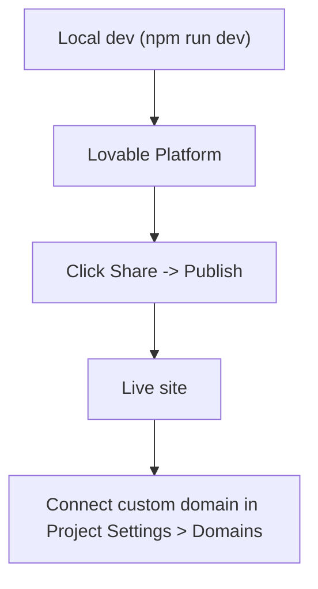

**Section sources**
- [README.md](file://README.md#L63-L73)

## Dependency Analysis
- Runtime dependencies include React, React Router DOM, TanStack React Query, Supabase JS, Radix UI primitives, Framer Motion, Tailwind-based UI packages, and others.
- Dev dependencies include Vite, TypeScript, ESLint, PostCSS, Tailwind CSS, SWC React plugin, and the Lovable tagger.

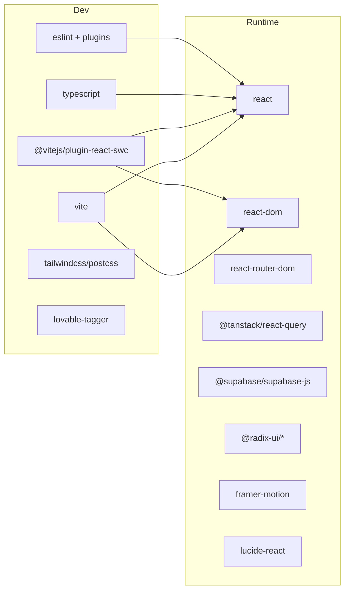

**Diagram sources**
- [package.json](file://package.json#L15-L90)

**Section sources**
- [package.json](file://package.json#L1-L92)

## Performance Considerations
- Vite build separates vendor bundles for React, UI, and data layers to improve caching and load performance.
- esbuild minification and CSS code splitting reduce bundle sizes.
- Asset inlining threshold is set to balance network requests and payload size.
- Strict port and host settings ensure predictable local development networking.

[No sources needed since this section provides general guidance]

## Troubleshooting Guide
Common setup issues and resolutions:
- Port conflicts on 8080
  - Change the port in the Vite configuration or run multiple instances on different ports.
  - Verify the server host and port settings.
- Missing environment variables for Supabase
  - Ensure VITE_SUPABASE_URL and VITE_SUPABASE_PUBLISHABLE_KEY are present in your environment.
- Node.js version compatibility
  - Use the LTS version of Node.js recommended by the project’s setup instructions.
- Package installation failures
  - Clear the npm cache and retry installation.
  - Ensure you are using a supported Node.js/npm version.
- Lint errors
  - Run the linter and fix reported issues; the project disables unused vars linting for convenience.

**Section sources**
- [vite.config.ts](file://vite.config.ts#L8-L12)
- [src/integrations/supabase/client.ts](file://src/integrations/supabase/client.ts#L5-L6)
- [README.md](file://README.md#L21-L21)
- [package.json](file://package.json#L12-L12)
- [eslint.config.js](file://eslint.config.js#L20-L25)

## Conclusion
You now have the essentials to set up the Adorzia project locally, understand the build and TypeScript configuration, and run the development server. The project leverages Vite, React, TypeScript, Tailwind CSS, and shadcn/ui, with Supabase for authentication and backend needs. Deployments are streamlined via Lovable, and custom domains are supported through the platform.

[No sources needed since this section summarizes without analyzing specific files]

## Appendices

### Quick Commands Reference
- Clone repository and enter directory
- Install dependencies
- Start development server
- Preview production build
- Run linter

**Section sources**
- [README.md](file://README.md#L23-L37)
- [package.json](file://package.json#L6-L14)

### Vercel Rewrites and Security Headers
- The project includes a Vercel configuration with rewrites and security headers for general environments.
- Assets under /assets receive long-term caching headers.

**Section sources**
- [vercel.json](file://vercel.json#L1-L24)