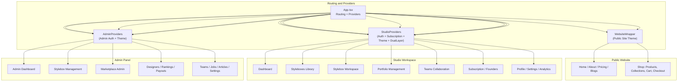
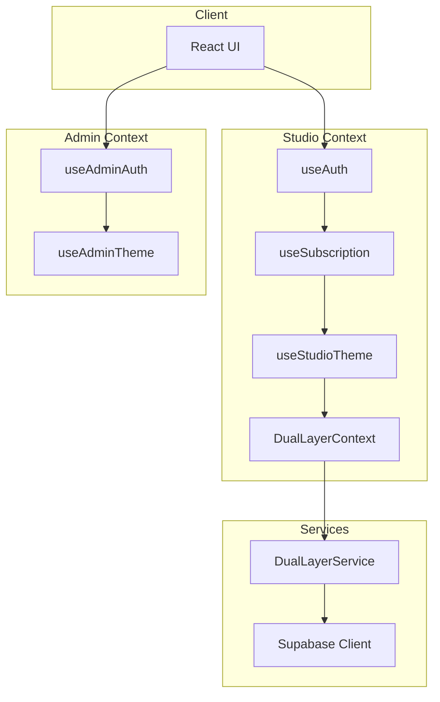
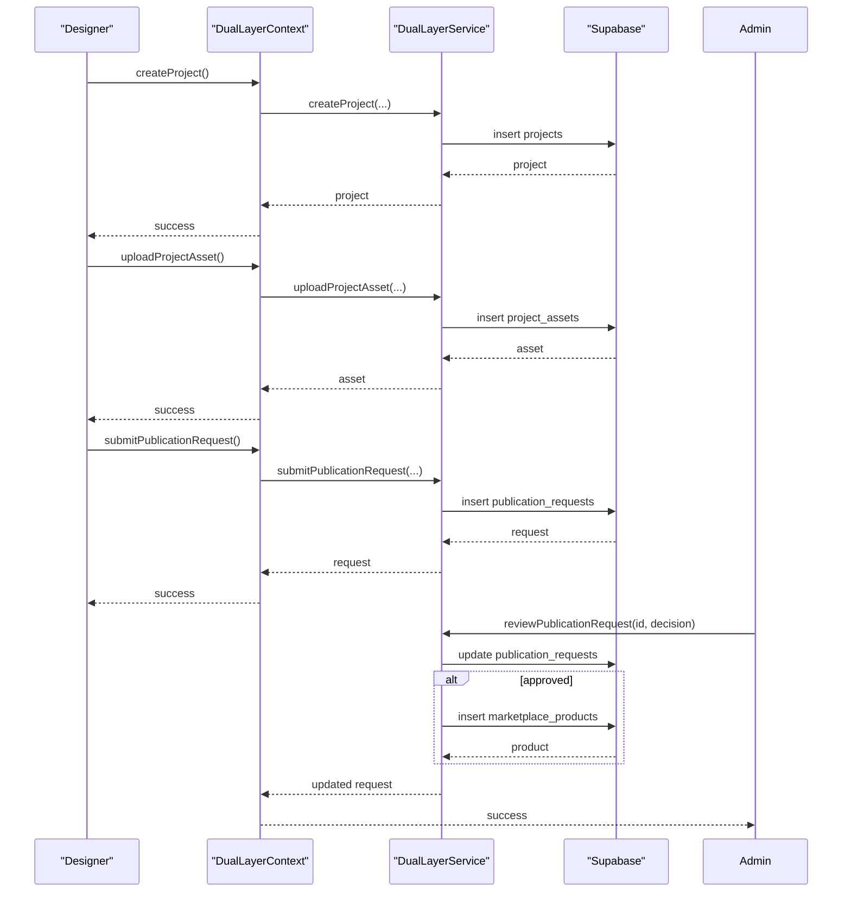
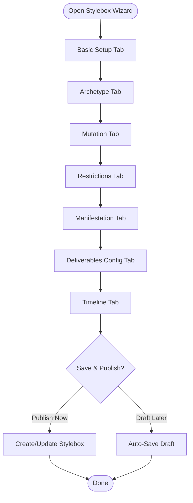
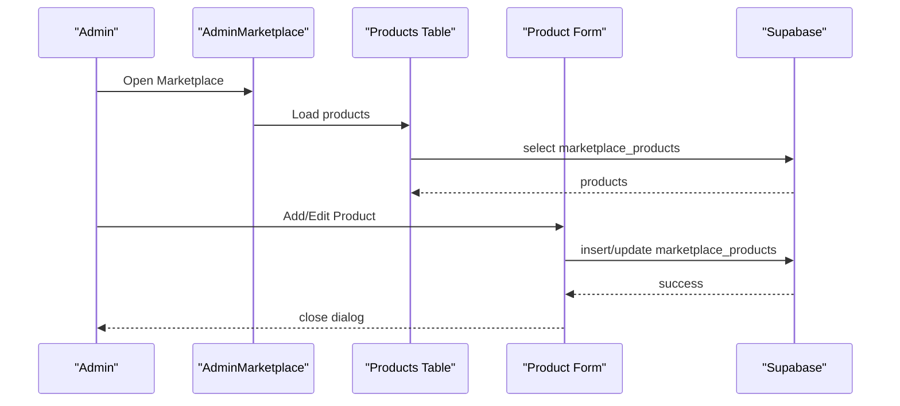
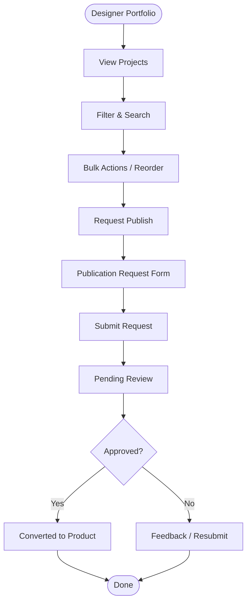
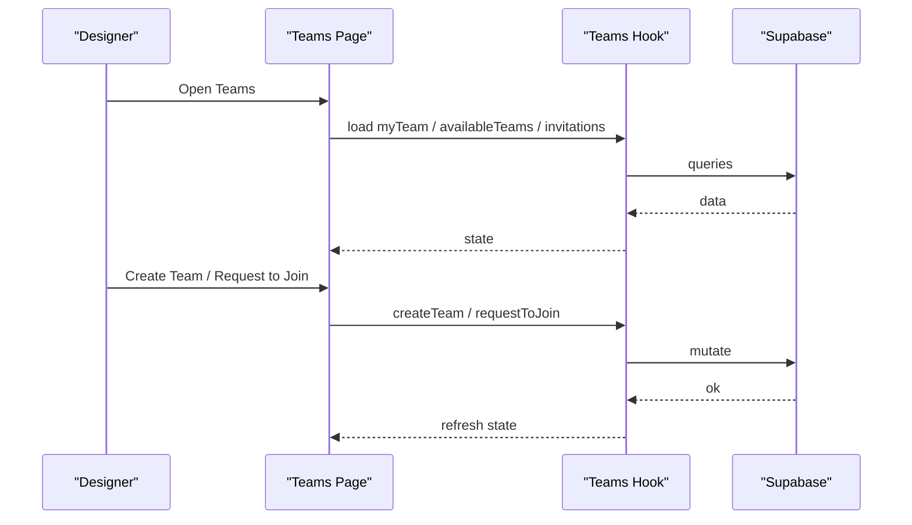
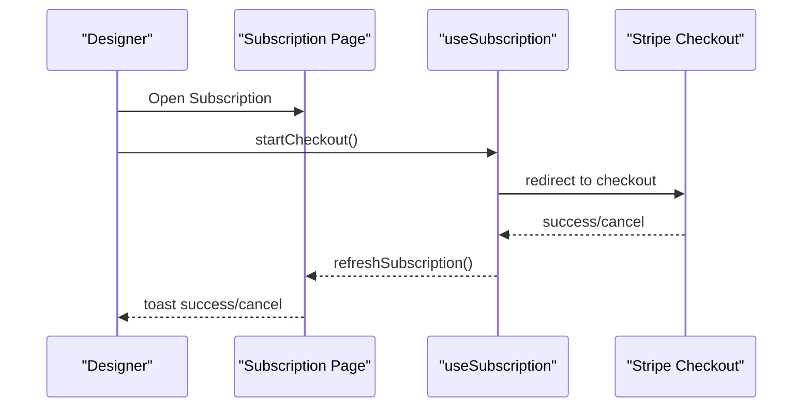
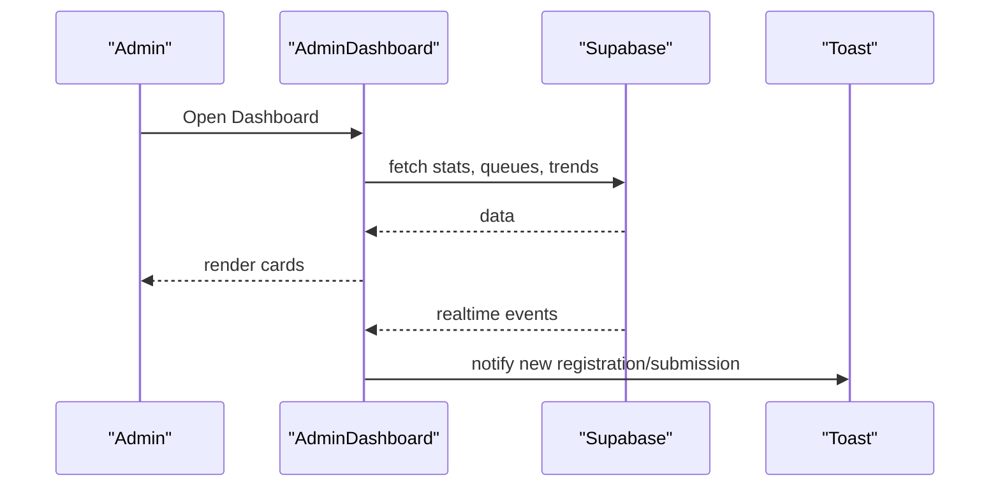
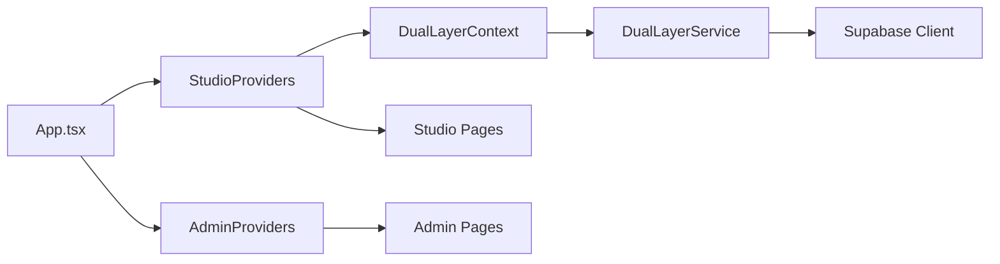

# Platform Features

<cite>
**Referenced Files in This Document**
- [README.md](file://README.md)
- [App.tsx](file://src/App.tsx)
- [DualLayerContext.tsx](file://src/contexts/DualLayerContext.tsx)
- [dual-layer-service.ts](file://src/lib/dual-layer-service.ts)
- [dual-layer-types.ts](file://src/lib/dual-layer-types.ts)
- [AdminMarketplace.tsx](file://src/pages/admin/AdminMarketplace.tsx)
- [AdminStyleboxes.tsx](file://src/pages/admin/AdminStyleboxes.tsx)
- [StyleboxWizard.tsx](file://src/components/admin/stylebox-wizard/StyleboxWizard.tsx)
- [BasicSetupTab.tsx](file://src/components/admin/stylebox-wizard/tabs/BasicSetupTab.tsx)
- [ArchetypeTab.tsx](file://src/components/admin/stylebox-wizard/tabs/ArchetypeTab.tsx)
- [DeliverablesConfigTab.tsx](file://src/components/admin/stylebox-wizard/tabs/DeliverablesConfigTab.tsx)
- [Styleboxes.tsx](file://src/pages/Styleboxes.tsx)
- [Portfolio.tsx](file://src/pages/Portfolio.tsx)
- [Teams.tsx](file://src/pages/Teams.tsx)
- [Subscription.tsx](file://src/pages/Subscription.tsx)
- [AdminDashboard.tsx](file://src/pages/admin/AdminDashboard.tsx)
</cite>

## Table of Contents
1. [Introduction](#introduction)
2. [Project Structure](#project-structure)
3. [Core Components](#core-components)
4. [Architecture Overview](#architecture-overview)
5. [Detailed Component Analysis](#detailed-component-analysis)
6. [Dependency Analysis](#dependency-analysis)
7. [Performance Considerations](#performance-considerations)
8. [Troubleshooting Guide](#troubleshooting-guide)
9. [Conclusion](#conclusion)

## Introduction
This document describes the platform features of Adorzia, focusing on the dual-layer operating model that separates a designer studio workspace from an admin panel. It outlines the core capabilities and value propositions, including the Stylebox creation system, marketplace platform, portfolio management, team collaboration, subscription management, and administrative controls. The target audiences include designers, customers, and administrators. The document also compares features, illustrates usage scenarios, and highlights integration patterns and workflows unique to the fashion design ecosystem.

## Project Structure
Adorzia is a React application structured around a dual-layer routing and provider model:
- Public website routes (no authentication) for marketing, discovery, and shopping.
- Studio routes (designer workspace) protected by a designer authentication provider.
- Admin routes (administrative controls) protected by a separate admin authentication provider.
- A shared Dual Layer Context orchestrates cross-cutting designer project and publication workflows.

**Diagram sources**
- [App.tsx](file://src/App.tsx#L157-L431)

**Section sources**
- [App.tsx](file://src/App.tsx#L157-L431)

## Core Components
- Dual Layer Operating Model: A shared context and service layer enabling designers to create projects, upload assets, and submit publication requests, while admins review and convert eligible requests into marketplace products.
- Stylebox Creation System: A guided, multi-tab wizard for curators to define Stylebox archetypes, mutations, restrictions, manifestations, deliverables, and publishing timeline.
- Marketplace Platform: Admin-managed storefront with product catalog, orders, categories, and collections, integrated with designer publication approvals.
- Portfolio Management: Designer-centric portfolio creation, editing, publishing requests, and collections.
- Team Collaboration: Team discovery, invitations, join requests, and specialized team challenges.
- Subscription Management: Designer subscription and founder tier purchasing flows.
- Administrative Controls: Real-time dashboards, queues, designer rankings, payouts, and operational insights.

**Section sources**
- [DualLayerContext.tsx](file://src/contexts/DualLayerContext.tsx#L1-L303)
- [dual-layer-service.ts](file://src/lib/dual-layer-service.ts#L1-L340)
- [dual-layer-types.ts](file://src/lib/dual-layer-types.ts#L1-L44)
- [StyleboxWizard.tsx](file://src/components/admin/stylebox-wizard/StyleboxWizard.tsx#L1-L392)
- [AdminMarketplace.tsx](file://src/pages/admin/AdminMarketplace.tsx#L1-L217)
- [Portfolio.tsx](file://src/pages/Portfolio.tsx#L1-L322)
- [Teams.tsx](file://src/pages/Teams.tsx#L1-L633)
- [Subscription.tsx](file://src/pages/Subscription.tsx#L1-L195)
- [AdminDashboard.tsx](file://src/pages/admin/AdminDashboard.tsx#L1-L608)

## Architecture Overview
The platform enforces separation of concerns:
- Routing and providers isolate studio and admin contexts.
- Studio context integrates authentication, subscription gating, theme, and the Dual Layer context.
- Admin context isolates admin authentication and theming.
- Dual Layer service mediates designer project lifecycle and admin publication review.

**Diagram sources**
- [App.tsx](file://src/App.tsx#L110-L134)
- [DualLayerContext.tsx](file://src/contexts/DualLayerContext.tsx#L135-L295)
- [dual-layer-service.ts](file://src/lib/dual-layer-service.ts#L1-L340)

**Section sources**
- [App.tsx](file://src/App.tsx#L110-L134)
- [DualLayerContext.tsx](file://src/contexts/DualLayerContext.tsx#L135-L295)
- [dual-layer-service.ts](file://src/lib/dual-layer-service.ts#L1-L340)

## Detailed Component Analysis

### Dual Layer Operating Model
The Dual Layer enables a seamless designer-to-marketplace pipeline:
- Designers create projects and assets, submit publication requests.
- Admins review, approve, and convert eligible requests into marketplace products.
- Shared state and actions are centralized in the Dual Layer context and service.

**Diagram sources**
- [DualLayerContext.tsx](file://src/contexts/DualLayerContext.tsx#L151-L274)
- [dual-layer-service.ts](file://src/lib/dual-layer-service.ts#L6-L340)
- [dual-layer-types.ts](file://src/lib/dual-layer-types.ts#L3-L43)

**Section sources**
- [DualLayerContext.tsx](file://src/contexts/DualLayerContext.tsx#L1-L303)
- [dual-layer-service.ts](file://src/lib/dual-layer-service.ts#L1-L340)
- [dual-layer-types.ts](file://src/lib/dual-layer-types.ts#L1-L44)

### Stylebox Creation System
The Stylebox wizard is a guided, multi-tab editor for curation:
- Basic Setup: Title, taxonomy, category, difficulty, XP reward, status, visibility tags, walkthrough/featured toggles.
- Quadrant Builder: Archetype (silhouette, rationale, anchor image), Mutation, Restrictions, Manifestation.
- Deliverables: Configure required deliverables, file types, grading rubrics, and visibility.
- Timeline: Publishing decisions and deadlines.

**Diagram sources**
- [StyleboxWizard.tsx](file://src/components/admin/stylebox-wizard/StyleboxWizard.tsx#L51-L104)
- [BasicSetupTab.tsx](file://src/components/admin/stylebox-wizard/tabs/BasicSetupTab.tsx#L27-L268)
- [ArchetypeTab.tsx](file://src/components/admin/stylebox-wizard/tabs/ArchetypeTab.tsx#L32-L217)
- [DeliverablesConfigTab.tsx](file://src/components/admin/stylebox-wizard/tabs/DeliverablesConfigTab.tsx#L25-L186)

**Section sources**
- [StyleboxWizard.tsx](file://src/components/admin/stylebox-wizard/StyleboxWizard.tsx#L1-L392)
- [AdminStyleboxes.tsx](file://src/pages/admin/AdminStyleboxes.tsx#L1-L529)
- [BasicSetupTab.tsx](file://src/components/admin/stylebox-wizard/tabs/BasicSetupTab.tsx#L1-L269)
- [ArchetypeTab.tsx](file://src/components/admin/stylebox-wizard/tabs/ArchetypeTab.tsx#L1-L218)
- [DeliverablesConfigTab.tsx](file://src/components/admin/stylebox-wizard/tabs/DeliverablesConfigTab.tsx#L1-L187)

### Marketplace Platform
Admin-managed marketplace with:
- Dashboard overview, product management, orders, categories, collections, and designers.
- Product creation/editing with forms and tables.
- Orders and fulfillment workflows.

**Diagram sources**
- [AdminMarketplace.tsx](file://src/pages/admin/AdminMarketplace.tsx#L40-L216)

**Section sources**
- [AdminMarketplace.tsx](file://src/pages/admin/AdminMarketplace.tsx#L1-L217)

### Portfolio Management
Designer portfolio features:
- Project grid/list views, filtering, bulk actions, reordering.
- Publication request flow to convert projects into marketplace-ready entries.
- Collections and categorization.

**Diagram sources**
- [Portfolio.tsx](file://src/pages/Portfolio.tsx#L36-L321)
- [dual-layer-service.ts](file://src/lib/dual-layer-service.ts#L146-L206)

**Section sources**
- [Portfolio.tsx](file://src/pages/Portfolio.tsx#L1-L322)
- [dual-layer-service.ts](file://src/lib/dual-layer-service.ts#L146-L206)

### Team Collaboration
Team features:
- Discover teams, create teams, join requests, invitations.
- Team challenges with specialized roles and eligibility.
- Team cards and management UI.

**Diagram sources**
- [Teams.tsx](file://src/pages/Teams.tsx#L41-L632)

**Section sources**
- [Teams.tsx](file://src/pages/Teams.tsx#L1-L633)

### Subscription Management
Designer subscription and founder tiers:
- Subscription page with success/cancellation feedback.
- Founder tier purchasing flow with Stripe integration hooks.

**Diagram sources**
- [Subscription.tsx](file://src/pages/Subscription.tsx#L14-L194)

**Section sources**
- [Subscription.tsx](file://src/pages/Subscription.tsx#L1-L195)

### Administrative Controls
Admin dashboard and queues:
- Real-time metrics, pending queues, top designers, recent activity.
- Stylebox analytics and submission trends.
- Quick actions for common admin tasks.

**Diagram sources**
- [AdminDashboard.tsx](file://src/pages/admin/AdminDashboard.tsx#L33-L607)

**Section sources**
- [AdminDashboard.tsx](file://src/pages/admin/AdminDashboard.tsx#L1-L608)

## Dependency Analysis
- Routing and providers are layered to ensure proper isolation between studio and admin contexts.
- Dual Layer context depends on Dual Layer service, which encapsulates Supabase interactions for projects, assets, and publication requests.
- Admin pages depend on admin-specific providers and clients.
- Studio pages depend on designer auth, subscription gating, and studio theme.

**Diagram sources**
- [App.tsx](file://src/App.tsx#L110-L134)
- [DualLayerContext.tsx](file://src/contexts/DualLayerContext.tsx#L135-L295)
- [dual-layer-service.ts](file://src/lib/dual-layer-service.ts#L1-L340)

**Section sources**
- [App.tsx](file://src/App.tsx#L110-L134)
- [DualLayerContext.tsx](file://src/contexts/DualLayerContext.tsx#L135-L295)
- [dual-layer-service.ts](file://src/lib/dual-layer-service.ts#L1-L340)

## Performance Considerations
- Use TanStack Query for efficient caching and background refetching in studio and admin pages.
- Debounce filters and search inputs in portfolio and marketplace listings.
- Lazy-load heavy components (e.g., modals, wizards) to reduce initial bundle size.
- Optimize image uploads with watermarking and CDN delivery.
- Batch admin operations (e.g., CSV exports) and paginate large datasets.

## Troubleshooting Guide
- API request monitoring is initialized at startup to detect infinite loops and excessive re-renders.
- Admin dashboard listens to real-time events to keep metrics fresh; confirm Supabase channels are connected.
- Dual Layer actions dispatch loading/error states; inspect context state for failures.
- If marketplace conversions fail, verify publication request ownership and admin permissions.

**Section sources**
- [App.tsx](file://src/App.tsx#L157-L166)
- [AdminDashboard.tsx](file://src/pages/admin/AdminDashboard.tsx#L304-L353)
- [DualLayerContext.tsx](file://src/contexts/DualLayerContext.tsx#L138-L149)

## Conclusion
Adorzia’s dual-layer architecture cleanly separates designer creativity from administrative oversight, enabling a robust Stylebox curation pipeline, a curated marketplace, and powerful collaboration tools. The platform’s modular components, guided workflows, and admin controls position it as a comprehensive solution for fashion design communities, supporting designers, customers, and administrators with tailored experiences and scalable operations.