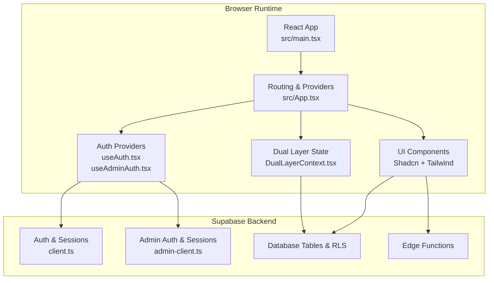
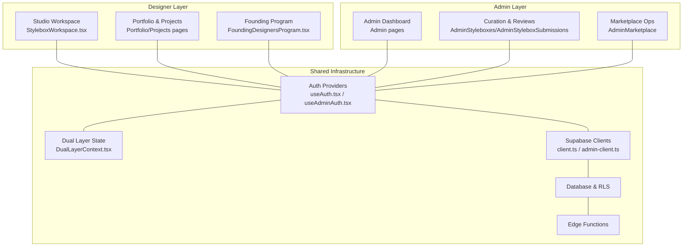
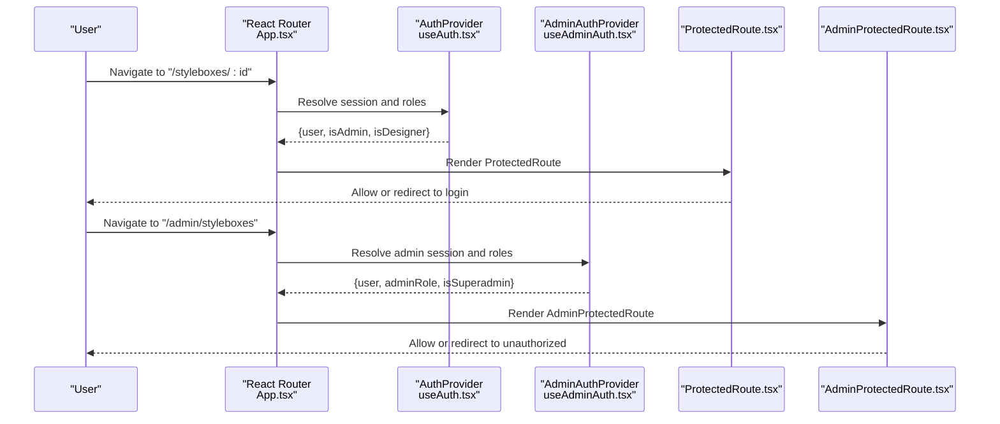
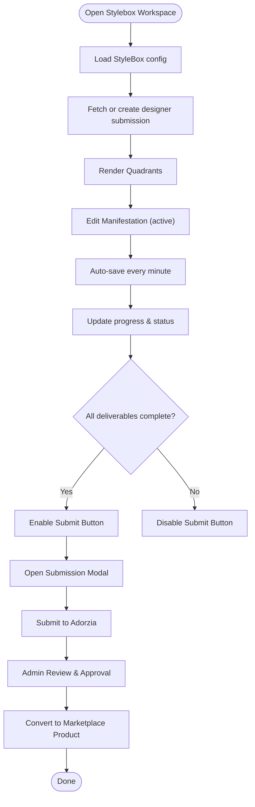
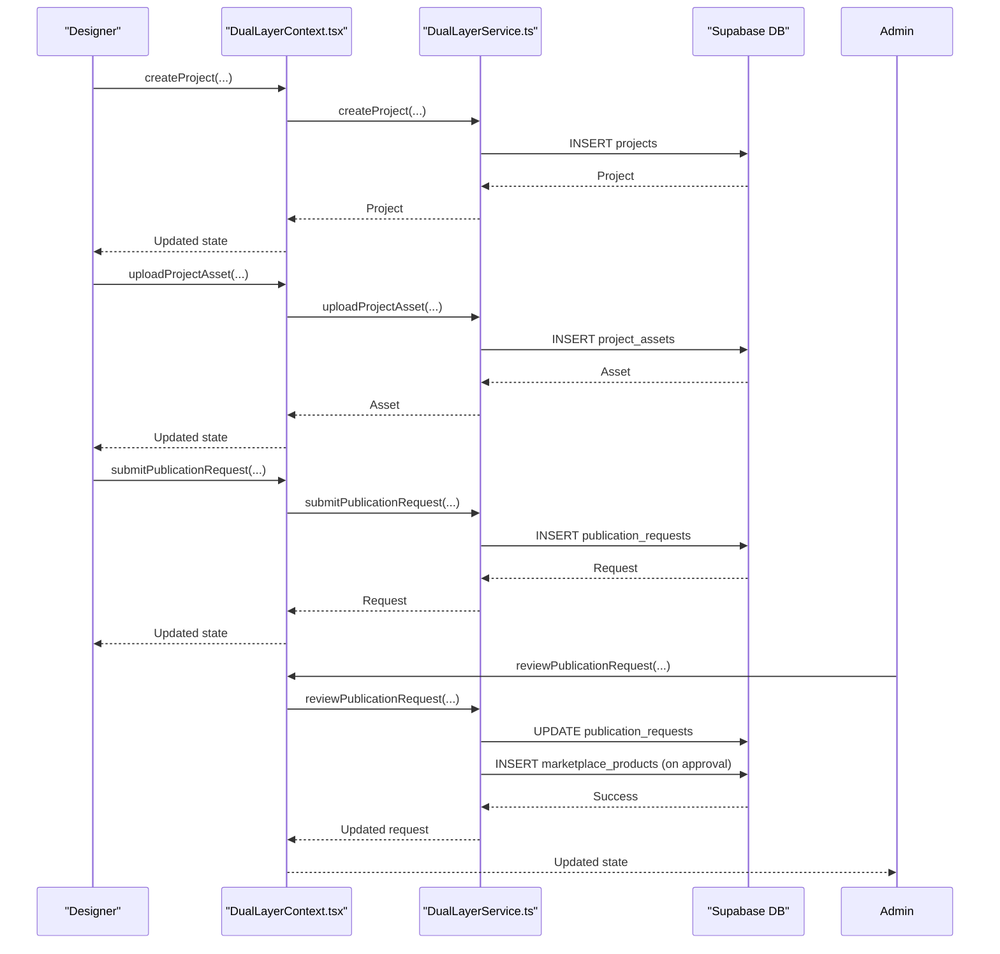
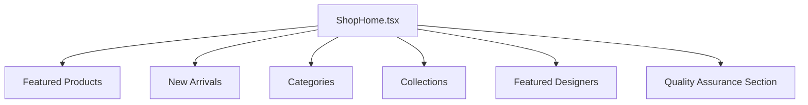
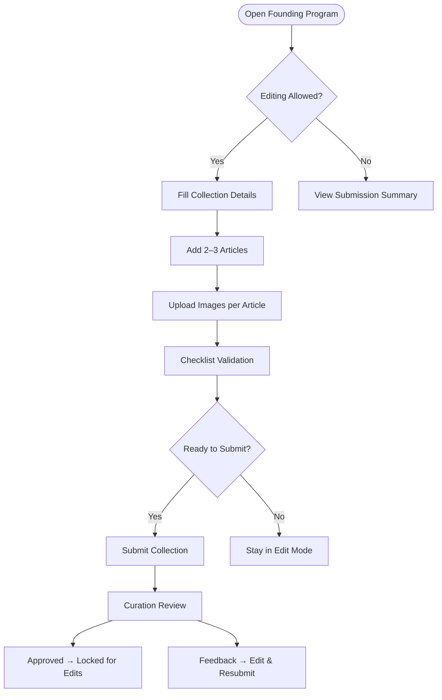
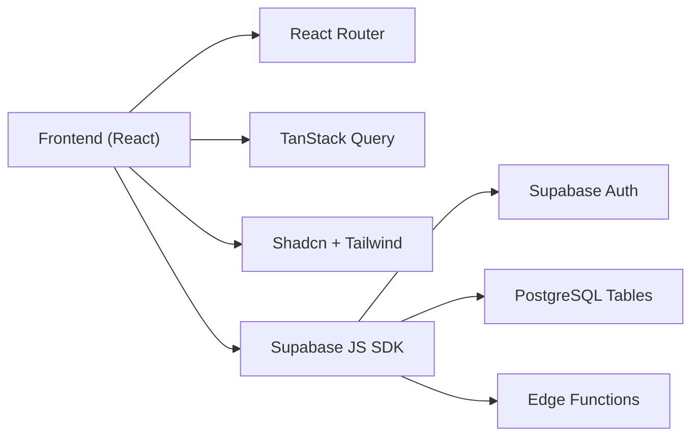

# Project Overview

<cite>
**Referenced Files in This Document**
- [README.md](file://README.md)
- [src/App.tsx](file://src/App.tsx)
- [src/main.tsx](file://src/main.tsx)
- [src/integrations/supabase/client.ts](file://src/integrations/supabase/client.ts)
- [src/integrations/supabase/admin-client.ts](file://src/integrations/supabase/admin-client.ts)
- [src/contexts/DualLayerContext.tsx](file://src/contexts/DualLayerContext.tsx)
- [src/lib/dual-layer-service.ts](file://src/lib/dual-layer-service.ts)
- [src/lib/dual-layer-types.ts](file://src/lib/dual-layer-types.ts)
- [src/hooks/useAuth.tsx](file://src/hooks/useAuth.tsx)
- [src/hooks/useAdminAuth.tsx](file://src/hooks/useAdminAuth.tsx)
- [src/components/auth/ProtectedRoute.tsx](file://src/components/auth/ProtectedRoute.tsx)
- [src/components/auth/AdminProtectedRoute.tsx](file://src/components/auth/AdminProtectedRoute.tsx)
- [src/pages/FoundingDesignersProgram.tsx](file://src/pages/FoundingDesignersProgram.tsx)
- [src/pages/StyleboxWorkspace.tsx](file://src/pages/StyleboxWorkspace.tsx)
- [src/pages/public/Home.tsx](file://src/pages/public/Home.tsx)
- [src/pages/shop/ShopHome.tsx](file://src/pages/shop/ShopHome.tsx)
</cite>

## Table of Contents
1. [Introduction](#introduction)
2. [Project Structure](#project-structure)
3. [Core Components](#core-components)
4. [Architecture Overview](#architecture-overview)
5. [Detailed Component Analysis](#detailed-component-analysis)
6. [Dependency Analysis](#dependency-analysis)
7. [Performance Considerations](#performance-considerations)
8. [Troubleshooting Guide](#troubleshooting-guide)
9. [Conclusion](#conclusion)

## Introduction
Adorzia is a dual-layer fashion platform designed to serve two distinct yet interconnected audiences:
- Designers: A creative studio workspace for building skills, producing portfolio-ready assets, and progressing through ranked achievements.
- Buyers and the broader fashion ecosystem: A curated marketplace where designer-made products are published, discovered, and purchased.

At its core, the platform unifies “learning to earning” through:
- Stylebox creation: Gamified, structured challenges that produce real outputs and portfolio pieces.
- Studio workspace: A dedicated environment for designers to craft, iterate, and submit Stylebox deliverables.
- Marketplace: A production-ready publishing pipeline that transforms approved Stylebox outputs into sellable products.
- Founder program: A pathway for designers to launch their first collection with curated support and curation.

The platform’s dual-layer operating model ensures clear separation of concerns: a designer-facing studio with robust project and submission workflows, and an admin-facing control center for curation, analytics, and operations. This separation is enforced by a dual-layer authentication system that isolates designer and admin sessions while enabling a unified user experience across the product.

## Project Structure
The frontend is a React application built with modern tooling and a component-driven architecture. Routing is handled by React Router, with providers for authentication, subscriptions, themes, and dual-layer state. Supabase powers authentication, real-time features, and database operations for both designer and admin contexts.

**Diagram sources**
- [src/main.tsx](file://src/main.tsx#L1-L46)
- [src/App.tsx](file://src/App.tsx#L1-L422)
- [src/hooks/useAuth.tsx](file://src/hooks/useAuth.tsx#L1-L280)
- [src/hooks/useAdminAuth.tsx](file://src/hooks/useAdminAuth.tsx#L1-L249)
- [src/contexts/DualLayerContext.tsx](file://src/contexts/DualLayerContext.tsx#L1-L303)
- [src/integrations/supabase/client.ts](file://src/integrations/supabase/client.ts#L1-L17)
- [src/integrations/supabase/admin-client.ts](file://src/integrations/supabase/admin-client.ts#L1-L28)

**Section sources**
- [README.md](file://README.md#L53-L62)
- [src/App.tsx](file://src/App.tsx#L1-L422)
- [src/main.tsx](file://src/main.tsx#L1-L46)

## Core Components
- Dual-layer authentication system:
  - Designer session: managed by a dedicated Supabase client with isolated storage and role resolution.
  - Admin session: managed by a separate Supabase client with isolated storage and role checks.
- Studio workspace:
  - Stylebox creation and submission pipeline with deliverables tracking and status management.
- Marketplace:
  - Curated browsing, discovery, and purchasing experience powered by Supabase queries and product data.
- Dual-layer state management:
  - Centralized context for managing projects, assets, and publication requests across the studio.

Key value propositions:
- Seamless journey from learning to publishing.
- Production-grade marketplace with quality assurance and provenance.
- Creator-first monetization and growth pathways.
- Curated onboarding and support through the founder program.

Target audience segments:
- Aspiring and established designers seeking skill-building, portfolio growth, and revenue.
- Buyers and fashion enthusiasts looking for unique, designer-made products with stories.
- Brands and partners interested in collaborating with emerging talent.

**Section sources**
- [src/hooks/useAuth.tsx](file://src/hooks/useAuth.tsx#L1-L280)
- [src/hooks/useAdminAuth.tsx](file://src/hooks/useAdminAuth.tsx#L1-L249)
- [src/integrations/supabase/client.ts](file://src/integrations/supabase/client.ts#L1-L17)
- [src/integrations/supabase/admin-client.ts](file://src/integrations/supabase/admin-client.ts#L1-L28)
- [src/pages/StyleboxWorkspace.tsx](file://src/pages/StyleboxWorkspace.tsx#L1-L412)
- [src/pages/shop/ShopHome.tsx](file://src/pages/shop/ShopHome.tsx#L1-L631)
- [src/contexts/DualLayerContext.tsx](file://src/contexts/DualLayerContext.tsx#L1-L303)

## Architecture Overview
The platform follows a dual-layer architecture:
- Designer layer: Studio workspace, Stylebox creation, portfolio management, and submission workflows.
- Admin layer: Curation, approvals, analytics, and operational controls.
- Shared backend: Supabase handles authentication, database, and serverless functions.

**Diagram sources**
- [src/pages/StyleboxWorkspace.tsx](file://src/pages/StyleboxWorkspace.tsx#L1-L412)
- [src/pages/FoundingDesignersProgram.tsx](file://src/pages/FoundingDesignersProgram.tsx#L1-L574)
- [src/hooks/useAuth.tsx](file://src/hooks/useAuth.tsx#L1-L280)
- [src/hooks/useAdminAuth.tsx](file://src/hooks/useAdminAuth.tsx#L1-L249)
- [src/contexts/DualLayerContext.tsx](file://src/contexts/DualLayerContext.tsx#L1-L303)
- [src/integrations/supabase/client.ts](file://src/integrations/supabase/client.ts#L1-L17)
- [src/integrations/supabase/admin-client.ts](file://src/integrations/supabase/admin-client.ts#L1-L28)

## Detailed Component Analysis

### Dual-Layer Authentication and Routing
The routing layer enforces role-based access:
- Designer routes are protected by a shared AuthProvider and ProtectedRoute.
- Admin routes are isolated behind AdminAuthProvider and AdminProtectedRoute.
- Both providers use Supabase clients configured with separate storage keys to prevent session crossover.

**Diagram sources**
- [src/App.tsx](file://src/App.tsx#L223-L300)
- [src/App.tsx](file://src/App.tsx#L302-L410)
- [src/components/auth/ProtectedRoute.tsx](file://src/components/auth/ProtectedRoute.tsx#L1-L42)
- [src/components/auth/AdminProtectedRoute.tsx](file://src/components/auth/AdminProtectedRoute.tsx#L1-L52)
- [src/hooks/useAuth.tsx](file://src/hooks/useAuth.tsx#L1-L280)
- [src/hooks/useAdminAuth.tsx](file://src/hooks/useAdminAuth.tsx#L1-L249)

**Section sources**
- [src/App.tsx](file://src/App.tsx#L108-L132)
- [src/components/auth/ProtectedRoute.tsx](file://src/components/auth/ProtectedRoute.tsx#L1-L42)
- [src/components/auth/AdminProtectedRoute.tsx](file://src/components/auth/AdminProtectedRoute.tsx#L1-L52)
- [src/hooks/useAuth.tsx](file://src/hooks/useAuth.tsx#L1-L280)
- [src/hooks/useAdminAuth.tsx](file://src/hooks/useAdminAuth.tsx#L1-L249)

### Studio Workspace and Stylebox Creation
The studio workspace is a darkroom-focused environment for designers to:
- Navigate four quadrants aligned to the Stylebox protocol.
- Track deliverables and progress.
- Save iteratively and submit for review.

**Diagram sources**
- [src/pages/StyleboxWorkspace.tsx](file://src/pages/StyleboxWorkspace.tsx#L1-L412)

**Section sources**
- [src/pages/StyleboxWorkspace.tsx](file://src/pages/StyleboxWorkspace.tsx#L1-L412)

### Dual-Layer State Management and Data Flow
The dual-layer context coordinates designer projects, assets, and publication requests:
- Designer actions: create/update/delete projects, upload assets, submit publication requests.
- Admin actions: review and approve publication requests, convert to marketplace products.

**Diagram sources**
- [src/contexts/DualLayerContext.tsx](file://src/contexts/DualLayerContext.tsx#L135-L295)
- [src/lib/dual-layer-service.ts](file://src/lib/dual-layer-service.ts#L1-L340)
- [src/lib/dual-layer-types.ts](file://src/lib/dual-layer-types.ts#L1-L44)

**Section sources**
- [src/contexts/DualLayerContext.tsx](file://src/contexts/DualLayerContext.tsx#L1-L303)
- [src/lib/dual-layer-service.ts](file://src/lib/dual-layer-service.ts#L1-L340)
- [src/lib/dual-layer-types.ts](file://src/lib/dual-layer-types.ts#L1-L44)

### Marketplace Experience
The marketplace presents curated products, designers, and collections:
- Featured products, new arrivals, categories, and collections.
- Designer profiles and brand stories.
- Quality assurance messaging and trust signals.

**Diagram sources**
- [src/pages/shop/ShopHome.tsx](file://src/pages/shop/ShopHome.tsx#L1-L631)

**Section sources**
- [src/pages/shop/ShopHome.tsx](file://src/pages/shop/ShopHome.tsx#L1-L631)

### Founder Program
The founder program enables designers to submit their first collection with:
- Collection details and vision statements.
- Article-level entries with images, materials, pricing, and timelines.
- Submission checklist and status tracking.

**Diagram sources**
- [src/pages/FoundingDesignersProgram.tsx](file://src/pages/FoundingDesignersProgram.tsx#L1-L574)

**Section sources**
- [src/pages/FoundingDesignersProgram.tsx](file://src/pages/FoundingDesignersProgram.tsx#L1-L574)

## Dependency Analysis
The platform’s runtime dependencies and integration points:
- React and ecosystem: React Router for routing, TanStack Query for caching and data fetching, shadcn/ui + Tailwind for UI primitives.
- Supabase: Authentication, database, and serverless functions for marketplace, cart, orders, and notifications.
- Dual-layer isolation: Separate Supabase clients with isolated storage keys ensure admin and designer sessions remain independent.

**Diagram sources**
- [README.md](file://README.md#L53-L62)
- [src/integrations/supabase/client.ts](file://src/integrations/supabase/client.ts#L1-L17)
- [src/integrations/supabase/admin-client.ts](file://src/integrations/supabase/admin-client.ts#L1-L28)

**Section sources**
- [README.md](file://README.md#L53-L62)
- [src/App.tsx](file://src/App.tsx#L1-L422)

## Performance Considerations
- Client-side caching: TanStack Query is configured to cache API responses and deduplicate requests, reducing redundant network calls.
- Lazy loading: Route-based code splitting and dynamic imports minimize initial bundle size.
- Optimistic updates: Dual-layer context and hooks support optimistic UI updates for smoother interactions during project creation, asset uploads, and publication requests.
- Real-time signals: Supabase’s real-time subscriptions can be leveraged for live stats and notifications without polling.

[No sources needed since this section provides general guidance]

## Troubleshooting Guide
Common issues and resolutions:
- Authentication loops or session conflicts:
  - Ensure separate storage keys for studio and admin sessions. The admin client uses a prefixed storage key to avoid hijacking the designer session.
- Role resolution failures:
  - Verify the user_roles table contains the expected roles and that the role-checking logic resolves priorities correctly.
- Submission not appearing in admin queue:
  - Confirm the publication request is created with the correct status and linked to the intended StyleBox and designer.
- Marketplace product not visible after approval:
  - Check that the conversion process creates a marketplace product and that the admin publishes the product.

**Section sources**
- [src/integrations/supabase/admin-client.ts](file://src/integrations/supabase/admin-client.ts#L1-L28)
- [src/hooks/useAuth.tsx](file://src/hooks/useAuth.tsx#L35-L74)
- [src/hooks/useAdminAuth.tsx](file://src/hooks/useAdminAuth.tsx#L37-L87)
- [src/lib/dual-layer-service.ts](file://src/lib/dual-layer-service.ts#L228-L310)

## Conclusion
Adorzia’s dual-layer architecture cleanly separates designer and admin experiences while sharing a unified backend. The studio workspace and Stylebox creation pipeline drive engagement and output, while the marketplace and founder program provide clear monetization and growth pathways. The dual-layer authentication system, combined with Supabase’s real-time and serverless capabilities, delivers a scalable, secure, and creator-centric platform for the future of fashion.

[No sources needed since this section summarizes without analyzing specific files]