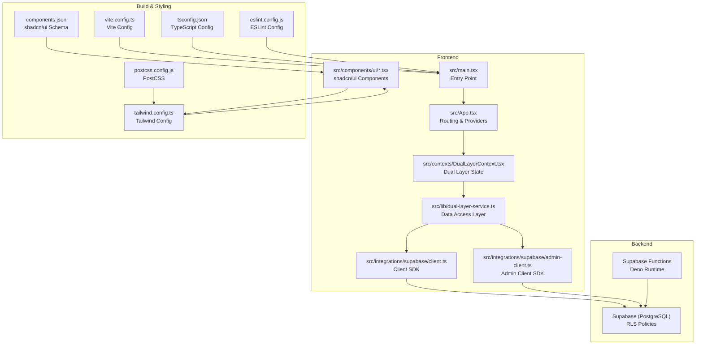
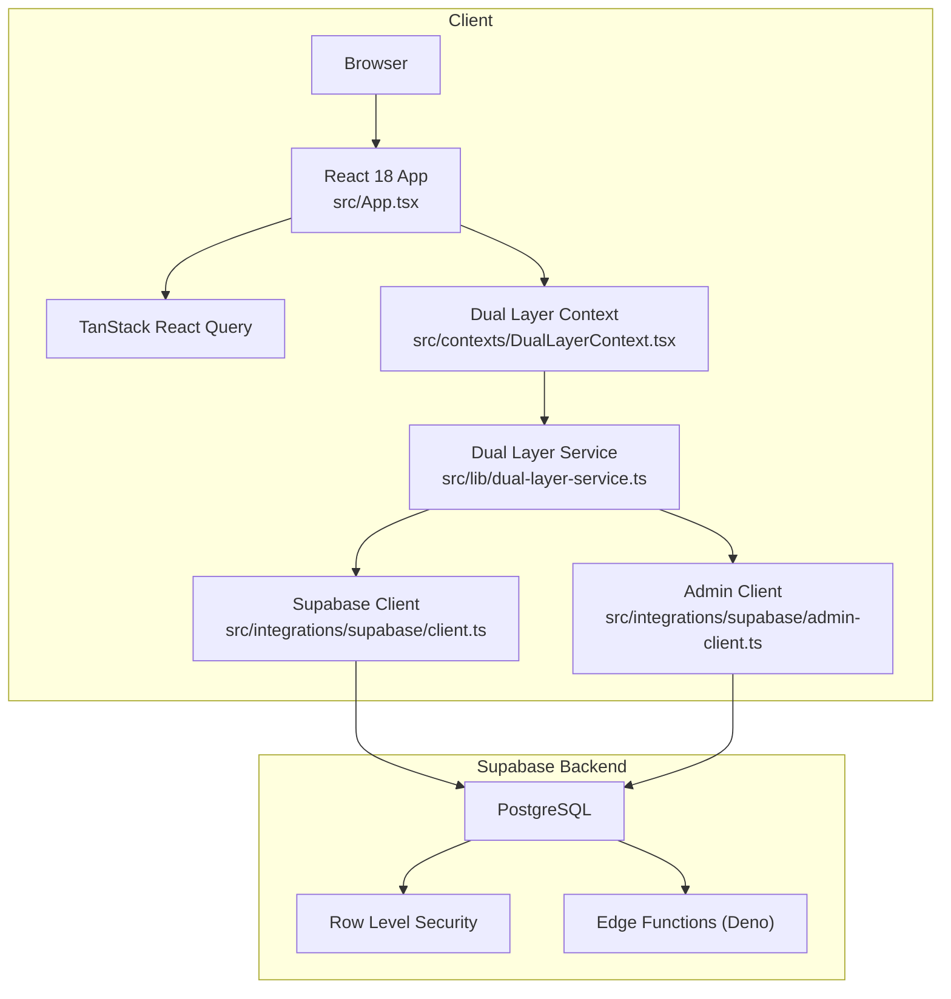
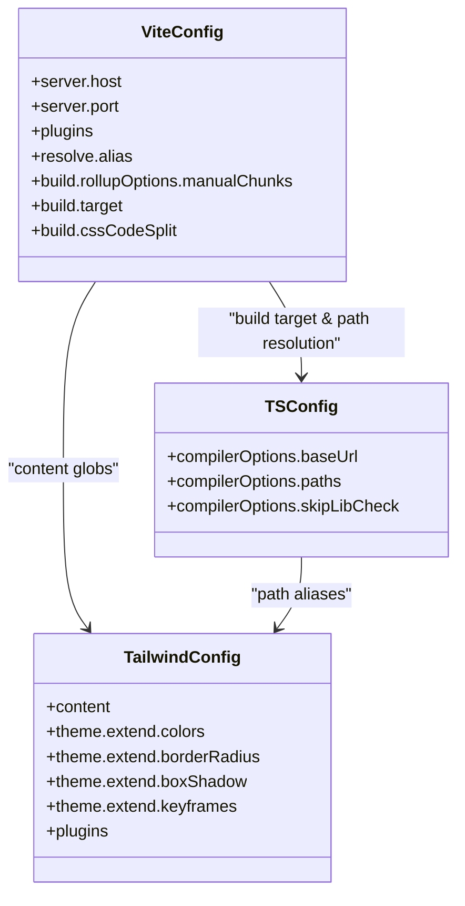
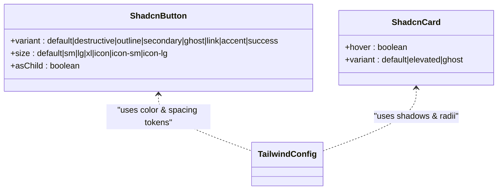
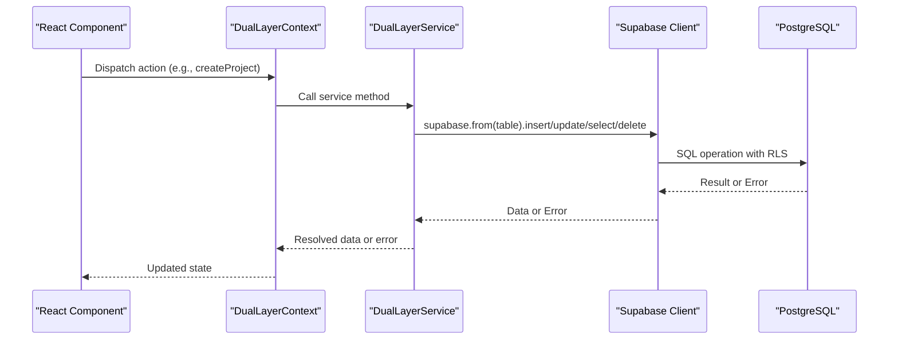
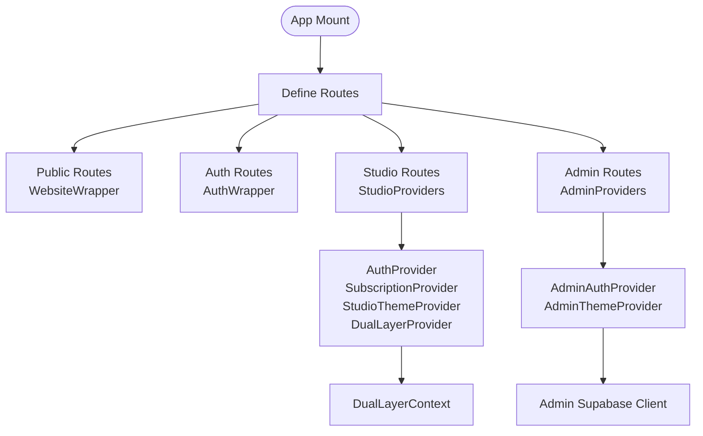
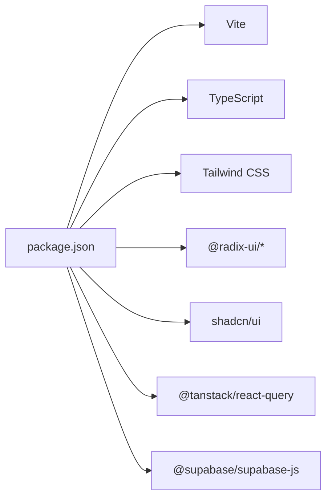

# Technology Stack

<cite>
**Referenced Files in This Document**
- [package.json](file://package.json)
- [vite.config.ts](file://vite.config.ts)
- [tailwind.config.ts](file://tailwind.config.ts)
- [tsconfig.json](file://tsconfig.json)
- [components.json](file://components.json)
- [eslint.config.js](file://eslint.config.js)
- [postcss.config.js](file://postcss.config.js)
- [src/App.tsx](file://src/App.tsx)
- [src/main.tsx](file://src/main.tsx)
- [src/contexts/DualLayerContext.tsx](file://src/contexts/DualLayerContext.tsx)
- [src/lib/dual-layer-service.ts](file://src/lib/dual-layer-service.ts)
- [src/integrations/supabase/client.ts](file://src/integrations/supabase/client.ts)
- [src/integrations/supabase/admin-client.ts](file://src/integrations/supabase/admin-client.ts)
- [src/lib/dual-layer-types.ts](file://src/lib/dual-layer-types.ts)
- [src/components/ui/button.tsx](file://src/components/ui/button.tsx)
- [src/components/ui/card.tsx](file://src/components/ui/card.tsx)
- [supabase/functions/deno.json](file://supabase/functions/deno.json)
</cite>

## Table of Contents
1. [Introduction](#introduction)
2. [Project Structure](#project-structure)
3. [Core Components](#core-components)
4. [Architecture Overview](#architecture-overview)
5. [Detailed Component Analysis](#detailed-component-analysis)
6. [Dependency Analysis](#dependency-analysis)
7. [Performance Considerations](#performance-considerations)
8. [Troubleshooting Guide](#troubleshooting-guide)
9. [Conclusion](#conclusion)
10. [Appendices](#appendices)

## Introduction
This document describes the modern web technology stack used by the Adorzia project. It covers the frontend (React 18, TypeScript, Vite, Tailwind CSS), the backend infrastructure (Supabase with PostgreSQL, Row Level Security, and serverless functions), and the design system built on shadcn/ui. It also explains the dual-layer architecture that separates Studio (designer-facing) and Admin experiences, and provides guidance for upgrades and maintenance.

## Project Structure
The project follows a conventional React + Vite monorepo-like structure with a clear separation between frontend, backend configuration, and shared design system components.

**Diagram sources**
- [src/main.tsx](file://src/main.tsx#L1-L46)
- [src/App.tsx](file://src/App.tsx#L1-L433)
- [src/contexts/DualLayerContext.tsx](file://src/contexts/DualLayerContext.tsx#L1-L303)
- [src/lib/dual-layer-service.ts](file://src/lib/dual-layer-service.ts#L1-L340)
- [src/integrations/supabase/client.ts](file://src/integrations/supabase/client.ts#L1-L17)
- [src/integrations/supabase/admin-client.ts](file://src/integrations/supabase/admin-client.ts#L1-L28)
- [src/components/ui/button.tsx](file://src/components/ui/button.tsx#L1-L53)
- [vite.config.ts](file://vite.config.ts#L1-L40)
- [tsconfig.json](file://tsconfig.json#L1-L17)
- [tailwind.config.ts](file://tailwind.config.ts#L1-L476)
- [postcss.config.js](file://postcss.config.js#L1-L7)
- [components.json](file://components.json#L1-L21)
- [eslint.config.js](file://eslint.config.js#L1-L27)
- [supabase/functions/deno.json](file://supabase/functions/deno.json#L1-L4)

**Section sources**
- [src/main.tsx](file://src/main.tsx#L1-L46)
- [src/App.tsx](file://src/App.tsx#L1-L433)
- [vite.config.ts](file://vite.config.ts#L1-L40)
- [tailwind.config.ts](file://tailwind.config.ts#L1-L476)
- [tsconfig.json](file://tsconfig.json#L1-L17)
- [components.json](file://components.json#L1-L21)
- [eslint.config.js](file://eslint.config.js#L1-L27)
- [postcss.config.js](file://postcss.config.js#L1-L7)

## Core Components
- Frontend framework: React 18 with React Router DOM for routing and Framer Motion for animations.
- Build system: Vite 7 with esbuild minification and optimized code splitting.
- Styling: Tailwind CSS 3 with custom theme tokens, dark mode support, and animation utilities.
- Type safety: TypeScript 5 with strict compiler options and path aliases.
- State and caching: TanStack React Query for data fetching and caching.
- Design system: shadcn/ui components integrated via a local component library and Tailwind configuration.
- Backend: Supabase with PostgreSQL, Row Level Security policies, and serverless Edge Functions (Deno runtime).
- Developer experience: ESLint with TypeScript rules and PostCSS pipeline.

**Section sources**
- [package.json](file://package.json#L15-L90)
- [vite.config.ts](file://vite.config.ts#L1-L40)
- [tailwind.config.ts](file://tailwind.config.ts#L1-L476)
- [tsconfig.json](file://tsconfig.json#L1-L17)
- [eslint.config.js](file://eslint.config.js#L1-L27)
- [postcss.config.js](file://postcss.config.js#L1-L7)

## Architecture Overview
The application implements a dual-layer architecture:
- Studio layer: Designer-facing features (dashboard, stylebox workspace, portfolio, analytics).
- Admin layer: Administrative controls (analytics, queues, marketplace, payouts, rankings).
- Shared backend: Supabase handles authentication, RLS-secured tables, and serverless functions.

**Diagram sources**
- [src/App.tsx](file://src/App.tsx#L1-L433)
- [src/contexts/DualLayerContext.tsx](file://src/contexts/DualLayerContext.tsx#L1-L303)
- [src/lib/dual-layer-service.ts](file://src/lib/dual-layer-service.ts#L1-L340)
- [src/integrations/supabase/client.ts](file://src/integrations/supabase/client.ts#L1-L17)
- [src/integrations/supabase/admin-client.ts](file://src/integrations/supabase/admin-client.ts#L1-L28)

## Detailed Component Analysis

### Frontend Stack: React 18 + TypeScript + Vite + Tailwind CSS
- React 18: Concurrent features and automatic batching improve rendering performance.
- TypeScript: Strict compiler options and path aliases improve developer productivity and reduce runtime errors.
- Vite 7: Fast dev server, optimized builds with esbuild, and intelligent code splitting.
- Tailwind CSS: Utility-first styling with a custom theme, dark mode, and animation tokens.

**Diagram sources**
- [vite.config.ts](file://vite.config.ts#L1-L40)
- [tsconfig.json](file://tsconfig.json#L1-L17)
- [tailwind.config.ts](file://tailwind.config.ts#L1-L476)

**Section sources**
- [package.json](file://package.json#L15-L90)
- [vite.config.ts](file://vite.config.ts#L1-L40)
- [tailwind.config.ts](file://tailwind.config.ts#L1-L476)
- [tsconfig.json](file://tsconfig.json#L1-L17)
- [components.json](file://components.json#L1-L21)
- [eslint.config.js](file://eslint.config.js#L1-L27)
- [postcss.config.js](file://postcss.config.js#L1-L7)

### Design System: shadcn/ui Integration
- Components are implemented locally under src/components/ui and follow shadcn/ui conventions.
- Variants and sizes are standardized using class-variance-authority and Tailwind utilities.
- The design system is configured via components.json with Tailwind CSS variables enabled.

**Diagram sources**
- [src/components/ui/button.tsx](file://src/components/ui/button.tsx#L1-L53)
- [src/components/ui/card.tsx](file://src/components/ui/card.tsx#L1-L62)
- [tailwind.config.ts](file://tailwind.config.ts#L1-L476)
- [components.json](file://components.json#L1-L21)

**Section sources**
- [src/components/ui/button.tsx](file://src/components/ui/button.tsx#L1-L53)
- [src/components/ui/card.tsx](file://src/components/ui/card.tsx#L1-L62)
- [components.json](file://components.json#L1-L21)
- [tailwind.config.ts](file://tailwind.config.ts#L1-L476)

### Backend Infrastructure: Supabase + PostgreSQL + RLS + Serverless Functions
- Supabase client initialization with localStorage-backed auth persistence and token refresh.
- Admin client uses a separate storage namespace to isolate admin sessions.
- Dual Layer Service encapsulates CRUD operations against Supabase tables with explicit ownership checks.
- Supabase Edge Functions are configured with Deno runtime and import maps.

**Diagram sources**
- [src/contexts/DualLayerContext.tsx](file://src/contexts/DualLayerContext.tsx#L135-L295)
- [src/lib/dual-layer-service.ts](file://src/lib/dual-layer-service.ts#L1-L340)
- [src/integrations/supabase/client.ts](file://src/integrations/supabase/client.ts#L1-L17)

**Section sources**
- [src/integrations/supabase/client.ts](file://src/integrations/supabase/client.ts#L1-L17)
- [src/integrations/supabase/admin-client.ts](file://src/integrations/supabase/admin-client.ts#L1-L28)
- [src/lib/dual-layer-service.ts](file://src/lib/dual-layer-service.ts#L1-L340)
- [src/lib/dual-layer-types.ts](file://src/lib/dual-layer-types.ts#L1-L44)
- [supabase/functions/deno.json](file://supabase/functions/deno.json#L1-L4)

### Dual-Layer Architecture: Studio vs Admin
- Routing and providers are separated by route groups:
  - Website and marketplace routes use WebsiteWrapper and AuthWrapper.
  - Studio routes wrap children in StudioProviders (Auth, Subscription, StudioTheme, DualLayer).
  - Admin routes wrap children in AdminProviders (AdminAuth, AdminTheme).
- Admin and Studio sessions are isolated via separate Supabase clients and storage keys.

**Diagram sources**
- [src/App.tsx](file://src/App.tsx#L156-L431)
- [src/contexts/DualLayerContext.tsx](file://src/contexts/DualLayerContext.tsx#L135-L295)
- [src/integrations/supabase/admin-client.ts](file://src/integrations/supabase/admin-client.ts#L1-L28)

**Section sources**
- [src/App.tsx](file://src/App.tsx#L1-L433)
- [src/contexts/DualLayerContext.tsx](file://src/contexts/DualLayerContext.tsx#L1-L303)
- [src/integrations/supabase/admin-client.ts](file://src/integrations/supabase/admin-client.ts#L1-L28)

## Dependency Analysis
- Frontend dependencies include React 18, Radix UI primitives, shadcn/ui components, TanStack React Query, Tailwind-based UI libraries, and motion libraries.
- Build-time dependencies include Vite, TypeScript, Tailwind CSS, PostCSS, and ESLint.
- Supabase client libraries connect to the backend with environment-driven configuration.

**Diagram sources**
- [package.json](file://package.json#L15-L90)

**Section sources**
- [package.json](file://package.json#L15-L90)

## Performance Considerations
- Vite build optimizations:
  - Manual chunks group vendor bundles by domain (React, UI, Data) to maximize cache hits.
  - esbuild minification and CSS code splitting reduce bundle sizes.
  - Target ES2020 and inline small assets to optimize LCP.
- React Query:
  - Centralized caching reduces redundant network calls and improves perceived performance.
- Tailwind:
  - Purge unused styles via content globs and use CSS variables for theme tokens to keep styles maintainable.

**Section sources**
- [vite.config.ts](file://vite.config.ts#L19-L39)
- [tailwind.config.ts](file://tailwind.config.ts#L4-L5)

## Troubleshooting Guide
- Global error handling:
  - The root app registers global error and unhandled rejection listeners to capture critical failures during initialization.
- Provider ordering:
  - Ensure StudioProviders and AdminProviders are applied to their respective route groups to avoid missing context or auth state.
- Supabase client isolation:
  - Admin and Studio clients use separate storage namespaces; mixing them can cause session conflicts.
- Dual Layer ownership checks:
  - Service methods verify ownership before updates/deletes; unauthorized attempts log errors and return null/false.

**Section sources**
- [src/main.tsx](file://src/main.tsx#L5-L14)
- [src/App.tsx](file://src/App.tsx#L110-L134)
- [src/integrations/supabase/admin-client.ts](file://src/integrations/supabase/admin-client.ts#L7-L12)
- [src/lib/dual-layer-service.ts](file://src/lib/dual-layer-service.ts#L25-L82)

## Conclusion
Adorzia’s stack combines a modern React 18 + TypeScript + Vite + Tailwind frontend with a robust Supabase backend featuring RLS and serverless functions. The shadcn/ui design system provides a cohesive, customizable component library. The dual-layer architecture cleanly separates Studio and Admin concerns, while Supabase clients and providers ensure secure, isolated sessions. The build and lint configurations emphasize performance, maintainability, and developer experience.

## Appendices

### Version Compatibility and Rationale
- React 18: Stable concurrent features and improved rendering performance.
- TypeScript 5: Latest language features and stricter defaults for safer code.
- Vite 7: Faster builds and dev server with strong ecosystem support.
- Tailwind CSS 3: Utility-first styling with deep customization and animation tokens.
- Radix UI: Accessible base primitives for dialogs, menus, tooltips, and more.
- TanStack React Query: Efficient caching and data synchronization.
- Supabase: Full-stack solution with RLS, real-time, and Edge Functions.
- shadcn/ui: Reusable, accessible components with consistent design tokens.

**Section sources**
- [package.json](file://package.json#L15-L90)
- [tailwind.config.ts](file://tailwind.config.ts#L1-L476)
- [components.json](file://components.json#L1-L21)

### Upgrading Dependencies and Maintenance Guidance
- Frontend:
  - Pin major versions in package.json and use a lockfile; test after each upgrade.
  - Keep Vite, TypeScript, and ESLint in sync; run type checks and linting after upgrades.
  - Tailwind and PostCSS should be upgraded together; verify purge and build outputs.
- Backend:
  - Review Supabase changelogs for client SDK updates; test auth and RLS behavior.
  - For Edge Functions, align Deno runtime versions and update import maps as needed.
- Design System:
  - After upgrading shadcn/ui, re-run component installation to regenerate files and reconcile changes.
- Build and DX:
  - Monitor bundle sizes after upgrades; adjust manualChunks if needed.
  - Keep ESLint rules aligned with TypeScript updates to prevent regressions.

[No sources needed since this section provides general guidance]