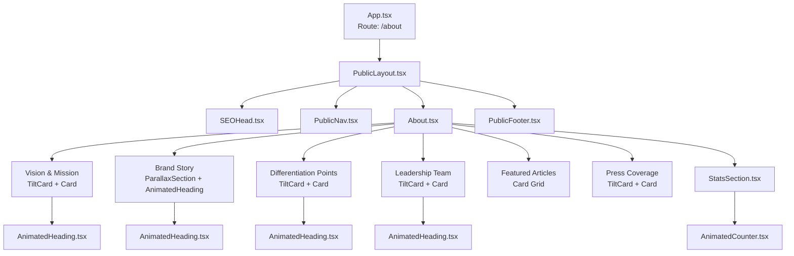
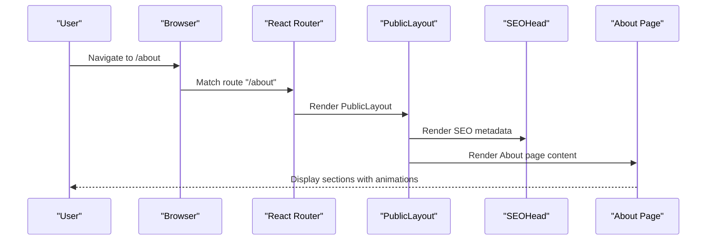
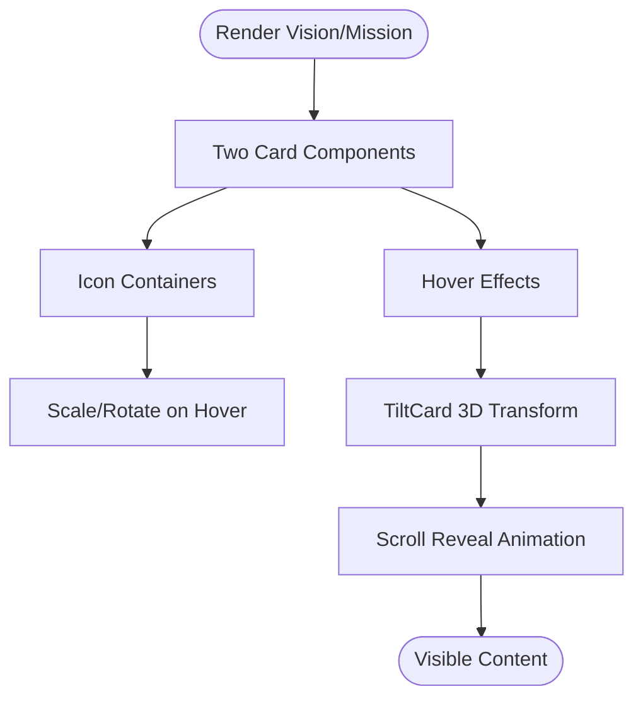
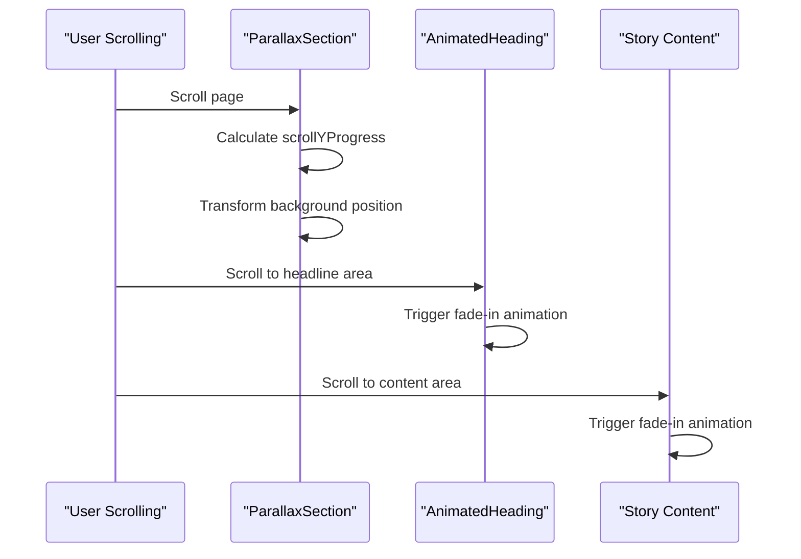
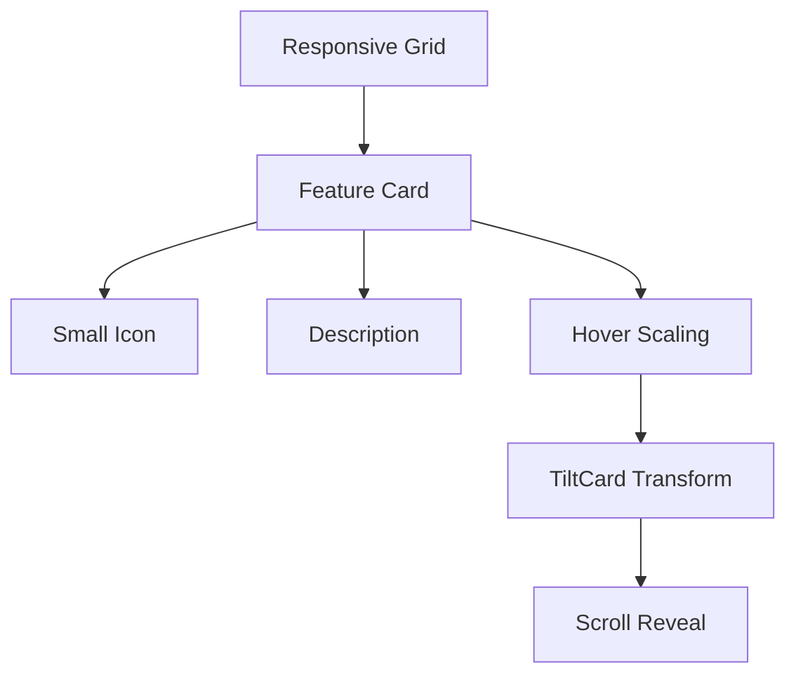
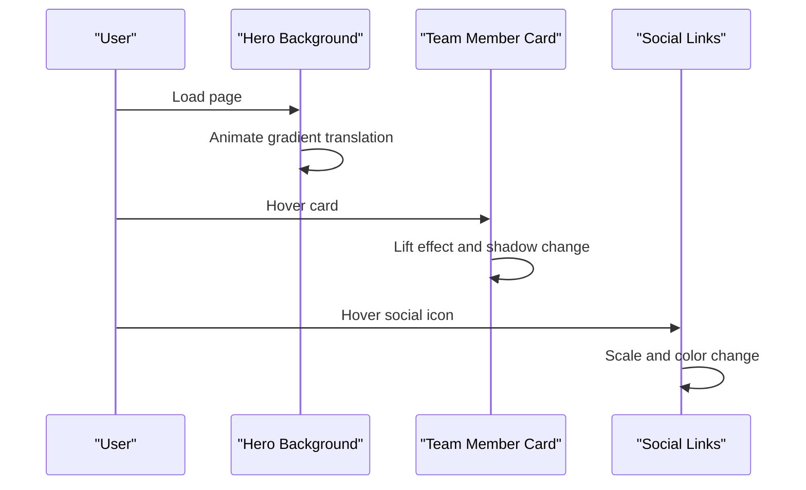
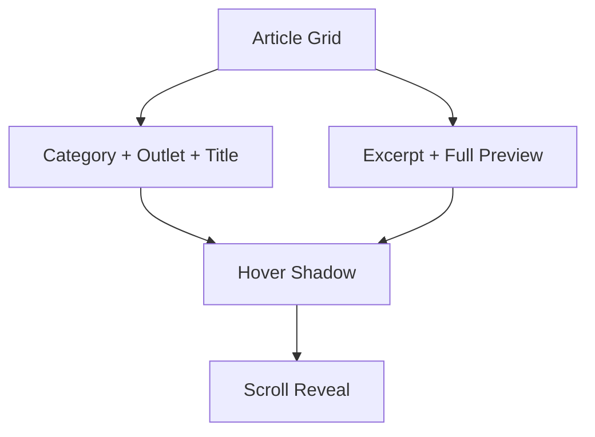
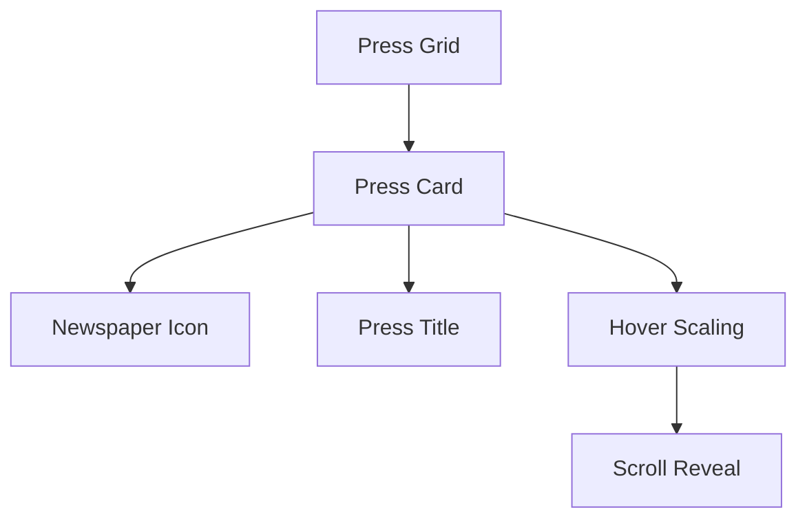
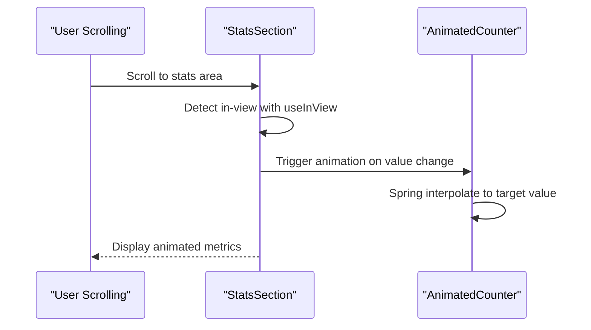
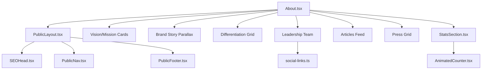

# About Us Section

<cite>
**Referenced Files in This Document**
- [About.tsx](file://src/pages/public/About.tsx)
- [PublicLayout.tsx](file://src/components/public/PublicLayout.tsx)
- [StatsSection.tsx](file://src/components/public/StatsSection.tsx)
- [AnimatedHeading.tsx](file://src/components/public/AnimatedHeading.tsx)
- [ParallaxSection.tsx](file://src/components/public/ParallaxSection.tsx)
- [TiltCard.tsx](file://src/components/public/TiltCard.tsx)
- [SEOHead.tsx](file://src/components/public/SEOHead.tsx)
- [AnimatedCounter.tsx](file://src/components/public/AnimatedCounter.tsx)
- [social-links.ts](file://src/lib/social-links.ts)
- [App.tsx](file://src/App.tsx)
- [PublicNav.tsx](file://src/components/public/PublicNav.tsx)
- [PublicFooter.tsx](file://src/components/public/PublicFooter.tsx)
- [tailwind.config.ts](file://tailwind.config.ts)
</cite>

## Table of Contents
1. [Introduction](#introduction)
2. [Project Structure](#project-structure)
3. [Core Components](#core-components)
4. [Architecture Overview](#architecture-overview)
5. [Detailed Component Analysis](#detailed-component-analysis)
6. [Dependency Analysis](#dependency-analysis)
7. [Performance Considerations](#performance-considerations)
8. [Troubleshooting Guide](#troubleshooting-guide)
9. [Conclusion](#conclusion)

## Introduction
This document explains the About Us section implementation, focusing on how the company story is presented, how mission and vision are communicated, how the team is introduced, and how organizational values are displayed. It covers the content structure, visual storytelling approach, integration with the public layout system, SEO optimization strategies, content management patterns, responsive design considerations, component hierarchy, styling with Tailwind CSS, and interactive elements that enhance the storytelling experience.

## Project Structure
The About page is a dedicated public route that composes multiple reusable components to deliver a cohesive narrative. It integrates with the public layout system and leverages shared UI primitives for animations, typography, and responsive behavior.

**Diagram sources**
- [App.tsx](file://src/App.tsx#L124-L125)
- [PublicLayout.tsx](file://src/components/public/PublicLayout.tsx#L16-L41)
- [About.tsx](file://src/pages/public/About.tsx#L148-L545)
- [SEOHead.tsx](file://src/components/public/SEOHead.tsx#L13-L74)
- [PublicNav.tsx](file://src/components/public/PublicNav.tsx#L80-L281)
- [PublicFooter.tsx](file://src/components/public/PublicFooter.tsx#L54-L259)
- [StatsSection.tsx](file://src/components/public/StatsSection.tsx#L21-L169)
- [AnimatedHeading.tsx](file://src/components/public/AnimatedHeading.tsx#L11-L36)
- [ParallaxSection.tsx](file://src/components/public/ParallaxSection.tsx#L12-L48)
- [TiltCard.tsx](file://src/components/public/TiltCard.tsx#L11-L82)
- [AnimatedCounter.tsx](file://src/components/public/AnimatedCounter.tsx#L12-L56)

**Section sources**
- [App.tsx](file://src/App.tsx#L124-L125)
- [PublicLayout.tsx](file://src/components/public/PublicLayout.tsx#L16-L41)
- [About.tsx](file://src/pages/public/About.tsx#L148-L545)

## Core Components
The About page is composed of several specialized components that handle content sections, animations, and SEO:

- Vision and Mission: Two side-by-side cards with icons and animated reveals.
- Brand Story: A visually immersive parallax section with animated headline and layered content.
- Differentiation Points: A grid of feature cards with subtle tilting and hover effects.
- Leadership Team: A hero-styled team showcase with gradient overlays and social links.
- Featured Articles: A card-based feed with excerpts and category badges.
- Press Coverage: Highlighted press mentions in a responsive grid.
- Statistics: A stats section with animated counters and icons.

These components are orchestrated by the About page and wrapped in the PublicLayout, which provides the global navigation, footer, and SEO head.

**Section sources**
- [About.tsx](file://src/pages/public/About.tsx#L196-L542)
- [PublicLayout.tsx](file://src/components/public/PublicLayout.tsx#L16-L41)
- [StatsSection.tsx](file://src/components/public/StatsSection.tsx#L21-L169)
- [AnimatedHeading.tsx](file://src/components/public/AnimatedHeading.tsx#L11-L36)
- [ParallaxSection.tsx](file://src/components/public/ParallaxSection.tsx#L12-L48)
- [TiltCard.tsx](file://src/components/public/TiltCard.tsx#L11-L82)
- [AnimatedCounter.tsx](file://src/components/public/AnimatedCounter.tsx#L12-L56)

## Architecture Overview
The About page follows a composition-first architecture:
- Routing: The route `/about` renders the About page component.
- Layout: PublicLayout wraps the page and injects SEO metadata, navigation, and footer.
- Sections: Each major content area is a self-contained module using shared primitives.
- Animations: Framer Motion powers scroll-triggered reveals and interactive micro-interactions.
- Styling: Tailwind CSS provides responsive design and theme tokens.

**Diagram sources**
- [App.tsx](file://src/App.tsx#L124-L125)
- [PublicLayout.tsx](file://src/components/public/PublicLayout.tsx#L16-L41)
- [SEOHead.tsx](file://src/components/public/SEOHead.tsx#L13-L74)
- [About.tsx](file://src/pages/public/About.tsx#L148-L545)

## Detailed Component Analysis

### Vision and Mission Section
This section presents the company’s vision and mission using two vertically stacked cards with animated icons and hover tilt effects. Each card uses a TiltCard wrapper for depth and interactivity, and content is revealed with scroll-triggered animations.

Key behaviors:
- Scroll-triggered fade-in with staggered delays.
- Hover interactions on cards and icons.
- Consistent iconography and typography hierarchy.

**Diagram sources**
- [About.tsx](file://src/pages/public/About.tsx#L196-L248)
- [TiltCard.tsx](file://src/components/public/TiltCard.tsx#L11-L82)
- [AnimatedHeading.tsx](file://src/components/public/AnimatedHeading.tsx#L11-L36)

**Section sources**
- [About.tsx](file://src/pages/public/About.tsx#L196-L248)
- [TiltCard.tsx](file://src/components/public/TiltCard.tsx#L11-L82)

### Brand Story Section
The brand story is told through a visually immersive parallax background combined with a centered animated headline and a content block with a soft backdrop. The parallax effect enhances depth, while scroll-triggered animations reveal content progressively.

Key behaviors:
- Parallax background movement synchronized with scroll.
- Overlay with backdrop blur for readability.
- Staggered reveal for headline and content paragraphs.

**Diagram sources**
- [ParallaxSection.tsx](file://src/components/public/ParallaxSection.tsx#L12-L48)
- [AnimatedHeading.tsx](file://src/components/public/AnimatedHeading.tsx#L11-L36)
- [About.tsx](file://src/pages/public/About.tsx#L250-L289)

**Section sources**
- [ParallaxSection.tsx](file://src/components/public/ParallaxSection.tsx#L12-L48)
- [AnimatedHeading.tsx](file://src/components/public/AnimatedHeading.tsx#L11-L36)
- [About.tsx](file://src/pages/public/About.tsx#L250-L289)

### Differentiation Points Section
This section highlights unique value propositions in a responsive grid. Each point is presented in a card with a small icon and descriptive text, using TiltCard for subtle depth and hover interactions.

Key behaviors:
- Responsive grid layout.
- Staggered animations per item.
- Hover scaling and tilt transforms.

**Diagram sources**
- [About.tsx](file://src/pages/public/About.tsx#L291-L345)
- [TiltCard.tsx](file://src/components/public/TiltCard.tsx#L11-L82)

**Section sources**
- [About.tsx](file://src/pages/public/About.tsx#L291-L345)
- [TiltCard.tsx](file://src/components/public/TiltCard.tsx#L11-L82)

### Leadership Team Section
The leadership showcase uses a dark-themed hero layout with animated gradient movement, profile cards with image overlays, and social media links. Each team member card includes a hover lift effect and subtle transitions.

Key behaviors:
- Animated horizontal gradient background.
- Image overlay with gradient and title/role.
- Social links with hover scaling.
- Staggered reveal and hover lift.

**Diagram sources**
- [About.tsx](file://src/pages/public/About.tsx#L347-L431)
- [social-links.ts](file://src/lib/social-links.ts#L1-L9)

**Section sources**
- [About.tsx](file://src/pages/public/About.tsx#L347-L431)
- [social-links.ts](file://src/lib/social-links.ts#L1-L9)

### Featured Articles Section
Articles are displayed in a card grid with a header column containing category, outlet, and title, and a content column with excerpt and full content preview. Each article card uses hover shadows and transitions for interactivity.

Key behaviors:
- Responsive two-column layout on larger screens.
- Staggered animations per article.
- Read full article link with arrow icon.

**Diagram sources**
- [About.tsx](file://src/pages/public/About.tsx#L433-L493)

**Section sources**
- [About.tsx](file://src/pages/public/About.tsx#L433-L493)

### Press Coverage Section
Press highlights are shown in a responsive three-column grid, each highlight styled as a card with an icon and headline. The section uses TiltCard for subtle depth and hover effects.

Key behaviors:
- Responsive grid layout.
- Staggered animations.
- Hover scaling and shadow transitions.

**Diagram sources**
- [About.tsx](file://src/pages/public/About.tsx#L495-L542)
- [TiltCard.tsx](file://src/components/public/TiltCard.tsx#L11-L82)

**Section sources**
- [About.tsx](file://src/pages/public/About.tsx#L495-L542)
- [TiltCard.tsx](file://src/components/public/TiltCard.tsx#L11-L82)

### Statistics Section
The statistics section displays key metrics with animated counters and icons. It supports multiple variants and uses scroll-triggered animations to reveal metrics as the user scrolls.

Key behaviors:
- Animated counters with spring physics.
- Scroll-triggered reveal with staggered delays.
- Multiple layout variants (default, cards, minimal).

**Diagram sources**
- [StatsSection.tsx](file://src/components/public/StatsSection.tsx#L21-L169)
- [AnimatedCounter.tsx](file://src/components/public/AnimatedCounter.tsx#L12-L56)
- [About.tsx](file://src/pages/public/About.tsx#L189-L194)

**Section sources**
- [StatsSection.tsx](file://src/components/public/StatsSection.tsx#L21-L169)
- [AnimatedCounter.tsx](file://src/components/public/AnimatedCounter.tsx#L12-L56)
- [About.tsx](file://src/pages/public/About.tsx#L189-L194)

## Dependency Analysis
The About page depends on the PublicLayout and several shared components. The layout provides global navigation, footer, and SEO head. Shared components encapsulate animations, typography, and interactive behaviors.

**Diagram sources**
- [About.tsx](file://src/pages/public/About.tsx#L148-L545)
- [PublicLayout.tsx](file://src/components/public/PublicLayout.tsx#L16-L41)
- [SEOHead.tsx](file://src/components/public/SEOHead.tsx#L13-L74)
- [PublicNav.tsx](file://src/components/public/PublicNav.tsx#L80-L281)
- [PublicFooter.tsx](file://src/components/public/PublicFooter.tsx#L54-L259)
- [StatsSection.tsx](file://src/components/public/StatsSection.tsx#L21-L169)
- [AnimatedCounter.tsx](file://src/components/public/AnimatedCounter.tsx#L12-L56)
- [social-links.ts](file://src/lib/social-links.ts#L1-L9)

**Section sources**
- [About.tsx](file://src/pages/public/About.tsx#L148-L545)
- [PublicLayout.tsx](file://src/components/public/PublicLayout.tsx#L16-L41)
- [StatsSection.tsx](file://src/components/public/StatsSection.tsx#L21-L169)

## Performance Considerations
- Scroll-triggered animations: Components like AnimatedHeading, ParallaxSection, and StatsSection use viewport detection to trigger animations only when elements are in view, reducing unnecessary computations.
- Lightweight interactions: TiltCard uses spring physics for smooth, hardware-accelerated transforms.
- Minimal re-renders: Each section is self-contained, limiting cross-section dependencies.
- Tailwind utilities: Utility-first CSS minimizes CSS bundle size and improves rendering performance.

[No sources needed since this section provides general guidance]

## Troubleshooting Guide
Common issues and resolutions:
- SEO metadata not updating: Verify SEOHead props and canonical URL updates on route changes.
- Animations not triggering: Ensure useInView thresholds and margins are appropriate for viewport sizes.
- Parallax not smooth: Confirm scroll event throttling and transform properties are hardware-accelerated.
- Social links missing: Check social-links.ts exports and ensure external URLs are correct.

**Section sources**
- [SEOHead.tsx](file://src/components/public/SEOHead.tsx#L13-L74)
- [AnimatedHeading.tsx](file://src/components/public/AnimatedHeading.tsx#L11-L36)
- [ParallaxSection.tsx](file://src/components/public/ParallaxSection.tsx#L12-L48)
- [social-links.ts](file://src/lib/social-links.ts#L1-L9)

## Conclusion
The About Us section is a well-structured, visually engaging narrative that communicates the company’s mission, vision, story, and values. It leverages a robust set of shared components and animations to create an immersive experience while maintaining performance and responsiveness. The integration with the public layout system ensures consistent navigation, SEO, and branding across the site.