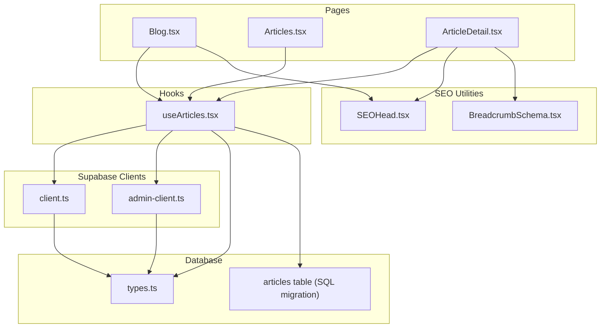
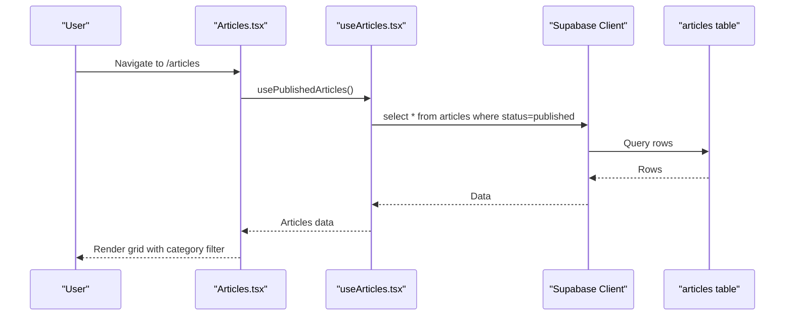
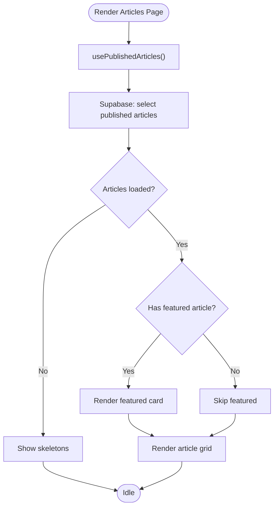
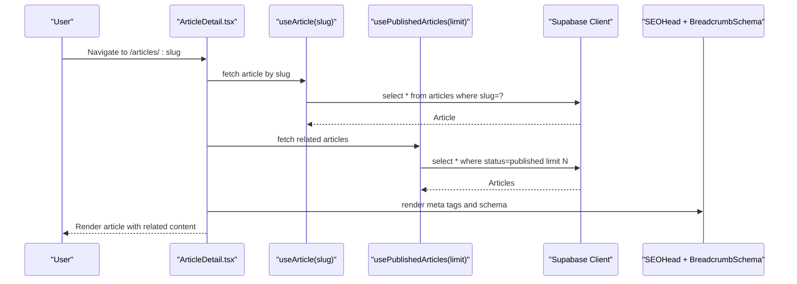
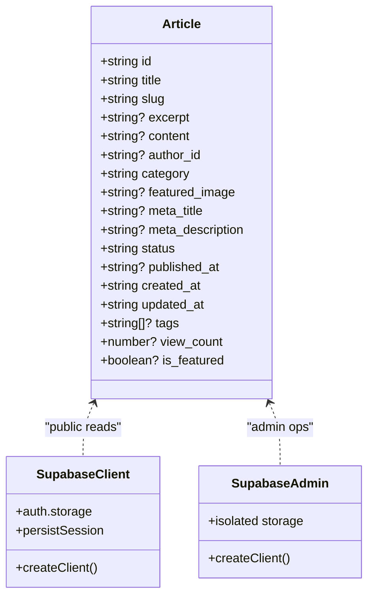
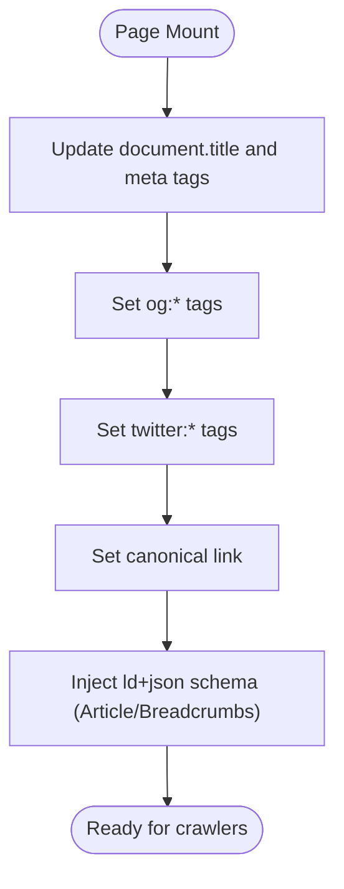
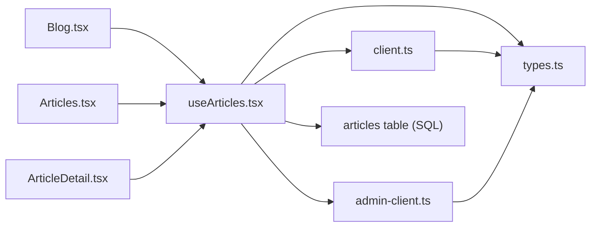

# Blog & Articles Management

<cite>
**Referenced Files in This Document**
- [Blog.tsx](file://src/pages/public/Blog.tsx)
- [Articles.tsx](file://src/pages/public/Articles.tsx)
- [ArticleDetail.tsx](file://src/pages/public/ArticleDetail.tsx)
- [useArticles.tsx](file://src/hooks/useArticles.tsx)
- [client.ts](file://src/integrations/supabase/client.ts)
- [admin-client.ts](file://src/integrations/supabase/admin-client.ts)
- [SEOHead.tsx](file://src/components/public/SEOHead.tsx)
- [BreadcrumbSchema.tsx](file://src/components/seo/BreadcrumbSchema.tsx)
- [20260108044609_38199a3a-f6a3-42ea-b892-ae6b88050934.sql](file://supabase/migrations/20260108044609_38199a3a-f6a3-42ea-b892-ae6b88050934.sql)
- [types.ts](file://src/integrations/supabase/types.ts)
</cite>

## Table of Contents
1. [Introduction](#introduction)
2. [Project Structure](#project-structure)
3. [Core Components](#core-components)
4. [Architecture Overview](#architecture-overview)
5. [Detailed Component Analysis](#detailed-component-analysis)
6. [Dependency Analysis](#dependency-analysis)
7. [Performance Considerations](#performance-considerations)
8. [Troubleshooting Guide](#troubleshooting-guide)
9. [Conclusion](#conclusion)

## Introduction
This document explains the blog and articles management system, covering article listing, individual article detail pages, categorization and filtering, content organization, SEO optimization, content loading and caching, Supabase integration, and responsive design patterns. It consolidates frontend pages, hooks, and Supabase schema to provide a complete understanding of how articles are fetched, filtered, presented, and optimized for search engines and performance.

## Project Structure
The blog and articles system spans three primary page components, a dedicated hook module for data fetching, Supabase clients for authenticated and admin access, and shared SEO utilities. The Supabase schema defines the articles table and associated row-level security policies.

**Diagram sources**
- [Blog.tsx](file://src/pages/public/Blog.tsx#L1-L355)
- [Articles.tsx](file://src/pages/public/Articles.tsx#L1-L204)
- [ArticleDetail.tsx](file://src/pages/public/ArticleDetail.tsx#L1-L239)
- [useArticles.tsx](file://src/hooks/useArticles.tsx#L1-L175)
- [client.ts](file://src/integrations/supabase/client.ts#L1-L17)
- [admin-client.ts](file://src/integrations/supabase/admin-client.ts#L1-L28)
- [SEOHead.tsx](file://src/components/public/SEOHead.tsx#L1-L75)
- [BreadcrumbSchema.tsx](file://src/components/seo/BreadcrumbSchema.tsx#L1-L29)
- [20260108044609_38199a3a-f6a3-42ea-b892-ae6b88050934.sql](file://supabase/migrations/20260108044609_38199a3a-f6a3-42ea-b892-ae6b88050934.sql#L10-L59)
- [types.ts](file://src/integrations/supabase/types.ts#L77-L136)

**Section sources**
- [Blog.tsx](file://src/pages/public/Blog.tsx#L1-L355)
- [Articles.tsx](file://src/pages/public/Articles.tsx#L1-L204)
- [ArticleDetail.tsx](file://src/pages/public/ArticleDetail.tsx#L1-L239)
- [useArticles.tsx](file://src/hooks/useArticles.tsx#L1-L175)
- [client.ts](file://src/integrations/supabase/client.ts#L1-L17)
- [admin-client.ts](file://src/integrations/supabase/admin-client.ts#L1-L28)
- [SEOHead.tsx](file://src/components/public/SEOHead.tsx#L1-L75)
- [BreadcrumbSchema.tsx](file://src/components/seo/BreadcrumbSchema.tsx#L1-L29)
- [20260108044609_38199a3a-f6a3-42ea-b892-ae6b88050934.sql](file://supabase/migrations/20260108044609_38199a3a-f6a3-42ea-b892-ae6b88050934.sql#L10-L59)
- [types.ts](file://src/integrations/supabase/types.ts#L77-L136)

## Core Components
- Article listing pages:
  - Blog page with mock data and category filtering.
  - Articles page using Supabase-backed hooks and category filtering.
- Individual article detail page with dynamic meta tags and structured data.
- Supabase integration via separate clients for authenticated and admin contexts.
- SEO utilities for meta tags, Open Graph, Twitter Cards, and canonical URLs.
- Database schema defining the articles table, statuses, and RLS policies.

**Section sources**
- [Blog.tsx](file://src/pages/public/Blog.tsx#L14-L95)
- [Articles.tsx](file://src/pages/public/Articles.tsx#L1-L204)
- [ArticleDetail.tsx](file://src/pages/public/ArticleDetail.tsx#L1-L239)
- [useArticles.tsx](file://src/hooks/useArticles.tsx#L1-L175)
- [client.ts](file://src/integrations/supabase/client.ts#L1-L17)
- [admin-client.ts](file://src/integrations/supabase/admin-client.ts#L1-L28)
- [SEOHead.tsx](file://src/components/public/SEOHead.tsx#L1-L75)
- [20260108044609_38199a3a-f6a3-42ea-b892-ae6b88050934.sql](file://supabase/migrations/20260108044609_38199a3a-f6a3-42ea-b892-ae6b88050934.sql#L10-L59)

## Architecture Overview
The system uses React Query for data fetching and caching, Supabase for content storage and RLS, and shared SEO utilities for metadata generation. The article listing and detail pages consume the same hooks to maintain consistency.

**Diagram sources**
- [Articles.tsx](file://src/pages/public/Articles.tsx#L14-L16)
- [useArticles.tsx](file://src/hooks/useArticles.tsx#L78-L96)
- [20260108044609_38199a3a-f6a3-42ea-b892-ae6b88050934.sql](file://supabase/migrations/20260108044609_38199a3a-f6a3-42ea-b892-ae6b88050934.sql#L34-L41)

**Section sources**
- [Articles.tsx](file://src/pages/public/Articles.tsx#L14-L16)
- [useArticles.tsx](file://src/hooks/useArticles.tsx#L78-L96)
- [client.ts](file://src/integrations/supabase/client.ts#L1-L17)
- [20260108044609_38199a3a-f6a3-42ea-b892-ae6b88050934.sql](file://supabase/migrations/20260108044609_38199a3a-f6a3-42ea-b892-ae6b88050934.sql#L34-L41)

## Detailed Component Analysis

### Article Listing Pages
- Blog page:
  - Uses mock data for demonstration and includes category filtering and search input.
  - Renders a featured article and a grid of other posts with animated layouts.
- Articles page:
  - Fetches published articles via React Query and supports category filtering.
  - Displays skeletons during loading and handles empty states.
  - Uses a shared category list for consistent labeling.

**Diagram sources**
- [Articles.tsx](file://src/pages/public/Articles.tsx#L14-L196)
- [useArticles.tsx](file://src/hooks/useArticles.tsx#L78-L96)

**Section sources**
- [Blog.tsx](file://src/pages/public/Blog.tsx#L99-L320)
- [Articles.tsx](file://src/pages/public/Articles.tsx#L14-L204)

### Individual Article Detail Page
- Loads a single article by slug using a dedicated hook.
- Generates dynamic meta tags and Open Graph properties.
- Embeds structured data (Article schema) for search engines.
- Computes estimated read time from content length.
- Provides related articles filtered by category.

**Diagram sources**
- [ArticleDetail.tsx](file://src/pages/public/ArticleDetail.tsx#L12-L86)
- [useArticles.tsx](file://src/hooks/useArticles.tsx#L62-L76)
- [useArticles.tsx](file://src/hooks/useArticles.tsx#L78-L96)
- [SEOHead.tsx](file://src/components/public/SEOHead.tsx#L13-L71)
- [BreadcrumbSchema.tsx](file://src/components/seo/BreadcrumbSchema.tsx#L10-L28)

**Section sources**
- [ArticleDetail.tsx](file://src/pages/public/ArticleDetail.tsx#L12-L239)
- [useArticles.tsx](file://src/hooks/useArticles.tsx#L62-L76)
- [useArticles.tsx](file://src/hooks/useArticles.tsx#L78-L96)
- [SEOHead.tsx](file://src/components/public/SEOHead.tsx#L13-L71)
- [BreadcrumbSchema.tsx](file://src/components/seo/BreadcrumbSchema.tsx#L10-L28)

### Supabase Integration and Data Model
- Two clients:
  - Public client for authenticated users and public reads.
  - Admin client with isolated storage for administrative operations.
- Hooks use the appropriate client depending on operation:
  - Admin operations (create/update/delete) use the admin client.
  - Public reads (listing and detail) use the public client.
- Articles table schema includes fields for title, slug, excerpt, content, author, category, featured image, SEO fields, status, timestamps, tags, view count, and featured flag.
- Row-level security policies:
  - Anyone can view published articles.
  - Admins can view, insert, update, and delete all articles.

**Diagram sources**
- [useArticles.tsx](file://src/hooks/useArticles.tsx#L6-L24)
- [client.ts](file://src/integrations/supabase/client.ts#L11-L17)
- [admin-client.ts](file://src/integrations/supabase/admin-client.ts#L16-L27)
- [20260108044609_38199a3a-f6a3-42ea-b892-ae6b88050934.sql](file://supabase/migrations/20260108044609_38199a3a-f6a3-42ea-b892-ae6b88050934.sql#L11-L29)
- [types.ts](file://src/integrations/supabase/types.ts#L77-L136)

**Section sources**
- [useArticles.tsx](file://src/hooks/useArticles.tsx#L1-L175)
- [client.ts](file://src/integrations/supabase/client.ts#L1-L17)
- [admin-client.ts](file://src/integrations/supabase/admin-client.ts#L1-L28)
- [20260108044609_38199a3a-f6a3-42ea-b892-ae6b88050934.sql](file://supabase/migrations/20260108044609_38199a3a-f6a3-42ea-b892-ae6b88050934.sql#L10-L59)
- [types.ts](file://src/integrations/supabase/types.ts#L77-L136)

### SEO Optimization
- Dynamic meta tags:
  - Title, description, keywords, author, canonical URL, Open Graph, and Twitter Card tags are injected per page.
- Structured data:
  - Article detail page embeds schema.org Article markup for improved search visibility.
- Breadcrumb schema:
  - Utility component generates breadcrumb list schema for navigation context.

**Diagram sources**
- [SEOHead.tsx](file://src/components/public/SEOHead.tsx#L22-L71)
- [ArticleDetail.tsx](file://src/pages/public/ArticleDetail.tsx#L88-L111)
- [BreadcrumbSchema.tsx](file://src/components/seo/BreadcrumbSchema.tsx#L10-L28)

**Section sources**
- [SEOHead.tsx](file://src/components/public/SEOHead.tsx#L13-L71)
- [ArticleDetail.tsx](file://src/pages/public/ArticleDetail.tsx#L78-L111)
- [BreadcrumbSchema.tsx](file://src/components/seo/BreadcrumbSchema.tsx#L10-L28)

### Content Organization Strategies
- Categories:
  - Centralized category list in the hook module for consistent filtering across pages.
- Status management:
  - Draft, published, archived statuses control visibility and retrieval.
- Featured content:
  - Dedicated field and UI treatment for highlighting key articles.
- Tagging:
  - Free-text tags stored as arrays enable flexible grouping and discovery.

**Section sources**
- [useArticles.tsx](file://src/hooks/useArticles.tsx#L167-L175)
- [20260108044609_38199a3a-f6a3-42ea-b892-ae6b88050934.sql](file://supabase/migrations/20260108044609_38199a3a-f6a3-42ea-b892-ae6b88050934.sql#L22-L28)

## Dependency Analysis
- Pages depend on hooks for data fetching and on SEO utilities for metadata.
- Hooks depend on Supabase clients and types for type-safe operations.
- Supabase clients depend on environment variables for configuration.
- Database schema defines the contract for article fields and RLS policies.

**Diagram sources**
- [Blog.tsx](file://src/pages/public/Blog.tsx#L1-L12)
- [Articles.tsx](file://src/pages/public/Articles.tsx#L1-L12)
- [ArticleDetail.tsx](file://src/pages/public/ArticleDetail.tsx#L1-L10)
- [useArticles.tsx](file://src/hooks/useArticles.tsx#L1-L4)
- [client.ts](file://src/integrations/supabase/client.ts#L5-L17)
- [admin-client.ts](file://src/integrations/supabase/admin-client.ts#L4-L27)
- [types.ts](file://src/integrations/supabase/types.ts#L77-L136)
- [20260108044609_38199a3a-f6a3-42ea-b892-ae6b88050934.sql](file://supabase/migrations/20260108044609_38199a3a-f6a3-42ea-b892-ae6b88050934.sql#L10-L29)

**Section sources**
- [Blog.tsx](file://src/pages/public/Blog.tsx#L1-L12)
- [Articles.tsx](file://src/pages/public/Articles.tsx#L1-L12)
- [ArticleDetail.tsx](file://src/pages/public/ArticleDetail.tsx#L1-L10)
- [useArticles.tsx](file://src/hooks/useArticles.tsx#L1-L4)
- [client.ts](file://src/integrations/supabase/client.ts#L5-L17)
- [admin-client.ts](file://src/integrations/supabase/admin-client.ts#L4-L27)
- [types.ts](file://src/integrations/supabase/types.ts#L77-L136)
- [20260108044609_38199a3a-f6a3-42ea-b892-ae6b88050934.sql](file://supabase/migrations/20260108044609_38199a3a-f6a3-42ea-b892-ae6b88050934.sql#L10-L29)

## Performance Considerations
- Data fetching and caching:
  - React Query manages caching and invalidation for article lists and detail pages, reducing redundant network requests.
- Pagination and limits:
  - Hooks support limiting results (e.g., related articles), preventing excessive payload sizes.
- Skeleton loaders:
  - Articles page uses skeleton cards to improve perceived performance during initial load.
- Client separation:
  - Using separate clients reduces cross-session interference and improves reliability for admin operations.
- Responsive design:
  - Grid layouts adapt across breakpoints, and lazy image loading can be considered for further optimization.

[No sources needed since this section provides general guidance]

## Troubleshooting Guide
- Articles not appearing:
  - Verify status is published; public reads only show published articles.
  - Confirm slug uniqueness and correctness in the articles table.
- Meta tags not updating:
  - Ensure SEOHead props are passed correctly and the component mounts before navigation.
- Structured data errors:
  - Validate schema JSON is properly serialized and embedded in the head.
- Admin operations failing:
  - Confirm admin client is used for mutations and that RLS allows admin access.

**Section sources**
- [20260108044609_38199a3a-f6a3-42ea-b892-ae6b88050934.sql](file://supabase/migrations/20260108044609_38199a3a-f6a3-42ea-b892-ae6b88050934.sql#L34-L53)
- [SEOHead.tsx](file://src/components/public/SEOHead.tsx#L22-L71)
- [ArticleDetail.tsx](file://src/pages/public/ArticleDetail.tsx#L88-L111)
- [useArticles.tsx](file://src/hooks/useArticles.tsx#L99-L165)

## Conclusion
The blog and articles management system integrates Supabase-backed data fetching with robust SEO utilities and responsive UI patterns. Article listing and detail pages share a unified data layer, while category filtering and status controls provide flexible content organization. The schema and RLS policies ensure secure and controlled access, and the hooks encapsulate caching and error handling for reliable performance.