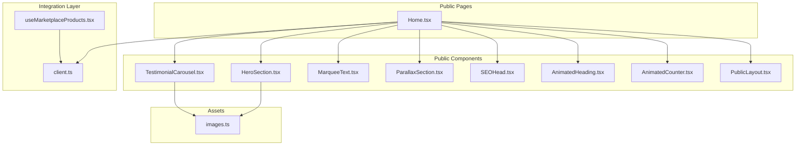
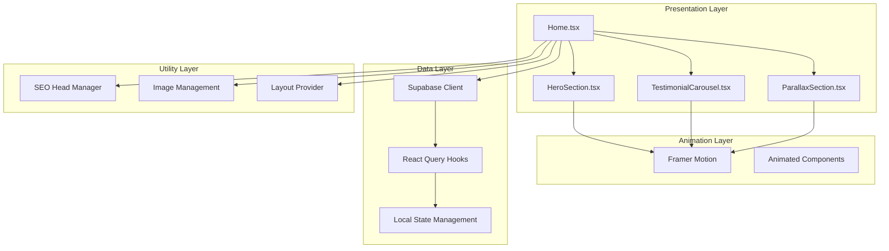
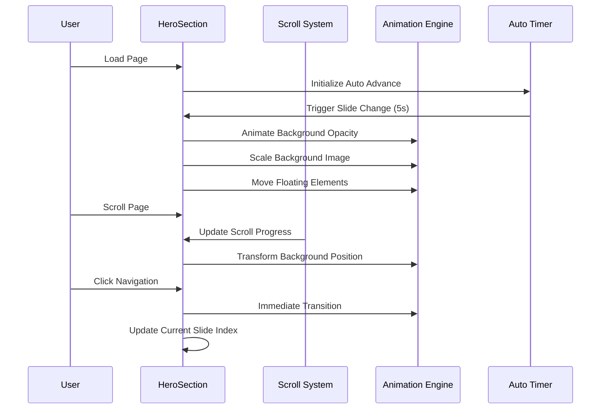
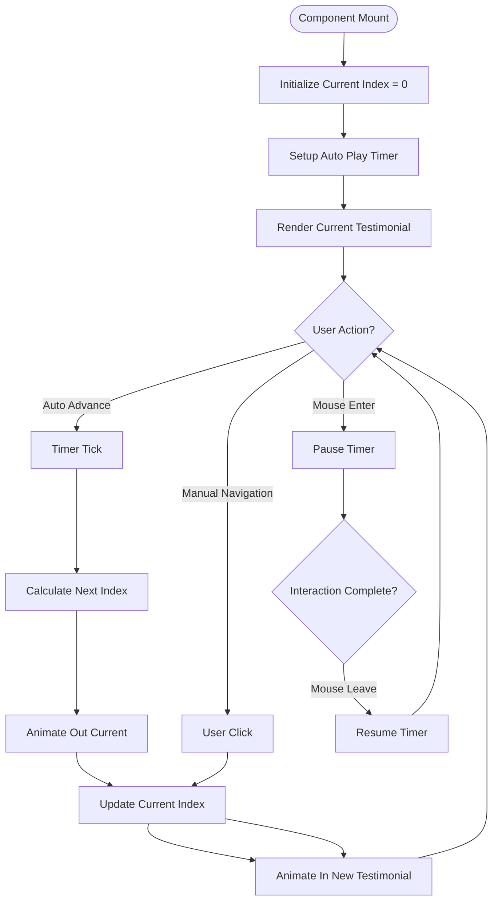
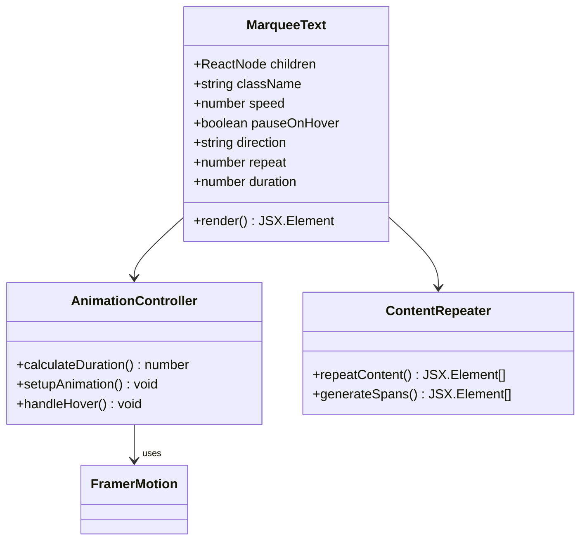
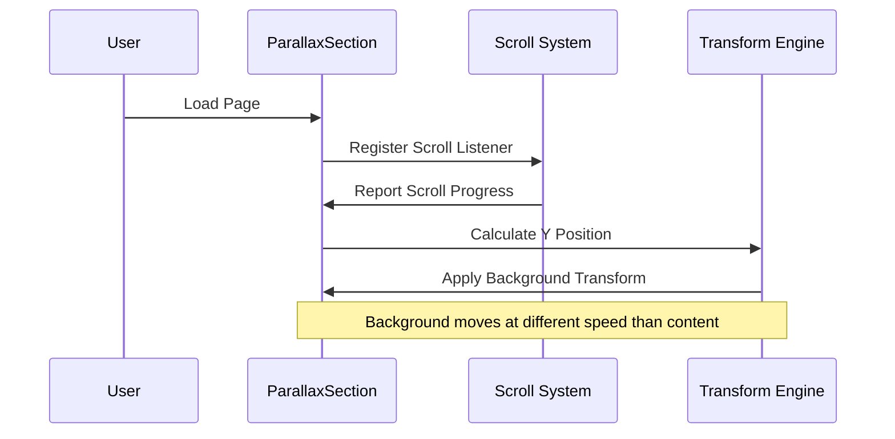
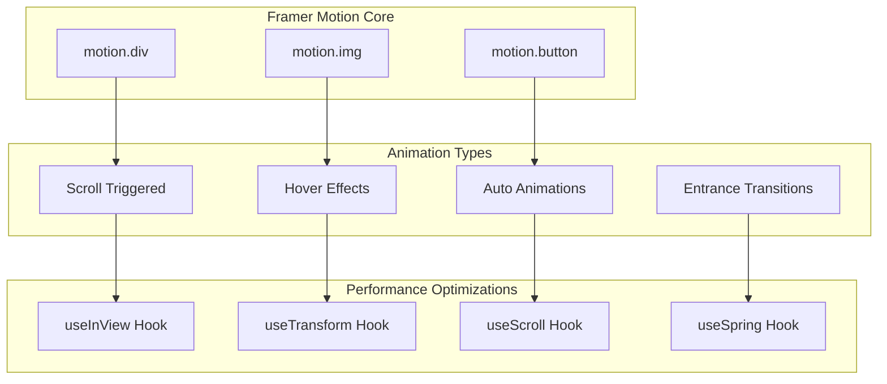
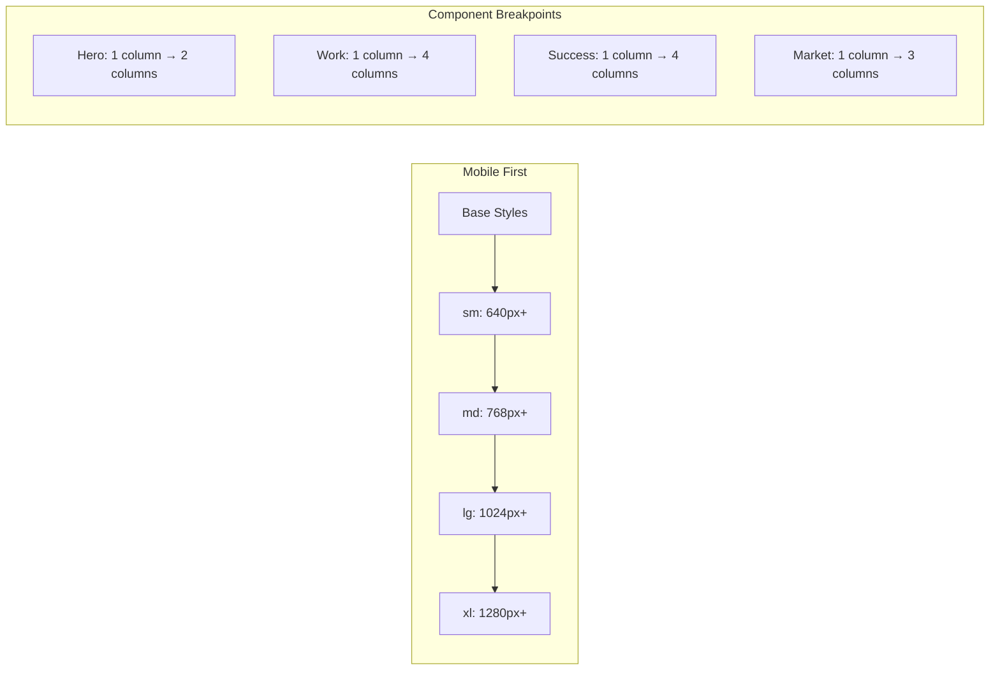
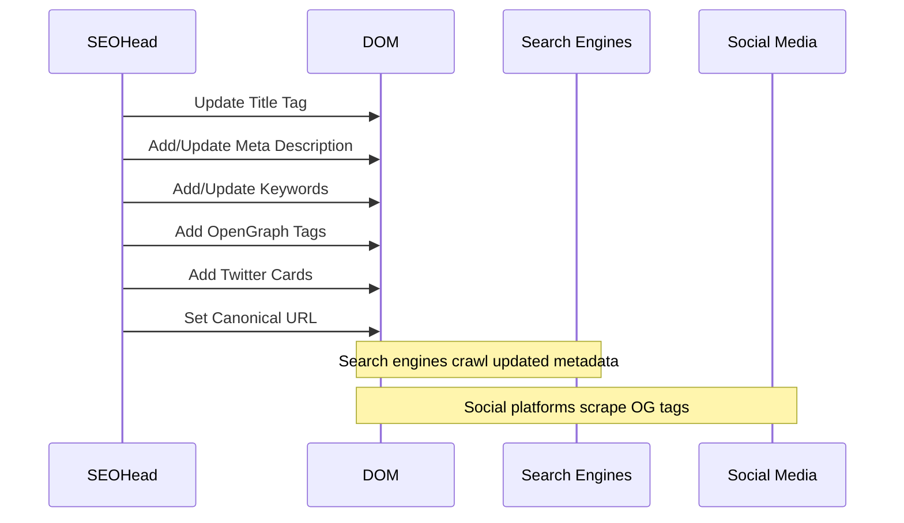
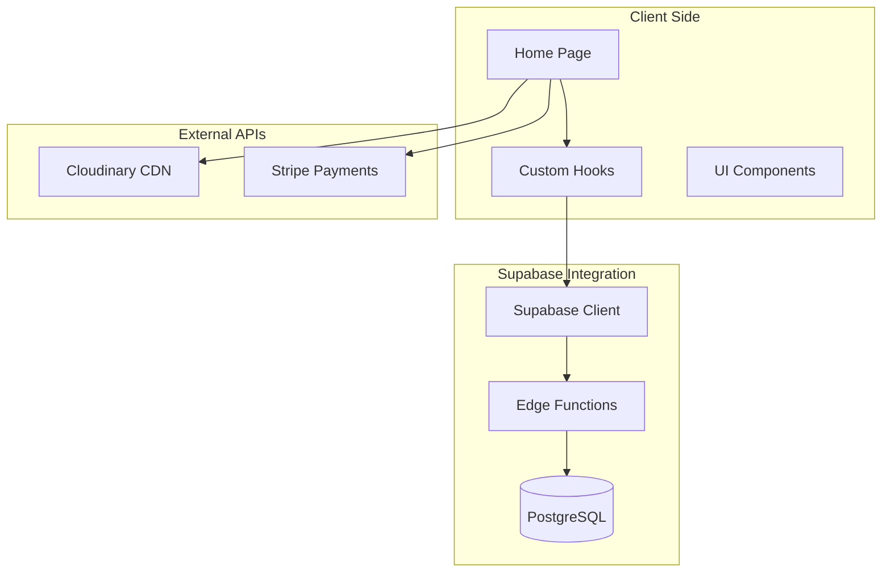

# Home Page Implementation

<cite>
**Referenced Files in This Document**
- [Home.tsx](file://src/pages/public/Home.tsx)
- [HeroSection.tsx](file://src/components/public/HeroSection.tsx)
- [TestimonialCarousel.tsx](file://src/components/public/TestimonialCarousel.tsx)
- [MarqueeText.tsx](file://src/components/public/MarqueeText.tsx)
- [ParallaxSection.tsx](file://src/components/public/ParallaxSection.tsx)
- [SEOHead.tsx](file://src/components/public/SEOHead.tsx)
- [AnimatedHeading.tsx](file://src/components/public/AnimatedHeading.tsx)
- [AnimatedCounter.tsx](file://src/components/public/AnimatedCounter.tsx)
- [FloatingElements.tsx](file://src/components/public/FloatingElements.tsx)
- [PublicLayout.tsx](file://src/components/public/PublicLayout.tsx)
- [client.ts](file://src/integrations/supabase/client.ts)
- [useMarketplaceProducts.tsx](file://src/hooks/useMarketplaceProducts.tsx)
- [images.ts](file://src/lib/images.ts)
</cite>

## Table of Contents
1. [Introduction](#introduction)
2. [Project Structure](#project-structure)
3. [Core Components](#core-components)
4. [Architecture Overview](#architecture-overview)
5. [Detailed Component Analysis](#detailed-component-analysis)
6. [Animation System](#animation-system)
7. [Responsive Design Patterns](#responsive-design-patterns)
8. [SEO Optimization](#seo-optimization)
9. [Performance Considerations](#performance-considerations)
10. [Data Flow and Supabase Integration](#data-flow-and-supabase-integration)
11. [Troubleshooting Guide](#troubleshooting-guide)
12. [Conclusion](#conclusion)

## Introduction

The Adorzia home page implementation represents a modern, performance-focused React application built with Next.js and Framer Motion. This comprehensive documentation covers the hero section with animated elements, the "How Adorzia Works" four-step process, StyleBoxes overview with category listings, designer success path visualization, marketplace preview showcase, strategic advantages section, and testimonial carousel.

The implementation leverages advanced animation techniques, responsive design patterns, and dynamic content management through Supabase integration. The page follows modern web standards with optimized performance, accessibility, and SEO best practices.

## Project Structure

The home page implementation follows a modular component-based architecture with clear separation of concerns:

**Diagram sources**
- [Home.tsx](file://src/pages/public/Home.tsx#L1-L505)
- [HeroSection.tsx](file://src/components/public/HeroSection.tsx#L1-L249)
- [client.ts](file://src/integrations/supabase/client.ts#L1-L17)

**Section sources**
- [Home.tsx](file://src/pages/public/Home.tsx#L1-L505)
- [PublicLayout.tsx](file://src/components/public/PublicLayout.tsx#L1-L42)

## Core Components

The home page consists of several key components that work together to create an engaging user experience:

### Hero Section
The hero section serves as the primary attention-grabbing element featuring:
- Full-screen background slideshow with Ken Burns effect
- Floating decorative elements with continuous animations
- Interactive slide navigation controls
- Animated statistics counters
- Call-to-action buttons with hover effects

### Testimonial Carousel
A sophisticated carousel system that:
- Automatically cycles through testimonials
- Provides manual navigation controls
- Includes smooth transitions between testimonials
- Supports both image avatars and placeholder initials

### Marquee Text
A horizontally scrolling text component for brand announcements with:
- Configurable speed and direction
- Hover pause functionality
- Repeating content pattern
- Responsive design considerations

### Parallax Section
A scroll-responsive background section that:
- Creates depth perception through background movement
- Supports custom background images
- Allows adjustable parallax speed
- Includes optional overlay effects

**Section sources**
- [HeroSection.tsx](file://src/components/public/HeroSection.tsx#L32-L249)
- [TestimonialCarousel.tsx](file://src/components/public/TestimonialCarousel.tsx#L18-L130)
- [MarqueeText.tsx](file://src/components/public/MarqueeText.tsx#L13-L51)
- [ParallaxSection.tsx](file://src/components/public/ParallaxSection.tsx#L12-L49)

## Architecture Overview

The home page architecture implements a layered approach with clear component hierarchy and data flow:

**Diagram sources**
- [Home.tsx](file://src/pages/public/Home.tsx#L106-L504)
- [client.ts](file://src/integrations/supabase/client.ts#L11-L17)

## Detailed Component Analysis

### Hero Section Implementation

The hero section represents the most complex animated component on the page, implementing multiple animation systems simultaneously:

**Diagram sources**
- [HeroSection.tsx](file://src/components/public/HeroSection.tsx#L35-L50)
- [HeroSection.tsx](file://src/components/public/HeroSection.tsx#L58-L75)

The hero section implements several advanced animation techniques:

1. **Background Slideshow**: Three background images with fade transitions and Ken Burns effect
2. **Scroll-Triggered Animations**: Background parallax and content opacity changes based on scroll position
3. **Continuous Floating Elements**: Decorative circles with synchronized floating animations
4. **Auto-Advancing Mechanism**: 5-second intervals for slide transitions
5. **Interactive Controls**: Manual navigation with smooth transitions

**Section sources**
- [HeroSection.tsx](file://src/components/public/HeroSection.tsx#L32-L249)

### Testimonial Carousel System

The testimonial carousel provides a sophisticated content presentation system:

**Diagram sources**
- [TestimonialCarousel.tsx](file://src/components/public/TestimonialCarousel.tsx#L25-L31)
- [TestimonialCarousel.tsx](file://src/components/public/TestimonialCarousel.tsx#L47-L92)

**Section sources**
- [TestimonialCarousel.tsx](file://src/components/public/TestimonialCarousel.tsx#L18-L130)

### Marquee Text Component

The marquee text component implements horizontal scrolling with configurable parameters:

**Diagram sources**
- [MarqueeText.tsx](file://src/components/public/MarqueeText.tsx#L13-L48)

**Section sources**
- [MarqueeText.tsx](file://src/components/public/MarqueeText.tsx#L13-L51)

### Parallax Section Implementation

The parallax section creates depth perception through background movement:

**Diagram sources**
- [ParallaxSection.tsx](file://src/components/public/ParallaxSection.tsx#L20-L25)

**Section sources**
- [ParallaxSection.tsx](file://src/components/public/ParallaxSection.tsx#L12-L49)

## Animation System

The animation system is built entirely on Framer Motion, providing smooth, performant animations across all components:

### Animation Architecture

**Diagram sources**
- [HeroSection.tsx](file://src/components/public/HeroSection.tsx#L35-L42)
- [AnimatedCounter.tsx](file://src/components/public/AnimatedCounter.tsx#L19-L25)

### Animation Patterns Used

1. **Scroll-Triggered Animations**: Background parallax and content entrance animations
2. **Hover Interactions**: Button scaling, card elevation, and image zoom effects
3. **Auto-Animations**: Continuous floating elements and background movements
4. **Entrance Transitions**: Staggered animations for grid layouts
5. **Exit Animations**: Smooth transitions for content changes

**Section sources**
- [HeroSection.tsx](file://src/components/public/HeroSection.tsx#L82-L91)
- [AnimatedCounter.tsx](file://src/components/public/AnimatedCounter.tsx#L19-L54)

## Responsive Design Patterns

The implementation follows mobile-first responsive design principles with breakpoints optimized for various screen sizes:

### Responsive Grid Systems

**Diagram sources**
- [Home.tsx](file://src/pages/public/Home.tsx#L164-L191)
- [Home.tsx](file://src/pages/public/Home.tsx#L296-L321)

### Responsive Typography

The typography system scales appropriately across devices:
- Hero headings: 5xl → 8xl (mobile → desktop)
- Section headings: 3xl → 4xl
- Body text: Scales with fluid typography principles

### Interactive Responsiveness

- Touch-friendly button sizes (minimum 44px)
- Appropriate spacing for mobile interaction
- Simplified animations on lower-powered devices

**Section sources**
- [Home.tsx](file://src/pages/public/Home.tsx#L141-L193)
- [Home.tsx](file://src/pages/public/Home.tsx#L272-L323)

## SEO Optimization

The SEO implementation ensures optimal search engine visibility and social media sharing:

### Dynamic Meta Tag Management

**Diagram sources**
- [SEOHead.tsx](file://src/components/public/SEOHead.tsx#L22-L69)

### SEO Features Implemented

1. **Dynamic Title Updates**: Component-specific page titles
2. **OpenGraph Integration**: Facebook and LinkedIn sharing optimization
3. **Twitter Card Support**: Twitter preview optimization
4. **Canonical URL Management**: Prevents duplicate content issues
5. **Structured Metadata**: Author, keywords, and description management

**Section sources**
- [SEOHead.tsx](file://src/components/public/SEOHead.tsx#L13-L75)

## Performance Considerations

The implementation prioritizes performance through several optimization strategies:

### Lazy Loading and Code Splitting

- Route-based code splitting for page components
- Image lazy loading with proper aspect ratios
- Conditional component loading based on viewport

### Animation Performance

- GPU-accelerated transforms using transform properties
- Efficient use of useInView hook for scroll-triggered animations
- Optimized animation durations and easing functions

### Memory Management

- Proper cleanup of timers and scroll listeners
- Efficient state management with React hooks
- Cleanup of DOM manipulations in useEffect

### Bundle Optimization

- Tree-shaking of unused components
- Minimal dependencies for animation libraries
- Optimized image imports and CDN usage

**Section sources**
- [HeroSection.tsx](file://src/components/public/HeroSection.tsx#L45-L50)
- [AnimatedCounter.tsx](file://src/components/public/AnimatedCounter.tsx#L27-L31)

## Data Flow and Supabase Integration

The home page integrates with Supabase for dynamic content management and marketplace data:

### Data Architecture

**Diagram sources**
- [client.ts](file://src/integrations/supabase/client.ts#L11-L17)
- [useMarketplaceProducts.tsx](file://src/hooks/useMarketplaceProducts.tsx#L83-L126)

### Supabase Integration Details

The marketplace integration uses Supabase Edge Functions for server-side data fetching:

1. **Marketplace Products**: Real-time product listings with filtering
2. **Category Management**: Dynamic category-based product organization
3. **Designer Profiles**: Creator information and portfolio links
4. **Image Management**: Cloudinary integration for optimized image delivery

**Section sources**
- [useMarketplaceProducts.tsx](file://src/hooks/useMarketplaceProducts.tsx#L83-L209)
- [client.ts](file://src/integrations/supabase/client.ts#L11-L17)

## Troubleshooting Guide

### Common Issues and Solutions

#### Animation Performance Issues
- **Problem**: Choppy animations on lower-end devices
- **Solution**: Reduce animation complexity, use transform properties only, implement frame rate monitoring

#### Scroll Trigger Failures
- **Problem**: Animations not triggering on scroll
- **Solution**: Verify useInView configuration, check element visibility, ensure proper container setup

#### Image Loading Problems
- **Problem**: Slow image loading affecting UX
- **Solution**: Implement lazy loading, use appropriate image formats, configure proper aspect ratios

#### SEO Meta Tag Conflicts
- **Problem**: Duplicate or conflicting meta tags
- **Solution**: Ensure unique meta tag management, verify canonical URL setup, check for conflicting third-party scripts

#### Supabase Integration Issues
- **Problem**: API calls failing or timing out
- **Solution**: Verify environment variable configuration, check network connectivity, implement proper error handling

**Section sources**
- [HeroSection.tsx](file://src/components/public/HeroSection.tsx#L35-L42)
- [SEOHead.tsx](file://src/components/public/SEOHead.tsx#L22-L69)

## Conclusion

The Adorzia home page implementation demonstrates a sophisticated approach to modern web development, combining advanced animation techniques with robust performance optimization and comprehensive SEO practices. The modular component architecture ensures maintainability and scalability, while the Supabase integration provides flexible content management capabilities.

Key achievements include:
- Seamless scroll-triggered animations without performance degradation
- Responsive design patterns that work across all device types
- Comprehensive SEO optimization with dynamic meta tag management
- Efficient data fetching and caching strategies
- Accessible user interface with proper semantic markup

The implementation serves as a strong foundation for future enhancements and maintains compatibility with modern web standards and best practices.