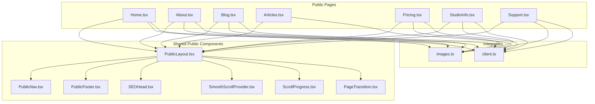
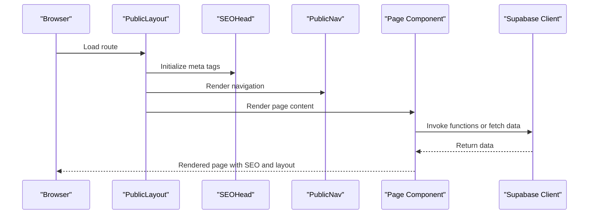
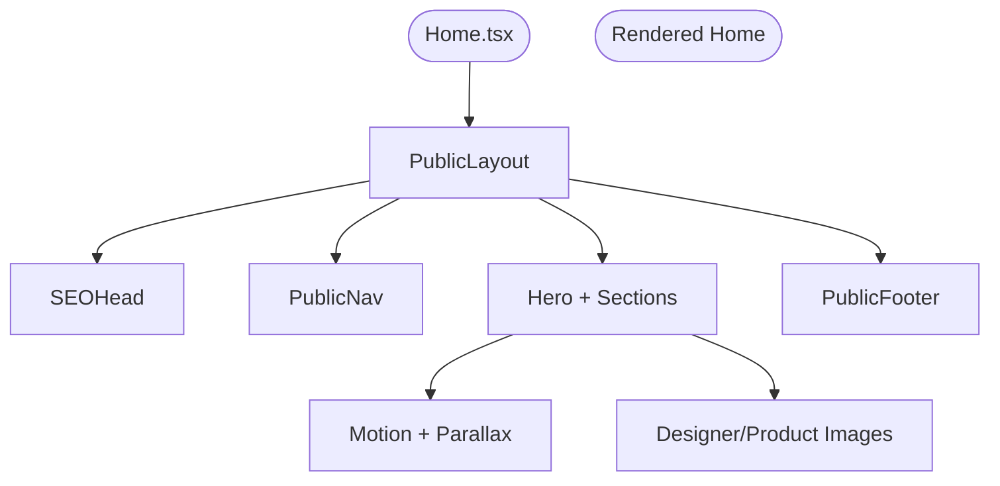
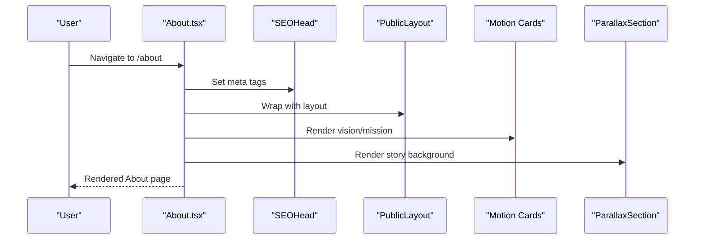
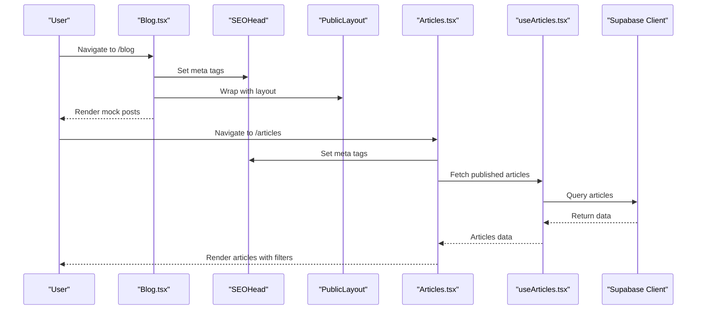
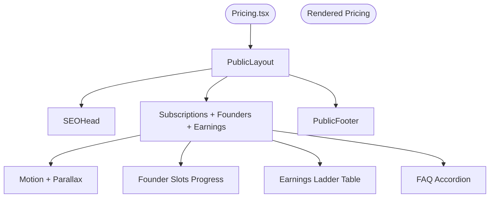
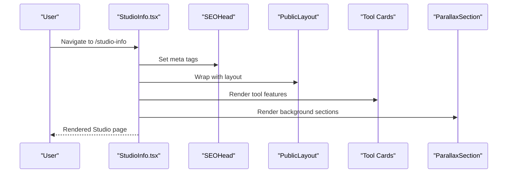
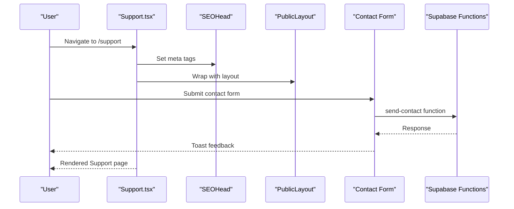
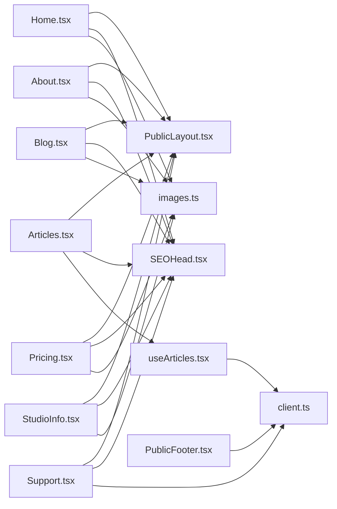

# Public Website Features

<cite>
**Referenced Files in This Document**
- [Home.tsx](file://src/pages/public/Home.tsx)
- [About.tsx](file://src/pages/public/About.tsx)
- [Blog.tsx](file://src/pages/public/Blog.tsx)
- [Articles.tsx](file://src/pages/public/Articles.tsx)
- [Pricing.tsx](file://src/pages/public/Pricing.tsx)
- [StudioInfo.tsx](file://src/pages/public/StudioInfo.tsx)
- [Support.tsx](file://src/pages/public/Support.tsx)
- [PublicLayout.tsx](file://src/components/public/PublicLayout.tsx)
- [PublicNav.tsx](file://src/components/public/PublicNav.tsx)
- [PublicFooter.tsx](file://src/components/public/PublicFooter.tsx)
- [SEOHead.tsx](file://src/components/public/SEOHead.tsx)
- [SmoothScrollProvider.tsx](file://src/components/public/SmoothScrollProvider.tsx)
- [ScrollProgress.tsx](file://src/components/public/ScrollProgress.tsx)
- [PageTransition.tsx](file://src/components/public/PageTransition.tsx)
- [useArticles.tsx](file://src/hooks/useArticles.tsx)
- [client.ts](file://src/integrations/supabase/client.ts)
- [images.ts](file://src/lib/images.ts)
</cite>

## Table of Contents
1. [Introduction](#introduction)
2. [Project Structure](#project-structure)
3. [Core Components](#core-components)
4. [Architecture Overview](#architecture-overview)
5. [Detailed Component Analysis](#detailed-component-analysis)
6. [Dependency Analysis](#dependency-analysis)
7. [Performance Considerations](#performance-considerations)
8. [Troubleshooting Guide](#troubleshooting-guide)
9. [Conclusion](#conclusion)

## Introduction
This document explains the public website features of the Adorzia platform, focusing on the home page, about us, blog/articles management, pricing display, studio information, and support center. It covers content management approaches, SEO optimization, responsive design, navigation structure, user journeys, conversion strategies, Supabase integration for dynamic content, image optimization, and performance monitoring.

## Project Structure
The public-facing pages are organized under `src/pages/public`, each implementing a dedicated route and leveraging shared public components for layout, navigation, SEO, and performance enhancements. Supabase integration is centralized under `src/integrations/supabase`, and reusable UI components are located under `src/components/public`.

**Diagram sources**
- [Home.tsx](file://src/pages/public/Home.tsx#L1-L505)
- [About.tsx](file://src/pages/public/About.tsx#L1-L546)
- [Blog.tsx](file://src/pages/public/Blog.tsx#L1-L355)
- [Articles.tsx](file://src/pages/public/Articles.tsx#L1-L204)
- [Pricing.tsx](file://src/pages/public/Pricing.tsx#L1-L849)
- [StudioInfo.tsx](file://src/pages/public/StudioInfo.tsx#L1-L387)
- [Support.tsx](file://src/pages/public/Support.tsx#L1-L201)
- [PublicLayout.tsx](file://src/components/public/PublicLayout.tsx#L1-L42)
- [PublicNav.tsx](file://src/components/public/PublicNav.tsx#L1-L282)
- [PublicFooter.tsx](file://src/components/public/PublicFooter.tsx#L1-L260)
- [SEOHead.tsx](file://src/components/public/SEOHead.tsx#L1-L75)
- [SmoothScrollProvider.tsx](file://src/components/public/SmoothScrollProvider.tsx#L1-L40)
- [ScrollProgress.tsx](file://src/components/public/ScrollProgress.tsx#L1-L20)
- [PageTransition.tsx](file://src/components/public/PageTransition.tsx#L1-L45)
- [client.ts](file://src/integrations/supabase/client.ts#L1-L17)
- [images.ts](file://src/lib/images.ts#L1-L95)

**Section sources**
- [PublicLayout.tsx](file://src/components/public/PublicLayout.tsx#L1-L42)
- [PublicNav.tsx](file://src/components/public/PublicNav.tsx#L1-L282)
- [PublicFooter.tsx](file://src/components/public/PublicFooter.tsx#L1-L260)
- [SEOHead.tsx](file://src/components/public/SEOHead.tsx#L1-L75)
- [SmoothScrollProvider.tsx](file://src/components/public/SmoothScrollProvider.tsx#L1-L40)
- [ScrollProgress.tsx](file://src/components/public/ScrollProgress.tsx#L1-L20)
- [PageTransition.tsx](file://src/components/public/PageTransition.tsx#L1-L45)
- [client.ts](file://src/integrations/supabase/client.ts#L1-L17)
- [images.ts](file://src/lib/images.ts#L1-L95)

## Core Components
- PublicLayout orchestrates the page shell, optional preloader, scroll progress, announcement banner, navigation, page transitions, and footer.
- PublicNav defines the desktop and mobile navigation with primary and secondary menus, active state highlighting, and responsive behavior.
- PublicFooter provides site-wide navigation, newsletter subscription with Supabase function invocation, and legal links.
- SEOHead dynamically sets document title, meta tags, Open Graph, Twitter Card, and canonical URL.
- SmoothScrollProvider integrates Lenis for smooth scrolling with reduced-motion detection.
- ScrollProgress and PageTransition enhance perceived performance and navigation polish.

**Section sources**
- [PublicLayout.tsx](file://src/components/public/PublicLayout.tsx#L1-L42)
- [PublicNav.tsx](file://src/components/public/PublicNav.tsx#L1-L282)
- [PublicFooter.tsx](file://src/components/public/PublicFooter.tsx#L1-L260)
- [SEOHead.tsx](file://src/components/public/SEOHead.tsx#L1-L75)
- [SmoothScrollProvider.tsx](file://src/components/public/SmoothScrollProvider.tsx#L1-L40)
- [ScrollProgress.tsx](file://src/components/public/ScrollProgress.tsx#L1-L20)
- [PageTransition.tsx](file://src/components/public/PageTransition.tsx#L1-L45)

## Architecture Overview
The public website follows a modular React architecture with:
- Route-specific pages under src/pages/public implementing page-level SEO and layout.
- Shared public components for consistent UX and performance.
- Supabase client for serverless functions and database queries.
- Centralized image URLs for optimized asset management.

**Diagram sources**
- [PublicLayout.tsx](file://src/components/public/PublicLayout.tsx#L1-L42)
- [SEOHead.tsx](file://src/components/public/SEOHead.tsx#L1-L75)
- [PublicNav.tsx](file://src/components/public/PublicNav.tsx#L1-L282)
- [Home.tsx](file://src/pages/public/Home.tsx#L1-L505)
- [client.ts](file://src/integrations/supabase/client.ts#L1-L17)

## Detailed Component Analysis

### Home Page
The home page presents a unified journey from learning to earning, showcasing StyleBoxes, marketplace preview, testimonials, and strategic advantages. It leverages:
- PublicLayout with optional preloader and smooth scroll.
- SEOHead for page metadata.
- Motion animations and responsive grids.
- Centralized image references for designers and products.

**Diagram sources**
- [Home.tsx](file://src/pages/public/Home.tsx#L1-L505)
- [PublicLayout.tsx](file://src/components/public/PublicLayout.tsx#L1-L42)
- [SEOHead.tsx](file://src/components/public/SEOHead.tsx#L1-L75)
- [PublicNav.tsx](file://src/components/public/PublicNav.tsx#L1-L282)
- [PublicFooter.tsx](file://src/components/public/PublicFooter.tsx#L1-L260)
- [images.ts](file://src/lib/images.ts#L1-L95)

**Section sources**
- [Home.tsx](file://src/pages/public/Home.tsx#L1-L505)
- [images.ts](file://src/lib/images.ts#L1-L95)

### About Us
The about page communicates mission, vision, unique differentiators, leadership, press highlights, and statistics. It uses:
- PublicLayout and SEOHead.
- Motion cards and parallax sections.
- Social links integration.

**Diagram sources**
- [About.tsx](file://src/pages/public/About.tsx#L1-L546)
- [SEOHead.tsx](file://src/components/public/SEOHead.tsx#L1-L75)
- [PublicLayout.tsx](file://src/components/public/PublicLayout.tsx#L1-L42)

**Section sources**
- [About.tsx](file://src/pages/public/About.tsx#L1-L546)

### Blog and Articles Management
There are two article surfaces:
- Blog.tsx: editorial-style listing with search and category filtering, using mock data and SEO metadata.
- Articles.tsx: public listing powered by Supabase queries via useArticles hook, with category filtering and loading states.

**Diagram sources**
- [Blog.tsx](file://src/pages/public/Blog.tsx#L1-L355)
- [Articles.tsx](file://src/pages/public/Articles.tsx#L1-L204)
- [useArticles.tsx](file://src/hooks/useArticles.tsx#L1-L175)
- [SEOHead.tsx](file://src/components/public/SEOHead.tsx#L1-L75)
- [PublicLayout.tsx](file://src/components/public/PublicLayout.tsx#L1-L42)
- [client.ts](file://src/integrations/supabase/client.ts#L1-L17)

**Section sources**
- [Blog.tsx](file://src/pages/public/Blog.tsx#L1-L355)
- [Articles.tsx](file://src/pages/public/Articles.tsx#L1-L204)
- [useArticles.tsx](file://src/hooks/useArticles.tsx#L1-L175)

### Pricing Display
The pricing page showcases subscription tiers, Founder Titles, earnings ladder, and transparency notes. It integrates:
- PublicLayout and SEOHead.
- Animated counters and progress bars.
- Founder slots fetching via useFounderSlots.
- FAQ accordion grouped by categories.

**Diagram sources**
- [Pricing.tsx](file://src/pages/public/Pricing.tsx#L1-L849)
- [PublicLayout.tsx](file://src/components/public/PublicLayout.tsx#L1-L42)
- [SEOHead.tsx](file://src/components/public/SEOHead.tsx#L1-L75)
- [PublicFooter.tsx](file://src/components/public/PublicFooter.tsx#L1-L260)

**Section sources**
- [Pricing.tsx](file://src/pages/public/Pricing.tsx#L1-L849)

### Studio Information
StudioInfo presents professional design tools, asset library, and deep-dives into pattern tools, moodboard builder, and tech pack automation. It uses:
- PublicLayout and SEOHead.
- Motion cards and parallax backgrounds.
- Centralized image references.

**Diagram sources**
- [StudioInfo.tsx](file://src/pages/public/StudioInfo.tsx#L1-L387)
- [SEOHead.tsx](file://src/components/public/SEOHead.tsx#L1-L75)
- [PublicLayout.tsx](file://src/components/public/PublicLayout.tsx#L1-L42)
- [images.ts](file://src/lib/images.ts#L1-L95)

**Section sources**
- [StudioInfo.tsx](file://src/pages/public/StudioInfo.tsx#L1-L387)
- [images.ts](file://src/lib/images.ts#L1-L95)

### Support Center
The support page aggregates FAQs by category, provides quick links, and includes a contact form that invokes a Supabase Edge Function. It also displays policies and legal links.

**Diagram sources**
- [Support.tsx](file://src/pages/public/Support.tsx#L1-L201)
- [SEOHead.tsx](file://src/components/public/SEOHead.tsx#L1-L75)
- [PublicLayout.tsx](file://src/components/public/PublicLayout.tsx#L1-L42)
- [client.ts](file://src/integrations/supabase/client.ts#L1-L17)

**Section sources**
- [Support.tsx](file://src/pages/public/Support.tsx#L1-L201)

## Dependency Analysis
- Pages depend on PublicLayout for consistent shell and on SEOHead for metadata.
- PublicNav and PublicFooter are reused across pages for navigation and footer.
- Supabase client is used for serverless functions and database queries in multiple pages.
- Centralized image URLs are imported by pages and components for consistent asset management.

**Diagram sources**
- [Home.tsx](file://src/pages/public/Home.tsx#L1-L505)
- [About.tsx](file://src/pages/public/About.tsx#L1-L546)
- [Blog.tsx](file://src/pages/public/Blog.tsx#L1-L355)
- [Articles.tsx](file://src/pages/public/Articles.tsx#L1-L204)
- [Pricing.tsx](file://src/pages/public/Pricing.tsx#L1-L849)
- [StudioInfo.tsx](file://src/pages/public/StudioInfo.tsx#L1-L387)
- [Support.tsx](file://src/pages/public/Support.tsx#L1-L201)
- [PublicLayout.tsx](file://src/components/public/PublicLayout.tsx#L1-L42)
- [SEOHead.tsx](file://src/components/public/SEOHead.tsx#L1-L75)
- [PublicFooter.tsx](file://src/components/public/PublicFooter.tsx#L1-L260)
- [useArticles.tsx](file://src/hooks/useArticles.tsx#L1-L175)
- [client.ts](file://src/integrations/supabase/client.ts#L1-L17)
- [images.ts](file://src/lib/images.ts#L1-L95)

**Section sources**
- [client.ts](file://src/integrations/supabase/client.ts#L1-L17)
- [useArticles.tsx](file://src/hooks/useArticles.tsx#L1-L175)
- [images.ts](file://src/lib/images.ts#L1-L95)

## Performance Considerations
- Smooth scrolling: Lenis integration with reduced-motion detection ensures accessibility and performance.
- Page transitions: Framer Motion provides lightweight transitions that improve perceived load time.
- Scroll progress: Spring-based progress indicator adds subtle feedback without heavy computation.
- Responsive design: Tailwind-based breakpoints and component-level responsiveness ensure optimal rendering across devices.
- Image optimization: Centralized image URLs enable CDN optimization and caching strategies.

[No sources needed since this section provides general guidance]

## Troubleshooting Guide
- SEO metadata not updating: Verify SEOHead receives correct props and runs on mount.
- Newsletter subscription failures: Check Supabase function invocation and toast feedback in PublicFooter.
- Contact form errors: Confirm Supabase Edge Function "send-contact" availability and error handling in Support page.
- Article listing issues: Validate useArticles hook queries and Supabase client configuration.

**Section sources**
- [SEOHead.tsx](file://src/components/public/SEOHead.tsx#L1-L75)
- [PublicFooter.tsx](file://src/components/public/PublicFooter.tsx#L1-L260)
- [Support.tsx](file://src/pages/public/Support.tsx#L1-L201)
- [useArticles.tsx](file://src/hooks/useArticles.tsx#L1-L175)
- [client.ts](file://src/integrations/supabase/client.ts#L1-L17)

## Conclusion
The Adorzia public website leverages a clean, modular architecture with shared layouts, robust SEO, and Supabase-driven content management. The pages emphasize conversion through clear value propositions, trust-building elements, and seamless navigation, supported by performance enhancements and responsive design.