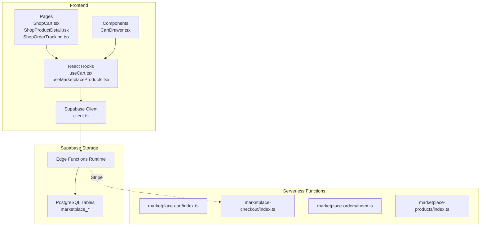
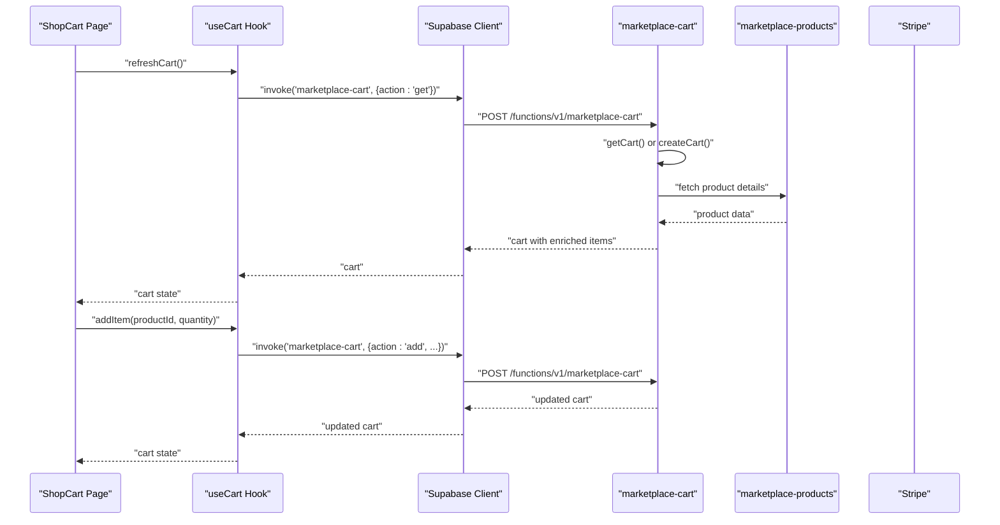
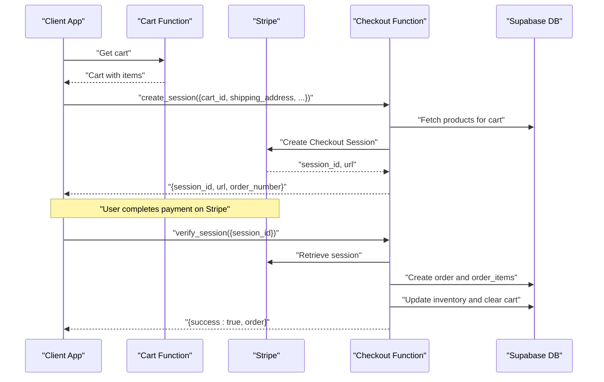
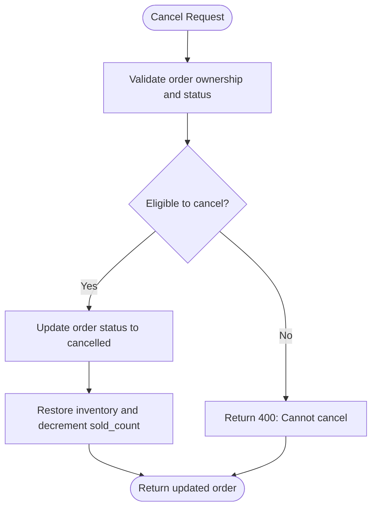
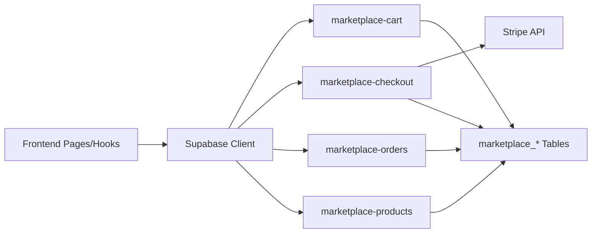

# Marketplace Functions

<cite>
**Referenced Files in This Document**
- [index.ts](file://supabase/functions/marketplace-cart/index.ts)
- [index.ts](file://supabase/functions/marketplace-checkout/index.ts)
- [index.ts](file://supabase/functions/marketplace-orders/index.ts)
- [index.ts](file://supabase/functions/marketplace-products/index.ts)
- [useCart.tsx](file://src/hooks/useCart.tsx)
- [useMarketplaceProducts.tsx](file://src/hooks/useMarketplaceProducts.tsx)
- [ShopCart.tsx](file://src/pages/shop/ShopCart.tsx)
- [ShopProductDetail.tsx](file://src/pages/shop/ShopProductDetail.tsx)
- [ShopOrderTracking.tsx](file://src/pages/shop/ShopOrderTracking.tsx)
- [CartDrawer.tsx](file://src/components/marketplace/CartDrawer.tsx)
- [client.ts](file://src/integrations/supabase/client.ts)
- [types.ts](file://src/integrations/supabase/types.ts)
- [marketplace-math.ts](file://src/lib/marketplace-math.ts)
</cite>

## Table of Contents
1. [Introduction](#introduction)
2. [Project Structure](#project-structure)
3. [Core Components](#core-components)
4. [Architecture Overview](#architecture-overview)
5. [Detailed Component Analysis](#detailed-component-analysis)
6. [Dependency Analysis](#dependency-analysis)
7. [Performance Considerations](#performance-considerations)
8. [Troubleshooting Guide](#troubleshooting-guide)
9. [Conclusion](#conclusion)
10. [Appendices](#appendices)

## Introduction
This document explains the marketplace-related serverless functions powering the shopping experience, including cart management, checkout processing, order fulfillment, and product catalog operations. It covers pricing calculations, inventory management, transaction handling, and integration with Supabase storage. Examples demonstrate typical workflows for cart operations, checkout sessions, order creation, and product browsing.

## Project Structure
The marketplace backend is implemented as Supabase Edge Functions grouped under supabase/functions/marketplace-*. The frontend integrates with these functions via Supabase client and custom hooks.

**Diagram sources**
- [index.ts](file://supabase/functions/marketplace-cart/index.ts#L1-L322)
- [index.ts](file://supabase/functions/marketplace-checkout/index.ts#L1-L330)
- [index.ts](file://supabase/functions/marketplace-orders/index.ts#L1-L226)
- [index.ts](file://supabase/functions/marketplace-products/index.ts#L1-L256)
- [client.ts](file://src/integrations/supabase/client.ts#L1-L17)

**Section sources**
- [index.ts](file://supabase/functions/marketplace-cart/index.ts#L1-L322)
- [index.ts](file://supabase/functions/marketplace-checkout/index.ts#L1-L330)
- [index.ts](file://supabase/functions/marketplace-orders/index.ts#L1-L226)
- [index.ts](file://supabase/functions/marketplace-products/index.ts#L1-L256)
- [client.ts](file://src/integrations/supabase/client.ts#L1-L17)

## Core Components
- Cart Management Function: Handles cart retrieval, item addition/update/removal, subtotal calculation, and enrichment with product and designer details.
- Checkout Function: Creates Stripe Checkout Sessions, validates products, calculates shipping per region, verifies payment, and creates orders with profit splits.
- Orders Function: Lists customer orders, retrieves order details, and supports cancellations with inventory restoration.
- Products Function: Provides product listings, details, categories, and collections with filtering, sorting, and pagination.

**Section sources**
- [index.ts](file://supabase/functions/marketplace-cart/index.ts#L68-L306)
- [index.ts](file://supabase/functions/marketplace-checkout/index.ts#L40-L314)
- [index.ts](file://supabase/functions/marketplace-orders/index.ts#L60-L210)
- [index.ts](file://supabase/functions/marketplace-products/index.ts#L28-L240)

## Architecture Overview
The system uses Supabase Edge Functions to implement marketplace logic. Frontend components call Supabase functions via the Supabase client. The checkout function integrates with Stripe for payments and uses Supabase for persistence.

**Diagram sources**
- [ShopCart.tsx](file://src/pages/shop/ShopCart.tsx#L9-L47)
- [useCart.tsx](file://src/hooks/useCart.tsx#L87-L97)
- [index.ts](file://supabase/functions/marketplace-cart/index.ts#L101-L135)
- [index.ts](file://supabase/functions/marketplace-products/index.ts#L117-L152)

## Detailed Component Analysis

### Cart Management Function
Purpose:
- Manage anonymous and authenticated user carts.
- Enforce availability checks against product inventory.
- Calculate subtotals and enrich items with product/desinger metadata.

Key behaviors:
- Authentication: Extracts Bearer token and resolves user to a customer record, creating one if missing.
- Cart resolution: Finds or creates a cart keyed by customer_id or session_id.
- Actions:
  - get: Returns cart with enriched items and availability flags.
  - add: Validates product availability and updates quantity or adds new item.
  - update: Adjusts item quantity or removes item if quantity <= 0.
  - remove: Filters out item by product_id and variant.
  - clear: Empties cart and resets discount fields.
- Subtotal calculation: Sums price × quantity across items.

Parameters and return values:
- Request body for actions:
  - get: { action: "get", session_id?, customer_id? }
  - add: { action: "add", product_id, quantity?, variant? }
  - update: { action: "update", product_id, quantity, variant? }
  - remove: { action: "remove", product_id, variant? }
  - clear: { action: "clear" }
- Response: { cart } or { error } with appropriate status codes.

Error handling:
- 400 for invalid actions or missing parameters.
- 404 for not found resources (cart/product).
- 500 for internal errors with logged messages.

Integration notes:
- Uses marketplace_carts, marketplace_products, and marketplace_customers.
- Enriches items with product and designer joins.

**Section sources**
- [index.ts](file://supabase/functions/marketplace-cart/index.ts#L18-L321)
- [index.ts](file://supabase/functions/marketplace-cart/index.ts#L68-L306)

#### Cart Operations Example
- Add item:
  - Call marketplace-cart with action=add and product_id.
  - Response returns updated cart and optional message.
- Update quantity:
  - Call marketplace-cart with action=update and product_id, quantity, variant.
- Remove item:
  - Call marketplace-cart with action=remove and product_id, variant.
- Clear cart:
  - Call marketplace-cart with action=clear.

**Section sources**
- [index.ts](file://supabase/functions/marketplace-cart/index.ts#L137-L206)
- [index.ts](file://supabase/functions/marketplace-cart/index.ts#L208-L252)
- [index.ts](file://supabase/functions/marketplace-cart/index.ts#L254-L283)
- [index.ts](file://supabase/functions/marketplace-cart/index.ts#L285-L306)

### Checkout Processing Function
Purpose:
- Create Stripe Checkout Sessions for carts.
- Verify payment completion.
- Convert sessions into orders with shipping, totals, and profit splits.
- Update inventory and clear the cart upon successful payment.

Key behaviors:
- Session creation:
  - Validates cart existence and non-empty items.
  - Fetches product details to build line items.
  - Supports multiple currencies and regional shipping rates.
  - Adds shipping as a separate line item when applicable.
  - Generates order_number via RPC.
- Payment verification:
  - Retrieves session by session_id.
  - Checks payment_status and prevents duplicate orders.
  - Builds order with items, totals, addresses, and metadata.
- Profit calculation:
  - Calculates production cost from retail price using a markup multiplier.
  - Computes profit and splits into designer commission and platform fee.
- Inventory management:
  - Updates sold_count and reduces inventory for ordered items.
- Cart cleanup:
  - Clears cart after successful order creation.

Parameters and return values:
- Request body for create_session:
  - { action: "create_session", cart_id, shipping_address, billing_address, shipping_method, success_url, cancel_url, currency? }
  - Response: { session_id, url, order_number }
- Request body for verify_session:
  - { action: "verify_session", session_id }
  - Response: { success: true, order } or { success: false, message }

Error handling:
- 400/404 for invalid or missing cart/session.
- 500 for internal errors.

Integration notes:
- Uses marketplace_carts, marketplace_products, marketplace_orders, marketplace_order_items.
- Calls Stripe with configured secret key and metadata.

**Section sources**
- [index.ts](file://supabase/functions/marketplace-checkout/index.ts#L40-L173)
- [index.ts](file://supabase/functions/marketplace-checkout/index.ts#L175-L314)

#### Checkout Workflow Sequence

**Diagram sources**
- [index.ts](file://supabase/functions/marketplace-checkout/index.ts#L40-L173)
- [index.ts](file://supabase/functions/marketplace-checkout/index.ts#L175-L314)

### Orders Function
Purpose:
- Allow customers to list orders, view details, and cancel eligible orders.
- Restore inventory and adjust sold counts on cancellation.

Key behaviors:
- Authentication: Requires Authorization header to resolve user and customer.
- Actions:
  - list: Paginated orders filtered by customer and optional status.
  - detail: Retrieves order and associated items with product metadata.
  - cancel: Validates eligibility and updates status, restoring inventory.

Parameters and return values:
- Query parameters for list: { action: "list", page?, limit?, status? }
- Query parameters for detail: { action: "detail", id? or order_number? }
- Body for cancel: { order_id, reason? }

Error handling:
- 401 for missing/invalid token.
- 404 for not found resources.
- 400 for invalid cancellation state.

Integration notes:
- Uses marketplace_orders, marketplace_order_items, marketplace_products.

**Section sources**
- [index.ts](file://supabase/functions/marketplace-orders/index.ts#L13-L225)
- [index.ts](file://supabase/functions/marketplace-orders/index.ts#L60-L145)
- [index.ts](file://supabase/functions/marketplace-orders/index.ts#L147-L210)

#### Order Cancellation Flow

**Diagram sources**
- [index.ts](file://supabase/functions/marketplace-orders/index.ts#L147-L210)

### Product Catalog Function
Purpose:
- Serve product listings, details, categories, and collections.
- Provide filtering, sorting, and pagination.

Key behaviors:
- Listing:
  - Filters by category, designer, price range, search term, featured, bestseller.
  - Sorts by newest, price, rating, bestselling.
  - Paginates results with count.
- Detail:
  - Fetches product with designer and category joins.
  - Increments view_count.
  - Returns related products prioritizing same designer, then category.
  - Returns approved reviews.
- Categories and Collections:
  - Lists active categories and optionally featured collections.

Parameters and return values:
- Query parameters for list: { action: "list", category?, designer?, minPrice?, maxPrice?, sort?, page?, limit?, search?, featured?, bestseller? }
- Query parameters for detail: { action: "detail", id? or slug? }
- Query parameters for categories: { action: "categories" }
- Query parameters for collections: { action: "collections", featured? }

Error handling:
- 404 for missing product.
- 500 for internal errors.

Integration notes:
- Uses marketplace_products, marketplace_categories, marketplace_collections, marketplace_reviews, designer_profiles.

**Section sources**
- [index.ts](file://supabase/functions/marketplace-products/index.ts#L28-L240)

#### Product Detail Retrieval
- Call marketplace-products with action=detail and either id or slug.
- Response includes product, relatedProducts, and reviews.

**Section sources**
- [index.ts](file://supabase/functions/marketplace-products/index.ts#L117-L204)

### Frontend Integration
- Cart hook:
  - Provides cart state and actions (addItem, updateQuantity, removeItem, clearCart, refreshCart).
  - Persists anonymous carts via session_id stored in localStorage.
  - Invokes marketplace-cart function with Authorization header when available.
- Product hooks:
  - useMarketplaceProducts and useMarketplaceProduct call marketplace-products function via fetch with publishable key.
- Pages and components:
  - ShopCart displays cart items, quantities, and order summary.
  - ShopProductDetail handles product detail, quantity selection, and adding to cart.
  - ShopOrderTracking renders order status timeline and details.

**Section sources**
- [useCart.tsx](file://src/hooks/useCart.tsx#L57-L204)
- [useMarketplaceProducts.tsx](file://src/hooks/useMarketplaceProducts.tsx#L83-L209)
- [ShopCart.tsx](file://src/pages/shop/ShopCart.tsx#L9-L221)
- [ShopProductDetail.tsx](file://src/pages/shop/ShopProductDetail.tsx#L20-L350)
- [ShopOrderTracking.tsx](file://src/pages/shop/ShopOrderTracking.tsx#L91-L354)
- [CartDrawer.tsx](file://src/components/marketplace/CartDrawer.tsx#L13-L170)

## Dependency Analysis
- Frontend depends on Supabase client for authentication and function invocation.
- Functions depend on Supabase tables for persistence and Stripe for payments.
- Pricing and profit calculations are centralized in marketplace-math.

**Diagram sources**
- [client.ts](file://src/integrations/supabase/client.ts#L11-L17)
- [index.ts](file://supabase/functions/marketplace-cart/index.ts#L19-L21)
- [index.ts](file://supabase/functions/marketplace-checkout/index.ts#L22-L33)
- [index.ts](file://supabase/functions/marketplace-orders/index.ts#L19-L21)
- [index.ts](file://supabase/functions/marketplace-products/index.ts#L19-L21)

**Section sources**
- [client.ts](file://src/integrations/supabase/client.ts#L1-L17)
- [types.ts](file://src/integrations/supabase/types.ts#L563-L794)

## Performance Considerations
- Minimize repeated network calls by caching cart and product queries in the frontend.
- Batch database reads/writes where possible (e.g., fetching products for cart enrichment in a single query).
- Use pagination for product listings and orders to avoid large payloads.
- Offload heavy computations to serverless functions rather than the browser.

## Troubleshooting Guide
Common issues and resolutions:
- Cart not found:
  - Ensure session_id is passed for guests or Authorization header for authenticated users.
  - Verify marketplace_carts records exist for the given keys.
- Product not available:
  - Confirm product status is active and inventory_count meets requested quantity.
- Empty cart during checkout:
  - Validate that the cart contains items before creating a session.
- Payment verification fails:
  - Check Stripe secret key configuration and session payment_status.
- Order not found:
  - Verify order_number or order_id and customer ownership.
- Internal errors:
  - Review function logs for stack traces and error messages.

**Section sources**
- [index.ts](file://supabase/functions/marketplace-cart/index.ts#L137-L163)
- [index.ts](file://supabase/functions/marketplace-checkout/index.ts#L48-L53)
- [index.ts](file://supabase/functions/marketplace-orders/index.ts#L151-L162)

## Conclusion
The marketplace functions provide a robust foundation for cart management, secure checkout with Stripe, order lifecycle handling, and product catalog operations. The frontend integrates seamlessly via Supabase functions, while the backend enforces inventory constraints, calculates pricing and profits, and maintains data integrity across transactions.

## Appendices

### Pricing Calculations and Profit Split
- Markup multiplier: Retail Price = Production Cost × 2.3.
- Profit = Retail Price − Production Cost.
- Default commission split: 10% to designer, remainder to platform.
- Currency conversion: Line item amounts are rounded to cents before sending to Stripe.

**Section sources**
- [index.ts](file://supabase/functions/marketplace-checkout/index.ts#L14-L14)
- [index.ts](file://supabase/functions/marketplace-checkout/index.ts#L260-L264)
- [marketplace-math.ts](file://src/lib/marketplace-math.ts#L1-L94)

### Inventory Management
- On successful order creation, sold_count increments and inventory_count decrements per item.
- On order cancellation, inventory is restored and sold_count decremented.

**Section sources**
- [index.ts](file://supabase/functions/marketplace-checkout/index.ts#L282-L298)
- [index.ts](file://supabase/functions/marketplace-orders/index.ts#L187-L203)

### Frontend Hooks and Components
- useCart: Manages cart state, invokes marketplace-cart, and persists anonymous session_id.
- useMarketplaceProducts: Fetches product lists and details via marketplace-products.
- ShopCart: Renders cart items, quantities, and order summary.
- ShopProductDetail: Displays product details, related products, and reviews.
- ShopOrderTracking: Shows order status progression and details.

**Section sources**
- [useCart.tsx](file://src/hooks/useCart.tsx#L57-L204)
- [useMarketplaceProducts.tsx](file://src/hooks/useMarketplaceProducts.tsx#L83-L209)
- [ShopCart.tsx](file://src/pages/shop/ShopCart.tsx#L9-L221)
- [ShopProductDetail.tsx](file://src/pages/shop/ShopProductDetail.tsx#L20-L350)
- [ShopOrderTracking.tsx](file://src/pages/shop/ShopOrderTracking.tsx#L91-L354)
- [CartDrawer.tsx](file://src/components/marketplace/CartDrawer.tsx#L13-L170)