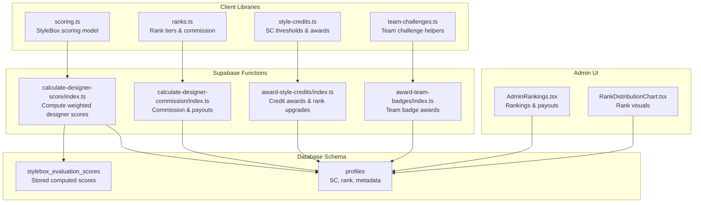
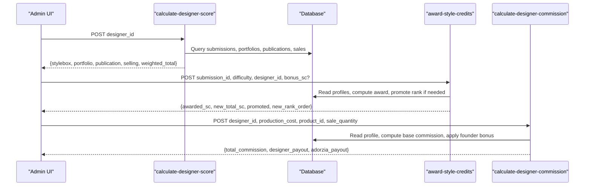
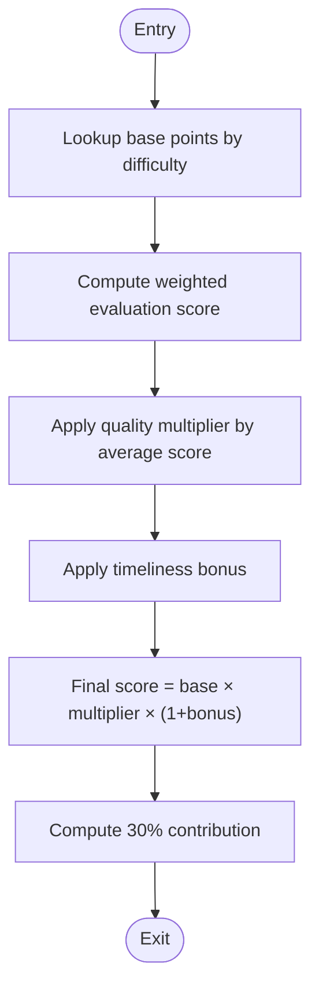
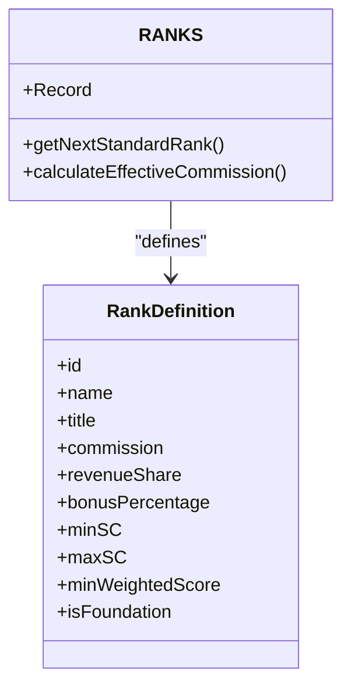
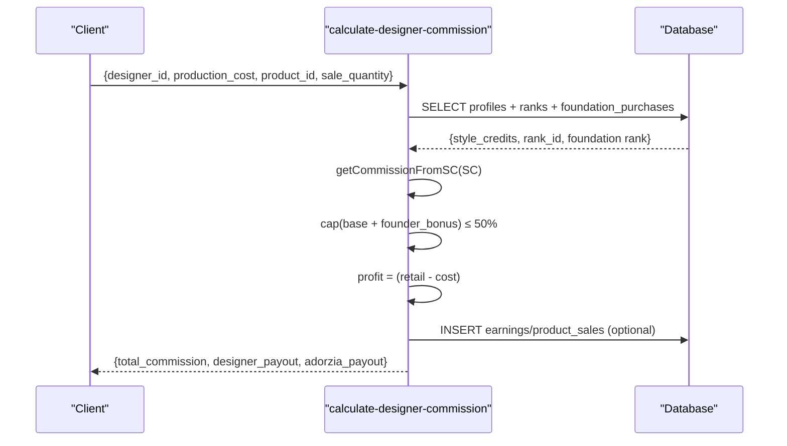
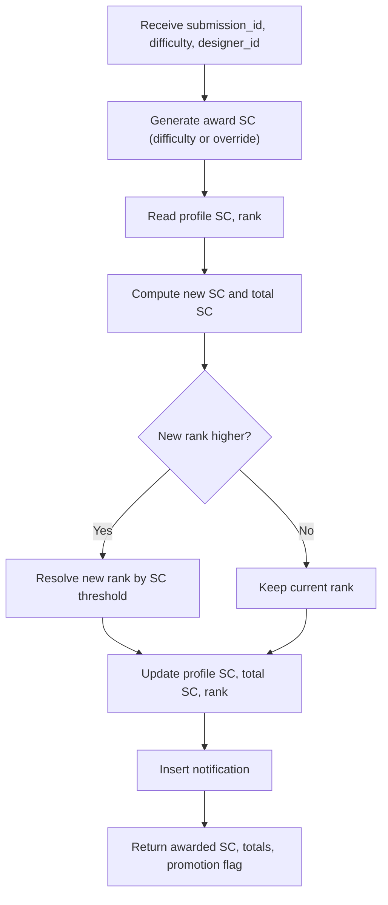
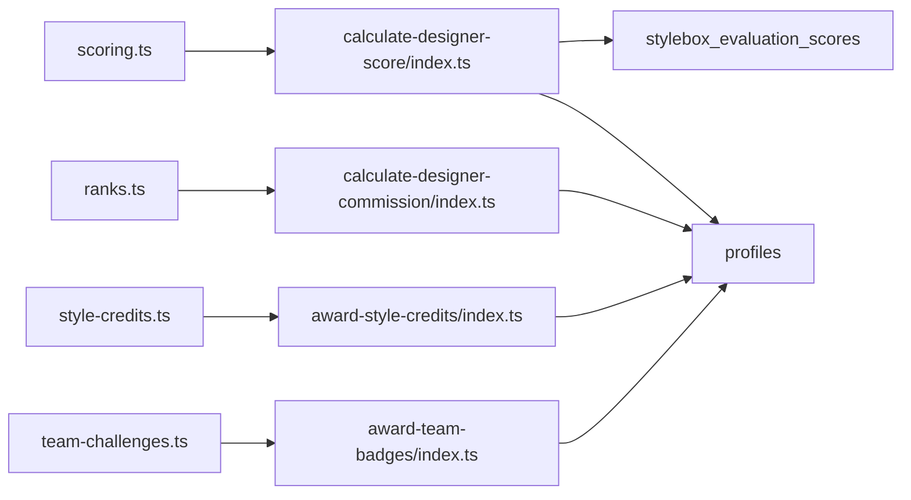

# Scoring & Evaluation Functions

<cite>
**Referenced Files in This Document**
- [scoring.ts](file://src/lib/scoring.ts)
- [ranks.ts](file://src/lib/ranks.ts)
- [style-credits.ts](file://src/lib/style-credits.ts)
- [team-challenges.ts](file://src/lib/team-challenges.ts)
- [calculate-designer-score/index.ts](file://supabase/functions/calculate-designer-score/index.ts)
- [calculate-designer-commission/index.ts](file://supabase/functions/calculate-designer-commission/index.ts)
- [award-style-credits/index.ts](file://supabase/functions/award-style-credits/index.ts)
- [award-team-badges/index.ts](file://supabase/functions/award-team-badges/index.ts)
- [20251216074549_151f4e57-a441-43b6-ac79-313fc5250b3c.sql](file://supabase/migrations/20251216074549_151f4e57-a441-43b6-ac79-313fc5250b3c.sql)
- [20260108050000_enhance_designer_profiles.sql](file://supabase/migrations/20260108050000_enhance_designer_profiles.sql)
- [AdminRankings.tsx](file://src/pages/admin/AdminRankings.tsx)
- [RankDistributionChart.tsx](file://src/components/admin/RankDistributionChart.tsx)
</cite>

## Table of Contents
1. [Introduction](#introduction)
2. [Project Structure](#project-structure)
3. [Core Components](#core-components)
4. [Architecture Overview](#architecture-overview)
5. [Detailed Component Analysis](#detailed-component-analysis)
6. [Dependency Analysis](#dependency-analysis)
7. [Performance Considerations](#performance-considerations)
8. [Troubleshooting Guide](#troubleshooting-guide)
9. [Conclusion](#conclusion)

## Introduction
This document explains the scoring and evaluation system used to assess designer performance, compute rewards, and manage progression within the StyleBox challenge ecosystem. It covers:
- Designer ranking algorithms and commission calculation logic
- Credit awarding mechanisms and reward distribution
- Mathematical models for score computation, evaluation criteria, and reward distribution
- Function inputs, scoring parameters, and integration with the StyleBox system
- Performance considerations and accuracy requirements

## Project Structure
The scoring system spans client-side libraries and serverless functions:
- Client-side libraries define scoring formulas, rank tiers, and SC thresholds
- Supabase Edge Functions implement backend calculations for scores, commissions, and credit awards
- Database migrations define schema for evaluation scores and designer profiles
- Admin UI surfaces ranking and payout insights

**Diagram sources**
- [scoring.ts](file://src/lib/scoring.ts#L1-L239)
- [ranks.ts](file://src/lib/ranks.ts#L1-L246)
- [style-credits.ts](file://src/lib/style-credits.ts#L1-L188)
- [team-challenges.ts](file://src/lib/team-challenges.ts#L1-L133)
- [calculate-designer-score/index.ts](file://supabase/functions/calculate-designer-score/index.ts#L1-L223)
- [calculate-designer-commission/index.ts](file://supabase/functions/calculate-designer-commission/index.ts#L1-L198)
- [award-style-credits/index.ts](file://supabase/functions/award-style-credits/index.ts#L1-L180)
- [award-team-badges/index.ts](file://supabase/functions/award-team-badges/index.ts#L1-L182)
- [20251216074549_151f4e57-a441-43b6-ac79-313fc5250b3c.sql](file://supabase/migrations/20251216074549_151f4e57-a441-43b6-ac79-313fc5250b3c.sql#L139-L170)
- [20260108050000_enhance_designer_profiles.sql](file://supabase/migrations/20260108050000_enhance_designer_profiles.sql#L1-L127)

**Section sources**
- [scoring.ts](file://src/lib/scoring.ts#L1-L239)
- [ranks.ts](file://src/lib/ranks.ts#L1-L246)
- [style-credits.ts](file://src/lib/style-credits.ts#L1-L188)
- [team-challenges.ts](file://src/lib/team-challenges.ts#L1-L133)
- [calculate-designer-score/index.ts](file://supabase/functions/calculate-designer-score/index.ts#L1-L223)
- [calculate-designer-commission/index.ts](file://supabase/functions/calculate-designer-commission/index.ts#L1-L198)
- [award-style-credits/index.ts](file://supabase/functions/award-style-credits/index.ts#L1-L180)
- [award-team-badges/index.ts](file://supabase/functions/award-team-badges/index.ts#L1-L182)
- [20251216074549_151f4e57-a441-43b6-ac79-313fc5250b3c.sql](file://supabase/migrations/20251216074549_151f4e57-a441-43b6-ac79-313fc5250b3c.sql#L139-L170)
- [20260108050000_enhance_designer_profiles.sql](file://supabase/migrations/20260108050000_enhance_designer_profiles.sql#L1-L127)

## Core Components
- StyleBox scoring model: Computes per-submission weighted scores from evaluation criteria, applies quality multipliers and timeliness adjustments, and aggregates contributions.
- Designer weighted total: Combines StyleBox, portfolio, publication, and selling components using fixed weights.
- Rank system: Defines commission, revenue share, and progression thresholds based on Style Credits (SC).
- Commission calculation: Derives base commission from SC, adds founder bonuses, caps at 50%, and computes payouts.
- Credit awarding: Random SC award per approved StyleBox submission with optional override, updates profile and rank.
- Team challenge integration: Provides team role and badge awarding utilities for collaborative challenges.

**Section sources**
- [scoring.ts](file://src/lib/scoring.ts#L31-L168)
- [ranks.ts](file://src/lib/ranks.ts#L60-L177)
- [style-credits.ts](file://src/lib/style-credits.ts#L111-L173)
- [calculate-designer-commission/index.ts](file://supabase/functions/calculate-designer-commission/index.ts#L27-L116)
- [award-style-credits/index.ts](file://supabase/functions/award-style-credits/index.ts#L27-L133)
- [team-challenges.ts](file://src/lib/team-challenges.ts#L15-L77)

## Architecture Overview
The system integrates frontend scoring logic with backend computations and persistence.

**Diagram sources**
- [calculate-designer-score/index.ts](file://supabase/functions/calculate-designer-score/index.ts#L30-L222)
- [award-style-credits/index.ts](file://supabase/functions/award-style-credits/index.ts#L46-L179)
- [calculate-designer-commission/index.ts](file://supabase/functions/calculate-designer-commission/index.ts#L41-L197)

## Detailed Component Analysis

### StyleBox Scoring Model
- Inputs:
  - Difficulty: free, easy, medium, hard, insane
  - Evaluation scores: trend alignment, creative innovation, technical execution, craftsmanship (0–100)
  - Timeliness: early (+5%), onTime (0%), late (−5%)
- Formula:
  - Base points per difficulty
  - Weighted evaluation score by difficulty-specific weights
  - Quality multiplier by average score band
  - Timeliness bonus
  - Final score = basePoints × qualityMultiplier × (1 + timelinessBonus)
  - Contribution = finalScore × 0.30
- Aggregation:
  - Weighted total = Σ(component contribution) across stylebox, portfolio, publication, selling

**Diagram sources**
- [scoring.ts](file://src/lib/scoring.ts#L129-L148)
- [scoring.ts](file://src/lib/scoring.ts#L112-L124)
- [scoring.ts](file://src/lib/scoring.ts#L102-L107)

**Section sources**
- [scoring.ts](file://src/lib/scoring.ts#L31-L76)
- [scoring.ts](file://src/lib/scoring.ts#L102-L148)

### Designer Weighted Total
- Weights: stylebox (30%), portfolio (35%), publication (15%), selling (20%)
- Calculation: sum of component contributions
- Breakdown: exposes component, weight, raw score, and contribution for UI

**Section sources**
- [scoring.ts](file://src/lib/scoring.ts#L71-L76)
- [scoring.ts](file://src/lib/scoring.ts#L160-L168)
- [scoring.ts](file://src/lib/scoring.ts#L180-L212)

### Rank System and Commission
- Rank tiers: Apprentice, Patternist, Stylist, Couturier, Visionary, Creative Director, plus Foundation ranks F1/F2
- Commission and revenue share: tier-based, capped at 50%
- Effective commission: base commission + founder bonus (up to 10% for F1, 5% for F2)
- SC thresholds: define min/max SC per rank; used for promotions and commission lookup

**Diagram sources**
- [ranks.ts](file://src/lib/ranks.ts#L6-L24)
- [ranks.ts](file://src/lib/ranks.ts#L60-L177)
- [ranks.ts](file://src/lib/ranks.ts#L217-L221)

**Section sources**
- [ranks.ts](file://src/lib/ranks.ts#L60-L177)
- [ranks.ts](file://src/lib/ranks.ts#L217-L221)
- [style-credits.ts](file://src/lib/style-credits.ts#L44-L100)

### Commission Calculation Logic
- Inputs: designer_id, production_cost, product_id, sale_quantity
- Steps:
  - Fetch designer profile (SC, rank, foundation purchase)
  - Compute base commission from SC thresholds
  - Apply founder bonus if applicable
  - Cap total commission at 50%
  - Compute retail price (markup), profit, and payouts
  - Optionally record earnings and sales

**Diagram sources**
- [calculate-designer-commission/index.ts](file://supabase/functions/calculate-designer-commission/index.ts#L55-L171)

**Section sources**
- [calculate-designer-commission/index.ts](file://supabase/functions/calculate-designer-commission/index.ts#L27-L116)
- [calculate-designer-commission/index.ts](file://supabase/functions/calculate-designer-commission/index.ts#L118-L171)

### Credit Awarding Mechanisms
- Inputs: submission_id, difficulty, designer_id, optional bonus_sc
- Process:
  - Generate random SC award from difficulty range or use override
  - Update current and total SC in profile
  - Promote rank if threshold crossed
  - Notify designer

**Diagram sources**
- [award-style-credits/index.ts](file://supabase/functions/award-style-credits/index.ts#L60-L134)

**Section sources**
- [award-style-credits/index.ts](file://supabase/functions/award-style-credits/index.ts#L27-L133)
- [style-credits.ts](file://src/lib/style-credits.ts#L111-L173)

### Team Challenge Integration
- Provides team challenge types, role requirements, submission statuses, and helpers for progress calculation and badge awarding
- Supports individual and team badge awards with notifications

**Section sources**
- [team-challenges.ts](file://src/lib/team-challenges.ts#L15-L77)
- [award-team-badges/index.ts](file://supabase/functions/award-team-badges/index.ts#L41-L161)

## Dependency Analysis
- Frontend scoring depends on evaluation weights, quality multipliers, and timeliness bonuses defined in the scoring library.
- Backend functions depend on database tables for submissions, evaluations, portfolios, publications, sales, and profiles.
- Rank definitions and thresholds couple frontend and backend commission calculations.
- Admin UI consumes backend data and presents rankings and payouts.

**Diagram sources**
- [scoring.ts](file://src/lib/scoring.ts#L1-L239)
- [ranks.ts](file://src/lib/ranks.ts#L1-L246)
- [style-credits.ts](file://src/lib/style-credits.ts#L1-L188)
- [team-challenges.ts](file://src/lib/team-challenges.ts#L1-L133)
- [calculate-designer-score/index.ts](file://supabase/functions/calculate-designer-score/index.ts#L54-L192)
- [calculate-designer-commission/index.ts](file://supabase/functions/calculate-designer-commission/index.ts#L64-L171)
- [award-style-credits/index.ts](file://supabase/functions/award-style-credits/index.ts#L73-L133)
- [award-team-badges/index.ts](file://supabase/functions/award-team-badges/index.ts#L42-L161)

**Section sources**
- [20251216074549_151f4e57-a441-43b6-ac79-313fc5250b3c.sql](file://supabase/migrations/20251216074549_151f4e57-a441-43b6-ac79-313fc5250b3c.sql#L139-L170)
- [20260108050000_enhance_designer_profiles.sql](file://supabase/migrations/20260108050000_enhance_designer_profiles.sql#L1-L127)

## Performance Considerations
- Database queries:
  - Prefer indexed filters (status, designer_id) to minimize scans
  - Use joins and inner selects judiciously; cache designer portfolio/publication IDs when feasible
- Function execution:
  - Batch operations where possible; avoid redundant reads
  - Log steps for observability without leaking sensitive data
- Precision:
  - Round intermediate results to two decimals to prevent floating-point drift
  - Cap effective commission at 50% to maintain financial sanity checks
- Scalability:
  - Limit concurrent requests to avoid race conditions on profile updates
  - Use upserts with conflict resolution for score aggregation

[No sources needed since this section provides general guidance]

## Troubleshooting Guide
Common issues and resolutions:
- Missing inputs in functions:
  - Ensure required fields (e.g., designer_id, production_cost) are present before proceeding
- Score calculation errors:
  - Verify evaluation scores exist; fallback to base difficulty points if missing
  - Confirm quality multiplier and timeliness bonus are applied consistently
- Commission discrepancies:
  - Check SC thresholds and foundation rank purchases; confirm cap at 50%
- Credit award anomalies:
  - Validate difficulty ranges and promotion thresholds; ensure notifications are inserted after profile updates
- Admin UI:
  - Confirm database policies allow profile access and that charts render non-empty data

**Section sources**
- [calculate-designer-score/index.ts](file://supabase/functions/calculate-designer-score/index.ts#L44-L48)
- [calculate-designer-commission/index.ts](file://supabase/functions/calculate-designer-commission/index.ts#L55-L59)
- [award-style-credits/index.ts](file://supabase/functions/award-style-credits/index.ts#L60-L64)
- [AdminRankings.tsx](file://src/pages/admin/AdminRankings.tsx#L121-L140)
- [RankDistributionChart.tsx](file://src/components/admin/RankDistributionChart.tsx#L24-L30)

## Conclusion
The scoring and evaluation system combines a robust frontend scoring model with backend functions to compute designer scores, distribute Style Credits, and calculate commissions. The rank system ensures fair progression and incentivization, while team challenge utilities support collaborative achievements. Adhering to the documented inputs, weights, and thresholds guarantees accurate and consistent results across the StyleBox ecosystem.