# Serverless Functions

<cite>
**Referenced Files in This Document**
- [supabase/functions/deno.json](file://supabase/functions/deno.json)
- [supabase/functions/import_map.json](file://supabase/functions/import_map.json)
- [supabase/functions/marketplace-orders/index.ts](file://supabase/functions/marketplace-orders/index.ts)
- [supabase/functions/calculate-designer-score/index.ts](file://supabase/functions/calculate-designer-score/index.ts)
- [supabase/functions/check-subscription/index.ts](file://supabase/functions/check-subscription/index.ts)
- [supabase/functions/broadcast-notification/index.ts](file://supabase/functions/broadcast-notification/index.ts)
- [supabase/functions/create-checkout/index.ts](file://supabase/functions/create-checkout/index.ts)
- [supabase/functions/marketplace-cart/index.ts](file://supabase/functions/marketplace-cart/index.ts)
- [supabase/functions/marketplace-products/index.ts](file://supabase/functions/marketplace-products/index.ts)
- [supabase/functions/send-transactional/index.ts](file://supabase/functions/send-transactional/index.ts)
- [supabase/functions/submit-stylebox-entry/index.ts](file://supabase/functions/submit-stylebox-entry/index.ts)
- [supabase/functions/upload-portfolio-project/index.ts](file://supabase/functions/upload-portfolio-project/index.ts)
- [supabase/functions/award-style-credits/index.ts](file://supabase/functions/award-style-credits/index.ts)
- [supabase/functions/verify-authenticity/index.ts](file://supabase/functions/verify-authenticity/index.ts)
- [supabase/functions/reset-monthly-tokens/index.ts](file://supabase/functions/reset-monthly-tokens/index.ts)
- [supabase/functions/generate-sitemap/index.ts](file://supabase/functions/generate-sitemap/index.ts)
- [supabase/functions/manage-team/index.ts](file://supabase/functions/manage-team/index.ts)
</cite>

## Table of Contents
1. [Introduction](#introduction)
2. [Project Structure](#project-structure)
3. [Core Components](#core-components)
4. [Architecture Overview](#architecture-overview)
5. [Detailed Component Analysis](#detailed-component-analysis)
6. [Dependency Analysis](#dependency-analysis)
7. [Performance Considerations](#performance-considerations)
8. [Troubleshooting Guide](#troubleshooting-guide)
9. [Conclusion](#conclusion)

## Introduction
This document describes the serverless functions architecture powering the Adorzia marketplace, subscription, scoring, notifications, and team management features. It explains deployment strategy, business logic, security and access control, integration patterns, function lifecycle, error handling, logging, monitoring, performance optimization, cold start mitigation, and cost management strategies.

## Project Structure
The serverless functions are organized under the Supabase functions directory. Each function is a self-contained module exposing a Deno HTTP handler. Shared dependencies are declared via an import map and a Deno configuration file.

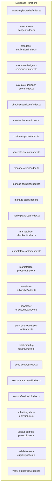

**Diagram sources**
- [supabase/functions/marketplace-orders/index.ts](file://supabase/functions/marketplace-orders/index.ts#L1-L226)
- [supabase/functions/calculate-designer-score/index.ts](file://supabase/functions/calculate-designer-score/index.ts#L1-L223)
- [supabase/functions/check-subscription/index.ts](file://supabase/functions/check-subscription/index.ts#L1-L140)
- [supabase/functions/broadcast-notification/index.ts](file://supabase/functions/broadcast-notification/index.ts#L1-L149)
- [supabase/functions/create-checkout/index.ts](file://supabase/functions/create-checkout/index.ts#L1-L85)
- [supabase/functions/marketplace-cart/index.ts](file://supabase/functions/marketplace-cart/index.ts#L1-L322)
- [supabase/functions/marketplace-products/index.ts](file://supabase/functions/marketplace-products/index.ts#L1-L256)
- [supabase/functions/send-transactional/index.ts](file://supabase/functions/send-transactional/index.ts#L1-L70)
- [supabase/functions/submit-stylebox-entry/index.ts](file://supabase/functions/submit-stylebox-entry/index.ts#L1-L142)
- [supabase/functions/upload-portfolio-project/index.ts](file://supabase/functions/upload-portfolio-project/index.ts#L1-L300)
- [supabase/functions/award-style-credits/index.ts](file://supabase/functions/award-style-credits/index.ts#L1-L180)
- [supabase/functions/verify-authenticity/index.ts](file://supabase/functions/verify-authenticity/index.ts#L1-L262)
- [supabase/functions/reset-monthly-tokens/index.ts](file://supabase/functions/reset-monthly-tokens/index.ts#L1-L111)
- [supabase/functions/generate-sitemap/index.ts](file://supabase/functions/generate-sitemap/index.ts#L1-L136)
- [supabase/functions/manage-team/index.ts](file://supabase/functions/manage-team/index.ts#L1-L548)

**Section sources**
- [supabase/functions/deno.json](file://supabase/functions/deno.json#L1-L4)
- [supabase/functions/import_map.json](file://supabase/functions/import_map.json#L1-L7)

## Core Components
- Supabase client initialization and environment usage across functions
- Stripe integration for checkout and subscription checks
- Resend integration for transactional emails
- CORS handling and standardized response headers
- Logging via console with structured steps
- Access control via Supabase Auth getUser and admin role checks

Key implementation patterns:
- Deno serve HTTP handlers with OPTIONS preflight support
- Supabase service role key for privileged operations
- Anon key for public endpoints where appropriate
- Error-first approach with standardized JSON responses

**Section sources**
- [supabase/functions/marketplace-orders/index.ts](file://supabase/functions/marketplace-orders/index.ts#L13-L226)
- [supabase/functions/check-subscription/index.ts](file://supabase/functions/check-subscription/index.ts#L14-L140)
- [supabase/functions/broadcast-notification/index.ts](file://supabase/functions/broadcast-notification/index.ts#L8-L149)
- [supabase/functions/create-checkout/index.ts](file://supabase/functions/create-checkout/index.ts#L14-L85)
- [supabase/functions/send-transactional/index.ts](file://supabase/functions/send-transactional/index.ts#L15-L70)
- [supabase/functions/import_map.json](file://supabase/functions/import_map.json#L1-L7)

## Architecture Overview
The serverless functions integrate with Supabase Auth, Storage, and Database, and third-party services (Stripe, Resend). Functions are deployed as Deno HTTP handlers and exposed via Supabase Edge Functions runtime.

```mermaid
graph TB
Client["Client Apps<br/>Web/Mobile"] --> Edge["Supabase Edge Functions Runtime"]
Edge --> Auth["Supabase Auth"]
Edge --> DB["Supabase Postgres"]
Edge --> Storage["Supabase Storage"]
Edge --> Stripe["Stripe API"]
Edge --> Resend["Resend API"]
subgraph "Functions"
F1["marketplace-orders"]
F2["marketplace-cart"]
F3["marketplace-products"]
F4["check-subscription"]
F5["create-checkout"]
F6["broadcast-notification"]
F7["send-transactional"]
F8["calculate-designer-score"]
F9["award-style-credits"]
F10["upload-portfolio-project"]
F11["submit-stylebox-entry"]
F12["verify-authenticity"]
F13["reset-monthly-tokens"]
F14["manage-team"]
F15["generate-sitemap"]
end
Edge --> F1
Edge --> F2
Edge --> F3
Edge --> F4
Edge --> F5
Edge --> F6
Edge --> F7
Edge --> F8
Edge --> F9
Edge --> F10
Edge --> F11
Edge --> F12
Edge --> F13
Edge --> F14
Edge --> F15
```

**Diagram sources**
- [supabase/functions/marketplace-orders/index.ts](file://supabase/functions/marketplace-orders/index.ts#L1-L226)
- [supabase/functions/marketplace-cart/index.ts](file://supabase/functions/marketplace-cart/index.ts#L1-L322)
- [supabase/functions/marketplace-products/index.ts](file://supabase/functions/marketplace-products/index.ts#L1-L256)
- [supabase/functions/check-subscription/index.ts](file://supabase/functions/check-subscription/index.ts#L1-L140)
- [supabase/functions/create-checkout/index.ts](file://supabase/functions/create-checkout/index.ts#L1-L85)
- [supabase/functions/broadcast-notification/index.ts](file://supabase/functions/broadcast-notification/index.ts#L1-L149)
- [supabase/functions/send-transactional/index.ts](file://supabase/functions/send-transactional/index.ts#L1-L70)
- [supabase/functions/calculate-designer-score/index.ts](file://supabase/functions/calculate-designer-score/index.ts#L1-L223)
- [supabase/functions/award-style-credits/index.ts](file://supabase/functions/award-style-credits/index.ts#L1-L180)
- [supabase/functions/upload-portfolio-project/index.ts](file://supabase/functions/upload-portfolio-project/index.ts#L1-L300)
- [supabase/functions/submit-stylebox-entry/index.ts](file://supabase/functions/submit-stylebox-entry/index.ts#L1-L142)
- [supabase/functions/verify-authenticity/index.ts](file://supabase/functions/verify-authenticity/index.ts#L1-L262)
- [supabase/functions/reset-monthly-tokens/index.ts](file://supabase/functions/reset-monthly-tokens/index.ts#L1-L111)
- [supabase/functions/manage-team/index.ts](file://supabase/functions/manage-team/index.ts#L1-L548)
- [supabase/functions/generate-sitemap/index.ts](file://supabase/functions/generate-sitemap/index.ts#L1-L136)

## Detailed Component Analysis

### Marketplace Orders
Handles listing, retrieving details, and cancellation of orders for authenticated users. It validates the user via Supabase Auth, fetches related order items, and restores inventory upon cancellation.

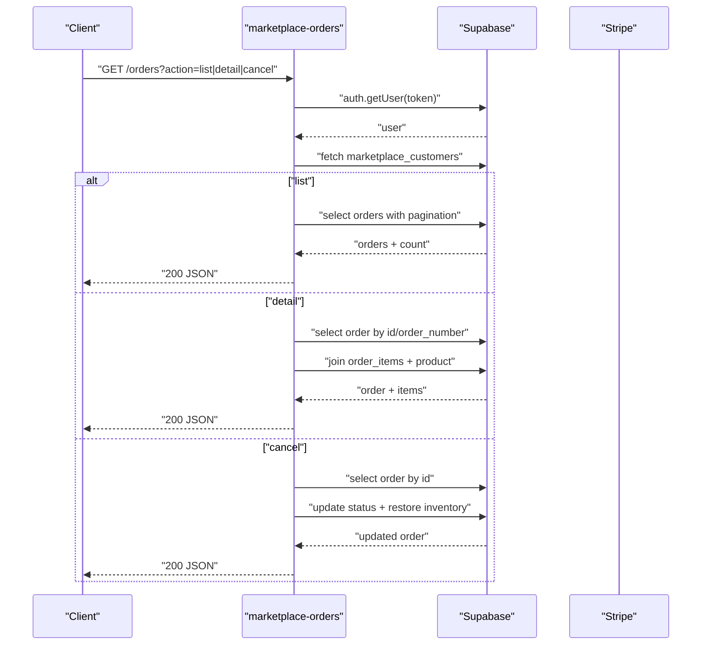

**Diagram sources**
- [supabase/functions/marketplace-orders/index.ts](file://supabase/functions/marketplace-orders/index.ts#L13-L226)

**Section sources**
- [supabase/functions/marketplace-orders/index.ts](file://supabase/functions/marketplace-orders/index.ts#L18-L226)

### Marketplace Cart
Manages guest and authenticated carts, supports add/update/remove/clear actions, enriches items with product and designer data, and calculates subtotals.

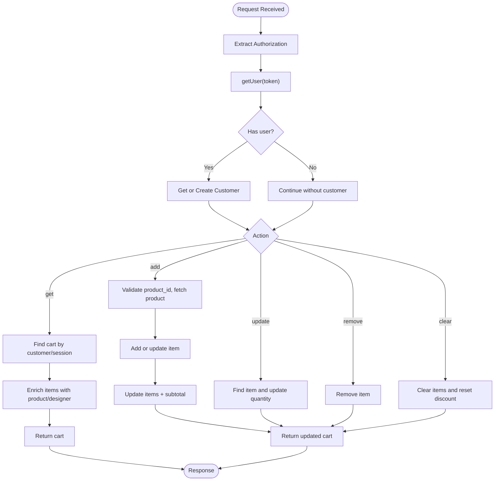

**Diagram sources**
- [supabase/functions/marketplace-cart/index.ts](file://supabase/functions/marketplace-cart/index.ts#L13-L322)

**Section sources**
- [supabase/functions/marketplace-cart/index.ts](file://supabase/functions/marketplace-cart/index.ts#L18-L322)

### Marketplace Products
Provides product listings with filters, sorting, pagination, and product detail retrieval with related products and reviews. Also exposes categories and collections.

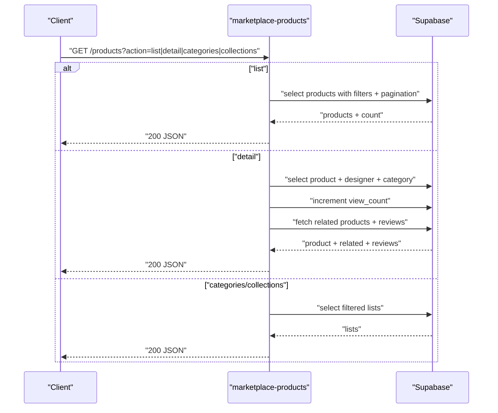

**Diagram sources**
- [supabase/functions/marketplace-products/index.ts](file://supabase/functions/marketplace-products/index.ts#L13-L256)

**Section sources**
- [supabase/functions/marketplace-products/index.ts](file://supabase/functions/marketplace-products/index.ts#L18-L256)

### Subscription Management
- Check subscription: Verifies active Stripe subscription for a user, updates profile tier, and returns subscription status.
- Create checkout: Initiates a Stripe Checkout session for a selected price.

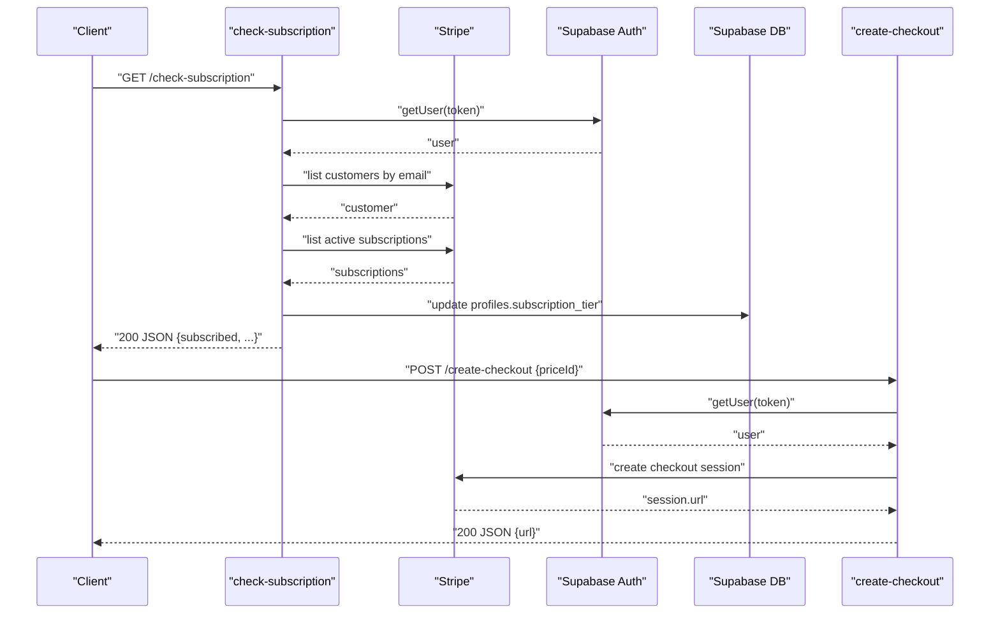

**Diagram sources**
- [supabase/functions/check-subscription/index.ts](file://supabase/functions/check-subscription/index.ts#L14-L140)
- [supabase/functions/create-checkout/index.ts](file://supabase/functions/create-checkout/index.ts#L14-L85)

**Section sources**
- [supabase/functions/check-subscription/index.ts](file://supabase/functions/check-subscription/index.ts#L25-L140)
- [supabase/functions/create-checkout/index.ts](file://supabase/functions/create-checkout/index.ts#L24-L85)

### Scoring and Credits
- Designer score calculation: Aggregates stylebox, portfolio, publication, and selling metrics into a weighted score and upserts results.
- Award style credits: Awards SC based on difficulty or bonus, promotes rank if threshold reached, and sends notifications.

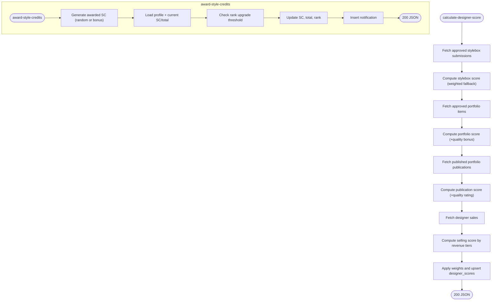

**Diagram sources**
- [supabase/functions/calculate-designer-score/index.ts](file://supabase/functions/calculate-designer-score/index.ts#L30-L223)
- [supabase/functions/award-style-credits/index.ts](file://supabase/functions/award-style-credits/index.ts#L46-L180)

**Section sources**
- [supabase/functions/calculate-designer-score/index.ts](file://supabase/functions/calculate-designer-score/index.ts#L41-L223)
- [supabase/functions/award-style-credits/index.ts](file://supabase/functions/award-style-credits/index.ts#L57-L180)

### Notifications
- Broadcast notification: Admin-only endpoint to send system notifications to all active users, inserting records in batches.
- Send transactional: Sends transactional emails via Resend and logs outcomes.

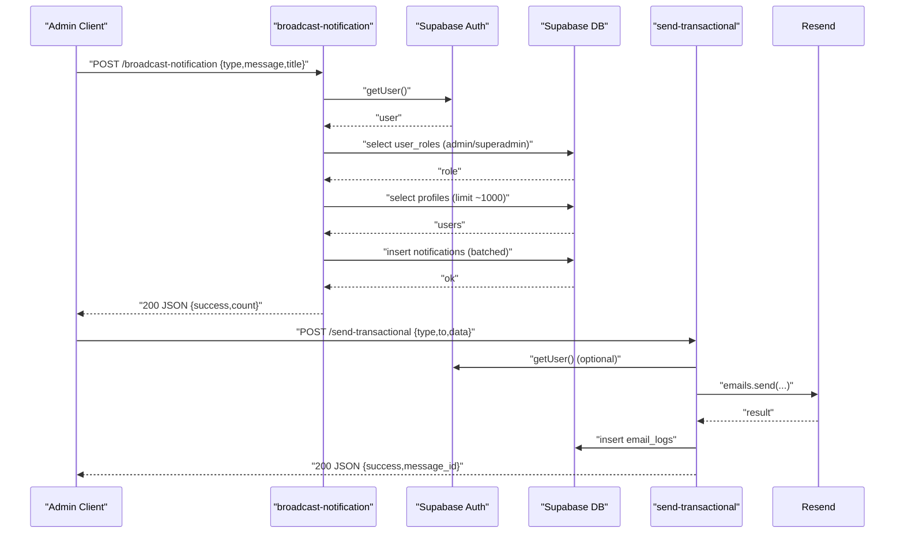

**Diagram sources**
- [supabase/functions/broadcast-notification/index.ts](file://supabase/functions/broadcast-notification/index.ts#L8-L149)
- [supabase/functions/send-transactional/index.ts](file://supabase/functions/send-transactional/index.ts#L15-L70)

**Section sources**
- [supabase/functions/broadcast-notification/index.ts](file://supabase/functions/broadcast-notification/index.ts#L13-L149)
- [supabase/functions/send-transactional/index.ts](file://supabase/functions/send-transactional/index.ts#L15-L70)

### Content and Assets
- Upload portfolio project: Creates portfolio/project, uploads images to storage, sets thumbnails, and handles rollback on failure.
- Verify authenticity: Public verification and certificate retrieval; admin-only generation using RPC and hashing.

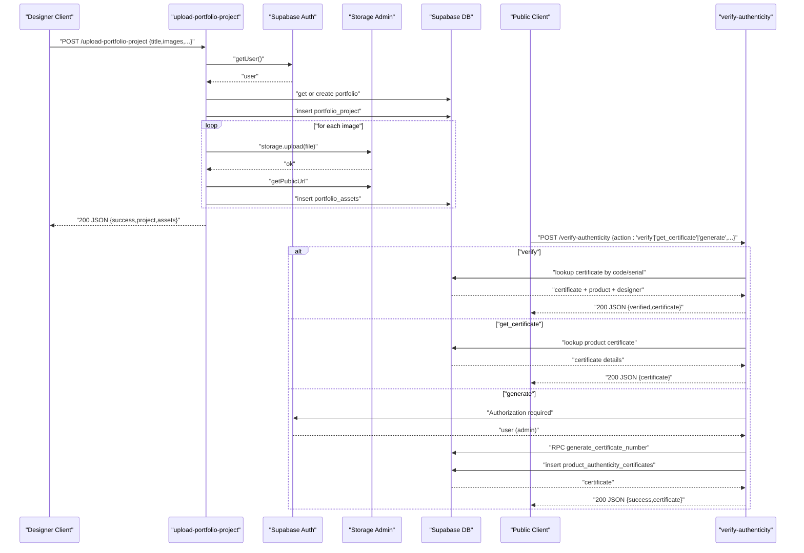

**Diagram sources**
- [supabase/functions/upload-portfolio-project/index.ts](file://supabase/functions/upload-portfolio-project/index.ts#L21-L300)
- [supabase/functions/verify-authenticity/index.ts](file://supabase/functions/verify-authenticity/index.ts#L24-L262)

**Section sources**
- [supabase/functions/upload-portfolio-project/index.ts](file://supabase/functions/upload-portfolio-project/index.ts#L26-L300)
- [supabase/functions/verify-authenticity/index.ts](file://supabase/functions/verify-authenticity/index.ts#L29-L262)

### Teams
Manages team creation, invitations, join requests, and membership lifecycle with role checks and capacity enforcement.

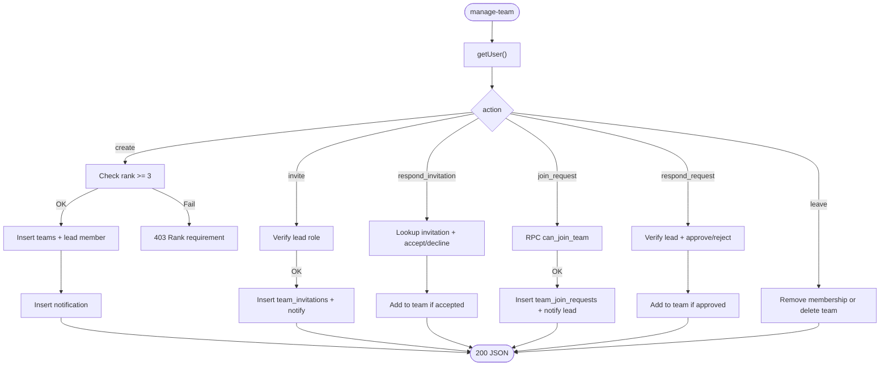

**Diagram sources**
- [supabase/functions/manage-team/index.ts](file://supabase/functions/manage-team/index.ts#L8-L548)

**Section sources**
- [supabase/functions/manage-team/index.ts](file://supabase/functions/manage-team/index.ts#L47-L548)

### Additional Utilities
- Reset monthly tokens: Periodic reset of subscription-based token grants per tier.
- Generate sitemap: Builds XML sitemap from live products, categories, and articles.

**Section sources**
- [supabase/functions/reset-monthly-tokens/index.ts](file://supabase/functions/reset-monthly-tokens/index.ts#L20-L111)
- [supabase/functions/generate-sitemap/index.ts](file://supabase/functions/generate-sitemap/index.ts#L11-L136)

## Dependency Analysis
- External libraries:
  - @supabase/supabase-js for Supabase client operations
  - stripe for Stripe integration
  - resend for transactional email delivery
- Internal dependencies:
  - Supabase Auth for user verification
  - Supabase Database for CRUD and RPCs
  - Supabase Storage for asset uploads and public URLs

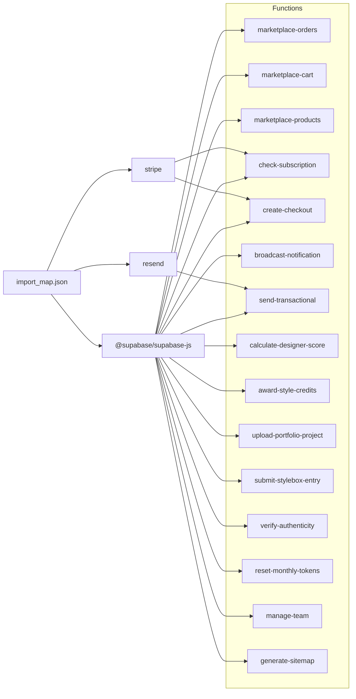

**Diagram sources**
- [supabase/functions/import_map.json](file://supabase/functions/import_map.json#L1-L7)
- [supabase/functions/marketplace-orders/index.ts](file://supabase/functions/marketplace-orders/index.ts#L1-L226)
- [supabase/functions/check-subscription/index.ts](file://supabase/functions/check-subscription/index.ts#L1-L140)
- [supabase/functions/create-checkout/index.ts](file://supabase/functions/create-checkout/index.ts#L1-L85)
- [supabase/functions/broadcast-notification/index.ts](file://supabase/functions/broadcast-notification/index.ts#L1-L149)
- [supabase/functions/send-transactional/index.ts](file://supabase/functions/send-transactional/index.ts#L1-L70)
- [supabase/functions/calculate-designer-score/index.ts](file://supabase/functions/calculate-designer-score/index.ts#L1-L223)
- [supabase/functions/award-style-credits/index.ts](file://supabase/functions/award-style-credits/index.ts#L1-L180)
- [supabase/functions/upload-portfolio-project/index.ts](file://supabase/functions/upload-portfolio-project/index.ts#L1-L300)
- [supabase/functions/submit-stylebox-entry/index.ts](file://supabase/functions/submit-stylebox-entry/index.ts#L1-L142)
- [supabase/functions/verify-authenticity/index.ts](file://supabase/functions/verify-authenticity/index.ts#L1-L262)
- [supabase/functions/reset-monthly-tokens/index.ts](file://supabase/functions/reset-monthly-tokens/index.ts#L1-L111)
- [supabase/functions/manage-team/index.ts](file://supabase/functions/manage-team/index.ts#L1-L548)
- [supabase/functions/generate-sitemap/index.ts](file://supabase/functions/generate-sitemap/index.ts#L1-L136)

**Section sources**
- [supabase/functions/import_map.json](file://supabase/functions/import_map.json#L1-L7)
- [supabase/functions/deno.json](file://supabase/functions/deno.json#L1-L4)

## Performance Considerations
- Cold starts
  - Keep functions small and focused; minimize imports and initialization work.
  - Reuse Supabase clients per request scope; avoid long-lived connections.
  - Prefer Supabase Edge Functions for low-latency access close to Supabase infrastructure.
- Database queries
  - Use selective field projections and joins only when necessary.
  - Apply filters early; paginate with range queries.
  - Use indexes on frequently queried columns (e.g., user_id, status, created_at).
- Storage operations
  - Batch inserts for notifications to reduce payload size and latency.
  - Use public URLs from storage to avoid extra roundtrips.
- Network calls
  - Cache Stripe product/pricing data at the application level if feasible.
  - Minimize external API calls; coalesce where possible.
- Cost management
  - Limit result sets and enforce pagination.
  - Avoid unnecessary writes; batch operations where supported.
  - Monitor function execution time and optimize hot paths.

[No sources needed since this section provides general guidance]

## Troubleshooting Guide
Common issues and resolutions:
- Authentication failures
  - Ensure Authorization header is present and valid; verify token via Supabase Auth getUser.
  - For admin-only endpoints, confirm user roles in user_roles table.
- Stripe errors
  - Validate STRIPE_SECRET_KEY presence and correctness.
  - Check customer existence before creating sessions; handle missing customer gracefully.
- Supabase errors
  - Inspect error messages returned in JSON bodies; check row-level security policies.
  - Use service role key for privileged operations; avoid exposing anon keys unnecessarily.
- Storage rollbacks
  - On upload failures, ensure cleanup of uploaded files and database records.
- Logging
  - Use structured console logs with function-specific prefixes for easier correlation.
  - Include request IDs and user IDs where applicable.

**Section sources**
- [supabase/functions/broadcast-notification/index.ts](file://supabase/functions/broadcast-notification/index.ts#L13-L149)
- [supabase/functions/upload-portfolio-project/index.ts](file://supabase/functions/upload-portfolio-project/index.ts#L228-L273)
- [supabase/functions/check-subscription/index.ts](file://supabase/functions/check-subscription/index.ts#L25-L140)

## Conclusion
The serverless functions architecture leverages Supabase Edge Functions to deliver scalable, secure, and modular business capabilities across marketplace operations, subscription management, scoring, notifications, and team workflows. By adhering to strict access controls, efficient data access patterns, and robust error handling, the system maintains reliability while enabling rapid iteration and cost-effective scaling.