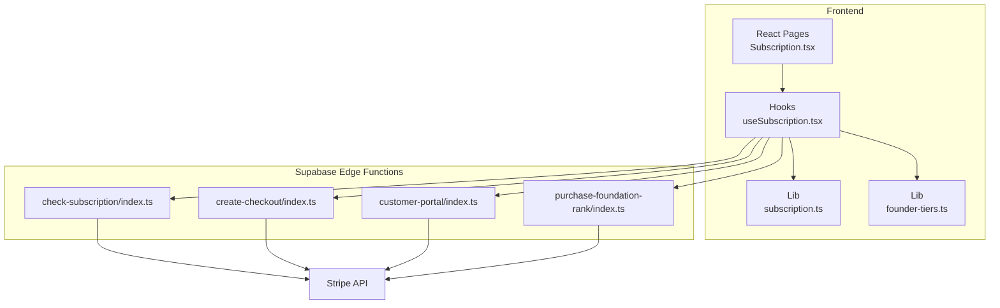
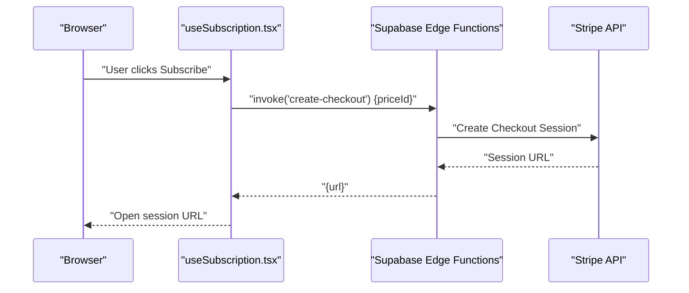
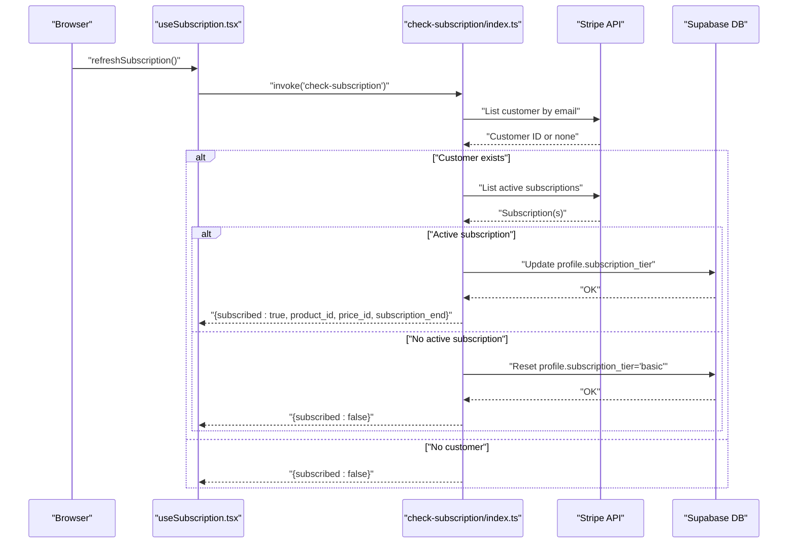
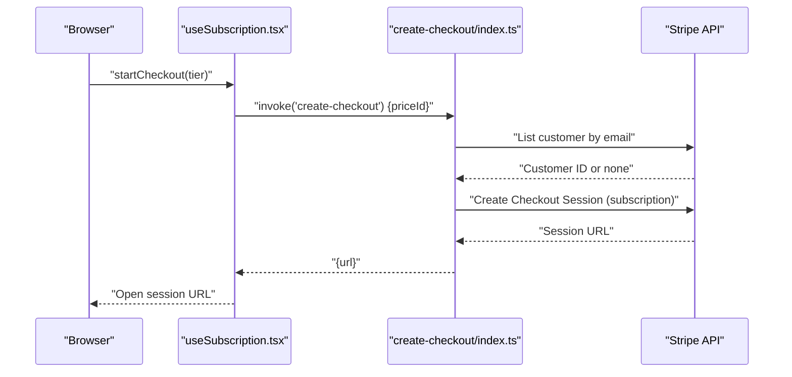
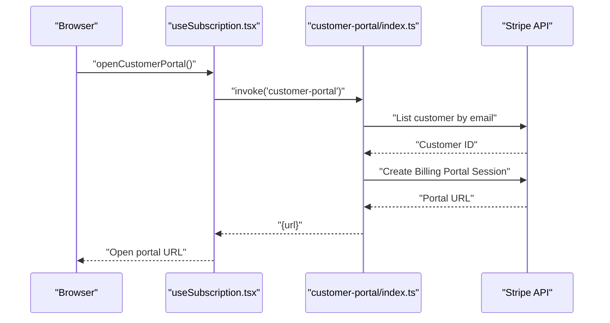
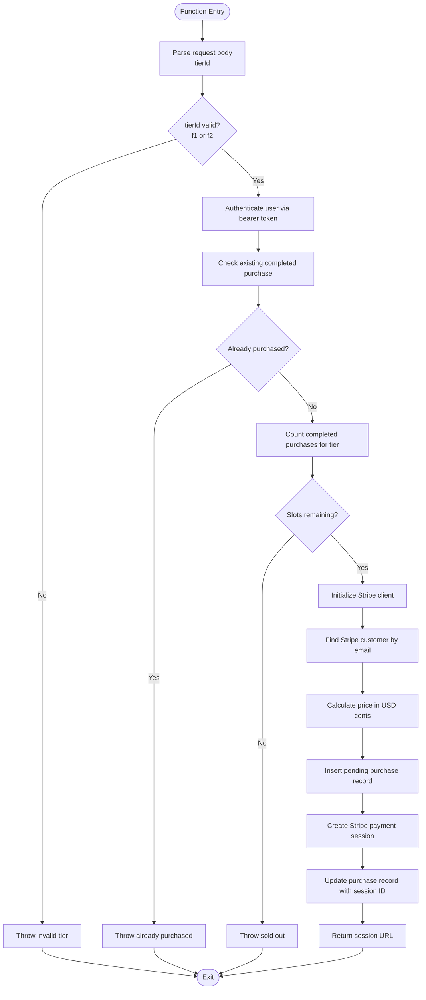
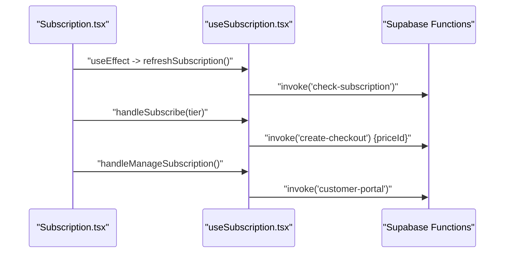
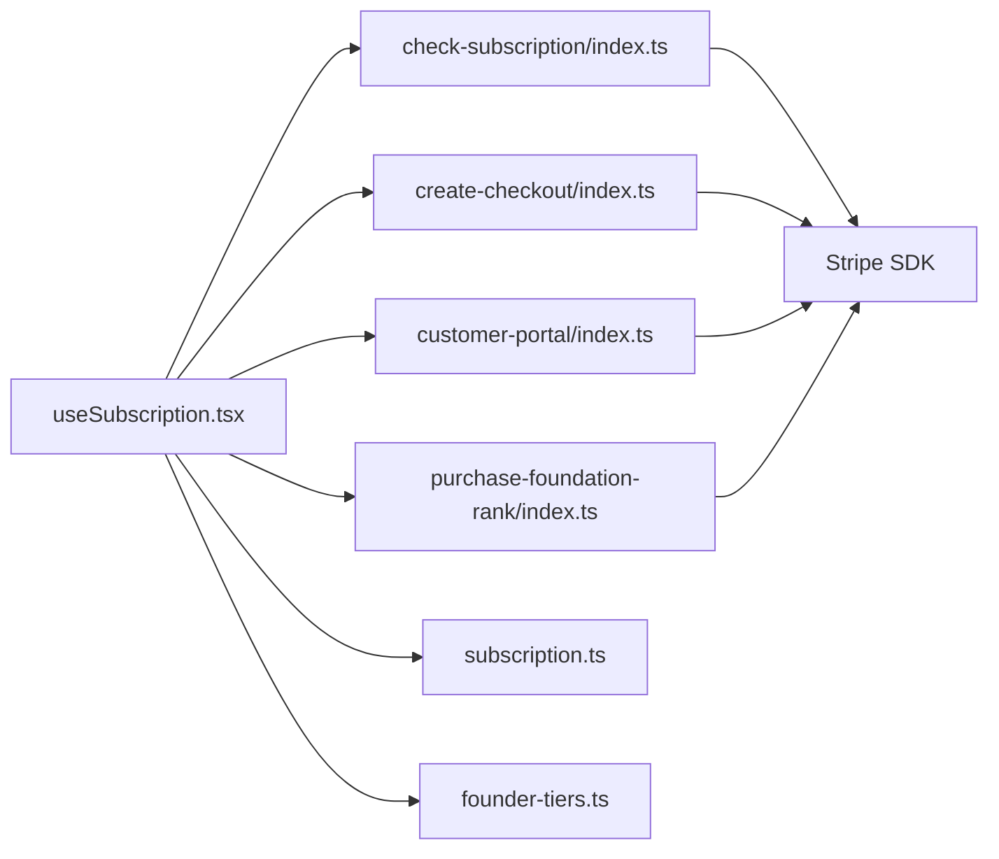

# Subscription & Billing Functions

<cite>
**Referenced Files in This Document**
- [check-subscription/index.ts](file://supabase/functions/check-subscription/index.ts)
- [create-checkout/index.ts](file://supabase/functions/create-checkout/index.ts)
- [customer-portal/index.ts](file://supabase/functions/customer-portal/index.ts)
- [purchase-foundation-rank/index.ts](file://supabase/functions/purchase-foundation-rank/index.ts)
- [useSubscription.tsx](file://src/hooks/useSubscription.tsx)
- [Subscription.tsx](file://src/pages/Subscription.tsx)
- [subscription.ts](file://src/lib/subscription.ts)
- [founder-tiers.ts](file://src/lib/founder-tiers.ts)
</cite>

## Table of Contents
1. [Introduction](#introduction)
2. [Project Structure](#project-structure)
3. [Core Components](#core-components)
4. [Architecture Overview](#architecture-overview)
5. [Detailed Component Analysis](#detailed-component-analysis)
6. [Dependency Analysis](#dependency-analysis)
7. [Performance Considerations](#performance-considerations)
8. [Troubleshooting Guide](#troubleshooting-guide)
9. [Conclusion](#conclusion)

## Introduction
This document explains the subscription and billing serverless functions powering the Adorzia platform. It covers subscription validation, payment processing, customer portal integration, and the foundation rank purchase workflow. It also documents Stripe integration patterns, webhook handling considerations, subscription lifecycle management, function parameters, error handling, and security considerations for financial transactions.

## Project Structure
The billing system spans Supabase Edge Functions (serverless) and the frontend React application:
- Supabase Edge Functions implement subscription checks, checkout sessions, customer portal sessions, and foundation rank purchases.
- Frontend hooks and pages orchestrate user actions, invoke functions, and present subscription and pricing information.
- Shared configuration defines subscription tiers and founder rank pricing.

**Diagram sources**
- [Subscription.tsx](file://src/pages/Subscription.tsx#L1-L223)
- [useSubscription.tsx](file://src/hooks/useSubscription.tsx#L1-L170)
- [subscription.ts](file://src/lib/subscription.ts#L1-L151)
- [founder-tiers.ts](file://src/lib/founder-tiers.ts#L1-L247)
- [check-subscription/index.ts](file://supabase/functions/check-subscription/index.ts#L1-L140)
- [create-checkout/index.ts](file://supabase/functions/create-checkout/index.ts#L1-L85)
- [customer-portal/index.ts](file://supabase/functions/customer-portal/index.ts#L1-L74)
- [purchase-foundation-rank/index.ts](file://supabase/functions/purchase-foundation-rank/index.ts#L1-L194)

**Section sources**
- [Subscription.tsx](file://src/pages/Subscription.tsx#L1-L223)
- [useSubscription.tsx](file://src/hooks/useSubscription.tsx#L1-L170)
- [subscription.ts](file://src/lib/subscription.ts#L1-L151)
- [founder-tiers.ts](file://src/lib/founder-tiers.ts#L1-L247)
- [check-subscription/index.ts](file://supabase/functions/check-subscription/index.ts#L1-L140)
- [create-checkout/index.ts](file://supabase/functions/create-checkout/index.ts#L1-L85)
- [customer-portal/index.ts](file://supabase/functions/customer-portal/index.ts#L1-L74)
- [purchase-foundation-rank/index.ts](file://supabase/functions/purchase-foundation-rank/index.ts#L1-L194)

## Core Components
- Subscription Validation Function: Authenticates the user via Supabase, queries Stripe for an active subscription, updates the user’s profile tier, and returns subscription status and metadata.
- Checkout Session Function: Creates a Stripe Checkout session for subscription plans and returns the session URL.
- Customer Portal Function: Generates a Stripe Billing Portal session for managing subscriptions.
- Foundation Rank Purchase Function: Handles one-time founder rank purchases with slot limits, Stripe checkout, and purchase records.

Key shared configuration:
- Subscription tiers define product/price IDs, features, and limits.
- Founder tiers define one-time purchase options with lifetime bonuses and slot caps.

**Section sources**
- [check-subscription/index.ts](file://supabase/functions/check-subscription/index.ts#L1-L140)
- [create-checkout/index.ts](file://supabase/functions/create-checkout/index.ts#L1-L85)
- [customer-portal/index.ts](file://supabase/functions/customer-portal/index.ts#L1-L74)
- [purchase-foundation-rank/index.ts](file://supabase/functions/purchase-foundation-rank/index.ts#L1-L194)
- [subscription.ts](file://src/lib/subscription.ts#L1-L151)
- [founder-tiers.ts](file://src/lib/founder-tiers.ts#L1-L247)

## Architecture Overview
The frontend invokes Supabase Edge Functions secured by bearer tokens. Functions authenticate users against Supabase, interact with Stripe to manage subscriptions and payments, and update Supabase profiles or purchase records accordingly.

**Diagram sources**
- [useSubscription.tsx](file://src/hooks/useSubscription.tsx#L78-L101)
- [create-checkout/index.ts](file://supabase/functions/create-checkout/index.ts#L53-L68)

**Section sources**
- [useSubscription.tsx](file://src/hooks/useSubscription.tsx#L1-L170)
- [create-checkout/index.ts](file://supabase/functions/create-checkout/index.ts#L1-L85)

## Detailed Component Analysis

### Subscription Validation Workflow
Purpose: Determine if a user has an active subscription, map Stripe product to internal tier, and update profile tier.

**Diagram sources**
- [useSubscription.tsx](file://src/hooks/useSubscription.tsx#L27-L76)
- [check-subscription/index.ts](file://supabase/functions/check-subscription/index.ts#L43-L120)

Key behaviors:
- Authentication via Supabase session token.
- Stripe customer lookup by email; subscription lookup by customer and status.
- Safe parsing of subscription end timestamps.
- Mapping Stripe product IDs to internal tiers and updating profile.

Parameters:
- Authorization header: Bearer token.
- Environment variables: STRIPE_SECRET_KEY, SUPABASE_URL, SUPABASE_SERVICE_ROLE_KEY.

Error handling:
- Throws on missing env vars or auth failures.
- Returns structured error payload with CORS headers.

Security:
- Uses service role key for profile updates.
- Validates bearer token and extracts user identity.

**Section sources**
- [check-subscription/index.ts](file://supabase/functions/check-subscription/index.ts#L1-L140)
- [useSubscription.tsx](file://src/hooks/useSubscription.tsx#L27-L76)

### Subscription Checkout Workflow
Purpose: Create a Stripe Checkout session for subscription plans and return the session URL.

**Diagram sources**
- [useSubscription.tsx](file://src/hooks/useSubscription.tsx#L78-L101)
- [create-checkout/index.ts](file://supabase/functions/create-checkout/index.ts#L53-L68)

Parameters:
- Request body: priceId.
- Authorization header: Bearer token.
- Origin header: determines success/cancel URLs.

Error handling:
- Validates priceId and user authentication.
- Returns structured error payload.

Security:
- Uses Supabase ANON key for public invocation.
- Enforces bearer token authentication.

**Section sources**
- [create-checkout/index.ts](file://supabase/functions/create-checkout/index.ts#L1-L85)
- [useSubscription.tsx](file://src/hooks/useSubscription.tsx#L78-L101)

### Customer Portal Workflow
Purpose: Generate a Stripe Billing Portal session for managing an existing subscription.

**Diagram sources**
- [useSubscription.tsx](file://src/hooks/useSubscription.tsx#L103-L120)
- [customer-portal/index.ts](file://supabase/functions/customer-portal/index.ts#L54-L57)

Parameters:
- Authorization header: Bearer token.
- Origin header: return URL after portal actions.

Error handling:
- Requires existing Stripe customer; otherwise throws.

Security:
- Uses service role key for authentication.

**Section sources**
- [customer-portal/index.ts](file://supabase/functions/customer-portal/index.ts#L1-L74)
- [useSubscription.tsx](file://src/hooks/useSubscription.tsx#L103-L120)

### Foundation Rank Purchase Workflow
Purpose: Process one-time founder rank purchases with slot checks, Stripe checkout, and purchase record management.

**Diagram sources**
- [purchase-foundation-rank/index.ts](file://supabase/functions/purchase-foundation-rank/index.ts#L46-L184)

Parameters:
- Request body: tierId.
- Authorization header: Bearer token.
- Origin header: success/cancel URLs.

Error handling:
- Validates tier, authentication, existing purchases, and slot availability.
- Inserts a pending purchase record and attaches Stripe session metadata.

Security:
- Uses Supabase ANON key for public invocation.
- Enforces bearer token authentication.
- Stores sensitive Stripe session IDs in the database for auditability.

**Section sources**
- [purchase-foundation-rank/index.ts](file://supabase/functions/purchase-foundation-rank/index.ts#L1-L194)
- [founder-tiers.ts](file://src/lib/founder-tiers.ts#L25-L111)

### Frontend Integration
- useSubscription hook:
  - Invokes check-subscription to hydrate tier and renewal date.
  - Invokes create-checkout to start subscription payments.
  - Invokes customer-portal to manage subscriptions.
  - Periodically refreshes subscription state.
- Subscription page:
  - Presents tier cards and handles subscribe/manage actions.
  - Shows current plan and renewal date when subscribed.

**Diagram sources**
- [Subscription.tsx](file://src/pages/Subscription.tsx#L31-L87)
- [useSubscription.tsx](file://src/hooks/useSubscription.tsx#L27-L120)

**Section sources**
- [Subscription.tsx](file://src/pages/Subscription.tsx#L1-L223)
- [useSubscription.tsx](file://src/hooks/useSubscription.tsx#L1-L170)

## Dependency Analysis
- Functions depend on Stripe SDK and Supabase client.
- Functions rely on environment variables for secrets and API versions.
- Frontend depends on Supabase client and shared configuration libraries.

**Diagram sources**
- [useSubscription.tsx](file://src/hooks/useSubscription.tsx#L1-L170)
- [check-subscription/index.ts](file://supabase/functions/check-subscription/index.ts#L1-L140)
- [create-checkout/index.ts](file://supabase/functions/create-checkout/index.ts#L1-L85)
- [customer-portal/index.ts](file://supabase/functions/customer-portal/index.ts#L1-L74)
- [purchase-foundation-rank/index.ts](file://supabase/functions/purchase-foundation-rank/index.ts#L1-L194)
- [subscription.ts](file://src/lib/subscription.ts#L1-L151)
- [founder-tiers.ts](file://src/lib/founder-tiers.ts#L1-L247)

**Section sources**
- [useSubscription.tsx](file://src/hooks/useSubscription.tsx#L1-L170)
- [subscription.ts](file://src/lib/subscription.ts#L1-L151)
- [founder-tiers.ts](file://src/lib/founder-tiers.ts#L1-L247)

## Performance Considerations
- Function cold starts: Stripe and Supabase calls introduce latency; cache results at the frontend level where appropriate.
- Rate limiting: Stripe API calls should respect rate limits; batch operations where possible.
- Logging: Structured logs per step aid debugging without leaking secrets.
- CORS: Functions return CORS headers; ensure preflight OPTIONS is handled efficiently.
- Re-authentication: Frontend refreshes subscription state periodically; tune intervals based on UX needs.

## Troubleshooting Guide
Common issues and resolutions:
- Missing environment variables:
  - Symptoms: Function fails early with missing secret keys.
  - Resolution: Verify STRIPE_SECRET_KEY, SUPABASE_URL, SUPABASE_SERVICE_ROLE_KEY, SUPABASE_ANON_KEY.
- Authentication failures:
  - Symptoms: "No authorization header provided" or "User not authenticated".
  - Resolution: Ensure bearer token is attached to Authorization header; verify session validity.
- No Stripe customer found:
  - Symptoms: "No Stripe customer found for this user" in customer portal.
  - Resolution: Trigger a checkout first to create a customer; then portal will succeed.
- Invalid tier selection:
  - Symptoms: "Invalid tier ID. Must be 'f1' or 'f2'".
  - Resolution: Validate tierId against allowed values before invoking purchase function.
- Sold-out slots:
  - Symptoms: "All [tier] slots have been sold out".
  - Resolution: Inform users and suggest alternatives; monitor inventory via counts.
- Parsing errors:
  - Symptoms: Warning about parsing subscription end date.
  - Resolution: Validate timestamp types and ranges; handle edge cases gracefully.

Operational tips:
- Enable structured logging per step to trace failures.
- Use function response bodies to surface actionable errors to the UI.
- For subscription lifecycle events, implement webhooks to keep state synchronized (see next section).

**Section sources**
- [check-subscription/index.ts](file://supabase/functions/check-subscription/index.ts#L25-L138)
- [create-checkout/index.ts](file://supabase/functions/create-checkout/index.ts#L24-L83)
- [customer-portal/index.ts](file://supabase/functions/customer-portal/index.ts#L19-L72)
- [purchase-foundation-rank/index.ts](file://supabase/functions/purchase-foundation-rank/index.ts#L42-L192)

## Webhook Handling and Subscription Lifecycle Management
- Webhook pattern: Implement Stripe webhooks to synchronize subscription states (created, updated, canceled, expired) with Supabase profiles and analytics.
- Recommended events: customer.subscription.created, customer.subscription.updated, customer.subscription.deleted, invoice.payment_succeeded, invoice.payment_failed.
- Security: Verify webhook signatures using Stripe’s webhook signing secret; reject unsigned or tampered events.
- Idempotency: Store event IDs and deduplicate to prevent duplicate actions.
- Side effects: Update profile tier, entitlement flags, and analytics; notify users via email or in-app notifications.

[No sources needed since this section provides general guidance]

## Security Considerations
- Secrets management: Store STRIPE_SECRET_KEY and Supabase keys in environment variables; never log or expose them.
- Token handling: Use bearer tokens from authenticated sessions; avoid exposing tokens in URLs or logs.
- Least privilege: Use SUPABASE_SERVICE_ROLE_KEY for profile updates; use SUPABASE_ANON_KEY for public invocations where appropriate.
- Input validation: Validate request bodies (e.g., priceId, tierId) and sanitize headers (origin).
- CORS: Allowlist origins carefully; default to minimal headers.
- PCI compliance: Delegate payment collection to Stripe; do not handle raw card data.

[No sources needed since this section provides general guidance]

## Conclusion
The subscription and billing system integrates Supabase Edge Functions with Stripe to provide seamless subscription management and one-time founder rank purchases. The frontend orchestrates user actions while functions enforce authentication, validate inputs, and maintain accurate subscription state. For production readiness, implement Stripe webhooks to keep state synchronized and harden security controls around secrets and token handling.