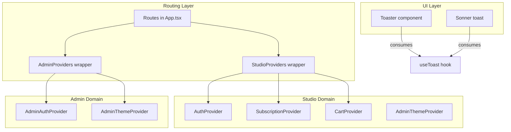
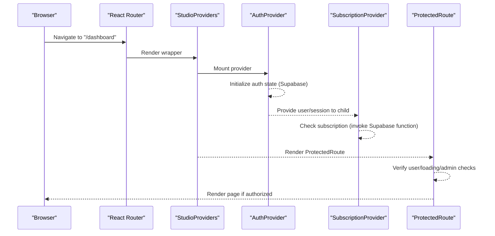
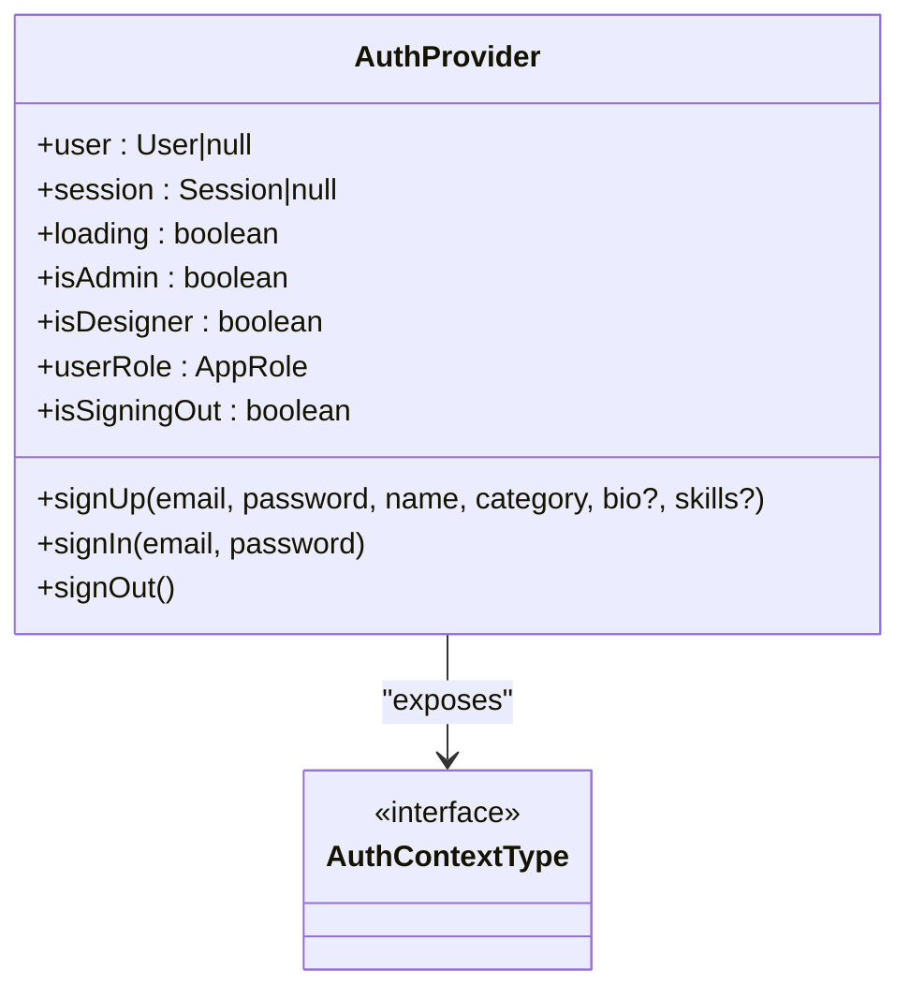
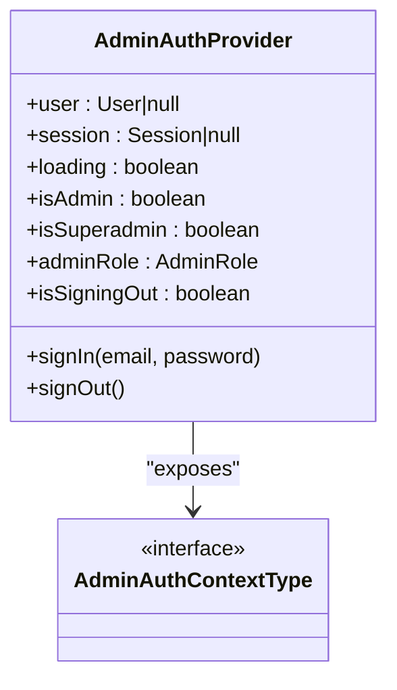
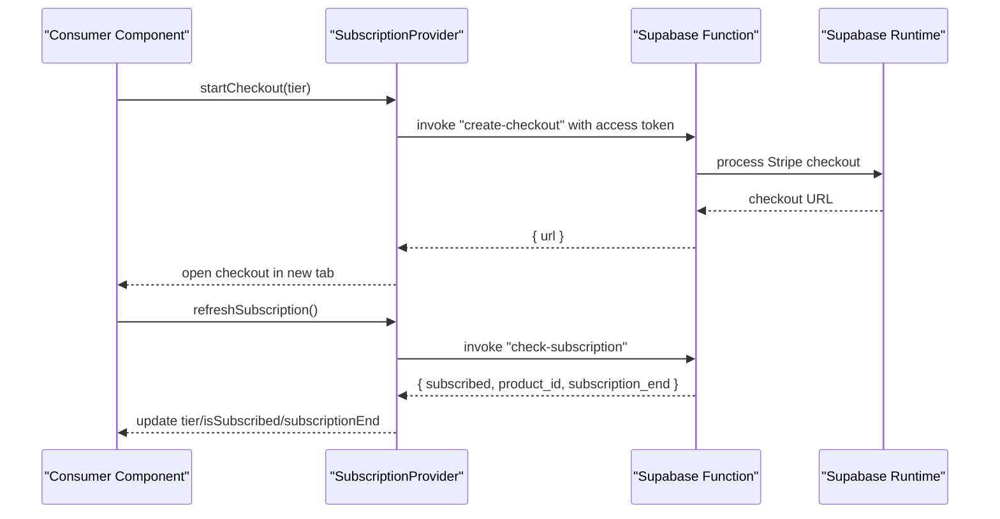
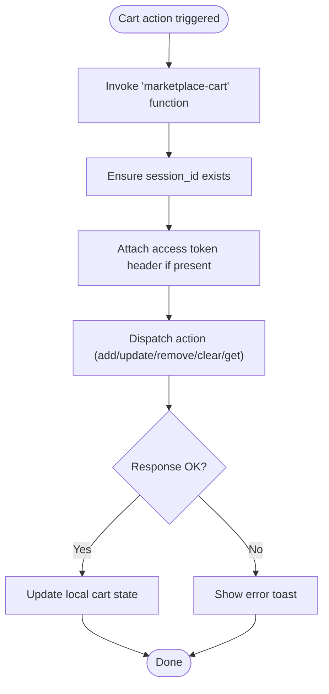
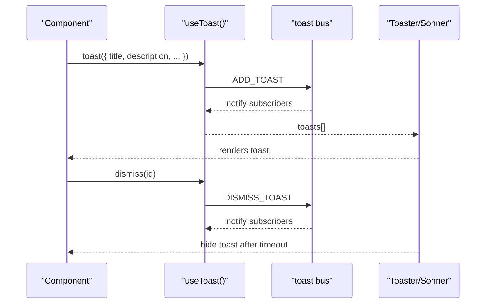
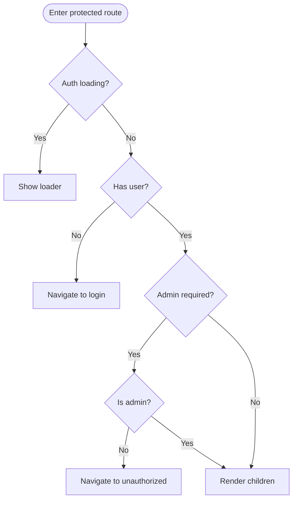
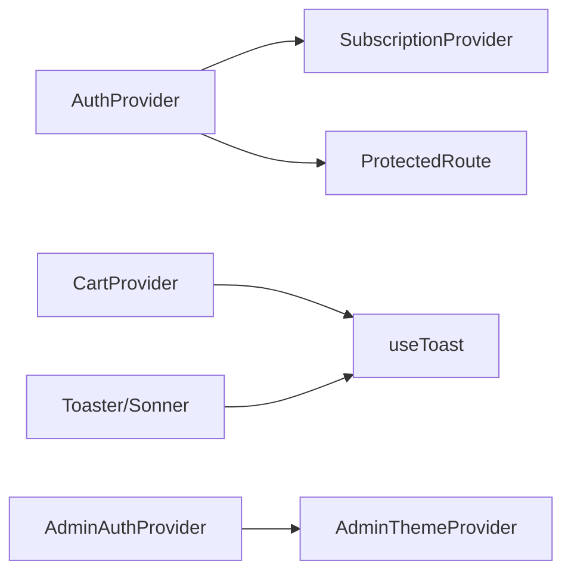

# Context Providers

<cite>
**Referenced Files in This Document**
- [App.tsx](file://src/App.tsx)
- [useAuth.tsx](file://src/hooks/useAuth.tsx)
- [useAdminAuth.tsx](file://src/hooks/useAdminAuth.tsx)
- [useAdminTheme.tsx](file://src/hooks/useAdminTheme.tsx)
- [useSubscription.tsx](file://src/hooks/useSubscription.tsx)
- [useCart.tsx](file://src/hooks/useCart.tsx)
- [use-toast.ts](file://src/hooks/use-toast.ts)
- [ProtectedRoute.tsx](file://src/components/auth/ProtectedRoute.tsx)
- [toaster.tsx](file://src/components/ui/toaster.tsx)
- [Dashboard.tsx](file://src/pages/Dashboard.tsx)
- [Subscription.tsx](file://src/pages/Subscription.tsx)
- [subscription.ts](file://src/lib/subscription.ts)
- [marketplace-cart/index.ts](file://supabase/functions/marketplace-cart/index.ts)
</cite>

## Table of Contents
1. [Introduction](#introduction)
2. [Project Structure](#project-structure)
3. [Core Components](#core-components)
4. [Architecture Overview](#architecture-overview)
5. [Detailed Component Analysis](#detailed-component-analysis)
6. [Dependency Analysis](#dependency-analysis)
7. [Performance Considerations](#performance-considerations)
8. [Troubleshooting Guide](#troubleshooting-guide)
9. [Conclusion](#conclusion)

## Introduction
This document explains the provider pattern implementation for managing global state in the application, focusing on authentication, subscription status, and toast notifications. It documents provider composition, context value structures, and state synchronization across components. It also covers provider setup, consumer usage, state update patterns, performance optimizations, re-render minimization, and state persistence strategies.

## Project Structure
The application composes providers at the routing layer to ensure consumers can access global state reliably. Providers are grouped by domain and responsibility:
- Authentication providers: studio and admin
- Subscription provider: studio-only
- UI state providers: theme, cart, toasts
- Routing protection: studio routes guarded by an auth-aware protected route wrapper

**Diagram sources**
- [App.tsx](file://src/App.tsx#L90-L110)
- [useAuth.tsx](file://src/hooks/useAuth.tsx#L22-L243)
- [useSubscription.tsx](file://src/hooks/useSubscription.tsx#L19-L161)
- [useCart.tsx](file://src/hooks/useCart.tsx#L57-L205)
- [useAdminAuth.tsx](file://src/hooks/useAdminAuth.tsx#L21-L207)
- [useAdminTheme.tsx](file://src/hooks/useAdminTheme.tsx#L15-L42)
- [toaster.tsx](file://src/components/ui/toaster.tsx#L4-L24)
- [use-toast.ts](file://src/hooks/use-toast.ts#L166-L187)

**Section sources**
- [App.tsx](file://src/App.tsx#L90-L110)

## Core Components
This section outlines the primary context providers and their responsibilities:
- AuthProvider: manages studio user session, roles, and auth actions
- AdminAuthProvider: manages admin session and roles
- AdminThemeProvider: manages admin UI theme persistence
- SubscriptionProvider: manages subscription tier, status, and checkout actions
- CartProvider: manages marketplace cart state and persistence
- useToast + Toaster/Sonner: centralized toast notification bus

Key value structures exposed by each provider:
- AuthContextType: user, session, loading flags, role booleans, and auth actions
- AdminAuthContextType: user, session, loading flags, admin role booleans, and admin actions
- SubscriptionContextType: tier, subscription status, expiry, loading/error, and management actions
- CartContextType: cart object, item count, loading flag, and cart mutation actions
- Toast bus: immutable toasts array and imperative actions to add/update/dismiss/remove

**Section sources**
- [useAuth.tsx](file://src/hooks/useAuth.tsx#L7-L20)
- [useAdminAuth.tsx](file://src/hooks/useAdminAuth.tsx#L7-L17)
- [useSubscription.tsx](file://src/hooks/useSubscription.tsx#L6-L15)
- [useCart.tsx](file://src/hooks/useCart.tsx#L34-L43)
- [use-toast.ts](file://src/hooks/use-toast.ts#L49-L51)

## Architecture Overview
The provider stack is composed per-route group to isolate concerns and reduce unnecessary re-renders:
- Studio routes are wrapped in a provider chain that includes Auth and Subscription providers
- Admin routes are wrapped in a separate chain with AdminAuthProvider and AdminThemeProvider
- Toast notifications are globally available via Toaster and Sonner components
- ProtectedRoute ensures studio routes are accessible only when authenticated

**Diagram sources**
- [App.tsx](file://src/App.tsx#L90-L110)
- [useAuth.tsx](file://src/hooks/useAuth.tsx#L51-L100)
- [useSubscription.tsx](file://src/hooks/useSubscription.tsx#L27-L76)
- [ProtectedRoute.tsx](file://src/components/auth/ProtectedRoute.tsx#L11-L41)

## Detailed Component Analysis

### Authentication Provider (Studio)
AuthProvider encapsulates studio user state and role resolution. It:
- Listens to Supabase auth state changes
- Resolves user roles from a dedicated roles table
- Syncs auth state across browser tabs
- Exposes sign-up, sign-in, and sign-out actions

**Diagram sources**
- [useAuth.tsx](file://src/hooks/useAuth.tsx#L22-L243)

**Section sources**
- [useAuth.tsx](file://src/hooks/useAuth.tsx#L22-L243)

### Admin Authentication Provider
AdminAuthProvider isolates admin session and roles:
- Uses a separate Supabase admin client
- Enforces role checks against the roles table
- Prevents unauthorized access attempts
- Persists admin theme preference locally

**Diagram sources**
- [useAdminAuth.tsx](file://src/hooks/useAdminAuth.tsx#L21-L207)

**Section sources**
- [useAdminAuth.tsx](file://src/hooks/useAdminAuth.tsx#L21-L207)

### Subscription Provider
SubscriptionProvider depends on AuthProvider and integrates with serverless functions for subscription checks and management:
- Periodically refreshes subscription status
- Exposes checkout and customer portal actions
- Defaults to a free tier gracefully on errors

**Diagram sources**
- [useSubscription.tsx](file://src/hooks/useSubscription.tsx#L78-L120)
- [subscription.ts](file://src/lib/subscription.ts#L105-L109)

**Section sources**
- [useSubscription.tsx](file://src/hooks/useSubscription.tsx#L19-L161)
- [subscription.ts](file://src/lib/subscription.ts#L1-L151)

### Cart Provider (Marketplace)
CartProvider manages the marketplace cart state with persistence for guests and integration with Supabase functions:
- Generates a session ID for guest carts
- Invokes a cart function to add, update, remove, and clear items
- Enriches items with product and designer data
- Integrates with toast notifications for user feedback

**Diagram sources**
- [useCart.tsx](file://src/hooks/useCart.tsx#L67-L85)
- [marketplace-cart/index.ts](file://supabase/functions/marketplace-cart/index.ts#L101-L135)

**Section sources**
- [useCart.tsx](file://src/hooks/useCart.tsx#L57-L205)
- [marketplace-cart/index.ts](file://supabase/functions/marketplace-cart/index.ts#L97-L138)

### Toast Bus (Centralized Notifications)
The toast bus maintains a single source of truth for toast notifications:
- Immutable toasts array
- Actions to add, update, dismiss, and remove toasts
- Automatic cleanup timers
- Consumers subscribe via useToast

**Diagram sources**
- [use-toast.ts](file://src/hooks/use-toast.ts#L137-L164)
- [toaster.tsx](file://src/components/ui/toaster.tsx#L4-L24)

**Section sources**
- [use-toast.ts](file://src/hooks/use-toast.ts#L166-L187)
- [toaster.tsx](file://src/components/ui/toaster.tsx#L4-L24)

### ProtectedRoute Composition
ProtectedRoute composes studio auth state to guard routes:
- Redirects unauthenticated users to the appropriate login
- Optionally requires admin privileges
- Handles loading states while auth resolves

**Diagram sources**
- [ProtectedRoute.tsx](file://src/components/auth/ProtectedRoute.tsx#L11-L41)

**Section sources**
- [ProtectedRoute.tsx](file://src/components/auth/ProtectedRoute.tsx#L1-L42)

## Dependency Analysis
Provider dependencies and coupling:
- SubscriptionProvider depends on AuthProvider (user/session)
- ProtectedRoute depends on AuthProvider (user, loading, isAdmin)
- CartProvider depends on Supabase session and toast bus
- Toast bus is decoupled and consumed by any component
- Admin domain providers are isolated from studio providers

**Diagram sources**
- [useAuth.tsx](file://src/hooks/useAuth.tsx#L22-L243)
- [useSubscription.tsx](file://src/hooks/useSubscription.tsx#L19-L161)
- [ProtectedRoute.tsx](file://src/components/auth/ProtectedRoute.tsx#L11-L15)
- [useCart.tsx](file://src/hooks/useCart.tsx#L57-L205)
- [use-toast.ts](file://src/hooks/use-toast.ts#L166-L187)
- [toaster.tsx](file://src/components/ui/toaster.tsx#L4-L24)
- [useAdminAuth.tsx](file://src/hooks/useAdminAuth.tsx#L21-L207)
- [useAdminTheme.tsx](file://src/hooks/useAdminTheme.tsx#L15-L42)

**Section sources**
- [App.tsx](file://src/App.tsx#L90-L110)

## Performance Considerations
- Minimize re-renders by composing providers close to the routing boundary and avoiding unnecessary wrapping higher in the tree
- Keep provider state granular; expose only what consumers need (e.g., pass callbacks instead of entire state objects)
- Use memoized callbacks in providers (e.g., useCallback) to avoid recreating functions on each render
- Debounce or throttle frequent updates (e.g., periodic subscription refresh)
- Persist UI preferences locally (e.g., admin theme) to avoid repeated reads
- Avoid blocking UI during network calls; surface loading states and default safely on errors
- Use stable refs to prevent stale closures in long-lived effects

## Troubleshooting Guide
Common issues and resolutions:
- Auth state not syncing across tabs: ensure storage event handling is active and scoped to the correct keys
- Subscription checks failing: gracefully default to free tier and surface user-friendly messages
- Toasts not appearing: confirm Toaster/Sonner is rendered and useToast is called within the provider scope
- Protected route redirects looping: verify the login path and state handling logic
- Cart mutations not reflected: ensure session_id is persisted for guests and access token is attached when signed in

**Section sources**
- [useAuth.tsx](file://src/hooks/useAuth.tsx#L36-L49)
- [useSubscription.tsx](file://src/hooks/useSubscription.tsx#L46-L76)
- [toaster.tsx](file://src/components/ui/toaster.tsx#L4-L24)
- [ProtectedRoute.tsx](file://src/components/auth/ProtectedRoute.tsx#L29-L38)
- [useCart.tsx](file://src/hooks/useCart.tsx#L48-L65)

## Conclusion
The provider pattern in this application is organized around domain boundaries and composability. Studio and admin domains are isolated, with shared UI concerns (theme, toasts) integrated centrally. Consumers access global state through typed contexts and hooks, with careful attention to error handling, persistence, and performance. Following the patterns documented here ensures predictable state synchronization and maintainable provider composition.