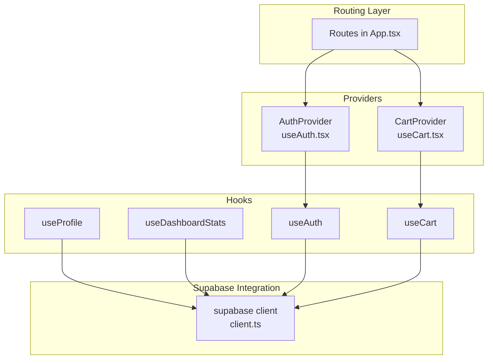
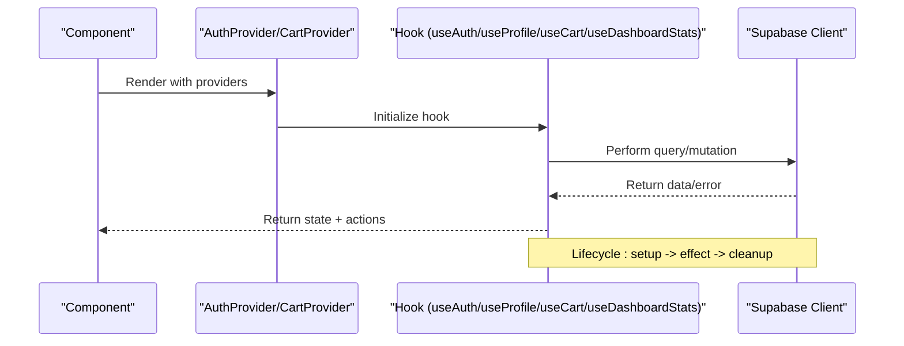
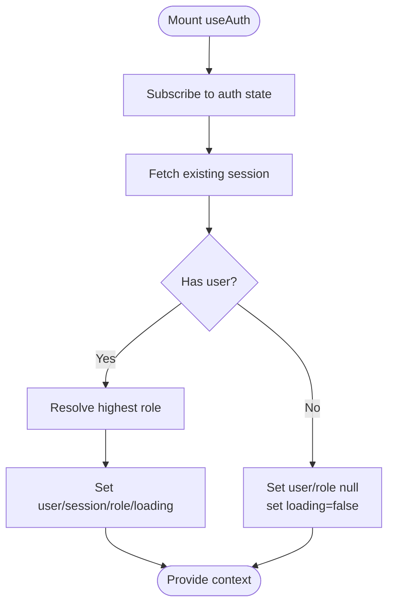
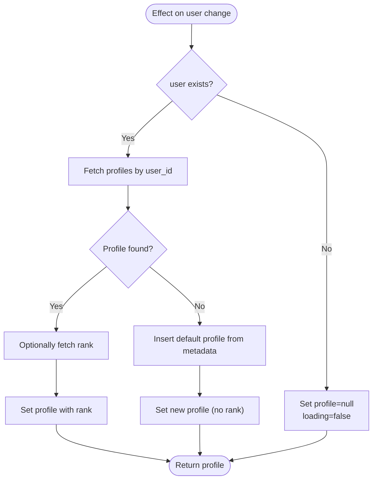
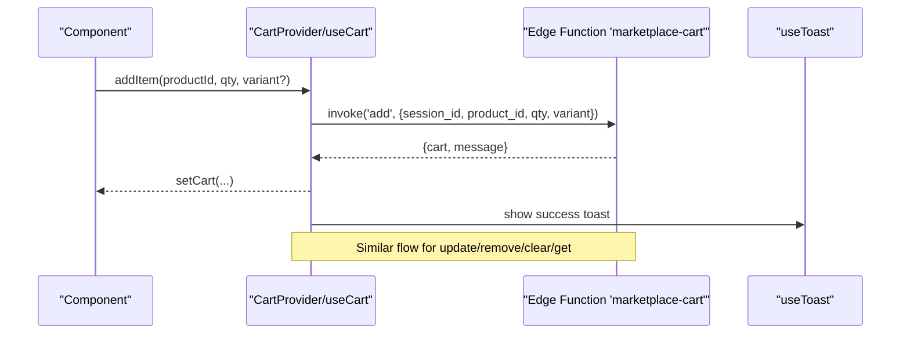
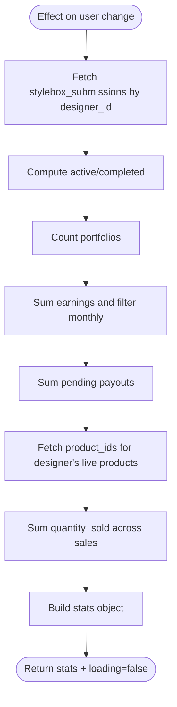
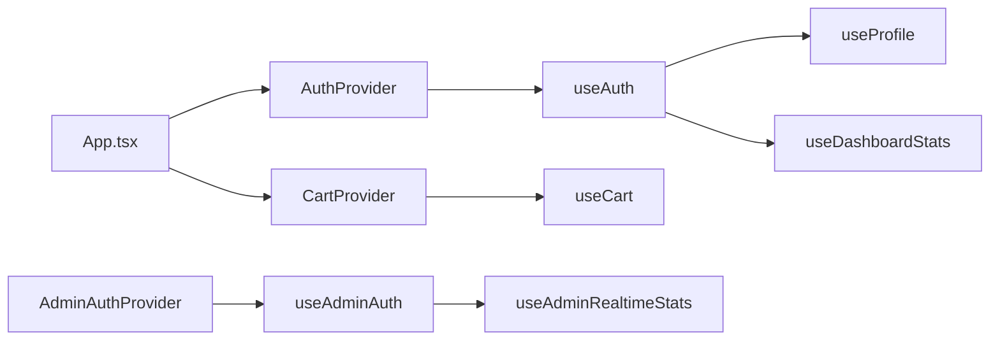
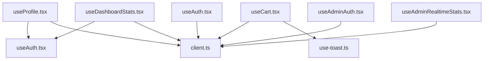

# Custom Hooks Architecture

<cite>
**Referenced Files in This Document**
- [useAuth.tsx](file://src/hooks/useAuth.tsx)
- [useProfile.tsx](file://src/hooks/useProfile.tsx)
- [useCart.tsx](file://src/hooks/useCart.tsx)
- [useDashboardStats.tsx](file://src/hooks/useDashboardStats.tsx)
- [client.ts](file://src/integrations/supabase/client.ts)
- [App.tsx](file://src/App.tsx)
- [useAdminAuth.tsx](file://src/hooks/useAdminAuth.tsx)
- [useAdminRealtimeStats.tsx](file://src/hooks/useAdminRealtimeStats.tsx)
- [useNotifications.tsx](file://src/hooks/useNotifications.tsx)
- [use-toast.ts](file://src/hooks/use-toast.ts)
</cite>

## Table of Contents
1. [Introduction](#introduction)
2. [Project Structure](#project-structure)
3. [Core Components](#core-components)
4. [Architecture Overview](#architecture-overview)
5. [Detailed Component Analysis](#detailed-component-analysis)
6. [Dependency Analysis](#dependency-analysis)
7. [Performance Considerations](#performance-considerations)
8. [Troubleshooting Guide](#troubleshooting-guide)
9. [Conclusion](#conclusion)

## Introduction
This document explains the custom hooks architecture used for building reusable, composable data-fetching and state-management capabilities across the application. It focuses on four primary hooks—useAuth, useProfile, useCart, and useDashboardStats—detailing their design patterns, composition strategies, dependency management, lifecycle handling, and performance characteristics. It also covers how these hooks encapsulate Supabase client interactions, expose clean interfaces to components, and coordinate with providers and routing.

## Project Structure
The hooks live under src/hooks and integrate with Supabase clients defined in src/integrations/supabase. Providers wrap routes to supply authentication and cart contexts to components. The App component orchestrates provider placement and route composition.

**Diagram sources**
- [App.tsx](file://src/App.tsx#L112-L347)
- [useAuth.tsx](file://src/hooks/useAuth.tsx#L22-L243)
- [useCart.tsx](file://src/hooks/useCart.tsx#L57-L205)
- [client.ts](file://src/integrations/supabase/client.ts#L11-L17)

**Section sources**
- [App.tsx](file://src/App.tsx#L112-L347)
- [client.ts](file://src/integrations/supabase/client.ts#L11-L17)

## Core Components
- useAuth: Centralized authentication state, role resolution, and auth actions (sign-up, sign-in, sign-out). Provides derived booleans (isAdmin, isDesigner) and multi-tab synchronization.
- useProfile: User profile retrieval and creation, optional rank association, and profile updates via upsert with controlled field filtering.
- useCart: Shopping cart state management via Supabase Edge Functions, guest session persistence, and toast-driven UX feedback.
- useDashboardStats: Designer dashboard metrics aggregation using multiple table queries and date-based computations.

**Section sources**
- [useAuth.tsx](file://src/hooks/useAuth.tsx#L7-L251)
- [useProfile.tsx](file://src/hooks/useProfile.tsx#L13-L153)
- [useCart.tsx](file://src/hooks/useCart.tsx#L34-L213)
- [useDashboardStats.tsx](file://src/hooks/useDashboardStats.tsx#L15-L121)

## Architecture Overview
The hooks follow a consistent pattern:
- Encapsulate Supabase interactions behind a single client instance.
- Expose a minimal, predictable interface (state + actions).
- Manage lifecycle via React effects and cleanup.
- Compose with other hooks to build higher-order data flows.

**Diagram sources**
- [useAuth.tsx](file://src/hooks/useAuth.tsx#L51-L100)
- [useProfile.tsx](file://src/hooks/useProfile.tsx#L19-L93)
- [useCart.tsx](file://src/hooks/useCart.tsx#L87-L187)
- [useDashboardStats.tsx](file://src/hooks/useDashboardStats.tsx#L28-L118)

## Detailed Component Analysis

### useAuth: Authentication State and Actions
- Responsibilities
  - Subscribe to Supabase auth state changes and synchronize across tabs.
  - Resolve user roles from a dedicated table and derive role-aware booleans.
  - Provide sign-up, sign-in, and sign-out actions with logging and error handling.
  - Manage loading and signing-out states.
- Composition and Dependencies
  - Uses the shared Supabase client and reacts to session changes.
  - Derives computed flags (isAdmin, isDesigner) from resolved role.
- Parameter Handling and Return Values
  - Returns user, session, loading, role flags, and action functions.
- Lifecycle and Cleanup
  - Subscribes to auth state changes on mount and unsubscribes on unmount.
  - Uses a mounted flag to avoid state updates after unmount.
- Error Handling and UX
  - Logs auth actions and errors; avoids exposing PII in logs.

**Diagram sources**
- [useAuth.tsx](file://src/hooks/useAuth.tsx#L51-L133)

**Section sources**
- [useAuth.tsx](file://src/hooks/useAuth.tsx#L7-L251)
- [client.ts](file://src/integrations/supabase/client.ts#L11-L17)

### useProfile: Profile Retrieval, Creation, and Updates
- Responsibilities
  - Fetch profile for the current user; create if missing using user metadata.
  - Optionally join rank data and expose combined result.
  - Provide controlled updateProfile via upsert with known-field filtering.
- Parameter Handling and Return Values
  - Accepts partial updates and filters against known fields to avoid errors.
  - Returns profile, loading, error, and update functions.
- Lifecycle and Cleanup
  - Runs effect when user changes; sets loading/error appropriately.
- Error Handling and UX
  - Catches and surfaces errors while initializing/loading.

**Diagram sources**
- [useProfile.tsx](file://src/hooks/useProfile.tsx#L19-L93)

**Section sources**
- [useProfile.tsx](file://src/hooks/useProfile.tsx#L13-L153)

### useCart: Cart State via Supabase Edge Functions
- Responsibilities
  - Manage cart state using a Supabase Edge Function named marketplace-cart.
  - Persist a guest session identifier in localStorage for anonymous users.
  - Provide addItem, updateQuantity, removeItem, clearCart, and refreshCart.
  - Integrate with a toast system for user feedback.
- Parameter Handling and Return Values
  - addItem/updateQuantity/removeItem accept productId, quantity, and optional variant.
  - refreshCart returns normalized cart data.
- Lifecycle and Cleanup
  - Calls refreshCart on mount; cart context is global via provider.
- Error Handling and UX
  - Catches errors and displays user-friendly toasts; preserves cart state on failures.

**Diagram sources**
- [useCart.tsx](file://src/hooks/useCart.tsx#L67-L187)
- [use-toast.ts](file://src/hooks/use-toast.ts#L166-L184)

**Section sources**
- [useCart.tsx](file://src/hooks/useCart.tsx#L34-L213)
- [use-toast.ts](file://src/hooks/use-toast.ts#L166-L184)

### useDashboardStats: Designer Metrics Aggregation
- Responsibilities
  - Compute dashboard metrics for the authenticated designer:
    - Active and completed stylebox submissions
    - Portfolio items count
    - Total and monthly earnings
    - Pending payouts
    - Products sold (aggregated from product sales)
- Parameter Handling and Return Values
  - Depends on user identity; returns stats object and loading flag.
- Lifecycle and Cleanup
  - Runs effect when user changes; sets loading during fetch.
- Error Handling and UX
  - Catches errors and sets loading to false on completion.

**Diagram sources**
- [useDashboardStats.tsx](file://src/hooks/useDashboardStats.tsx#L28-L118)

**Section sources**
- [useDashboardStats.tsx](file://src/hooks/useDashboardStats.tsx#L15-L121)

### Hook Composition Patterns and Provider Orchestration
- Provider Placement
  - AuthProvider wraps Studio routes; CartProvider wraps marketplace routes.
  - Admin routes use AdminAuthProvider and AdminThemeProvider.
- Composition Examples
  - useProfile depends on useAuth to guard fetches and to construct profile data.
  - useDashboardStats depends on useAuth to scope queries to the current user.
  - useCart depends on useToast for user feedback and localStorage for guest sessions.
- Dependency Management
  - All hooks import the shared Supabase client and respect its configuration (auto-refresh tokens, persisted sessions).
  - useAdminAuth and useAdminRealtimeStats demonstrate a separate admin client and RPC/realtime patterns.

**Diagram sources**
- [App.tsx](file://src/App.tsx#L90-L338)
- [useAuth.tsx](file://src/hooks/useAuth.tsx#L22-L243)
- [useProfile.tsx](file://src/hooks/useProfile.tsx#L13-L153)
- [useDashboardStats.tsx](file://src/hooks/useDashboardStats.tsx#L15-L121)
- [useCart.tsx](file://src/hooks/useCart.tsx#L57-L205)
- [useAdminAuth.tsx](file://src/hooks/useAdminAuth.tsx#L21-L207)
- [useAdminRealtimeStats.tsx](file://src/hooks/useAdminRealtimeStats.tsx#L24-L208)

**Section sources**
- [App.tsx](file://src/App.tsx#L90-L338)
- [client.ts](file://src/integrations/supabase/client.ts#L11-L17)

## Dependency Analysis
- Internal Dependencies
  - useProfile depends on useAuth and Supabase client.
  - useDashboardStats depends on useAuth and Supabase client.
  - useCart depends on Supabase client, localStorage, and useToast.
  - useAuth and useAdminAuth depend on Supabase client and localStorage.
- External Dependencies
  - Supabase client configured with automatic token refresh and persisted sessions.
  - React Query is used in related hooks (e.g., useAdminRealtimeStats) for caching and refetching.

**Diagram sources**
- [useProfile.tsx](file://src/hooks/useProfile.tsx#L1-L153)
- [useDashboardStats.tsx](file://src/hooks/useDashboardStats.tsx#L1-L121)
- [useCart.tsx](file://src/hooks/useCart.tsx#L1-L213)
- [useAuth.tsx](file://src/hooks/useAuth.tsx#L1-L251)
- [useAdminAuth.tsx](file://src/hooks/useAdminAuth.tsx#L1-L216)
- [useAdminRealtimeStats.tsx](file://src/hooks/useAdminRealtimeStats.tsx#L1-L209)
- [client.ts](file://src/integrations/supabase/client.ts#L1-L17)
- [use-toast.ts](file://src/hooks/use-toast.ts#L1-L186)

**Section sources**
- [useProfile.tsx](file://src/hooks/useProfile.tsx#L1-L153)
- [useDashboardStats.tsx](file://src/hooks/useDashboardStats.tsx#L1-L121)
- [useCart.tsx](file://src/hooks/useCart.tsx#L1-L213)
- [useAuth.tsx](file://src/hooks/useAuth.tsx#L1-L251)
- [useAdminAuth.tsx](file://src/hooks/useAdminAuth.tsx#L1-L216)
- [useAdminRealtimeStats.tsx](file://src/hooks/useAdminRealtimeStats.tsx#L1-L209)
- [client.ts](file://src/integrations/supabase/client.ts#L1-L17)
- [use-toast.ts](file://src/hooks/use-toast.ts#L1-L186)

## Performance Considerations
- Token Refresh and Flicker Mitigation
  - useAuth ignores TOKEN_REFRESHED events when a session exists to prevent unnecessary re-renders.
- Avoiding Stale Closures
  - useAuth maintains a ref to the latest user to prevent stale closures in callbacks.
- Controlled Field Updates
  - useProfile filters updates to known fields to reduce mutation errors and improve reliability.
- Guest Session Persistence
  - useCart persists a guest session ID in localStorage to maintain cart state across visits.
- Real-time vs Polling
  - Related hooks (e.g., useAdminRealtimeStats) combine RPC-based stats with Postgres changes for near-real-time updates and periodic refetch intervals.
- Toast Feedback
  - useCart leverages useToast to provide immediate, non-blocking UX feedback without heavy rerenders.

[No sources needed since this section provides general guidance]

## Troubleshooting Guide
- Auth State Not Updating Across Tabs
  - Ensure multi-tab sync listens for storage events and resets state only on explicit sign-out.
- Role Resolution Issues
  - Confirm the user_roles table contains the expected roles and that checkUserRole runs after auth state settles.
- Profile Creation Failures
  - Verify that user metadata (name, category) is present; otherwise, defaults are used.
- Cart Operations Failures
  - Check that the marketplace-cart Edge Function is deployed and accessible; confirm session_id generation and Authorization header usage.
- Dashboard Stats Incorrect
  - Validate that designer_id matches the authenticated user and that related tables (earnings, payouts, sales) are populated.
- Real-time Updates Not Received
  - Confirm channel subscriptions are active and cleaned up properly; ensure RPCs and Postgres changes are configured.

**Section sources**
- [useAuth.tsx](file://src/hooks/useAuth.tsx#L36-L49)
- [useProfile.tsx](file://src/hooks/useProfile.tsx#L56-L82)
- [useCart.tsx](file://src/hooks/useCart.tsx#L67-L85)
- [useDashboardStats.tsx](file://src/hooks/useDashboardStats.tsx#L34-L114)
- [useAdminRealtimeStats.tsx](file://src/hooks/useAdminRealtimeStats.tsx#L113-L184)

## Conclusion
The custom hooks architecture centralizes Supabase interactions, enforces predictable interfaces, and composes cleanly with providers and routing. useAuth establishes a robust foundation for role-aware flows, useProfile ensures consistent profile state, useCart delivers a resilient shopping experience, and useDashboardStats aggregates designer metrics efficiently. Together, they provide a scalable, maintainable pattern for data-fetching and state management across the application.