# State Management

<cite>
**Referenced Files in This Document**
- [src/hooks/useAuth.tsx](file://src/hooks/useAuth.tsx)
- [src/hooks/useAdminAuth.tsx](file://src/hooks/useAdminAuth.tsx)
- [src/hooks/useProfile.tsx](file://src/hooks/useProfile.tsx)
- [src/hooks/useTeamData.tsx](file://src/hooks/useTeamData.tsx)
- [src/hooks/useDashboardStats.tsx](file://src/hooks/useDashboardStats.tsx)
- [src/hooks/useMarketplaceProducts.tsx](file://src/hooks/useMarketplaceProducts.tsx)
- [src/hooks/useArticles.tsx](file://src/hooks/useArticles.tsx)
- [src/hooks/useNotifications.tsx](file://src/hooks/useNotifications.tsx)
- [src/hooks/useCart.tsx](file://src/hooks/useCart.tsx)
- [src/hooks/usePortfolioData.tsx](file://src/hooks/usePortfolioData.tsx)
- [src/hooks/useActiveStyleboxes.tsx](file://src/hooks/useActiveStyleboxes.tsx)
- [src/hooks/useAdminProducts.tsx](file://src/hooks/useAdminProducts.tsx)
- [src/hooks/useAdminRealtimeStats.tsx](file://src/hooks/useAdminRealtimeStats.tsx)
- [src/hooks/useAnalyticsData.tsx](file://src/hooks/useAnalyticsData.tsx)
- [src/hooks/useGlobalSearch.tsx](file://src/hooks/useGlobalSearch.tsx)
- [src/integrations/supabase/client.ts](file://src/integrations/supabase/client.ts)
- [src/integrations/supabase/admin-client.ts](file://src/integrations/supabase/admin-client.ts)
- [src/App.tsx](file://src/App.tsx)
- [src/main.tsx](file://src/main.tsx)
</cite>

## Table of Contents
1. [Introduction](#introduction)
2. [Project Structure](#project-structure)
3. [Core Components](#core-components)
4. [Architecture Overview](#architecture-overview)
5. [Detailed Component Analysis](#detailed-component-analysis)
6. [Dependency Analysis](#dependency-analysis)
7. [Performance Considerations](#performance-considerations)
8. [Troubleshooting Guide](#troubleshooting-guide)
9. [Conclusion](#conclusion)

## Introduction
This document explains the state management architecture of the Adorzia platform. It covers custom React hooks, TanStack Query usage, context providers, Supabase-based server state, real-time synchronization, optimistic updates, caching, error handling, loading states, and performance optimization strategies. The goal is to help developers understand how data flows across components, how server state is synchronized, and how to debug and optimize state-related behavior.

## Project Structure
The state management spans several areas:
- Authentication contexts for studio and admin portals
- Local state hooks for user profiles, teams, dashboards, and analytics
- TanStack Query queries and mutations for marketplace, articles, admin products, and global search
- A cart context provider for marketplace shopping
- Real-time subscriptions via Supabase for notifications and admin dashboards

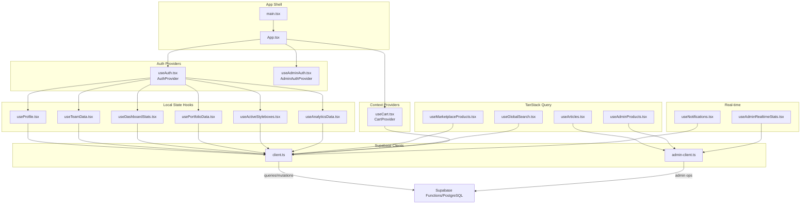

**Diagram sources**
- [src/main.tsx](file://src/main.tsx)
- [src/App.tsx](file://src/App.tsx)
- [src/hooks/useAuth.tsx](file://src/hooks/useAuth.tsx)
- [src/hooks/useAdminAuth.tsx](file://src/hooks/useAdminAuth.tsx)
- [src/hooks/useProfile.tsx](file://src/hooks/useProfile.tsx)
- [src/hooks/useTeamData.tsx](file://src/hooks/useTeamData.tsx)
- [src/hooks/useDashboardStats.tsx](file://src/hooks/useDashboardStats.tsx)
- [src/hooks/usePortfolioData.tsx](file://src/hooks/usePortfolioData.tsx)
- [src/hooks/useActiveStyleboxes.tsx](file://src/hooks/useActiveStyleboxes.tsx)
- [src/hooks/useAnalyticsData.tsx](file://src/hooks/useAnalyticsData.tsx)
- [src/hooks/useMarketplaceProducts.tsx](file://src/hooks/useMarketplaceProducts.tsx)
- [src/hooks/useArticles.tsx](file://src/hooks/useArticles.tsx)
- [src/hooks/useAdminProducts.tsx](file://src/hooks/useAdminProducts.tsx)
- [src/hooks/useGlobalSearch.tsx](file://src/hooks/useGlobalSearch.tsx)
- [src/hooks/useCart.tsx](file://src/hooks/useCart.tsx)
- [src/hooks/useNotifications.tsx](file://src/hooks/useNotifications.tsx)
- [src/hooks/useAdminRealtimeStats.tsx](file://src/hooks/useAdminRealtimeStats.tsx)
- [src/integrations/supabase/client.ts](file://src/integrations/supabase/client.ts)
- [src/integrations/supabase/admin-client.ts](file://src/integrations/supabase/admin-client.ts)

**Section sources**
- [src/main.tsx](file://src/main.tsx)
- [src/App.tsx](file://src/App.tsx)

## Core Components
- Authentication contexts: Provide user/session state, role checks, and sign-in/sign-out actions for studio and admin portals.
- Local state hooks: Encapsulate server reads/writes for profiles, teams, dashboards, portfolio, active styleboxes, and analytics.
- TanStack Query: Centralized caching, background refetching, and optimistic updates for marketplace listings, article CRUD, admin product management, and global search.
- Cart context: Manages marketplace cart state with server-backed persistence and toast feedback.
- Real-time subscriptions: Notifications and admin dashboard activity streams powered by Supabase Postgres changes.

**Section sources**
- [src/hooks/useAuth.tsx](file://src/hooks/useAuth.tsx)
- [src/hooks/useAdminAuth.tsx](file://src/hooks/useAdminAuth.tsx)
- [src/hooks/useProfile.tsx](file://src/hooks/useProfile.tsx)
- [src/hooks/useTeamData.tsx](file://src/hooks/useTeamData.tsx)
- [src/hooks/useDashboardStats.tsx](file://src/hooks/useDashboardStats.tsx)
- [src/hooks/usePortfolioData.tsx](file://src/hooks/usePortfolioData.tsx)
- [src/hooks/useActiveStyleboxes.tsx](file://src/hooks/useActiveStyleboxes.tsx)
- [src/hooks/useAnalyticsData.tsx](file://src/hooks/useAnalyticsData.tsx)
- [src/hooks/useMarketplaceProducts.tsx](file://src/hooks/useMarketplaceProducts.tsx)
- [src/hooks/useArticles.tsx](file://src/hooks/useArticles.tsx)
- [src/hooks/useAdminProducts.tsx](file://src/hooks/useAdminProducts.tsx)
- [src/hooks/useGlobalSearch.tsx](file://src/hooks/useGlobalSearch.tsx)
- [src/hooks/useCart.tsx](file://src/hooks/useCart.tsx)
- [src/hooks/useNotifications.tsx](file://src/hooks/useNotifications.tsx)
- [src/hooks/useAdminRealtimeStats.tsx](file://src/hooks/useAdminRealtimeStats.tsx)

## Architecture Overview
The platform uses a hybrid state model:
- Server-first state via Supabase (auth, tables, RPCs, functions)
- Client-side caching and invalidation via TanStack Query
- Local state for UI concerns and ephemeral data
- Context providers for cross-cutting concerns (cart)
- Real-time updates via Supabase Postgres changes

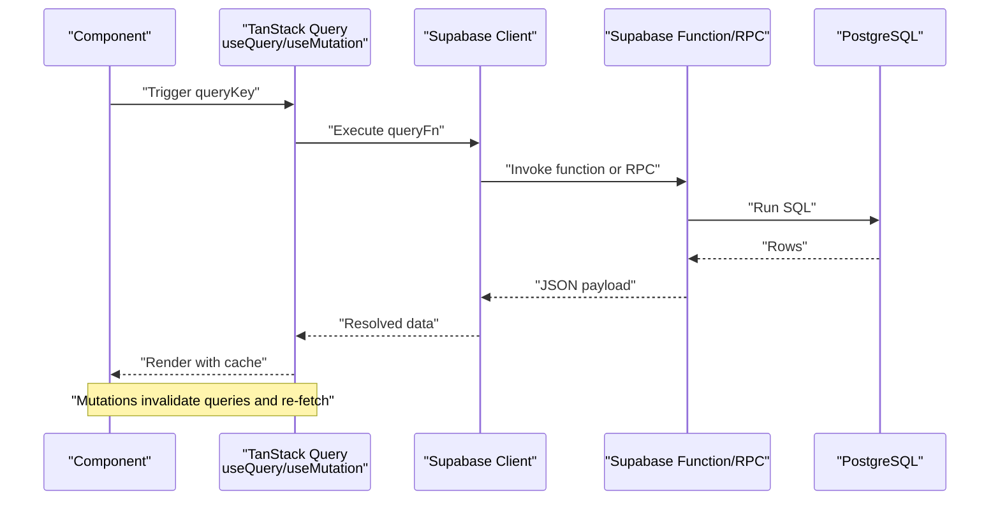

**Diagram sources**
- [src/hooks/useMarketplaceProducts.tsx](file://src/hooks/useMarketplaceProducts.tsx)
- [src/hooks/useArticles.tsx](file://src/hooks/useArticles.tsx)
- [src/hooks/useAdminProducts.tsx](file://src/hooks/useAdminProducts.tsx)
- [src/hooks/useGlobalSearch.tsx](file://src/hooks/useGlobalSearch.tsx)
- [src/integrations/supabase/client.ts](file://src/integrations/supabase/client.ts)
- [src/integrations/supabase/admin-client.ts](file://src/integrations/supabase/admin-client.ts)

## Detailed Component Analysis

### Authentication Contexts
Studio and admin portals each maintain separate contexts with:
- Auth state listeners and session synchronization across tabs
- Role resolution against user roles
- Sign-in/sign-out with logging and scoped sessions
- Loading and signing-out flags

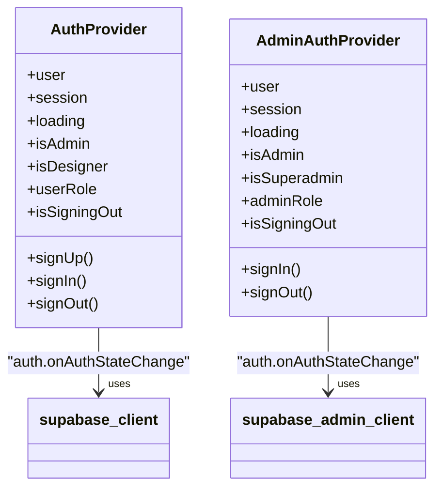

**Diagram sources**
- [src/hooks/useAuth.tsx](file://src/hooks/useAuth.tsx)
- [src/hooks/useAdminAuth.tsx](file://src/hooks/useAdminAuth.tsx)
- [src/integrations/supabase/client.ts](file://src/integrations/supabase/client.ts)
- [src/integrations/supabase/admin-client.ts](file://src/integrations/supabase/admin-client.ts)

**Section sources**
- [src/hooks/useAuth.tsx](file://src/hooks/useAuth.tsx)
- [src/hooks/useAdminAuth.tsx](file://src/hooks/useAdminAuth.tsx)

### Profile Hook
- Reads/writes profile data with automatic creation if missing
- Loads associated rank data
- Provides updateProfile with safe field filtering and optimistic UI updates

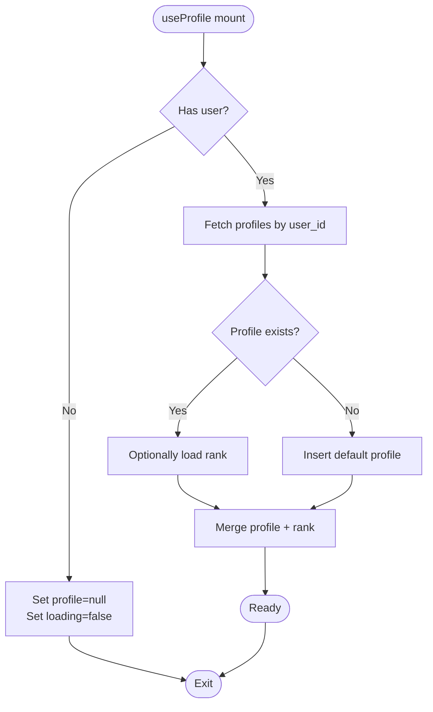

**Diagram sources**
- [src/hooks/useProfile.tsx](file://src/hooks/useProfile.tsx)
- [src/integrations/supabase/client.ts](file://src/integrations/supabase/client.ts)

**Section sources**
- [src/hooks/useProfile.tsx](file://src/hooks/useProfile.tsx)

### Team Data Hook
- Resolves current user’s team membership
- Loads team members’ profiles
- Computes active project from team stylebox submissions

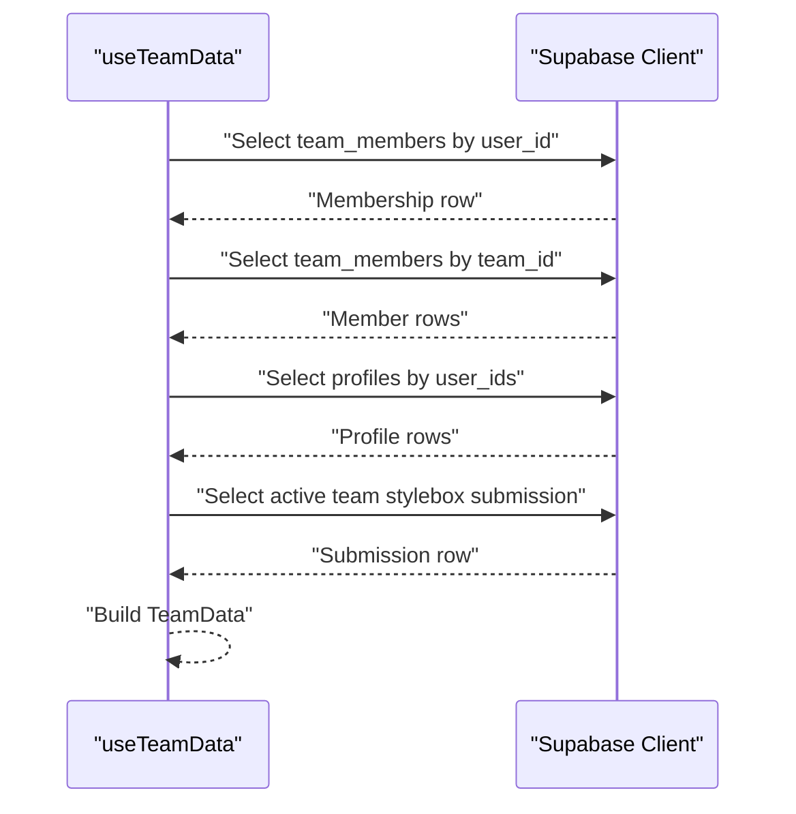

**Diagram sources**
- [src/hooks/useTeamData.tsx](file://src/hooks/useTeamData.tsx)
- [src/integrations/supabase/client.ts](file://src/integrations/supabase/client.ts)

**Section sources**
- [src/hooks/useTeamData.tsx](file://src/hooks/useTeamData.tsx)

### Dashboard Stats Hook
- Aggregates stylebox submissions, portfolio items, earnings, payouts, and products sold
- Uses server-side counts and filters

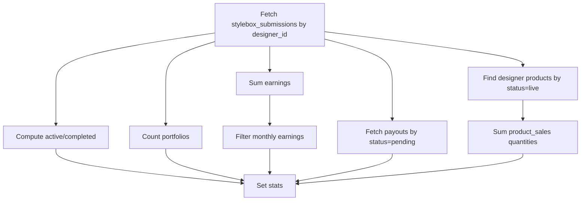

**Diagram sources**
- [src/hooks/useDashboardStats.tsx](file://src/hooks/useDashboardStats.tsx)
- [src/integrations/supabase/client.ts](file://src/integrations/supabase/client.ts)

**Section sources**
- [src/hooks/useDashboardStats.tsx](file://src/hooks/useDashboardStats.tsx)

### Analytics Data Hook
- Uses RPC to compute consolidated stats
- Builds revenue charts, top products, and recent transactions
- Aggregates from earnings, product_sales, and marketplace_products

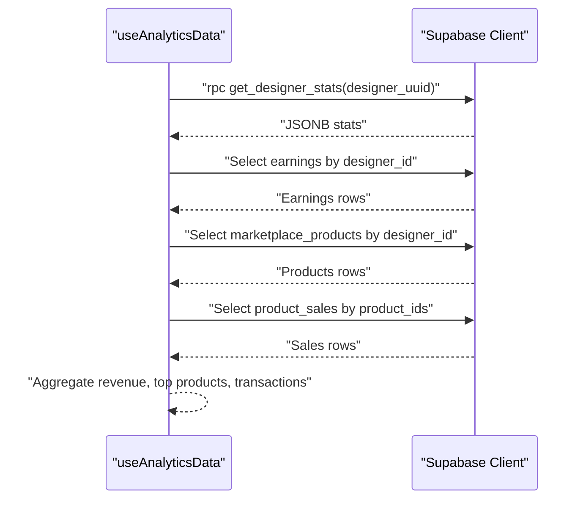

**Diagram sources**
- [src/hooks/useAnalyticsData.tsx](file://src/hooks/useAnalyticsData.tsx)
- [src/integrations/supabase/client.ts](file://src/integrations/supabase/client.ts)

**Section sources**
- [src/hooks/useAnalyticsData.tsx](file://src/hooks/useAnalyticsData.tsx)

### Marketplace Products (TanStack Query)
- Queries marketplace products, categories, collections via Supabase Functions
- Supports filters, sorting, pagination
- Uses enabled flags and staleTime for performance

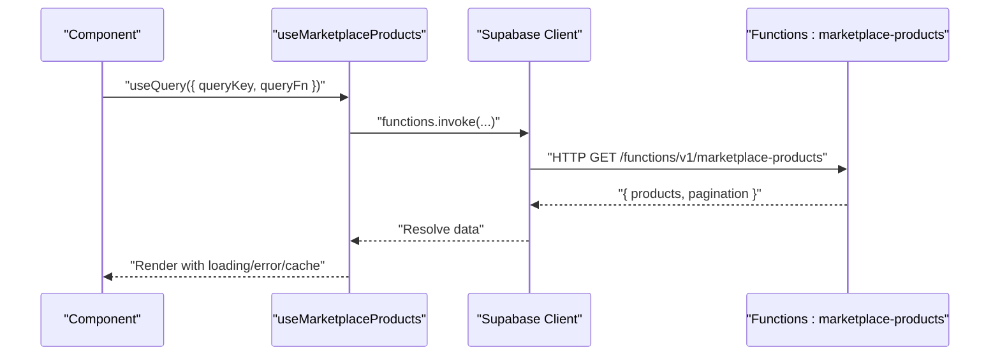

**Diagram sources**
- [src/hooks/useMarketplaceProducts.tsx](file://src/hooks/useMarketplaceProducts.tsx)
- [src/integrations/supabase/client.ts](file://src/integrations/supabase/client.ts)

**Section sources**
- [src/hooks/useMarketplaceProducts.tsx](file://src/hooks/useMarketplaceProducts.tsx)

### Articles (Admin CRUD with TanStack Query)
- Lists, filters, and paginates articles using admin client
- Mutations create/update/delete with toast feedback and query invalidation

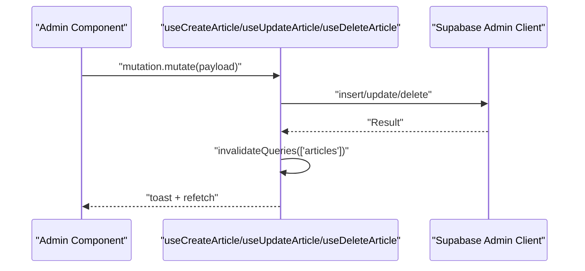

**Diagram sources**
- [src/hooks/useArticles.tsx](file://src/hooks/useArticles.tsx)
- [src/integrations/supabase/admin-client.ts](file://src/integrations/supabase/admin-client.ts)

**Section sources**
- [src/hooks/useArticles.tsx](file://src/hooks/useArticles.tsx)

### Admin Products (TanStack Query + Optimistic Updates)
- Admin CRUD for marketplace products with mutations
- Optimistic updates: UI reflects changes immediately; server errors revert silently

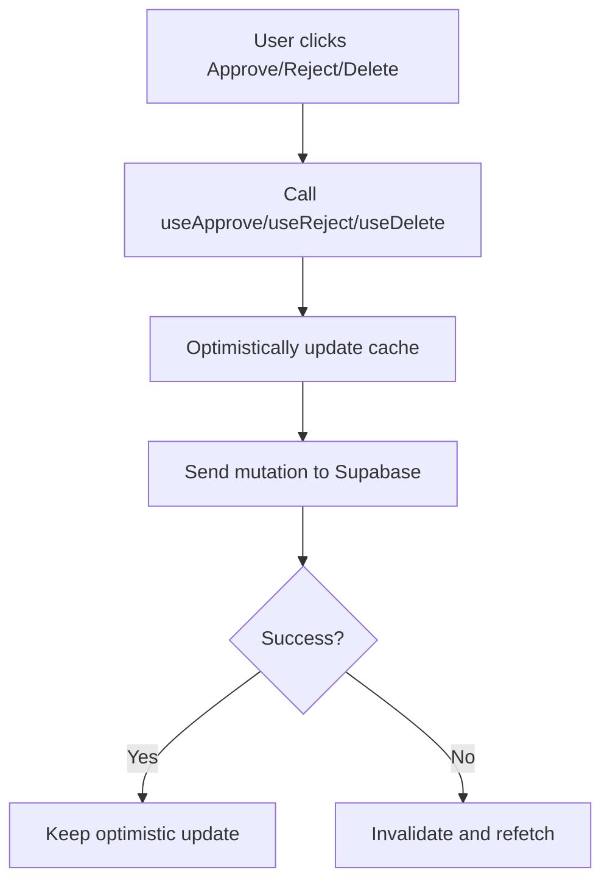

**Diagram sources**
- [src/hooks/useAdminProducts.tsx](file://src/hooks/useAdminProducts.tsx)
- [src/integrations/supabase/admin-client.ts](file://src/integrations/supabase/admin-client.ts)

**Section sources**
- [src/hooks/useAdminProducts.tsx](file://src/hooks/useAdminProducts.tsx)

### Global Search (TanStack Query)
- RPC-based search with result limiting
- Follow/unfollow helpers and follower counts

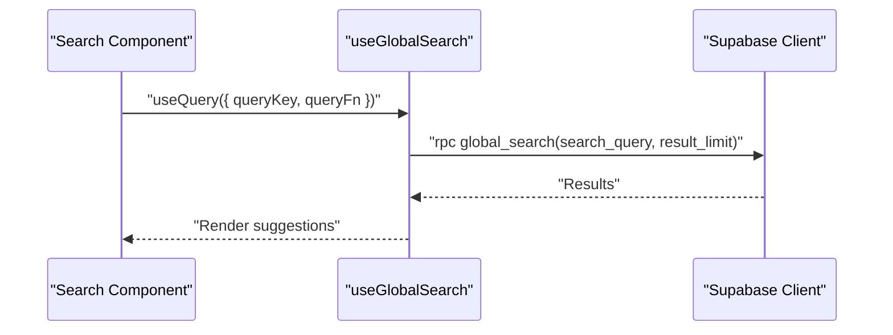

**Diagram sources**
- [src/hooks/useGlobalSearch.tsx](file://src/hooks/useGlobalSearch.tsx)
- [src/integrations/supabase/client.ts](file://src/integrations/supabase/client.ts)

**Section sources**
- [src/hooks/useGlobalSearch.tsx](file://src/hooks/useGlobalSearch.tsx)

### Cart Context Provider
- Centralized cart state with server-backed persistence
- Actions: add, update quantity, remove, clear
- Toast feedback and loading states

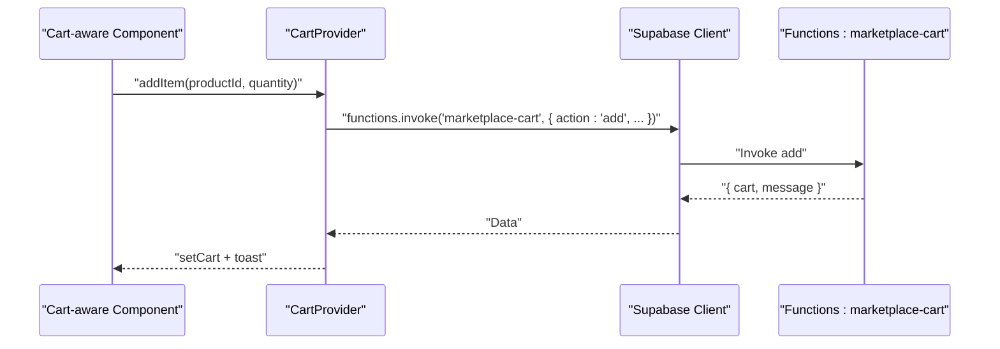

**Diagram sources**
- [src/hooks/useCart.tsx](file://src/hooks/useCart.tsx)
- [src/integrations/supabase/client.ts](file://src/integrations/supabase/client.ts)

**Section sources**
- [src/hooks/useCart.tsx](file://src/hooks/useCart.tsx)

### Notifications (Real-time)
- Fetches recent notifications
- Subscribes to real-time INSERT/UPDATE events per user
- Supports mark-as-read, mark-all-as-read, and delete

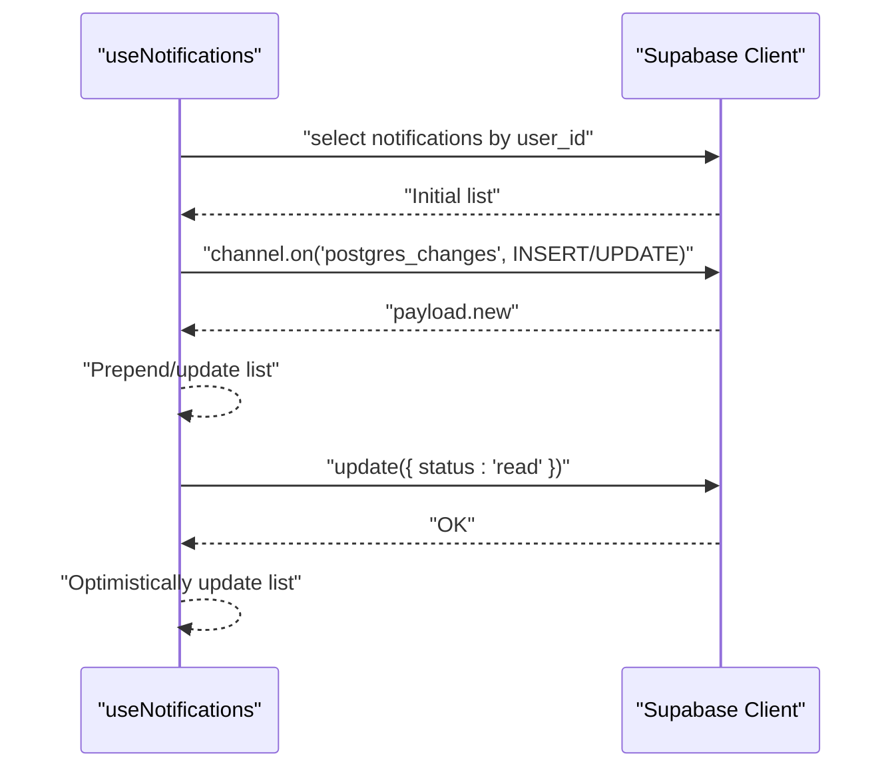

**Diagram sources**
- [src/hooks/useNotifications.tsx](file://src/hooks/useNotifications.tsx)
- [src/integrations/supabase/client.ts](file://src/integrations/supabase/client.ts)

**Section sources**
- [src/hooks/useNotifications.tsx](file://src/hooks/useNotifications.tsx)

### Admin Real-time Stats
- Periodic refetch of RPC stats
- Real-time subscriptions to profiles, stylebox_submissions, portfolio_publications, and earnings
- Builds combined activity feed

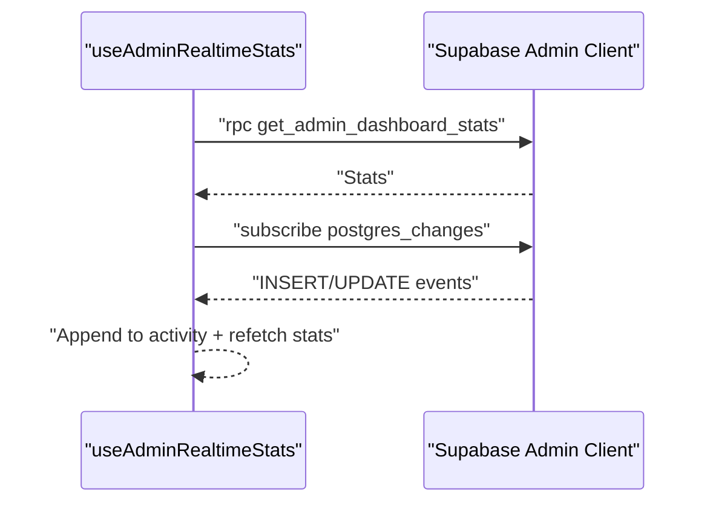

**Diagram sources**
- [src/hooks/useAdminRealtimeStats.tsx](file://src/hooks/useAdminRealtimeStats.tsx)
- [src/integrations/supabase/admin-client.ts](file://src/integrations/supabase/admin-client.ts)

**Section sources**
- [src/hooks/useAdminRealtimeStats.tsx](file://src/hooks/useAdminRealtimeStats.tsx)

## Dependency Analysis
- Hooks depend on Supabase clients for auth, queries, RPCs, and functions
- TanStack Query orchestrates caching, invalidation, and refetching
- Context providers encapsulate cross-cutting state (cart)
- Real-time subscriptions rely on Supabase Postgres changes

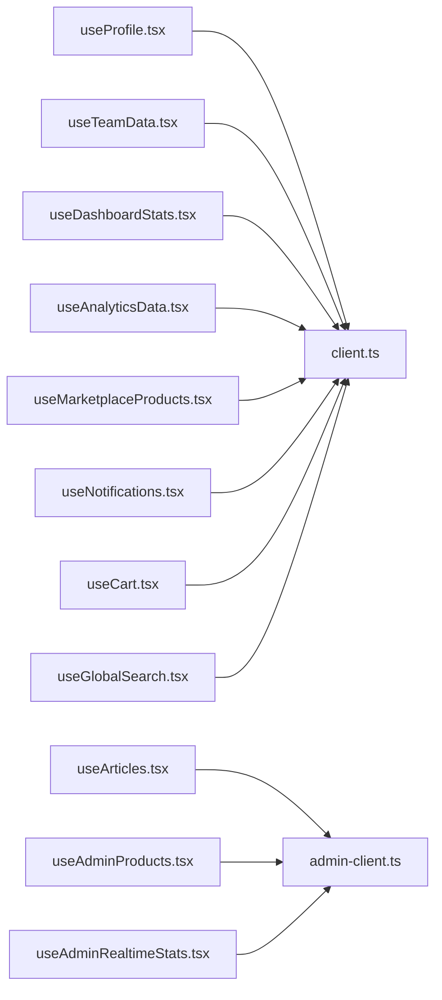

**Diagram sources**
- [src/hooks/useProfile.tsx](file://src/hooks/useProfile.tsx)
- [src/hooks/useTeamData.tsx](file://src/hooks/useTeamData.tsx)
- [src/hooks/useDashboardStats.tsx](file://src/hooks/useDashboardStats.tsx)
- [src/hooks/useAnalyticsData.tsx](file://src/hooks/useAnalyticsData.tsx)
- [src/hooks/useMarketplaceProducts.tsx](file://src/hooks/useMarketplaceProducts.tsx)
- [src/hooks/useArticles.tsx](file://src/hooks/useArticles.tsx)
- [src/hooks/useAdminProducts.tsx](file://src/hooks/useAdminProducts.tsx)
- [src/hooks/useNotifications.tsx](file://src/hooks/useNotifications.tsx)
- [src/hooks/useAdminRealtimeStats.tsx](file://src/hooks/useAdminRealtimeStats.tsx)
- [src/hooks/useCart.tsx](file://src/hooks/useCart.tsx)
- [src/hooks/useGlobalSearch.tsx](file://src/hooks/useGlobalSearch.tsx)
- [src/integrations/supabase/client.ts](file://src/integrations/supabase/client.ts)
- [src/integrations/supabase/admin-client.ts](file://src/integrations/supabase/admin-client.ts)

**Section sources**
- [src/hooks/useProfile.tsx](file://src/hooks/useProfile.tsx)
- [src/hooks/useTeamData.tsx](file://src/hooks/useTeamData.tsx)
- [src/hooks/useDashboardStats.tsx](file://src/hooks/useDashboardStats.tsx)
- [src/hooks/useAnalyticsData.tsx](file://src/hooks/useAnalyticsData.tsx)
- [src/hooks/useMarketplaceProducts.tsx](file://src/hooks/useMarketplaceProducts.tsx)
- [src/hooks/useArticles.tsx](file://src/hooks/useArticles.tsx)
- [src/hooks/useAdminProducts.tsx](file://src/hooks/useAdminProducts.tsx)
- [src/hooks/useNotifications.tsx](file://src/hooks/useNotifications.tsx)
- [src/hooks/useAdminRealtimeStats.tsx](file://src/hooks/useAdminRealtimeStats.tsx)
- [src/hooks/useCart.tsx](file://src/hooks/useCart.tsx)
- [src/hooks/useGlobalSearch.tsx](file://src/hooks/useGlobalSearch.tsx)
- [src/integrations/supabase/client.ts](file://src/integrations/supabase/client.ts)
- [src/integrations/supabase/admin-client.ts](file://src/integrations/supabase/admin-client.ts)

## Performance Considerations
- Caching and staleness
  - TanStack Query keys are granular (e.g., ["articles", filters], ["marketplace-products", filters]) enabling precise cache targeting.
  - StaleTime configured for global search to reduce network calls.
- Background refetching
  - Admin realtime stats refetch periodically to keep numbers fresh.
- Minimal re-renders
  - Prefer returning memoized callbacks from providers (e.g., CartProvider) to avoid unnecessary prop updates.
- Network efficiency
  - Use enabled flags to defer queries until inputs are ready (e.g., article detail by slug).
- Real-time efficiency
  - Subscribe only to necessary channels and tables; unsubscribe on unmount.
- Optimistic updates
  - Apply immediate UI changes for mutations; rely on server responses to confirm or roll back.

[No sources needed since this section provides general guidance]

## Troubleshooting Guide
- Auth state not syncing across tabs
  - Verify storage event handling and token key prefixes for both studio and admin contexts.
- Role checks failing
  - Confirm user roles exist in the user_roles table and that role resolution logic runs after session initialization.
- TanStack Query not updating
  - Ensure mutation onSuccess invalidates the correct query keys and that query keys match between reads and invalidations.
- Real-time not firing
  - Check channel names and filters; confirm table permissions and presence of postgres_changes triggers.
- Cart operations failing
  - Inspect function invocation headers and session ID generation; verify toast feedback for user-visible errors.
- RPC errors
  - Validate RPC names and parameters; wrap in try/catch and surface user-friendly messages.

**Section sources**
- [src/hooks/useAuth.tsx](file://src/hooks/useAuth.tsx)
- [src/hooks/useAdminAuth.tsx](file://src/hooks/useAdminAuth.tsx)
- [src/hooks/useArticles.tsx](file://src/hooks/useArticles.tsx)
- [src/hooks/useAdminProducts.tsx](file://src/hooks/useAdminProducts.tsx)
- [src/hooks/useNotifications.tsx](file://src/hooks/useNotifications.tsx)
- [src/hooks/useCart.tsx](file://src/hooks/useCart.tsx)
- [src/hooks/useGlobalSearch.tsx](file://src/hooks/useGlobalSearch.tsx)

## Conclusion
Adorzia’s state management blends Supabase server state with TanStack Query for robust caching and real-time updates, while custom hooks and context providers encapsulate domain-specific logic. The architecture supports optimistic updates, precise cache invalidation, and scalable real-time features. Following the patterns documented here ensures predictable state flow, efficient performance, and maintainable debugging practices.